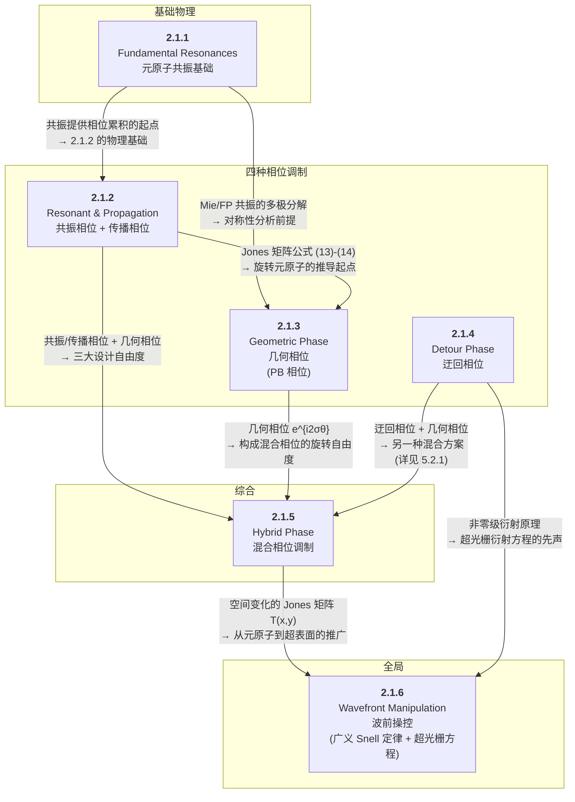

# 2.1 元原子与相位调制机制 — 章节总结

> [!abstract] Section 2.1 的整体逻辑
> Section 2.1 构建了超表面设计的**完整底层理论体系**：从元原子的**基本共振物理**出发（2.1.1），依次建立**四种相位调制机制**（2.1.2–2.1.4），通过**混合相位**统合后（2.1.5），最终将单个元原子的电磁响应推广到**二维超表面的波前操控**（2.1.6）。六节层层递进，形成"共振 → 相位 → 混合 → 波前"的完整逻辑链。

## 整体逻辑架构

## 六节逐层递进详解

### 第一层：共振物理（2.1.1）— "原子的性质"

> [!important] [[2.1.1 Fundamental Resonances in Meta-Atoms]]
> **核心问题**：元原子为什么能调控光？

| 元原子类型 | 共振模式 | 物理机制 | 特征参数 |
|:-----------|:---------|:---------|:---------|
| 金属 | 局域表面等离激元 (LSPR) | 自由电子集体振荡 | Q ~ 2–10，强局域场增强 |
| 介质 | Mie-like 模式（径向）+ FP-like 模式（轴向） | 位移电流激发 | Q 可达数十，低损耗 |
| 周期性排列 | 晶格模式 (Lattice modes) | 元原子间耦合 | 局域/非局域，高 Q |

> **关键概念**：BIC（束缚态）、准 BIC、Fano 共振 ($q$ 参数)、Q 因子提取、多极分解（ED/MD/EQ/MQ）

**→ 为 2.1.2–2.1.3 提供了物理基础**：共振频率附近显著的相位累积是共振相位的起点；Mie 模式的多极分解（ED/MD 等强度干涉 → 第一 Kerker 条件）是 Huygens 超表面的核心。

---

### 第二层：两种"物质相位"（2.1.2）— "改变元原子形状/尺寸"

> [!important] [[2.1.2 Resonant and Propagation Phase Modulation Mechanisms]]
> **核心问题**：如何通过调节元原子自身结构实现 $2\pi$ 相位覆盖？

| 机制 | 物理原理 | 核心公式 | 带宽 | 高宽比 |
|:-----|:---------|:---------|:-----|:-----|
| **共振相位** | 共振频率附近的相位跳变 + ED/MD Kerker 干涉 | — | 窄带 | 低 → 易制造 |
| **传播相位** | 截断波导中的导波相位累积 | $\phi = \frac{2\pi}{\lambda_0} n_{\mathrm{eff}} h$ (3) | 宽带 | 高 → 难制造 |

> **关键贡献**：
> - **Huygens 超表面**：ED/MD 等强度干涉 → 抑制后向散射 → 近单位透射率 + $2\pi$ 相位覆盖
> - **Jones 矩阵与对称性分析**：面外对称 (8)、面内对称 (9)–(10)、互易性 (12)–(13)、共振/传播相位的 Jones 矩阵 (14)
> - **材料色散修正**：$n_{\mathrm{eff}}(\lambda_0)$ 的色散 + 共振相位 $\phi_{\mathrm{res}}(\lambda_0)$

> [!note] 与 2.1.1 的衔接
> 2.1.1 的**共振理论**是本节"共振相位"的直接物理基础（共振 → 频率依赖的相位累积 [126]）；Mie 理论中的 **ED 和 MD 模式**是 Huygens 超表面 Kerker 条件的前提。

> [!note] 为 2.1.3 的铺垫
> 公式 (13)–(14) 的 Jones 矩阵 $\mathbf{T}_0 = \mathrm{diag}(t_x e^{i\phi_x}, t_y e^{i\phi_y})$ 是 2.1.3 推导**旋转后 Jones 矩阵** $\mathbf{T}(\theta) = \mathbf{R}(-\theta) \mathbf{T}_0 \mathbf{R}(\theta)$ 的起点。

---

### 第三层：几何相位（2.1.3）— "旋转元原子"

> [!important] [[2.1.3 Geometric Phase Modulation Mechanism]]
> **核心问题**：不改变元原子结构，仅通过旋转如何获得相位？

$$
\boxed{\phi_{\mathrm{geometric}} = 2\sigma\theta} \quad (\sigma = \pm 1 \text{ 对应 LCP/RCP})
$$

| 关键概念 | 公式 | 含义 |
|:---------|:-----|:-----|
| 几何相位 | (23) | 旋转角度 $\theta$ 的两倍，符号取决于入射圆偏振手性 |
| 偏振转换效率 (PCE) | (25) | 交叉偏振分量占总透射率的比例 |
| 半波片条件 | (26) | $\phi_x - \phi_y = \pm\pi$ → PCE 最大化 |
| 偏振不敏感条件 | — | $\theta \in \{0, \pi/2\}$ → $\sigma = \pm 1$ 几何相位一致 |

> **历史**：Pancharatnam (1956) → Berry (1984) → Hasman 组 (2001-2002) → Xie 广义几何相位 (2021)

> [!note] 与 2.1.2 的衔接
> 几何相位的推导**直接建立在** 2.1.2 提出的面内对称 Jones 矩阵 (13) 之上。公式 (14) $\mathbf{T}(\theta) = \mathbf{R}(-\theta) \mathbf{T}_0 \mathbf{R}(\theta)$ 中的 $\mathbf{T}_0$ 来自 2.1.2。

> [!note] 为 2.1.5 的铺垫
> 几何相位因子 $e^{i2\sigma\theta}$ 是 2.1.5 混合相位调制中**旋转自由度**的来源。

---

### 第四层：迂回相位（2.1.4）— "位移元原子"

> [!important] [[2.1.4 Detour Phase Modulation Mechanism]]
> **核心问题**：另一种"不改变结构"的相位机制——通过位移如何获得相位？

$$
\boxed{\phi_{\mathrm{detour}} = \sigma_{\mathrm{d}} \frac{2\pi}{a} \Delta d} \quad (\sigma_{\mathrm{d}} = M \text{ 为衍射级次})
$$

| 特性 | 几何相位 | 迂回相位 |
|:-----|:---------|:---------|
| 操作方式 | **旋转** | **位移** |
| 工作衍射级次 | 零级 | **非零级**（本质特征） |
| 波长依赖性 | 无 | 无 |
| 参数类比 | $\sigma$（偏振手性） | $\sigma_{\mathrm{d}}$（衍射级次） |

> **实验亮点**：Capasso 组 (2016) — 256×256 单元 a-Si 全息，可见光到近红外带宽，绝对效率 75%

> [!note] 与 2.1.5–2.1.6 的衔接
> 迂回相位 + 几何相位的混合调制见 5.2.1；非零级衍射的先声为 2.1.6 的超光栅方程中衍射项 $M\lambda_0/\Lambda$ 提供了物理背景。

---

### 第五层：混合相位（2.1.5）— "统合所有自由度"

> [!important] [[2.1.5 Hybrid Phase Modulation Mechanism]]
> **核心问题**：同时利用形状、尺寸、旋转角，能达到什么极限？

**核心定理**：任意**对称酉 Jones 矩阵** $\mathbf{J}$ 可分解为 $\mathbf{J} = \mathbf{V} \boldsymbol{\Lambda} \mathbf{V}^{\dagger}$，其中：
- $\boldsymbol{\Lambda}$（特征值）$\longleftrightarrow$ $\mathbf{T}_0$ = 元原子的**形状和尺寸**（共振/传播相位）
- $\mathbf{V}$（特征向量）$\longleftrightarrow$ $\mathbf{R}$ = 元原子的**旋转角**（几何相位）

**三大实验里程碑**：

| 工作 | 能力 | 性能 |
|:-----|:-----|:-----|
| **Faraon 2015** [143] | 任意偏振 → 任意偏振的相位变换 | 对称酉 Jones 矩阵可实现性证明 |
| **Mueller 2017** [169] | 任意正交偏振基的独立相位调制 | 椭圆 Si 柱，532 nm，RCP/LCP 狗/猫全息 |
| **Zhao 2018 / Hu 2020** [170,135] | 3 独立通道 → **12 偏振通道**全息 | 600–800 nm 宽带，全色彩 RGB 全息 |

> [!note] 与 2.1.2–2.1.4 的衔接
> 混合相位 = **2.1.2 的共振/传播相位**（形状尺寸 → $\boldsymbol{\Lambda}$）+ **2.1.3 的几何相位**（旋转角 → $\mathbf{V}$）+ **2.1.4 的迂回相位**（另一种混合方案，见 5.2.1）

> [!note] 为 2.1.6 的铺垫
> 混合相位产生的**特定偏振通道复振幅分布** $t e^{i\phi} = \vec{O}^{\top} \mathbf{T}(x,y) \vec{I}$ 是将元原子 Jones 矩阵推广到空间分布 $\mathbf{T}(x,y)$ 的直接桥梁。

---

### 第六层：波前操控（2.1.6）— "从微观到宏观"

> [!important] [[2.1.6 Wavefront Manipulation by Planar Arrangement of Meta-Atoms]]
> **核心问题**：单个元原子的电磁响应如何组织成整个超表面的波前操控？

**四重视角的统一理论**：

| 视角 | 核心方程 | 物理基础 | 是否含衍射 |
|:-----|:---------|:---------|:-----------|
| **波前变换** | $\phi(x) = kx\sin\alpha$ (56) | 相位补偿（波前匹配） | ✗ |
| **广义 Snell 定律** | $n_{\mathrm{t}} \sin\theta_{\mathrm{t}} - n_{\mathrm{i}} \sin\theta_{\mathrm{i}} = \frac{\lambda_0}{2\pi} \frac{\mathrm{d}\phi}{\mathrm{d}x}$ (57) | Fermat 原理 | ✗ |
| **动量守恒** | $\vec{k}_{\mathrm{t,T}} - \vec{k}_{\mathrm{i,T}} = \nabla \phi(x,y)$ (61) | 横向波矢守恒 | ✗ |
| **超光栅方程** | 公式 (67)–(70) | 动量守恒 + 周期衍射 | ✓ |

> [!note] 与前面各节的衔接
> - **从 2.1.5 的 $\mathbf{T}(x,y)$ 出发** → 聚焦特定偏振通道 → 简化为空间变化相移界面 $\phi(x,y)$
> - **从 2.1.4 的衍射级次概念出发** → 超光栅方程中的 $M\lambda_0/\Lambda$ 衍射项
> - **从 2.1.1 的共振出发** → 选择高透射率元原子的物理依据

## 跨节概念连接图

| 核心概念 | 首次出现 | 后续引用 | 最终整合 |
|:---------|:---------|:---------|:---------|
| **ED/MD 共振** | 2.1.1 | 2.1.2 (Kerker 条件) | 2.2.4 (非线性 THG 增强) |
| **Q 因子** | 2.1.1 (Fano 公式) | 2.2.3 (非局域高 Q 模式) | 2.2.4 (Quasi-BIC 增强 SHG) |
| **Jones 矩阵** | 2.1.2 ($\mathbf{T}_0$, 公式 13) | 2.1.3 ($\mathbf{T}(\theta)$, 公式 14) | 2.1.5 (混合相位 $\mathbf{J} = \mathbf{V} \boldsymbol{\Lambda} \mathbf{V}^{\dagger}$) |
| **旋转矩阵** | 2.1.3 ($\mathbf{R}(\theta)$, 公式 15) | 2.1.5 ($\mathbf{V} \leftrightarrow \mathbf{R}$) | 2.1.6 ($\mathbf{T}(x,y)$ 中的 $\theta(x,y)$) |
| **对称性 / 酉性** | 2.1.3 (公式 17, 19) | 2.1.5 (公式 37–38 约束) | 2.1.6 ($T_{xy} = T_{yx}$) |
| **相位色散** | 2.1.2 (传播相位的波长依赖) | 2.1.3 (几何相位无相位色散) | 2.1.4 (迂回相位无相位色散) |
| **衍射级次** | 2.1.4 ($\sigma_{\mathrm{d}} = M$) | 2.1.6 (超光栅方程 $M \lambda_0/\Lambda$) | — |
| **相位梯度** | 2.1.6 ($\mathrm{d}\phi/\mathrm{d}x$) | — | — |

## 四种相位机制对比总表

| 维度 | 共振相位 | 传播相位 | 几何相位 | 迂回相位 |
|:-----|:---------|:---------|:---------|:---------|
| **所在小节** | 2.1.2 | 2.1.2 | 2.1.3 | 2.1.4 |
| **调制方式** | 改变形状/尺寸 | 改变形状/尺寸 | **旋转**元原子 | **位移**元原子 |
| **物理原理** | 共振频率处相位跳变 | 截断波导中相位累积 | Pancharatnam-Berry 相位 | 非零级衍射的波前延迟 |
| **核心公式** | Kerker 条件 | $\phi = \frac{2\pi}{\lambda_0} n_{\mathrm{eff}} h$ | $\phi = 2\sigma\theta$ | $\phi = \sigma_{\mathrm{d}} \frac{2\pi}{a} \Delta d$ |
| **工作衍射级次** | 零级 | 零级 | 零级 | **非零级** |
| **相位色散** | 有（波长敏感） | 有（波长敏感） | **无** | **无** |
| **偏振要求** | 无 | 无 | **严格的圆偏振** | 原则上无（效率可能偏振相关） |
| **制造精度要求** | 高（结构敏感） | 高（结构敏感） | **低**（旋转角误差影响小） | **低**（位移误差影响小） |
| **元原子结构** | 各向异性 | 各向异性 | 各向异性（相同结构） | 相同结构 |
| **代表应用** | Huygens 超表面 | 超透镜、超光栅 | 宽带全息 | 宽带全息 |
| **与混合相位的关系** | ✅ 形状 → $\boldsymbol{\Lambda}$ | ✅ 形状 → $\boldsymbol{\Lambda}$ | ✅ 旋转 → $\mathbf{V}$ | ✅ 可与几何相位混合 (5.2.1) |

## 阅读建议

> [!tip] 按需跳读指南
>
> **如果只关心元原子的物理性质**：阅读 [[2.1.1 Fundamental Resonances in Meta-Atoms]]
>
> **如果只关心相位如何产生**：
> - 想了解元原子结构如何影响相位 → [[2.1.2 Resonant and Propagation Phase Modulation Mechanisms]]
> - 想了解旋转如何产生相位 → [[2.1.3 Geometric Phase Modulation Mechanism]]
> - 想了解位移如何产生相位 → [[2.1.4 Detour Phase Modulation Mechanism]]
>
> **如果关心如何组合这些机制**：阅读 [[2.1.5 Hybrid Phase Modulation Mechanism]]
>
> **如果关心超表面波前操控的全局理论**：阅读 [[2.1.6 Wavefront Manipulation by Planar Arrangement of Meta-Atoms]]
>
> **如果想了解更前沿的扩展**：
> - 高 Q 非局域模式 + 非线性 → 2.2 节（[[2.2.4 From Linear to Nonlinear Metasurfaces]]）
> - 多层超表面、复振幅调制、偏振复用 → 第 4 节（超透镜）和第 5 节（全息与复用）

## 参考文献索引

| 小节 | 核心参考文献 |
|:-----|:------------|
| 2.1.1 | [89] Mie (1908), [105] Koshelev (2019), [106] Kuznetsov (2016), [122] 位移电流 |
| 2.1.2 | [81] Kerker 条件, [127–130] Huygens 超表面, [135] 传播相位宽带, [140] Jones 矩阵对称性 |
| 2.1.3 | [148] Pancharatnam (1956), [149] Berry (1984), [151,152] Hasman 组 (2001-2002), [153] Xie 广义几何相位 (2021) |
| 2.1.4 | [161] Capasso 组 (2016), [165] Wang 流线型结构, [167] Deng 掠入射容差 |
| 2.1.5 | [143] Faraon 组 (2015), [169] Mueller (2017), [170] Zhao (2018), [135] Hu 全色彩全息 (2020) |
| 2.1.6 | [174] Yu et al., *Science* (2011) — 广义 Snell 定律, [175] Fermat 原理, [177] Li & Cen (2007) |
