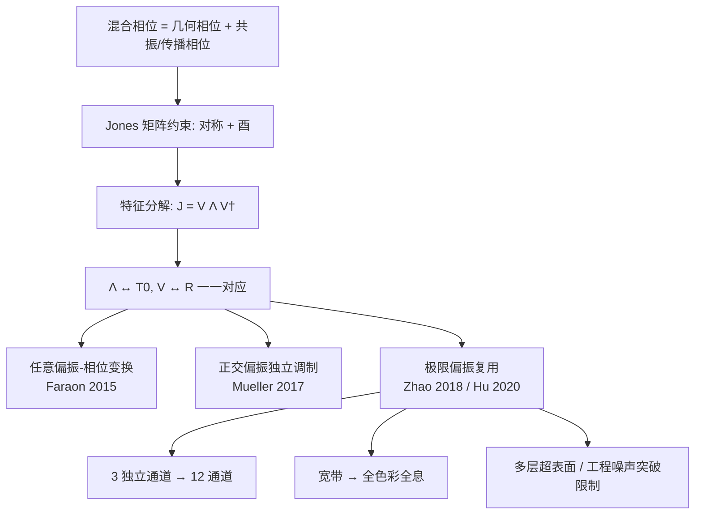

# 2.1.5 Hybrid Phase Modulation Mechanism

> [!abstract] 内容概要
> 本节介绍了混合相位调制机制——结合几何相位与共振/传播相位，利用元原子的形状、尺寸和旋转角等多重设计自由度，最大化正向设计的灵活性。涵盖对称酉 Jones 矩阵的分解定理、任意偏振-相位变换、正交偏振态独立相位调制、偏振复用通道极限（12 通道）、宽带全色彩全息，以及由混合相位向超表面波前操控一般理论的过渡。

## 引言：混合相位的设计哲学

> [!important] 核心思想
> 混合相位调制机制同时利用元原子的**形状、尺寸、旋转角度**等多种设计自由度，为正向设计提供**最大的灵活性**。

虽然本节聚焦于**几何相位 + 共振/传播相位**的组合，但混合相位也可通过其他组合实现：

| 混合方式 | 讨论章节 |
|:---------|:---------|
| 几何相位 + 共振/传播相位 | **本节** |
| 迂回相位 + 几何相位 | 5.2.1 |
| 拓扑相位 + 几何相位 | 2.2.6 |

## 数学框架：Jones 矩阵的可实现性

### 任意振幅和相位调制的 Jones 矩阵

对于固定波长，任意振幅和相位调制可由 Jones 矩阵描述：

$$
\mathbf{J} = \begin{pmatrix}
J_{xx} & J_{xy} \\
J_{yx} & J_{yy}
\end{pmatrix} \tag{36}
$$

其中 $J_{xx}, J_{xy}, J_{yx}, J_{yy}$ 均为**任意复数**（共 8 个实变量）。

### 单层超表面的约束

> [!warning] 单层超表面的可实现性限制
> 单层混合相位超表面的 Jones 矩阵为公式 (14) 形式，满足：
> - **对称性**：$\mathbf{J}^{\top} = \mathbf{J}$（公式 (17)）
> - **酉性**：$\mathbf{J}^{\dagger} \mathbf{J} = \mathbf{I}$（公式 (19)，假设 $t_x = t_y = 1$，忽略振幅调制）
>
> 公式 (14) 仅有 **3 个变量**（$\phi_x, \phi_y, \theta$），而公式 (36) 有 **8 个变量** → 单层超表面无法实现任意 Jones 矩阵。

### 对称酉矩阵的分解定理

> [!important] 核心数学定理
> 为使 Jones 矩阵 $\mathbf{J}$ 可由单层超表面实现，需满足**对称性**和**酉性**：
>
> $$
> \mathbf{J}^{\top} = \mathbf{J} \tag{37}
> $$
>
> $$
> \mathbf{J}^{\dagger} \mathbf{J} = \mathbf{I} \tag{38}
> $$

**数学分解**：任意对称酉矩阵 $\mathbf{J}$ 总可分解为：

$$
\mathbf{J} = \mathbf{V} \boldsymbol{\Lambda} \mathbf{V}^{\dagger}
$$

其中：
- $\mathbf{V}$ — **实酉矩阵**，由 $\mathbf{J}$ 的特征向量按列排列
- $\boldsymbol{\Lambda}$ — **对角矩阵**，对角元素为特征值（模为 1 的复数）

> [!info] 与混合相位的一一对应
> 比较 $\mathbf{J} = \mathbf{V} \boldsymbol{\Lambda} \mathbf{V}^{\dagger}$ 与公式 (14) 的 $\mathbf{T}(\theta) = \mathbf{R}(-\theta) \mathbf{T}_0 \mathbf{R}(\theta)$：
> - $\boldsymbol{\Lambda} \longleftrightarrow \mathbf{T}_0$（共振/传播相位 $\to$ 特征值）
> - $\mathbf{V} \longleftrightarrow \mathbf{R}$（旋转角 $\to$ 特征向量）
>
> **结论**：通过改变元原子的**形状、尺寸和旋转角**，可以实现**任意对称酉 Jones 矩阵** [143]。

## 应用一：任意偏振-相位变换

> [!success] Faraon 组 (2015) [143]
> 理论证明混合相位机制可实现从**任意入射偏振态**到**任意出射偏振态**的相位调制。

对于入射 Jones 矢量 $\vec{E}^{\mathrm{in}} = [E_x^{\mathrm{in}} \; E_y^{\mathrm{in}}]^{\top}$ 和出射 Jones 矢量 $\vec{E}^{\mathrm{out}} = [E_x^{\mathrm{out}} \; E_y^{\mathrm{out}}]^{\top}$：

$$
\vec{E}^{\mathrm{out}} = \mathbf{J} \vec{E}^{\mathrm{in}} \tag{39}
$$

$\mathbf{J}$ 受 (37)–(38) 约束。结合 (36)–(39)，可从以下方程组解出 $\mathbf{J}$ 的各元素：

$$
|J_{xx}| = \left| \frac{E_x^{\mathrm{out}} E_x^{\mathrm{in}*} - E_y^{\mathrm{out}*} E_y^{\mathrm{in}}}{|E_x^{\mathrm{in}}|^2 + |E_y^{\mathrm{in}}|^2} \right| \tag{40}
$$

$$
|J_{xy}| = \left| \frac{E_y^{\mathrm{out}} E_x^{\mathrm{in}*} + E_x^{\mathrm{out}*} E_y^{\mathrm{in}}}{|E_x^{\mathrm{in}}|^2 + |E_y^{\mathrm{in}}|^2} \right| \tag{41}
$$

$$
|J_{yx}| = |J_{xy}| = \left| \frac{E_x^{\mathrm{out}} E_y^{\mathrm{in}*} + E_y^{\mathrm{out}*} E_x^{\mathrm{in}}}{|E_x^{\mathrm{in}}|^2 + |E_y^{\mathrm{in}}|^2} \right| \tag{42}
$$

$$
\angle J_{yx} = \angle J_{xy} = \angle \left( \frac{-E_x^{\mathrm{out}} E_y^{\mathrm{in}} + E_y^{\mathrm{out}} E_x^{\mathrm{in}}}{|E_x^{\mathrm{in}}|^2 + |E_y^{\mathrm{in}}|^2} \right) \tag{43}
$$

> [!important] 关键结论
> 对于入射与出射光之间的**任意偏振和相位变换**，总存在一个可由单层混合相位超表面实现的**对称酉 Jones 矩阵解**。

## 应用二：任意正交偏振态的偏振复用

> [!success] Mueller et al. (2017) [169]
> 利用混合相位实现**任意正交偏振态**（线偏振、圆偏振、椭圆偏振均可）的**独立相位调制**。

### 问题设定

设输入正交偏振态的 Jones 矢量为 $\vec{E}^{\mathrm{in},+}$ 和 $\vec{E}^{\mathrm{in},-}$，对应输出正交偏振态为 $\vec{E}^{\mathrm{out},+}$ 和 $\vec{E}^{\mathrm{out},-}$。为两个正交偏振态引入相互独立的相位分布 $\phi^+$ 和 $\phi^-$，要求：

$$
\mathbf{J} \vec{E}^{\mathrm{in},+} = e^{i\phi^+} \vec{E}^{\mathrm{out},+} \tag{44}
$$

$$
\mathbf{J} \vec{E}^{\mathrm{in},-} = e^{i\phi^-} \vec{E}^{\mathrm{out},-} \tag{45}
$$

### 求解条件

在 (37)–(38) 的约束下，为使上述方程组有解，须设置输出正交偏振态的 Jones 矢量满足：

$$
\vec{E}^{\mathrm{out},+} = \vec{E}^{\mathrm{in},-*}, \quad \vec{E}^{\mathrm{out},-} = \vec{E}^{\mathrm{in},+*} \tag{46}
$$

代入得可实现的 Jones 矩阵：

$$
\mathbf{J} = \begin{pmatrix}
E_x^{\mathrm{in},-*} & E_x^{\mathrm{in},+*} \\
E_y^{\mathrm{in},-*} & E_y^{\mathrm{in},+*}
\end{pmatrix}
\begin{pmatrix}
e^{i\phi^+} & 0 \\
0 & e^{i\phi^-}
\end{pmatrix}
\begin{pmatrix}
E_x^{\mathrm{in},+} & E_y^{\mathrm{in},+} \\
E_x^{\mathrm{in},-} & E_y^{\mathrm{in},-}
\end{pmatrix} \tag{47}
$$

> [!example] 实验演示 — Fig. 5(a)
> **椭圆 Si 柱**作为元原子，工作波长 **532 nm**，实现 RCP 和 LCP 光的偏振复用全息：
> - RCP 入射 → 重建**狗**的全息图像
> - LCP 入射 → 重建**猫**的全息图像

## 应用三：逼近偏振复用的极限通道数

> [!important] 目标
> Jones 矩阵的每个元素对应一个特定偏振通道的复振幅调制。利用混合相位机制尽可能增加**独立偏振复用通道数**。

基于共振/传播相位可实现**两个正交线偏振态**的独立相位调制（需元原子数据库覆盖所有 $(\phi_x, \phi_y)$ 组合，见公式 (13)）。问题：混合相位能否实现**更多通道**？

### 独立相位调制的 Jones 矩阵形式

理想情况下，每个偏振通道引入独立相位调制且振幅相同：

$$
\mathbf{J} = \begin{pmatrix}
e^{i\phi_{xx}} & e^{i\phi_{xy}} \\
e^{i\phi_{yx}} & e^{i\phi_{yy}}
\end{pmatrix} \tag{48}
$$

### 对称性和酉性约束

**对称性** (37) $\to$：

$$
\phi_{xy} = \phi_{yx} \tag{49}
$$

**酉性** (38) $\to$ 代入 (48) 和 (49)：

$$
e^{i(\phi_{xx} - \phi_{xy})} + e^{i(\phi_{yy} - \phi_{xy})} = 0 \tag{50}
$$

$$
e^{i(\phi_{xx} - \phi_{yx})} + e^{i(\phi_{yy} - \phi_{yx})} = 0 \tag{51}
$$

取 (50) 和 (51) 的平方和相加：

$$
\boxed{\phi_{xx} + \phi_{yy} = 2\phi_{xy} + (2p+1)\pi} \tag{52}
$$

其中 $p$ 为任意整数。

> [!important] 可实现性条件
> 当公式 (48) **同时满足** (49) 和 (52) 时，Jones 矩阵 $\mathbf{J}$ 为对称酉矩阵，可由单层混合相位超表面实现。

### 三独立通道的偏振复用全息

> [!success] Zhao et al. (2018) [170]
> 实现了具有 **3 个独立通道**的复杂偏振复用超表面全息图。

**Jones 矩阵**满足 (48)–(49)–(52)。

不同输入偏振态下的输出 Jones 矢量：

| 输入偏振 | 输出 Jones 矢量 |
|:---------|:---------------|
| $x$ 线偏振 $[1, 0]^{\top}$ | $[e^{i\phi_{xx}}, e^{i\phi_{xy}}]^{\top}$ |
| $y$ 线偏振 $[0, 1]^{\top}$ | $[e^{i\phi_{xy}}, e^{i\phi_{yy}}]^{\top}$ |
| LCP | $\frac{1}{\sqrt{2}}[e^{i\phi_{xx}} + ie^{i\phi_{xy}}, e^{i\phi_{xy}} + ie^{i\phi_{yy}}]^{\top}$ |
| RCP | $\frac{1}{\sqrt{2}}[e^{i\phi_{xx}} - ie^{i\phi_{xy}}, e^{i\phi_{xy}} - ie^{i\phi_{yy}}]^{\top}$ |

**三通道策略**：

> [!tip] 巧妙之处
> 虽然约束 (49) 和 (52) 下公式 (48) 只有 **2 个独立相位**（如 $\phi_{xx}$ 和 $\phi_{xy}$），但通过**修正 CGH 算法**可使第三个相位 $\phi_{yy} = 2\phi_{xy} - \phi_{xx} + \pi$（取 $p=0$）生成**独立的全息图像**。

- **通道数**：3 个独立全息图像 (1, 2, 3) + 所有组合 (1+2, 2+3, 1+3, 1+2+3) → 最高 **12 个通道**（对应不同输入/输出偏振态）
- **元原子**：矩形 Si 柱
- **带宽**：600–800 nm（实验验证）

> 见 Fig. 5(b)

### 宽带特性与全色彩全息

> [!success] Hu et al. (2020) [135]
> 探索了此类器件的宽带特性，实现**全色彩超表面全息图**。

> [!question] 宽带特性的谜题
> 共振/传播相位超表面是**波长敏感**的——偏离设计波长会导致性能下降，为何能实现宽带？

**关键发现**：对于超表面中的大多数元原子，**两个波长之间的相位偏移差几乎恒定**。

**全色彩策略**（设计波长 532 nm）：
1. 将三个全息图像编码到 $\phi_{xx}, \phi_{xy}, \phi_{yy}$
2. **532 nm**：偏振复用效应正常 → 预期全息图像
3. **635 nm 和 450 nm**：生成图像与 532 nm 大体一致（尺寸因色差改变，见 5.1.1 节）
4. 将特定偏振通道分配给不同波长（Fig. 5(c) 金色框标记）→ 独立生成**红、绿、蓝**全息图像

> 见 Fig. 5(c,d) — 全色彩全息显示

### 突破偏振复用限制

上述偏振复用限制可通过以下方式突破（详见 5.2.1 节）：

| 方法 | 参考文献 |
|:-----|:---------|
| **多层超表面** | [171,172] |
| **引入工程噪声** | [173] |

## 更广泛的应用场景

混合相位调制机制的应用远不止偏振复用全息：

- 宽带**消色差超透镜**（见第 4 节）
- **复振幅调制**超表面（见第 5 节）
- 进一步设计方法详见第 4 和第 5 节

## 过渡：从元原子到超表面波前操控 (2.1.6 预告)

> [!note] 从局部到全局
> 2.1.6 节将元原子 Jones 矩阵推广到非均质超表面的**二维空间分布函数** $\mathbf{T}(x,y)$，引入波前变换、广义折射/反射定律、动量守恒视角、超光栅方程等波前操控核心理论。

## 相关图片

![[images/6404f3d1c2e2b7e757b6731cdfb71b3bc2e7091e4d06cfc883321f2e36b4cbd8.jpg|Figure 5 — 混合相位调制机制的应用]]

> **Figure 5** | Applications of the hybrid phase modulation mechanism.
> - **(a)** 偏振复用超表面全息 [169]：RCP → 狗，LCP → 猫（右下角白色箭头表示输入/输出偏振态）
> - **(b)** 多通道偏振复用超表面全息 [170]：12 通道（单箭头 = 输入偏振态，双箭头 = 输入+输出偏振态）
> - **(c)** 宽带多通道偏振复用超表面（实验结果）[135]：第一行 635 nm / 第二行 532 nm / 第三行 450 nm
> - **(d)** 全色彩全息显示 [135]：金色框标记特定偏振通道到红/绿/蓝波长的分配方案

## 本节逻辑链

## 关键公式总结

| 公式 | 编号 | 描述 |
|:-----|:-----|:-----|
| $\mathbf{J}^{\top} = \mathbf{J}$ | (37) | Jones 矩阵对称性 |
| $\mathbf{J}^{\dagger} \mathbf{J} = \mathbf{I}$ | (38) | Jones 矩阵酉性（$t_x=t_y=1$） |
| $\vec{E}^{\mathrm{out}} = \mathbf{J} \vec{E}^{\mathrm{in}}$ | (39) | 偏振-相位变换关系 |
| $\phi_{xx} + \phi_{yy} = 2\phi_{xy} + (2p+1)\pi$ | (52) | 三通道偏振复用的相位约束 |
| $\mathbf{J} = \mathbf{V} \boldsymbol{\Lambda} \mathbf{V}^{\dagger}$ | — | 对称酉矩阵的谱分解 |

## 相关章节

- [[2.1.2 Resonant and Propagation Phase Modulation Mechanisms]] — 共振/传播相位的 Jones 矩阵基础 (14), 对称性 (17), 酉性 (19)
- [[2.1.3 Geometric Phase Modulation Mechanism]] — 几何相位的旋转 Jones 矩阵 (14)
- [[2.1.4 Detour Phase Modulation Mechanism]] — 迂回相位（可与几何相位混合）
- 2.1.6 — 元原子平面排列的波前操控
- 2.2.6 — 拓扑相位 + 几何相位混合调制
- 5.1.2 — 复振幅调制超表面（多元原子单元）
- 5.2.1 — 偏振复用中超表面（迂回+几何相位混合、多层、工程噪声）

## 参考文献索引

- [135] Hu et al. (2020) — 宽带多通道偏振复用全色彩全息（Nano Lett. 20, 994–1002）
- [143] Arbabi et al. (Faraon 组, 2015) — 任意偏振-相位变换的理论证明、对称酉矩阵分解
- [169] Mueller et al. (2017) — 任意正交偏振态独立相位调制（椭圆 Si 柱，532 nm，狗/猫全息）Phys. Rev. Lett. 118, 113901
- [170] Zhao et al. (2018) — 三通道 12 偏振复用全息（矩形 Si 柱，600–800 nm）
- [171,172] 多层超表面突破偏振复用限制
- [173] 工程噪声方法突破偏振复用限制
