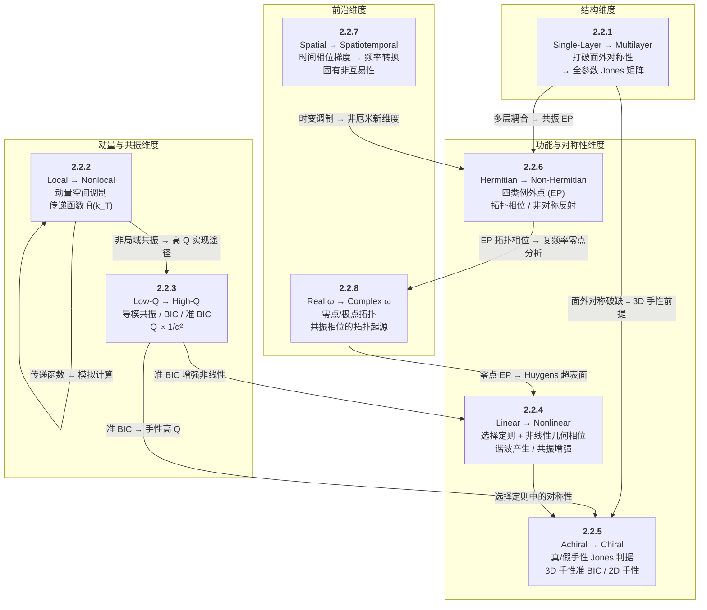

# 2.2 从经典到新兴：超表面维度拓展 — 章节总结

> [!abstract] Section 2.2 的整体逻辑
> Section 2.2 在 2.1 节建立的基础理论之上，系统展现了超表面从**经典范式**向**新兴范式**的八个维度拓展。这八节不按单一维度排列，而是构成一棵"**维度树**"：以**多层**（2.2.1）为物理结构根基 → 依次拓展到**非局域性**（2.2.2）和**高 Q 值**（2.2.3）两类动量/共振维度 → 再延伸到**非线性**（2.2.4）、**手性**（2.2.5）和**非厄米例外点**（2.2.6）三类功能/对称性维度 → 最后推向**时空调制**（2.2.7）和**复频率**（2.2.8）两个前沿维度。八大拓展开创了超表面在极端光操控、手性光学、拓扑光子学和时空调控中的全新能力。

## 整体逻辑架构

## 八节维度拓展详解

### 第一维度：多层化（2.2.1）— "打破面外对称性"

> [!important] [[2.2.1 From Single-Layer to Multilayer Metasurfaces]]
> **核心问题**：将超表面从单层扩展到多层，能解锁哪些新能力？

**三分法设计范式**（按层间距 $d$ 分类）：

| 场景 | 层间距 | 层间耦合 | 计算方法 | 设计范式 |
|:-----|:-------|:---------|:---------|:---------|
| **(I) 大间距解耦** | ∼mm | 无 | 射线追踪 / Rayleigh–Sommerfeld 衍射 | 逐层独立正向设计 |
| **(II) 近距无耦合** | 数十 nm ∼ 数百 μm | 规避 | Hadamard 积 $\mathbf{T}_{\mathrm{bilayer}} = \mathbf{T} \odot \mathbf{T}'$ (72) | 正向联合优化 |
| **(III) 近距有耦合** | ∼数十 nm | **主动利用** | 伴随法 (adjoint method) 逆向设计 | **逆向设计** |

**本质物理优势**：打破面外镜像对称性 → Jones 矩阵从 $T_{xy}=T_{yx}$ 扩展到 $T_{xy} \neq T_{yx}$（**全参数形式**）→ 为手性超表面和高通道偏振复用铺平道路。

> [!note] 与后续各节的衔接
> - 面外对称性破缺 = [[2.2.5 From Achiral to Chiral Metasurfaces|2.2.5 3D 手性]] 的物理前提
> - 场景 (III) 伴随法 → 3.3 节逆向设计详述
> - 多层耦合的共振模简并 → [[2.2.6 Exceptional Points in Non-Hermitian Metasurfaces|2.2.6 共振例外点]]

---

### 第二维度：非局域化（2.2.2）— "从实空间到动量空间"

> [!important] [[2.2.2 From Local to Nonlocal Metasurfaces]]
> **核心问题**：超表面的响应是否必须逐点局域？如果不是，意味着什么？

**局域 vs. 非局域的本质差异**：

| 维度 | 局域超表面 | 非局域超表面 |
|:-----|:----------|:------------|
| **调制空间** | 实空间 (75) | **动量空间** (79) |
| **变换函数** | $\mathbf{H} = \delta(x-x',y-y')\mathbf{I}$ → $\tilde{\mathbf{H}}(\vec{k}_{\mathrm{T}})=\mathbf{I}$ | $\tilde{\mathbf{H}}(\vec{k}_{\mathrm{T}})$ 非平凡函数 |
| **物理本质** | 逐点映射，入射角无关 | **空间色散**，入射角依赖 |
| **核心方程** | $\vec{E}^{\mathrm{out}}(x,y) = \mathbf{T}(x,y) \vec{E}^{\mathrm{in}}(x,y)$ | $\tilde{\vec{E}}^{\mathrm{out}}(\vec{k}_{\mathrm{T}}) = \tilde{\mathbf{H}}(\vec{k}_{\mathrm{T}}) \tilde{\vec{E}}^{\mathrm{in}}(\vec{k}_{\mathrm{T}})$ |

**术语辨析**："nonlocal metasurfaces" 的三重指代：
1. **动量空间功能行为**（本教程正式定义）→ 传递函数 $\tilde{\mathbf{H}}(\vec{k}_{\mathrm{T}})$ 滤波
2. **邻间元原子耦合**（设计方法关注点）
3. **非局域共振模式**（本教程统一称"高 Q 值超表面"，见 2.2.3）

核心应用：光学模拟计算、图像处理、自由空间压缩。

> [!note] 与后续各节的衔接
> - 非局域共振模式（术语 ③）= [[2.2.3 From Low-Q-Factor to High-Q-Factor Metasurfaces|2.2.3 高 Q 超表面]] 的实现平台
> - 衍射非局域超表面（$\tilde{\mathbf{H}}\neq\mathbf{I}$ 且 $\mathbf{T}\neq\mathbf{I}$）→ 2.2.3 高 Q 波前操控的核心困难

---

### 第三维度：高 Q 化（2.2.3）— "从局域共振到非局域共振"

> [!important] [[2.2.3 From Low-Q-Factor to High-Q-Factor Metasurfaces]]
> **核心问题**：如何让超表面的共振 Q 值从数十跃升到数千乃至数十万？

**核心物理机制**：

| 机制 | 物理本质 | Q 值范围 | 关键特征 |
|:-----|:---------|:---------|:---------|
| **导模共振 (GMR)** | 衍射耦合 → 波导层导模 → 再辐射 | ∼$10^3$–$10^5$ | 光栅衍射 + 波导层 |
| **准 FW BIC** | 两个导模共振的反交叉耦合 → 相消干涉 | ∼$10^4$（理论）| 由 Friedrich–Wintgen 机制解释 |
| **准对称保护 BIC** | 打破面内对称 → 理想 BIC 退化为准 BIC | 实验达数百 | **$Q \propto 1/\alpha^2$** 逆平方标度律（$\alpha$: 不对称参数） |
| **偶然 BIC** | 导模共振 + FP 共振耦合 | — | off-Γ 点，表现似单共振 |

**BIC 的 FW 三分法**：
- **FW BIC**：两导模共振反交叉 → 相消干涉
- **对称保护 BIC**：Γ 点简并导模 → 奇偶对称性不兼容
- **偶然 BIC**：导模共振 + FP 共振 → off-Γ 点耦合

**高 Q 波前操控**两大策略：

| 策略 | Q 值来源 | 波前机制 | Q 范围 | 核心挑战 |
|:-----|:---------|:---------|:-------|:---------|
| 导模共振超光栅 [222,208] | 波导层 + 光栅 | 非均匀扰动（缺口深度）| 1500–2500 | — |
| 准 BIC + 几何相位 [207,209] | $\delta$ 破缺对称 | 几何相位 ≈ $4\theta$（旋转）| ∼86 | 非均匀旋转角 → 劣化 Q |

> [!note] 与后续各节的衔接
> - 准 BIC 高 Q → [[2.2.4 From Linear to Nonlinear Metasurfaces|2.2.4 非线性增强]]（Koshelev 2020 SHG）
> - 准 BIC → [[2.2.5 From Achiral to Chiral Metasurfaces|2.2.5 手性准 BIC]] （Gorkunov 2020, Chen 2023）
> - 高 Q 频率滤波器 → [[2.2.7 Beyond Spatial Modulation - Spatiotemporal Metasurfaces|2.2.7 光隔离器方案]]

---

### 第四维度：非线性化（2.2.4）— "从线性到非线性谐波"

> [!important] [[2.2.4 From Linear to Nonlinear Metasurfaces]]
> **核心问题**：超表面如何与非线性光学结合？亚波长厚度下如何实现高效非线性效应？

**三条共振增强策略**：

| 策略 | 核心思想 | 代表性工作 | 关键性能 |
|:-----|:---------|:----------|:---------|
| **双共振** | 泵浦 + 信号频率同时共振 | Celebrano 2015 [260] | SHG 效率 $5\times10^{-10}$ W⁻¹ |
| **高非线性材料** | MQW 子带间跃迁 | Lee 2014 [261] | $\chi^{(2)} > 5\times10^4$ pm/V |
| **高 Q 非局域模** | Quasi-BIC 增强 | Koshelev 2020 [244] | SHG 效率 $1.3\times10^{-6}$ W⁻¹ |

**旋转对称性选择定则**（来自角动量守恒）：

$$
\boxed{M \sigma_{\mathrm{i}} (\tilde{\sigma} - M) = n K} \tag{95}
$$

- $M$：谐波阶数，$\sigma_{\mathrm{i}}$：入射圆偏振手性，$\tilde{\sigma}$：输出同/交叉偏振，$K$：超表面旋转对称阶数
- **线性光学** $(M=1)$：$K\geq 3$ → **禁止圆偏振转换**（为 2.1.3 几何相位的约束提供新视角）

**非线性几何相位**：

$$
\boxed{\phi_{\mathrm{geometric}}^{(M)} = (M \tilde{\sigma} - 1) \, \sigma_{\mathrm{i}} \, \theta} \tag{99}
$$

- 线性几何相位要求 $K<3$ 实现偏振转换（2.1.3）；非线性几何相位**无此限制**
- Table 1 给出完整 $M=1$–$5$ 的几何相位 + 选择定则表

**非线性波前操控**三类方法：
1. 非线性几何相位（旋转元原子）
2. 模拟周期极化晶体（SRR 二值相位 0/π → 非线性 Fresnel 波带片）
3. 共振/传播相位（非线性 FDTD/FEM 正向设计）

> [!note] 与前后各节的衔接
> - 选择定则中 $M=1$（线性）→ [[2.1.3 Geometric Phase Modulation Mechanism|2.1.3 几何相位]] 的偏振转换条件
> - 准 BIC 增强 SHG → [[2.2.3 From Low-Q-Factor to High-Q-Factor Metasurfaces|2.2.3 高 Q 非局域模]]

---

### 第五维度：手性化（2.2.5）— "从非手性到手性"

> [!important] [[2.2.5 From Achiral to Chiral Metasurfaces]]
> **核心问题**：超表面如何实现对左/右旋圆偏振光的选择性响应？

**真手性 vs. 假手性** — Jones 矩阵判据：

| | 真手性 (True Chirality) | 假手性 (False Chirality) |
|:-----|:------------------------|:-------------------------|
| **Jones 矩阵条件** | $A-B=0,\; C+D=0$ (105) 且 $A\neq0,\;C\neq0$ (107) | $A\neq B$ (111) 且 $C\neq0$ (112) |
| **旋转对称性** | $C_N$ ($N\geq 3$) | $C_1$ 或 $C_2$ |
| **面外镜面对称** | 打破 | 保留（正入射）|
| **偏振转换** | 可忽略（LCP/RCP 为本征态）| **通过**各向异性偏振转换实现 CD |
| **CD 定义** | $\mathrm{CD}=\frac{\tau_{++}-\tau_{--}}{\tau_{++}+\tau_{--}}$ (101) | $\mathrm{CD}=\frac{\tau_{+}-\tau_{-}}{\tau_{+}+\tau_{-}}$ (100) |

**两大类手性超表面**：

| 类别 | 面外对称性 | 手性来源 | 代表性工作 | 最高性能 |
|:-----|:----------|:---------|:----------|:---------|
| **3D 手性** | 打破 | 真手性（可混合）| Tanaka 2020（双层 $C_4$，记录级）| CD = 0.7 |
| **3D 手性准 BIC** | 打破 | 真手性 + 高 Q | Chen 2023（倾斜扰动）| CD = 0.93, Q > 2663 |
| **2D 假手性** | 保留（正入射）| 偏振转换 | Shi 2022（准 BIC 诱导）| CD = 0.93, Q = 121 |
| **2D 真手性** | 保留（正入射）| 元原子内部激发 | Zhu 2018（卍字元原子 + 导模共振）| CD ≈ 90% |
| **斜入射 2D** | 光打破 | 真手性 | Mao 2020（MIM 反射镜，$\theta_i=45^\circ$）| CD = 0.43 |

**3D 手性准 BIC** — 三种面外对称破缺方案：
1. **不同高度元原子**（Gorkunov 2020 首创 [283]）
2. **双层结构**（Overvig 2021 [285] → 任意椭圆二色性）
3. **倾斜元原子**（Chen 2023 [287] → CD = 0.93, Q > 2663，动量空间 C 点操控）

> [!note] 与前后各节的衔接
> - 面外对称性破缺的物理前提 → [[2.2.1 From Single-Layer to Multilayer Metasurfaces|2.2.1 多层超表面]]
> - 手性准 BIC 平台 → [[2.2.3 From Low-Q-Factor to High-Q-Factor Metasurfaces|2.2.3 高 Q 超表面]]
> - Jones 矩阵对称性判据 → 2.1.2 节基础理论

---

### 第六维度：非厄米化（2.2.6）— "从厄米到例外点"

> [!important] [[2.2.6 Exceptional Points in Non-Hermitian Metasurfaces]]
> **核心问题**：作为天然非厄米系统的超表面，例外点能带来哪些奇异物理效应？

**四类典型例外点**：

| EP 类型 | 响应矩阵 | 简并条件 | 核心物理效应 | 代表性工作 |
|:--------|:---------|:---------|:------------|:----------|
| **Jones 矩阵 EP** | Jones 矩阵 $\mathbf{J}$ | $A-B+2i\sigma C=0$ (120) | 拓扑相位 $2\pi$，偏振转换禁止 | Song 2021 [133]（可见光 MIM） |
| **散射矩阵 EP** | 散射矩阵 $\mathbf{S}$ | $r_{RR}=0$ 或 $r_{LL}=0$ (128/129) | 极端非对称反射 | He 2023 [311]（双层 metagrating） |
| **共振 EP** | 本征模 | 共振频率 + 损耗率同时简并 | 平方根共振劈裂 → 传感 | Park 2020 [313]（双层 Au 超表面） |
| **SPP EP** | SPP 本征态 | 几何参数调谐 | SPP 单向激发 | Xu 2023 [314] |

**Jones 矩阵 EP 的核心结果**：
- **LCP EP**：$A-B+2iC=0$ → 简并本征偏振态 = LCP
- **RCP EP**：$A-B-2iC=0$ → 简并本征偏振态 = RCP
- 绕 EP 的任意闭合路径 → **$2\pi$ 拓扑保护相位累积**（区别于几何相位：仅在一个偏振转换通道工作）

**共振 EP 的关键条件**：必须**打破面外镜面对称性**（有介质间隔层） → 共振模偏离纯对称/反对称态 → 辐射干涉 → EP 形成。空气间隔层 → 恢复面外对称 → EP 无法形成。

> [!note] 与前后各节的衔接
> - Jones 矩阵基础 → [[2.1.1 Fundamental Resonances in Meta-Atoms|2.1.1]] / [[2.1.2 Resonant and Propagation Phase Modulation Mechanisms|2.1.2]]
> - 拓扑相位 + 几何相位混合 → [[2.1.5 Hybrid Phase Modulation Mechanism|2.1.5 混合相位]]
> - 面外对称破缺 → [[2.2.1 From Single-Layer to Multilayer Metasurfaces|2.2.1 多层超表面]]
> - EP 拓扑相位起源 → [[2.2.8 Beyond Real Frequency - Complex-Frequency Metasurfaces|2.2.8 复频率零点分析]]

---

### 第七维度：时空化（2.2.7）— "从纯空间到时空联合调制"

> [!important] [[2.2.7 Beyond Spatial Modulation - Spatiotemporal Metasurfaces]]
> **核心问题**：在空间调制基础上引入时间调制，能产生什么新效应？

**核心方程** — 时空相位梯度的双重响应：

| 梯度类型 | 物理响应 | 公式 |
|:---------|:---------|:-----|
| **空间梯度** $\vec{\nabla}_{\mathrm{T}}\phi_{\mathrm{m}}$ | 横向光子动量突变 | $\vec{k}_{\mathrm{o,T}} = \vec{k}_{\mathrm{i,T}} + \vec{\nabla}_{\mathrm{T}}\phi_{\mathrm{m}}$ (135) |
| **时间梯度** $\partial\phi_{\mathrm{m}}/\partial t$ | 光子能量变化 → **频率转换** | $\omega_{\mathrm{o}} = \omega_{\mathrm{i}} - \partial\phi_{\mathrm{m}}/\partial t$ (136) |

**两大效应**：

| 效应 | 方案 (I) | 方案 (II) |
|:-----|:---------|:---------|
| **频率转换** | 时间相位调制：外加电/光信号连续调制 → $\omega_i \pm N\omega_m$ 谐波 | 元原子突然合并：光泵浦 → 导电性突变 → 动态模式转换 |
| **非互易性** | 时间梯度超表面：频率偏移在往返方向**相加不抵消** → 固有非互易 | 光子跃迁：上/下跃迁的调制相位 $\pm\phi$ → 空间相位梯度符号相反 → 方向偏转非互易 |

**关键实验里程碑**：

| 年份 | 工作 | 效应 | 关键结果 |
|:-----|:-----|:-----|:---------|
| 2016 | Liu et al. [324] | 频率转换 | 石墨烯 THz 超表面频移 0.05–5 GHz |
| 2018 | Lee et al. [325] | 频率转换 | SRR 合并 → **线性**频率转换，无光谱展宽 |
| 2024 | Sisler et al. [326] | 频率转换 | ITO-Au MIM 近红外，优化波形抑制高阶谐波 |
| 2015 | Shaltout et al. [323] | 非互易性 | 双时变超表面 + 高 Q 滤波器的隔离器方案 |
| 2016 | Shi and Fan [327] | 非互易性 | 光子跃迁元原子 → 紧凑光隔离器方案 |

> [!note] 与前后各节的衔接
> - 空间相位梯度的横向动量突变 → [[2.1.6 Wavefront Manipulation by Planar Arrangement of Meta-Atoms|2.1.6 广义 Snell 定律]]
> - 高 Q 共振用于频率滤波器 → [[2.2.3 From Low-Q-Factor to High-Q-Factor Metasurfaces|2.2.3]]
> - 频率转换与非线性超表面的区别（线性过程 vs. 非线性过程）→ [[2.2.4 From Linear to Nonlinear Metasurfaces|2.2.4]]

---

### 第八维度：复频率化（2.2.8）— "从实频率到复频率"

> [!important] [[2.2.8 Beyond Real Frequency - Complex-Frequency Metasurfaces]]
> **核心问题**：将激发光的频率从实轴拓展到复平面，能揭示什么深刻物理？

**核心分析工具 — Weierstrass 因子分解**：

$$
\Gamma(\tilde{\omega}) = A e^{iB\tilde{\omega}} \prod_{N=1}^{\infty} \frac{\tilde{\omega} - \tilde{\omega}_{N}^{+}}{\tilde{\omega} - \tilde{\omega}_{N}^{-}} \tag{144}
$$

- **零点** $\tilde{\omega}_N^{+}$：拓扑荷 $+1$，$+2\pi$ 相位累积
- **极点** $\tilde{\omega}_N^{-}$：拓扑荷 $-1$，$-2\pi$ 相位累积
- 零点和极点成对出现，由分支切割连接

**三类共振相位的拓扑起源**：

| | PT 对称超表面 | PT 对称破缺超表面 | Huygens 超表面 |
|:-----|:-----|:-----|:-----|
| **零点位置** | 实轴上（约束） | **上半复平面** | 复共轭对脱离实轴 |
| **沿实轴相位累积** | $\sim\pi$ | $\sim 2\pi$ | $\sim 2\pi$ |
| **核心机制** | — | 打破 PT 对称（折射率差/增益损耗/锥形元原子） | ≥ 2 对零点-极点相互作用 → 实轴约束自发破缺 |
| **零点例外点** | 无 | 无 | **有**（两个零点简并，$h=183.58$ nm / $h=160$ nm） |

**复频率响应的实验合成**（Zhang 课题组 2023 [329]）：

$$
F(\tilde{\omega}_0) \approx \frac{1}{2\pi} \sum_i F(\omega_i) \frac{e^{-i\omega_i t + i\tilde{\omega}_0 t}}{i(\tilde{\omega}_0 - \omega_i)} \Delta\omega \tag{152}
$$

通过**多实频率测量积分合成**复频率响应 → 已用于超透镜损耗克服 [329]、超高灵敏度传感 [332]、声子极化激元损耗补偿 [333]。

**突破散射极限**：复频率激发可实现实频率波**无法达到**的极端散射响应（如完全零前向散射 [331]）。

> [!note] 与前后各节的衔接
> - Huygens 超表面的 $2\pi$ 相位无需破缺 PT 对称 → [[2.1.2 Resonant and Propagation Phase Modulation Mechanisms|2.1.2]]
> - BIC 的零点分析 → [[2.2.3 From Low-Q-Factor to High-Q-Factor Metasurfaces|2.2.3]]
> - EP 拓扑相位的复频率视角 → [[2.2.6 Exceptional Points in Non-Hermitian Metasurfaces|2.2.6]]
> - 量子光激发与复频率激发 → 两个平行的"超越经典"方向（第 6 节）

---

## 八大维度全景对比

| 维度 | 小节 | 从...到... | 核心公式/概念 | 关键性能指标 |
|:-----|:-----|:-----------|:------------|:-----------|
| **结构** | 2.2.1 | 单层 → 多层 | Hadamard 积 (72) / 伴随法逆向设计 | FOV > 60°，效率 70% [179] |
| **局域性** | 2.2.2 | 局域 → 非局域 | $\tilde{\vec{E}}^{\mathrm{out}} = \tilde{\mathbf{H}}(\vec{k}_{\mathrm{T}}) \tilde{\vec{E}}^{\mathrm{in}}$ (79) | 空间微分/积分传递函数 |
| **Q 值** | 2.2.3 | 低 Q → 高 Q | $Q \propto 1/\alpha^2$ / 准 BIC + 几何相位 ≈ $4\theta$ | Q ~ $2.39\times10^5$ [221] |
| **非线性** | 2.2.4 | 线性 → 非线性 | 选择定则 (95) / $\phi_{\mathrm{geo}}^{(M)}$ (99) | SHG 效率 $1.3\times10^{-6}$ W⁻¹ [244] |
| **手性** | 2.2.5 | 非手性 → 手性 | Jones 矩阵真/假手性判据 (105)/(111) | CD = 0.93, Q > 2663 [287] |
| **非厄米** | 2.2.6 | 厄米 → 非厄米 EP | $A-B+2i\sigma C=0$ (120) / $r_{RR}=0$ (128) | $2\pi$ 拓扑相位 / 平方根传感劈裂 |
| **时间** | 2.2.7 | 纯空间 → 时空 | $\omega_{\mathrm{o}} = \omega_{\mathrm{i}} - \partial\phi_{\mathrm{m}}/\partial t$ (136) | 线性频率转换 / 非互易隔离 |
| **频率** | 2.2.8 | 实频率 → 复频率 | Weierstrass 分解 (144) / 拓扑荷 (145) | 合成复频率响应 / 突破散射极限 |

---

## 跨节概念连接图

| 核心概念 | 首次出现 | 后续引用 | 跨维度融合 |
|:---------|:---------|:---------|:-----------|
| **面外对称性破缺** | 2.2.1（多层本质优势） | 2.2.5（3D 手性前提）、2.2.6（共振 EP 条件） | 多层 → 手性 → 非厄米 EP 的统一对称性语言 |
| **非局域共振 / 准 BIC** | 2.2.3（高 Q 核心机制） | 2.2.4（谐波增强）、2.2.5（手性准 BIC）、2.2.7（高 Q 滤波器） | 连接非线性、手性、时空超表面的高 Q 平台 |
| **Jones 矩阵对称性** | 2.1.2（基础形式） | 2.2.5（真/假手性判据）、2.2.6（EP 简并条件） | Jones 矩阵 = 手性和非厄米分析的共同数学语言 |
| **拓扑相位** | 2.2.6（Jones 矩阵 EP → $2\pi$） | 2.2.8（零点/极点拓扑荷 → $2\pi$） | EP 拓扑相位与复频率零点拓扑荷的深层统一 |
| **零点和极点** | 2.2.8（Weierstrass 分解） | 2.2.3（BIC = 实轴上零点 [93]） | 复频率分析 = 揭示共振和 BIC 拓扑起源的统一框架 |
| **多零-极点相互作用** | 2.2.8（Huygens 零点 EP） | 2.1.2（Huygens 超表面原理） | 复频率语言解释 2.1.2 中 Huygens 的 $2\pi$ 相位奥秘 |
| **空间色散 $\tilde{\mathbf{H}}(\vec{k}_{\mathrm{T}})$** | 2.2.2（非局域传递函数） | 2.2.3（衍射非局域超表面） | 非局域 → 高 Q 的统一动量空间描述 |

---

## 从 Section 2.1 到 Section 2.2：理论到拓展的递进

| Section 2.1（基础理论） | → | Section 2.2（维度拓展） |
|:------------------------|:--|:------------------------|
| 元原子局域共振（ED/MD/Fano/BIC） | → | **非局域共振**（导模共振、准 BIC，Q $10^3$–$10^5$）、**复频率零点/极点拓扑分析** |
| Jones 矩阵对称形式 $T_{xy}=T_{yx}$ | → | **全参数 Jones 矩阵**（多层 → 打破面外对称）、**真/假手性 Jones 判据**、**非厄米 EP 简并** |
| 四种相位机制 + 混合相位 | → | **非线性几何相位** $\phi_{\mathrm{geo}}^{(M)} = (M\tilde{\sigma}-1)\sigma_{\mathrm{i}}\theta$、**拓扑相位** $2\pi$ |
| 广义 Snell 定律（空间相位梯度）| → | **时空相位梯度** → 时间梯度 = 频率转换 + 非互易性 |
| 二维面内超表面排列 | → | **三维多层架构**、**时空联合调制** |
| 厄米系统的酉 Jones 矩阵 | → | **非厄米例外点**（本征值+本征态同时简并）、**复频率虚拟增益/损耗** |

---

## 相关章节

- [[2.1 Section Summary - Meta-Atoms and Phase Modulation]] — Section 2.1 总览（本节的直接理论基础）
- [[2.1.1 Fundamental Resonances in Meta-Atoms]] — 共振物理基础
- [[2.1.2 Resonant and Propagation Phase Modulation Mechanisms]] — Jones 矩阵与对称性分析
- [[2.1.3 Geometric Phase Modulation Mechanism]] — 几何相位基础
- [[2.1.5 Hybrid Phase Modulation Mechanism]] — 混合相位调制
- [[2.1.6 Wavefront Manipulation by Planar Arrangement of Meta-Atoms]] — 波前操控理论
- [[2.3 Fundamental Limits of Metasurfaces]] — Section 2.3 超表面基本限制
- [[3.1 Basic Design Process of Metasurfaces]] — Section 3.1 超表面设计流程
