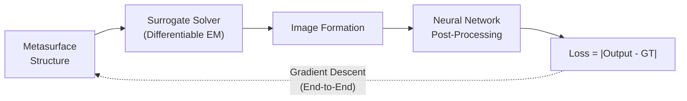

# 4.4.3. Design Methods for Broadband Achromatic Metalenses

> [!abstract] 内容概要
> 本节系统介绍宽带消色差超透镜的**六大设计路线**（Fig. 34 总览）：**(I) 偏振敏感消色差** — 混合相位机制经典方法（Capasso 组 [139]、Tsai 组 [100][351]）；**(II) 偏振不敏感消色差** — 各向同性元原子数据库（Yu 组 [144]、Ndao 等 [510]）+ $0^\circ/90^\circ$ 旋转对称性技巧（Capasso 组 [156]）+ 增大深宽比（Xiao 组 [138]）+ 3D 激光打印（Ren 等 [511]）；**(III) 渐近匹配理论** — 允许 $C(\omega)$ 非线性化，子带宽分段匹配（Hu 等 [354]）；**(IV) 准消色差超透镜** — 群延迟 $2\pi/\Delta\omega$ 周期性扩展，仅离散频率消色差（Chen 等 [504]）；**(V) 计算成像方法** — EDOF + 去卷积（Colburn 等 [505]）+ 端到端优化（Tseng 等 [506]）+ 纯深度学习后端（Dong 等 [507]）；**(VI) 折射-超表面混合系统** — 超透镜校正传统透镜色差/球差（Capasso 组 [121]）+ 硬件在环联合优化（Pinilla 等 [508]）. 末附级联相位板方法（Balli 等 [509][520]）。

---

## 总览图

![[images/11b76db87d8b41215523dbbfeef5b47400ded7e7f78615fbd4906eb91a1328f1.jpg|Figure 35 — 宽带消色差超透镜的设计方法]]

> [!abstract] Figure 35 — 图注摘要
> 宽带消色差超透镜的设计方法。(a) 消色差超透镜在 xOz 平面的实测强度分布，白色虚线标示焦距位置。(b) 消色差超透镜成像结果。左：原图；中：成像结果；右：色彩校正后的成像结果。(c) 偏振不敏感消色差超透镜的元原子数据库（绿色：$\theta = 0^\circ$；紫色：$\theta = 90^\circ$）。(d) 三种超透镜沿传播方向（z 轴）的实测强度分布。上：参考双曲超透镜；中：线性匹配消色差超透镜；下：渐近匹配消色差超透镜。(e) 准消色差超透镜在带宽内不同波长的焦距和聚焦效率（圆圈：扩展频率；星号：非扩展频率）。(f) 扩展焦深（EDOF）超透镜沿传播方向的模拟强度分布。(g) 白光照明下，原图 → 双曲超透镜 → EDOF 超透镜 → EDOF + 去卷积后端的成像对比。(h) 基于神经网络计算后端的端到端优化算法示意。(i) 上：端到端优化超透镜经神经网络处理后的成像结果；下：参考双曲超透镜（511 nm）。(j) 金属超透镜在 526 nm 的原始拍摄/复原图像/参考图像对比。(k) 有/无超透镜校正的单折射透镜在 USAF 1951 分辨率靶下的白光成像。(l) 传统相机 vs 折射透镜 vs 折射-超表面混合系统的实景成像。(m) 相位板与元原子级联结构示意。详见各子节引用的原始文献。

---

## 第一部分：偏振敏感消色差超透镜 — 经典混合相位方法

### 设计流程

混合相位调制机制是实现偏振敏感消色差超透镜的**最广泛手段**。

**数据库构建**：调节元原子形状和尺寸参数，构建覆盖目标群延迟范围 [Eq. (221)] 的数据库，同时保持群延迟色散接近零。

> [!important] 数据库覆盖的本质
> $\left.\frac{\mathrm{d}C(\omega)}{\mathrm{d}\omega}\right|_{\omega = \omega_c} = C_1$ 在 Eq. (209) 中可调节，因此"覆盖"目标群延迟范围实质上是要求数据库中元原子的**群延迟跨度**超过 Eqs. (222) 中的目标群延迟跨度。

**元原子排布**：对位置 $(x,y)$ 处的单元，从数据库中选择满足该位置色散需求 [Eqs. (209), (210)] 且 PCE 和透过率最高的元原子。中心频率 $\omega_c$ 处的目标相位通过**旋转元原子**引入几何相位补偿 $\Delta\phi(x,y)$：

$$
\boxed{\Delta\phi(x, y) = \phi(r, \omega_c) - \phi_0(x, y) = -\frac{\omega_c}{c}\left(\sqrt{f^2 + r^2} - f\right) + C(\omega_c) - \phi_0(x, y)} \tag{239}
$$

其中 $\phi_0(x,y)$ 为元原子在旋转角 $0^\circ$ 时对 $\omega_c$ 的相移（通过仿真获得）。根据 Eq. (23)，元原子绕 $z$ 轴逆时针旋转角度：

$$
\theta(x,y) = \frac{\Delta\phi(x,y)}{2\sigma}
$$

其中 $\sigma = \pm 1$ 分别对应 LCP 和 RCP 入射。

> [!tip] 设计流程总结
> ```mermaid
> graph LR
>   A["Shape/Size Sweep"] --> B["Meta-atom DB<br/>(GD coverage + GDD≈0)"]
>   B --> C["For each (x,y):<br/>Select best match"]
>   C --> D["Rotation θ(x,y)<br/>= Δφ/2σ"]
>   D --> E["Complete<br/>Metalens Layout"]
> ```

### 标志性工作

#### Capasso 组 — 可见光偏振敏感消色差超透镜 [139] (2018)

| 参数 | 数值 |
|:-----|:-----|
| **NA** | 0.2 |
| **焦距** | $63\,\mu\mathrm{m}$ |
| **带宽** | $470\,\mathrm{nm}$–$670\,\mathrm{nm}$ |
| **元原子** | $\mathrm{TiO_2}$ 纳米鳍（1 个或多个），高度 $600\,\mathrm{nm}$ |
| **晶格常数** | $400\,\mathrm{nm}$ |
| **Strehl 比** | 全波长 > 0.8 |
| **绝对聚焦效率** | 全波长 < 20%（受限于低 PCE 元原子覆盖完整群延迟范围的折中） |

> [!warning] 效率与带宽的折中
> 低 PCE 元原子被用于覆盖完整的群延迟范围 → 效率受到严重制约。优化方向：**扩展元原子形状种类**以扩大设计空间，构建更全面的数据库。

#### Tsai 组 — 近红外 + 可见光消色差超透镜 [100][351] (2017–2018)

设计算法虽然形式不同但**本质一致**：将 $\omega_c$ 选为带宽内的**最小角频率**（而非中心频率），并取 $r_a = R$ 和 $\phi_a = -\frac{\omega_c}{c}(\sqrt{f^2+R^2}-f)$。

| 参数 | **近红外** [100] | **可见光** [351] |
|:-----|:-----|:-----|
| **工作模式** | 反射 | 透射 |
| **元原子** | MIM (Au–$\mathrm{SiO_2}$–Au) | GaN 柱 + 孔，高度 $800\,\mathrm{nm}$ |
| **晶格** | — | 六角晶格，$a = 120\,\mathrm{nm}$ |
| **半径** | $27.775\,\mu\mathrm{m}$ | — |
| **焦距** | $100\,\mu\mathrm{m}$ | $235\,\mu\mathrm{m}$ |
| **NA** | $0.268$ | $0.106$ |
| **带宽** | $1200$–$1680\,\mathrm{nm}$ | $400$–$660\,\mathrm{nm}$ |
| **平均绝对聚焦效率** | — | ~40% |

> [!note] 色彩校正
> Fig. 35(b) 显示原图与成像结果的**微小色差**主要源于不同波长的聚焦效率差异。通过 RGB 三通道强度补偿可获得校正后图像。

**2019 年扩展**：Tsai 组将可见光消色差超透镜组装为 $60\times60$**超透镜阵列**，实现了白光照明下分辨率为 $1.95\,\mu\mathrm{m}$ 的**消色差全彩色光场相机** [119]。

---

## 第二部分：偏振不敏感消色差超透镜

> [!important] 与偏振敏感设计的核心区别
> 中心频率处 $2\pi$ 相位覆盖**不能**再通过几何相位旋转实现 → 构建元原子数据库时需**额外引入一个设计维度**覆盖 $\omega_c$ 处的 $2\pi$ 相移，同时保持群延迟范围覆盖和群延迟色散近零。

### 方法 A：纯各向同性元原子

仅使用基于共振或传播相位机制的各向同性元原子产生偏振不敏感电磁响应。

#### Yu 组 [144] (2018) — 高 NA 近红外

| 参数 | 数值 |
|:-----|:-----|
| **半径** | $50\,\mu\mathrm{m}$ |
| **焦距** | $30\,\mu\mathrm{m}$ |
| **NA** | ~0.88 |
| **带宽** | $1200$–$1400\,\mathrm{nm}$ |
| **元原子** | 高折射率 Si（$h = 1400\,\mathrm{nm}$），十字/方块/方孔等多种形状 |
| **焦距偏差** | 相对平均焦距 2%–5% |
| **Strehl 比** | 全波长 > 0.8 |
| **平均绝对聚焦效率** | ~35%（有效聚焦区域直径约为 FWHM 的 3–5 倍） |

#### Ndao 等 [510] (2020) — 网状超表面结构

| 参数 | 数值 |
|:-----|:-----|
| **尺寸** | $20\,\mu\mathrm{m} \times 20\,\mu\mathrm{m}$ |
| **NA** | 0.12 |
| **带宽** | $640$–$1200\,\mathrm{nm}$ |
| **元原子** | $\mathrm{TiO_2}$ 各向同性结构，$h = 350\,\mathrm{nm}$，$a = 370\,\mathrm{nm}$ |
| **平均绝对聚焦效率** | > 70% |

### 方法 B：增大深宽比 — 突破群延迟跨度上限

由 4.4.2 节 Eq. (232)，增大元原子高度是提升消色差超透镜性能的**最直接途径**。

#### Xiao 组 [138] (2021) — 超高深宽比 $\mathrm{TiO_2}$

| 参数 | 数值 |
|:-----|:-----|
| **元原子高度** | $1500\,\mathrm{nm}$ |
| **深宽比 (Aspect Ratio)** | ~37.5（自上而下刻蚀工艺） |
| **元原子形状** | 4 种各向同性形状 |
| **半径** | $15\,\mu\mathrm{m}$ |
| **NA** | 0.24 |
| **带宽** | $650$–$1000\,\mathrm{nm}$ |
| **Strehl 比** | 全波长 > 0.81 |
| **平均绝对聚焦效率** | ~77.1%（有效聚焦区域直径为 FWHM 的 6 倍） |

### 方法 C：$0^\circ / 90^\circ$ 旋转对称性技巧 — 各向异性结构的"偏振不敏感化"

> [!important] Capasso 组 [156] (2019) — 反直觉设计
> **核心洞察**：由 Eq. (23)，旋转 $\theta$ 的元原子对 LCP/RCP 分别引入几何相位 $-2\theta$ 和 $+2\theta$。将旋转角**限制为仅 $0^\circ$ 或 $90^\circ$** → $2\theta = -2\theta$ → **几何相位在此特定角度下偏振不敏感**（详见 2.1.3 节）。
>
> **优势**：各向异性结构比各向同性结构具有**更高的形状可调性**（更多设计自由度）。

**数据库构建技巧**（Fig. 35(c)）：
- **绿色点**：元原子在 $\theta = 0^\circ$ 时的相移和色散特性（直接仿真）
- **紫色点**：旋转至 $\theta = 90^\circ$ → 几何相位增加 $\pi$，色散特性**不变** → 直接由绿色点推算

| 参数 | 数值 |
|:-----|:-----|
| **半径** | $13.2\,\mu\mathrm{m}$ |
| **NA** | 0.2 |
| **带宽** | $460$–$700\,\mathrm{nm}$ |
| **元原子** | $\mathrm{TiO_2}$，$h = 600\,\mathrm{nm}$，$a = 400\,\mathrm{nm}$ |
| **焦距偏差** | ≤ 9%（全波长） |
| **Strehl 比** | 维持 ~0.8 |
| **绝对聚焦效率** | ~30%（@532 nm），不同偏振态变化仅 ~4% |

#### Ren 等 [511] (2022) — 3D 激光打印 + $0^\circ/90^\circ$ 技巧

采用双光子聚合 3D 激光打印技术解锁元原子的更高自由度，群延迟调制范围从 Eq. (218) 扩展为：

$$
\boxed{\Delta\mathrm{GD}_{\max} = \frac{h_{\max} n_{\mathrm{meta}} - h_{\min} n_{\mathrm{cladding}}}{c n_{\mathrm{back}}}} \tag{240}
$$

其中 $h_{\max}$ 和 $h_{\min}$ 分别为元原子的最大和最小高度。

| 参数 | 数值 |
|:-----|:-----|
| **半径** | $100\,\mu\mathrm{m}$ |
| **NA** | 0.2 |
| **带宽** | $1250$–$1650\,\mathrm{nm}$ |

> [!tip] Eq. (240) vs Eq. (218)
> 传统 Eq. (218) 假设元原子高度**均匀** ($h_{\max}=h_{\min}=h$)，退化为 $\Delta\mathrm{GD}_{\max} = \frac{h}{c}\frac{\Delta n}{n_{\mathrm{back}}}$。3D 打印允许**空间可变高度** → $h_{\max}$ 和 $h_{\min}$ 可独立设计，显著拓宽群延迟调制能力。

---

## 第三部分：消色差超透镜设计理论的新进展

### 从线性色散到非线性色散 — 核心动机

此前的方法中，$C(\omega)$ 始终取 Eq. (211) 的线性形式 → 群延迟色散 Eq. (210) 为 0 → 要求**元原子的相移与角频率线性相关**。

> [!warning] 线性假设的局限性
> 由 Eqs. (6) 和 (215)，元原子的有效折射率本身是频率依赖的 → 相移-频率关系**天然非线性**。对于**超大带宽**消色差超透镜，线性近似导致色差校正不够理想（见 Fig. 35(d) 中图）。

### 渐近匹配消色差超透镜 (Asymptotic Matched Metalens) [354]

**核心创新**：允许 $C(\omega)$ 的二阶导数**非零** → 目标相移与频率可以是非线性关系。

将 Eq. (213) 中的 $r_a$ 推广为频率函数 $r_a(\omega)$：

$$
\boxed{C(\omega) = \frac{\omega}{c}\left(\sqrt{f^2 + r_a^2(\omega)} - f\right) + \phi_a} \tag{241}
$$

双曲相位分布重写为：

$$
\boxed{\phi_{\mathrm{hyperbolic}}(r, \omega) = -\frac{\omega}{c}\left(\sqrt{f^2 + r^2} - \sqrt{f^2 + r_a^2(\omega)}\right) + \phi_a} \tag{242}
$$

> $r_a(\omega)$ 的物理含义：角频率 $\omega$ 的光的出射球面波前与超表面的交点距透镜中心的距离 ($\phi_{\mathrm{hyperbolic}}(r_a(\omega), \omega) = \phi_a$)。

**目标群延迟**变为：

$$
\begin{array}{l}
\displaystyle \frac{\partial\phi(r, \omega)}{\partial\omega}\bigg|_{\omega=\omega_c} = -\frac{1}{c}\sqrt{f^2 + r^2}
\\
\displaystyle \quad + \frac{1}{c}\left(\sqrt{f^2 + r_a^2(\omega_c)} + \frac{\omega_c r_a(\omega_c)}{\sqrt{f^2 + r_a^2(\omega_c)}} \frac{\mathrm{d} r_a(\omega)}{\mathrm{d} \omega}\bigg|_{\omega=\omega_c}\right) \tag{243}
\end{array}
$$

**分段匹配策略**：将消色差带宽划分为 $M$ 个子带宽，各子带宽中心角频率为 $\omega_{c_i}$ ($i = 1,2,\ldots,M$)，为不同子带宽选择**不同**的 $r_a(\omega_{c_i})$ → 各子带宽的色散特性被元原子数据库更好地覆盖。

> [!important] 关键约束不变
> 不同 $\omega_{c_i}$ 的**目标群延迟跨度仍然保持一致** [Eq. (222)]。设计挑战在于：选择合适的 $r_a(\omega_{c_i})$ 使数据库中的元原子尽可能覆盖 Eq. (243) 描述的色散特性。

#### Hu 等 [354] (2023) — 粒子群优化 + 非线性色散匹配

| 参数 | 数值 |
|:-----|:-----|
| **优化方法** | 粒子群优化 (PSO) 搜索最优 $r_a(\omega_{c_i})$ |
| **半径** | $25\,\mu\mathrm{m}$ |
| **NA** | 0.164 |
| **带宽** | $400$–$1000\,\mathrm{nm}$ |
| **元原子** | $\mathrm{TiO_2}$ 各向同性结构，$h = 1\,\mu\mathrm{m}$，深宽比 ≤ 20，$a = 500\,\mathrm{nm}$ |
| **绝对聚焦效率** | 30%–80%（带宽内），平均 ~50% |

> [!success] 色差校正质量对比 (Fig. 35(d))
> **上**：参考双曲超透镜 — 严重色差
> **中**：线性匹配消色差超透镜 — 带宽边沿性能劣化
> **下**：渐近匹配消色差超透镜 — 带宽内全范围优越的色差校正

---

## 第四部分：准消色差超透镜 (QAML) — 离散频率的"取巧"方案 [504]

> [!important] 核心理念突破
> 4.4.2 节的限制针对**连续带宽**。如果仅在**离散频率**处要求消色差 → 约束显著松弛。
>
> **准消色差 (QAML) 的核心**：类似相位允许 $2\pi$ 周期性延拓，**群延迟允许以 $\frac{2\pi}{\Delta\omega}$ 为周期延拓** → 仅在一组角频率间隔为 $\Delta\omega$ 的**离散扩展频率** (extension frequencies) 处校正色差 → 大幅降低对群延迟范围的苛刻要求，突破 Eq. (232) 的基础性能极限。

| 属性 | BAML | QAML |
|:-----|:-----|:-----|
| **消色差频率** | 带宽内所有频率 | 仅离散扩展频率 |
| **非扩展频率表现** | N/A | 焦距偏差**大**但聚焦效率**接近 0** |
| **$\Delta\mathrm{GD}$ 需求** | 严格 | 显著降低 |
| **突破 Eq. (232)** | 不能 | ✅ 能 |

### 验证性仿真参数

| 参数 | 数值 |
|:-----|:-----|
| **半径** | $1\,\mathrm{mm}$ |
| **NA** | 0.55 |
| **准消色差带宽** | $400$–$1500\,\mathrm{nm}$ |
| **平均绝对聚焦效率** | ~70%（扩展频率处） |

> [!tip] QAML 的实用价值
> 在非扩展频率处虽然焦距偏差大，但绝对聚焦效率**接近 0** → 这些频率的光**几乎不参与成像** → 不会严重劣化图像质量。这使得 QAML 在保持**高 NA + 大尺寸 + 宽名义带宽**的同时实现高质量成像。

---

## 第五部分：计算成像方法 — 光学前端 + 算法后端

### 方法 A：EDOF + 传统图像处理 [505] (2018)

**原理**：色差 → 焦距随频率变化。扩展焦深（EDOF）超透镜在扩展焦深范围内保留空间频率信息（代价：SNR 降低），提高系统对焦距偏移的容忍度。

**实现**：在双曲相位上叠加**立方相位** (cubic phase) 以扩展焦深：

$$
\boxed{\phi_{\mathrm{EDOF}}(x, y, \omega) = -\frac{\omega}{c}\left(\sqrt{f^2 + x^2 + y^2} - f\right) + \frac{\gamma}{R^3}(x^3 + y^3) + C(\omega)} \tag{244}
$$

其中 $\gamma$ 表示立方相位的贡献权重。

| 参数 | 数值 |
|:-----|:-----|
| **$\gamma$** | $55\pi$ |
| **元原子** | 各向同性 c-Si 圆柱，$h = 633\,\mathrm{nm}$，$a = 443\,\mathrm{nm}$ |
| **工作波长** | $550\,\mathrm{nm}$（单波长设计） |
| **焦距** | $200\,\mu\mathrm{m}$ |
| **半径** | ~$100\,\mu\mathrm{m}$ |
| **后端算法** | Wiener 滤波（通过测量 PSF 标定卷积核） |

> [!tip] EDOF 方法的权衡
> Fig. 35(g) 白光成像对比：
> - 双曲超透镜 → 严重色差
> - EDOF 超透镜 → 色差改善但图像模糊
> - EDOF + 去卷积 → 良好色差校正，以一定 **SNR 牺牲**为代价

### 方法 B：端到端优化 — 超表面 + 神经网络联合优化

#### Tseng 等 [506] (2021) — 宽 FOV + 消色差 + 端到端训练

**算法框架** (Fig. 35(h))：



1. **初始相位**：单波长设计，由 Eq. (194) 定义（支持宽 FOV）
2. **联合优化**：超表面结构 + 神经网络图像后处理以端到端方式协同优化
3. **可微性保证**：元原子电磁响应的**代理模型**（surrogate model）确保从结构到损失函数的整个前向过程可微 → 梯度下降优化

**结果**：经神经网络后处理的成像质量（Fig. 35(i) 上图）显著优于参考双曲超透镜在 511 nm 的成像结果（Fig. 35(i) 下图）。

#### Park 等 [512] (2025) — 全彩色 + 70° FOV

类似的端到端框架实现了 70° 视场的全彩色成像。

> [!note] 端到端优化的通用性
> 端到端优化超表面已被广泛扩展至：亚波长分辨率成像 [513]、多维信息提取 [513]、多通道成像 [514]、压缩感知恢复 [515]、长波红外温度成像 [516]。

### 方法 C：纯深度学习后端 — 不改动硬件 [507]

**优势**：无需对超透镜本身做任何硬件修改。

#### Dong 等 [507] (2024) — U-Net 单独完成色差校正

| 参数 | 数值 |
|:-----|:-----|
| **超透镜** | c-Si 圆柱元原子，$R = 2.5\,\mathrm{mm}$，$f = 8\,\mathrm{mm}$，$a = 180\,\mathrm{nm}$ |
| **工作波长** | $526\,\mathrm{nm}$ |
| **网络架构** | U-Net（通用架构） |
| **训练集** | 1500 张真实 + 合成物体图像（防止过拟合，增强泛化能力） |

> [!success] 跨场景泛化能力
> Fig. 35(j) 实验结果显示神经网络在**多种环境条件和对焦距离**下均能显著提升成像质量。

---

## 第六部分：折射-超表面混合成像系统

> [!important] 超越毫米级限制
> Eq. (232) 的 $\Delta\omega \cdot \mathrm{FN}$ 约束导致几乎所有前述消色差超透镜的半径被限制在**数十微米量级**。折射-超表面混合系统利用超表面的灵活相位/色散调制能力与传统透镜配合，实现**大尺寸 + 高 NA** 消色差光学系统。

### Capasso 组 [121] (2018) — 混合系统概念的开创

**双重优势**：
- **从超表面角度看**：元原子只需补偿折射光学系统的**材料色散**，所需的群延迟跨度**远小于** Eq. (222) 中独立超透镜的需求
- **从折射系统角度看**：超透镜有望**减少**校正像差所需的折射元件数量 → 减小系统体积和重量

**实验验证**（标准折射球面透镜 LA4249, Thorlabs Inc.）：

| 参数 | 数值 |
|:-----|:-----|
| **NA** | 0.075 |
| **有效焦距** | 9.96 mm |
| **峰值聚焦效率** | ~35% |
| **消色差范围** | 全可见光谱 |

Fig. 35(k)：有/无前置校正超透镜的成像对比（USAF 1951 分辨率靶，白光照明）——**色差明显被校正**。

### Pinilla 等 [508] (2023) — 硬件在环 + 端到端优化

**系统构成**（Fig. 35(l) 右上）：CMOS 传感器 + 折射透镜 + 前置超透镜，口径和焦距均为 5 mm。

**创新优化策略 — 硬件在环 (Hardware-in-the-Loop)**：
1. **先装配硬件**：SLM 替代超透镜进行原型验证
2. **联合优化**：SLM 相位分布 + 神经网络以端到端方式协同优化
3. **后设计超透镜**：基于优化后的 SLM 相位分布设计超透镜

> [!success] 大景深优势
> 设计的相机与传统商业相机在真实场景中的成像对比 [Fig. 35(l)] 展现了其**大景深**（large DOF）的优势。

---

## 第七部分：其他设计方法

### 级联相位板 + 元原子 [509][520] (2020–2021)

**单元结构** (Fig. 35(m))：相位板 (phase plate) + 元原子级联

| 参数 | 2020 [509] | 2021 [520] |
|:-----|:-----|:-----|
| **入瞳直径** | $40\,\mu\mathrm{m}$ | $20\,\mu\mathrm{m}$ |
| **NA** | 0.32 | 0.27 |
| **带宽** | $1000$–$1800\,\mathrm{nm}$ | $450$–$1700\,\mathrm{nm}$ |
| **平均绝对聚焦效率** | 27% | — |
| **焦距最大相对偏差** | 8.1%（全波长） | — |

---

## 各设计路线的对比总结

| 路线 | 偏振依赖 | 核心机制 | NA 典型值 | 带宽 | 尺寸 | 效率参考 | 关键文献 |
|:-----|:---------|:---------|:---------|:-----|:-----|:-----|:-----|
| **混合相位（经典）** | 敏感 | 传播/共振 + 几何相位旋转 | 0.1–0.27 | 可见/近红外 | 数十 $\mu$m | 20–40% | Capasso [139], Tsai [100][351] |
| **各向同性（偏振不敏感）** | 不敏感 | 仅传播/共振相位 | 0.12–0.88 | 可见/近红外 | 20–50 $\mu$m | 35–70% | Yu [144], Ndao [510] |
| **高深宽比** | 不敏感 | 增大 $h$ → $\Delta\mathrm{GD}_{\max}\uparrow$ | 0.24 | 可见 | 15 $\mu$m | 77% | Xiao [138] |
| **$0^\circ/90^\circ$ 旋转** | 不敏感 | 各向异性结构 + 对称旋转约束 | 0.2 | 可见 | 13–100 $\mu$m | 30% | Capasso [156], Ren [511] |
| **渐近匹配** | 不敏感 | 非线性 $C(\omega)$ + 子带宽分段 | 0.164 | 400–1000 nm | 25 $\mu$m | 30–80% | Hu [354] |
| **准消色差 (QAML)** | — | GD $2\pi/\Delta\omega$ 周期性延拓 | 0.55 | 400–1500 nm | 1 mm | 70% | Chen [504] |
| **EDOF + 去卷积** | — | 立方相位 + Wiener 滤波 | — | 400–700 nm | 100 $\mu$m | — | Colburn [505] |
| **端到端 NN** | — | 超表面 + NN 梯度下降联合优化 | — | 可见（全彩） | — | — | Tseng [506], Park [512] |
| **纯 DL 后端** | — | U-Net 独立校正（不改硬件） | — | 可见 | 2.5 mm | — | Dong [507] |
| **折射-超表面混合** | — | 超透镜校正折射元件色差/球差 | 0.075 | 全可见 | mm 级 | 35% | Capasso [121], Pinilla [508] |
| **级联相位板** | — | 相位板 + 元原子级联 | 0.27–0.32 | 450–1800 nm | 20–40 $\mu$m | 27% | Balli [509][520] |

---

## 关键公式汇总

| 公式 | 物理含义 | 编号 |
|:-----|:---------|:-----|
| $\Delta\phi(x,y) = \phi(r,\omega_c) - \phi_0(x,y)$ | 几何相位旋转补偿 | (239) |
| $\Delta\mathrm{GD}_{\max} = \frac{h_{\max} n_{\mathrm{meta}} - h_{\min} n_{\mathrm{cladding}}}{c n_{\mathrm{back}}}$ | 3D 打印的GD跨度扩展 | (240) |
| $C(\omega) = \frac{\omega}{c}\bigl(\sqrt{f^2 + r_a^2(\omega)} - f\bigr) + \phi_a$ | 非线性色散匹配 — 渐近匹配基础 | (241) |
| $\phi_{\mathrm{hyperbolic}} = -\frac{\omega}{c}\bigl(\sqrt{f^2 + r^2} - \sqrt{f^2 + r_a^2(\omega)}\bigr) + \phi_a$ | 渐近匹配目标相位分布 | (242) |
| $\phi_{\mathrm{EDOF}} = -\frac{\omega}{c}(\sqrt{f^2 + x^2 + y^2} - f) + \frac{\gamma}{R^3}(x^3 + y^3) + C(\omega)$ | EDOF 相位分布 | (244) |

---

## 与前节的联系

> [!note] 逻辑链
> **4.4.1** 建立了消色差设计的理论框架（Taylor 展开 → 三个条件）→ **4.4.2** 推导了物理可实现性的上限（$\Delta\mathrm{GD}_{\max}$、TBP、FN 约束）→ **4.4.3** 展示了在物理天花板下的**六大设计路线** — 从经典混合相位到准消色差"取巧"，再到计算成像和混合系统"换赛道"，每一步都是在逼近或规避 4.4.2 的基础限制。

---

## 参考文献

- [100] G.-Y. Lee, J.-Y. Hong, S. Hwang, et al., "Metasurface eyepiece for augmented reality," *Nat. Commun.* **9**, 4562 (2018).
- [119] R. J. Lin, V.-C. Su, S. Wang, et al., "Achromatic metalens array for full-colour light-field imaging," *Nat. Nanotechnol.* **14**, 227–231 (2019).
- [121] W. T. Chen, A. Y. Zhu, J. Sisler, et al., "Broadband achromatic metasurface-refractive optics," *Nano Lett.* **18**, 7801–7808 (2018).
- [138] S. Shrestha, A. C. Overvig, M. Lu, et al., "Broadband achromatic dielectric metalenses," *Light Sci. Appl.* **10**, 55 (2021).
- [139] W. T. Chen, A. Y. Zhu, V. Sanjeev, et al., "A broadband achromatic metalens for focusing and imaging in the visible," *Nat. Nanotechnol.* **13**, 220–226 (2018).
- [144] S. Wang, P. C. Wu, V.-C. Su, et al., "A broadband achromatic metalens in the visible," *Nat. Nanotechnol.* **13**, 227–232 (2018).
- [156] W. T. Chen, A. Y. Zhu, J. Sisler, et al., "A polarization-insensitive achromatic metalens," *Nat. Commun.* **10**, 355 (2019).
- [351] S. Wang, P. C. Wu, V.-C. Su, et al., "Broadband achromatic optical metasurface devices," *Nat. Nanotechnol.* **12**, 403–408 (2017).
- [354] T. Hu, R. Zhong, C. Li, et al., "Asymptotic dispersion engineering for ultra-broadband achromatic metalenses," *Nat. Commun.* **14**, 6642 (2023).
- [504] W. T. Chen, J.-S. Park, F. Capasso, et al., "Quasi-achromatic metalens with extended bandwidth," *Phys. Rev. Lett.* **131**, 193801 (2023).
- [505] S. Colburn, A. Zhan, A. Majumdar, "Metasurface optics for full-color computational imaging," *Sci. Adv.* **4**, eaar2114 (2018).
- [506] E. Tseng, S. Colburn, J. Whitehead, et al., "Neural nano-optics for high-quality thin lens imaging," *Nat. Commun.* **12**, 6493 (2021).
- [507] Z. Dong, Y. Gu, S. Liu, et al., "Deep learning-enabled image deblurring for metalens," *ACS Photonics* **11**, 1645–1656 (2024).
- [508] S. Pinilla, J. E. Fröch, S. Rostami, et al., "Miniature color camera via flat hybrid meta-optics," *Sci. Adv.* **9**, eadg7297 (2023).
- [509] F. Balli, M. Sultan, S. K. Lami, et al., "A hybrid achromatic metalens," *Nat. Commun.* **11**, 3892 (2020).
- [510] A. Ndao, L. Hsu, W. Cai, et al., "Differentiating and integrating the phase profile of metalens by meshed dielectric metasurfaces," *Nano Lett.* **20**, 1049–1056 (2020).
- [511] H. Ren, X. Fang, J. Jang, et al., "Complex-amplitude metasurface-based 3D nanoprinting," *Nat. Nanotechnol.* **17**, 1080–1086 (2022).
- [512] J.-S. Park, S. W. D. Lim, A. Amirzhan, et al., "All-color, 70° field-of-view, neural nano-optics," *Nat. Commun.* **16**, 1759 (2025).
- [520] F. Balli, M. Sultan, S. K. Lami, et al., "Hybrid meta-optics for compact and broadband imaging," *ACS Photonics* **8**, 669–677 (2021).
