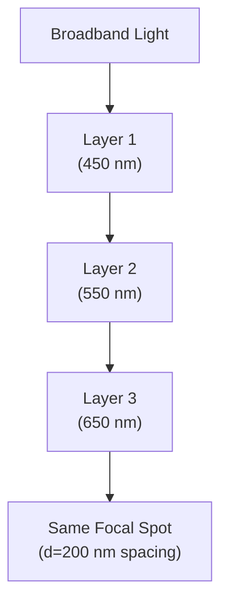
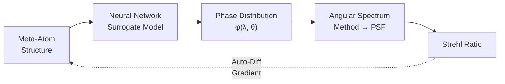

# 4.4.4. Design Methods for Multi-Wavelength Achromatic Metalenses

> [!abstract] 内容概要
> 与 4.4.3 节的**连续宽带**消色差不同，本节聚焦于**仅在若干离散波长处校正色差**的多波长消色差超透镜。核心优势：不受 Eq. (232) （$\Delta\omega \cdot \mathrm{FN}$）约束 → NA、尺寸和消色差波长数可同时做大。六条设计路线：**(I) 元原子数据库独立调制各波长相位** — 最直接方法（Capasso 组 [525]、Faraon 组 [526][528]、双层超表面 [521]）；**(II) 空间复用 / 多层超表面** — 每层负责一个波长（Avayu 等 [186]、Baranikov 等 [530]）+ 单层波长间插复用 [531]；**(III) 群延迟折叠** — 将 4.4.3 节的混合相位宽带方法改造为多波长 + GD wrapping（Capasso 组 [464]，RGB-AR 演示）；**(IV) 逆设计单色多波长成像** — 拓扑优化 / 形状优化突破传统前向设计限制（Chung & Miller [403]、Jiang 等 [428]）；**(V) 逆设计宽带成像** — 多波长密集采样 + 代理模型 + 自动微分 → 直接泛化为连续宽带（Fröch 等 [463] 内窥镜、Monroe 等 [524] LWIR）；**(VI) 计算后端** — 神经网络单独校正几何相位超透镜的多波长色差（Cheng 等 [534]，PSNR 提升 12 dB）。

---

## 核心定位：多波长 vs 连续宽带

> [!important] 不受 Eq. (232) 约束
> 在数字成像系统 [521]、AR/VR [464]、显微成像 [471] 等应用中，**仅需在若干离散波长消色差**即可满足性能需求。此时超透镜的 **NA、尺寸和消色差波长数不受 Eq. (232)** ($\Delta\omega \cdot \mathrm{FN} \leq \cdots$) 的限制。

### 连续宽带照明的适配

| 策略 | 做法 | 文献 |
|:-----|:-----|:-----|
| **带通滤波** | 在超透镜前引入适当的带通滤波器 | [522] |
| **密集采样** | 消色差波长采样足够密集覆盖目标光谱带宽 → 直接实现宽带全彩色消色差成像 | [463][523][524] |

> [!warning] 理论空缺
> 多波长消色差超透镜的**最大可达无消色差波长数**、**透镜半径与 NA 的上限**的理论极限**尚未被阐明**。

---

## 总览图

![[images/2d34a52f4467493280d64513d21341018a3acfe3d2d97d125abd52b583ceb15c.jpg|Figure 36 — 多波长消色差超透镜的设计方法]]

> [!abstract] Figure 36 — 图注摘要
> 多波长消色差超透镜的设计方法。(a) 多层多波长消色差超透镜的结构示意（Ag/$Al_2O_3$/Au/SiO₂ 级联）。(b) 多层超透镜的 RGB 消色差成像结果。(c) 多个超表面并行成像系统结构示意（R/G/B 通道分离 + CCD 合成）。(d) 基于群延迟折叠 (Group Delay Wrapping) 的多波长消色差设计方法示意 — 将目标 GD 分布在环形区域内折叠至 $\Delta\mathrm{GD}_{\max}$ 跨度内。(e) 基于 RGB 消色差超透镜的增强现实实验结果 — RGB 彩色虚拟图像悬浮于真实场景中。(f) 基于超透镜光纤内窥镜的实景成像 — 毛虫在草莓叶片上蠕动，宽带卤素光源照明，内窥镜距目标约 10 mm。
>
> (a)(b) Adapted from [186] under CC license. (c) Baranikov et al. [530]. (d)(e) Adapted from [464] under CC license. (f) Adapted from [463] under CC license.

---

## 方法 (I)：元原子数据库独立调制各波长相位

> [!important] 最直接的方法
> 构建形状/尺寸种类丰富的元原子数据库，使同一元原子能**在不同的目标波长分别产生所需的相移**。

### 挑战：元原子的色散特性使各波长相移存在耦合

> 由 4.4.2 节的分析，元原子具有特定的相位色散特性 → 在超表面上同一位置处，不同波长所需的相移之间**存在一定随机关系**。
>
> **突破途径**：大晶格常数 + 复杂元原子结构提供充足设计空间 [574]；逆设计方法高效探索大设计空间（已见 3.4.2 节末）[449]。

### 标志性工作演进

| 年份 | 研究组 | 波长 | NA | 尺寸 | 模式 | 限制 | 文献 |
|:-----|:-----|:-----|:-----|:-----|:-----|:-----|:-----|
| **2015** | Capasso 组 | 1300, 1550, 1800 nm | 0.05 | $f=7.5$ mm | 1D 透射 | 低 NA、1D | [525] |
| **2016** | Faraon 组 | 780, 915 nm (正交偏振复用) | 0.7 | $R=100\,\mu$m | 透射 | 偏振敏感 | [526] |
| **2018** | Capasso 组 [527] | 460, 540, 567, 700 nm | 0.2 | $R=300\,\mu$m, $f=0.98$ mm | **反射** | 反射模式 | [527] |
| **2018** | Faraon 组 | 915, 1550 nm | 0.46 | $R=150\,\mu$m | 偏振不敏感 | 仅 2 波长 | [528] |
| **2022** | Feng 等 | 488, 532, 633 nm | **0.8** | **直径 1 mm** | 偏振不敏感 | — | [521] |

#### Faraon 组 [528] — $2\times2$ 元原子单元拓展设计自由度

**突破**：用 $2\times2$ a-Si 圆柱元原子 ($h = 718\,\mathrm{nm}$) 组成超表面单元 → 元原子间耦合效应提供额外设计空间。

| 参数 | 915 nm | 1550 nm |
|:-----|:-----|:-----|
| **绝对聚焦效率**（有效面积直径 $20\,\mu$m） | 22% | 65% |

#### Feng 等 [521] — 双层超表面打破 NA 瓶颈 (NA 0.8)

**核心创新**：双层超表面显著扩展设计空间。

| 参数 | 数值 |
|:-----|:-----|
| **消色差波长** | 488, 532, 633 nm |
| **NA** | 0.8 |
| **直径** | 1 mm |
| **元原子** | c-Si 双层（方柱 + 圆柱），$h = 400\,\mathrm{nm}$，$a = 300\,\mathrm{nm}$ |
| **层间距** | $800\,\mathrm{nm}$（消除层间耦合 → 满足 Eq. (72)） |

> [!note] 类似工作
> Zhou 等 [187] 的双层超表面工作已在 2.2.1 节介绍。

---

## 方法 (II)：空间复用 — 多层 / 并行超表面

### 多层超表面

#### Avayu 等 [186] (2017) — 三层级联架构

**结构** (Fig. 36(a))：三层超表面级联，层间距 $200\,\mathrm{nm}$（最小化层间耦合）。

**设计逻辑**：每层分别负责一个波长的聚焦

| 波长 | 负责层 |
|:-----|:-----|
| 450 nm | Layer 1 |
| 550 nm | Layer 2 |
| 650 nm | Layer 3 |

| 参数 | 数值 |
|:-----|:-----|
| **绝对聚焦效率** | 5.8%–8.7%（全波长） |
| **成像表现** | Fig. 36(b) — 三波长无色差成像 |

### 并行超表面

#### Baranikov 等 [530] (2023) — 多超表面并行 + 宽 FOV

**结构** (Fig. 36(c))：多个超表面**平行排布**（非级联），每个被设计为**二次超透镜**（quadratic metalens）分别工作在 460/530/620 nm。

> [!tip] 并行 vs 级联
> - **级联**：光依次穿过各层 → 层间耦合需控制，效率随层数乘积衰减
> - **并行**：光同时进入不同超表面 → 各超表面独立成像 → CCD 合成 → 避免了级联效率衰减

### 波长间插复用 — 单层内的空间交错

#### Wang 等 [531] (2024) — 彩色超表面全息的理念迁移

借鉴彩色超表面全息 [532]（见 5.2.2 节）的设计理念：将对应不同波长的元原子**交错排列在同一超表面**中 → 单层实现 400/590/750 nm 三波长消色差。

| 方法 | 波长专有区域 | 是否级联 | 效率特征 |
|:-----|:-----|:-----|:-----|
| **多层级联** | 每层 | ✅ | 逐层衰减 (5.8–8.7%) |
| **并行排布** | 每个超表面 | ❌ | 独立光路 |
| **间插复用** | 交错亚区 | ❌ | 填充率折中 |

---

## 方法 (III)：群延迟折叠 — 宽带方法的多波长化 [464]

> [!important] 核心思路
> 将 4.4.3 节基于混合相位调制机制的**宽带消色差设计方法**应用于**多波长消色差** → 器件性能更好。

### Capasso 组 [464] (2021) — RGB 消色差 + AR 演示

| 参数 | 数值 |
|:-----|:-----|
| **消色差波长** | 488, 532, 658 nm (RGB) |
| **NA** | 0.7 |
| **半径** | 1 mm |
| **焦距偏差** | 相对设定值 ~0.1% |

### 群延迟折叠 (Group Delay Wrapping)

为突破可达群延迟范围对透镜尺寸和 NA 的限制：

**基本原理** (Fig. 36(d))：将 Eq. (209) 给出的目标群延迟分布**折叠 (fold)** 到元原子可达的 $\Delta\mathrm{GD}$ 跨度内 → 形成多个**环形区域 (annular zones)**。

> [!warning] 环形区域边界的相位不连续性
> 折叠后各环形区域边缘存在相位不连续 → 需要**额外优化**处理。

![[images/0ed6485bdc9d318fda64af1e5911a0c513a67945c6acd2b4894e7e7cf3d64348.jpg|Figure 36(d) — 群延迟折叠的多环形区域设计示意]]

**GD Wrapping 的物理类比**：

| 类比 | 周期性延拓 | 结果 |
|:-----|:-----|:-----|
| **相位 wrapping** | $\phi \to \phi + 2\pi$ | 等效相位分布（不影响波前） |
| **GD wrapping** | $\mathrm{GD} \to \mathrm{GD} + \frac{2\pi}{\Delta\omega}$ | 多环形区域结构需额外优化相位连续性 |

### AR 实验验证

![[images/0a7584150f34f3345b13f92e944faf59caef2727ad2488feab661224d675c46b.jpg|Figure 36(e) — RGB 消色差超透镜 AR 成像]]

> [!abstract] Figure 36(e) — AR 实验结果
> 基于制备的 RGB 消色差超透镜的增强现实成像 — RGB 彩色虚拟图像**悬浮于真实场景**中，验证了多波长消色差超透镜在 AR 应用中的可行性。

---

## 方法 (IV)：逆设计 — 单色多波长成像

> [!important] 突破传统前向设计的局限
> 逆设计算法（详见 3.3 节）为多波长消色差超透镜设计突破了**传统前向设计方法的性能限制** [3]。

### Chung & Miller [403] (2020) — 拓扑优化的仿真验证

通过仿真验证了**拓扑优化**在实现**高效率**或**高 NA** 消色差超透镜中的优越性。

### Jiang 等 [428] (2023) — 基于代理模型的形状优化

**算法**：基于代理模型的形状优化（详见 3.3 节）

| 参数 | 数值 |
|:-----|:-----|
| **消色差波长** | 465, 548, 600, 620 nm（4 波长） |
| **NA** | 0.3 |
| **半径** | $57.6\,\mu$m |
| **元原子** | GaN 矩形柱，$h = 600\,\mathrm{nm}$，$a = 400\,\mathrm{nm}$ |
| **焦距最大偏差** | 5.28% |
| **各波长绝对聚焦效率** | 42.8% / 42.4% / 38% / 33.3% |

---

## 方法 (V)：逆设计 — 密集采样 → 连续宽带成像

> [!important] 从多波长到宽带的"跃迁"
> 利用逆设计方法在**光谱间隔足够小的多个波长**上实现消色差 → **直接实现宽带照明下的全彩色消色差成像** [463][523][524][533]。

### Mohammad 等 [523] (2018) — 可见光全光谱消色差衍射透镜

| 参数 | 数值 |
|:-----|:-----|
| **NA** | 0.05 |
| **焦距** | 1 mm |
| **聚焦效率** | 全可见光谱 > 40% |
| **结构** | 同心环，变高度 + 固定宽度 |
| **优化算法** | 改进的二分搜索 (modified binary-search) — 最大化带宽内所有目标波长的平均聚焦效率 |

### Fröch 等 [463] (2023) — 超透镜光纤内窥镜（全可见 + 宽 FOV）

> [!important] 替代传统梯度折射率透镜
> 消色差超透镜可替代传统光纤内窥镜中的梯度折射率 (GRIN) 透镜 → 有效**缩短刚性尖端**长度。

**设计流程**（可微端到端框架）：

| 参数 | 数值 |
|:-----|:-----|
| **半径** | 0.5 mm |
| **FOV** | 22.5° |
| **有效 NA** | 0.24 |
| **入射角采样** | 5° 间隔 |
| **波长采样** | 10 nm 间隔 |
| **优化目标** | 最大化 FOV 内所有入射角 + 带宽内所有波长的 Strehl 比 |

**关键创新点**：
1. **代理模型** (Neural Network)：映射元原子结构 → 相移
2. **角谱法** (Angular Spectrum Method, 见附录 A)：计算 PSF → Strehl 比
3. **自动微分框架**：整个前向过程（结构 → Strehl）可微 → 梯度优化

![[images/f69781ca80a0a99c4128ad5278ce50791254aa9692b075856919eafeb9ca34d4.jpg|Figure 36(f) — 超透镜光纤内窥镜实景成像]]

> [!abstract] Figure 36(f) — 内窥镜实测成像
> 毛虫在草莓叶片上蠕动的实景成像。宽带卤素光源照明，内窥镜距目标 ~10 mm。展示了该方法在真实生物医学成像场景中的可行性。

### Monroe 等 [524] (2024) — 厘米级 LWIR 消色差

类似方法实现偏振不敏感消色差超透镜：

| 参数 | 数值 |
|:-----|:-----|
| **半径** | 0.5 cm |
| **NA** | 0.45 |
| **消色差带宽** | $8\,\mu$m–$12\,\mu$m (LWIR) |

> [!tip] 规模跨越：从 $\mu$m 到 cm
> 逆设计方法使超透镜尺寸从传统宽带消色差的**数十微米**跨越至**毫米-厘米级**。

---

## 方法 (VI)：计算后端 — 不改硬件的多波长消色差

### Cheng 等 [534] (2024) — 纯几何相位超透镜 + 神经网络

**核心创新**：仅用一个设计工作波长为 532 nm 的**几何相位超透镜**（本身具有强色差，4.4.2 节已指出 GD = 0 不能消色差），通过神经网络图像后处理校正三个波长的色差。

| 参数 | 数值 |
|:-----|:-----|
| **消色差波长** | 488, 532, 660 nm |
| **超透镜设计** | 仅针对 532 nm 优化（几何相位） |
| **后端** | 神经网络图像后处理 |
| **PSNR 提升** | 最高 12 dB |

> [!tip] 最极简的硬件方案
> 这是**硬件端门槛最低**的方案——不需要元原子色散工程、不需要多层结构、不需要 GD wrapping。代价是 SNR 损失和计算开销。

---

## 六大方法对比总结

| 方法 | 核心策略 | 典型 NA | 波长数 | 尺寸 | 效率范围 | 限制 | 代表文献 |
|:-----|:-----|:-----|:-----|:-----|:-----|:-----|:-----|
| **(I) 数据库直接调制** | 多形状元原子覆盖多波长 | 0.05–0.8 | 2–4 | 100 $\mu$m–1 mm | 22–65% | 设计自由度有限 | [525][526][528][521] |
| **(II) 空间复用** | 多层/并行/间插 | 0.2 | 3 | — | 5.8–8.7% (级联) | 级联效率衰减 | [186][530][531] |
| **(III) GD 折叠** | 宽带方法 + GD wrapping | 0.7 | 3 | 1 mm | — | 环形区边界相位不连续 | [464] |
| **(IV) 逆设计（单色）** | 代理模型 + 形状/拓扑优化 | 0.3 | 4 | 57.6 $\mu$m | 33–43% | 仅离散波长成像 | [403][428] |
| **(V) 逆设计（宽带）** | 密集波长采样 + 可微框架 | 0.05–0.45 | 连续 | 0.5 mm–0.5 cm | >40% (可见) | 计算开销大 | [523][463][524] |
| **(VI) 计算后端** | 不改硬件 + NN 校正 | — | 3 | — | PSNR +12 dB | SNR 折中 | [534] |

---

## 各方法在不同应用场景中的适用性

| 应用场景 | 关键需求 | 推荐方法 |
|:-----|:-----|:-----|
| **AR/VR 近眼显示** | 大 NA + RGB + 紧凑 | (III) GD 折叠 [464] |
| **数字相机** | 全彩色 + 大尺寸 | (I) 数据库 [521] 或 (V) 逆设计 [463] |
| **光纤内窥镜** | 宽带 + 宽 FOV + 微型化 | (V) 可微逆设计 [463] |
| **荧光显微** | 特定激光线 + 高 NA | (I) 数据库 [528] 或 (IV) 逆设计 [428] |
| **轻量级方案** | 硬件最简 | (VI) 计算后端 [534] |
| **红外热成像** | 宽带 LWIR + 偏振不敏感 | (V) 逆设计 [524] |

---

## 关键设计洞察

> [!important] 多波长消色差超透镜的设计自由度来源

| 自由度 | 方法 | 成本 |
|:-----|:-----|:-----|
| **元原子几何多样性** | 多形状/多尺寸/多材料 | 数据库构建 + 仿真时间 |
| **空间维度** | 多层/空间复用/间插排布 | 工艺复杂度/效率衰减 |
| **群延迟周期性延拓** | GD wrapping | 环形区域优化 + 相位连续性 |
| **计算** | 逆设计 / 计算后端 | 计算开销 / SNR 牺牲 |
| **色散匹配** | 混合相位 → 波长分离的几何旋转 | 仅偏振敏感 |

---

## 与前节的联系

> [!note] 逻辑链
> **4.4.1** 定义消色差的数学框架 → **4.4.2** 导出连续宽带的基础物理极限 → **4.4.3** 展示在物理天花板下的宽带设计方法 → **4.4.4** 揭示一关键事实：**如果放弃"连续带宽"的要求，仅需离散多波长消色差 → Eq. (232) 的限制被绕过 → NA、尺寸、效率可同时大幅提升**。
>
> 方法 (V)（密集采样 + 逆设计）进一步证明了多波长消色差可"逼近"连续宽带性能 — 成为连接 4.4.3 和 4.4.4 的桥梁。

---

## 参考文献

- [ ] S. Molesky, Z. Lin, A. Y. Piggott, et al., "Inverse design in nanophotonics," *Nat. Photonics* **12**, 659–670 (2018).
- [186] O. Avayu, E. Almeida, Y. Prior, et al., "Composite functional metasurfaces for multispectral achromatic optics," *Nat. Commun.* **8**, 14992 (2017).
- [187] Y. Zhou, I. I. Kravchenko, H. Wang, et al., "Multilayer noninteracting dielectric metasurfaces for multiwavelength metaoptics," *Nano Lett.* **18**, 7529–7537 (2018).
- [403] H. Chung, O. D. Miller, "High-NA achromatic metalenses by inverse design," *Opt. Express* **28**, 6945–6965 (2020).
- [428] J. Jiang, R. Lupoiu, E. W. Wang, et al., "MetaNet: a new paradigm for data sharing in photonics research," *ACS Photonics* **10**, 1649–1660 (2023).
- [449] Z. Li, R. Pestourie, Z. Lin, et al., "Empowering metasurfaces with inverse design: principles and applications," *ACS Photonics* **9**, 2178–2192 (2022).
- [463] J. E. Fröch, S. Colburn, A. Zhan, et al., "Real time full-color imaging with a meta-optics endoscope," *Nat. Commun.* **14**, 3842 (2023).
- [464] Z. Li, P. Lin, Y.-W. Huang, et al., "Meta-optics achieves RGB-achromatic focusing for virtual reality," *Sci. Adv.* **7**, eabe4458 (2021).
- [521] Y. Feng, Z. Liu, Y. Wang, et al., "High-NA achromatic metalens by bilayer metasurfaces," *Nano Lett.* **22**, 6563–6571 (2022).
- [522] M. Khorasaninejad, W. T. Chen, R. C. Devlin, et al., "Metalenses at visible wavelengths: diffraction-limited focusing and subwavelength resolution imaging," *Science* **352**, 1190–1194 (2016).
- [523] N. Mohammad, M. Meem, B. Shen, et al., "Broadband imaging with one planar diffractive lens," *Sci. Rep.* **8**, 2799 (2018).
- [524] J. Monroe, I. Chatzakis, S. Collin, et al., "Achromatic metalens for LWIR applications," *Optica* **11**, 519–525 (2024).
- [525] F. Aieta, M. A. Kats, P. Genevet, et al., "Multiwavelength achromatic metasurfaces by dispersive phase compensation," *Science* **347**, 1342–1345 (2015).
- [526] E. Arbabi, A. Arbabi, S. M. Kamali, et al., "Multiwavelength polarization-insensitive lenses based on dielectric metasurfaces with meta-molecules," *Optica* **3**, 628–633 (2016).
- [527] W. T. Chen, A. Y. Zhu, J. Sisler, et al., "Multiwavelength achromatic metasurface doublet," *Nano Lett.* **18**, 6386–6392 (2018).
- [528] E. Arbabi, A. Arbabi, S. M. Kamali, et al., "Two-photon polarization-selective etendue recovery in dielectric metalenses," *Optica* **5**, 1082–1088 (2018).
- [530] A. Baranikov, E. Khaidarov, E. Lassalle, et al., "Multifunctional metalens for multispectral imaging," *Laser Photonics Rev.* **18**, 2300553 (2024).
- [531] S. Wang, J. Cheng, J. Zhang, et al., "Interleaved single-layer multi-wavelength metalens," *Opt. Lett.* **49**, 2142–2146 (2024).
- [532] B. Wang, F. Dong, D. Yang, et al., "Polarization-controlled color-tunable holograms with dielectric metasurfaces," *Optica* **4**, 1368–1371 (2017).
- [533] L. Hsu, A. Ndao, B. Kanté, "Broadband achromatic metalens in the visible with 3D nanostructures," *Nat. Commun.* **13**, 6537 (2022).
- [534] J. Cheng, S. Wang, Y. Hu, et al., "Deep-learning-based chromatic aberration correction for geometric metalenses," *Opt. Express* **32**, 26324–26335 (2024).
- [574] S. Wang, P. C. Wu, V.-C. Su, et al., "Broadband achromatic optical metasurface devices," *Nat. Nanotechnol.* **12**, 403–408 (2017).
