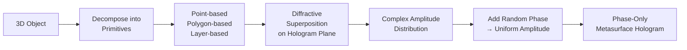
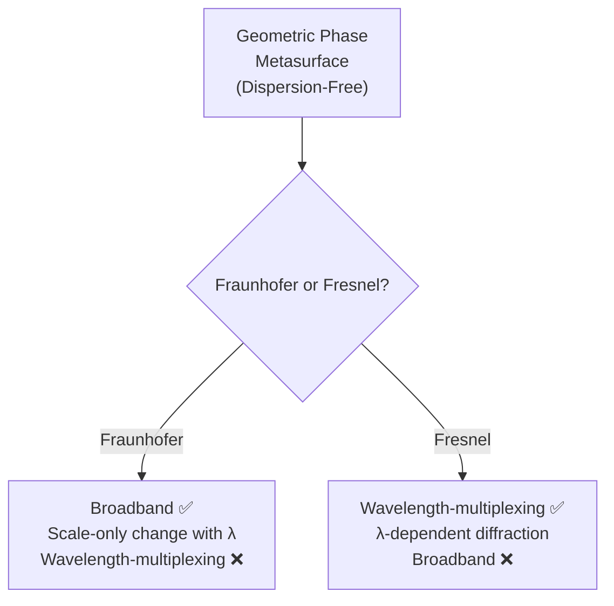
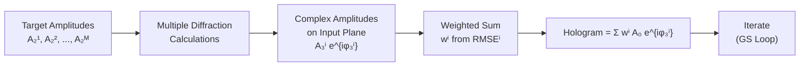

# 5.1.1. Computer-Generated Hologram Algorithms in Metasurface Holography

> [!abstract] 内容概要
> 本节介绍超表面全息中**计算全息 (CGH) 算法的核心框架**。主要内容：(I) **2D vs 3D 全息** — 3D 全息的点/多边形/分层基元分解 + 随机相位法均匀化振幅 [537]，深度学习 CGH 已超越传统方法 [538]；(II) **GS 算法及其变体** — 超表面全息中最常用的 CGH 算法，核心思想是固定输入/输出面振幅、释放输出面相位自由度 → 迭代求解全息图相位分布（详见附录 B）；(III) **Fraunhofer vs Fresnel 全息图** — 前者的衍射图案与观察面位置仅缩放变化 → 消色散几何相位超表面的宽带特性；后者依赖观察面位置 → 位置复用成为可能；(IV) **散斑问题** — 区分采样散斑（$s_{\mathrm{speckle}} = 1.22\frac{\lambda}{L}d$）和噪声散斑，分别讨论抑制策略；(V) **位置复用 CGH** — 多目标 GS 算法 [Eqs. (246)–(247)]；(VI) **宽 FOV 和彩色全息补偿算法**（附录 C/D）；(VII) **新兴 CGH 算法** — 深度学习实时 CGH [538]、自动微分梯度优化 [552] 等前沿趋势。

---

## 5.1 节总览：从衍射理论到全息图

> [!note] 5.1 节的结构
> 超表面全息的设计分两步：(1) **5.1.1（本节）** — 理论建模与计算，根据期望的全息显示目标生成目标全息图；(2) **5.1.2** — 用超表面实现目标全息图（即实现所需的振幅/相位/偏振调制）。
>
> 无论设计 2D 图像还是 3D 场景的全息图，**差异主要在生成全息图的 CGH 算法上**，而超表面设计方法基本相同。

### 衍射模型的基础

当平面波与全息图相互作用时，形成有限尺寸的衍射场。衍射面 → 观察面的传播基于**标量衍射理论**（单色光在各向同性、线性、均匀背景介质中传播）。

> [!important] 先修知识
> 全息图的衍射模型详见**附录 A**，其中的符号和方程将在后续讨论中频繁引用。

---

## 第一部分：2D vs 3D 全息显示

### 3D 全息 — 基本方法

> [!tip] 随机相位法
> 通过对基元添加随机相位模拟**漫散射体 (diffuse scatterers)** [537] → 均匀化全息图的振幅分布 → 后续超表面设计仅需考虑相位调制。

**历史里程碑**：早在 **2013 年**，Huang 等 [537] 已利用几何相位超表面实现了 3D 全息显示。

> [!important] 深度学习超越传统
> 近年来，基于深度学习的 CGH 算法在 3D 场景重建性能上**已超越传统方法** [538]。详细算法介绍见文献 [539]。

### 2D 全息 — 当前研究主流

当前超表面全息的研究**主要集中在 2D 全息显示**，以下详细讨论。

---

## 第二部分：GS 算法及其变体

### GS 算法的历史与定位

> [!important] Gerchberg–Saxton (GS) 算法 [540] (1972)
> 可能是**第一个成功的相位恢复算法**，也是当前超表面全息中**最常用的 CGH 算法**。

| 时间 | 进展 | 文献 |
|:-----|:-----|:-----|
| **1972** | Gerchberg & Saxton 提出 GS 算法 | [540] |
| **1978** | Fienup 重新诠释 GS → **Fienup 算法**（更一般形式） | [541] |

### 核心思想

$$
\boxed{\text{释放输出面（观察面）的相位自由度} + \text{固定输入面和输出面的振幅} \xrightarrow{\text{迭代}} \text{输入面（全息图）的相位分布}}
$$

> [!warning] 算法已偏离原始形式
> GS 和 Fienup 算法最初为天文等领域中的**实值、非负信号**开发 [542]，而非本文讨论的**复振幅信号**。相位恢复算法的系统讨论见 [542][543]。

### 适用性

| 全息图类型 | GS 算法适用？ |
|:-----|:-----|
| **纯相位全息图** (Phase-Only) | ✅ 最常用 |
| **纯振幅全息图** (Amplitude-Only) | ✅ 可扩展 |
| **复振幅全息图** (Complex Amplitude) | ✅ 可扩展 |

> [!note] 详细步骤
> GS 算法及其变体的详细推导见**附录 B**。开源代码仓库 [73] 提供了 GS 算法和宽 FOV 补偿算法的实现。

---

## 第三部分：Fraunhofer vs Fresnel 全息图

> [!important] 两种衍射区域的本质区别
> 观察面位置的不同从根本上决定了全息图的**光学特性**和**复用能力**。

### 对比表

| 属性 | **Fraunhofer 全息图** | **Fresnel 全息图** |
|:-----|:-----|:-----|
| **观察面位置** | Fraunhofer 衍射区（远场） | Fresnel 衍射区（介于 Fraunhofer 和近场之间） |
| **衍射公式** | Eq. (A18) — Fourier 变换 | Eq. (A17) — 含 $e^{i\frac{\pi}{\lambda d}(x^2+y^2)}$ 的 Fourier 变换 |
| **不同位置观察** | 仅**缩放**变化（Fig. 37 左） | 衍射图案**依赖于观察面位置**（Fig. 37 右） |
| **位置复用** | ❌ 不可能 | ✅ 可能 |
| **任意远距离观察** | ✅ 满足 Eq. (A5) 条件即可 | ❌ 仅固定位置可观察 |

![[images/989aaa5d09b9edb3387179b266f22445507e34e1442859e089e5b7a89428dde2.jpg|Figure 37 — Fraunhofer 全息（左）与 Fresnel 全息（右）的全息显示示意]]

> [!abstract] Figure 37 — 图注摘要
> 分别基于 Fraunhofer 衍射（左）和 Fresnel 衍射（右）的全息图显示示意。Fraunhofer 全息图的衍射图案在不同位置仅缩放；Fresnel 全息图的衍射图案依赖于观察面位置。

### 消色散几何相位超表面的特殊性

> [!important] 基于几何相位的超表面全息 — Fraunhofer vs Fresnel

**Fraunhofer 全息**（基于几何相位）：

- 由 Eq. (A18)：同一全息图在不同波长的衍射图案**仅缩放变化** [544]
- → **宽带特性**：全息图像可在满足 Fraunhofer 条件的任意距离被观察
- → ❌ **不能**实现波长复用

**Fresnel 全息**（基于几何相位）：

- Eq. (A17) 中 $e^{i\frac{\pi}{\lambda d}(x^2+y^2)}$ 项导致衍射图案与波长相关
- → ✅ **可**实现波长复用
- → ❌ 不具备宽带特性（仅在特定位置观察正确图像）

---

## 第四部分：散斑 — 获取高质量全息图像的核心挑战

### 两类散斑的区分

> [!important] 明确区分两种散斑的来源 → 对症下药

| 散斑类型 | 来源 | 物理机制 | 特征 |
|:-----|:-----|:-----|:-----|
| **采样散斑** (Sampling Speckle) | 全息图对目标图像的**采样不足** | $N \times N$ 单元数有限 → 实际图像由离散散斑组成 | **超表面全息中的主要问题** |
| **噪声散斑** (Noise Speckle) | 调制误差 | 相邻元原子耦合 + 纳米加工缺陷 [546] | 源于实际调制 ≠ 目标调制 |

> 传统数字全息的噪声来源（光子噪声、传感器电子噪声、A/D 量化噪声 [545]）在超表面全息中不占主导。

### 采样散斑的定量分析

**散斑特征尺寸** — 由 Airy 斑直径估计 [547]：

$$
\boxed{s_{\mathrm{speckle}} = 1.22 \frac{\lambda}{L} d} \tag{245}
$$

其中 $L$ 为全息图孔径尺寸，$d$ 为全息图到观察面的距离。对于 $N \times N$ 个单元、单元尺寸 $a$ 的全息图，$L = Na$。

> [!tip] 参数对散斑尺寸的影响
>
> | 参数增大 | $s_{\mathrm{speckle}}$ 变化 | 物理直觉 |
> |:-----|:-----|:-----|
> | **$\lambda \uparrow$** (更长波长) | $\uparrow$ | 更长波长 → 更大衍射极限 |
> | **$L \uparrow$** (更大孔径) | $\downarrow$ | 更大数值孔径 → 更好分辨能力 |
> | **$d \uparrow$** (更远观察面) | $\uparrow$ | 更远传播 → 更大衍射展宽 |
> | **$N \uparrow$** (更多采样) | $\downarrow$ | 更密集采样 → 更细的散斑 |

**临界条件**：当 $s_{\mathrm{speckle}} <$ 探测器像素尺寸 → 散斑不再被观察到，而是表现为实际图像与目标图像的**强度分布差异**（类似噪声）。

![[images/29d9d3bc6aedc81454b4ab77f1efff6c6db17ad025a221290bb175d12ba448f7.jpg|Figure 38 — 采样散斑对全息图像质量的影响]]

> [!abstract] Figure 38 — 图注摘要
> 采样散斑对全息图像质量的影响。对目标图案 "H"（第 2 列），不同采样条件（第 1 列）下 GS 算法求解的全息图相位分布（第 3 列）、复振幅分布 Fourier 变换结果（第 4 列），以及 Rayleigh–Sommerfeld 衍射结果（第 5 列，$a = 300\,\mathrm{nm}$，$\lambda = 633\,\mathrm{nm}$，$d = 10\,\mathrm{m}$）。采样率从 $20\times20$ → $60\times60$ → $200\times200$ → $10^3\times10^3$，散斑显著被抑制但特征尺寸减小 → 永远不会被真正"消除"。

### 噪声散斑的定量分析

施加不同程度随机噪声 $\alpha_n U(-\frac{\pi}{2}, \frac{\pi}{2})$ 于 GS 算法求解的相位分布（$\alpha_n$ 为噪声强度因子，$U$ 为均匀分布随机数）：

![[images/be4b3ab939b7eb54b7905b49aa4c817ede5db570e45b0fb9576a2576b24944da.jpg|Figure 39 — 噪声散斑对全息图像质量的影响]]

> [!abstract] Figure 39 — 图注摘要
> 噪声散斑对全息图像质量的影响。不同采样条件（第 1–2 行：$40\times40$ / $160\times160$）× 不同噪声系数 $\alpha_n$（$0, 0.5, 1, 2$，第 2–5 列）的 Rayleigh–Sommerfeld 衍射结果。当相位偏差达到一定程度 → 严重的噪声散斑出现在全息图像中。

### 散斑抑制方法

#### 传统数字全息的方法（可直接借鉴）

| 方法 | 原理 | 文献 |
|:-----|:-----|:-----|
| **扩散器** (Diffuser) | 降低激光光源的相干性 | [548] |
| **部分相干光源** | 使用空间/时间部分相干光 | [549] |
| **空间滤波** | 滤除高频散斑噪声 | [550] |
| **改进 CGH 算法** | 算法层面抑制散斑 | [547] |

> 系统综述见 [545]。

#### 超表面全息特有的方法

**1. $2\times2$ 周期性超表面全息图 [114] (2015)**

- 用 $2\times2$ 个独立超表面全息图替代单个全息图
- 每个全息图生成相同图像但散斑分布不同 → **叠加抑制散斑**

**2. 简并腔激光器调控空间相干性 [546] (2021)**

![[images/26767c48fac30e8320ef55937d0e11fc8033d2996a17fb74770c7548f5bb76a2.jpg|Figure 40 — 不同有效空间模式数 $N_E$ 的全息图像]]

> [!abstract] Figure 40 — 图注摘要
> 超表面全息图在不同有效空间模式数 $N_E$ 的空间相干激光照明下的全息图像。$N_E \approx 1$ → 高相干 → 严重散斑；$N_E = 21$ → 散斑显著平滑；$N_E = 30$ → 进一步平滑但分辨率下降。Adapted from [546] under CC license.

> [!warning] 散斑平滑 vs 分辨率
> 有效空间模式越多 → 相干性越差 → 散斑平滑效果越好 → 但**全息图像的分辨率越低**（权衡）。

---

## 第五部分：宽 FOV 和彩色全息补偿算法

### 宽 FOV 补偿

> [!warning] 宽 FOV 下的两个问题
> 1. 基于 Fraunhofer/Fresnel 衍射公式的 GS 算法生成的全息图，在**宽 FOV 下出现显著畸变**（Fig. 38）
> 2. 全息图像的**亮度随衍射角增大而逐渐降低**

→ 宽 FOV 全息图的补偿算法详见**附录 C**。

### 彩色全息补偿

**问题根源**：由 Eqs. (A4) 和 (A6)，Fresnel 和 Fraunhofer 全息图的衍射图案在 $\lambda d$ 恒定时保持不变 → 不同波长的入射光在固定观察面上的衍射图案缩放程度不同。

等价理解：同一全息图对不同波长的 FOV 角不同 [Eq. (275)]。

→ 彩色全息图的补偿算法详见**附录 D**。

| 补偿类型 | 附录 | 核心问题 |
|:-----|:-----|:-----|
| **宽 FOV 补偿** | 附录 C | 大角度衍射的畸变 + 亮度衰减 |
| **彩色全息补偿** | 附录 D | $\lambda d$ 恒定性 → 不同波长缩放程度不同 |

---

## 第六部分：多目标 CGH 算法 — 位置复用

### 问题设定

全息显示目标包含多个输出面（位置 $z^i$），每个面生成全息图像 $I^i(x,y)$，对应目标振幅分布 $A_2^i(x,y) = \sqrt{I^i(x,y)}$。上标 $i = 1,\ldots,M$ 表示位置复用通道索引。

### 算法流程 [159]

> [!important] 全息图的复振幅取加权和

$$
\boxed{A_0(x, y) e^{i\phi_3(x, y)} = \sum_{i=1}^{M} w^i A_0(x, y) e^{i\phi_3^i(x, y)}} \tag{246}
$$

**权重** — 由上一轮迭代中各输出面振幅分布与目标的**均方根误差 (RMSE)** 估计：

$$
\boxed{w^i = \frac{\mathrm{RMSE}^i}{\sum_{i=1}^{M} \mathrm{RMSE}^i}} \tag{247}
$$

剩余步骤与标准 GS 算法相同。

### 标志性成果与应用

| 年份 | 复用类型 | 通道数 | 文献 |
|:-----|:-----|:-----|:-----|
| **2017** | 位置复用 (Fresnel) | 最高 6 | Wei 等 [154] |
| — | 位置 + OAM + 偏振联合复用 | 更高 | [173][392] |
| — | 位置 + 波长复用 (几何相位 Fresnel) | — | [552] |
| — | 非线性几何相位：偏振 + 波长联合复用 | — | [160] |

> [!tip] 位置复用的独特优势
> 位置复用**仅通过多目标 CGH 算法就能实现** → 易于**与其他复用方法集成**（后者的实现依赖于超表面设计而不是 CGH 算法）→ 获得更多总复用通道数。

---

## 第七部分：其他 CGH 算法 — 前沿趋势

| 算法类型 | 核心特点 | 文献 |
|:-----|:-----|:-----|
| **部分相干光散斑消除 CGH** | 基于 camera-in-the-loop 标定技术 | [549] |
| **深度学习实时 3D CGH** | 3D 场景实时全息图生成 | [538] |
| **深度学习高保真高分辨率 CGH** | 图像质量飞跃 | [553] |
| **基于优化的 CGH** | 梯度优化 + 自动微分技术 | [552] |

> [!important] 自动微分 CGH — 已进入超表面全息
> 利用自动微分技术进行梯度优化的 CGH 算法**已被应用于超表面全息领域** [552]。随着对高质量全息图和实时性能的需求增长，这些计算方法将越来越重要。

> [!note] 开源资源
> GS 算法和宽 FOV 补偿算法的实现已在开源代码仓库 [73] 中提供。

---

## 关键公式汇总

| 公式 | 物理含义 | 编号 |
|:-----|:---------|:-----|
| $s_{\mathrm{speckle}} = 1.22\frac{\lambda}{L}d$ | 采样散斑特征尺寸 (Airy 斑直径) | (245) |
| $A_0 e^{i\phi_3} = \sum_{i=1}^{M} w^i A_0 e^{i\phi_3^i}$ | 多目标 CGH 全息图加权和 | (246) |
| $w^i = \frac{\mathrm{RMSE}^i}{\sum_{i=1}^{M}\mathrm{RMSE}^i}$ | 通道权重 — RMSE 比例 | (247) |

---

## 与 5.1.2 的联系

> [!note] 从 CGH 算法到超表面实现
> **5.1.1（本节）** 覆盖所有 CGH 算法的核心内容 — 给定目标图像/场景，生成全息图的复振幅/相位分布。
>
> **5.1.2** 将介绍如何用不同类型的超表面（纯相位/纯振幅/复振幅）**物理实现**这些全息图，以及各种相位调制机制在全息中的具体特性（几何相位的宽带特性 vs 共振/传播相位的偏振复用能力等）。

---

## 参考文献

- [73] S. Gao & H. Ma, "Open-source code repository for metasurface hologram design," GitHub.
- [114] G. Zheng, H. Mühlenbernd, M. Kenney, et al., "Metasurface holograms reaching 80% efficiency," *Nat. Nanotechnol.* **10**, 308–312 (2015).
- [154] Q. Wei, L. Huang, X. Li, et al., "Broadband multiplane holography based on plasmonic metasurface," *Adv. Opt. Mater.* **5**, 1700434 (2017).
- [159] G. Makey, Ö. Yavuz, D. K. Kesim, et al., "Breaking crosstalk limits for dynamic holographic displays," *Nat. Photonics* **13**, 610–616 (2019).
- [160] Y. Gao, Y. Li, Y. Liu, et al., "Nonlinear holographic all-dielectric metasurfaces," *Nano Lett.* **20**, 5471–5478 (2020).
- [173] H. Ren, X. Fang, J. Jang, et al., "Complex-amplitude metasurface-based 3D nanoprinting," *Nat. Nanotechnol.* **17**, 1080–1086 (2022).
- [392] H. Ren, G. Briere, X. Fang, et al., "Metasurface orbital angular momentum holography," *Nat. Commun.* **10**, 2986 (2019).
- [537] L. Huang, X. Chen, H. Mühlenbernd, et al., "Three-dimensional optical holography using a plasmonic metasurface," *Nat. Commun.* **4**, 2808 (2013).
- [538] L. Shi, B. Li, C. Kim, et al., "Towards real-time photorealistic 3D holography with deep neural networks," *Nature* **591**, 234–239 (2021).
- [539] D. Pi, J. Liu, Y. Wang, "Review of computer-generated hologram algorithms for color dynamic holographic three-dimensional display," *Light Sci. Appl.* **11**, 231 (2022).
- [540] R. W. Gerchberg, W. O. Saxton, "A practical algorithm for the determination of phase from image and diffraction plane pictures," *Optik* **35**, 237–246 (1972).
- [541] J. R. Fienup, "Reconstruction of an object from the modulus of its Fourier transform," *Opt. Lett.* **3**, 27–29 (1978).
- [542] J. R. Fienup, "Phase retrieval algorithms: a personal tour," *Appl. Opt.* **52**, 45–56 (2013).
- [543] Y. Shechtman, Y. C. Eldar, O. Cohen, et al., "Phase retrieval with application to optical imaging: a contemporary overview," *IEEE Signal Process. Mag.* **32**, 87–109 (2015).
- [544] X. Li, L. Chen, Y. Li, et al., "Multicolor 3D meta-holography by broadband plasmonic modulation," *Sci. Adv.* **2**, e1601102 (2016).
- [545] V. Bianco, P. Memmolo, M. Leo, et al., "Strategies for reducing speckle noise in digital holography," *Light Sci. Appl.* **7**, 48 (2018).
- [546] Y. Eliezer, G. Qu, W. Yang, et al., "Suppressing meta-holographic artifacts by controlling laser coherence," *Light Sci. Appl.* **10**, 85 (2021).
- [547] F. Wyrowski, O. Bryngdahl, "Speckle-free reconstruction in digital holography," *J. Opt. Soc. Am. A* **6**, 1171–1174 (1989).
- [548] J. W. Goodman, *Speckle Phenomena in Optics: Theory and Applications*, 2nd ed. (SPIE, 2020).
- [549] Y. Peng, S. Choi, N. Padmanaban, et al., "Speckle-free holography with partially coherent light sources and camera-in-the-loop calibration," *Sci. Adv.* **6**, eabc0221 (2020).
- [550] J. Garcia-Sucerquia, J. A. Herrera Ramírez, D. Velásquez Prieto, "Reduction of speckle noise in digital holography by using digital image processing," *Optik* **116**, 44–48 (2005).
- [551] G. Makey, S. Galioglu, R. Ghaffari, et al., "Universality of dissipative self-assembly from quantum dots to human cells," *Nat. Phys.* **16**, 795–801 (2020).
- [552] S. Jolly, N. K. Fontaine, S. Zhang, et al., "Gradient-based optimization of computer-generated holograms for metasurface holography," *Opt. Express* **30**, 29352–29365 (2022).
- [553] C. Chang, D. Chu, Y. Wu, et al., "High-fidelity and high-resolution phase-only holography with deep learning," *Nat. Commun.* **15**, 1128 (2024).
