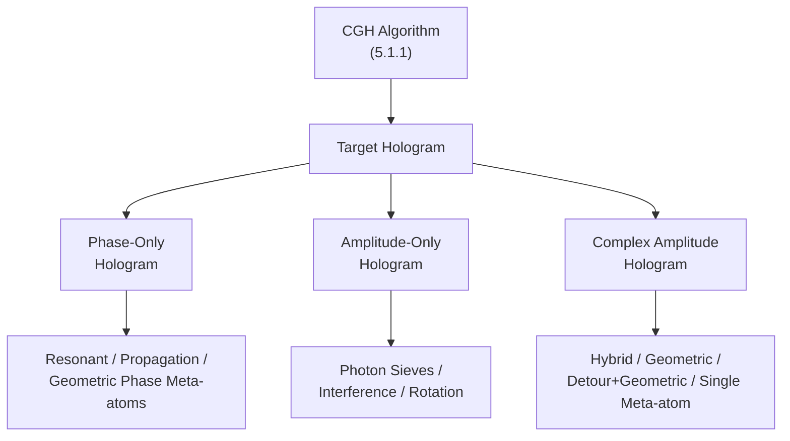

# 5.1.2. Metasurface Design

> [!abstract] 内容概要
> 本节将 5.1.1 的 CGH 算法生成的**目标全息图**（相位/振幅/复振幅分布）通过超表面**物理实现**。按全息图调制类型分为三大类：**(I) 纯相位超表面全息** — 四种相位机制的各自特性：共振/传播相位的偏振复用能力 vs 几何/迂回相位的消色散宽带特性；Fraunhofer 全息的 LCP/RCP 对角镜像关系 [Eqs. (248)–(250)] 与 Fresnel 全息的 $-d$ 镜像 [Eqs. (251)–(253)] → 正交圆偏振态复用（8 通道 [154]）；**(II) 纯振幅超表面全息** — 光子筛 [560] 的各向同性振幅调制；$2\times2$ 元原子干涉法 [Eqs. (254)–(259)]；纯旋转振幅操控 [Eqs. (260)–(261)]；**(III) 复振幅超表面全息** — 四大实现方法：混合相位干涉法 [556]、纯几何相位旋转差法 [555]（Lee 等 2018 的中心重叠结构 + 位置复用）、迂回相位 + 几何相位联合法 [168]（$d_1-d_2=a/2$ + $\theta_1-\theta_2$ 控振幅 + $\theta_1+\theta_2$ 控偏振 [Eq. (267)]）→ 扩展到 $2\times2$ 元原子 [11] → 混合相位单元子法 [357][557]（量化振幅等级 + Eq. (269) 起始相位补偿）→ 多高度元原子 [392]。复振幅全息的三大优势：更高图像质量、更多复用通道、可同时重建振幅和相位信息（→ 3D 物体表面纹理）。

---

## 三类全息图的调制方式

---

## 第一部分：纯相位超表面全息

### (I) 共振/传播相位 — 偏振复用能力

基于共振或传播相位机制，通过选择适当的元原子结构参数，可实现：

- **正交线偏振态复用**的全息图 [170]
- 甚至**波长复用**超表面全息图 [527]

### (II) 几何/迂回相位 — 消色散宽带特性

> [!important] 相位消色散 (Phase Dispersion-Free) 的核心优势
> 几何相位和迂回相位超表面具有**相位消色散**特性 — 对不同波长入射光引入的相移分布仅相差一个常数项。
>
> → 基于此实现的 Fraunhofer 全息图在 5.1.1 节所述的**工作带宽**内具有宽带特性。

**理想情况下**（不考虑相邻元原子耦合），工作带宽内不同波长的全息图像仅有两个差异：

| 差异 | 原因 |
|:-----|:-----|
| **缩放程度不同** | $\lambda d$ 恒定性 → 不同 $\lambda$ 对应不同缩放比（5.1.1 节） |
| **能量利用效率不同** | 不同波长的透过率 (几何相位 PCE / 迂回相位衍射效率) 各异 |

### (III) Fraunhofer 几何相位全息 — LCP/RCP 对角镜像

对于设计工作在 **LCP → RCP** 转换场景下的几何相位 Fraunhofer 全息图（位于 $z=0$），引入的相位分布为 $\phi(x',y',0)$，振幅为常数 $A_0$。由 Eq. (A18)，观察面 $z=d$ 上的全息图像满足：

$$
\boxed{I(x, y, d) = \left| \mathcal{F}\left\{A_0 e^{i\phi(x', y', 0)}\right\}\left(u = \frac{x}{\lambda d}, v = \frac{y}{\lambda d}, d\right) \right|^2} \tag{248}
$$

当同一全息图工作在 **RCP → LCP** 转换场景下：$\phi'(x',y',0) = -\phi(x',y',0)$ [Eq. (23)]，全息图像满足 [554]：

$$
\boxed{I^{\prime}(x, y, d) = \left| \mathcal{F}\left\{A_0 e^{-i\phi(x', y', 0)}\right\}\left(u = \frac{x}{\lambda d}, v = \frac{y}{\lambda d}, d\right) \right|^2} \tag{249}
$$

利用 Eq. (A11) 展开 Eqs. (248)–(249)，可得两个全息图像的关系：

$$
\boxed{I^{\prime}(x, y, d) = I(-x, -y, d)} \tag{250}
$$

> [!important] 对角镜像变换
> Eq. (250) 说明：RCP → LCP 模式下生成的全息图像是 LCP → RCP 模式下图像的**对角镜像**。
>
> **应用** (Fig. 41(a))：进一步将观察区域限制在左半或右半平面 → 实现**正交圆偏振态复用**的显示效果 [554]。

#### 实验验证 (Fig. 41(a))

在 633 nm 波长，不同圆偏振光入射下，几何相位 Fraunhofer 超表面全息图生成的全息图像呈现对角镜像关系。

### (IV) Fresnel 几何相位全息 — 偏振复用 + 位置复用联合

对于设计工作在 **LCP → RCP** 转换场景下的几何相位 Fresnel 全息图，由 Eq. (A17)：

$$
\boxed{I(x, y, d) = \left| \mathcal{F}\left\{A_0 e^{i\phi(x', y', 0)} e^{i\frac{\pi}{\lambda d}(x'^2 + y'^2)}\right\}\left(u = \frac{x}{\lambda d}, v = \frac{y}{\lambda d}, d\right) \right|^2} \tag{251}
$$

同一全息图工作在 **RCP → LCP** 场景下：

$$
I^{\prime}(x, y, d) = \left| \mathcal{F}\left\{A_0 e^{-i\phi(x', y', 0)} e^{i\frac{\pi}{\lambda d}(x'^2 + y'^2)}\right\}\left(u = \frac{x}{\lambda d}, v = \frac{y}{\lambda d}, d\right) \right|^2 \tag{252}
$$

两个全息图像的关键关系：

$$
\boxed{I^{\prime}(x, y, d) = I(-x, -y, -d)} \tag{253}
$$

> [!important] $-d$ 镜像 → 正交圆偏振复用
> RCP→LCP 在 $z=d$ 处生成的全息图像 = LCP→RCP 在 **$z=-d$** 处生成图像的对角镜像。
>
> **技巧**：在位置复用的多目标 CGH 算法中设 $z^1 = d$、$z^2 = -d$，用几何相位超表面实现全息图 → 在 $z=d$ 观察面上同时实现**正交圆偏振态 + 位置复用** [154][558]。

#### Huang 组 [154] (2017) — 8 通道联合复用

将位置复用与偏振复用联合，达到 **8 个复用通道**（Fig. 41(b)）。

---

## 第二部分：纯振幅超表面全息

### 与纯相位全息的对比

| 方法 | 固定量 | 自由度 | 常用程度 |
|:-----|:-----|:-----|:-----|
| **纯相位全息** | 振幅 = 常数 | **相位** | ⭐⭐⭐ (主流) |
| **纯振幅全息** | 相位 = 常数 | **振幅** [559] | ⭐ (少数场景) |

> 超表面**更擅长相位调制** → 纯相位方法更常用。

### (I) 光子筛 (Photon Sieve) [560]

- 基于光子筛结构的超表面适合振幅调制 [561]
- **优势**：光子筛结构各向同性 → **偏振不敏感**
- **限制**：振幅调制的**量化范围通常非常有限** [559]

### (II) $2\times2$ 元原子干涉法 — 振幅连续操控

**单元结构** (Fig. 41(c))：$2\times2$ 元原子阵列作为振幅调制超表面单元，包含两种不同尺寸和旋转角的元原子。

设两种元原子对任意正交偏振态的调制为 $t_1^\pm e^{i\phi_1^\pm}$ 和 $t_2^\pm e^{i\phi_2^\pm}$，忽略相邻元原子耦合（LPA 假设），单元的总输出为干涉叠加：

$$
\boxed{t^{\pm} e^{i\phi^{\pm}} = \frac{1}{2}\left(t_1^{\pm} e^{i\phi_1^{\pm}} + t_2^{\pm} e^{i\phi_2^{\pm}}\right)} \tag{254}
$$

其中 $t^{\pm}$ 和 $\phi^{\pm}$ 分别满足：

$$
\boxed{(t^{\pm})^2 = \frac{1}{4}\left((t_1^{\pm})^2 + (t_2^{\pm})^2 + 2t_1^{\pm} t_2^{\pm} \cos(\phi_1^{\pm} - \phi_2^{\pm})\right)} \tag{255}
$$

$$
\boxed{\phi^{\pm} = \arctan \frac{t_1^{\pm} \sin\phi_1^{\pm} + t_2^{\pm} \sin\phi_2^{\pm}}{t_1^{\pm} \cos\phi_1^{\pm} + t_2^{\pm} \cos\phi_2^{\pm}}} \tag{256}
$$

> [!tip] 通过混合相位实现独立的振幅调制
> 基于混合相位机制（2.1.5 节）可独立调制任意正交偏振态的相位 → $\phi_1^\pm - \phi_2^\pm$ 可通过改变元原子**形状、尺寸和旋转角**自由调节 → 任意正交偏振态的**独立振幅调制**。
>
> 基于此，Fan 等 [562] (2020) 实现了正交圆偏振态复用的超表面纳米打印（nanoprinting）。

**高透过率近似**（$t_1^\pm \approx 1$, $t_2^\pm \approx 1$）：

$$
\boxed{t^{\pm} e^{i\phi^{\pm}} = \cos\frac{\phi_1^{\pm} - \phi_2^{\pm}}{2} e^{i\frac{\phi_1^{\pm} + \phi_2^{\pm}}{2}}} \tag{257}
$$

**纯振幅条件**（相位 = 0）→ $\phi_2^{\pm} = -\phi_1^{\pm}$，即：

$$
\boxed{\phi_2^{\pm} = -\phi_1^{\pm}} \tag{258}
$$

代入 Eq. (257) 得：

$$
\boxed{t^{\pm} = \cos\phi_1^{\pm}} \tag{259}
$$

> 缺点：晶格常数**翻倍**。

### (III) 纯旋转振幅操控 — 幅度由 $\theta$ 控制，相位不变

![[images/8ffad52f3dd8dfc2fe6f059c70ce5168a0abaabcd2e2633254a41e3b54ada3ec.jpg|Figure 42 — 不同偏振通道的振幅/相位调制随旋转角 $\theta$ 的变化]]

> [!abstract] Figure 42 — 图注摘要
> 旋转角 $\theta$ 的元原子对不同偏振通道的透射系数。上：$y(x)$ 偏振光在 $x(y)$ 偏振入射下的振幅 $|O|$ 和相位。中：LCP 入射 → RCP 出射。下：RCP 入射 → LCP 出射。元原子的 Jones 矩阵由 Eq. (14) 描述，$t_x = t_y = 1$，$|\phi_x - \phi_y| = \pi$。

**核心机制**：对于 Jones 矩阵由 Eq. (14) 描述的元原子，$x$ 偏振入射 → $y$ 偏振出射的复振幅调制为：

$$
\boxed{O(\theta) = \begin{bmatrix} 0 & 1 \end{bmatrix} \mathbf{T} \begin{bmatrix} 1 \\ 0 \end{bmatrix} = \frac{1}{2}\sin 2\theta\left(t_x e^{i\phi_x} - t_y e^{i\phi_y}\right)} \tag{260}
$$

**当 $t_x = t_y = 1$ 且 $|\phi_x - \phi_y| = \pi$ 时** (Fig. 42)：

- $\theta$ 从 $0 \to \frac{\pi}{4}$：振幅从 $0 \to 1$（最大振幅 $\frac{1}{2}(t_x + t_y)$），**相位保持不变**
- 四个等振幅旋转角 $\theta$、$\frac{\pi}{2}-\theta$、$-\theta$、$\theta-\frac{\pi}{2}$  → 对应不同的几何相位 → 实现振幅和相位的**独立调制** [564][565]

$$
O(\theta) = O\left(\frac{\pi}{2} - \theta\right) = e^{i\pi}\bigl(O(-\theta)\bigr) = e^{i\pi}\bigl(O(\theta - \frac{\pi}{2})\bigr) \tag{261}
$$

> [!tip] 仅靠旋转元原子即可连续控制振幅而不改变相位 — 几何相位的"反向操作"

---

## 第三部分：复振幅超表面全息

### 复振幅 vs 纯相位 — 三大核心优势

| 优势 | 说明 | 文献 |
|:-----|:-----|:-----|
| **更高质量图像** | 额外振幅维度 → 更高 SNR + 散斑抑制 | [11][555][557] |
| **更多复用通道** | 振幅 + 相位双层自由度 | [555] |
| **重建相位信息** | 可**直接**通过逆衍射公式（Eq. B1/B2）从目标计算复振幅 → 同时重建振幅和**相位**信息 → 保留 3D 物体表面纹理 | [557] |

> [!important] 对 3D 全息的关键意义
> 5.1.1 节指出：纯相位全息需通过向基元添加随机相位来均匀化振幅 [537] — 这**破坏了 3D 物体的表面纹理信息**。复振幅全息**无此限制** → 可忠实再现 3D 物体的表面粗糙度等纹理效果。

---

### 方法 (I)：混合相位干涉法 [556] (2021)

**基础**：Eq. (257) 提供了任意正交偏振态的任意复振幅调制。

**实现** (Fig. 41(c))：基于混合相位调制机制，通过改变两种元原子的形状、尺寸和旋转角调节 $\phi_1^{\pm}$ 和 $\phi_2^{\pm}$。

| 参数 | Liu 等 [556] |
|:-----|:-----|
| **元原子** | 矩形 $\mathrm{TiO_2}$ 柱，$h = 600\,\mathrm{nm}$ |
| **单元尺寸** | $2 \times 450\,\mathrm{nm}$ |
| **工作波长** | ~530 nm |
| **复用类型** | 正交线偏振态 + Fresnel 全息 |

> Fig. 41(e)：正交线偏振复用的复振幅 Fresnel 超表面全息图实验结果。

### 方法 (II)：纯几何相位旋转差法 [555] (2018)

仅基于几何相位（$\phi_1^{\sigma} = 2\sigma\theta_1$, $\phi_2^{\sigma} = 2\sigma\theta_2$），Eq. (257) 简化为：

$$
\boxed{t^{\sigma} e^{i\phi^{\sigma}} = \cos(\theta_1 - \theta_2) e^{i\sigma(\theta_1 + \theta_2)}} \tag{263}
$$

> [!warning] 纯几何相位的局限
> 此时 $\phi_1^{+} = -\phi_1^{-}$、$\phi_2^{+} = -\phi_2^{-}$ [Eq. (264)] — 正交偏振态的相位是**耦合**的（不同于混合相位机制的独立调制），→ **不能**实现正交圆偏振复用（退化回 Eq. (250) / Eq. (253) 的情况）。
>
> 但如果固定 $\sigma$ → 任意复振幅调制 ✅ + 继承几何相位的**宽带特性** ✅。

**单元结构创新** (Fig. 41(d))：将两个不同旋转角的矩形柱元原子的**中心重叠**作为超表面单元 → 工作于 RCP → LCP 场景。

> Fig. 41(f)：位置复用的复振幅 Fresnel 全息图实验结果 — 相同设计和加工条件下，SNR 和散斑抑制**显著优于**纯相位全息图。

### 方法 (III)：迂回相位 + 几何相位联合法 [168] (2020)

**核心创新** (Fig. 41(g))：将迂回相位和几何相位结合 → 实现光的**振幅、相位和偏振的独立且任意控制**。

**单元构成**：两个相同各向异性结构的元原子，旋转角 $\theta_1, \theta_2$，位移 $d_1, d_2$。

设计元原子尺寸使短轴电磁响应远小于长轴 → Jones 矩阵：

$$
\mathbf{T}_1 = \mathbf{R}(\theta_1) \begin{bmatrix} e^{i\sigma_{\mathrm{d}} 2\pi \frac{d_1}{a}} & 0 \\ 0 & 0 \end{bmatrix} \mathbf{R}(-\theta_1), \quad
\mathbf{T}_2 = \mathbf{R}(\theta_2) \begin{bmatrix} e^{i\sigma_{\mathrm{d}} 2\pi \frac{d_2}{a}} & 0 \\ 0 & 0 \end{bmatrix} \mathbf{R}(-\theta_2) \tag{265}
$$

总 Jones 矩阵：

$$
\mathbf{T} = \mathbf{T}_1 + \mathbf{T}_2 \tag{266}
$$

取 $\sigma_{\mathrm{d}} = +1$ 且 $d_1 - d_2 = \frac{a}{2}$，对 $\vec{E}^{\mathrm{in}} = [0\,\,1]^{\top}$ 入射：

$$
\boxed{\vec{E}^{\mathrm{out}} = \mathbf{T}\vec{E}^{\mathrm{in}} = i e^{i\pi\frac{d_1+d_2}{a}} \sin(\theta_1 - \theta_2) \begin{bmatrix} \cos(\theta_1 + \theta_2) \\ \sin(\theta_1 + \theta_2) \end{bmatrix}} \tag{267}
$$

> [!important] 三个自由度 — 三个独立调控维度

| 自由度 | 调控参数 | 物理含义 |
|:-----|:-----|:-----|
| **相位** | $d_1 + d_2$ | 迂回相位控制 |
| **振幅** | $\theta_1 - \theta_2$ | 旋转角之差 → $\sin(\theta_1 - \theta_2)$ |
| **偏振态** | $\theta_1 + \theta_2$ | 出射光偏振方向 |

> 此方法在彩色全息显示中的应用见 5.2.2 节。
>
> 同年，Bao 等 [566] 将此单元结构用于矢量涡旋光束生成（用遗传算法而非显式推导寻找结构参数）。

### 方法 (III) 的扩展：$2\times2$ 元原子单元 [11] (2021)

为获得更高调制自由度，Bao 等 [11] 将单元扩展为 $2\times2$ 元原子（$n=4$）：

$$
\mathbf{T} = \sum_{j=1}^{n} \mathbf{T}_j = \begin{bmatrix}
\sum_{j=1}^{n} e^{i\sigma_{\mathrm{d}}2\pi\frac{d_j}{a}} \cos^2\theta_j & \sum_{j=1}^{n} e^{i\sigma_{\mathrm{d}}2\pi\frac{d_j}{a}} \sin\theta_j\cos\theta_j \\
\sum_{j=1}^{n} e^{i\sigma_{\mathrm{d}}2\pi\frac{d_j}{a}} \sin\theta_j\cos\theta_j & \sum_{j=1}^{n} e^{i\sigma_{\mathrm{d}}2\pi\frac{d_j}{a}} \sin^2\theta_j
\end{bmatrix} \tag{268}
$$

共 **8 个自由度**（$\theta_j$, $d_j$，$j=1,\ldots,4$）→ 5.2.1 节将介绍其在偏振复用中的应用。

### 方法 (IV)：单元子复振幅超表面 [357][557]

以上方法均基于**多个元原子干涉**产生复杂光场调制。对于单元子超表面，需遍历元原子形状/尺寸同时满足振幅和相位要求 → 通常需要足够大的单元和多种元原子形状 [567]。

#### Song 等 [357] (2018) + Overvig 等 [557] (2019) — 混合相位单元子法

**步骤**：

1. 遍历元原子形状/尺寸 → 选择多个具有不同**效率**（透过率 × PCE）的元原子 → 对应不同量化等级的振幅调制（振幅主要通过共振/传播相位实现 [568]）
2. 通过旋转引入相位调制
3. **初始相位补偿** — 不同形状/尺寸的元原子在 $\theta=0$ 时几何相位 $\phi_i$ 不一致：

$$
\boxed{\theta = \frac{\phi_{\mathrm{d}} - \phi_i}{2\sigma}} \tag{269}
$$

其中 $\sigma = \pm 1$ 对应 LCP/RCP 入射。

> [!warning] 局限性
> 不同形状/尺寸元原子有不同相位色散特性 → 此方法的复振幅超表面**仅能在单一工作波长操作**。

**实验验证** (Fig. 41(h)–(i))：

- **3D 物体** (Fig. 41(h))：忠实再现表面纹理效果（粗糙度等）
- **相位信息重建** (Fig. 41(i))：太极图振幅 + 相位梯度叠加 → 仅在**特定倾斜观察角**可见全息图像 → 验证复振幅全息可同时重建振幅和相位信息

#### Ren 等 [392] (2020) — 多高度元原子

同样实现不同量化等级的振幅调制，但通过调节元原子**高度**（而非形状/尺寸）→ 需要 3D 激光纳米打印等特殊制造技术（见 3.1 节）。

---

## 总览图

![[images/6548fc3bf001995cb8a73104dae38309eb97a859983de8b8fb93dea43d7298c0.jpg|Figure 41 — 超表面全息的设计方法]]

> [!abstract] Figure 41 — 图注摘要
> 全息图的超表面设计。(a) 几何相位 Fraunhofer 超表面全息图在不同圆偏振光入射下的 633 nm 实验结果（对角镜像）。(b) 几何相位 Fresnel 超表面全息图在不同观察位置和不同圆偏振态的 8 通道复用实验结果。(c) 用于振幅操控的 $2\times2$ 元原子单元示意。(d) 中心重叠复振幅全息单元示意 [555]。(e) 正交线偏振复用的复振幅 Fresnel 超表面全息实验结果 [556]。(f) 位置复用复振幅 Fresnel 全息图在 532 nm 的实验结果 [555]。(g) 基于迂回相位 + 几何相位的复振幅调制单元示意 [168]。(h) 复振幅超表面全息对 3D 物体的重建结果 [557]。(i) 目标全息场景的复振幅分布（上）+ 倾斜观察角 $\beta=-20^\circ$（中）和 $0^\circ$（下）的全息图像 [557]。
>
> (a) [554] CC license. (b) Wei et al. [154]. (d)(f) Lee et al. [555]. (e) [556] CC license. (h)(i) [557] CC license.

---

## 三大全息图类型的设计方法总结

| 全息图类型 | 实现方法 | 自由度来源 | 偏振复用 | 宽带特性 | 代表文献 |
|:-----|:-----|:-----|:-----|:-----|:-----|
| **纯相位** (共振/传播) | 选择结构参数覆盖 $2\pi$ 相位 | 形状/尺寸 | ✅（正交线偏振） | ❌ | [170][527] |
| **纯相位** (几何/迂回) | Fraunhofer → 宽带；Fresnel → 波长/位置复用 | 旋转/位移 | ✅（正交圆偏振 + 位置） | ✅ (Fraunhofer) | [154][554] |
| **纯振幅** (干涉法) | Eq. (257)–(259)：$\phi_1-\phi_2$ 控振幅 | 双元原子相位差 | ✅（任意正交偏振） | — | [562] |
| **纯振幅** (旋转法) | Eq. (260)：$\sin 2\theta$ 控振幅，相位不变 | 旋转角 $\theta$ | — | ✅（几何相位） | [564] |
| **复振幅** (混合相位) | Eq. (257)：独立控制 $\phi_1^{\pm}$ 和 $\phi_2^{\pm}$ + 旋转补偿 Eq. (269) | 6 自由度 ($\phi_1^{\pm},\phi_2^{\pm},\theta_{1,2}$) | ✅（任意正交偏振） | ❌（单波长） | [556][557] |
| **复振幅** (几何相位) | Eq. (263)：$\theta_1-\theta_2$ 控振幅, $\theta_1+\theta_2$ 控相位 | 2 自由度 ($\theta_{1,2}$) | ❌（单偏振通道） | ✅ | [555] |
| **复振幅** (迂回+几何) | Eq. (267)：$d_1+d_2$ 相位, $\theta_1-\theta_2$ 振幅, $\theta_1+\theta_2$ 偏振 | 4 自由度 → 8 自由度 ($2\times2$ 扩展) | ✅（任意偏振态） | ✅（消色散） | [168][11] |

---

## 关键公式汇总

| 公式 | 物理含义 | 编号 |
|:-----|:---------|:-----|
| $I'(x,y,d) = I(-x,-y,d)$ | Fraunhofer — LCP/RCP 对角镜像 | (250) |
| $I'(x,y,d) = I(-x,-y,-d)$ | Fresnel — $-d$ 镜像 → 正交圆偏振+位置联合复用 | (253) |
| $t^{\pm}e^{i\phi^{\pm}} = \frac{1}{2}(t_1^{\pm}e^{i\phi_1^{\pm}} + t_2^{\pm}e^{i\phi_2^{\pm}})$ | 双元原子干涉叠加 | (254) |
| $t^{\pm}e^{i\phi^{\pm}} = \cos\frac{\phi_1^{\pm}-\phi_2^{\pm}}{2} e^{i\frac{\phi_1^{\pm}+\phi_2^{\pm}}{2}}$ | 高透射率近似下的复振幅 | (257) |
| $O(\theta) = \frac{1}{2}\sin 2\theta(t_x e^{i\phi_x} - t_y e^{i\phi_y})$ | 纯旋转振幅操控 | (260) |
| $\vec{E}^{\mathrm{out}} = i e^{i\pi\frac{d_1+d_2}{a}} \sin(\theta_1-\theta_2) [\cos(\theta_1+\theta_2)\,\sin(\theta_1+\theta_2)]^{\top}$ | 迂回+几何 — 三自由度独立调控 | (267) |
| $\theta = \frac{\phi_{\mathrm{d}} - \phi_i}{2\sigma}$ | 单元子复振幅 — 初始相位补偿 | (269) |

---

## 参考文献

- [11] Y. Bao, L. Wen, Q. Chen, et al., "Toward the capacity limit of 2D planar Jones matrix with a single-layer metasurface," *Sci. Adv.* **7**, eabh0365 (2021).
- [154] Q. Wei, L. Huang, X. Li, et al., "Broadband multiplane holography based on plasmonic metasurface," *Adv. Opt. Mater.* **5**, 1700434 (2017).
- [168] J. Deng, Y. Yang, X. Tao, et al., "Spatial frequency multiplexed meta-holography and meta-nanoprinting," *ACS Nano* **14**, 2290–2298 (2020).
- [170] J. P. Balthasar Mueller, N. A. Rubin, R. C. Devlin, et al., "Metasurface polarization optics: independent phase control of arbitrary orthogonal states of polarization," *Phys. Rev. Lett.* **118**, 113901 (2017).
- [357] X. Song, L. Huang, L. Sun, et al., "Near-field and far-field complex-amplitude meta-hologram with polarization multiplexing," *Adv. Mater.* **30**, 1803126 (2018).
- [392] H. Ren, X. Fang, J. Jang, et al., "Complex-amplitude metasurface-based 3D nanoprinting," *Nat. Nanotechnol.* **17**, 1080–1086 (2022).
- [527] W. T. Chen, A. Y. Zhu, J. Sisler, et al., "Multiwavelength achromatic metasurface doublet," *Nano Lett.* **18**, 6386–6392 (2018).
- [554] X. Chen, L. Huang, H. Mühlenbernd, et al., "Dual-polarity plasmonic metalens for visible light," *Nat. Commun.* **3**, 1198 (2012).
- [555] G.-Y. Lee, G. Yoon, S.-Y. Lee, et al., "Complete complex amplitude modulation with an all-dielectric metasurface," *Nanoscale* **10**, 4237–4245 (2018).
- [556] M. Liu, W. Zhu, P. Huo, et al., "Multifunctional metasurfaces enabled by simultaneous and independent control of phase and amplitude for orthogonal polarization states," *Light Sci. Appl.* **10**, 107 (2021).
- [557] A. C. Overvig, S. Shrestha, S. C. Malek, et al., "Dielectric metasurfaces for complete and independent control of the optical amplitude and phase," *Light Sci. Appl.* **8**, 92 (2019).
- [558] L. Huang, X. Chen, H. Mühlenbernd, et al., "Dispersionless phase discontinuities for controlling light propagation," *Nano Lett.* **12**, 5750–5755 (2012).
- [559] Q. Chen, Z. Shen, Y. Qiu, et al., "Amplitude-only metasurface holography," *Opt. Lett.* **46**, 1261–1264 (2021).
- [560] L. Kipp, M. Skibowski, R. L. Johnson, et al., "Sharper images by focusing soft X-rays with photon sieves," *Nature* **414**, 184–188 (2001).
- [561] K. Huang, H. Liu, F. J. Garcia-Vidal, et al., "Ultrahigh-capacity non-periodic photon sieves operating in visible light," *Nat. Commun.* **6**, 7059 (2015).
- [562] Q. Fan, M. Liu, W. Zhu, et al., "Independent amplitude control of arbitrary orthogonal states of polarization via dielectric metasurfaces," *Phys. Rev. Lett.* **125**, 267402 (2020).
- [563] S. So, J. Rho, "Geometrically flat tiny optical instruments," *Light Sci. Appl.* **11**, 128 (2022).
- [564] A. Arbabi, Y. Horie, M. Bagheri, et al., "Dielectric metasurfaces for complete control of phase and polarization with subwavelength spatial resolution and high transmission," *Nat. Nanotechnol.* **10**, 937–943 (2015).
- [565] R. C. Devlin, A. Ambrosio, N. A. Rubin, et al., "Arbitrary spin-to-orbital angular momentum conversion of light," *Science* **358**, 896–901 (2017).
- [566] Y. Bao, J. Ni, C.-W. Qiu, "Amplitude and phase independently reconfigurable metasurface for vector vortex beams," *Adv. Mater.* **32**, 1907656 (2020).
- [567] G. Yoon, J. Rho, "Maximizing the working bandwidth of geometric metasurface holograms," *Nanophotonics* **8**, 2021–2030 (2019).
- [568] A. C. Overvig, S. C. Malek, N. Yu, "Multifunctional nonlocal metasurfaces," *Phys. Rev. Lett.* **125**, 017402 (2020).
