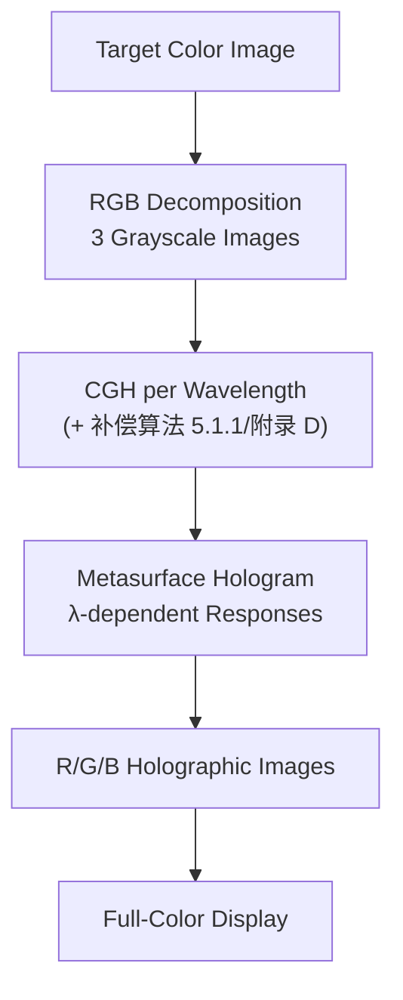

# 5.2.2. Wavelength-Multiplexed Metasurfaces

> [!abstract] 内容概要
> 波长复用是超表面全息实现**全彩色全息显示**这一长期目标的关键。目标彩色图像分解为 R/G/B 三基色灰度图像 → 超表面全息图对红、绿、蓝波长分别生成对应色分量的全息图像 → 合成为彩色图像。四条设计路线：**(I) 元原子数据库独立调制各波长相位** — 单个元原子难以同时满足多波长独立相位调制（各波长目标相移随机相关 + 元原子色散限制 [4.4.2 节]）→ 需大晶格常数 + 复杂结构 + 逆设计 [429][449]；(II) **空间复用策略** — $2\times2$ 元原子单元各管一个波长 [356]，色串扰通过元原子设计 [356][532] 或 Fabry–Pérot 滤波微阵列 [576] 消除；元原子图案化排列 → 纳米打印 + 彩色全息双功能 [532][579]；(III) **离轴照明法** — 几何相位超表面生成波长无关的"组装"全息图像 + 变入射角平移各波长图像位置 → 有效 FOV 内仅保留目标部分 [577][578]；迂回相位变体无需离轴照明 [168]；(IV) **波长复用 Fresnel 全息图** — 多目标 CGH 算法 [551] 与自动微分梯度优化 [552]（9 通道，PSNR 12–16 dB）。

---

## 彩色全息显示的基本框架

> [!note] 与前文的联系
> 2.1.5 节已介绍过利用**偏振复用通道解耦各波长相位调制**的方法 [135]。本节继续介绍其他波长复用设计方法。

---

## 方法 (I)：元原子数据库独立调制各波长相位

### 核心挑战

> [!warning] 单个元原子难以满足多波长独立相位调制
> - 各波长的目标相位分布由 CGH 算法**独立求解** → 超表面同一位置处不同波长的目标相移**随机相关**
> - 元原子具有特定相位色散特性（4.4.2 节）→ 难以在每个位置同时满足所有波长的相位调制需求 [429]

**突破途径**：

| 途径 | 代价 |
|:-----|:-----|
| 大晶格常数 + 复杂元原子结构 | 提供足够设计空间 [574] |
| 逆设计方法 | 高效探索大设计空间（3.4 节）→ 前向设计的时间成本不可接受 [449] |

> [!tip] 逆设计的优势
> 相关工作已在 3.4.2 节末介绍 [449] — 逆设计有望高效探索复杂元原子的大设计空间。

---

## 方法 (II)：空间复用设计策略

### 原理

当单个元原子无法同时满足多波长独立相位调制时 [353][575]：
- 超表面单元由**多个元原子**组成，每个（或若干个）对应一个波长分量
- 为防止串扰：某波长对应的元原子在**其他波长的透过率（反射率）应尽可能接近 0**

**串扰消除的两种方式**：

| 方式 | 原理 | 文献 |
|:-----|:-----|:-----|
| **元原子结构精心设计** | 光谱选择性透过 | [356][532] |
| **前置单片彩色滤波微阵列** | Fabry–Pérot 腔结构 | [576] |

### Wang 等 [356] (2016) — 三波长空间复用

**单元结构** (Fig. 44(c))：$2\times2$ 元原子对应不同波长，旋转对应波长的元原子引入独立的几何相位调制。

| 参数 | 数值 |
|:-----|:-----|
| **元原子** | Si，$h = 320\,\mathrm{nm}$ |
| **单元尺寸** | $420\,\mathrm{nm}$ |
| **阵列规模** | $452 \times 452$ 单元 |
| **蓝光补偿** | 蓝光元原子效率低 → 单元内排布 **2 个**蓝光元原子平衡强度 |
| **效率** (473/532/633 nm) | 3.6% / 5.2% / 18% |

> Fig. 44(d)：三种元原子的透过率 × PCE 光谱 — 各波长分量间的串扰被有效消除。

> [!warning] 空间复用的代价
> 1. 器件效率损失
> 2. **单元尺寸扩大一倍** → Eq. (275) → **FOV 受限**

### 变体：图案化排列 — 纳米打印 + 彩色全息双功能 [532][579]

**原理** (Fig. 44(e))：不同波长的元原子不必交错在同一单元内，可**按特定图案排列**：
- 某波长对应的元原子在其他波长处效率几乎为零
- → 特定波长的**振幅调制**通过元原子排列图案形成 → 纳米打印功能
- GS 算法求解该波长全息图时，输入面振幅分布由对应元原子的排列决定

| 年份 | 研究组 | 波长 | 元原子 | 规模 |
|:-----|:-----|:-----|:-----|:-----|
| **2019** | Wei 等 [532] | 532 + 650 nm | Si，$h = 300\,\mathrm{nm}$ | $666\times666$ 单元，单元 300 nm |
| **2020** | Wen 等 [579] | 450 + 532 + 635 nm（迂回相位） | — | — |

> Fig. 44(f)：纳米打印图（左）+ 重建彩色全息图（右）。

---

## 方法 (III)：离轴照明法

### 核心原理 (Fig. 44(g))

> [!important] 无需独立相位调制的彩色全息
> 超表面对**每个波长**的入射光生成**相同的**全息图像 — 该图像是**所有颜色分量的全息图像在空间上分离的组装**（几何相位超表面可轻松实现）。然后：
>
> 1. 改变不同波长光的**入射角** → 调整各波长全息图像的位置
> 2. 有效 FOV 内**仅保留**所需波长对应的部分

### 标志性工作

| 年份 | 研究组 | 展示 |
|:-----|:-----|:-----|
| **2016** | Luo 组 [577] | Fig. 44(h) |
| **2016** | Yang 组 [578] | Fig. 44(i) |

### 优劣分析

| 优势 | 劣势 |
|:-----|:-----|
| 仅基于几何相位 → **易设计、易加工** | 器件效率降低 |
| — | 全息显示 FOV 有限 |
| — | 有效 FOV 外的**多余全息图像**问题 |

> [!tip] 多余图像的消除
> 将有效 FOV 扩展至 $\pm 90^{\circ}$ [580] → 观察某特定入射角的一个全息图像时，其余多余图像成为**倏逝波**（evanescent waves）。详见 5.2.4 节。

### 迂回相位变体 — 无需离轴照明 [168]

迂回相位同样具有相位消色散特性 → 上述方法可用迂回相位超表面实现。

> [!important] 迂回相位的额外优势
> 由 Eq. (29)：固定衍射级次 $\sigma_d$ 的迂回相位超表面，不同波长入射光的**衍射角不同** → 组装时合理控制各波长全息图像的间距 → **无需离轴照明**即可在有效 FOV 内直接观察目标彩色全息图像。
>
> 此特性对 5.1.2 节迂回+几何相位的复振幅超表面依然成立 → Deng 等 [168] 在有效 FOV 内实现全彩色复振幅全息图像（Fig. 44(j)）。

---

## 方法 (IV)：波长复用 Fresnel 超表面全息图

> [!note] 与前三种方法的区别
> 前述均为 **Fraunhofer 全息图**。Fresnel 全息图（基于几何相位超表面）可仅通过**多目标 CGH 算法**（5.1.1 节）实现波长 + 位置联合复用。

### Qiu 组 [551] (2019) — 迭代多目标 CGH

| 参数 | 数值 |
|:-----|:-----|
| **波长** | 488, 532, 633 nm |
| **算法** | 迭代多目标 CGH 算法 |
| **结果** | 全彩色全息图像 (Fig. 44(k)) |

### Rho 组 [552] (2023) — 自动微分梯度优化

**算法创新**：基于自动微分的梯度优化求解多目标 CGH 问题。

| 参数 | 数值 |
|:-----|:-----|
| **波长** | 450, 532, 635 nm |
| **观察面数** | 3 个位置 |
| **总复用通道** | 3 波长 × 3 位置 = **9 通道** |
| **元原子** | $\mathrm{TiO_2}$ 纳米颗粒树脂矩形柱，$h = 910\,\mathrm{nm}$，$a = 450\,\mathrm{nm}$ |
| **阵列规模** | $900 \times 900$ 元原子 |
| **平均 PCE** | 63%（三波长） |
| **PSNR** | 12.24 / 12.08 / 15.56 dB |

> Fig. 44(l)：三个观察面各自重建全彩色全息图像。

> [!warning] Fresnel vs Fraunhofer 的本质区别
> Fresnel 全息的彩色图像**仅能在特定位置观察** — 与 Fraunhofer 全息图（任意远距离观察）根本不同。

---

## 总览图

![[images/4c7fee77f6bc502522bad405ec9c9049206067faf5ce02d27df82d4c6d2f3838.jpg|Figure 44 — 多波长超表面全息设计]]

> [!abstract] Figure 44 — 图注摘要
> 多波长超表面全息设计。(a) 集成彩色滤波微阵列的超表面全息原理。(b) 基于空分复用的三波长全息图的实验彩色全息图像。(c) 空分复用超表面单元示意。(d) (c) 中三种元原子的透过率 × PCE 仿真光谱。(e) 纳米打印 + 彩色全息双功能超表面原理。(f) 纳米打印图（左）+ 彩色全息图（右）。(g) 离轴照明法彩色全息原理。(h) 离轴照明法实验彩色全息图。(i) 目标图（上）+ 实验彩色全息图（下）。(j) 迂回+几何相位复振幅超表面的目标图（上）+ 实验彩色全息图（下）。(k) Fresnel 超表面全息的模拟（上）与实验（下）彩色全息图。(l) Fresnel 超表面全息在不同位置的实验彩色全息图像。
>
> (a) [576] CC. (b)–(d) Wang et al. [356]. (e)(f) [532] CC. (g)(h) [577] CC. (i) Wan et al. [578]. (j) Deng et al. [168]. (k) [551] CC. (l) So et al. [552].

---

## 四大方法对比

| 方法 | 核心策略 | 波长数 | 是否需要多波长相位独立调制 | 主要限制 | 代表文献 |
|:-----|:-----|:-----|:-----|:-----|:-----|
| **(I) 数据库** | 复杂元原子 + 逆设计 | 多 | ✅ 需要 | 设计空间需求大 | [429][449] |
| **(II) 空间复用** | 单元内波长分工 | 2–3 | ❌ 不需要 | 效率损失 + FOV 受限 | [356][532][579] |
| **(III) 离轴照明** | 相同图像 + 角度平移 | 多 | ❌ 不需要 | 效率低 + FOV 有限 + 多余图像 | [577][578][168] |
| **(IV) Fresnel 复用** | 多目标 CGH 算法 | 3 | ❌ 不需要 | 仅特定位置可观察 | [551][552] |

---

## 关键概念速查

| 概念 | 说明 |
|:-----|:-----|
| **色串扰 (Crosstalk)** | 某波长元原子在其他波长的残余响应 → 用光谱选择性设计或滤波微阵列消除 |
| **Fabry–Pérot 滤波微阵列** | 前置单片结构 [576]，间接实现波长选择性 |
| **组装全息图像** | 各颜色分量图像空间分离排列 → 离轴照明法的基础 |
| **倏逝波消除** | FOV 扩展至 ±90° → 多余图像变为倏逝波 [580] |

---

## 参考文献

- [135] Y. Hu, L. Li, Y. Wang, et al., "Trichromatic and tripolarization-channel holography with noninterleaved dielectric metasurface," *Nano Lett.* **20**, 994–1002 (2020).
- [168] Z.-L. Deng, M. Jin, X. Ye, et al., "Full-color complex-amplitude vectorial holograms based on multi-freedom metasurfaces," *Adv. Funct. Mater.* **30**, 1910610 (2020).
- [353] M. Yamaguchi, H. Saito, S. Ikezawa, et al., "Highly-efficient full-color holographic movie based on silicon nitride metasurface," *Nanophotonics* **13**, 1425–1433 (2024).
- [356] B. Wang, F. Dong, Q.-T. Li, et al., "Visible-frequency dielectric metasurfaces for multiwavelength achromatic and highly dispersive holograms," *Nano Lett.* **16**, 5235–5240 (2016).
- [429] Y. Yin, Q. Jiang, H. Wang, et al., "Multi-dimensional multiplexed metasurface holography by inverse design," *Adv. Mater.* **36**, e2312303 (2024).
- [449] W. Ma, Y. Xu, B. Xiong, et al., "Pushing the limits of functionality-multiplexing capability in metasurface design based on statistical machine learning," *Adv. Mater.* **34**, e2110022 (2022).
- [532] Q. Wei, B. Sain, Y. Wang, et al., "Simultaneous spectral and spatial modulation for color printing and holography using all-dielectric metasurfaces," *Nano Lett.* **19**, 8964–8971 (2019).
- [551] L. Jin, Y.-W. Huang, Z. Jin, et al., "Dielectric multi-momentum meta-transformer in the visible," *Nat. Commun.* **10**, 4789 (2019).
- [552] S. So, J. Kim, T. Badloe, et al., "Multicolor and 3D holography generated by inverse-designed single-cell metasurfaces," *Adv. Mater.* **35**, e2208520 (2023).
- [575] Y.-W. Huang, W. T. Chen, W.-Y. Tsai, et al., "Aluminum plasmonic multicolor meta-hologram," *Nano Lett.* **15**, 3122–3127 (2015).
- [576] Y. Hu, X. Luo, Y. Chen, et al., "3D-integrated metasurfaces for full-colour holography," *Light Sci. Appl.* **8**, 86 (2019).
- [577] X. Li, L. Chen, Y. Li, et al., "Multicolor 3D meta-holography by broadband plasmonic modulation," *Sci. Adv.* **2**, e1601102 (2016).
- [578] W. Wan, J. Gao, X. Yang, "Full-color plasmonic metasurface holograms," *ACS Nano* **10**, 10671–10680 (2016).
- [579] D. Wen, J. J. Cadusch, J. Meng, et al., "Multifunctional dielectric metasurfaces consisting of color holograms encoded into color printed images," *Adv. Funct. Mater.* **30**, 1906415 (2020).
- [580] Z. Liu, H. Gao, T. Ma, et al., "Broadband spin and angle co-multiplexed waveguide-based metasurface for six-channel crosstalk-free holographic projection," *eLight* **4**, 7 (2024).
