# Advances in Optics and Photonics

# Fundamentals to emerging concepts and applications of metasurfaces for flat optics: a tutorial

YUBIN GAO $^{1,2}$ ID AND YAOGUANG MA $^{1,2,3,*}$ ID

$^{1}$ State Key Laboratory of Extreme Photonics and Instrumentation, College of Optical Science and Engineering, International Research Center for Advanced Photonics, Zhejiang University, Hangzhou 310058, China

$^{2}$ ZJU-Hangzhou Global Scientific and Technological Innovation Center, Hangzhou 311200, China

$^{3}$ Jiaxing Key Laboratory of Photonic Sensing and Intelligent Imaging, Intelligent Optics and Photonics Research Center, Jiaxing Research Institute, Zhejiang University, Jiaxing 314000, China
\*mayaoguang@zju.edu.cn

Received September 12, 2024; revised July 1, 2025; accepted July 27, 2025; published November 13, 2025

Metasurfaces offer unprecedented freedom in the flexible and efficient manipulation of light across multiple dimensions such as amplitude, phase, and polarization, enabling the realization of low-cost, high-performance, ultra-lightweight, and ultra-thin optical elements with novel functionalities to overcome traditional optical limitations in volume, weight, functionality, and efficiency. In recent years, this potential has attracted growing attention from both academic and industrial communities. After more than a decade of development, on the one hand, the design of a wide range of metasurfaces has gradually become mature, encompassing physical principles, design methodologies, and devices for diverse applications; on the other hand, metasurfaces with novel physical concepts and functionalities have emerged through integration with other disciplines, including nonlinearity, chirality, optical resonance, non-Hermitian physics, Fourier optics, and topological photonics. In this tutorial, we propose a unified and forward-looking theoretical framework that connects traditional metasurfaces with these emerging metasurfaces, aiming to clarify their underlying relationships and development trends. We introduce the mainstream design methodologies, highlighting the most recent advancements. We further examine five representative application areas: metalenses, metasurface holograms, quantum photonic metasurfaces, optical computing metasurfaces, and active metasurfaces, in terms of their principles, evaluation criteria, theoretical analyses, and design methods. By bridging fundamentals and emerging concepts under a unified perspective, this tutorial aims to provide a holistic physical understanding and critical insight into the global metasurface landscape, from fundamentals to emerging concepts and applications. © 2025 Optica Publishing Group. All rights, including for text and data mining (TDM), Artificial Intelligence (AI) training, and similar technologies, are reserved.

1. Introduction 793  
2. Principles of Traditional and Emerging Metasurfaces ..... 797

2.1. Traditional Metasurfaces 797

2.1.1. Fundamental Resonances in Meta-Atoms 797  
2.1.2. Resonant and Propagation Phase Modulation Mechanisms . . 802  
2.1.3. Geometric Phase Modulation Mechanism 805  
2.1.4. Detour Phase Modulation Mechanism 809  
2.1.5. Hybrid Phase Modulation Mechanism 811  
2.1.6. Wavefront Manipulation by Planar Arrangement of Meta-Atoms815

2.2. Emerging Metasurfaces 819

2.2.1. From Single-Layer to Multilayer Metasurfaces . . . . . . . . 819  
2.2.2. From Local to Nonlocal Metasurfaces 821  
2.2.3. From Low-Q-Factor to High-Q-Factor Metasurfaces ..... 823  
2.2.4. From Linear to Nonlinear Metasurfaces 830  
2.2.5. From Achiral to Chiral Metasurfaces ..... 836  
2.2.6. Exceptional Points in Non-Hermitian Metasurfaces ..... 844  
2.2.7. Beyond Spatial Modulation: Spatiotemporal Metasurfaces . . 850  
2.2.8. Beyond Real Frequency: Complex-Frequency Metasurfaces . . 855

2.3. Fundamental Limits of Metasurfaces 859

2.3.1. Thickness Limit of Metasurfaces 859  
2.3.2. Miniaturization Limit of Optical Systems 860

3. Design Methods for Metasurfaces 862

3.1. Basic Design Process of Metasurfaces ..... 863  
3.2. Forward Design Method 868

3.2.1. Locally Periodic Approximation and Forward Design Method. 868  
3.2.2. Limitations of the Forward Design Method ..... 869

3.3. Inverse Design Methods Based on Optimization Theory ..... 871

3.3.1. Overview of Inverse Design in Metasurface Optimization . . . 871  
3.3.2. Techniques for Solving Metasurface Optimization Problems . 872  
3.3.3. Progress in Inverse Design Methods Based on Optimization Theory 875

3.4. Design Methods Based on Machine Learning 877

3.4.1. Forward Models and Their Applications in Metasurface Design 878  
3.4.2. Inverse Models and Their Applications in Metasurface Design 880

4. Metasurfaces for Imaging: Metalenses 884

4.1. Ideal Phase Distributions for Imaging 884  
4.2. Design Metrics and Analysis of Metalenses ..... 888

4.3. Design of Metalenses with Wide Field of View ..... 892

4.3.1. Wide-FOV Metalenses Based on the Optimized Phase Distribution 893  
4.3.2. Wide-FOV Metalenses Based on the Quadratic Phase Distribution 895  
4.3.3. Wide-FOV Metalenses Based on Other Design Methods . . . 898

4.4. Achromatic Metalens Design 899

4.4.1. Theory of Achromatic Metalens Design ..... 899  
4.4.2. Fundamental Limitations of Achromatic Metalenses ..... 902  
4.4.3. Design Methods for Broadband Achromatic Metalenses . . . . 906  
4.4.4. Design Methods for Multi-Wavelength Achromatic Metalenses 914

5. Metasurface Holograms ..... 917

5.1. Theory, Design, and Performance Analysis of Metasurface Holograms 918

5.1.1. Computer-Generated Hologram Algorithms in Metasurface Holography 918

5.1.2. Metasurface Design 924  
5.1.3. Performance Metrics and Analysis of Metasurface Holography 932

5.2. Design Methods for Multiplexed Metasurface Holography ..... 933

5.2.1. Polarization-Multiplexed Metasurfaces . . . . . . . . . . . . . . . . 933  
5.2.2. Wavelength-Multiplexed Metasurfaces 940  
5.2.3. Orbital Angular Momentum-Multiplexed Metasurfaces . . . . 944  
5.2.4. Other Types of Multiplexed Metasurfaces 948

6. Metasurfaces for Quantum Photonics ..... 952

6.1. Direct Applications of Metasurfaces in Quantum Photonics ..... 952

6.1.1. Single-Photon Source 952  
6.1.2. Two-Photon Source Based on Nonlinear Metasurfaces . . . . . 957  
6.1.3. Quantum Interference ..... 958  
6.1.4. Quantum Entanglement ..... 960

6.2. Indirect Applications of Metasurfaces in Quantum Photonics . . . . . 962

7. Metasurfaces for Optical Computing 964

7.1. Mathematical Operations ..... 965

7.1.1. Realizing the Transformation Function with Nonlocal Metasurfaces 965  
7.1.2. Metasurface-Based 4f Systems 967  
7.1.3. First-Order Differentiation Operation Based on 4f System Modified by Polarization Optics 968  
7.1.4. Arbitrary Convolution Enabled by Metalenses . . . . . . . . 969  
7.1.5. 2f Systems with Metasurface-Enabled Direct Spatial Frequency Response Modulation ..... 969

7.2. Equation Solving 970

7.2.1. Solving Differential Equations 970  
7.2.2. Solving Integral Equations 970  
7.2.3. Solving Complex Matrix Equations 972

7.3. Optical Neural Networks 973

7.3.1. All-Optical Neural Networks Based on Metasurfaces ..... 973  
7.3.2. Optical-Digital Hybrid Neural Networks Empowered by Metasurfaces 975

7.4. Logic Operations 976

8. Active Metasurfaces ..... 977

8.1. Active Metasurfaces Based on 2D Materials ..... 978  
8.2. Active Metasurfaces Based on Transparent Conducting Oxides . . . . 981  
8.3. Active Metasurfaces Based on Liquid Crystals 984  
8.4. Active Metasurfaces Based on Phase Change Materials ..... 989  
8.5. Active Metasurfaces Based on Electro-Optic Effect ..... 993  
8.6. Active Metasurfaces Based on Chemical Reactions ..... 995  
8.7. Nano-Mechanically Tunable Metasurfaces ..... 998  
8.8. Stretchable Metasurfaces 1001  
8.9. Microfluidic Metasurfaces 1003  
8.10. Moiré Metasurfaces 1005

9. Summary and Outlook 1006

Appendix A: Diffraction Model for Metasurface Holograms ..... 1009

Appendix B: The Gerchberg-Saxton algorithm (GS algorithm) ..... 1012

Appendix C: Compensation Algorithms for Wide-FOV Holographic Display 1014

Appendix D: Compensation Algorithms for Color Holographic Display . . . . 1019

Funding 1020

Acknowledgment 1020

Disclosures 1020

Data availability 1020

References 1020

# Fundamentals to emerging concepts and applications of metasurfaces for flat optics: a tutorial

YUBIN GAO AND YAOGUANG MA

# 1. INTRODUCTION

From the earliest polished obsidian mirrors to the advanced objectives used in lithography systems, humanity's pursuit of controlling light–matter interactions has continually driven technological progress across civilizations. This enduring endeavor stems from a fundamental truth: our ability to engineer photonic responses at will directly governs the sophistication of optical systems that underpin both scientific discovery and industrial advancement. In the 21st century, metasurfaces have emerged as the apotheosis of this millennia-spanning pursuit, unifying three distinct yet convergent paradigms of light manipulation through subwavelength-structured matter, i.e., diffraction scaling, metamaterial flattening, and antenna engineering.

The dimensionality reduction paradigm: from diffractive optics to subwavelength flatland engineering. Human understanding of diffraction phenomena began with Grimaldi's optical experiments in the 17th century, but it was not until Fresnel's wave theory in the 19th century that diffraction was systematically studied. Diffractive optical elements (DOEs) are meticulously engineered structures that exploit the wave nature of light, relying on diffraction theory to manipulate optical fields [1]. The evolution of DOEs has charted a significant path in the field of wavefront control, beginning with optical holograms and advancing through innovations such as computer-generated holograms and binary optical elements.

Early micro-structured DOEs, typically with pixel sizes larger than the operating wavelength, found widespread application in imaging, display, data transmission, and signal processing. However, their efficiency was limited by inherent multi-order diffraction losses. The 1980s marked a paradigm shift with the advent of binary optics, where micron-scale step structures enabled discrete phase modulation, boosting diffraction efficiency beyond 70%.

With advancements in fabrication and computational technologies, nano-DOEs characterized by subwavelength pixel sizes emerged, enabling more precise control over the phase, amplitude, polarization, and spectrum of light $[2]$ . Researchers soon realized that shrinking structural dimensions to subwavelength scales suppressed higher-order diffraction modes, thereby channeling more than 90% of energy into zero-order transmission. This principle redefined diffractive optics: metasurfaces—comprising arrays of subwavelength scatterers or holes (meta-atoms) on a substrate—have become the most prominent and versatile class of nano-DOEs $[3,4]$ .

In contrast to traditional DOEs, which have been widely utilized in various industries, companies specializing in metasurfaces, such as Metalenz and Najing, are gaining more interest from the industrial sector due to the potential of transforming metasurfaces from scientific research into real-world applications $[5–7]$ . The subwavelength scatterer-based architecture of metasurfaces offers rich resonant behavior and significantly greater design flexibility for light manipulation. This enhanced control

has enabled the development of optical devices with performance surpassing that of conventional DOEs, as well as novel functionalities previously unattainable. Examples include metalenses that simultaneously achieve high efficiency and large numerical aperture (NA) [8,9], metalenses with broad angular bandwidths [10], and polarization-sensitive or multiplexed holographic devices [11,12].

# The metamaterial lineage: from volumetric composites to the planar revolution.

Another foundational origin of metasurfaces lies in metamaterials—macroscopic composites formed from spatially arranged periodic, aperiodic, or even random subwavelength structures such as metal rings, metal rods, etc. [13]. The electromagnetic properties of metamaterials are not solely determined by the constituent materials but also critically depend on their structural configuration [14]. Through careful structural design, metamaterials can exhibit a range of electromagnetic properties not available in natural materials, potentially bringing the control over electromagnetic waves to an unprecedented level. In 1967, Veselago [15] first proposed the concept of left-handed materials (LHMs) and conducted an inspiring study of their electromagnetic characteristics, which heralded the birth of the field of metamaterials. In 1996 and 1999, Pendry and his collaborators designed materials with negative permittivity [16] and materials with negative magnetic permeability [17], respectively. Materials that simultaneously exhibit negative permittivity and negative magnetic permeability, LHMs, were first achieved by Shelby et al. in 2001 [18], thus providing experimental validation for negative refractive index materials. With the development and refinement of theories such as transformation optics [19], homogenization theory for periodic structure metamaterials [20], scatter parameter (S-parameter) methods [21], and effective medium theory [22], the design methodologies for metamaterials have gradually matured, enabling their widespread application in diverse fields including imaging [23], invisibility cloaks [19,24–26], topological photonics [27], and radiative cooling [28,29]. However, the unit structures constituting metamaterials often require subwavelength-scale dimensions, making the fabrication of devices challenging as the operating wavelength decreases. Due to processing limitations, early studies on metamaterials mostly operated near the microwave region [25,26], and extending applications to shorter wavelengths faces significant constraints [30,31].

As a two-dimensional (2D) form of metamaterials, metasurfaces have been proposed both to replace metamaterials in specific applications and to enhance the realization of novel functionalities $[32–35]$ . The dimensional reduction significantly simplifies fabrication processes $[36]$ , while preserving substantial design flexibility and expanding the operational wavelength range. In terms of working principle, compared to metamaterials, metasurfaces rely on phase discontinuities at the interface, occupying a smaller physical space (the thickness of the meta-atoms can even be much less than the operating wavelength $[37]$ ), thereby resulting in lower losses $[38]$ to meet the needs of practical applications.

# The antenna revolution: from Hertzian dipoles to optical nanoantenna arrays.

The integration of antenna principles with metasurfaces builds upon foundational concepts established through the 19th-century development of antenna theory, beginning with Hertz's 1887 dipole experiments, which first demonstrated directional electromagnetic radiation. The traditional approach to wavefront engineering involves using arrays of antennas, such as reflectarray and transmitarray antennas, where subwavelength antenna radiators with phase delay accessories serve as the fundamental elements to achieve independent phase shift control on a 2D plane for the reflected or transmitted wave $[39,40]$ . For instance, by the mid-20th century, microwave phased arrays—such as the AN/FPS-85 radar deployed in 1965—demonstrated beam steering through spatially controlled phase delay units.

Metasurfaces evolved from reflectarray and transmitarray antennas, with many of their fundamental theories borrowed directly from antenna array theories $[41]$ . From the antenna perspective, each meta-atom of the metasurface is viewed as an electrically small antenna that receives power from incident waves and re-emits them to form reflected or transmitted wavefronts. Inspired by antenna arrays, not only were passive metasurfaces for beam steering and focusing proposed $[42]$ , but also active metasurfaces with reconfigurable functions, similar to phased arrays, were developed $[43]$ .

Early demonstrations of antenna-inspired metasurfaces concentrated on microwave, terahertz, and other low-frequency bands. Translating phased-array concepts to optical frequencies encountered two fundamental challenges: (i) fabrication limitations in achieving subwavelength optical antennas with nanoscale precision (antennas have characteristic dimensions on the order of the wavelength of light, requiring fabrication accuracies better than 10 nm $[44]$ ) and (ii) conventional metallic antennas suffering from severe Ohmic losses at visible wavelengths. Recently, with advancements in fabrication processes and the introduction of dielectric metasurfaces, the design and manufacturing of optical metasurfaces have gradually matured. However, realizing a 2D programmable phased array at optical frequencies remains a significant challenge with current processes $[45]$ .

We note that, in recent years, another emerging trend is the use of metasurfaces in antenna designs as substrates, superstrates, or even the radiator aperture to enhance performance and enable novel function manipulation $[41,46]$ . Metasurfaces, initially derived from antenna technology, have now advanced antenna designs, illustrating the fascinating interplay between these two scientific fields.

Compared to traditional optical components, metasurfaces offer an ultra-light, ultra-thin, and easy-to-integrate planar architecture supporting efficient, powerful, and flexible electromagnetic modulation, with the potential for low-cost mass production. With these advantages, metasurfaces are widely regarded as next-generation flat optical devices, offering rich and impactful applications across a broad range of fields such as imaging $[47]$ , holography $[48]$ , biosensing $[49]$ , encryption $[50]$ , metrology $[51]$ , spectrometers $[52]$ , optoelectronic devices $[53]$ , quantum optics $[54]$ , nonlinear optics $[55]$ , structured light $[56]$ , optical vortex $[57]$ , near-eye display $[58]$ , and ultrafast optics $[59]$ , among others. Furthermore, the applications of metasurfaces have covered a wide spectrum, from microwaves $[60,61]$ , terahertz $[62,63]$ , infrared $[64,65]$ , and visible light $[66,67]$ , to even ultraviolet $[68,69]$ .

Over the past decade, the development of metasurfaces has revolutionized our understanding of light–matter interaction and our ability to manipulate light fields at the nanoscale. On the one hand, the physical foundations and design methodologies of metasurfaces have evolved from early explorations $[2,70–72]$ to a mature and well-established framework $[33]$ , with research interest gradually shifting from academia to industry. On the other hand, the integration of metasurfaces with other disciplines—such as quantum optics, nonlinear optics, photonic crystals, Moiré optics, topological photonics, and active optics—has led to the emergence of metasurfaces based on novel physical concepts, unlocking intriguing new applications and injecting fresh vitality into the field. In this context, metasurfaces have transcended their traditional role as specialized optical elements, evolving into a multidisciplinary platform that bridges cutting-edge fundamental research and industrial deployment. Given these advancements, a systematic review and in-depth critical analysis of the global metasurface landscape is both timely and essential—beginning with fundamental principles and extending to emerging physical concepts and frontier applications.

Figure 1  
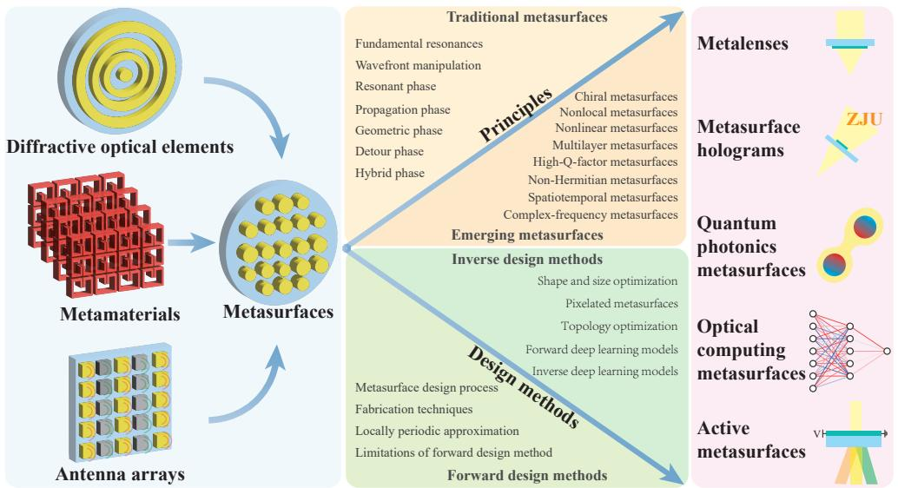

flowchart

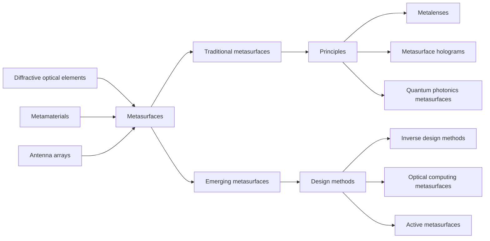
```mermaid
graph LR
  A["Diffractive optical elements"] --> B["Metasurfaces"]
  C["Metamaterials"] --> B
  D["Antenna arrays"] --> B
  B --> E["Traditional metasurfaces"]
  B --> F["Emerging metasurfaces"]
  E --> G["Principles"]
  F --> H["Design methods"]
  G --> I["Metalenses"]
  G --> J["Metasurface holograms"]
  G --> K["Quantum photonics metasurfaces"]
  H --> L["Inverse design methods"]
  H --> M["Optical computing metasurfaces"]
  H --> N["Active metasurfaces"]
```

Schematic of structure of the tutorial.

As illustrated in Fig. 1, this tutorial is organized along three key dimensions: physical principles, design methodologies, and representative applications, aiming to distill the fundamental concepts and underlying design philosophies of metasurfaces. First, we present a systematic conceptual framework covering both conventional and emerging metasurface types, along with a discussion of their theoretical limits (Section 2). Second, we review mainstream design methodologies—encompassing both forward and inverse design approaches—and analyze their respective characteristics and application scenarios in detail (Section 3). Third, we provide a comprehensive overview of the most representative and actively researched application domains, including metalenses (Section 4), metasurface holography (Section 5), quantum photonics metasurfaces (Section 6), metasurface-enabled optical computing (Section 7), and active metasurfaces (Section 8). For each category, we outline the operating principles, performance metrics, theoretical foundations, design strategies, and recent progress. Our discussion particularly emphasizes efficiency, field of view (FOV), bandwidth, and various multiplexing techniques, which are critical themes relevant to all metasurface applications. The design strategies reviewed here may also offer valuable insights for the development of other metasurface devices. Finally, we summarize the key challenges that metasurfaces currently face from multiple perspectives, explore potential solutions, and offer a forward-looking discussion on future directions in the field (Section 9).

A collection of open-source design workflows for metasurfaces is provided in this study $[73]$ . Utilizing the API of the three-dimensional (3D) Electromagnetic Simulator (FDTD) from Lumerical Inc. for electromagnetic simulations, the code streamlines the metasurface design and analysis process, achieving an efficient, flexible, and fully automated workflow entirely within the Python environment. The workflows include demonstrations for designing propagation phase metasurfaces, geometric phase metasurfaces, metagratings, metalenses, metasurface holograms, vortex-generating metasurfaces, and quasi-symmetry-protected bound states in the continuum (BIC), among others. Each demonstration is accompanied by a corresponding Python notebook, enabling readers to explore the workflows in detail and adapt them to their own metasurface design projects.

# 2. PRINCIPLES OF TRADITIONAL AND EMERGING METASURFACES

Traditional metasurfaces achieve space-varying amplitude or phase modulation through a single-layer planar arrangement of meta-atoms with varying shapes, dimensions, and rotation angles, enabling highly flexible wavefront manipulation of incident light. As this field has advanced, physical concepts such as nonlocality, BIC, guided mode resonances, exceptional points, and spatiotemporal modulation—originating from disciplines such as quantum mechanics, Fourier optics, photonic crystals, nonlinear optics, and active optics—have been incorporated into metasurfaces. These developments have given rise to a wide range of emerging metasurfaces exhibiting novel physical effects and promising practical applications.

Amid this rapid progression, the theoretical frameworks presented in earlier reviews have become insufficient to encompass recent breakthroughs, leaving gaps in understanding the diverse mechanisms underlying various metasurfaces. To address this gap, this section aims to establish a systematic framework that serves two key objectives:

(1) Reinterpreting traditional metasurface theories by integrating them with recent advancements (Subsection 2.1).  
(2) Providing explicit and detailed discussions of the underlying physics behind various emerging metasurface paradigms (Subsection 2.2).

Additionally, the fundamental limits of metasurfaces are further explored in Subsection 2.3.

# 2.1. Traditional Metasurfaces

Essentially, a metasurface is a 2D array of meta-atoms. Through the elaborate arrangement of diverse meta-atoms, rich and complex applications can be realized. From the perspective of meta-atoms, metasurfaces can be classified into the inhomogeneous metasurface and homogeneous metasurface $[74]$ . The former employs meta-atoms of various shapes, sizes, or rotation angles, each possessing a specific electromagnetic response. The latter consists of a periodic arrangement of identical meta-atoms, and the electromagnetic wave manipulation characteristics of the entire metasurface can be reduced to the examination of a single meta-atom under the periodic boundary condition. Homogeneous metasurfaces can be seen as a special case of inhomogeneous metasurfaces, but they also have their unique applications in areas such as perfect absorbers $[75]$ , polarization control $[76]$ , and enhanced transmittance or reflectance $[77–79]$ . An elaborate review for homogeneous metasurfaces can be found in reference $[74]$ . It is clear that understanding the working principle of homogeneous metasurfaces is fundamental to grasping the concept of inhomogeneous metasurfaces, and the key to understanding homogeneous metasurfaces lies in the electromagnetic properties of meta-atoms.

# 2.1.1. Fundamental Resonances in Meta-Atoms

A general physical picture of resonances in metasurfaces. Meta-atoms are metallic, dielectric, or hybrid structures with subwavelength dimensions. For an isolated metallic meta-atom, localized surface plasmon resonances arise due to collective oscillations of conduction electrons. In contrast, isolated dielectric meta-atoms support resonances that can be broadly categorized into Mie-like modes and Fabry–Pérot-like (FP-like) modes. These resonance characteristics are primarily determined by the shape, size, and material composition of the meta-atoms.

When meta-atoms are arranged periodically, their interactions give rise to collective resonances known as lattice modes. These modes depend on both the intrinsic resonances of individual meta-atoms and the properties of the lattice arrangement, including lattice type and periodicity. Lattice modes are typically classified into two categories: local lattice resonances and nonlocal guided-mode resonances $[80]$ . Local lattice resonances are spatially confined, with weak or negligible coupling between meta-atoms, whereas nonlocal resonances are spatially extended, resulting from strong inter-meta-atom coupling.

Spectral overlap between different isolated or lattice modes enables control over both the amplitude and directionality of scattered fields. For instance, interference between electric dipole (ED) and magnetic dipole (MD) modes of equal strength and in-phase alignment fulfills the Kerker condition, suppressing backward scattering while enhancing forward scattering $[81]$ . Similarly, interference between ED and toroidal dipole (TD) modes can suppress far-field radiation, resulting in a nonradiating mode known as an anapole mode $[82–85]$ .

BICs are nonradiative optical states whose energies lie within the continuum of radiating modes. BICs arise when coupling between the resonant mode and all available radiation channels is eliminated due to symmetry mismatch or continuous system parameter tuning. As a result, radiation loss vanishes and the quality factor (Q-factor) tends to infinity. BICs can occur in both isolated meta-atoms and homogeneous/inhomogeneous metasurfaces. In practice, however, ideal BICs evolve into high-Q-factor resonant modes, commonly referred to as quasi-BICs, due to limitations such as finite metasurface size, material absorption, and fabrication imperfections.

In scattering spectra, resonances—such as localized surface plasmon, Mie, lattice, and quasi-BIC modes—often appear as Fano resonances, characterized by asymmetric spectral line shapes. These arise from the interference between a narrow resonant mode and a spectrally broad background contributed by non-resonant modes $[86,87]$ . The Fano resonance spectrum is described by the Fano formula:

$$
I (\omega) = I _ {0} \frac {1}{1 + q ^ {2}} \frac {(q + \Omega) ^ {2}}{1 + \Omega^ {2}} + I _ {\text {background}}, \tag {1}
$$

where $\omega$ is the angular frequency, $I_0$ is a scaling factor, $q$ is the Fano asymmetry parameter, $\Omega = 2(\omega - \omega_0) / \gamma$ is the dimensionless frequency, $\omega_0$ is the resonance frequency, $\gamma$ is the full width at half maximum (FWHM) of the resonance (or the inverse radiation lifetime [88]), and $I_{\mathrm{background}}$ is the background intensity. Typically, the frequency dependence of $q$ , $I_0$ , and $I_{\mathrm{background}}$ is smooth and thus negligible. By fitting simulated or experimental spectra with Eq. (1), the resonance Q-factor can be extracted as

$$
Q = \frac {\omega_ {0}}{\gamma}. \tag {2}
$$

This subsection focuses on the aforementioned local resonant modes in metasurfaces, while nonlocal modes with significantly higher Q-factors will be further discussed in Subsection 2.2.3.

Electromagnetic response of meta-atoms. The study of subwavelength structures interacting with light can be traced back to the famous paper published by Mie in 1908 [89]. In this paper, Mie derived a rigorous solution based on electromagnetic theory for the interaction between a monochromatic plane wave and a uniform sphere of arbitrary radius and material in a homogeneous medium. Subsequent research has attempted to extend this to non-spherical shapes, but the strict analytical forms of electromagnetic field solutions are monumentally complex, and approximations are often made in

practice [90]. In metasurfaces, meta-atoms commonly take the form of cylinders, rectangular pillars, or irregular pillars with cross-sections shaped like H, V, U, or crosses, etc., and the scattering fields of different meta-atoms coherently interact. Currently, there is no general analytical solution for meta-atoms, only approximate models and formulas for certain cases [91–93]. A classical method for modeling and analyzing homogeneous metasurfaces is the effective medium theory [94,95]. This theory attempts to identify the correspondence between the structure of meta-atoms and the parameters of bulk materials, but it still has many limitations [36].

In fact, studies like Mie theory or effective medium theory are rarely directly applied to the metasurface design, especially for the inhomogeneous metasurface. Generally, researchers employ computational electromagnetics methods, such as the Finite-Difference Time-Domain (FDTD) method $[96]$ , RCWA method $[97]$ , Finite Element Method (FEM) $[98]$ , and Finite Integration Technique (FIT) $[99]$ , to conduct full-wave simulations that determine the electromagnetic response characteristics of meta-atoms. Among these, eigenmode solvers can be used to calculate the frequencies, quality factors, and field distributions of the resonant modes of a given meta-atom. Nonetheless, the aforementioned theoretical research has established a theoretical foundation for the physical picture and mechanism behind the electromagnetic wave manipulation of meta-atoms, playing a significant role in understanding the working principles of metasurfaces and proposing novel metasurface designs.

Local resonances in metallic meta-atoms. In the early stages of metasurface research, thanks to the development of plasmonics, extensive studies on the subwavelength metal structure were conducted, and researchers often chose metals such as gold (Au) [100] and silver (Ag) [101] as the material for meta-atoms.

The interaction between metals and electromagnetic fields primarily depends on the free electrons within the metals, which form a plasma that collectively responds to external fields $[102]$ . As a fundamental excitation of plasma, surface plasmon polaritons (SPPs) are propagating, dispersive electromagnetic waves that travel along the interface between a dielectric and a conductor, with their fields evanescently confined in the direction perpendicular to the interface. These surface waves arise from the coupling between optical-frequency electromagnetic fields and the collective oscillations of free electrons in the conductor's plasma $[103]$ .

In contrast, localized surface plasmon resonances—also known simply as localized plasmon resonances—are non-propagating excitations of the plasmonic system that can be directly excited by incident light $[103]$ . These resonances represent the fundamental modes of subwavelength plasmonic nanostructures, with their resonant frequencies determined by the material's plasma frequency and the geometry of the nanostructures. The typical Q-factor of localized plasmon resonances ranges from 2 to 10 due to the intrinsic high Ohmic loss $[80]$ . Nevertheless, due to their deep subwavelength mode volumes, they can produce substantial local electric field enhancement, with intensities amplified by factors of several hundred.

The metal meta-atom under electromagnetic field excitation forms specific resonant modes, which can be used to modulate electromagnetic characteristics of scattered light such as amplitude, phase, and polarization. For example, consider a metal cylindrical rod with the incident light's polarization direction aligned with the axis of the rod. The free electron gas in the rod undergoes a collective axial displacement under the action of the incident light's electric field, equivalent to generating equal and opposite charges accumulated at both ends of the metal rod, thereby forming an internal electric field and a restoring force opposite to the direction of the overall displacement of the electron gas. By formulating the motion equation, the intrinsic resonance frequency of

the electron gas movement can be calculated [104]. When the frequency of the incident light matches the resonance frequency, intense absorption and phase shift occur. In the full-wave simulation result of an Au rod shown in Fig. 2(a), the resonance effect can be observed around the wavelength of 800 nm. In addition to this electrical resonance, metal meta-atoms can also support magnetic resonant modes through special structural design, such as the typical split ring resonator (SRR) structure [Fig. 2(b)] [107,108] and metal-insulator-metal (MIM) structure [Fig. 2(c)] [109,110].

When metal meta-atoms are arranged in an ordered array, the coupling of localized plasmon resonances via a diffractive order of the lattice can give rise to localized plasmonic surface lattice resonances $[111]$ . These resonances are characterized by significantly enhanced quality factors exceeding 100 and exhibit remarkably narrow spectral linewidths, as small as 1–2 nm $[112]$ .

However, metals exhibit high ohmic losses at optical frequencies, which significantly limit the efficiency of metal-based metasurfaces, particularly in transmission mode $[8,113]$ . Although the introduction of hybrid meta-atom structures, such as the MIM configuration, can marginally enhance device efficiency $[110,114]$ , challenges such as restricted operational frequency ranges and persistently low efficiencies continue to pose obstacles $[115]$ .

Local resonances in dielectric meta-atoms. As an alternative, high-refractive-index dielectric materials, such as titanium dioxide (TiO $_2$ ) [116,117], gallium nitride (GaN) [118,119], and silicon (Si) [120,121], exhibit very low losses in the visible or near-infrared frequency range, along with rich resonant characteristics, promising the realization of high-efficiency metasurface devices. Moreover, materials like silicon and silicon nitride (SiN $_x$ ) are more compatible with modern complementary metal–oxide–semiconductor (CMOS) processes, thus holding greater potential for the mass production of metasurfaces on a large scale. Unlike metals, dielectric materials do not contain free electrons and cannot form conduction currents. However, the incident light excites intense displacement currents in dielectrics, analogous to conduction currents in metals, which serves as the basis for the resonant behavior of dielectric meta-atoms [122].

The resonant modes of a dielectric meta-atom can be broadly categorized into two families: radially oscillating modes and axially oscillating modes. In the following discussion, we refer to radial resonances—originating from the resonant behavior of a meta-atom with effectively infinite height—as Mie-like modes (or simply Mie modes), and axial resonances as FP-like modes (or simply FP modes). As shown in Fig. 2(d), the Mie mode and the FP mode are excited in two cylindrical dielectric meta-atoms with different aspect ratios r/h, where r and h denote the radius and height of the meta-atom, respectively. When dielectric meta-atoms are arranged in ordered arrays, they can support localized collective Mie or FP lattice modes, typically exhibiting weak near-field coupling.

The Mie resonance in dielectric meta-atoms can be understood through the multipole decomposition of electromagnetic fields, which characterizes the scattering intensities and radiation patterns of the dominant excited multipolar modes. For spherical metallic nanoparticles, the ED mode typically dominates the Mie scattering, producing a symmetric radiation pattern. By contrast, in dielectric meta-atoms, the excitation and interference of multiple multipolar modes play a more significant role $[122–124]$ . Taking a dielectric sphere as an example $[106]$ , when the wavelength of the incident light inside the sphere becomes comparable to its diameter, the light couples to circular displacement currents, leading to a resonant MD response. In general, four main resonant modes can be excited in such a sphere: two fundamental Mie resonances—the MD and

Figure 2  
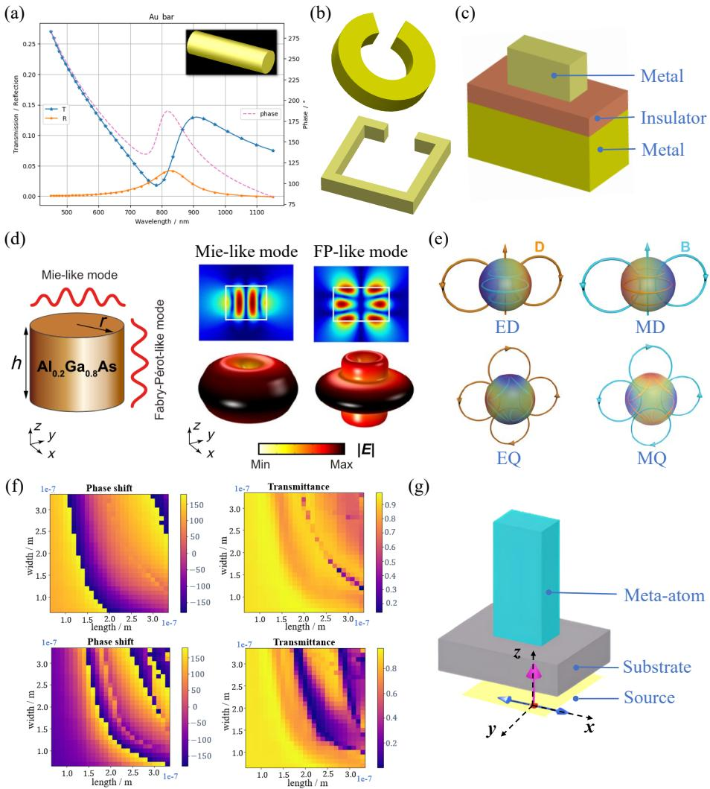

Working principles and phase modulation mechanisms of meta-atoms. (a) Full-wave simulation result of an Au rod with the diameter of 60 nm and the length of 200 nm, which is obtained using the FDTD method. The resonance can be observed near 800 nm, resulting in an abrupt change in transmittance, reflectance, and phase shift. (b) Schematic of two split-ring resonator structures. (c) Schematic of the metal-insulator-metal structure. (d) Left: schematic of an isolated cylindrical meta-atom with radius r and height h. Right: near-field electric field distributions and far-field radiation patterns of two isolated meta-atoms with different aspect ratios. (e) Field distributions of a dielectric sphere under electric dipole (ED) resonance, magnetic dipole (MD) resonance, electric quadrupole (EQ) resonance, and magnetic quadrupole (MQ) resonance. (f) Simulated phase and transmittance distributions for rectangular pillar meta-atoms of different lengths and widths at heights of 500 nm and 800 nm, respectively. The material of meta-atoms is amorphous silicon, the operating wavelength is 940 nm, and the lattice constant is 350 nm. (g) The coordinate system established in the theoretical analysis of the meta-atom. (d) Adapted with permission from Koshelev et al., Sci. Bull. 64, 836–842 (2019) [105]. Copyright © 2018 Science China Press. (e) Adapted with permission from Kuznetsov et al., Science 354, aag2472 (2016) [106]. Copyright © 2016, American Association for the Advancement of Science.

ED modes—and two higher-order Mie resonances—the magnetic quadrupole (MQ) and electric quadrupole (EQ) modes. Notably, the magnetic and electric resonances often exhibit comparable intensities $[81]$ . The field distributions corresponding to these four resonant modes are illustrated in Fig. 2(e).

The Q-factor of meta-atoms tends to increase with the order of the multipole mode. This trend is consistent with a reduction in the angular density of available radiation channels and an increased contribution from large Fourier components in the field distribution $[125]$ . For dielectric meta-atoms with a high refractive index, Mie modes with relatively large Q-factors—reaching values of several dozen—can be achieved.

# 2.1.2. Resonant and Propagation Phase Modulation Mechanisms

The phase modulation mechanism of meta-atoms is crucial for designing inhomogeneous metasurfaces that enable diverse wavefront manipulation. In this subsection, we discuss resonant and propagation phase modulation mechanisms. And the geometric phase modulation mechanism will be introduced in the following Subsection 2.1.3. Beyond these three principal phase modulation mechanisms, detour phase metasurfaces, which are extensively utilized in metasurface holography, will be discussed further in Subsection 2.1.4.

As discussed in Subsection 2.1.1, resonance provides the meta-atom with significant phase accumulation as a function of frequency, serving as a starting point for achieving phase modulation $[126]$ . By varying the shape and size of meta-atoms, it is possible to manipulate their resonant modes to realize a full $2\pi$ phase accumulation for incident light at a specific wavelength and polarization state. This mechanism of phase modulation is referred to as the resonant phase. By tailoring the electric and magnetic polarization characteristics of meta-atoms—for example, by utilizing the interference of spectrally overlapping ED and MD resonances of equal intensity to suppress backward scattering (i.e., the first Kerker condition $[81]$ )—it is possible to achieve full $2\pi$ phase coverage with transmittance close to unity $[122]$ . Such resonant phase metasurfaces are referred to as Huygens metasurfaces, named after the meta-atoms resembling the secondary sources in the Huygens principle, which emit base waves that propagate only forwards $[127–130]$ . Nowadays, there is usually no strict distinction made between the concepts of resonant phase metasurfaces and Huygens metasurfaces $[131,132]$ .

Recently, the concept of the topology phase has emerged, leveraging the exceptional point characteristics of metasurfaces as non-Hermitian systems $[133]$ , as discussed in Subsection 2.2.6. Additionally, the topological origins of various types of resonant phase metasurfaces, including Huygens metasurfaces, have been progressively uncovered through complex frequency analysis $[126,134]$ , which will be introduced in Subsection 2.2.8. In light of these developments, referring to these phase modulation mechanisms collectively as the topology phase may become a more appropriate terminology.

When considering metasurfaces composed of high-index dielectric meta-atoms with significant height, the truncated waveguide principle can be used for their description. In this case, the meta-atoms are regarded as waveguides truncated at the top and bottom. Phase modulation is primarily achieved not through phase shifts induced by the interaction of incident light with the meta-atom near the resonance frequency, but through a process of phase accumulation during guided-wave propagation, thus supporting a broader bandwidth than resonant phase $[135]$ , whereas the resonance effect has a narrow-band property $[136]$ . The phase accumulation $\phi$ can be expressed as

$$
\phi = \frac {2 \pi h}{\lambda_ {0}} n _ {\mathrm{eff}}, \tag {3}
$$

where h is the height of the meta-atom, $\lambda_{0}$ is the wavelength of the incident light in free space, and $n_{eff}$ is the effective refractive index of the meta-atom. This mechanism of phase modulation is known as the propagation phase. The range of the effective refractive index satisfies

$$
n _ {\text {cladding}} \leq n _ {\text {eff}} \leq n _ {\text {meta}}, \tag {4}
$$

whereas $n_{meta}$ and $n_{cladding}$ are the refractive indices of the meta-atom material and the material surrounding the meta-atoms (typically air), respectively. Thus, by adjusting the shape and size of the meta-atoms, the maximum range of phase shift is given by:

$$
\Delta \phi_ {\max} = \frac {2 \pi}{\lambda_ {0}} \left(n _ {\mathrm{meta}} - n _ {\mathrm{cladding}}\right) h. \tag {5}
$$

From Eq. (5), it becomes evident that meta-atoms with greater height can more readily achieve $2\pi$ phase coverage [137]. Moreover, when addressing more complex design tasks, such as achromatic metalenses, employing a higher aspect ratio (aspect ratio is defined as the ratio of the height of the meta-atom to the transverse critical dimension) enables a broader range of group delay (see Subsection 4.4.2). This facilitates meeting the requirements of dispersion engineering [138]. The phase and transmittance distributions for meta-atoms of varying sizes at two different heights are illustrated in Fig. 2(f), from which the impact of the aspect ratio on the design space can be intuitively observed. Using Eq. (5), it is also not difficult to understand that designing metasurfaces for reflection mode is simpler than for transmission mode. This is because, in reflection mode, light traverses the meta-atom multiple times, effectively increasing the h value in Eq. (5) beyond the physical height of the meta-atom.

In practical design, the phase modulation characteristics of resonant and propagation phase modulation mechanisms are quite similar, with the phase shift originating from the adjustment of the shape and size of the meta-atoms. In comparison, resonant phase metasurfaces have a lower aspect ratio than propagation phase metasurfaces, making them easier to fabricate. However, resonant phase metasurfaces are more severely affected by the coupling between meta-atoms [132], which may lead to a degradation in device performance. Ignoring the impact of material dispersion and resonant phase, $n_{\mathrm{eff}}$ in Eq. (3) is independent of $\lambda_0$ , meaning that $\phi$ is proportional to $\frac{1}{\lambda_0}$ . When considering the material dispersion and resonant phase, as depicted in Fig. 3, Eq. (3) becomes

$$
\phi = \frac {2 \pi h}{\lambda_ {0}} n _ {\mathrm{eff}} (\lambda_ {0}). \tag {6}
$$

It is worth noting that although a clear distinction exists between the resonant phase and the propagation phase from a physical perspective, these phases are often coupled when designing meta-atoms. Specifically, the phase accumulation introduced by the propagation phase modulation mechanism may also be influenced by the phase jump near the resonance frequency $[139]$ .

Jones matrices for meta-atoms with different symmetry properties. The amplitude and phase modulation of the meta-atom can be mathematically described using Jones matrices. The coordinate system for the meta-atom is shown in Fig. 2(g). The meta-atoms with diverse symmetric properties result in Jones matrices that manifest varied symmetries $[140]$ . The general form of the Jones matrix can be written as

$$
\mathbf {T} = \left[ \begin{array}{l l} A & C \\ D & B \end{array} \right], \tag {7}
$$

where $A, B, C$ , and $D$ are all complex numbers.

Figure 3  
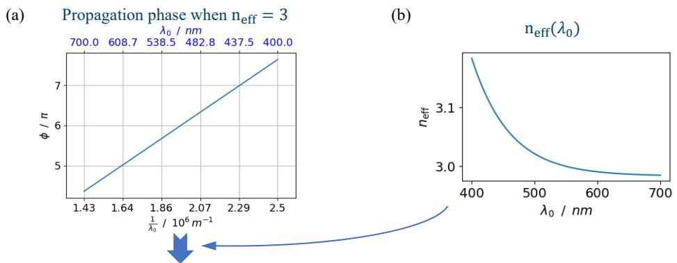

(c) Phase shift considering material dispersion (d) Phase shift considering material dispersion & resonance  
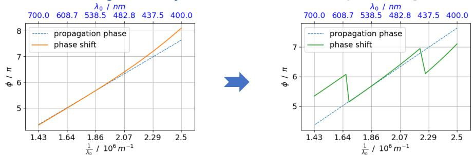

Impact of material dispersion and resonant phase on the propagation phase. (a) Propagation phase shift when $n_{eff} = 3$ . The height of meta-atom is 509 nm. (b) Dispersion curve of the effective refractive index $n_{eff}$ . (c) Phase shift when considering the dispersion characteristic of $n_{eff}$ in (b). (d) Phase shift when considering both the dispersion characteristic and the resonant phase. The resonance wavelengths are 450 nm and 600 nm, respectively.

(i) When meta-atoms exhibit mirror symmetry with respect to a plane perpendicular to the z axis, known as out-of-plane symmetry, the off-diagonal elements of the corresponding Jones matrix become identical, i.e.,

$$
\mathbf {T} = \left[ \begin{array}{c c} A & C \\ C & B \end{array} \right]. \tag {8}
$$

Generally, typical single-layer meta-atoms possess out-of-plane symmetry, adhering to Eq. (8). While it might appear that the substrate could disrupt this symmetry, its impact is typically minimal [140].

(ii) When meta-atoms exhibit mirror symmetry with respect to the xOz or yOz planes, we have C = D = 0, i.e.,

$$
\mathbf {T} = \left[ \begin{array}{c c} A & 0 \\ 0 & B \end{array} \right]. \tag {9}
$$

(iii) When meta-atoms exhibit $C_2$ symmetry with respect to the $z$ axis, the Jones matrix as defined in Eq. (7) inherently fulfills this symmetry requirement.  
(iv) When meta-atoms exhibit rotational symmetry of $C_N$ (where $N$ is an integer greater than or equal to 3) with respect to the $z$ axis, we have $B = A, D = -C$ , i.e.,

$$
\mathbf {T} = \left[ \begin{array}{c c} A & C \\ - C & A \end{array} \right]. \tag {10}
$$

(v) When only reciprocal media are considered—that is, when light propagation through the structure obeys time-reversal symmetry—the Jones matrix of a meta-atom under forward illumination (light incident from the bottom substrate to the top superstrate) is

$$
\mathbf {T} ^ {\mathrm{f}} = \left[ \begin{array}{c c} A & C \\ D & B \end{array} \right], \tag {11}
$$

then, under backward illumination (light incident from the top superstrate to the bottom substrate), the corresponding Jones matrix becomes [141]

$$
\mathbf {T} ^ {\mathrm{b}} = \left[ \begin{array}{c c} A & - D \\ - C & B \end{array} \right]. \tag {12}
$$

We note that the conclusions (i)–(iv) are valid only for normally incident light along the z-axis, as these structural symmetries no longer hold for oblique incidence. Additionally, the symmetry constraints imposed on the meta-atom should ideally match the symmetry of the lattice $[142]$ . However, in most cases, the symmetry of individual meta-atoms can exceed that of the lattice, thereby governing the overall symmetry of the metasurface.

We now mathematically describe the resonant or propagation phase utilizing Jones matrices. We consider meta-atoms that exhibit mirror symmetry with respect to the $xOz$ or $yOz$ planes, which are commonly used in practical designs. Assume the meta-atom introduces resonant or propagation phases $\phi_x$ and $\phi_y$ for linearly polarized light in the $x$ and $y$ directions, respectively, for the operating wavelength. And the amplitude transmission coefficients for the two polarizations are $t_x$ and $t_y$ , respectively (the square of the amplitude transmittance coefficient represents the intensity transmission coefficient, or transmittance [143]). Then, the scattering characteristics of the meta-atom can be described by the Jones matrix:

$$
\mathbf {T} _ {0} = \left[ \begin{array}{c c} t _ {x} e ^ {i \phi_ {x}} & 0 \\ 0 & t _ {y} e ^ {i \phi_ {y}} \end{array} \right]. \tag {13}
$$

When isotropic meta-atom designs such as cylindrical or square pillars are adopted, the symmetry of the resonant or propagation modes ensures that the introduced resonant or propagation phase does not exhibit polarization sensitivity $[144]$ . In this case, $t_{x} = t_{y}$ and $\phi_{x} = \phi_{y}$ in Eq. (14). In contrast, with anisotropic meta-atom designs such as elliptical or rectangular pillars, the phase shift is related to the polarization state of the incident light $[145]$ .

The design workflow for propagation phase metasurfaces is available in our open-source code repository [73].

# 2.1.3. Geometric Phase Modulation Mechanism

For a meta-atom satisfying Eq. (13), when it is rotated by an angle $\theta$ counterclockwise around the z axis (as viewed from the positive direction of the z axis), the Jones matrix expression for the scattering characteristics of the rotated meta-atom can be represented as

$$
\mathbf {T} = \mathbf {R} (\theta) \mathbf {T} _ {0} \mathbf {R} (- \theta), \tag {14}
$$

where $\mathbf{T}_0$ is the Jones matrix before rotation expressed by Eq. (13), and $\mathbf{R}(\theta)$ is the rotation matrix, defined as

$$
\mathbf {R} (\theta) = \left[ \begin{array}{c c} \cos \theta & - \sin \theta \\ \sin \theta & \cos \theta \end{array} \right]. \tag {15}
$$

Obviously, we have

$$
\mathbf {R} (\theta) ^ {- 1} = \mathbf {R} (\theta) ^ {\top} = \mathbf {R} (- \theta), \tag {16}
$$

where the superscript $\top$ denotes matrix transpose, and the superscript $-1$ denotes matrix inverse. Using Eq. (16), we have

$$
\mathbf {T} ^ {\top} = \left(\mathbf {R} (\theta) \mathbf {T} _ {0} \mathbf {R} (- \theta)\right) ^ {\top} = \left(\mathbf {R} (- \theta)\right) ^ {\top} \mathbf {T} _ {0} ^ {\top} \left(\mathbf {R} (\theta)\right) ^ {\top} = \mathbf {R} (\theta) \mathbf {T} _ {0} \mathbf {R} (- \theta) = \mathbf {T}, \tag {17}
$$

which means that the Jones matrix T of the rotated meta-atom is symmetric. Using Eq. (17), we have

$$
\mathbf {T} ^ {\dagger} = \left(\mathbf {T} ^ {\top}\right) ^ {*} = (\mathbf {T}) ^ {*}, \tag {18}
$$

where the superscript $\dagger$ denotes conjugate transpose, also known as Hermitian transpose, and the superscript $*$ denotes the matrix with complex conjugated entries. Supposing $t_{x}=t_{y}=1$ , we obtain

$$
\mathbf {T} ^ {\dagger} = (\mathbf {T}) ^ {*} = \mathbf {R} (\theta) \mathbf {T} _ {0} ^ {*} \mathbf {R} (- \theta) = \mathbf {R} (\theta) \mathbf {T} _ {0} ^ {- 1} \mathbf {R} (- \theta) = \left(\mathbf {R} (\theta) \mathbf {T} _ {0} \mathbf {R} (- \theta)\right) ^ {- 1} = \mathbf {T} ^ {- 1}, \tag {19}
$$

which means that the Jones matrix $\mathbf{T}$ of the rotated meta-atom is unitary when assuming $t_x = t_y = 1$ (i.e., the transmission of the meta-atom is unitary when there is no reflection and absorption [126]). The above two properties in Eqs. (17) and (19) will be used in Subsection 2.1.5.

Substituting Eqs. (13) and (15) into Eq. (14), we have

$$
\mathbf {T} \triangleq \left[ \begin{array}{l l} T _ {x x} & T _ {x y} \\ T _ {y x} & T _ {y y} \end{array} \right] = \left[ \begin{array}{l l} t _ {x} e ^ {i \phi_ {x}} \cos^ {2} \theta + t _ {y} e ^ {i \phi_ {y}} \sin^ {2} \theta & \frac {1}{2} \left(t _ {x} e ^ {i \phi_ {x}} - t _ {y} e ^ {i \phi_ {y}}\right) \sin 2 \theta \\ \frac {1}{2} \left(t _ {x} e ^ {i \phi_ {x}} - t _ {y} e ^ {i \phi_ {y}}\right) \sin 2 \theta & t _ {x} e ^ {i \phi_ {x}} \sin^ {2} \theta + t _ {y} e ^ {i \phi_ {y}} \cos^ {2} \theta \end{array} \right]. \tag {20}
$$

Considering the incident light is circularly polarized with an amplitude of 1, its Jones vector representation is

$$
\vec {I} = \frac {1}{\sqrt {2}} \left[ \begin{array}{l} 1 \\ i \sigma \end{array} \right], \tag {21}
$$

where $\sigma = \pm 1$ corresponds to left-handed circular polarization (LCP) and right-handed circular polarization (RCP), respectively. After interacting with the meta-atom expressed by Eq. (20), the Jones vector of the output light is

$$
\vec {O} = \mathbf {T} \vec {I} = \frac {1}{2 \sqrt {2}} \left(\left(t _ {x} e ^ {i \phi_ {x}} + t _ {y} e ^ {i \phi_ {y}}\right) \left[ \begin{array}{l} 1 \\ i \sigma \end{array} \right] + \left(t _ {x} e ^ {i \phi_ {x}} - t _ {y} e ^ {i \phi_ {y}}\right) e ^ {i 2 \sigma \theta} \left[ \begin{array}{l} 1 \\ - i \sigma \end{array} \right]\right), \tag {22}
$$

where the first term represents the output light with the same circular polarization state as the incident light, and the second term represents the output light with the opposite circular polarization state to the incident light.

At this point, the electromagnetic modulation characteristics of the meta-atom are quite complex. However, if all the meta-atoms on the metasurface have the same type of anisotropic structure (the anisotropy condition ensures that $t_x e^{i\phi_x} \neq t_y e^{i\phi_y}$ , i.e., the output light with the opposite circular polarization state exists), the resonant or propagation phase is identical everywhere on the metasurface, and then it is as if there is no effect of resonant or propagation phase under the overview of the entire metasurface. In this case, the only phase shift is provided by the term $e^{i2\sigma\theta}$ in Eq. (22), meaning that a phase shift of $2\sigma\theta$ will be introduced between the opposite circularly polarized output light and the incident light just through the rotation of anisotropic meta-atoms. This is known as the geometric phase, also referred to as the Pancharatnam–Berry (PB)

phase or Berry phase [146,147]. Denoting the geometric phase as $\phi_{\mathrm{geometric}}$ , we have

$$
\phi_ {\text {geometric}} = 2 \sigma \theta . \tag {23}
$$

If the meta-atom is rotated from 0 to $\pi$ , then the phase shift will cover the complete $2\pi$ range.

The previous conclusion is derived under the assumption that the meta-atom satisfies Eq. (13) at $\theta = 0$ . For a more general meta-atom satisfying Eq. (8), we can similarly obtain the Jones vector of the output light for the rotated meta-atom under the incidence of Eq. (21):

$$
\vec {O} = \frac {1}{2 \sqrt {2}} \left((A + B) \left[ \begin{array}{l} 1 \\ i \sigma \end{array} \right] + (A - B + 2 i \sigma C) e ^ {i 2 \sigma \theta} \left[ \begin{array}{l} 1 \\ - i \sigma \end{array} \right]\right). \tag {24}
$$

In this case, the output component with opposite circular polarization to the incident light acquires the same geometric phase factor as in Eq. (23). The newly introduced element C affects only the complex amplitude of this output component. When C = 0, Eq. (24) reduces to Eq. (22).

Indeed, the concept of geometric phase predates the advent of metasurfaces significantly. As early as 1956, Pancharatnam discovered that a cyclic evolution in the polarization state of light is accompanied by an additional phase shift, known as the Pancharatnam phase, which is determined by half of the solid angle covered by the cycle on the Poincaré sphere [148]. In 1984, Berry proposed the general form of geometric phase for the adiabatic transformation of a quantum state [149]. Later, in 1987, he further demonstrated the equivalence between the Pancharatnam phase in optics and the geometric phase in quantum mechanics [150]. The next milestone in this field came in 2001 and 2002 when Hasman's group [70,71,151,152] utilized subwavelength metal gratings to realize space-variant phase modulation based on the principle of geometric phase and experimentally verified its feasibility through the designs of diffractive gratings [151] and vortex beam generators [152], devices that are actually geometric phase metasurfaces [147], although at this time the concept of metasurfaces had not yet been born. In recent years, there has been further development in the theory of geometric phase. In 2021, Xie et al. [153] proposed the concept of generalized geometric phase: when using meta-atoms with high-fold rotational symmetries $C_K$ (where $K \geq 3$ ) in symmetrically incompatible lattices, it is possible to introduce high-order geometric phases that are multiples of the rotation angle.

In Eq. (22), the output light with the same circular polarization state as that of the incident light can be considered as stray light, which can be filtered with a wave plate and a polarizer $[154]$ . The polarization conversion efficiency (PCE) is defined as the ratio of the transmittance of the output light with the opposite circular polarization state to the total transmittance. From Eq. (22), it can be represented by

$$
\eta_ {\mathrm{PCE}} = \frac {\left| t _ {x} e ^ {i \phi_ {x}} - t _ {y} e ^ {i \phi_ {y}} \right| ^ {2}}{\left| t _ {x} e ^ {i \phi_ {x}} + t _ {y} e ^ {i \phi_ {y}} \right| ^ {2} + \left| t _ {x} e ^ {i \phi_ {x}} - t _ {y} e ^ {i \phi_ {y}} \right| ^ {2}} = \frac {t _ {x} ^ {2} + t _ {y} ^ {2} - 2 t _ {x} t _ {y} \cos (\phi_ {x} - \phi_ {y})}{2 (t _ {x} ^ {2} + t _ {y} ^ {2})}. \tag {25}
$$

Eq. (25) applies to both $\sigma = +1$ and $\sigma = -1$ , meaning that for the same meta-atom, whether it works in the case of transforming incident LCP light into RCP light or incident RCP light into LCP light, its PCE remains unchanged. According to formula Eq. (25), when the condition

$$
\left| \phi_ {x} - \phi_ {y} \right| = \pi \tag {26}
$$

(also known as the half-wave-plate condition) is met, the PCE reaches its maximum value

$$
\eta_ {\mathrm{PCE}, \max} = \frac {1}{2} + \frac {t _ {x} t _ {y}}{t _ {x} ^ {2} + t _ {y} ^ {2}}. \tag {27}
$$

We note that $\eta_{PCE,max}=100\%$ when $t_{x}=t_{y}$ , thus, the level of PCE is not necessarily related to the level of transmittance. When assessing the efficiency of geometric phase metasurfaces, both transmittance and PCE should be evaluated. A more comprehensive metric is the product of transmittance and PCE. In practical designs, to achieve higher device efficiency, the structural parameters of meta-atoms are often iterated to choose one meta-atom that offers the highest PCE and transmittance [155]. When approximations $t_{x}=1$ and $t_{y}=1$ are made, Eq. (25) can be simplified to a very straightforward form:

$$
\eta_ {\mathrm{PCE}} = \sin^ {2} \frac {\phi_ {x} - \phi_ {y}}{2}. \tag {28}
$$

From Eq. (23), for incident light with circular polarization state $\sigma = \pm 1$ , the geometric phase introduced by the meta-atom is $\pm 2\theta$ , with the two differing by a negative sign. This means that the geometric phase is generally polarization-sensitive. However, if $\theta$ is restricted to values of either 0 or $\frac{\pi}{2}$ , the geometric phases introduced when $\sigma = \pm 1$ are identical. In this case, the geometric phase is polarization-insensitive, even though the meta-atom is anisotropic. This is because any polarization state of the incident light can always be decomposed into LCP light and RCP light, and both have the same geometric phase and PCE. Besides, there is a constant difference of $\pi$ between the polarization-insensitive geometric phases produced by the meta-atom rotated by 0 and that rotated by $\frac{\pi}{2}$ , which introduces a new degree of design freedom [156]. It should be emphasized that this polarization insensitivity is essentially incomplete when the PCE is below $100\%$ , due to the presence of output light with the same circular polarization state as the incident light.

The characteristics of the resonant or propagation phase with geometric phase are compared here. Geometric phase metasurfaces impose strict requirements on the polarization states of incident and output light, whereas resonant or propagation phase metasurfaces have no such constraints. Resonant or propagation phase metasurfaces rely on specific meta-atom structures, making them sensitive to fabrication errors and thus requiring high precision in fabrication processes. In contrast, geometric phase meta-atoms achieve full phase space coverage just through the rotation of meta-atoms, featuring simpler structures and lower precision requirements in fabrication (generally, errors in the rotation angle are minor, and even if fabrication results in deviations from the designed shape, it does not affect the accuracy of phase shift, though it may reduce the efficiency of the metasurface to some extent) [157]. Moreover, the electromagnetic response characteristics of meta-atoms with a specific shape vary with the wavelength of incident light, resulting in wavelength sensitivity for resonant or propagation phase metasurfaces, also referred to as phase dispersion. In contrast, the geometric phase depends solely on the rotation angle, meaning that the phase shift distribution for a given geometric phase metasurface under different wavelengths varies only by a constant term. This property renders geometric phase metasurfaces wavelength-insensitive, or free from phase dispersion. We note that the efficiency of the geometric metasurface, which depends on the PCE and transmittance, is still wavelength-dependent, but careful meta-atom design can maintain efficiency at a high level within a broad bandwidth [158]. This characteristic determines that geometric phase metasurfaces can be used to create some types of devices with broadband features, such as metasurface holograms that reconstruct the same holographic image under different wavelengths [159,160].

Further discussion can be found in Subsection 5.1.2. However, this feature also prevents geometric phase metasurfaces from relying solely on themselves to implement devices based on dispersion engineering, such as achromatic phase-gradient metasurfaces (e.g., metalenses and metagratings) and wavelength-multiplexed Fraunhofer holograms. In these cases, the target phase shifts of the meta-atom at specific spatial positions must be wavelength-dependent, meaning they must satisfy certain phase dispersion relationships.

When deriving the geometric phase from Eq. (22), it is assumed that the metasurface employs the meta-atoms with the same shape and size. However, it's evident that if the use of meta-atoms with multiple shapes and sizes is allowed, combined with the rotation of these meta-atoms, the electromagnetic modulation freedom will be significantly enhanced, greatly expanding the design space of the metasurface [143]. This approach, also known as the hybrid phase modulation mechanism, will be discussed in detail in Subsection 2.1.5.

The design workflow for geometric phase metasurfaces is available in our open-source code repository [73].

# 2.1.4. Detour Phase Modulation Mechanism

Beyond the three main phase modulation mechanisms mentioned, the detour phase modulation mechanism also finds broad application in the field of metasurface holography $[161,162]$ . Long before the advent of metasurfaces, the principle of detour phase played a crucial role in areas like binary optical holography $[163,164]$ . The key difference between the detour phase and the previously mentioned phase modulation mechanisms is that the latter generally operate under the zeroth-order diffraction of periodic metasurface units, whereas the detour phase modulation mechanism operates under non-zeroth-order diffraction, which is intrinsic to the principle of detour phase.

Given the lattice constant a of a metasurface based on the square lattice, the diffraction angle $\theta_{M}$ for the $M^{th}$ diffraction order is given by

$$
\sin \theta_ {M} = M \cdot \frac {\lambda}{a}, \tag {29}
$$

where $\lambda$ is the wavelength of light in the background medium. Assuming the metasurface units operate at the $M^{th}$ diffraction order and all units adopt the same structure, as shown in the left panel of Fig. 4(a), with a spacing of d = a between two adjacent units, the phase difference $\Delta\phi$ between these units is

$$
\Delta \phi = \frac {2 \pi}{\lambda} d \sin \theta_ {M}. \tag {30}
$$

Introducing a displacement $\Delta d$ to make the spacing between two adjacent units to be $d' = d + \Delta d$ , as illustrated in the right panel of Fig. 4(a), the phase difference $\Delta \phi'$ between adjacent units becomes

$$
\Delta \phi^ {\prime} = \frac {2 \pi}{\lambda} d ^ {\prime} \sin \theta_ {M}. \tag {31}
$$

From Eqs. (30) and (31), the phase shift $\phi_{\mathrm{detour}}$ introduced by the displacement $\Delta d$ for the light of the diffraction order $M$ is

$$
\phi_ {\text {detour}} = \Delta \phi^ {\prime} - \Delta \phi = \frac {2 \pi}{\lambda} \Delta d \sin \theta_ {M}. \tag {32}
$$

This is referred to as the detour phase. We note that the direction of displacement is not arbitrary. Taking Fig. 4(a) as an example, the displacement should be along the x direction, since the diffracted light propagates within the xOz plane. Substituting

Figure 4  
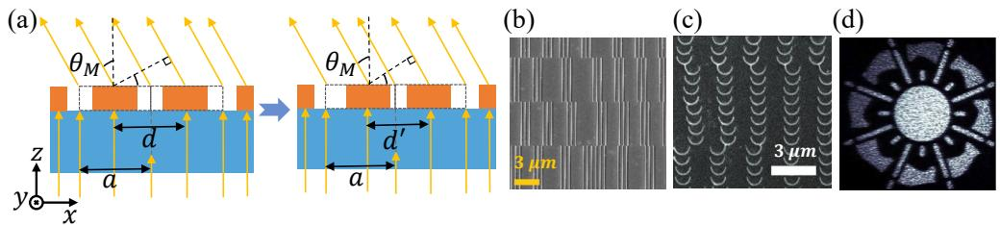

text_image

(a)
θM
c
d
a
z
y
x
(b)
3 μm
(c)
3 μm
(d)

Detour phase metasurfaces. (a) Schematic of the principle of the detour phase metasurface. (b) Scanning electron micrograph (SEM) of the detour phase metasurface based on the structure of multiple ridge waveguides. (c) SEM of the detour phase metasurface based on the streamlined structure. (d) Experimental holographic image generated by the detour phase metasurface hologram under the incident of linearly polarized light at a wavelength of 1350 nm. (b) and (d) Adapted from $[161]$ under a Creative Commons license. (c) Adapted with permission from Wang et al., Small 15, 1900483 (2019) $[165]$ . Copyright © 2019 WILEY-VCH Verlag GmbH & Co. KGaA, Weinheim.

Eq. (29) into Eq. (32), and denoting $M$ as $\sigma_{\mathrm{d}}$ , we obtain the expression for the detour phase

$$
\phi_ {\text {detour}} = \sigma_ {\mathrm{d}} 2 \pi \frac {\Delta d}{a}. \tag {33}
$$

Compared to the expression for geometric phase in Eq. (23), it's noted that the diffraction order in detour phase plays a similar role to the symbol $\sigma$ in geometric phase, which is why $M$ is denoted as $\sigma_{\mathrm{d}}$ . Detour phase metasurfaces and geometric phase metasurfaces both use the units with the same structure, but the former introduces a phase shift through displacement, while the latter does so through rotation. Similar to the geometric phase, the detour phase is wavelength-independent, exhibiting phase dispersion-free characteristics. The derivation of Eq. (33) does not assume the polarization state of the incident light; hence, a displacement $\Delta d$ introduces the detour phase expressed by Eq. (33) for light of any polarization state at the diffraction order of $\sigma_{\mathrm{d}}$ . However, the diffraction efficiency at the $M^{\mathrm{th}}$ diffraction order is generally polarization-sensitive, so detour phase metasurfaces often operate under specific polarization states [161,166-168]. Through selecting an appropriate unit structure, detour phase metasurfaces have the potential to achieve excellent incident angle tolerance. In 2018, Deng et al. [167] experimentally demonstrated a detour phase metasurface with an incident angle tolerance close to grazing incidence.

To fulfill the function of phase modulation, it is essential that $\sigma_{\mathrm{d}} \neq 0$ , which necessitates that detour phase metasurface units operate at non-zeroth-order diffraction. From Eq. (33), to achieve a phase coverage of $2\pi$ , $\Delta d$ should satisfy

$$
\Delta d \geq \frac {a}{| \sigma_ {\mathrm{d}} |}. \tag {34}
$$

Furthermore, the unit structure needs to satisfy the dispersion characteristic of the $M^{th}$ diffraction angle as expressed by Eq. (29) to ensure the wavelength-independent feature of the detour phase [161], as seen from the derivation from Eq. (32) to Eq. (33).

Achieving high device efficiency requires specific structural design to ensure that the $M^{\mathrm{th}}$ diffraction order of the unit has high diffraction efficiency. Currently reported detour phase unit structures exhibiting high diffraction efficiency under normal incidence include the structure of multiple parallel ridge waveguides [161] and the streamlined

structure [165], illustrated in Figs. 4(b) and 4(c), respectively. Additionally, tilting the incident light can also enhance the diffraction efficiency of non-zero diffraction orders [167].

Expanding the concept of detour phase metasurfaces from displacements in one direction to displacements in two perpendicular directions, consider a metasurface unit that possesses diffraction orders $\sigma_{d,x}$ along the x direction and $\sigma_{d,y}$ along the y direction. The corresponding diffraction angles $\theta_{x}$ and $\theta_{y}$ can be obtained through Eq. (29). From Eq. (33), when the unit introduces displacements $\Delta d_{x}$ along the x direction and $\Delta d_{y}$ along the y direction simultaneously, the phase shifts $\phi_{detour,x}$ and $\phi_{detour,y}$ introduced to the output light at the diffraction orders of $\sigma_{d,x}$ and $\sigma_{d,y}$ are, respectively,

$$
\phi_ {\text {detour}, x} = \sigma_ {\mathrm{d}, x} 2 \pi \frac {\Delta d _ {x}}{a}, \quad \phi_ {\text {detour}, y} = \sigma_ {\mathrm{d}, y} 2 \pi \frac {\Delta d _ {y}}{a}. \tag {35}
$$

This achieves independent detour phase modulation for the output light at the diffraction angles $\theta_{x}$ and $\theta_{y}$ in the x and y directions, respectively.

In 2016, Capasso's group [161] implemented a detour phase metasurface hologram operating at the $\sigma_{d}=\pm1$ diffraction order, utilizing a unit structure with a unit size of 5.4 $\mu$ m, which was composed of six ridge waveguides made of a–Si, as shown in Fig. 4(c). This metasurface hologram was composed of $256\times256$ units. Operating under the linear polarization state, the hologram achieved a bandwidth from visible to near-infrared and an absolute efficiency (defined in Subsection 5.1.3) of 75% in the wavelength range of 1.0–1.4 $\mu$ m. The holographic image generated by the metasurface hologram at 1350 nm is shown in Fig. 4(d).

Other applications of detour phase metasurfaces in designs for complex amplitude modulation, polarization multiplexing, and wavelength multiplexing will be introduced in Subsections 5.1.2, 5.2.1, and 5.2.2.

# 2.1.5. Hybrid Phase Modulation Mechanism

The hybrid phase modulation mechanism leverages the shape, size, rotational angle, and other design degrees of freedom of the meta-atom, providing maximum flexibility in forward design approaches. Here, we focus on the combination of geometric phase with resonant and propagation phase modulation. However, hybrid phase modulation can also be achieved through other combinations, such as detour phase with geometric phase or topological phase with geometric phase. The hybrid modulation of detour and geometric phases will be discussed in Subsection 5.2.1, while the hybrid modulation of topological and geometric phases has already been introduced in Subsection 2.2.6.

For a fixed wavelength, arbitrary amplitude and phase modulation can be described by the Jones matrix:

$$
\mathbf {J} = \left[ \begin{array}{l l} J _ {x x} & J _ {x y} \\ J _ {y x} & J _ {y y} \end{array} \right], \tag {36}
$$

where $J_{xx}, J_{xy}, J_{yx}$ , and $J_{yy}$ are arbitrary complex numbers.

For a single-layer metasurface using a hybrid phase modulation mechanism, the Jones matrix of a meta-atom can be expressed as Eq. (14), which is symmetric [see Eq. (17)] and unitary [see Eq. (19)] when assuming $t_x = t_y = 1$ (the amplitude modulation is ignored here). Now we have three variables in Eq. (14), i.e., $\phi_x, \phi_y$ , and $\theta$ , while there are eight variables in Eq. (36), so it's obviously impossible to realize Eq. (36) just with a single-layer metasurface (here we don't consider the case where each metasurface unit contains several meta-atoms, which will be discussed in Subsections 5.1.2 and 5.2.1).

To make the Jones matrix J realizable with a single-layer metasurface, it is required to be symmetric and unitary, i.e., it should satisfy

$$
\mathbf {J} = \mathbf {J} ^ {\top}, \tag {37}
$$

and

$$
\mathbf {J} \mathbf {J} ^ {\dagger} = \mathbf {I}, \tag {38}
$$

where $\mathbf{I}$ is the identity matrix. Mathematically, any symmetric and unitary matrix $\mathbf{J}$ can always be decomposed into $\mathbf{J} = \mathbf{V}\Lambda \mathbf{V}^{\dagger}$ , where $\mathbf{V}$ is a real unitary matrix composed of the eigenvectors of $\mathbf{J}$ arranged column by column, and $\Lambda$ is a diagonal matrix whose diagonal elements are the corresponding eigenvalues, which are complex numbers with a magnitude of 1. Comparing $\mathbf{J} = \mathbf{V}\Lambda \mathbf{V}^{\dagger}$ with the Jones matrix of the meta-atom under hybrid phase modulation, as shown in Eq. (14), we observe a one-to-one correspondence between $\Lambda$ and $\mathbf{T}_0$ , and between $\mathbf{V}$ and $\mathbf{R}$ , when the transmittance is approximated to 1. This means that any symmetric and unitary Jones matrix can be realized by changing the shape, size, and rotation angle of the meta-atom [143].

Arbitrary polarization and phase transformation. In 2015, Faraon's group [143] theoretically demonstrated that the hybrid phase modulation mechanism could achieve phase modulation from any incident polarization state to any output polarization state. This means satisfying any polarization and phase transformation between the incident light's Jones vector $\vec{E}^{\mathrm{in}} = [E_x^{\mathrm{in}}E_y^{\mathrm{in}}]^{\top}$ and the output light's Jones vector $\vec{E}^{\mathrm{out}} = [E_x^{\mathrm{out}}E_y^{\mathrm{out}}]^{\top}$ , as given by

$$
\vec {E} ^ {\text {out}} = \mathbf {J} \vec {E} ^ {\text {in}}, \tag {39}
$$

where J is limited by Eqs. (37) and (38) to be realizable with a single-layer meta-surface. By combining Eqs. (36)–(39), the expressions for the elements of J can be obtained from the following set of equations:

$$
\left(E _ {x} ^ {\text {out}}\right) ^ {*} J _ {x x} + \left(E _ {y} ^ {\text {out}}\right) ^ {*} J _ {x y} = \left(E _ {x} ^ {\text {in}}\right) ^ {*}, \tag {40}
$$

$$
E _ {x} ^ {\text {in}} J _ {x x} + E _ {y} ^ {\text {in}} J _ {x y} = E _ {x} ^ {\text {out}}, \tag {41}
$$

$$
J _ {y x} = J _ {x y}, \tag {42}
$$

$$
J _ {y y} = - e ^ {i 2 \angle J _ {x y}} \left(J _ {x x}\right) ^ {*}, \tag {43}
$$

where $*$ denotes complex conjugation and $\angle$ denotes the angle of a complex number. This implies that for any polarization and phase transformation between the incident and output light, there always exists a symmetric and unitary Jones matrix solution that can be realized by a single-layer metasurface based on the hybrid phase modulation mechanism.

Polarization multiplexing for arbitrary orthogonal polarization states. In 2017, Mueller et al. [169] utilized the hybrid phase modulation mechanism to achieve independent phase modulation for any orthogonal polarization states, whether linear, circular, or elliptical polarization. Let the Jones vectors for the input orthogonal polarization states be $\vec{E}^{\mathrm{in}, + } = [E_x^{\mathrm{in}, + }E_y^{\mathrm{in}, + }]^\top$ and $\vec{E}^{\mathrm{in}, - } = [E_x^{\mathrm{in}, - }E_y^{\mathrm{in}, - }]^\top$ , and the corresponding Jones vectors for the output orthogonal polarization states be $\vec{E}^{\mathrm{out}, + }$ and $\vec{E}^{\mathrm{out}, - }$ , respectively. To introduce mutually independent phase distributions $\phi^{+}$ and $\phi^{-}$ for the two orthogonal polarization states, the Jones matrix $\mathbf{J}$ satisfies

$$
\mathbf {J} \vec {E} ^ {\text {in,} +} = e ^ {i \phi^ {+}} \vec {E} ^ {\text {out,} +}, \tag {44}
$$

$$
\mathbf {J} \vec {E} ^ {\mathrm{in}, -} = e ^ {i \phi^ {-}} \vec {E} ^ {\mathrm{out}, -}. \tag {45}
$$

Given the constraints of J by Eqs. (37) and (38), for the equations above to have a solution, it is necessary to set the Jones vectors of the output orthogonal polarization

Figure 5  
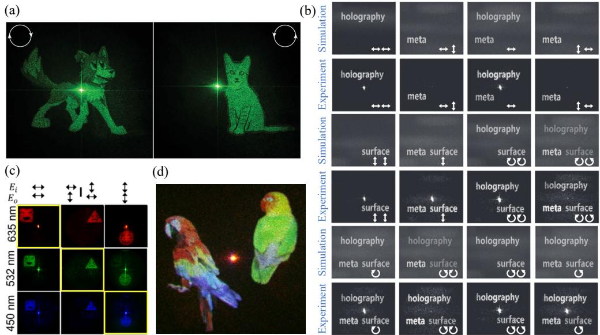

Applications of the hybrid phase modulation mechanism. (a) Holographic images of the polarization-multiplexed metasurface hologram. When illustrating the RCP (LCP) light is used, the holographic image of a dog (cat) is reconstructed. (b) Holographic images of the multi-channel polarization-multiplexed metasurface hologram. When there are two white arrows in the lower right corner, the arrows represent polarization states of the input and output light, respectively. And when there is only one white arrow in the lower right corner, the arrow represents the polarization state of the input light, and the polarization state of the output light is not specified. (c) The broadband characteristic of the multi-channel polarization-multiplexed metasurface (experimental results). (d) The experimental full-color holographic image of the multi-channel polarization-multiplexed metasurface. (a) Reprinted with permission from Mueller et al., Phys. Rev. Lett. 118, 113901 (2017) [169]. Copyright © 2017 American Physical Society. (b) Adapted from [170] under a Creative Commons license. (c) and (d) Adapted with permission from Hu et al., Nano Lett. 20, 994–1002 (2020) [135]. Copyright © 2019 American Chemical Society.

states to satisfy

$$
\vec {E} ^ {\text {out,} +} = \left(\vec {E} ^ {\text {in,} +}\right) ^ {*}, \quad \vec {E} ^ {\text {out,} -} = \left(\vec {E} ^ {\text {in,} -}\right) ^ {*}. \tag {46}
$$

Substituting Eq. (46) into Eqs. (44) and (45), we obtain

$$
\mathbf {J} = \left[ \begin{array}{l l} e ^ {i \phi^ {+}} \left(E _ {x} ^ {\text {in}, +}\right) ^ {*} & e ^ {i \phi^ {-}} \left(E _ {x} ^ {\text {in}, -}\right) ^ {*} \\ e ^ {i \phi^ {+}} \left(E _ {y} ^ {\text {in}, +}\right) ^ {*} & e ^ {i \phi^ {-}} \left(E _ {y} ^ {\text {in}, -}\right) ^ {*} \end{array} \right] \left[ \begin{array}{l l} E _ {x} ^ {\text {in}, +} & E _ {x} ^ {\text {in}, -} \\ E _ {y} ^ {\text {in}, +} & E _ {y} ^ {\text {in}, -} \end{array} \right] ^ {- 1}. \tag {47}
$$

This Jones matrix is symmetric and unitary, so it can be realized by a single-layer metasurface through a hybrid phase modulation mechanism. Using elliptical Si pillars as metasurface atoms, a metasurface hologram operating at a wavelength of 532 nm with polarization multiplexing for RCP and LCP light was designed. The experimental holographic images are shown in Fig. 5(a).

Approaching the limit of polarization multiplexing. For the Jones matrix J expressed as Eq. (36), each element corresponds to the complex amplitude modulation for a specific polarization channel. For example, using Eq. (55), when the incident

light's Jones vector is $[10]^{\top}$ , the transmission coefficient for the polarization state described by the Jones vector $[01]^{\top}$ is represented by the element $J_{yx}$ . Below, we ignore the amplitude modulation, which will be introduced in Subsection 5.1.2.

Based on the resonant or propagation phase modulation mechanism, it's feasible to achieve independent phase modulation for two orthogonal linear polarization states, provided that the meta-atom database can cover all possible phase shift combinations of $\phi_x$ and $\phi_y$ in Eq. (13). Now, we consider how the hybrid phase modulation mechanism can be utilized to achieve a higher number of polarization multiplexing. Further discussion can be found in Subsection 5.2.1.

Ideally, we aim to introduce independent phase modulation for each polarization channel within the Jones matrix while ensuring they have the same amplitude transmission coefficient. This can be formalized as

$$
\mathbf {J} = \frac {1}{\sqrt {2}} \left[ \begin{array}{l l} e ^ {i \phi_ {x x}} & e ^ {i \phi_ {x y}} \\ e ^ {i \phi_ {y x}} & e ^ {i \phi_ {y y}} \end{array} \right]. \tag {48}
$$

To make Eq. (48) realizable with a single-layer metasurface, J needs to satisfy Eqs. (37) and (38). Substituting Eq. (48) into Eq. (37), we obtain

$$
\phi_ {x y} = \phi_ {y x}. \tag {49}
$$

Substituting Eqs. (48) and (49) into Eq. (38), we obtain

$$
\sin \left(\phi_ {x x} - \phi_ {x y}\right) - \sin \left(\phi_ {y y} - \phi_ {x y}\right) = 0, \tag {50}
$$

$$
\cos \left(\phi_ {x x} - \phi_ {x y}\right) + \cos \left(\phi_ {y y} - \phi_ {x y}\right) = 0. \tag {51}
$$

Taking the sum of squares of Eqs. (50) and (51) and adding them together, we obtain

$$
\phi_ {x x} + \phi_ {y y} - 2 \phi_ {x y} = \pi + 2 N \pi , \tag {52}
$$

where N is an arbitrary integer. Thus, when Eq. (48) satisfies Eqs. (49) and (52) simultaneously, the Jones matrix J is symmetric and unitary and can be realized with a single-layer metasurface using a hybrid phase modulation mechanism.

Based on this approach, in 2018, Zhao et al. [170] realized a complex polarization-multiplexed metasurface hologram with an independent channel number of three. The Jones matrix of the meta-atom can be expressed as Eq. (48) limited by Eqs. (49) and (52). When the polarization state of the input light is linearly polarized along the x-direction, linearly polarized along the y-direction, LCP, or RCP, respectively, the Jones vectors of the output light are given as

$$
\begin{array}{l} \mathbf {J} \left[ \begin{array}{c} 1 \\ 0 \end{array} \right] = \frac {1}{\sqrt {2}} \left[ \begin{array}{c} e ^ {i \phi_ {x x}} \\ e ^ {i \phi_ {x y}} \end{array} \right], \\ \mathbf {J} \left[ \begin{array}{c} 0 \\ 1 \end{array} \right] = \frac {1}{\sqrt {2}} \left[ \begin{array}{c} e ^ {i \phi_ {x y}} \\ e ^ {i \phi_ {y y}} \end{array} \right], \\ \mathbf {J} \frac {1}{\sqrt {2}} \left[ \begin{array}{l} 1 \\ i \end{array} \right] = \frac {e ^ {i \phi_ {x x}} + e ^ {i \phi_ {y y}}}{4} \left[ \begin{array}{l} 1 \\ i \end{array} \right] + \frac {e ^ {i \phi_ {x x}} + 2 e ^ {i \left(\phi_ {x y} + \pi / 2\right)} + e ^ {i \left(\phi_ {y y} - \pi\right)}}{4} \left[ \begin{array}{l} 1 \\ - i \end{array} \right], \tag {53} \\ \mathbf {J} \frac {1}{\sqrt {2}} \left[ \begin{array}{c} 1 \\ - i \end{array} \right] = \frac {e ^ {i \phi_ {x x}} + 2 e ^ {i (\phi_ {x y} - \pi / 2)} + e ^ {i (\phi_ {y y} - \pi)}}{4} \left[ \begin{array}{c} 1 \\ i \end{array} \right] + \frac {e ^ {i \phi_ {x x}} + e ^ {i \phi_ {y y}}}{4} \left[ \begin{array}{c} 1 \\ - i \end{array} \right]. \\ \end{array}
$$

Under the constraints of Eqs. (49) and (52), it can be seen that there are only two independent phase modulations available in Eq. (48), for example, $\phi_{xx}$ and $\phi_{xy}$ . However, using the modified computer-generated holography (CGH) algorithm, it is possible

to make the third phase modulation $\phi_{yy}=2\phi_{xy}-\phi_{xx}+\pi$ (N in Eq. (52) is taken as 0) generate an independent holographic image different from holographic images generated by $\phi_{xx}$ and $\phi_{xy}$ . Therefore, this setup allows the reconstruction of three independent holographic images (1, 2, 3) and all their possible combinations $(1+2, 2+3, 1+3, 1+2+3)$ , creating up to 12 channels corresponding to different input and output polarization states. Based on this principle, a metasurface hologram composed of rectangular Si pillar meta-atoms was demonstrated, whose simulation and experimental holographic images are shown in Fig. 5(b). Experimentally, the device bandwidth spans from 600 nm to 800 nm.

It's noteworthy that the resonant or propagation phase metasurface is wavelength sensitive, and device performance will degrade if the operating wavelength deviates from the designated wavelength, so such a broadband property seems unlikely. In 2020, Hu et al. [135] explored the broadband characteristics of such metasurface devices, enabling the design of full-color metasurface holograms. For a metasurface operating at 532 nm, three different holographic images were encoded into $\phi_{xx}$ , $\phi_{xy}$ , and $\phi_{yy}$ . The polarization multiplexing effect is demonstrated in the second row of Fig. 5(c) for 532 nm. Surprisingly, at wavelengths of 635 nm and 450 nm, the generated holographic images, shown in the first and third rows of Fig. 5(c), respectively, were largely consistent with the 532 nm case except for size changes due to the chromatic aberration (the chromatic aberration is explained in Subsection 5.1.1). This broadband characteristic stems from the fact that for most meta-atoms in the metasurface, the difference in phase shift between two wavelengths is nearly constant. By assigning specific polarization channels to different wavelengths (one selection method is indicated by golden frames in Fig. 5(c)), it's possible to independently generate holographic images for red, green, and blue wavelengths, thereby achieving full-color holographic display, as illustrated in Fig. 5(d).

We note that the aforementioned limitation in polarization multiplexing can be overcome by using multilayer metasurfaces $[171,172]$ or by introducing engineered noise $[173]$ , which will be detailed in Subsection 5.2.1.

Beyond the applications mentioned above, the hybrid phase modulation mechanism also finds extensive applications in broadband achromatic metalenses, complex amplitude modulation metasurfaces, and more. The relevant design methods will be introduced in Sections 4 and 5.

# 2.1.6. Wavefront Manipulation by Planar Arrangement of Meta-Atoms

For inhomogeneous metasurfaces, the electromagnetic response characteristics can be regarded as a function in 2D space. Extending the coordinate system shown in Fig. 2(g) from a single meta-atom to the entire metasurface, at a certain position $(x,y)$ on the metasurface, the meta-atom introduces resonant or propagation phase shifts $\phi_{x}(x,y)$ and $\phi_{y}(x,y)$ for incident light linearly polarized along the x and y directions, respectively. The corresponding amplitude transmission coefficients are $t_{x}(x,y)$ and $t_{y}(x,y)$ , respectively, and the rotation angle of meta-atom is $\theta(x,y)$ . Using Eqs. (13) and (14), the Jones matrix describing the scattering characteristics of the metasurface can be expressed as

$$
\begin{array}{l} \mathbf {T} (x, y) \triangleq \left[ \begin{array}{c c} T _ {x x} (x, y) & T _ {x y} (x, y) \\ T _ {y x} (x, y) & T _ {y y} (x, y) \end{array} \right] \\ = \mathbf {R} (\theta (x, y)) \left[ \begin{array}{c c} t _ {x} (x, y) e ^ {i \phi_ {x} (x, y)} & 0 \\ 0 & t _ {y} (x, y) e ^ {i \phi_ {y} (x, y)} \end{array} \right] \mathbf {R} (- \theta (x, y)), \tag {54} \\ \end{array}
$$

where $T_{xy}(x,y) = T_{yx}(x,y)$ .

Figure 6  
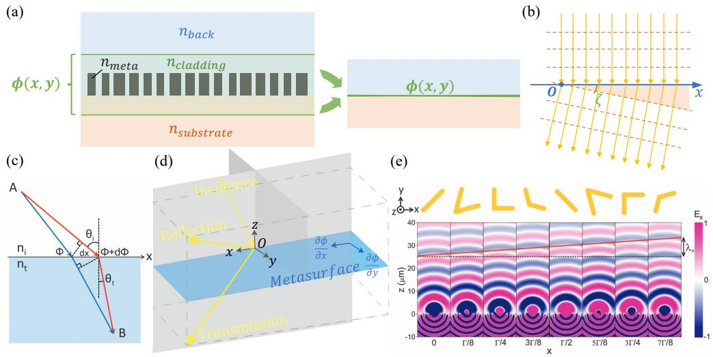

Related theories of the meta-atom arrangement. (a) Schematic of the simplification process for analyzing the electromagnetic wave manipulation of the metasurface. (b) Schematic of wavefront transformation by a metagrating. (c) Schematic used for the derivation of the generalized law of refraction. (d) Schematic of the generalized laws of refraction and reflection in the three-dimensional case. (e) FDTD simulation results of the scattered electric field for each V-shaped meta-atom in the array. (c) and (e) Reprinted with permission from Yu et al., Science 334, 333–337 (2011) [174]. Copyright © 2011 American Association for the Advancement of Science.

Considering the incident light with arbitrary polarization state represented by Jones vector $\vec{I}$ and the output light with arbitrary polarization state represented by Jones vector $\vec{O}$ , the complex amplitude distribution $t(x,y)e^{i\phi(x,y)}$ of the output light can be expressed as

$$
t (x, y) e ^ {i \phi (x, y)} = \vec {O} ^ {\dagger} \mathbf {T} (x, y) \vec {I}. \tag {55}
$$

Now we focus on the phase modulation for a specific polarization channel (metasurfaces for complex amplitude modulation will be discussed in Subsection 5.1.2, and polarization-multiplexed metasurfaces will be introduced in Subsections 2.1.5 and 5.2.1), and assume the amplitude transmission coefficients are constant at 1, which can be ensured by selecting meta-atoms with high transmittance. In this case, as illustrated in Fig. 6(a), it is sufficient to examine an interface with a spatially varying phase shift that is abstracted from the metasurface, and all the scattering effects occurring within the metasurface are no longer of concern.

In the following, we will examine the wavefront manipulation of metasurfaces from different perspectives, taking the metagrating as an example.

Wavefront transformation. For a metagrating designed to deflect normally incident light by an angle $\zeta$ , as illustrated in Fig. 6(b), the required phase compensation between the output and input wavefronts leads to the following target phase distribution:

$$
\phi (x) = k x \sin \zeta , \tag {56}
$$

where k is the wavenumber in the output medium.

Generalized laws of refraction and reflection. The generalized laws of refraction and reflection can be used to describe the impact of spatially varying phase shift introduced at an interface on the behavior of light between two media.

We consider a 2D case firstly, as shown in Fig. 6(c), where the phase shift introduced by the interface is a function of position, denoted as $\phi(x)$ , with the red and blue lines representing two paths infinitely close to the actual path of light. Then, by Fermat's principle, the phase difference accumulated along the two paths should be zero [175], leading to the derivation of the following generalized law of refraction [174]:

$$
n _ {\mathrm{t}} \sin \theta_ {\mathrm{t}} - n _ {\mathrm{i}} \sin \theta_ {\mathrm{i}} = \frac {\lambda_ {0}}{2 \pi} \frac {\mathrm{d} \phi (x)}{\mathrm{d} x}, \tag {57}
$$

where $n_{i}$ and $n_{t}$ are the refractive indices of the input and output media, respectively, $\theta_{i}$ and $\theta_{t}$ are the angles of incidence and refraction, respectively, and $\lambda_{0}$ is the wavelength of light in free space. Similarly, the generalized law of reflection is

$$
\sin \theta_ {\mathrm{r}} - \sin \theta_ {\mathrm{i}} = \frac {\lambda_ {0}}{2 \pi} \frac {1}{n _ {\mathrm{i}}} \frac {\mathrm{d} \phi (x)}{\mathrm{d} x}, \tag {58}
$$

where $\theta_{r}$ is the angle of reflection. These laws indicate that the refracted and reflected beams can be bent in any direction within their respective half-incident planes by designing the phase shift distribution at the interface to provide a certain phase gradient and appropriately selecting the refractive indices of the surrounding media. When $\theta_{i}=0$ , Eqs. (57) and (58) are equivalent to Eq. (56).

In 2011, Yu et al. defined Eqs. (57) and (58) as the generalized refraction and reflection laws, respectively, and experimentally verified them using metasurfaces [174]. In the experiment, the amplitude of the scattering field from all meta-atoms should remain consistent, and the spacing between adjacent meta-atoms in the array should be much smaller than the wavelength, combining to produce refracted or reflected waves with plane wavefronts [176], as shown in Fig. 6(e). It is worth noting that the derivation of these laws was also mentioned by Li and Cen in their book published in 2007 [177].

Momentum conservation. The generalized laws of refraction and reflection can be interpreted through the principle of momentum conservation.

We now continue the discussion in the 2D case. Defining the wavenumber of light in free space as $k_{0}=2\pi/\lambda_{0}$ , and the wavenumbers in the two media as $k_{t}=n_{t}k_{0}$ and $k_{i}=n_{i}k_{0}$ , respectively, and further incorporating these variables into Eqs. (57) and (58), we obtain

$$
k _ {\mathrm{t}} \sin \theta_ {\mathrm{t}} - k _ {\mathrm{i}} \sin \theta_ {\mathrm{i}} = \frac {\mathrm{d} \phi (x)}{\mathrm{d} x}, \tag {59}
$$

and

$$
k _ {\mathrm{i}} \sin \theta_ {\mathrm{r}} - k _ {\mathrm{i}} \sin \theta_ {\mathrm{i}} = \frac {\mathrm{d} \phi (x)}{\mathrm{d} x}. \tag {60}
$$

The left side of Eqs. (59) or (60) represents the change of the in-plane wavevector/momentum of light, while the right side corresponds to the phase gradient introduced by the interface. This implies that the essence of the aforementioned laws is the law of momentum conservation.

As shown in Fig. 6(d), when considering a 3D case, where the phase shift distribution introduced by the interface is denoted as $\phi(x,y)$ , Eqs. (59) and (60) can be further expanded into the following forms:

$$
\vec {k} _ {\mathrm{t}, \mathrm{T}} - \vec {k} _ {\mathrm{i}, \mathrm{T}} = \frac {\mathrm{d} \phi (x , y)}{\mathrm{d} \vec {r}}, \tag {61}
$$

and

$$
\vec {k} _ {\mathrm{r}, \mathrm{T}} - \vec {k} _ {\mathrm{i}, \mathrm{T}} = \frac {\mathrm{d} \phi (x , y)}{\mathrm{d} \vec {r}}, \tag {62}
$$

where $\vec{k}_{i,T}=k_{i,x}\vec{e}_{x}+k_{i,y}\vec{e}_{y}$ , $\vec{k}_{t,T}=k_{t,x}\vec{e}_{x}+k_{t,y}\vec{e}_{y}$ , and $\vec{k}_{r,T}=k_{r,x}\vec{e}_{x}+k_{r,y}\vec{e}_{y}$ are the transverse wavevectors of the incident, refracted, and reflected light, respectively, $\vec{r}=x\vec{e}_{x}+y\vec{e}_{y}$ ( $\vec{e}_{x}$ and $\vec{e}_{y}$ are unit vectors along the x and y directions, respectively), and

$$
\frac {\mathrm{d} \phi (x , y)}{\mathrm{d} \vec {r}} = \frac {\partial \phi (x , y)}{\partial x} \vec {e} _ {x} + \frac {\partial \phi (x , y)}{\partial y} \vec {e} _ {y} \tag {63}
$$

is the phase gradient. Given that the phase gradient is on the 2D interface, the transition from incident to refracted or reflected light allows for changes in the transverse component of the wavevector followed by Eq. (61), while the components in the z direction can be solved by

$$
\vec {k} _ {\mathrm{t}, \mathrm{z}} = \sqrt {\left(k _ {\mathrm{t}} ^ {2} - \left| \vec {k} _ {\mathrm{t} , \mathrm{T}} \right| ^ {2}\right)}, \quad \vec {k} _ {\mathrm{r}, \mathrm{z}} = - \sqrt {\left(k _ {\mathrm{r}} ^ {2} - \left| \vec {k} _ {\mathrm{r} , \mathrm{T}} \right| ^ {2}\right)}. \tag {64}
$$

Assuming the x axis lies within the incident plane, the component of the phase gradient perpendicular to the incident plane $\frac{\partial\phi(x,y)}{\partial y}$ leads to refraction and reflection outside the incident plane, thereby achieving bending of the refracted and reflected beams in any direction within their respective half-spaces [178].

According to Eq. (64), when the magnitude of the transverse wavevector $\vec{k}_{t,T}$ in Eq. (61) is larger than the wavenumber in the output medium $k_{t}$ , i.e.,

$$
\left| \vec {k} _ {\mathrm{t}, \mathrm{T}} \right| = \left| \vec {k} _ {\mathrm{i}, \mathrm{T}} + \frac {\mathrm{d} \phi (x , y)}{\mathrm{d} \vec {r}} \right| > k _ {\mathrm{t}}, \tag {65}
$$

the wavevector component in the propagation direction, $k_{z}$ , becomes imaginary, leading to the formation of evanescent waves [109]. For the perpendicularly incident light ( $\vec{k}_{i,T}=0$ ), we can obtain a more straightforward form for Eq. (65):

$$
\left| \frac {\mathrm{d} \phi (x , y)}{\mathrm{d} \vec {r}} \right| > k _ {\mathrm{t}}. \tag {66}
$$

Metagrating equation. In fact, beyond the phase modulation imparted by individual meta-atoms, incident light interacting with a metagrating also experiences diffraction arising from the periodic repetition of the meta-atom arrangement. This diffraction effect was neglected in the preceding discussion; as a result, the previously derived equations are insufficient to fully characterize the optical behavior of a metagrating.

The metagrating equations for devices operating in transmission or reflection mode in the 2D case can be expressed as

$$
\frac {2 \pi}{\lambda_ {0}} \left(n _ {\mathrm{t}} \sin \theta_ {\mathrm{t}} - n _ {\mathrm{i}} \sin \theta_ {\mathrm{i}}\right) = \frac {\mathrm{d} \phi (x)}{\mathrm{d} x} + M \frac {2 \pi}{\Lambda} \tag {67}
$$

and

$$
\frac {2 \pi}{\lambda_ {0}} n _ {\mathrm{i}} \left(\sin \theta_ {\mathrm{r}} - \sin \theta_ {\mathrm{i}}\right) = \frac {\mathrm{d} \phi (x)}{\mathrm{d} x} + M \frac {2 \pi}{\Lambda}, \tag {68}
$$

respectively, where M is the diffraction order, and $\Lambda$ is the structural period of the meta-grating along the x-direction. It is important to note that $\Lambda$ is distinct from the lattice constant of the meta-atom array. By introducing the diffraction effect into Eqs. (61) and (62), we obtain the metagrating equations in the 3D case:

$$
\vec {k} _ {\mathrm{t}, \mathrm{T}} - \vec {k} _ {\mathrm{i}, \mathrm{T}} = \frac {\mathrm{d} \phi (x , y)}{\mathrm{d} \vec {r}} + M _ {x} \frac {2 \pi}{\Lambda_ {x}} \vec {e} _ {x} + M _ {y} \frac {2 \pi}{\Lambda_ {y}} \vec {e} _ {y} \tag {69}
$$

and

$$
\vec {k} _ {\mathrm{r}, \mathrm{T}} - \vec {k} _ {\mathrm{i}, \mathrm{T}} = \frac {\mathrm{d} \phi (x , y)}{\mathrm{d} \vec {r}} + M _ {x} \frac {2 \pi}{\Lambda_ {x}} \vec {e} _ {x} + M _ {y} \frac {2 \pi}{\Lambda_ {y}} \vec {e} _ {y}, \tag {70}
$$

where $\Lambda_{x}$ and $\Lambda_{y}$ denote the structural periods of the metagrating along the x- and y-directions, respectively, and $M_{x}$ and $M_{y}$ represent the corresponding diffraction orders.

Specifically, for a metagrating based on a square lattice, when the phase shift between adjacent meta-atoms is $\Delta\phi$ , the phase gradient is given by $\Delta\phi/a$ , and the structural period $\Lambda$ satisfies

$$
\Lambda = \frac {\mathrm{LCM} \left(\Delta \phi / \pi , 2 \pi / \pi\right)}{\Delta \phi / \pi} a, \tag {71}
$$

where LCM denotes the least common multiple of the two arguments. In this case, the phase gradient of the metagrating corresponds to one of the discrete diffraction orders.

The metagrating equation reveals two key consequences of diffraction in the light manipulation process:

(1) To achieve efficient light deflection into the desired direction, the phase modulation of meta-atoms needs to direct light into a spatial spectrum range around the target diffraction order and ensure that no other orders fall within this range. The diffraction effect then enforces precise confinement of the deflected light into the target angle.  
(2) Stray light of the metagrating arises from non-target diffraction orders permitted by the metagrating equation.

The design workflow for metagratings is available in our open-source code repository [73].

# 2.2. Emerging Metasurfaces

# 2.2.1. From Single-Layer to Multilayer Metasurfaces

The discussions above focus on single-layer metasurfaces. Analogous to traditional optical design, cascading multiple layers of metasurfaces to work in coordination could enable the achievement of design tasks challenging for a single-layer metasurface, such as aberration correction in metalenses $[179]$ and generation of high-purity vortex beams $[180]$ . It could also facilitate the realization of novel functionalities, including secret sharing $[181]$ and optical neural networks $[182]$ . In addition, active Moiré metasurfaces based on multilayer metasurfaces will be introduced in Subsection 8.10.

(I) When the spacing between layers of metasurfaces is sufficiently large, allowing the metasurfaces to decouple, the overall electromagnetic response of these multiple layers can be computed using ray tracing $[179]$ or the Rayleigh–Sommerfeld diffraction formula in Eq. (157) $[172,183]$ . In this way, we can optimize the interlayer spacings and the target phase distribution for each metasurface layer $[184,185]$ . The design of each metasurface layer is carried out independently based on the target phase distribution requirement, and its theory and methods are entirely consistent with those of a single-layer metasurface. In 2016, Arbabi et al. $[179]$ used this method to realize a bilayer metalens with a layer spacing of 1 mm and an operating wavelength of 850 nm, achieving an F-number of 0.9, an FOV greater than $60^{\circ}$ , and an absolute focusing efficiency of 70% (with a diameter of effective focusing area of 15 mm), with its imaging result shown in Fig. 7(a).

Figure 7  
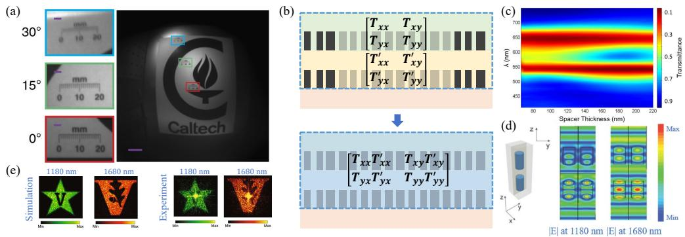

Theories and applications of the cascaded metasurfaces. (a) Image taken with the bilayer metalens. Scale bar, 100 $\mu$ m. The insets show an enlarged view of the image at the locations indicated by rectangular boxes, which are outlined in the same color and correspond to viewing angles of 0°, 15°, and 30°. Scale bar, 10 $\mu$ m. (b) Schematic of the approximation for analyzing the electromagnetic wave manipulation of the bilayer metasurface. (c) Impact of the thickness of the spacer layer on the resonance characteristics of the bilayer metasurface. FDTD simulation results of the optical transmittance through the Au and Ag layers spaced with silica. (d) Electric field amplitude distribution of a pair of cascaded meta-atoms at wavelengths of 1180 nm and 1680 nm. (e) Holographic images of the multi-wavelength metasurface hologram at wavelengths of 1180 nm and 1680 nm. Left: simulation results. Right: experimental results. (a) Reprinted from [179] under a Creative Commons license. (c) Reprinted from [186] under a Creative Commons license. (d) Adapted with permission from Zhou et al., Nano Lett. 18, 7529–7537 (2018) [187]. Copyright © 2018 American Chemical Society. (e) Adapted from [188] under a Creative Commons license.

(II) Metasurfaces with closely stacked multiple layers with interlayer coupling neglected. However, the limitations brought by interlayer distances of several hundred micrometers or even larger are quite evident. First, it negates the advantage of the ultrathin thickness of the metasurface. Second, it may lead to limitations in design freedom and performance, failing to fully utilize the advantages of multilayer metasurfaces [187]. Now we consider the case where multiple layers of metasurfaces are closely arranged. As illustrated in Fig. 7(b), a bilayer metasurface is taken as an example. Neglecting the interlayer coupling, the Jones matrix $\mathbf{T}_{\mathrm{bilayer}}(x,y)$ of the bilayer metasurface can be expressed as

$$
\begin{array}{l} \mathbf {T} _ {\text {bilayer}} (x, y) = \mathbf {T} (x, y) \odot \mathbf {T} ^ {\prime} (x, y) \\ = \left[ \begin{array}{l l} T _ {x x} (x, y) T _ {x x} ^ {\prime} (x, y) & T _ {x y} (x, y) T _ {x y} ^ {\prime} (x, y) \\ T _ {y x} (x, y) T _ {y x} ^ {\prime} (x, y) & T _ {y y} (x, y) T _ {y y} ^ {\prime} (x, y) \end{array} \right], \tag {72} \\ \end{array}
$$

where $\mathbf{T}(x,y)$ and $\mathbf{T}'(x,y)$ are the Jones matrices of the two metasurface layers, respectively, and $\odot$ represents the Hadamard product. Eq. (72) means that the overall amplitude transmission coefficient is the product of the amplitude transmission coefficients of each metasurface layer, and the overall phase shift is the sum of the phase shifts of each metasurface layer. To satisfy the relationship in Eq. (72), the interlayer spacing must not be too large, as the generalized law of refraction indicates that the phase gradient will cause some degree of wavefront divergence, which becomes more severe with increasing interlayer distance. Additionally, the interlayer spacing cannot be too small to avoid significant coupling between meta-atoms across layers. For example, as shown in Fig. 7(c), the impact of the thickness of a silica spacer layer on

the resonance characteristics of a bilayer metasurface operating in the visible is calculated. Below a thickness of 90 nm, the interlayer coupling causes significant changes in the resonance properties of each layer $[186]$ . The reasonable range of interlayer distances can be determined through simulation. For instance, in Fig. 7(d), the electric field amplitude distributions of a pair of cascaded meta-atoms upon incidence of light at wavelengths of 1180 nm and 1680 nm were calculated to ensure no electric field coupling occurs between layers at the set interlayer distance $[187]$ . This method has been applied to achieve complex designs such as the three-layer metalens that eliminates red–green–blue chromatic aberration in the visible $[186]$ , the wavelength-multiplexed metasurface hologram [with its holographic images shown in Fig. 7(e)] $[188]$ , and the multi-wavelength achromatic bilayer metalens with the NA of 0.42 and absolute focusing efficiencies of 38% and 52% at wavelengths of 1180 nm and 1680 nm, respectively $[187]$ .

In 2025, Capasso's group [189] experimentally demonstrated bilayer metasurfaces composed of two free-standing $\mathrm{TiO_2}$ meta-atoms stacked directly on top of one another and surrounded by air. In this configuration, the interlayer spacing is zero to avoid optical losses and unwanted reflections caused by the interlayer material or the gap between the stacked metasurfaces. This design relies on selective development, achieved by carefully choosing two sets of electron-beam resist and developers for patterning the bottom and top layers, minimizing interference with the previously fabricated layer. To ensure negligible interlayer coupling, neither of the two meta-atoms is at resonance, and the top meta-atom has smaller dimensions than the bottom one.

(III) Metasurfaces with closely stacked multiple layers accounting for interlayer coupling. In prior designs, coupling between layers of cascaded metasurfaces is a factor that need to be avoided. However, from another perspective, it also presents a new degree of design freedom which traditional forward design methods struggle to exploit $[190]$ . In 2020, Mansouree et al. $[191]$ proposed an inverse design method for multilayer metasurfaces based on the adjoint method, utilizing interlayer coupling to expand the design space. Experimentally, they achieved a dual-wavelength, dual-focus polarization-insensitive metalens with absolute focusing efficiency (with an effective focusing area diameter of 3.6 mm) exceeding 30% at both wavelengths. This inverse design method will be further introduced in Subsection 3.3.

Despite the applications mentioned earlier, the key advantage of multilayer metasurfaces over single-layer metasurfaces lies in their ability to break the out-of-plane symmetry $[192]$ . As shown in Eq. (8), the Jones matrix of a single-layer metasurface is inherently symmetric. In contrast, multilayer metasurfaces support a full-parameter Jones matrix, enabling the design of chiral metasurfaces $[193]$ and enhancing polarization multiplexing with a larger number of channels $[171,172]$ . These aspects are discussed in detail in Subsections 5.2.1 and 5.2.4. Moreover, multilayer metasurfaces that break the out-of-plane mirror symmetry can be used to realize intrinsic chirality, which will be introduced in Subsection 2.2.5.

# 2.2.2. From Local to Nonlocal Metasurfaces

Until now, our discussion has focused exclusively on local metasurfaces. We will now broaden our exploration to include more general types of metasurfaces.

The general form of the metasurface electromagnetic response at the specific wavelength can be described as

$$
\vec {E} ^ {\text {out}} (x, y) = \iint_ {\Sigma} \mathbf {H} \left(x, y, x ^ {\prime}, y ^ {\prime}\right) \mathbf {T} \left(x ^ {\prime}, y ^ {\prime}\right) \vec {E} ^ {\text {in}} \left(x ^ {\prime}, y ^ {\prime}\right) \mathrm{d} x ^ {\prime} \mathrm{d} y ^ {\prime}, \tag {73}
$$

where $\Sigma$ is the spatial region of the metasurface, $\vec{E}^{in}\left(x',y'\right)$ and $\vec{E}^{out}\left(x,y\right)$ are input and output fields, respectively, $\mathbf{T}\left(x,y\right)$ describes the spatial complex amplitude modulation of the metasurface, and $\mathbf{H}\left(x,y,x',y'\right)$ is the transformation function of the metasurface in real space.

For a local metasurface, the response at a certain point depends only on the input field at the same point, which can be described by

$$
\mathbf {H} \left(x, y, x ^ {\prime}, y ^ {\prime}\right) = \delta \left(x - x ^ {\prime}, y - y ^ {\prime}\right) \mathbf {I}, \tag {74}
$$

where $\delta(x - x', y - y')$ is the 2D Dirac Delta function, and $\mathbf{I}$ is the identity matrix. Substituting Eq. (74) into Eq. (73), we obtain

$$
\vec {E} ^ {o u t} (x, y) = \mathbf {T} (x, y) \vec {E} ^ {i n} (x, y). \tag {75}
$$

The Fourier transformation of Eq. (74) gives

$$
\tilde {\mathbf {H}} \left(\vec {k} _ {\mathrm{T}}\right) = \mathbf {I}, \tag {76}
$$

where $\vec{k}_{T}=k_{x}\vec{e}_{x}+k_{y}\vec{e}_{y}$ is the transverse wavevector/momentum, on the plane of the metasurface [194]. Equation (76) means that for local metasurfaces, the electromagnetic response of the metasurface atoms should be independent of in-plane momentum $\vec{k}_{T}$ , i.e., it does not change with the angle of incidence of the light.

Different from local metasurfaces, the response of the nonlocal metasurface at a center point depends on the input field across an extended region of space $[195]$ . For general nonlocal metasurfaces, namely nondiffractive nonlocal metasurfaces $[196]$ , the transformation function satisfies translation symmetry $[196]$ , i.e.,

$$
\mathbf {H} \left(x, y, x ^ {\prime}, y ^ {\prime}\right) = \mathbf {H} \left(x - x ^ {\prime}, y - y ^ {\prime}\right), \tag {77}
$$

and complex amplitude modulation is not provided, i.e.,

$$
\mathbf {T} \left(x ^ {\prime}, y ^ {\prime}\right) = \mathbf {I}, \tag {78}
$$

Substitute Eqs. (77) and (78) into Eq. (73), and the Fourier transformation of the result can be written as follows using the convolution theorem:

$$
\tilde {\vec {E}} ^ {o u t} \left(\vec {k} _ {\mathrm{T}}\right) = \tilde {\mathbf {H}} \left(\vec {k} _ {\mathrm{T}}\right) \tilde {\vec {E}} ^ {i n} \left(\vec {k} _ {\mathrm{T}}\right). \tag {79}
$$

By comparing Eq. (79) with Eq. (75), it can be seen that local metasurfaces modulate the light field in real space, while nonlocal metasurfaces modulate the light field in momentum space. Generally, nondiffractive nonlocal metasurfaces are homogenous metasurfaces, and their design focuses on configuring the metasurface units to introduce a specific incident angle-dependent electromagnetic response, also known as spatial dispersion [195], described by $\tilde{\mathbf{H}}\left(\vec{k}_{\mathrm{T}}\right)$ .

Recently, nonlocal metasurfaces have achieved numerous significant applications in optical analog computing and image processing $[197–200]$ , free space squeezing $[201,202]$ , light localization $[203]$ , and so on. The advances in optical analog computing and image processing will be detailed in Subsection 7.1.1, and the progress of free space squeezing will be introduced in Subsection 2.3.2. Systematic introductions for nonlocal metasurfaces can be found in Ref. $[195]$ .

Clarifying the use of the term “nonlocal metasurfaces.” We believe it is essential to clearly distinguish between different interpretations of the term “nonlocal metasurfaces” to avoid conceptual confusion.

First, it is important to emphasize that the aforementioned nonlocal metasurfaces and metasurfaces that consider nonlocal coupling between adjacent meta-atoms in the design process are not equivalent. In the former context, “nonlocal” refers to the metasurface’s functional behavior in momentum space, where the output light field at a specific point in real space depends on the input light field over an extended region. In contrast, in the latter case, “nonlocal” pertains to the coupling between neighboring meta-atoms. It is worth noting that some researchers also describe the latter category as nonlocal metasurfaces $[204–206]$ .

Additionally, metasurfaces that support nonlocal resonant modes are frequently referred to as nonlocal metasurfaces $[207–211]$ . This represents yet another distinct concept. While such metasurfaces can implement nonlocal modulation functions $\tilde{\mathbf{H}}\left(\vec{k}_{\mathrm{T}}\right)$ due to their strong, narrowband spatial frequency responses—as introduced in Subsection 7.1.1—this functionality is not exclusive to metasurfaces with nonlocal resonant modes. For example, similar transformation functions can also be realized using metasurfaces based on local lattice modes $[212]$ , indicating that the two concepts are not equivalent. To avoid conceptual ambiguity, we use the term “high-Q-factor metasurfaces” in this tutorial to specifically refer to metasurfaces with nonlocal resonant modes.

# 2.2.3. From Low-Q-Factor to High-Q-Factor Metasurfaces

Traditional metasurfaces based on local resonances typically exhibit low Q-factors, generally below several tens. In contrast, high-Q-factor metasurfaces rely on nonlocal resonances with significantly higher Q-factors, which can be realized through mechanisms such as guided mode resonances and quasi-BICs. These high-Q-factor metasurfaces serve as an effective platform for enhanced light–matter interactions, lasing, sensing, boosted nonlinear effect, and narrowband wavefront shaping $[84,125,196,213]$ .

Photonic crystal slabs, consisting of arrays of nanostructures—such as rods or holes—arranged in an ordered lattice, exhibit 2D transverse periodicity with a finite thickness $[214]$ . Research on high-Q-factor resonances, including guided mode resonances and BICs, was initially carried out in the context of photonic crystal slabs $[215–218]$ , encompassing both theoretical analyses based on photonic crystal theory and experimental validation. Photonic crystal slabs share strong structural similarities with metasurfaces, particularly homogeneous metasurfaces. However, the former is primarily based on spatially extended nonlocal modes, while the latter emphasizes localized modes and spatially varying light-field modulation, leading to significantly different physical interpretations and applications for the two $[213]$ . Nonetheless, recent developments have introduced high-Q-factor nonlocal resonant modes into the metasurface domain, bridging the gap between the two platforms. Due to this historical development, both the terms “photonic crystal slab” $[219]$ and “metasurface” $[220]$ are now used to describe these devices with similar structures and functions. In this Subsection, we focus specifically on recent advances in high-Q-factor metasurfaces.

Guided mode resonances in metasurfaces. Guided mode resonance is a type of nonlocal lattice resonance that emerges from the coupling between the individual resonances of meta-atoms and transversely propagating waveguide modes within a waveguiding layer. In metallic metasurfaces, this waveguiding layer is typically formed by introducing a separate dielectric layer between the metallic meta-atoms and the substrate. In such configurations, the near fields are localized both at the surface of the metallic meta-atoms and within the dielectric layer $[80]$ . In contrast, for dielectric metasurfaces, although an additional dielectric layer may also be introduced to serve as the waveguiding layer $[221]$ , the waveguiding functionality can be provided directly by the periodic array of dielectric meta-atoms themselves $[220,222]$ .

First, we consider a waveguiding layer with refractive index $n_{g}$ , surrounded by a medium with refractive index $n_{s}$ , where $n_{g} > n_{s}$ . As illustrated in Fig. 8(a), the light line of the surrounding medium is defined by the dispersion relation

$$
\omega = \frac {c _ {0}}{n _ {\mathrm{s}}} \left| \vec {k} _ {\mathrm{T}} \right|, \tag {80}
$$

where $\vec{k}_{T}$ is the transverse wavevector, $\omega$ is the angular frequency, and $c_{0}$ is the speed of light in vacuum. Since

$$
\left| \vec {k} _ {\mathrm{T}} \right| ^ {2} + k _ {z} ^ {2} = (n _ {\mathrm{s}} k _ {0}) ^ {2} = \left(\frac {n _ {\mathrm{s}} \omega}{c _ {0}}\right) ^ {2}, \tag {81}
$$

where $k_{0}$ is the wavenumber in vacuum, the region above the light line, i.e.,

$$
\omega > \frac {c _ {0}}{n _ {\mathrm{s}}} \left| \vec {k} _ {\mathrm{T}} \right|, \tag {82}
$$

is referred to as the light cone or radiation continuum, where modes are radiative—that is, the waveguiding layer can couple energy into the surrounding medium. In contrast, modes below the light line, i.e.,

$$
\omega <   \frac {c _ {0}}{n _ {\mathrm{s}}} \left| \vec {k} _ {\mathrm{T}} \right|, \tag {83}
$$

are referred to as guided modes, which are non-radiative and remain confined within the waveguiding layer, as $k_{z}$ becomes imaginary and the fields decay exponentially away from the slab.

To couple incident light into guided modes within the waveguiding layer, the transverse wavevector imparted by the metasurface atop the layer must satisfy the following conditions:

$$
\left| \vec {k} _ {\mathrm{T}} \right| > n _ {\mathrm{s}} \frac {\omega}{c _ {0}}, \tag {84}
$$

$$
\left| \vec {k} _ {\mathrm{T}} \right| <   n _ {\mathrm{g}} \frac {\omega}{c _ {0}}, \tag {85}
$$

ensuring that the resulting mode lies within the waveguiding slab—above the light line of the surrounding medium but below that of the waveguiding layer. According to the metagrating equations [Eqs. (69) and (70)], such a transverse wavevector shift can be introduced through the phase gradient and diffraction effects generated by the metagrating. Most guided mode resonance metasurfaces rely primarily on diffraction to achieve this shift. Once the guided modes are excited, they propagate within the waveguiding layer while simultaneously interacting with the periodic modulation of the metagrating. This interaction enables coupling between the guided and radiative modes, thereby giving rise to guided mode resonances. It is worth noting that a “guided mode resonance” is, in fact, a radiative mode—rather than a guided mode, as the name might suggest.

Now consider a homogeneous metagrating based on a square lattice positioned atop a waveguiding layer, which is surrounded by a substrate with refractive index $n_{sub}$ and a superstrate with refractive index $n_{sup}$ . In this configuration, the phase gradient is zero. Focusing on the x-direction only—i.e., setting $k_{y} \equiv 0$ and $M_{y} \equiv 0$ —the metagrating equation [Eq. (69) or Eq. (70)] simplifies to

$$
k _ {\mathrm{T}} = k _ {\mathrm{i,T}} + M _ {x} \frac {2 \pi}{a}, \tag {86}
$$

Figure 8  
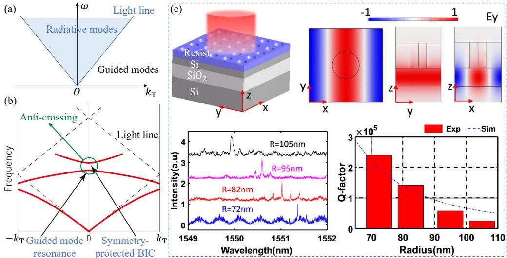

Guided mode resonances in metasurfaces. (a) Schematic illustration of radiative modes and guided modes. (b) Formation of guided mode resonances and a symmetry-protected BIC above the light cone, resulting from band folding of two guided modes from neighboring Brillouin zones. (c) Top left: schematic of the metasurface-waveguide system. A 330 nm-thick resist layer with air holes is patterned on a silicon-on-insulator wafer comprising a 220 nm-thick Si layer and a 2 $\mu$ m-thick $SiO_{2}$ layer. Top right: simulated field distributions of the guided mode resonance $TE_{311}$ . Bottom left: measured reflectance spectra of four fabricated samples with a fixed lattice constant of 545 nm and varying hole radii from 72 nm to 105 nm. Bottom right: measured (red bars) and simulated (dashed line) Q-factors of the guided mode resonance as a function of hole radius R. (b) Adapted with permission from Koshelev et al., Optics Photonics News 31, 38–45 (2020) [223]. Copyright © 2020 Optica Publishing Group. (c) Adapted from [221] under a Creative Commons license.

where $k_{T}$ represents either $k_{t,T}$ or $k_{r,T}$ , depending on whether the metagrating operates in transmission or reflection mode. Substituting Eq. (86) into Eqs. (84) and (85), we obtain the following conditions for coupling into guided modes:

$$
\left| k _ {\mathrm{i}, \mathrm{T}} + M _ {x} \frac {2 \pi}{a} \right| > n _ {\text {sub}} \frac {\omega}{c _ {0}}, \quad \left| k _ {\mathrm{i}, \mathrm{T}} + M _ {x} \frac {2 \pi}{a} \right| > n _ {\sup} \frac {\omega}{c _ {0}}, \tag {87}
$$

$$
\left| k _ {\mathrm{i}, \mathrm{T}} + M _ {x} \frac {2 \pi}{a} \right| <   n _ {\mathrm{g}} \frac {\omega}{c _ {0}}. \tag {88}
$$

Furthermore, the periodicity of the metagrating results in a band structure that is periodic in momentum space with a period of $2\pi/a$ [214]. The region $-\pi/a < k_{T} \leq \pi/a$ , which contains non-redundant values of $k_{T}$ , is known as the Brillouin zone. As illustrated in Fig. 8(b), this periodicity allows guided mode bands that lie below the light line to be folded back into the light cone ( $M_{x} = \pm1$ ), thereby enabling the formation of guided mode resonances. Notably, near the $\Gamma$ point ( $k_{T} = 0$ ), a pair of degenerate guided mode resonances exhibit anti-crossing behavior. Strong coupling between them leads to both constructive and destructive interference: the former results in a guided mode resonance with doubled radiation loss, while the latter gives rise to a symmetry-protected BIC with an ideally infinite Q-factor. We see that Eqs. (87) and (88) define the critical conditions for the realization of guided mode resonances.

In 2020, Han et al. [220] experimentally demonstrated this phenomenon using a terahertz homogeneous metasurface composed of cuboid Si meta-atoms arranged in a square lattice. In their design, the 2D array of Si meta-atoms functioned both as a grating and as an effective waveguiding layer.

In 2023, Huang et al. [221] experimentally realized the similar design by integrating a multilayer waveguide system with a homogeneous metasurface formed by resist holes in a square lattice, as shown in the top left panel of Fig. 8(c). This structure supported the guided mode resonance $TE_{311}$ , illustrated in the top right panel of Fig. 8(c). As seen in the bottom left panel of Fig. 8(c), decreasing the hole radius of the metasurface led to a narrowing of the resonance linewidth and a slight redshift in the resonance wavelength. The corresponding Q-factors, extracted via Fano fitting, are shown in the bottom right panel, with the highest value reaching $2.39 \times 10^{5}$ at a hole radius of 72 nm. This ultrahigh Q-factor is attributed to the simplified fabrication process, which avoids dry etching by using an ultrathin photoresist layer patterned via electron beam lithography. However, for metasurfaces with smaller hole radii, the resonance peaks become increasingly difficult to distinguish from experimental noise and background.

The aforementioned metasurfaces convert incident free-space light into guided modes within a waveguide layer—and subsequently couple these modes to radiative channels—to realize guided mode resonances. In contrast, the reverse process is also possible: incident guided waves can be converted into free-space radiation with arbitrarily tailored wavefronts using metasurfaces based on resonant or propagation phase $[224,225]$ , detour phase $[226,227]$ , or geometric phase $[228]$ , which has garnered significant attention in recent years.

Quasi-BIC in metasurfaces. The concept of BIC, originally proposed in quantum mechanics nearly a century ago, has been adopted in photonics to describe modes whose energy remains completely localized with entirely suppressed radiative losses—even though the mode lies within the radiation continuum of the surrounding environment $[223,229–233]$ .

BICs in photonic crystal slabs are typically classified into three types [233], each associated with a distinct Friedrich–Wintgen (FW) origin (from this perspective, BICs arise from the destructive interference of radiation from their constituent modes) [234]:

(1) The FW BIC occurs near the avoided crossing point of the bands of two distinct guided mode resonances. As shown in Fig. 9(a), its formation is clearly explained by the original FW mechanism.  
(2) The symmetry-protected BIC is located at the $\Gamma$ point in momentum space [as shown in Fig. 8(b)] and is guaranteed by the structural symmetry of the system. For example, consider a structure that possesses inversion symmetry with respect to the in-plane coordinates, $\vec{r}_{\mathrm{T}} \rightarrow -\vec{r}_{\mathrm{T}}$ , where $\vec{r}_{\mathrm{T}} = x\vec{e}_{x} + y\vec{e}_{y}$ . Outside the structure, the radiative plane waves are invariant under inversion and correspond to even modes that satisfy

$$
\vec {H} (\vec {r} _ {\mathrm{T}}) = \vec {H} (- \vec {r} _ {\mathrm{T}}), \quad \vec {E} (\vec {r} _ {\mathrm{T}}) = - \vec {E} (- \vec {r} _ {\mathrm{T}}). \tag {89}
$$

If the modes supported by the structure are odd under inversion, satisfying

$$
\vec {H} (\vec {r} _ {\mathrm{T}}) = - \vec {H} (- \vec {r} _ {\mathrm{T}}), \quad \vec {E} (\vec {r} _ {\mathrm{T}}) = \vec {E} (- \vec {r} _ {\mathrm{T}}), \tag {90}
$$

Figure 9  
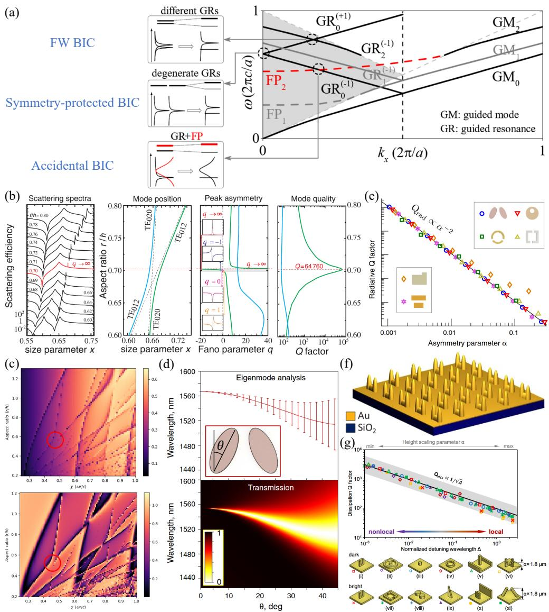

BICs in metasurfaces. (a) Schematic of the FW origins of three types of BICs. GR: guided mode resonance. FP, FP resonance; GM, guided mode (b) First column: scattering spectra of nanorods with varying aspect ratios $r / h$ , where $r$ and $h$ are the radius and height of the nanorod, respectively. The permittivity of the nanorods is 80. The size parameter $\chi = \omega r / c_0$ represents the normalized frequency. Second column: resonant frequencies of the Mie-like mode $\mathrm{TE}_{020}$ and the FP-like mode $\mathrm{TE}_{012}$ in the avoided crossing regime. Cyan and green curves correspond to the lower- and higher-frequency modes, respectively (consistent throughout). Third column: Fano asymmetry parameters $q$ for both modes. Insets: scattering spectra of nanorods with $r / h = 0.703$ ( $q \to \infty$ ), $r / h = 0.700$ ( $q \to -1$ ), $r / h = 0.699$ ( $q \to 0$ ), and $r / h = 0.698$ ( $q \to 1$ ). Fourth column: Q-factors of both modes. (c) Top: simulated transmittance spectrum of a single nanorod with a permittivity of 80 as a function of $\chi$ and $r / h$ . Bottom: simulated transmittance spectrum of a nanorod array arranged in a square lattice using the same nanorod as in the top panel. The red circle indicates the positions of the quasi-FW BICs. (d) Simulated eigenmode and transmittance spectra as functions of wavelength and rotation angle $\theta$ . Error bars indicate the inverse radiation lifetime of each mode. Inset: schematic of the asymmetric metasurface unit. (e) Simulated Q-factors as a function of the asymmetry parameter $\alpha$ (log–log scale) for various symmetry-broken metasurface unit designs. (f) Schematic of a metallic metasurface supporting a (continued)

(continued) quasi-BIC. (g) Simulated Q-factors as a function of the normalized detuning wavelength $\Delta$ (log–log scale) for various metallic metasurface unit designs supporting bright and dark localized surface plasmon resonances. Here, $\alpha$ denotes the scaling factor for the meta-atom height, where $\alpha > 1$ indicates an increase and $\alpha < 1$ a decrease. The parameter $\Delta = (\lambda - a)/a$ represents the normalized detuning, with $\lambda$ being the resonance wavelength and a the lattice constant. (a) Adapted with permission from Hu et al., Optica 9, 1353–1361 (2022) [234]. Copyright © 2022 Optica Publishing Group. (b) Adapted with permission from Rybin et al., Phys. Rev. Lett. 119, 243901 (2017) [235]. Copyright © 2017 American Physical Society. (d) and (e) Adapted with permission from Koshelev et al., Phys. Rev. Lett. 121, 193903 (2018) [88]. Copyright © 2018 American Physical Society. (f) Adapted with permission from Liang et al., Nano Lett. 20, 6351–6356 (2020) [236]. Copyright © 2020 American Chemical Society. (g) Adapted with permission from Liang et al., Phys. Rev. Lett. 133, 053801 (2024) [237]. Copyright © 2024 American Physical Society.

then they are symmetry-incompatible with the external plane waves. As a result, such modes cannot couple to free space and thus form symmetry-protected BICs. As shown in Fig. 9(a), the FW origin of symmetry-protected BIC can be attributed to the coupling between two degenerate guided mode resonances.

(3) The accidental BIC located at the off- $\Gamma$ point appears to originate from a single resonant mode. However, as shown in Fig. 9(a), it actually results from the coupling between a guided mode resonance and an FP resonance. The large deviation from the avoided crossing point compared to the coupling strength makes it appear as if it arises from a single mode.

Pure BICs with infinite Q-factors exist only as a mathematical ideal. In practice, factors such as material absorption, finite sample size, the presence of a substrate (which introduces additional radiation channels due to out-of-plane asymmetry), and fabrication imperfections (e.g., surface roughness, structural disorder, and non-uniformity) cause BICs to transform into quasi-BICs with finite but still extremely high Q-factors. These quasi-BICs offer a practical route to achieving ultra-high-Q resonant modes.

In the field of metasurfaces, both quasi-FW BICs and quasi-symmetry-protected BICs have been demonstrated. Here, we extend the concept of FW BICs to refer broadly to BICs that arise from destructive interference between radiation from two lattice modes—either local or nonlocal (not limited to guided mode resonances)—and are realized through fine-tuning of system parameters. Currently, quasi-BIC metasurfaces have already achieved many novel applications, such as molecular fingerprint detection $[238,239]$ , thermal regulation $[240]$ , narrowband optical devices $[207,209]$ , wavefront selection $[241]$ , and special structural color $[242]$ .

In the following, we discuss these two types of quasi-BICs in metasurfaces in greater detail.

(I) Quasi-FW BICs. In 2017, Rybin et al. [235] investigated the formation of quasi-FW BICs in isolated subwavelength dielectric resonators with high refractive index. In such nanorods, when two eigenmodes with different polarizations—associated with a Mie mode and an FP mode—strongly interact near the avoided crossing regime, they interfere predominantly outside the resonator, as they are nearly orthogonal within it. This external interference results in the formation of a quasi-BIC. As shown in the first column of Fig. 9(b), the scattering spectra of nanorods with varying aspect ratios $r / h$ reveal the evolution of two resonant modes: a Mie-like mode $\mathrm{TE}_{020}$ and an FP-like mode $\mathrm{TE}_{012}$ . The second column shows that their resonant frequencies

exhibit an avoided crossing behavior. In the third and fourth columns, it is evident that for the higher-frequency mode, the Fano asymmetry parameter $q$ approaches $\infty$ and the Q-factor reaches a maximum value of 64,760 when $r / h \to 0.703$ , confirming the formation of a quasi-BIC. Further simulations showed that for realistic Si resonators, Q-factors on the order of $\sim 200$ can be achieved. In 2019, Bogdanov et al. [243] experimentally confirmed the existence of quasi-FW BICs in a single resonator at microwave frequencies. In 2020, Koshelev et al. [244] utilized this mechanism to enhance nonlinear optical effects, which will be discussed in detail in Subsection 2.2.4.

Notably, quasi-FW BICs in isolated resonators can be readily extended to periodic meta-atom arrays. As shown in Fig. 9(c), the transmittance spectra of a single nanorod and a nanorod array exhibit similar resonance features—transforming from isolated resonant modes into localized lattice modes—indicating that the quasi-FW BIC formed in a single resonator can be preserved in the array configuration.

(II) Quasi-symmetry-protected BICs. Homogeneous metasurfaces composed of metallic or dielectric meta-atoms with broken in-plane symmetry can be used to realize quasi-symmetry-protected BICs $[88,238,245–249]$ . In this way, Q-factors on the order of several hundred have been experimentally achieved.

Taking the asymmetric metasurface shown in the inset of Fig. 9(d) as an example, in-plane symmetry is broken by introducing a rotation angle $\theta$ between the two meta-atoms. The ideal (lossless and infinitely extended) metasurface with $\theta = 0$ supports a symmetry-protected BIC at normal incidence. As shown in Fig. 9(d), breaking the inversion symmetry of the unit cell transforms this BIC into a quasi-BIC with a finite Q-factor.

The dependence of the Q-factor on the asymmetry parameter $\alpha$ for metasurfaces with various broken-symmetry unit designs is shown in Fig. 9(e). Here, $\alpha$ quantifies the degree of in-plane asymmetry in the metasurface unit. For example, in the metasurface unit shown in the inset of Fig. 9(d), $\alpha = \sin \theta$ . It can be observed that the Q-factor of the quasi-BIC scales inversely with $\alpha^{2}$ for small $\alpha$ values [88].

For metallic metasurfaces, realizing quasi-BICs is more challenging due to the strong dissipative losses inherent to plasmonic materials. In 2020, Liang et al. [236] experimentally demonstrated a quasi-symmetry-protected BIC in a metallic metasurface consisting of vertically oriented double-pillar meta-atoms coated with a thin layer of Au, as shown in Fig. 9(f). A Q-factor of approximately 17 was achieved in the fabricated sample. In 2024, Liang et al. [237] proposed that higher Q-factors in metallic metasurfaces can be achieved by engineering the resonant modes to transition from local to nonlocal regimes through reduction of the meta-atom height, as illustrated in Fig. 9(g).

The design workflow for quasi-symmetry-protected BIC metasurfaces is available in our open-source code repository [73].

High-Q-factor wavefront manipulation. Wavefront manipulation is a key application of inhomogeneous metasurfaces, typically realized through the spatial arrangement of low-Q-factor meta-atoms with varying geometries and orientations. However, in the case of high-Q-factor homogeneous metasurfaces that support nonlocal resonant modes, the optical response becomes highly sensitive to variations among adjacent meta-atoms. This sensitivity makes it challenging to implement high-Q-factor wavefront manipulation. Such metasurfaces are referred to as diffractive nonlocal metasurfaces by Overvig and Alù [196]. In this scenario, $\tilde{\mathbf{H}}\left(\vec{k}_{\mathrm{T}}\right)\neq\mathbf{I}$ [which violates Eq. (76)], and $\mathbf{T}\left(x^{\prime},y^{\prime}\right)\neq\mathbf{I}$ [which violates Eq. (78)], meaning that neither Eq. (75) nor Eq. (79) can fully describe the system. Therefore, the generalized formulation given in Eq. (73) should be adopted to completely characterize these metasurfaces.

(I) High-Q-factor metagratings based on guided mode resonances. In 2020, Lawrence et al. [222] demonstrated a high-Q-factor metagrating based on guided mode resonances. As shown in the first column of Fig. 10(a), the metagrating consists of 600 nm-tall Si bars patterned atop a sapphire substrate, incorporating periodic notches with a period $\Lambda_{p}$ and a depth d. The Si bars simultaneously function as scatterers that modulate the incident free-space light and as the effective waveguiding layer. The periodic notches provide the necessary spatial momentum shift to couple guided modes into radiative diffraction orders, thereby forming guided mode resonances. As shown in the second column of Fig. 10(a), for a sample with $\Lambda_{p} = 570$ nm and d = 100 nm, the measured diffraction spectra exhibit sharp resonance peaks, corresponding to a Q-factor of 1500. As illustrated in the third and fourth columns, decreasing the notch depth from 150 nm to 50 nm further enhances the Q-factor to 2500. Based on this method, a beam splitter directing light into the $\pm1$ st diffraction orders with a Q-factor of 1088 was also experimentally demonstrated.

In 2021, Song et al. [208] adopted a similar design to realize a high-Q-factor meta-grating capable of decoupling optical functionalities across wavelengths. Their device enables broadband transmission in the visible range, while simultaneously redirecting near-infrared light at 870 nm into the +1st diffraction order, as shown in Fig. 10(b). This functionality has potential applications in eye-tracking systems for wearable displays.

The same principle can be extended to metagratings with various structural configurations [250,251].

(II) High-Q-factor metagratings based on quasi-BICs and geometric phase. In 2020, Overvig et al. [207,252] proposed a design strategy that integrates the geometric phase with quasi-symmetry-protected BICs to realize high-Q-factor wavefront manipulation. As illustrated in the inset of Fig. 10(c), the metasurface unit consists of a pair of orthogonally placed cylinders with a structural perturbation $\delta$ , and the meta-atoms are rotated by an angle $\alpha$ . The perturbation $\delta$ breaks the in-plane symmetry of the unit cell, resulting in the emergence of a quasi-BIC. As shown in Fig. 10(c), the Q-factor can be tuned by varying $\delta$ , while rotating the meta-atoms introduces a geometric phase approximately equal to $4\alpha$ . Arbitrary wavefront shaping can thus be achieved by spatially varying the rotation angles of the meta-atoms. However, introducing meta-atoms with different rotation angles degrades the nonlocal resonant mode, thereby reducing the Q-factor of the metasurface.

This design concept was experimentally demonstrated in 2022 by Malek et al. [209]. As shown in the left panel of Fig. 10(d), a wavelength-selective metalens was realized using a metasurface unit similar to the one depicted in the inset of Fig. 10(c). In this device, the wavelength selectivity is governed by the quasi-BIC, while the geometric phase enables wavefront shaping. As shown in the right panel of Fig. 10(d), the metasurface unit exhibits a geometric phase that approximates $4\alpha$ . The middle panel presents the measured transmission and focusing performance of the fabricated metalens, which features an NA of 0.2 and a diameter of $800~{\mu\mathrm{m}}$ . The metalens operates at a resonance wavelength centered at $1590~\mathrm{nm}$ with a Q-factor of approximately 86.

This design approach can be extended to other high-Q-factor metasurfaces with alternative structural configurations $[211,253]$ .

# 2.2.4. From Linear to Nonlinear Metasurfaces

By integrating the fields of metasurfaces and nonlinear optics, nonlinear metasurfaces incorporate nonlinear materials into their structural design, enabling significant applications in enhancing nonlinear effects, controlling polarization in nonlinear processes,

Figure 10  
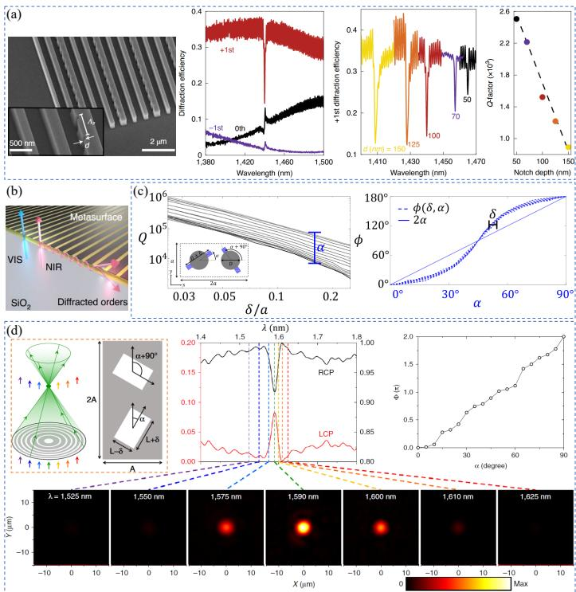

Wavefront manipulation using high-Q-factor metasurfaces. (a) First column: angled-view SEM of a guided mode resonance metagrating, with an enlarged inset showing structural details. The perturbation period $\Lambda_{p}$ and notch depth d are indicated. Second column: measured diffraction spectra of a sample with $\Lambda_{p}=570$ nm and d=100 nm. Third column: +1st-order diffraction spectra of metagratings with notch depth d decreasing from 150 nm to 50 nm. Fourth column: extracted Q-factors from the measured spectra shown in the third column. (b) Schematic of a guided mode resonance metasurface designed for broadband transmission in the visible range and narrowband redirection of near-infrared light into the +1st diffraction order. (c) Left: simulated Q-factor as a function of the normalized perturbation $\delta/a$ for metasurface units with different rotation angles $\alpha$ . Inset: schematic of the metasurface unit characterized by the rotation angle $\alpha$ and perturbation $\delta$ . Right: simulated geometric phase as a function of $\alpha$ for metasurface units with varying perturbations $\delta$ . (d) Left: schematics of the wavelength-selective metasurface and its unit cell, characterized by a rotation angle $\alpha$ and a perturbation $\delta$ . Middle: measured transmittance spectra of the metalens for light with converted and unconverted handedness (top), and measured transverse intensity distributions on the focal plane at different operating wavelengths (bottom). Right: simulated geometric phase of the metasurface unit as a function of the rotation angle $\alpha$ . (a) Adapted with permission from Lawrence et al., Nat. Nanotechnol., 15, 956–961 (2020) [222]. Copyright © 2020 Springer Nature. (b) Adapted with permission from Song et al., Nat. Nanotechnol., 16, 1224–1230 (2021) [208]. Copyright © 2021 Springer Nature. (c) Adapted with permission from Overvig et al., Phys. Rev. Lett., 125, 017402 (2020) [207]. Copyright © 2020 American Physical Society. (d) Adapted from [209] under a Creative Commons license.

and manipulating the wavefronts of nonlinear light [80,254-258]. Here, we present an overview of the physical mechanisms and design principles of nonlinear metasurfaces. Applications of nonlinear metasurfaces in quantum photonics and active metasurfaces are discussed in Subsections 6.1.2 and 8.5, respectively.

Enhancement of nonlinear effects based on resonances. Traditional nonlinear optics relies on bulk nonlinear crystals such as lithium niobate and potassium dihydrogen phosphate (KDP), where nonlinear processes must satisfy energy conservation and momentum conservation (phase matching) conditions. For metasurfaces, the momentum conservation condition can be relaxed to some extent (for a detailed analysis of the spontaneous parametric down-conversion process, see Subsection 6.1.2). However, achieving efficient nonlinear effects at the nanoscale is highly challenging, as the nonlinear optical interaction length is usually subwavelength. To improve the conversion efficiency of nonlinear processes, resonances with high Q-factors can be introduced to confine the optical field to subwavelength scales, enhancing the local optical power density (since the intensity of parametric processes scales with the fourth or sixth power of the fundamental field strength $[256]$ ) and extending the effective interaction time between photons and the nonlinear material.

In 2014, Shcherbakov et al. [259] investigated the impact of Mie resonances in Si metasurfaces on third-harmonic generation (THG). As shown in Fig. 11(a), a two-orders-of-magnitude enhancement of the harmonic intensity relative to unstructured bulk Si was experimentally achieved. Notably, the two peaks in the THG spectrum coincide with the spectral positions of the ED and MD resonances of the metasurface, demonstrating the influence of resonant modes on nonlinear conversion efficiency.

To further improve the conversion efficiency, the following strategies can be employed.

(I) Designing the metasurface to resonate at both the pump and signal light frequencies. In 2015, Celebrano et al. [260] designed a Au nanoantenna array with two surface plasmon resonances, whose resonant wavelengths corresponded to the pump and signal light wavelengths, respectively, as shown in Fig. 11(b). Experimentally, a conversion efficiency $P_{\mathrm{signal}}/P_{\mathrm{pump}}^{2}$ of $\sim5\times10^{-10}~W^{-1}$ for second harmonic generation (SHG) was achieved, resulting in a second harmonic photon yield of more than $3\times10^{6}$ photons per second.

(II) Utilizing materials with high nonlinear coefficients. In 2014, Lee et al. [261] employed quantum-engineering electronic intersubband transitions in n-doped multi-quantum-well (MQW) semiconductor heterostructures to achieve a large nonlinear optical response. They combined the MQW layered substrates with plasmonic metasurfaces, as shown in Fig. 11(c), with resonances overlapping at both the pump and second harmonic wavelengths. Experimentally, they realized a 400-nm-thick metasurface with a nonlinear susceptibility greater than $5 \times 10^{4}$ picometers per volt and a conversion efficiency ( $P_{signal}/P_{pump}$ ) of $\sim2 \times 10^{-6}$ using a pump intensity of $15  kW \cdot cm^{-2}$ for SHG at a pump wavelength of $\sim8  \mu m$ .

(III) Introducing nonlocal modes with higher Q-factors. In 2020, Koshelev et al. [244] experimentally demonstrated that the quasi-BIC can effectively enhance nonlinear effects, increasing SHG efficiency with a directly measured conversion efficiency ( $P_{signal}/P_{pump}^{2}$ ) of $\sim1.3\times10^{-6}W^{-1}$ , as shown in Figs. 11(d) and 11(e). The isolated AlGaAs nanoantenna structure was carefully designed to exhibit a high-order Mie mode at the second harmonic wavelength with a Q-factor of 65 and a quasi-FW BIC with a measured Q-factor of $188\pm5$ at the pump wavelength. Additionally, a cylindrical vector beam with azimuthal polarization was used as the illumination light to match the spatial profile of the pump with the distribution of the excited mode, maximizing SHG efficiency.

Rotational symmetry selection rules for metasurfaces with circularly polarized incidence. Under the incidence of circularly polarized pump light, the nonlinear process of harmonic generation in nonlinear bulk crystals and metasurfaces follows the

Figure 11  
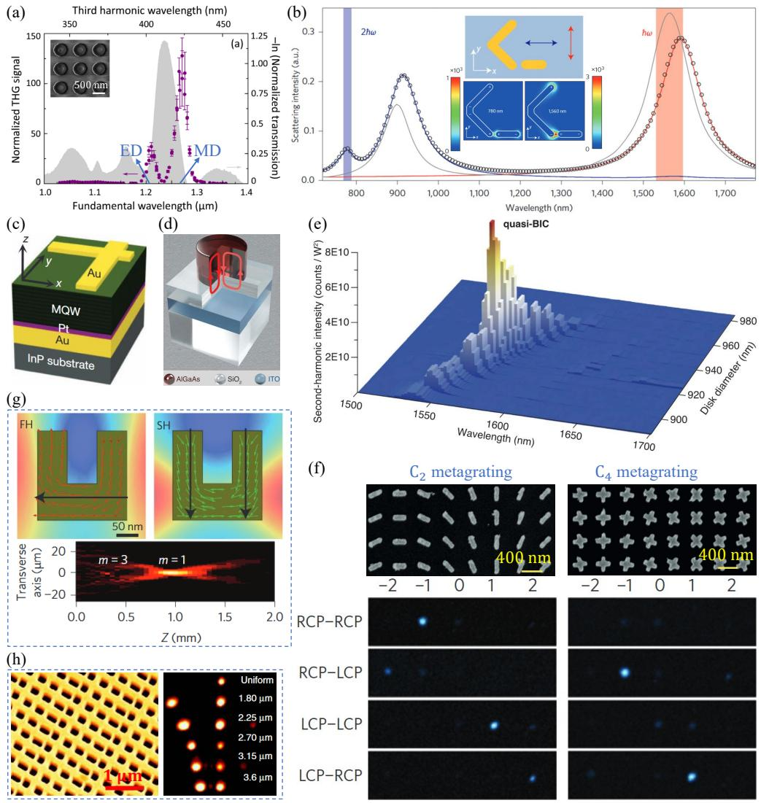

Nonlinear metasurfaces. (a) THG spectrum (normalized over the spectrum of the substrate, purple dots) of the Si nanodisk array. The negative logarithm of the normalized transmittance spectrum of the metasurface is given with the gray area, indicating a resonance at 1.24 $\mu$ m. Inset: SEM of the meta-atoms. The spectral positions of ED and MD resonances are marked by blue arrows. (b) Simulated scattering spectra for unpolarized illumination of the isolated V-shaped antenna (gray line) and of the coupled antenna (open black circles). Blue and red lines represent the scattering spectra of the coupled antenna when illuminated with light polarization parallel and orthogonal to the long axis of the nanorod, respectively. Red and blue stripes indicate the pump and signal light bands, respectively. Top inset: schematic of meta-atom. Bottom inset: electric field intensity distributions of the meta-atom at wavelengths of 780 nm and 1560 nm. (c) Schematic of the plasmonic metasurface unit cell for SHG. (d) Schematic of an individual nano-resonator for SHG. (e) Measured SHG intensity (normalized on the square of the pump power) as a function of the pump wavelength and meta-atom diameter for an azimuthally polarized beam. (f) Top: SEMs of $C_{2}$ and $C_{4}$ metagratings. Bottom: Measured diffraction pattern of the THG signals from the $C_{2}$ and $C_{4}$ metagratings for circular polarization states of the fundamental and THG waves. (g) Top: simulated fundamental harmonic (FH) surface currents and generated second harmonic (SH) currents. Black arrows indicate polarization of the FH beam, the average polarization of the SH currents, and emitted radiation. The color (continued)

(continued) scale shows the near-field radiation 100 nm from the SRRs. Bottom: experimental transverse focusing of SH by the nonlinear Fresnel zone plate. m denotes the focusing order. (h) Left: SEM of a metagrating. Right: CCD images for the zeroth and first diffraction orders for metagratings with different periods for $2\pi$ phase change. (a) Adapted with permission from Shcherbakov et al., Nano Lett. 14, 6488–6492 (2014) [259]. Copyright © 2014 American Chemical Society. (b) Adapted with permission from Celebrano et al., Nat. Nanotechnol. 10, 412–417 (2015) [260]. Copyright © 2015 Springer Nature. (c) Reprinted with permission from Lee et al., Nature 511, 65–69 (2014) [261]. Copyright © 2014 Springer Nature. (d) and (e) Adapted with permission from Koshelev et al., Science 367, 288–292 (2020) [244]. Copyright © 2020 American Association for the Advancement of Science. (f) Adapted with permission from Li et al., Nat. Mater. 14, 607–612 (2015) [262]. Copyright © 2015 Springer Nature. (g) Adapted with permission from Segal et al., Nat. Photonics 9, 180–184 (2015) [263]. Copyright © 2015 Springer Nature. (h) Adapted from [264] under a Creative Commons license.

selection rules [265,266], which are rooted in the conservation of angular momentum. Paraxial optical beams can carry three types of angular momentum: (i) spin angular momentum, (ii) intrinsic orbital angular momentum (often simply referred to as orbital angular momentum), and (iii) external orbital angular momentum for beams propagating at a distance from the coordinate origin [267]. The process we consider here involves only spin angular momentum. For the $M$ -th order harmonic generation process, the total angular momentum of the input photons is given by

$$
S _ {\mathrm{i}} = M \sigma_ {\mathrm{i}} \hbar , \tag {91}
$$

where $\sigma_{i}=\pm1$ corresponds to the circular polarization state of the incident light (LCP/RCP). The total angular momentum of the output photon is

$$
S _ {\mathrm{o}} = \sigma_ {\mathrm{o}} \hbar , \tag {92}
$$

where $\sigma_{o}=\pm1$ corresponds to the cases when the output photon is LCP and RCP, respectively. Assuming the metasurface has K-fold rotational symmetry (where K is an integer greater than or equal to 1), by the law of conservation of angular momentum, we have

$$
S _ {\mathrm{o}} - S _ {\mathrm{i}} = N K \hbar , \tag {93}
$$

where $N$ is an arbitrary integer. Substituting Eqs. (91) and (92) into Eq. (93), we obtain

$$
M \sigma_ {\mathrm{i}} - \sigma_ {\mathrm{o}} = N K. \tag {94}
$$

Introducing $\tilde{\sigma}=\sigma_{0}/\sigma_{i}$ ( $\tilde{\sigma}=\pm1$ indicates that the circular polarization state of the output photon is the same or opposite to that of the incident photons, respectively), Eq. (94) can be rewritten as

$$
M - \tilde {\sigma} = N K, \tag {95}
$$

which imposes constraints on the polarization characteristics of nonlinear bulk crystals and metasurfaces in harmonic generation. For example, for a metasurface with threefold rotational symmetry $(K = 3)$ , when generating second harmonics $(M = 2)$ , we have

$$
2 - \tilde {\sigma} = 3 N. \tag {96}
$$

We find that for $\tilde{\sigma} = +1$ , this equation cannot hold for any integer value of $N$ , meaning it is not possible to generate a second harmonic with the same circular polarization

Table 1. Geometric Phase and Selection Rules for Nonlinear Harmonic Generation $^{a}$

<table><tr><td>Harmonic orderM</td><td>Sign of $\tilde{\sigma}$ </td><td> $\mathbf{K=1}$ </td><td> $\mathbf{K=2}$ </td><td> $\mathbf{K=3}$ </td><td> $\mathbf{K=4}$ </td></tr><tr><td rowspan="2">1</td><td>+</td><td>0</td><td>0</td><td>0</td><td>0</td></tr><tr><td>-</td><td> $-2\sigma_{\mathrm{i}}\theta$ </td><td> $-2\sigma_{\mathrm{i}}\theta$ </td><td>×</td><td>×</td></tr><tr><td rowspan="2">2</td><td>+</td><td> $+\sigma_{\mathrm{i}}\theta$ </td><td>×</td><td>×</td><td>×</td></tr><tr><td>-</td><td> $-3\sigma_{\mathrm{i}}\theta$ </td><td>×</td><td> $-3\sigma_{\mathrm{i}}\theta$ </td><td>×</td></tr><tr><td rowspan="2">3</td><td>+</td><td> $+2\sigma_{\mathrm{i}}\theta$ </td><td> $+2\theta\sigma_{\mathrm{i}}$ </td><td>×</td><td>×</td></tr><tr><td>-</td><td> $-4\sigma_{\mathrm{i}}\theta$ </td><td> $-4\sigma_{\mathrm{i}}\theta$ </td><td>×</td><td> $-4\sigma_{\mathrm{i}}\theta$ </td></tr><tr><td rowspan="2">4</td><td>+</td><td> $+3\sigma_{\mathrm{i}}\theta$ </td><td>×</td><td> $+3\sigma_{\mathrm{i}}\theta$ </td><td>×</td></tr><tr><td>-</td><td> $-5\sigma_{\mathrm{i}}\theta$ </td><td>×</td><td>×</td><td>×</td></tr><tr><td rowspan="2">5</td><td>+</td><td> $+4\sigma_{\mathrm{i}}\theta$ </td><td> $+4\sigma_{\mathrm{i}}\theta$ </td><td>×</td><td> $+4\sigma_{\mathrm{i}}\theta$ </td></tr><tr><td>-</td><td> $-6\sigma_{\mathrm{i}}\theta$ </td><td> $-6\sigma_{\mathrm{i}}\theta$ </td><td> $-6\sigma_{\mathrm{i}}\theta$ </td><td>×</td></tr></table>

$^{a}\tilde{\sigma}=\pm1$ indicates whether the circular polarization state of the output light is the same as $(+1)$ or opposite to $(-1)$ that of the input light. $\sigma_{i}=\pm1$ represents the circular polarization state of the incident light, where +1 corresponds to LCP and -1 to RCP. The symbol $\times$ denotes cases prohibited by the selection rules. K represents the order of rotational symmetry of the metasurface.

state as the incident light. Instead, there is no such restriction for $\tilde{\sigma} = -1$ . Similarly, when generating third harmonics, we have

$$
3 - \tilde {\sigma} = 3 N. \tag {97}
$$

For $\tilde{\sigma}=\pm1$ , this equation cannot hold for any integer value of N, meaning that the generation of third harmonics is prohibited. Based on this, we can derive all the prohibited cases shown in Table 1.

In 2014, Konishi et al. [268] and Chen et al. [269] independently demonstrated the above selection rules experimentally in nonlinear metasurfaces with high-fold rotational symmetries.

In fact, Eq. (95) can also be applied to linear optics, representing the constraints on the polarization characteristics of K-fold rotationally symmetric metasurfaces due to angular momentum conservation. In this case, M = 1, and Eq. (95) becomes

$$
1 - \tilde {\sigma} = N K. \tag {98}
$$

For the case of $\tilde{\sigma}=+1$ , this equation holds for any value of K. Interestingly, for the case of $\tilde{\sigma}=-1$ , this equation only holds for K=1 or K=2, and does not hold for $K\geq3$ , meaning that circular polarization conversion is impossible for metasurfaces with rotational symmetries of order 3 or higher.

Finally, we further discuss the rotational symmetry of metasurfaces. In fact, the rotational symmetry of a metasurface comes from two aspects: the rotational symmetry of the meta-atoms and the rotational symmetry of the lattice. A square lattice has $C_{4}$ rotational symmetry, while a hexagonal lattice has $C_{6}$ rotational symmetry. When the rotational symmetries of the meta-atoms and the lattice are incompatible (e.g., a $C_{3}$ meta-atom array on a square lattice), in most cases, the rotational symmetry of the metasurface mainly depends on the symmetry of the meta-atoms. However, with careful structural design, the influence of the lattice cannot be ignored in certain cases [153].

Wavefront manipulation for nonlinear waves. Compared to linear metasurfaces, the phase modulation mechanism of nonlinear metasurfaces differs in some ways.

(I) Nonlinear geometric phase modulation mechanism. The geometric phase in the nonlinear regime can be understood through a simple coordinate transformation process [262]. For the generation of M-order harmonics, the geometric phase is given by

$$
\phi_ {\text {nonlinear geometric}} = (M - \tilde {\sigma}) \sigma_ {\mathrm{i}} \theta , \tag {99}
$$

where $\theta$ is the rotation angle of the meta-atom. Based on Eq. (99), we can obtain the geometric phase modulation for scenarios in Table 1. Taking the $C_{3}$ metasurface used for SHG as an example, when the incident circular polarization state of the pump light is $\sigma_{i}$ , the circular polarization state of the output fundamental harmonic remains unchanged and is not modulated in phase by the rotation of the meta-atom. Instead, the output second harmonic signal light has a circular polarization state of $\sigma_{o} = -\sigma_{i}$ , and it is subject to a geometric phase modulation of $-3\sigma_{i}\theta$ .

We note that linear geometric phase requires the metasurface to have rotational symmetries of order lower than 3 to enable polarization conversion, whereas no such limitation exists for nonlinear geometric phase.

In 2015, Li et al. [262] experimentally demonstrated Au metagratings with $C_{2}$ and $C_{4}$ symmetries based on nonlinear geometric phase, where their THG diffraction patterns shown in Fig. 11(f) matched the phase modulation effects predicted by Table 1. In the same year, Tymchenko et al. [270] experimentally verified the nonlinear geometric phase in SHG metasurfaces.

(II) Mimicking patterned poling of nonlinear crystals, in 2015, Segal et al. [263] achieved a binary phase shift modulation (0 or $\pi$ ) for SHG using Au SRR metasurfaces. As shown in the top panel of Fig. 11(g), when a fundamental harmonic beam is polarized along the base of the SRR, the resulting second harmonic currents are predominantly cross-polarized relative to the incident beam and exhibit asymmetry with respect to the SRR base. As a result, performing a mirror inversion of the SRR across its base has little impact on the fundamental harmonic beam but induces a $\pi$ phase shift in the generated second harmonic wave. Based on this principle, a nonlinear binary-phase Fresnel zone plate with a focal length of 1 mm was experimentally demonstrated, as shown in the bottom panel of Fig. 11(g).

(III) Resonance and propagation phase modulation mechanisms. Using nonlinear full-wave simulations (such as nonlinear FDTD $[264,271]$ and FEM $[272]$ ), the forward design method for linear metasurfaces based on resonant and propagation phases can be extended to the design of nonlinear metasurfaces. For example, in 2016, Almeida et al. $[264]$ constructed a database consisting of meta-atoms with rectangular holes of different sizes. Building on this, they experimentally demonstrated a nonlinear meta-grating, as shown in Fig. 11(h), and a nonlinear metalens with focal lengths of several microns for a four-wave mixing beam at a wavelength of 633 nm.

# 2.2.5. From Achiral to Chiral Metasurfaces

Chirality, a fundamental property of nature, refers to the geometric characteristic of an object that lacks mirror symmetry and cannot be superimposed onto its mirror image by any combination of rotations and translations. Although light itself has no intrinsic geometry and is therefore not chiral in the conventional sense, its chirality can be characterized through specific parameters. Specifically, for LCP or RCP light, chirality arises from the helical rotation of the electric and magnetic field vectors as the wave propagates $[273]$ . Chiral materials respond differently to LCP and RCP light, giving

rise to a range of chiroptical phenomena. These include differences in transmission, reflection, or absorption between the two polarizations—commonly referred to as circular dichroism (CD)—as well as the rotation of the polarization plane of linearly polarized light, known as optical rotation (OR) or optical activity (OA).

Natural chiral materials typically exhibit weak optical chirality. In contrast, chiral metasurfaces, composed of meta-atoms that lack mirror symmetry, have been extensively studied for their ability to achieve strong chiral responses $[80,274–279]$ . Various types of chiral metasurfaces have been developed, based on different underlying physical mechanisms.

Taking CD in transmission as an example, consider a metasurface characterized by the transmission matrix

$$
\left[ \begin{array}{c c} \tau_ {+ +} & \tau_ {+ -} \\ \tau_ {- +} & \tau_ {- -} \end{array} \right],
$$

where $\tau_{ij}$ denotes the transmittance into polarization state i under illumination of polarization j, and the subscripts + and - represent LCP and RCP, respectively. The CD is defined as

$$
\mathrm{CD} = \frac {\tau_ {+} - \tau_ {-}}{\tau_ {+} + \tau_ {-}} = \frac {\left(\tau_ {+ +} + \tau_ {- +}\right) - \left(\tau_ {- -} + \tau_ {+ -}\right)}{\left(\tau_ {+ +} + \tau_ {- +}\right) + \left(\tau_ {- -} + \tau_ {+ -}\right)}, \tag {100}
$$

where $\tau_{\pm}$ are the total transmittance for incident LCP and RCP light, respectively. The true chirality requires that the cross-polarized transmission components $\tau_{+-}$ and $\tau_{-+}$ are negligible, indicating that LCP and RCP are the eigen-polarization states of the metasurface. In such cases, Eq. (100) simplifies to

$$
\mathrm{CD} = \frac {\tau_ {+ +} - \tau_ {- -}}{\tau_ {+ +} + \tau_ {- -}}. \tag {101}
$$

Interestingly, Eq. (100) also reveals that a large CD can be achieved through polarization conversion, specifically when there is a significant difference between the cross-polarized components $\tau_{+-}$ and $\tau_{-+}$ . This phenomenon is referred to as false chirality.

Realizing true and false chirality using metasurfaces: a Jones matrix perspective. To identify the symmetry conditions required for realizing true and false chirality in metasurfaces, we analyze their Jones matrices.

For a general metasurface, as expressed in Eq. (7), the Jones matrix takes the form

$$
\mathbf {T} = \left[ \begin{array}{l l} A & C \\ D & B \end{array} \right] = \left[ \begin{array}{l l} a _ {1} + i a _ {2} & c _ {1} + i c _ {2} \\ d _ {1} + i d _ {2} & b _ {1} + i b _ {2} \end{array} \right], \tag {102}
$$

where $a_{1}, a_{2}, b_{1}, b_{2}, c_{1}, c_{2}, d_{1}$ , and $d_{2}$ are real-valued coefficients.

Since our analysis focuses on circularly polarized light, we express T in the circular polarization basis:

$$
\mathbf {T} = \left[ \begin{array}{l l} T _ {+ +} & T _ {+ -} \\ T _ {- +} & T _ {- -} \end{array} \right] = \frac {1}{2} \left[ \begin{array}{l l} A + B + i (C - D) & A - B - i (C + D) \\ A - B + i (C + D) & A + B - i (C - D) \end{array} \right]. \tag {103}
$$

(I) True chirality arises when the cross-polarized components vanish, i.e.,

$$
A - B - i (C + D) = 0, \quad A - B + i (C + D) = 0. \tag {104}
$$

Solving these equations yields the following conditions:

$$
A - B = 0, \quad C + D = 0. \tag {105}
$$

According to Eq. (100), the CD is determined by the difference between $\tau_{+}$ and $\tau_{-}$ . Using Eqs. (103) and (105), we obtain

$$
\tau_ {+ +} - \tau_ {- -} = \left| T _ {+ +} \right| ^ {2} - \left| T _ {- -} \right| ^ {2} = 2 \left(a _ {2} c _ {1} - a _ {1} c _ {2}\right). \tag {106}
$$

This result shows that achieving nonzero CD requires

$$
A \neq 0, \quad C \neq 0. \tag {107}
$$

Equations (105) and (107) together define the fundamental criteria for realizing true chirality in metasurfaces. Based on these, we can further identify the required symmetry conditions:

(1) From Eq. (10), Eq. (105) implies that the metasurface must possess $C_N$ rotational symmetry about the $z$ -axis, where $N \geq 3$ .  
(2) From Eqs. (8) and (9), Eq. (107) further requires that the metasurface must break mirror symmetry along all spatial directions.

(II) False chirality. When Eq. (105) no longer holds, the effect of false chirality may appear. Now we consider a 2D metasurface, which usually preserves out-of-plane mirror symmetry. Our discussion below demonstrates that although such a metasurface violates the symmetry requirements for true chirality, it can still exhibit false chirality when satisfying specific symmetry conditions.

From Eq. (8), a 2D metasurface that preserves out-of-plane mirror symmetry satisfies C = D. The Jones matrix T, expressed in the circular polarization basis, can be rewritten as:

$$
\mathbf {T} = \left[ \begin{array}{c c} T _ {+ +} & T _ {+ -} \\ T _ {- +} & T _ {- -} \end{array} \right] = \frac {1}{2} \left[ \begin{array}{c c} A + B & A - B - 2 i C \\ A - B + 2 i C & A + B \end{array} \right]. \tag {108}
$$

Using Eq. (108), we obtain

$$
\tau_ {+} - \tau_ {-} = \left(\left| T _ {+ +} \right| ^ {2} + \left| T _ {- +} \right| ^ {2}\right) - \left(\left| T _ {- -} \right| ^ {2} + \left| T _ {+ -} \right| ^ {2}\right) = 2 \left(c _ {1} \left(a _ {2} - b _ {2}\right) - c _ {2} \left(a _ {1} - b _ {1}\right)\right). \tag {109}
$$

For the circular dichroism to be nonzero, the Jones matrix T must satisfy

$$
c _ {1} \left(a _ {2} - b _ {2}\right) \neq c _ {2} \left(a _ {1} - b _ {1}\right), \tag {110}
$$

which implies the following conditions:

$$
A \neq B, \tag {111}
$$

and

$$
C \neq 0. \tag {112}
$$

Equations (111) and (112) thus represent the fundamental criteria for realizing false chirality in a 2D metasurface. Based on these, the corresponding symmetry conditions are as follows:

(1) From Eq. (10), Eq. (111) requires that the metasurface exhibit only $C_1$ or $C_2$ rotational symmetry.  
(2) From Eq. (9), Eq. (112) requires that the metasurface break in-plane mirror symmetry, i.e., it must not exhibit mirror symmetry with respect to the $xOz$ or $yOz$ planes.

It is important to note that the observed chirality in practical metasurfaces may be a hybrid of both true and false chirality contributions.

In the following, we categorize chiral metasurfaces into two distinct classes: (i) 3D chiral metasurfaces, which break both in-plane and out-of-plane mirror symmetries; and (ii) 2D chiral metasurfaces, which typically preserve out-of-plane mirror symmetry under normal incidence. Compared with previous classification approaches $[274, 276–279]$ , this division provides a clearer and more physically intuitive framework for understanding the origin and mechanisms of chiroptical responses in metasurfaces.

3D chiral metasurfaces breaking both in-plane and out-of-plane mirror symmetries. To achieve true chirality, metasurfaces must break mirror symmetries along all spatial directions. This necessitates the use of 3D metasurfaces, which are typically realized through specialized fabrication techniques or multilayer architectures that explicitly break out-of-plane mirror symmetry.

(I) Low-Q-factor chiral 3D metasurfaces. In recent years, numerous metal and dielectric 3D chiral metasurfaces have been experimentally demonstrated. Representative examples include the bilayer Au nanodisk array shown in Fig. 12(a) [280]; the Ag nanodisk array with four distinct nanodisk heights, fabricated via facile hole-mask colloidal lithography, shown in Fig. 12(b) [281]; and the hexagonally arranged array of Au:Cu (80:20) nanohelices produced using nanoglancing angle deposition, shown in Fig. 12(c) [282].

A record-high CD of 0.7 and an OR of $2.67 \times 10^{5}$ deg/mm were achieved by Tanaka et al. in 2020 using a bilayer dielectric metasurface [193]. As depicted in the left panel of Fig. 12(d), the metasurface unit cell exhibits $C_{4}$ rotational symmetry, which suppresses polarization conversion between LCP and RCP light. To break the out-of-plane mirror symmetry, the two dielectric layers are rotated relative to each other about the z-axis by a fixed angle of $60^{\circ}$ . As shown in the right panel of Fig. 12(d), negligible polarization conversion is observed in transmission, and a maximum CD of 0.7 is achieved. This strong chiral response is attributed to an MD resonance located at a wavelength of 1.49 $\mu$ m, which couples selectively to RCP light. As a result, strong absorption occurs under RCP illumination, while the LCP component remains largely unaffected.

(II) Chiral quasi-BIC. In addition to chirality, another critical parameter for enhancing chiral light–matter interactions is the Q-factor of the associated optical resonance. High-Q chiral metasurfaces can be realized by exploiting chiral quasi-BICs.

To maximize optical chirality while achieving a quasi-symmetry-protected BIC, both in-plane and out-of-plane mirror symmetries must be broken. This not only enables true chirality but also transforms a BIC into a quasi-BIC that couples selectively to one circular polarization state while remaining decoupled from the other—thus forming a chiral quasi-BIC. In this manner, a chiral quasi-BIC metasurface operating in transmission mode enables selective transmission of one circular polarization, while the opposite handedness is resonantly reflected. This results in near-unity circular dichroism in transmission within a narrow spectral bandwidth $[283]$ .

Recently, a variety of 3D chiral quasi-BIC metasurface designs have been proposed and experimentally demonstrated $[283,285–290]$ , marking significant progress toward the realization of high-Q-factor chiral photonic platforms.

(i) Breaking the out-of-plane symmetry through meta-atoms with different heights.

In 2020, Gorkunov et al. [283] proposed a chiral quasi-symmetry-protected BIC metasurface, as illustrated in Fig. 12(e). The metasurface unit cell consists of four dimers

Figure 12  
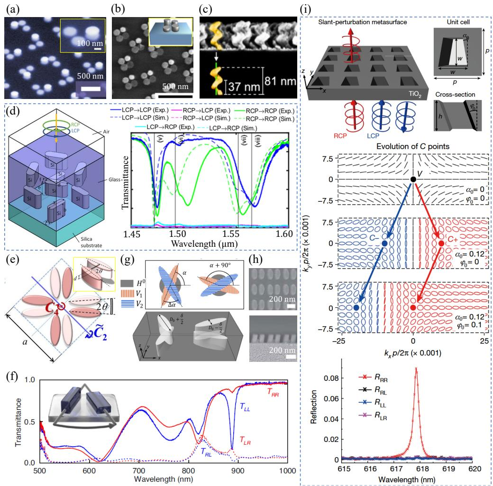

3D chiral metasurfaces breaking mirror symmetries in all directions. (a) Tilted view of SEM of chiral Au molecules. (b) SEM of chiral Ag molecules. The varying shades of gray correspond to nanodisks with heights of 40 nm (brightest), 30 nm, 20 nm, and 10 nm (darkest). (c) Side-on SEM of the chiral metasurface composed of nanohelix meta-atoms. (d) Left: schematic of the bilayer chiral metasurface unit with $C_{4}$ rotational symmetry. Right: 0th-order transmittance spectra of the bilayer chiral metasurface for circularly polarized illumination. (e) Schematic of a metasurface unit hosting chiral quasi-symmetry-protected BIC. Inset: schematic of the meta-atom dimer vertically offset by d and rotated by $\theta$ . (f) Measured spectra of LCP/RCP co- and cross-polarized transmittance of a chiral quasi-BIC metasurface. Inset: Schematic of the metasurface unit cell. (g) 2D and 3D schematics of a metasurface unit hosting chiral quasi-symmetry-protected BIC. $H^{0}$ , $V_{1}$ , and $V_{2}$ represent the unperturbed metasurface unit and the perturbed bottom and top layer metasurface units, respectively. (h) Top-view and side-view SEMs of a chiral quasi-symmetry-protected BIC metasurface. (i) Top: schematic of the slant-perturbation metasurface to realize chiral quasi-symmetry-protected BICs. Middle: evolution of C points over the spatial momentum space for metasurfaces with different $\alpha_{0}$ and $\phi_{0}$ . The black lines represent linear polarizations, and elliptical polarizations are depicted by ellipses, with red and blue colors corresponding to right- and left-handed states, respectively. Bottom: measured spectra of LCP/RCP co- and cross-polarized reflectance of the 200 $\mu$ m metasurface sample. (a) Adapted with permission from Hentschel et al., Nano Lett. 12, 2542–2547 (2012) [280]. Copyright © 2012 American Chemical Society. (continued)

(continued) (b) Adapted with permission from Ogier et al., ACS Photonics 1, 1074–1081 (2014) [281]. Copyright © 2014 American Chemical Society. (c) Reprinted from [282] under a Creative Commons license. (d) Adapted with permission from Tanaka et al., ACS Nano 14, 15926–15935 (2020) [193]. Copyright © 2020 American Chemical Society. (e) Adapted with permission from Gorkunov et al., Phys. Rev. Lett. 125, 093903 (2020) [283]. Copyright © 2020 American Physical Society. (f) Adapted from [284] under a Creative Commons license. (g) Adapted with permission from Overvig et al., Phys. Rev. Lett. 126, 073001 (2021) [285]. Copyright © 2021 American Physical Society. (h) Adapted with permission from Zhang et al., Science 377, 1215–1218 (2022) [286]. Copyright © 2022 American Association for the Advancement of Science. (i) Adapted with permission from Chen et al., Nature 613, 474–478 (2023) [287]. Copyright © 2023 Nature Springer.

of elliptical meta-atoms, which are vertically offset by a distance d and rotated by an angle $\theta$ . The overall structure exhibits $C_{4}$ rotational symmetry, allowing it to support LCP and RCP as eigen-polarization states. All mirror symmetries are broken through the combination of d and $\theta$ , and these two parameters are carefully optimized to ensure that the resulting quasi-BIC couples exclusively to one circular polarization state. The experimental realization of this design in the microwave regime was subsequently demonstrated in 2021 [288].

In the optical regime, chiral quasi-BIC metasurfaces composed of meta-atoms with varying heights can be fabricated using grayscale lithography $[289]$ or a two-step fabrication process $[284]$ .

In 2023, Kühner et al. [284] experimentally demonstrated a similar chiral quasi-symmetry-protected BIC metasurface, with a transmittance difference $(\tau_{+}-\tau_{-})$ reaching 0.7 and a Q-factor exceeding 100. As shown in the inset of Fig. 12(f), compared with the structure in Fig. 12(e), this metasurface discards the $C_{4}$ symmetry to simplify the structure, which reduces the true chirality and induces a small false chiral response at the resonant wavelength, as depicted in Fig. 12(f).

(ii) Breaking the out-of-plane symmetry through bilayer structures. Evolved from the quasi-BIC metasurface depicted in Figs. 10(c) and 10(d), in 2021, Overvig et al. [285] proposed a bilayer metasurface supporting a chiral quasi-symmetry-protected BIC, as shown in Fig. 12(g). In this design, the bottom and top layers are engineered to couple to linearly polarized light oriented at angles of approximately $2\alpha$ and $2(\alpha + \Delta\alpha)$ , respectively. By tuning the parameters $\alpha$ and $\Delta\alpha$ , the eigen-polarizations of the resulting quasi-BIC can be continuously controlled, enabling the realization of arbitrary elliptical dichroism.

(iii) Breaking the out-of-plane symmetry through slant meta-atoms. In 2022, Zhang et al. [286] experimentally demonstrated chiral emission and lasing using a tilted $TiO_{2}$ metasurface operating at optical frequencies, as shown in Fig. 12(h). This structure closely resembles those shown in Figs. 10(c) and 10(d), but it features a tilting angle introduced via slanted reactive ion etching, which effectively breaks the out-of-plane mirror symmetry.

In 2023, Chen et al. [287] achieved a chiral quasi-BIC with a CD of 0.93 and a Q-factor exceeding 2663 in the visible spectrum. As shown in the top panel of Fig. 12(i), the metasurface consists of a square hole array incorporating both an in-plane deformation angle $\alpha_{0}$ and an out-of-plane slant angle $\phi_{0}$ . The evolution of the eigen-polarization states in momentum space as a function of the geometric perturbation parameters $\alpha_{0}$ and $\phi_{0}$ is illustrated in the middle panel of Fig. 12(i). When a nonzero in-plane de-

formation angle $\alpha_{0}$ is introduced, the original integer-charged V point at the $\Gamma$ point splits into a pair of half-charged C points, denoted $C_{+}$ and $C_{-}$ , symmetrically positioned on either side of the $\Gamma$ point. Upon introducing a nonzero out-of-plane slant angle $\phi_{0}$ , one of the C points can be shifted back to the $\Gamma$ point, thereby forming a chiral quasi-symmetry-protected BIC. As shown in the bottom panel of Fig. 12(i), the cross-polarization reflectance remains zero, indicating that the strong chiral response originates from the true chirality of the metasurface.

2D chiral metasurfaces. 2D planar metasurfaces that preserve out-of-plane mirror symmetry typically do not exhibit true structural chirality. However, they can still produce a strong CD response through false chirality arising from anisotropy-induced polarization conversion. In addition, out-of-plane symmetry can be broken either by oblique incidence or by deliberately designed 2D metasurfaces based on special meta-atom structures or guided mode resonances. These scenarios suggest that true chirality is also achievable in 2D metasurfaces under specific conditions.

(I) False chiral 2D metasurfaces based on anisotropy-induced polarization conversion. Recently, a variety of anisotropic metasurfaces that satisfy the symmetry conditions given by Eqs. (111) and (112) have been proposed to realize false chirality $[291–295]$ . For example, in 2022, Shi et al. $[293]$ experimentally demonstrated a quasi-symmetry-protected BIC-induced false chiral metasurface, achieving a Q-factor of 121 and a CD of 0.93 at optical frequencies. As shown in the left panel of Fig. 13(a), the BIC is converted into a quasi-BIC by introducing an asymmetric structural perturbation $\delta$ . As shown in the right panel of Fig. 13(a), the quasi-BIC induces strong polarization conversion from RCP to LCP light in transmission, resulting in a significant increase in $\tau_{-}$ and, consequently, an enhanced CD.

It is worth noting that, in addition to structural perturbation $\delta$ , quasi-BICs can also be realized in an unperturbed metasurface under oblique incidence. In such cases, the observed large CD arises primarily from polarization conversion and therefore still falls under the category of false chirality.

(II) True chirality of 2D metasurfaces breaking the out-of-plane symmetry. Some special meta-atom structures that preserve out-of-plane mirror symmetry can implicitly overcome the symmetry constraints imposed by the Jones matrix form of Eq. (8), such as the gammadion meta-atoms [296]. In 2018, Zhu et al. [296] experimentally demonstrated a true chiral metasurface exhibiting a CD of approximately $90\%$ at a wavelength of $540~\mathrm{nm}$ , as shown in Fig. 13(b). The gammadion meta-atom, depicted in the inset of Fig. 13(b), possesses $C_4$ rotational symmetry, ensuring the absence of polarization conversion. Notably, it follows the Jones matrix structure described in Eq. (10) with $C \neq 0$ . The true chiral response originates from electromagnetic modes excited purely within the meta-atom itself and can be further enhanced by incorporating a waveguiding layer. Due to the intrinsic chirality of the gammadion meta-atom, the effective refractive indices for LCP and RCP incidence differ, allowing only the desired circular polarization to be efficiently coupled into the guided mode resonance, thereby enhancing the chiral response of the structure.

For guided-mode resonance metasurfaces, out-of-plane symmetry can also be broken by the refractive index contrast between the substrate and the superstrate. In 2025, Li et al. [297] experimentally demonstrated a guided mode resonance metagrating with a Q-factor of 183 and a CD of 0.62. As shown in Fig. 13(c), the strong CD primarily arises from the difference in transmittance between the LCP → LCP and RCP → RCP components, rather than from false chirality induced by polarization conversion.

Figure 13  
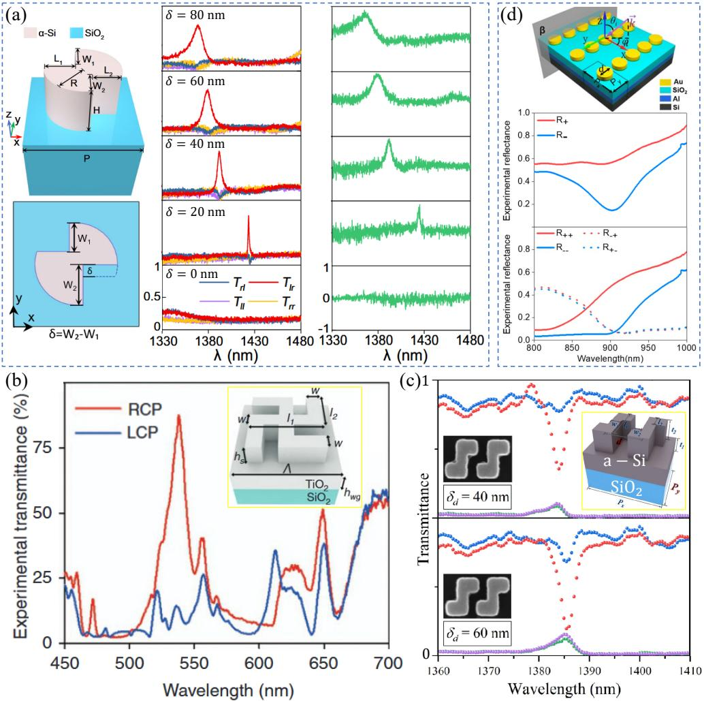

2D chiral metasurfaces. (a) Left: schematic of the chiral meta-atom supporting quasi-symmetry-protected BICs. Middle: measured spectra of the transmission Jones matrix elements for five chiral metasurface samples with varying $\delta$ . Right: corresponding transmission CD spectra for the same five samples. Here, $CD = \tau_{-} - \tau_{+}$ . (b) Experimental 0th-order transmittance spectra of the chiral metasurface under RCP (red) and LCP (blue) illuminations. Inset: schematic of the metasurface unit. Here, $\Lambda = 500$ nm, $h_{s} = 340$ nm, and $h_{wg} = 300$ nm. (c) Measured spectra of the transmission Jones matrix elements for different values of $\delta_{d}$ . Inset: schematic and SEMs of the metasurface units. Here, $\delta_{d} = P_{x}/2 - d$ , $P_{x} = 950$ nm, $P_{y} = 635$ nm, $t_{1} = 215$ nm, and $t_{2} = 275$ nm. (d) Top: schematic of a chiral MIM metasurface composed of Au meta-atoms with a diameter of 350 nm and a height of 25 nm. Here, $\theta_{i}$ denotes the incident angle, and $\phi_{i}$ is the in-plane rotation angle in the xOy plane. The periods along the x- and y-directions are 760 nm and 420 nm, respectively. Bottom: measured reflectance spectra of the metasurface under both LCP and RCP incidences with $\theta_{i} = 45^{\circ}$ and $\phi_{i} = 70^{\circ}$ . (a) Adapted from [293] under a Creative Commons license. (b) Adapted from [296] under a Creative Commons license. (c) Adapted with permission from Li et al., Nano Lett. 25, 2519–2527 (2025) [297]. Copyright © 2025 American Chemical Society. (d) Adapted with permission from Mao et al., ACS Photonics 7, 375–383 (2020) [298]. Copyright © 2020 American Chemical Society.

(III) True chirality of 2D metasurfaces under oblique incidence. The out-of-plane symmetry can be broken by obliquely incident light, providing a tunable approach for realizing true chiral optical responses using 2D metasurfaces.

In 2020, Mao et al. [298] experimentally demonstrated a chiral metasurface mirror depicted in the top panel of Fig. 13(d), which achieved a maximum CD in reflectance of 0.43 in the near-infrared region. As depicted in the bottom panel of Fig. 13(d), the pronounced chiral response arises under oblique incidence at an appropriate angle, and the observed chirality primarily originates from the difference in reflectance between the LCP → LCP and RCP → RCP components, indicating that the response is due to true chirality. Furthermore, the experiment also confirmed continuously tunable CD by varying the azimuthal angle $\phi_{i}$ at a fixed incidence angle $\theta_{i}$ .

# 2.2.6. Exceptional Points in Non-Hermitian Metasurfaces

In a broad sense, non-Hermitian systems refer to all open systems that exchange energy, matter, or information with their environment, where physical quantities can be described by non-Hermitian operators $[299–301]$ . Traditional quantum mechanics requires the Hamiltonian to be Hermitian to ensure real eigenvalues. However, although non-Hermitian systems typically possess complex eigenvalues and non-orthogonal eigenstates, a non-Hermitian Hamiltonian that satisfies parity-time (PT) symmetry can, under certain conditions, cause two or more eigenvalues to coalesce into real values, with their corresponding eigenstates also degenerate. This phenomenon is known as exceptional points.

Because the wave equations governing classical optical waves resemble the form of the Schrödinger equation, optical systems have become a crucial platform for studying non-Hermitian physics $[302]$ . Non-Hermitian optics not only provides a classical analogy for the behavior of open quantum systems but also offers new insights into the role of gain and loss in optical systems. This perspective has led to the discovery of a variety of novel and intriguing physical effects $[303–305]$ .

As a novel optical element for the flexible and efficient manipulation of optical fields, metasurfaces—inherently non-Hermitian systems—have become an ideal platform for studying non-Hermitian optics $[258]$ . The optical properties of metasurfaces can be characterized using response matrices such as the Jones matrix and the scattering matrix. For a deliberately designed metasurface, both the eigenvalues and eigenvectors of a specific response matrix (e.g., the Jones matrix) coalesce, corresponding to a particular type of exceptional point. In the following, we provide a detailed discussion of four typical types of exceptional points in metasurfaces and their corresponding electromagnetic response characteristics. Additionally, the exceptional point where two zeros coincide in complex frequency analysis will be introduced in Subsection 2.2.8.

Exceptional points of the Jones matrix and topological phase. For a single-layer meta-atom with a Jones matrix J given by Eq. (8), let its eigenvalues and eigenvectors (i.e., eigen-polarization states) be denoted as $w_{1,2}$ and $\vec{p}_{1,2}$ , respectively, satisfying

$$
\mathbf {J} \vec {p} _ {1, 2} = w _ {1, 2} \vec {p} _ {1, 2}. \tag {113}
$$

Using linear algebra, the eigenvalues can be expressed as

$$
w _ {1, 2} = \frac {1}{2} (A + B \pm \sqrt {(A - B) ^ {2} + 4 C ^ {2}}). \tag {114}
$$

The degeneracy condition for the formation of an exceptional point is $w_{1} = w_{2}$ , which leads to

$$
(A - B) ^ {2} + 4 C ^ {2} = 0, \tag {115}
$$

i.e.,

$$
A - B + 2 i C = 0, \tag {116}
$$

or

$$
A - B - 2 i C = 0. \tag {117}
$$

For the first degeneracy condition, the eigen-polarization states satisfy

$$
\vec {p} _ {1} = \vec {p} _ {2} = \frac {1}{\sqrt {2}} \left[ \begin{array}{l} 1 \\ i \end{array} \right], \tag {118}
$$

indicating that the degenerate eigen-polarization state is LCP. For the second degeneracy condition, the eigen-polarization states satisfy

$$
\vec {p} _ {1} = \vec {p} _ {2} = \frac {1}{\sqrt {2}} \left[ \begin{array}{l} 1 \\ - i \end{array} \right], \tag {119}
$$

indicating that the degenerate eigen-polarization state is RCP. By defining $\sigma = \pm1$ to represent the cases where the degenerate eigen-polarization states are LCP and RCP, respectively, the degeneracy conditions above can be unified as

$$
A - B + 2 i \sigma C = 0. \tag {120}
$$

For a meta-atom whose eigen-polarization states degenerate to LCP (RCP), the output light remains LCP (RCP) under LCP (RCP) incidence, ensuring that polarization conversion is forbidden. By applying mirror symmetry to the meta-atom geometry, the handedness of the exceptional point eigenmode can be flipped between LCP and RCP [306].

The degeneracy condition can also be directly derived from Eq. (24). From Eq. (24), setting the coefficient of the output component with the opposite circular polarization to the incident light to zero (in which case the circular polarization of the incidence is the degenerated eigen-polarization state), we once again obtain the unified degeneracy condition in Eq. (120).

In 2014, Lawrence et al. [307] experimentally demonstrated a degenerated circularly polarized state in a terahertz metasurface. In 2020, Park et al. [308] observed the same phenomenon using a different terahertz metasurface design. In 2021, Song et al. [133] proposed achieving such polarization exceptional points in the visible using the MIM metasurface unit shown in Fig. 14(a). By performing full-wave simulations to compute the Jones matrix of the meta-atom, the eigenvalues and eigenvectors were further obtained. As shown in Figs. 14(b) and 14(c), by sweeping the geometric parameters $L_{1}$ and $L_{3}$ of the meta-atom, the exceptional point where both the eigenvalues and eigenvectors coalesce can be identified. As shown in Fig. 14(d), for a meta-atom at an exceptional point, the two eigen-polarization states degenerate into RCP at a specific wavelength, indicating that this exceptional point is an RCP exceptional point. Figures 14(e) and 14(f) illustrate that for an RCP-degenerate meta-atom, polarization conversion from RCP to LCP is prohibited, i.e., $r_{+-} = 0$ , where the subscript $+ -$ represents the conversion from RCP ( $\sigma = -1$ ) to LCP ( $\sigma = +1$ ). Based on this, when an RCP-degenerate meta-atom is rotated (in practice, the rotated meta-atom only approximately satisfies the exceptional point condition due to structural modifications, so $r_{+-}$ is not strictly zero), the introduced geometric phase only operates for RCP output under LCP incidence but not for LCP output under RCP incidence. This property can be applied to vectorial metasurface holography [306], color holographic displays without the issue of twin images projected by conventional geometric phase metasurfaces [309], etc.

Figure 14  
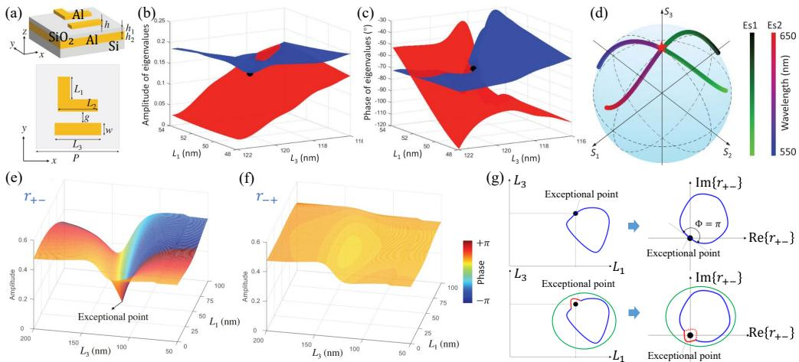

Exceptional points of the Jones matrix. (a) Perspective and top view of the MIM meta-atom. The dimensions are $L_{2}=140$ nm, $P=300$ nm, w=50 nm, g=70 nm, h=30 nm, $h_{1}=40$ nm, and $h_{2}=150$ nm. (b) and (c) Simulated amplitude and phase of two eigenvalues as functions of $L_{1}$ and $L_{3}$ at a wavelength of 600 nm. The exceptional point is indicated with the black dot. (d) Position of the eigen-polarization states on the Poincaré sphere as a function of the wavelength, which degenerate to RCP at 600 nm. (e) and (f) Simulated polarization conversion coefficients $r_{+-}$ and $r_{-+}$ in the parameter space $(L_{1}, L_{3})$ . (g) Topological analysis for the phase accumulation by encircling a polarization exceptional point. Left: meta-atom parameter space $(L_{1}, L_{3})$ . Right: complex plane of the polarization conversion coefficient $r_{+-}$ . Adapted with permission from Song et al., Science 373, 1133–1137 (2021) [133]. Copyright © 2021 American Association for the Advancement of Science.

From the $r_{+-}$ distribution shown in Fig. 14(e), we observe that for any closed path encircling the exceptional point where $r_{+-}=0$ in the parameter space $(L_{1},L_{3})$ , the reflected light exhibits a $2\pi$ phase accumulation, which remains independent of the specific closed path taken. This phenomenon is topologically protected, and thus, this phase modulation mechanism is referred to as the topological phase.

As illustrated in the top panel of Fig. 14(g), when a closed path in the parameter space crosses the exceptional point, its corresponding trajectory in the complex plane of $r_{+-}$ must pass through the origin. In the bottom panel of Fig. 14(g), for a blue closed path encircling the exceptional point in parameter space, its corresponding trajectory in the complex plane of $r_{+-}$ can either enclose (solid red line) or not enclose (red dashed line) the origin. In the former case, $r_{+-}$ accumulates a phase of $2\pi$ along the closed path, while in the latter case, the phase accumulation is less than $2\pi$ . To ensure the occurrence of the former case, a suitable parameter space must be chosen, such as $(L_{1}, L_{3})$ rather than $(L_{1}, L_{2})$ in this case. This $2\pi$ phase accumulation is robust because it is topologically protected. Specifically, as shown in the bottom panel of Fig. 14(g), assuming the blue closed path encircling the exceptional point exhibits a $2\pi$ phase accumulation, this accumulation must persist even if the path is continuously deformed into the green path—unless the green path in the parameter space no longer encircles the exceptional point or simultaneously encloses additional exceptional points.

The topological phase enables complete phase modulation by selecting meta-atoms of different sizes around the exceptional point, a property similar to that of resonant phase. In fact, resonant phase also has a topological origin, making it fundamentally a type of topological phase, which we will further discuss in Subsection 2.2.8. Both topological

Figure 15  
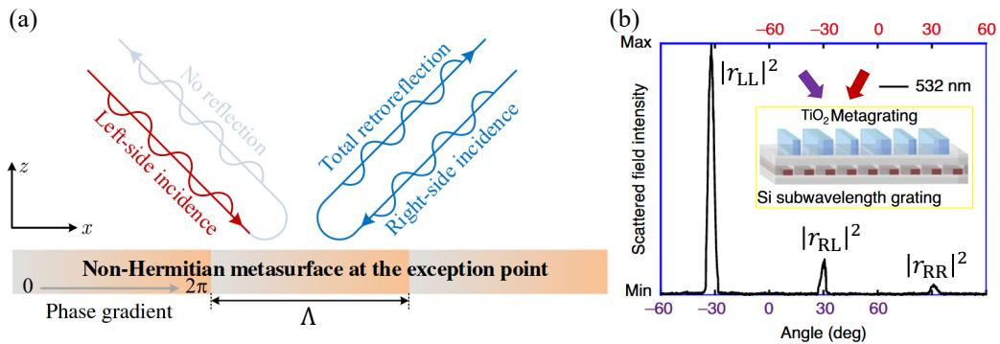

Exceptional points of the scattering matrix. (a) Schematic of the metagrating exhibiting asymmetric reflections at the exceptional point. (b) Measured far-field scattered light from all angles with incident angles of $30^{\circ}$ and $-30^{\circ}$ at a wavelength of 532 nm. Inset: schematic of the bilayer metagrating. (a) Adapted with permission from Wang et al., Phys. Rev. Lett. 123, 214302 (2019) [310]. Copyright © 2019 American Physical Society. (b) Adapted from [311] a Creative Commons license.

and geometric phases operate under circularly polarized incidence and output. However, as shown in Figs. 14(e) and 14(f), the topological phase only modulates the phase in one of the two conversion scenarios, either LCP → RCP or RCP → LCP, depending on whether the exceptional point is an LCP or RCP exceptional point. In contrast, the geometric phase operates in both conversion scenarios. Furthermore, the topological phase can be combined with the geometric phase to realize the hybrid phase modulation mechanism, which can be applied to polarization-multiplexed metasurface holography [133] and other applications.

Exceptional points of the scattering matrix. In order to introduce the exceptional point of the scattering matrix, a two-port metagrating must first be constructed. From Eq. (68), when the phase gradient of the metagrating satisfies

$$
\frac {\mathrm{d} \phi}{\mathrm{d} x} = \frac {2 \pi}{\Lambda}, \tag {121}
$$

and $n_{\mathrm{i}} = 1$ , the metagrating equation simplifies to

$$
\frac {2 \pi}{\lambda_ {0}} \left(\sin \theta_ {\mathrm{r}} - \sin \theta_ {\mathrm{i}}\right) = (M + 1) \frac {2 \pi}{\Lambda}. \tag {122}
$$

To form a two-port system, only two diffraction orders can propagate while others are evanescent. As shown in Fig. 15(a), without loss of generality, the angle of incidence is set as $\theta_{\mathrm{i}} = \pm \pi /4$ for the left- or right-side incidence, and $\Lambda = \lambda_0 / \sqrt{2}$ . In this way, Eq. (122) can be simplified to

$$
\sin \theta_ {\mathrm{r}} - \sin \theta_ {\mathrm{i}} = (M + 1) \sqrt {2}. \tag {123}
$$

Using Eq. (123), for the left-side incidence $(\theta_{\mathrm{i}} = +\pi/4)$ , only the diffraction orders of M = -1 and M = -2 produce propagating waves, corresponding to right-side output $(\theta_{\mathrm{r}} = +\pi/4)$ with reflection coefficient $r_{RL}$ and left-side output $(\theta_{\mathrm{r}} = -\pi/4)$ with $r_{LL}$ , respectively. For the right-side incidence $(\theta_{\mathrm{i}} = -\pi/4)$ , only the diffraction orders of M = 0 and M = -1 give rise to propagating waves, corresponding to right-side output $(\theta_{\mathrm{r}} = +\pi/4)$ with $r_{RR}$ and left-side output $(\theta_{\mathrm{r}} = -\pi/4)$ with $r_{RL}$ , respectively.

Such a two-port metagrating can be described by a $2 \times 2$ scattering matrix,

$$
\mathbf {S} = \left[ \begin{array}{l l} r _ {\mathrm{RL}} & r _ {\mathrm{RR}} \\ r _ {\mathrm{LL}} & r _ {\mathrm{LR}} \end{array} \right], \tag {124}
$$

which satisfies

$$
\left[ \begin{array}{l} A _ {\mathrm{R}} ^ {\mathrm{o}} \\ A _ {\mathrm{L}} ^ {\mathrm{o}} \end{array} \right] = \mathbf {S} \left[ \begin{array}{l} A _ {\mathrm{L}} ^ {\mathrm{i}} \\ A _ {\mathrm{R}} ^ {\mathrm{i}} \end{array} \right], \tag {125}
$$

where $\left[A_{L}^{i}\quad A_{R}^{i}\right]^{\top}$ represents the complex amplitudes of the input of the left and right ports, and $\left[A_{R}^{o}\quad A_{L}^{o}\right]^{\top}$ represents the complex amplitudes of the output of the right and left ports. Due to the reciprocity, we have

$$
r _ {\mathrm{RL}} = r _ {\mathrm{LR}}. \tag {126}
$$

The eigenvalues of Eq. (124) under the condition of Eq. (126) are given by

$$
w _ {1, 2} = r _ {\mathrm{RL}} \pm \sqrt {r _ {\mathrm{RR}} r _ {\mathrm{LL}}}. \tag {127}
$$

Therefore, the condition for the exceptional point is

$$
r _ {\mathrm{RR}} = 0, \tag {128}
$$

or

$$
r _ {\mathrm{LL}} = 0. \tag {129}
$$

At the exceptional point, extremely asymmetric reflection can be achieved. Specifically, in the first case of Eq. (128), the right-side diffracted light of the metagrating under right-side incidence is completely suppressed, while the left-side diffracted light under left-side incidence is observable in the far field. In the second case of Eq. (129), the left-side diffracted light under left-side incidence is completely suppressed, while the right-side diffracted light under right-side incidence is observable.

In 2019, Wang et al. [310] experimentally demonstrated the scattering exceptional point using an acoustic metasurface. In 2020, Dong et al. [312] achieved a similar demonstration with a metasurface composed of a judiciously tailored tri-meta-atom supercell operating at a frequency of 11.8 GHz. In 2023, He et al. [311] optimized and fabricated a bilayer metagrating in the visible (operating at $\theta = \pm \pi / 6$ ), exhibiting highly efficient asymmetric reflection at the exceptional point $r_{RR} = 0$ , as shown in Fig. 15(b).

Resonance exceptional points. A resonance exceptional point can form when two (or more) resonant modes of the metasurface become degenerate, meaning their resonance frequencies and loss rates simultaneously coincide.

In 2020, Park et al. [313] experimentally demonstrated the existence of resonance exceptional points using a bilayer metasurface, as shown in Fig. 16(a). The metasurface consists of two layers of identical Au meta-atom arrays, where the bottom-layer meta-atoms are embedded in a dielectric slab with a refractive index of 1.5. As shown in Fig. 16(b), $P_{x}$ is fixed at 400 nm, while $P_{y}$ and $d_{x}$ are adjusted to reach an exceptional point where both the resonance frequencies and loss rates become simultaneously degenerate. Around the exceptional point, the metasurface exhibits resonance splitting proportional to the square root of structural perturbations, which serves as the basis for its sensing capability. Experimentally, the application of the metasurface at the exceptional point as a sensor for anti-immunoglobulin G, the most abundant immunoglobulin isotype in human serum, was demonstrated.

Figure 16  
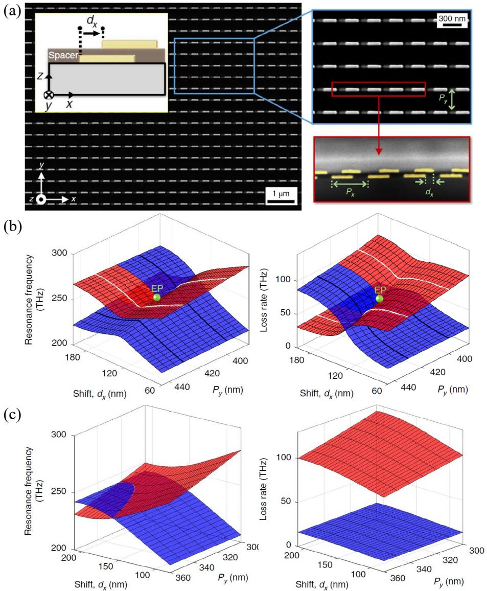

Resonance exceptional points. (a) Left: top-view SEM of the fabricated bilayer metasurface with $d_{x}=100$ nm. Right: magnified top (xy plane) and side (xz plane) views, showing the top and bottom Au meta-atoms. Here, $P_{x}$ and $P_{y}$ denote the period of the meta-atom array along the x- and y-directions, respectively, while $d_{x}$ represents the lateral shift between the top and bottom layers. (b) Simulated real and imaginary parts of the two eigenmodes (red and blue) of the bilayer metasurface in (a) as functions of $d_{x}$ and $P_{y}$ . (c) Simulated real and imaginary parts of the two eigenmodes (red and blue) of a modified metasurface with an air spacer, varying $d_{x}$ and $P_{y}$ . Adapted with permission from Park et al., Nat. Phys. 16, 462–468 (2020) [313]. Copyright © 2020 Springer Nature.

In the former configuration, breaking the mirror symmetry along the z-direction via the dielectric spacer is essential for the formation of an exceptional point. In contrast, replacing the spacer material of the metasurface in Fig. 16(a) with air restores mirror symmetry along the z-direction, causing the two resonant modes to be purely symmetric and anti-symmetric. As illustrated in Fig. 16(c), their loss rates then differ significantly and remain distinct, preventing the emergence of an exceptional point.

Figure 17  
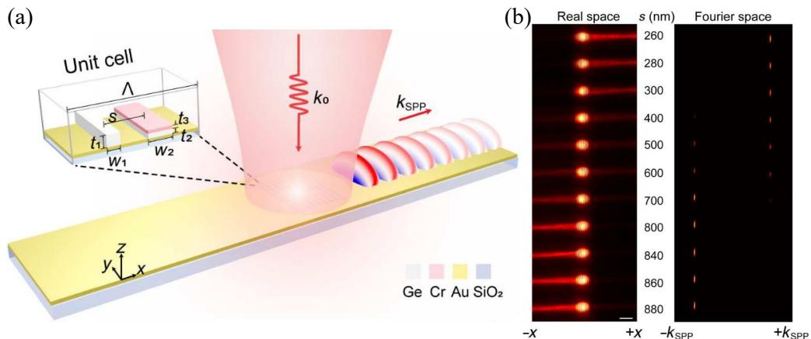  
SPP exceptional points. (a) Schematic of the metagrating for unidirectional excitation of SPPs. (b) Real space and Fourier space images of SPPs for metagratings with different values of s, characterized by leakage radiation microscopy. Scale bar, 10 $\mu$ m. Adapted from Xu et al., Sci. Adv. 9, eadf3510 (2023) [314], under a Creative Commons license.

Only when the mirror symmetry along the z-direction is broken, the resonant modes deviate from purely symmetric or anti-symmetric states, enabling interference via radiation and allowing exceptional points to emerge.

SPP exceptional points. In 2023, Xu et al. [314] demonstrated the unidirectional excitation of SPPs using non-Hermitian metagratings. As shown in Fig. 17(a), the metagrating consists of nine unit cells, and the excitation of SPPs can be modulated by varying the separation distance s. By carefully designing the geometric parameters of the unit cell, the SPP eigenstates of the system can coalesce at an exceptional point, leading to the unidirectional SPP mode propagating in the +x or -x direction. Experimentally, as shown in Fig. 17(b), continuous tuning of SPP excitation was achieved by adjusting the geometric parameter s of the metagrating. This controllable directionality and robust performance are attributed to the phase transition near the exceptional point.

# 2.2.7. Beyond Spatial Modulation: Spatiotemporal Metasurfaces

Traditional metasurfaces introduce spatially varying amplitude and phase modulation to achieve arbitrary wavefront manipulation, which is applied in beam steering, imaging, holography, and other applications. However, one may naturally wonder if it is possible to introduce control in other dimensions. Spatiotemporal metasurfaces extend the spatial modulation by additionally incorporating temporal modulation of the optical field $[315–318]$ . This not only means (I) that traditional static metasurfaces are upgraded to have actively tunable functionalities (such as variable-focus metalenses), but also (II) that it opens new directions for the study of light–matter interactions, bringing forth a series of previously inaccessible exotic physical effects and optical devices with novel functionalities $[319–321]$ .

In Section 8, we will introduce the physical realization of spatiotemporal metasurfaces—various types of active metasurfaces based on different principles—and their research progress in the aforementioned direction (I), a direction that has been progressively refined in current studies. Here, we will focus on two representative physical effects of spatiotemporal metasurfaces in the nascent direction (II), presenting their theoretical foundations and numerical/experimental validations.

Frequency conversion using spatiotemporal metasurfaces. The frequency conversion effect of time-varying materials has been recognized for quite some time. For example, in 2014, Xiao et al. [322] demonstrated that an electromagnetic wave encountering a temporal boundary—where the refractive index of a homogeneous material is instantaneously changed from $n_{1}$ to $n_{2}$ —undergoes a shift in its carrier frequency. In the early stages of metasurface research, researchers had already noticed frequency conversion effects resulting from temporal modulation of metasurfaces [323], and various designs of spatiotemporal metasurfaces for frequency conversion were subsequently proposed [324–326].

(I) Metasurfaces with temporal phase modulation. The electric field vector of a time-harmonic monochromatic plane wave can be expressed as

$$
\vec {E} = \vec {E} _ {0} e ^ {i \phi (\vec {r}, t)} = \vec {E} _ {0} e ^ {i \left(\vec {k} \cdot \vec {r} - \omega t\right)}, \tag {130}
$$

where $\vec{E}_{0}$ is a constant amplitude vector, $\vec{k}$ is the wavevector, $\omega$ is the angular frequency, and $\vec{r}=x\vec{e}_{x}+y\vec{e}_{y}+z\vec{e}_{z}$ . The spatial and temporal derivatives of $\phi(\vec{r},t)$ yield the wavevector and angular frequency, respectively:

$$
\vec {k} = \vec {\nabla} \phi , \tag {131}
$$

$$
\omega = - \frac {\partial \phi}{\partial t}, \tag {132}
$$

where $\vec{\nabla}_{\mathrm{T}} = \frac{\partial}{\partial x}\vec{e}_x + \frac{\partial}{\partial y}\vec{e}_y + \frac{\partial}{\partial z}\vec{e}_z.$

Consider a wave with an initial phase factor

$$
\phi_ {\mathrm{i}} \left(\vec {r} _ {\mathrm{T}}, t\right) = \vec {k} _ {\mathrm{i}} \cdot \vec {r} _ {\mathrm{T}} - \omega_ {\mathrm{i}} t, \tag {133}
$$

where $\vec{r}_{T}=x\vec{e}_{x}+y\vec{e}_{y}$ , incident on a spatiotemporal metasurface located at z=0. This metasurface imparts a space-time-dependent phase shift $\phi_{\mathrm{m}}\left(\vec{r}_{\mathrm{T}},t\right)$ to the output (transmitted or reflected) wave. The resulting phase distribution of the output wave is given by

$$
\phi_ {\mathrm{o}} \left(\vec {r} _ {\mathrm{T}}, t\right) = \phi_ {\mathrm{i}} \left(\vec {r} _ {\mathrm{T}}, t\right) + \phi_ {\mathrm{m}} \left(\vec {r} _ {\mathrm{T}}, t\right). \tag {134}
$$

By applying Eqs. (131) and (132), the transverse wavevector and angular frequency of the output wave can be expressed as

$$
\vec {k} _ {\mathrm{o}, \mathrm{T}} = \vec {\nabla} _ {\mathrm{T}} \phi_ {\mathrm{o}} = \vec {k} _ {\mathrm{i}, \mathrm{T}} + \vec {\nabla} _ {\mathrm{T}} \phi_ {\mathrm{m}}, \tag {135}
$$

$$
\omega_ {\mathrm{o}} = - \frac {\partial \phi_ {\mathrm{o}}}{\partial t} = \omega_ {\mathrm{i}} - \frac {\partial \phi_ {\mathrm{m}}}{\partial t}, \tag {136}
$$

where $\vec{\nabla}_{T}=\frac{\partial}{\partial x}\vec{e}_{x}+\frac{\partial}{\partial y}\vec{e}_{y}$ . Equations (135) and (136) indicate that a spatial phase gradient introduces an abrupt change in the transverse photonic momentum given by

$$
\Delta \vec {p} _ {\mathrm{T}} = \hbar \Delta \vec {k} _ {\mathrm{T}} = \hbar \vec {\nabla} _ {\mathrm{T}} \phi_ {\mathrm{m}}, \tag {137}
$$

while a temporal phase gradient results in a photonic energy change of

$$
\Delta E = \hbar \Delta \omega = - \hbar \frac {\partial \phi_ {\mathrm{m}}}{\partial t}. \tag {138}
$$

It is worth noting that Eq. (135) has been discussed in Subsection 2.1.6, and Eq. (136) highlights the frequency conversion effect induced by the time-varying phase shift of the spatiotemporal metasurface [323].

Illustrations of Eqs. (135) and (136) for a one-dimensional (1D) metasurface operating in reflection mode, with a phase shift distribution $\phi(x,t)$ , are shown in the left two panels of Fig. 18(a). In this case, $k_{y} \equiv 0$ , and the wavevector components satisfy the dispersion relation

$$
k _ {x} ^ {2} + k _ {z} ^ {2} = \left(\frac {\omega}{c}\right) ^ {2}, \tag {139}
$$

where c is the speed of light. As illustrated in the bottom left panel of Fig. 18(a), when an angular frequency shift $\Delta\omega$ is introduced, $k_{x}$ remains unchanged due to the conservation of transverse momentum, while $k_{z}$ increases as a result of the frequency change, in accordance with Eq. (139).

In 2016, Liu et al. [324] proposed an active terahertz metasurface based on graphene microribbon arrays to achieve temporal phase modulation. The working mechanism of the graphene metasurface is discussed in Subsection 8.1. As shown in Fig. 18(c), numerical simulations demonstrate that applying a 1 GHz alternating current signal induces time-varying phase shifts on the metasurface, resulting in a frequency shift of the reflected terahertz wave ranging from $5 \times 10^{-2}$ GHz to 5 GHz, depending on the operating wavelength.

In 2024, Atwater's group [326] demonstrated an electrically tunable active MIM meta-surface incorporating indium tin oxide (ITO), composed of a 1D array of Au nanoantennas. These nanoantennas were electrically connected via two independent electrodes, each contacting alternating groups of 12 antennas, as illustrated in the top panels of Fig. 18(d). The operating principle of this active metasurface is discussed in Subsection 8.2. All nanoantennas were modulated using the same waveform at a frequency $\omega_{\mathrm{m}}$ , with a temporal delay of half a period between the two antenna groups. As a result, incident light at angular frequency $\omega_{\mathrm{i}}$ was reflected and diffracted into a set of harmonic frequencies given by $\omega_{\mathrm{i}} \pm N\omega_{\mathrm{m}}$ , where $N$ is an integer. Experimentally, the metasurface was illuminated with normally incident light at a wavelength of $1530~\mathrm{nm}$ and modulated at megahertz frequencies using an arbitrary waveform generator. When driven with a $1\mathrm{MHz}$ sine wave, as shown by the blue curves in the bottom panels of Fig. 18(d), a strong signal appeared at $1\mathrm{MHz}$ , as expected. However, an undesired harmonic component at $2\mathrm{MHz}$ was also observed. To suppress this unwanted frequency, an optimization procedure was performed to maximize the power at $1\mathrm{MHz}$ while minimizing power at other harmonics. As shown by the orange curves in the bottom panels of Fig. 18(d), the optimized waveform achieved effective suppression of higher-order harmonics.

(II) Linear frequency conversion through sudden merging of meta-atoms. In 2018, Lee et al. [325] proposed a time-varying metasurface composed of an array of two concentric SRRs, as shown in the top panel of Fig. 18(e). When the conductivity of the region between the two SRRs is abruptly increased, the original resonant mode of the meta-atom is annihilated, and a new resonant mode—corresponding to a merged single SRR—is formed. When the timing of this abrupt conductivity change, denoted $t_1$ , closely matches the arrival time $t_2$ of the incident light pulse (specifically, when $t_1 - t_2 \to 0^+$ ), the metasurface exhibits the frequency conversion effect, since its operation involves dynamic mode conversion. In the experimental demonstration, a narrowband terahertz input pulse with a pump fluence of $10~\mu \mathrm{J~cm}^{-2}$ was coupled to the metasurface with a time delay of $t_1 - t_2 = 9.8~\mathrm{ps}$ . The power spectral densities of the output signal showed significant frequency conversion without notable spectral broadening

Figure 18  
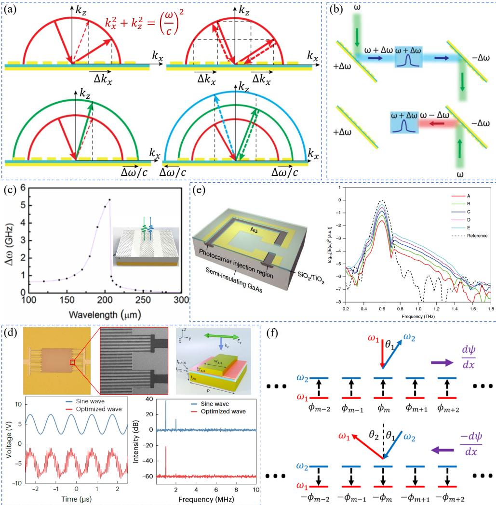

Spatiotemporal metasurfaces. (a) Top left: light reflected from a space-gradient metasurface. The red dashed line represents the reflected beam without the metasurface. Bottom left: light reflected from a time-gradient metasurface. The red dashed line represents the reflected beam without the metasurface. Top right: time-reversal test of a space-gradient metasurface. The dashed red line shows the reversed path; the solid red line shows the original trace. Bottom right: time-reversal test of a time-gradient metasurface. The dashed line shows the reversed path; the solid line shows the original trace. (b) Schematic of an optical isolator with identical input/output frequencies, constructed using two time-varying metasurfaces and a high-Q frequency filter. (c) Simulated frequency shift of reflected terahertz waves under periodic temporal modulation at various operation wavelengths. Inset: schematic of a graphene ribbon array on a 10 $\mu$ m-thick dielectric spacer backed by a metallic mirror. (d) Top left: optical microscope image of a single metasurface. Scale bar: 100 $\mu$ m. Top middle: SEM of individual nanoantennas. Scale bar: 5 $\mu$ m. Top right: schematic of the metasurface unit cell. Bottom left: sine (blue) and optimized (orange) voltage waveforms applied to the metasurface. Bottom right: reflected frequency spectra under the two waveforms, showing harmonic suppression. (e) Left: schematic of the metasurface. Photocarrier injection occurs only in the dark grey region, while the rest is shielded by a patterned $SiO_{2}/TiO_{2}$ layer. Right: power spectral densities of terahertz pulses transmitted through the metasurface at different input power levels. The dashed line indicates the normalized power spectrum of the incident pulse centered at 0.6 THz. (continued)

(continued) (f) Top: reflection from a metasurface for normal incidence at frequency $\omega_{1}$ . Bottom: reflection under time-reversed input. The deflected output direction demonstrates nonreciprocity. (a) and (b) Adapted with permission from Shaltout et al., Opt. Mater. Express 5, 2459–2467 (2015) [323]. Copyright © 2015 Optica Publishing Group. (c) Adapted with permission from Liu et al., ACS Photonics 3, 2035–2039 (2016) [324]. Copyright © 2016 American Chemical Society. (d) Reprinted with permission from Sisler et al., Nat. Nanotechnol. 19, 1491–1498 (2024) [326]. Copyright © 2024 Springer Nature. (e) Reprinted with permission from Lee et al., Nat. Photonics 12, 765–773 (2018) [325]. Copyright © 2018 Springer Nature. (f) Reprinted with permission from Shi and Fan, Appl. Phys. Lett. 108, 021110 (2016) [327]. Copyright © 2016 American Institute of Physics.

across various input power levels. The reference spectrum was obtained by transmitting the input pulse through an unpatterned GaAs substrate with identical dielectric layers. Furthermore, the converted power at 0.92 THz exhibited a linear relationship with the input power at 0.6 THz, confirming the linearity of the frequency conversion process.

Nonreciprocity of spatiotemporal metasurfaces. Breaking optical reciprocity enables the development of photonic devices, such as optical isolators. Currently, most optical isolators rely on the magneto-optic Faraday effect, which requires strong magnetic fields and long interaction lengths. In contrast, spatiotemporal metasurfaces can achieve nonreciprocal responses without relying on magneto-optic effects, offering a promising route toward compact and integrable optical isolators.

(I) Metasurfaces supporting temporal phase modulation. Let us return to the space-time gradient metasurfaces illustrated in Fig. 18(a) and examine their time-reversal responses. As shown in the top panels of Fig. 18(a), a space-gradient metasurface exhibits reciprocal behavior, since the transverse momentum changes in the forward and reverse directions cancel each other out. In contrast, as depicted in the bottom panels of Fig. 18(a), a time-gradient metasurface is inherently nonreciprocal because the frequency shifts in both propagation directions are additive and do not cancel. Exploiting this nonreciprocal behavior, Shaltout et al. [323] proposed an optical isolator that maintains the same input and output frequencies by employing two time-varying metasurfaces in conjunction with a frequency filter based on a high-Q resonance.

In the same year, Hadad et al. demonstrated the use of a spatiotemporal metasurface to realize a nonreciprocal classical analog of electromagnetically induced transparency, creating a narrow transmission window for one-way propagation through an otherwise opaque surface.

(II) Metasurfaces consisting of photonic transition meta-atoms. In 2016, Shi and Fan [327] proposed an optical isolator based on photonic transitions in meta-atoms. Consider a meta-atom that supports eigenstates $|1\rangle$ and $|2\rangle$ at angular frequencies $\omega_{1}$ and $\omega_{2}$ , respectively, where $\omega_{1}<\omega_{2}$ . By applying a time-dependent dielectric function modulation that couples these two states, i.e.,

$$
\epsilon (\vec {r}, t) = \epsilon_ {\mathrm{DC}} (\vec {r}) + \delta (\vec {r}) \cos \left(\left(\omega_ {2} - \omega_ {1}\right) t + \phi\right), \tag {140}
$$

where $\phi$ is the modulation phase and $\delta (\vec{r})$ defines the spatial modulation profile. During the upward transition from $|1\rangle$ to $|2\rangle$ , the output light acquires a phase shift of $\phi$ , while in the downward transition from $|2\rangle$ to $|1\rangle$ , the same modulation imparts a phase shift of $-\phi$ . Based on this principle, an active metasurface composed of independently modulated meta-atoms can be realized. An optical isolator design was subsequently proposed. As illustrated in Fig. 18(f), output light at frequency $\omega_{1}$ is

deflected from the original normal direction. This occurs because the meta-atoms impose spatial phase gradients with opposite signs for the original and time-reversed incidence, corresponding to upward and downward transitions, respectively.

# 2.2.8. Beyond Real Frequency: Complex-Frequency Metasurfaces

The aforementioned emerging metasurfaces achieve novel functionalities such as high-Q factors, topological phases, and frequency conversion by introducing physical mechanisms such as nonlocal modes, singularities, and temporal phase modulation through carefully designed metasurface structures. In contrast, the focus is now shifting to the excitation light of metasurfaces, aiming to (I) change it from a classical light to a quantum light or (II) change it from a real-frequency light to a complex-frequency light $[328]$ , which may reveal new physical effects and applications. For (I), a detailed discussion will be provided in Section 6. Here, we focus on the exploration of (II).

The electric field vector of a time-harmonic complex-frequency electromagnetic wave can be expressed as

$$
\vec {E} (\vec {r}, t) = \vec {E} _ {1} (\vec {r}) E _ {2} (t) = \vec {E} _ {1} (\vec {r}) e ^ {- i \tilde {\omega} _ {0} t}, \tag {141}
$$

where

$$
\tilde {\omega} _ {0} = \omega_ {0} + i \tau \tag {142}
$$

represents the complex frequency, with $\omega_{0}$ being the real frequency and $\tau$ being the temporal growth or attenuation factor. Substituting Eq. (142) into Eq. (141), we obtain

$$
\vec {E} (\vec {r}, t) = e ^ {\tau t} \vec {E} _ {1} (\vec {r}) e ^ {- i \omega_ {0} t}, \tag {143}
$$

which indicates that the complex-frequency wave exhibits either temporal growth ( $\tau > 0$ ) or attenuation ( $\tau < 0$ ). This behavior implies that the imaginary part of the complex frequency can effectively represent either virtual gain or virtual loss.

Several theoretical proposals have recently been put forward to explore exotic physical effects in metasurfaces through the excitation of complex-frequency light. However, from a practical standpoint, synthesizing complex-frequency waves in optical systems remains a significant challenge, and, as a result, no experimental demonstrations of complex-frequency metasurfaces have been reported to date. Nonetheless, a recent demonstration of synthesizing complex-frequency responses offers promise for advancing experimental work in this area $[329]$ .

In the following, we first present the theoretical and simulation studies of novel physical effects in metasurfaces under complex-frequency excitation, followed by an introduction to the experimental techniques for synthesizing complex-frequency responses.

Novel physical effects under complex-frequency excitation. (I) Complex frequency analysis and the topological origin of resonant phase. Assuming that the response function $\Gamma(\tilde{\omega})$ —such as the transmission coefficient T, reflection coefficient R, or scattering coefficient S—only possesses simple zeros and poles, it can be expanded using the Weierstrass factorization theorem [91,93,330], yielding

$$
\Gamma (\tilde {\omega}) = A e ^ {i B \tilde {\omega}} \prod_ {N = 1} ^ {\infty} \frac {\tilde {\omega} - \tilde {\omega} _ {N} ^ {+}}{\tilde {\omega} - \tilde {\omega} _ {N} ^ {-}}, \tag {144}
$$

where A and B are constants that depend on the properties of the metasurface, and $\tilde{\omega}_{N}^{\pm}$ are the complex frequencies corresponding to the zeros and poles, respectively. While the poles are associated with resonances or quasi-normal modes of photonic structures, the zeros offer important insights into physical phenomena, such as BIC [93].

By evaluating the winding number along a counterclockwise contour C encircling the singularities in the complex frequency plane, the topological charge can be defined as

$$
q = \frac {1}{2 \pi} \oint_ {C} \frac {\mathrm{d} \angle \Gamma (\tilde {\omega})}{\mathrm{d} \tilde {\omega}} \mathrm{d} \tilde {\omega}. \tag {145}
$$

The topological charges of the zeros and poles are +1 and -1, respectively, meaning that the phase undergoes a $2\pi$ variation around the zeros, while the poles cause a phase variation of $-2\pi$ . Zeros and poles occur in pairs, connected by a branch cut, where the phase undergoes a discontinuous jump of $\pm\pi$ when taking the phase value within the range $(- \pi, \pi]$ .

In the following, we analyze the topological origins of the resonant phases in various types of metasurfaces using complex frequency analysis based on zeros and poles.

(i) Resonant phase of metasurfaces satisfying PT symmetry. It is commonly assumed that an isolated resonance in a metasurface induces a phase shift of $\pi$ . However, strictly speaking, this assumption holds only for metasurfaces that satisfy PT symmetry. In this context, the parity symmetry corresponds to mirror symmetry along the z-direction (the normal direction of the metasurface), i.e., $(x,y,z)\to(x,y,-z)$ , while the time symmetry corresponds to time-reversal symmetry, i.e., $t\to-t$ .

For a metasurface that preserves time-reversal symmetry, the zeros of the response function under forward and backward illumination [as illustrated in the left panel of Fig. 19(c)] must be complex conjugates of each other:

$$
\tilde {\omega} _ {\text {forward}} ^ {+} = \left(\tilde {\omega} _ {\text {backward}} ^ {+}\right) ^ {*}, \tag {146}
$$

where $\tilde{\omega}_{forward}^{+}$ and $\tilde{\omega}_{backward}^{+}$ are the complex frequencies of the zeros under forward and backward illumination, respectively. For a metasurface satisfying parity symmetry, reciprocity dictates that the zeros under forward and backward illumination must be identical:

$$
\tilde {\omega} _ {\text {forward}} ^ {+} = \tilde {\omega} _ {\text {backward}} ^ {+}. \tag {147}
$$

Combining Eqs. (146) and (147), we conclude that for a metasurface satisfying PT symmetry, the zeros lie on the real axis.

Moreover, in passive systems, causality constraints require that the poles must have a negative imaginary component.

As shown in Fig. 19(a), the reflection coefficient of a metasurface satisfying PT symmetry exhibits a pair of a zeros and a poles, with the zero located on the real axis and the pole positioned below the real axis, as expected. In this case, the phase shift variation along the real frequency axis is approximately $\pi$ .

(ii) Resonant phase of metasurfaces breaking PT symmetry. To achieve a resonant phase accumulation of $2\pi$ as a function of real frequency, a necessary condition is the presence of a zero–pole pair separated by the real axis. Since, for a passive metasurface, poles are inherently constrained to lie below the real axis, breaking PT symmetry is required to shift the zero above the real axis. This can be realized either by introducing gain or loss to the metasurface to break time-reversal symmetry or by breaking mirror symmetry along the z-axis. The latter can be achieved by using superstrates and substrates with different refractive indices [126] or by employing conically shaped meta-atoms [134].

Figure 19  
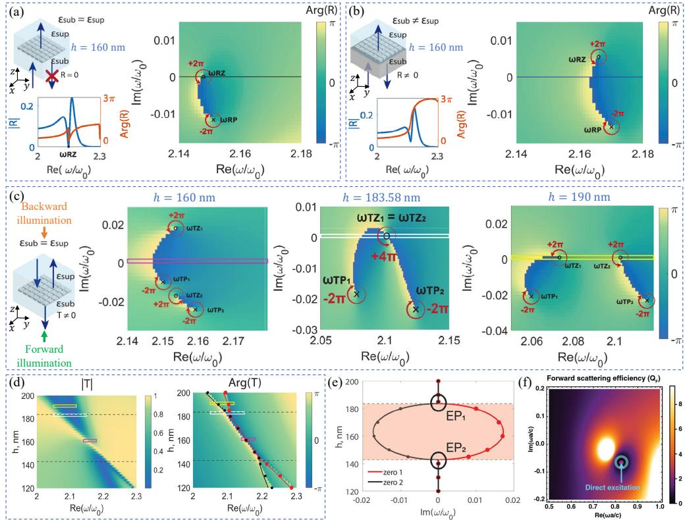

Complex-frequency metasurfaces. (a) Complex frequency analysis for the meta-atom satisfying PT symmetry. Top left: schematic of the meta-atom, where $h$ denotes the height of the meta-atom, and $\epsilon_{\mathrm{sup}}$ and $\epsilon_{\mathrm{sub}}$ denote the permittivity of the superstrate and substrate of the metasurface, respectively. Bottom left: amplitude reflection coefficient and reflection phase shift of the meta-atom as functions of real frequency. Right: reflection phase of the meta-atom as a function of complex frequency. $\omega_{\mathrm{RZ}}$ and $\omega_{\mathrm{RP}}$ represent the complex frequencies of the zero and pole of the reflection coefficient, respectively. (b) Complex frequency analysis for the meta-atom breaking the parity symmetry. The meanings of the panels are the same as in (a). (c) Complex frequency analysis for the meta-atoms with different heights $h$ . First column: schematic of the meta-atom satisfying PT symmetry. The green and orange arrows indicate the directions of forward and backward illumination. The last three columns: transmission phase of the meta-atoms with different $h$ as a function of complex frequency. $\omega_{\mathrm{TZ}i}$ and $\omega_{\mathrm{TP}i}$ are the complex frequencies of the $i$ -th pair of zeros and poles of the transmission coefficient. (d) Amplitude transmission coefficient and transmission phase shift of the meta-atom in (c) as functions of real frequency and $h$ . (e) Imaginary parts of the zeros as a function of the meta-atom height. $\mathrm{EP}_1$ and $\mathrm{EP}_2$ are the exceptional points where two zeros degenerate. (f) Forward scattering efficiency of a dielectric sphere in the complex frequency plane. The zero is marked by the blue circle. (a)-(e) Adapted from [126] under a Creative Commons license. (f) Reprinted with permission from Kim et al., Phys. Rev. Lett. 129, 203601 (2022) [331]. Copyright © 2022 American Physical Society.

As shown in Fig. 19(b), compared to the metasurface in Fig. 19(a), the refractive indices of the superstrate and substrate have been modified to 2.12 and 1, respectively, thereby breaking parity symmetry. Consequently, the zero shifts to the upper half of the complex plane. This configuration enables a phase shift accumulation of approximately $2\pi$ along the real frequency axis.

(iii) Resonant phase of Huygens metasurfaces based on the exceptional point of zeros. As mentioned in Subsection 2.1.2, Huygens metasurfaces support a $2\pi$ phase shift accumulation without the need to break PT symmetry. How is this possible? In fact, in Huygens metasurfaces, the constraint that requires zeros to be real is spontaneously broken due to the interaction between multiple zero–pole pairs [126].

For the metasurface shown in Fig. 19(c), two zero–pole pairs are present, and the two zeros are complex conjugates of each other. This unique configuration allows the zeros to move away from the real axis while still satisfying the PT symmetry constraints given in Eqs. (146) and (147). By selecting an appropriate meta-atom height such that a zero and its corresponding pole are separated across the real axis, a Huygens metasurface can be realized, as shown in Figs. 19(c) and 19(d).

The exceptional point of zeros plays a crucial role in this process. The trajectories of the two zeros are shown in Figs. 19(c) and 19(e). When the meta-atom height h > 183.58 nm, the zeros remain on the real axis, preventing a $2\pi$ phase accumulation. At h = 183.58 nm, the two zeros coalesce, forming an exceptional point. As h decreases beyond this threshold, the zeros separate and move away from the real axis along different directions. Since one zero shifts above the real axis and the corresponding pole remains below, a $2\pi$ phase shift variation along the real frequency is achieved. When $h \leq 160$ nm, a symmetric process occurs.

(II) Engineering light scattering of nanostructures beyond conventional limits. In 2022, Kim et al. [331] manipulated the scattering of nanostructures through excitations at complex frequencies, demonstrating extreme scattering responses, such as zero forward scattering and the cancellation of scattered fields in both forward and backward directions. For instance, the forward scattering efficiency of a tailored dielectric sphere with radius $a$ is shown in Fig. 19(f), where it exhibits a pair of zero (darkest spot) and pole (brightest spot). Since the zero is located below the real axis, fully suppressing forward scattering is impossible when exciting the sphere with a real-frequency wave, unless gain is added to the particle material or the refractive index of the material is increased. In contrast, the zero of forward scattering can be achieved by exciting the sphere with a wave at the complex frequency $\omega a / c = 0.824 - i0.063$ , thus breaking the conventional limit for minimum forward scattering efficiency.

Complex-frequency response synthesized by combining measurements made at multiple real frequencies. The mathematical expression of an ideal complex-frequency wave is given in Eq. (141). However, this formulation is physically unattainable, as it implies energy divergence when $t \rightarrow +\infty$ ( $t \rightarrow -\infty$ ) for $\tau > 0$ ( $\tau < 0$ ). Therefore, a temporal truncation is necessary to ensure physical feasibility. Specifically, for $\tau < 0$ , the truncated complex-frequency wave can be expressed as

$$
\vec {E} _ {\mathrm{t}} (\vec {r}, t) = \vec {E} _ {1} (\vec {r}) E _ {2 \mathrm{t}} (t) = \vec {E} _ {1} (\vec {r}) e ^ {- i \tilde {\omega} _ {0} t} \Theta (t), \tag {148}
$$

where

$$
\Theta (t) = \left\{ \begin{array}{l l} 0, & t <   0, \\ 1, & t \geq 0. \end{array} \right. \tag {149}
$$

Applying Fourier transformation, Eq. (148) can be rewritten as an integral representation in terms of real-frequency components:

$$
\vec {E} _ {\mathrm{t}} (\vec {r}, t) = \frac {1}{2 \pi} \int_ {- \infty} ^ {+ \infty} \frac {1}{i (\tilde {\omega} _ {0} - \omega)} \vec {E} _ {1} (\vec {r}) e ^ {- i \omega t} \mathrm{d} \omega . \tag {150}
$$

Thus, any complex-frequency response $\Gamma\left(\tilde{\omega}\right)$ of the system—including the permittivity and the transfer function—can be evaluated through the integral of the

corresponding real-frequency response $F(\omega)$ :

$$
F \left(\tilde {\omega} _ {0}\right) \approx \frac {1}{2 \pi} \int_ {- \infty} ^ {+ \infty} F \left(\omega\right) \frac {1}{i \left(\tilde {\omega} _ {0} - \omega\right)} e ^ {- i \omega t + i \tilde {\omega} _ {0} t} \mathrm{d} \omega , \tag {151}
$$

for a sufficiently long duration t. In practice, the complex-frequency response can be further discretized as

$$
F \left(\tilde {\omega} _ {0}\right) \approx \frac {1}{2 \pi} \sum_ {i} F \left(\omega_ {i}\right) \frac {1}{i \left(\tilde {\omega} _ {0} - \omega_ {i}\right)} e ^ {- i \omega_ {i} t + i \tilde {\omega} _ {0} t} \Delta \omega , \tag {152}
$$

where $\Delta\omega$ represents a discrete frequency interval.

This method of synthesizing complex-frequency responses was proposed by Zhang's group and their collaborators in 2023 [329]. It has since been applied to various fields, including overcoming losses in superlenses [329], ultrahigh-sensitivity molecular sensing [332], and compensating losses in phonon polariton propagation [333].

# 2.3. Fundamental Limits of Metasurfaces

Understanding the fundamental limits of metasurfaces can provide valuable physical guidance for advanced designs. To determine the working limits of metasurfaces, the main approach is to model metasurfaces theoretically and derive performance limitation formulas through mathematical analysis $[334]$ . Additionally, topology optimization, which offers the highest degree of design freedom, can also be used to approximate and estimate the limits of metasurface performance $[335]$ . Here we focus on theoretical analysis, and topology optimization will be discussed in detail in Subsection 3.3.

The performance limitations of metalenses, such as NA and achromatic bandwidth, along with the multiplexing channel limitations of metasurface holography, which are device-specific, will be discussed separately in Sections 4 and 5, respectively.

# 2.3.1. Thickness Limit of Metasurfaces

The advent of metasurfaces has significantly compressed the thickness of optical components. A question that arises from this is whether there is a limit to how thin these components can be. In 2023, Miller [336] discussed why optical systems require a certain thickness and the limit of this thickness based on wave optics analysis. Considering an optical system with nonlocality, where the output at a certain position depends on inputs from many locations, the system must communicate sideways. When two different output positions depend on overlapping ranges of input positions, we have overlapping nonlocality (ONL), referring to the required number of sideways communication channels in the system. Due to the diffractive nature of light, each channel's communication has a limit thickness of $\frac{\lambda_0}{2n_{\mathrm{max}}}$ (each limit thickness can only be used for communication in a single channel and cannot be shared by two or more channels), where $\lambda_0$ is the wavelength in free space, and $n_{\mathrm{max}}$ is the maximum refractive index within the area where the system interacts with the incident light. The more channels there are, the greater the total thickness requirement of the system. Thus, it's the ONL that imposes a minimal limit on the thickness of optical systems. Specifically, by calculating the ONL value based on the optical system's function, a quantitative limit on the system's thickness can be determined. This method can be applied to calculate the limit thickness of a metasurface performing a specific function.

In 2022, Li and Hsu [337] theoretically examined the fundamental trade-off between the FOV and thickness of metalens systems. Due to the Fourier transform duality between space and momentum, any multi-channel system with angle-dependent response inherently requires nonlocality and a certain system thickness. The device functionality

dictates a specific angle-dependent electromagnetic response, from which its transfer matrix can be derived, allowing for the calculation of the degree of nonlocality and thereby determining the device's minimum thickness. For metalenses, the thickness of the metasurface $h$ is limited by

$$
h \gtrsim \left(\frac {1}{3} \mathrm{NA}\right) D _ {\mathrm{out}} \sin \left(\frac {\pi}{2} \sin \frac {\mathrm{FOV}}{2}\right), \tag {153}
$$

where NA is the numerical aperture, FOV is the FOV angle, and $D_{\mathrm{out}}$ is the lens diameter (more strictly, the diameter of the output aperture). Eq. (153) aligns with previous design outcomes for metalenses, and the thicknesses of two multilayer metasurface designs obtained using topology optimization [338,339] approach the limit value given by the formula, indicating that the formula's bounds are tight. This method can also be applied to establish thickness limits for other types of nonlocal metasurface devices.

# 2.3.2. Miniaturization Limit of Optical Systems

One of the primary motivations for developing metasurfaces is to achieve miniaturized optical systems that combine high performance and low loss $[340,341]$ . Consider the example of the metalens. In 2021, Ma et al. $[342]$ introduced a novel metric called volumetric imaging efficiency (VIE) to assess the compactness and capability of imaging systems relative to the diffraction limits. Their comparative analysis of VIE between lenses with curved image surfaces and metalenses demonstrated that metalenses can lead to significant improvements in VIE, exceeding the performance limits of traditional lenses.

It should be noted that the ultrathin thickness of metasurfaces does not necessarily mean that the entire optical system is compact in length, as there is invariably a significant amount of free space within optical systems. In a general sense, free space is also considered a special optical component of the system and often occupies a large part of the system's volume. Miniaturization of optical systems requires not only the miniaturization of optical elements but also a significant compression of free space. For the former, the limit has been discussed in the context of the minimum thickness of metasurfaces in Subsection 2.3.1, while for the latter, the main technological approaches include the following.

High-NA devices. The use of devices such as metalenses with high NAs can make the entire system more compact. Compared to traditional refractive and diffractive lenses, metasurfaces have an absolute advantage in achieving high-NA devices with high efficiency, and relevant experimental implementations are already available $[8,9,116,343]$ .

Free space squeezing. As schematically illustrated in Fig. 20(a), viewing free space as an optical component and replacing it with metasurfaces can address this issue more fundamentally. The action of a metasurface on incident light can be characterized by Eq. (79) with the transformation function expressed as

$$
\tilde {H} \left(\vec {k} _ {\mathrm{T}}\right) = e ^ {- i d \sqrt {k _ {0} ^ {2} - \left| \vec {k} _ {\mathrm{T}} \right| ^ {2}}}, \tag {154}
$$

where d is the distance that the light travels in the z direction, and $k_{0}$ is the wavenumber in free space. Here, we do not consider the vector nature of light; hence, the transformation function in Eq. (154) is presented in scalar form. Since this transformation function is spatial-momentum-related, nonlocal metasurfaces must be adopted.

In 2020, Guo et al. [201] theoretically proposed that nonlocal devices could be used to compress free space and utilized photonic crystal slabs to realize the device design

Figure 20  
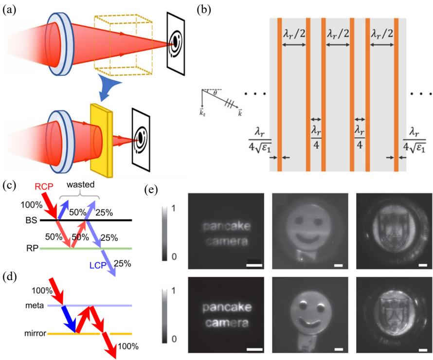

The fundamental limits of metasurfaces. (a) Schematic of free space compression using nonlocal devices. (b) Schematic of the nonlocal metasurface composed of multilayer planar structure. Dielectric plates with high relative permittivity $\epsilon_{1}$ (orange) are separated by materials with relative permittivity close to 1 (gray), where $\lambda_{r}$ is the free-space wavelength of the incident light at the resonance frequency. (c) Schematic of pancake optics for optical path folding. BS, beam splitter; RS, reflective polarizer. The red arrow represents the RCP light, while the blue arrow represents the LCP light, and (d) the same. (d) Schematic for optical path folding utilizing the metasurface. (e) Top: images taken with the metalens with optical path folding. Bottom: images taken with the normal metalens. (a) Reprinted with permission from Guo, et al., Optica 7, 1133–1138 (2020) [201]. Copyright © 2022 Optica Publishing Group. (b) Adapted with permission from Chen and Monticone, ACS Photonics 8, 1439–1447 (2021) [202]. Copyright © 2021 American Chemical Society. (c)–(e) Adapted with permission from Chen et al., Optica 9, 1314–1322 (2022) [344]. Copyright © 2022 Optica Publishing Group.

(it's worth mentioning that methods to achieve nonlocality are not limited to metasurfaces, and even natural materials exhibit nonlocality, albeit weakly. For a detailed explanation, see reference [195]). This device can be designed to accommodate different NAs and can be placed at any location in the optical path to reduce free space as needed. Numerical simulations showed that the compression ratio (the ratio of the lengths of free space before and after compression) could be as high as 144, but the device's working angular range is very limited [202]. In 2021, Reshef et al. [345] achieved a spatial compression of $3.4\mathrm{mm}$ using a uniaxial crystal slab made of calcite in a background medium of linseed oil, experimentally proving the concept of free space squeezing to be physically feasible. The device had a considerable working angular range, but the compression ratio was small, only 1.12, which is far from meeting the requirements for practical applications.

In 2021, targeting nonlocal structures based on a single resonant mode, Chen and Monticone [202] established a quantitative trade-off relationship between the length

of compressed free space l and the working angular range:

$$
\frac {l}{\lambda_ {0}} \left(\frac {\left| \vec {k} _ {\mathrm{T}} \right| _ {\max}}{k _ {0}}\right) \leq 1, \tag {155}
$$

where $\left|\vec{k}_{T}\right|_{max}$ is the maximum magnitude of the transverse wavevector. Equation (155) explains the limited performance of previously proposed free space compression devices. As shown in Fig. 20(b), by stacking the aforementioned resonant structures in n layers, this constraint can be further relaxed:

$$
\frac {l}{\lambda_ {0}} \left(\frac {\left| \vec {k} _ {\mathrm{T}} \right| _ {\max}}{k _ {0}}\right) \leq n. \tag {156}
$$

Thus, it becomes possible to compress any length of free space region within a wide angular range through multilayer structures.

Folded optics. Despite the theoretical and simulation groundwork, efficiently compressing free space experimentally using nonlocal metasurfaces remains an open question. In contrast, incorporating folded optical paths into optical systems to reduce the volume and path length of components is more feasible $[346,347]$ . In 2022, Chen et al. $[344]$ drew inspiration from pancake optics to significantly shorten the volume of the entire metalens imaging system. Figure 20(c) illustrates the concept of a traditional folded optical path achieved through pancake optics without metasurfaces, which consists of a beam splitter and a reflective polarizer. It can be seen that while effectively reducing the system's volume, a significant downside is the 75% loss of light. As shown in Fig. 20(d), the folded optical path system based on metasurfaces consists of a single bifunctional metasurface and a perforated mirror. The metasurface transmits RCP light in the case of forward incidence and reflects it with backward incidence. Ultimately, light can exit the cavity through the perforated mirror, theoretically avoiding light loss. Building upon this functional foundation, by superimposing the focusing phase modulation on the aforementioned metasurface, a metalens with a folded optical path function is achieved. Experimentally, the metalens with an operating wavelength of 980 nm, a diameter of 1 mm, and an effective focal length of 2.4 mm was realized, achieving an FWHM of focal point of 2.8 $\mu$ m, a Strehl ratio of 0.68, and a compression ratio of $\frac{1}{3}$ . The imaging results are shown in Fig. 20(e).

# 3. DESIGN METHODS FOR METASURFACES

Metasurface design is restricted by natural materials, simulation software, fabrication processes, etc. Grasping these constraints is essential to understanding why specific design approaches are developed and adopted in practice. The design methods for metasurfaces can be categorized into traditional forward design as well as emerging inverse design.

As a preliminary basis for simple design tasks, it's crucial to organize the basic workflow of the forward design method, with particular attention to material selection and fabrication methods (Subsection 3.1). However, relying on human intuition, forward design often adopts meta-atoms with regular geometric shapes and neglects the coupling between meta-atoms, resulting in a limited design space [348]. A detailed discussion on the limitations of the forward design method is provided in Subsection 3.2.2. Against this backdrop, inverse design methods have emerged. Technically,

metasurface inverse design methods can be divided into two categories, based respectively on optimization theory (Subsection 3.3) and machine learning (Subsection 3.4). In recent years, inverse design has played an increasingly important role in breaking through device performance limitations and realizing novel designs for complex functionalities.

# 3.1. Basic Design Process of Metasurfaces

Metasurfaces operating in either reflection or transmission mode have similar design approaches, which typically follow the process outlined below.

(I) Firstly, based on the requirements of the device to be designed, the basic configuration of the metasurface is determined, including the operating wavelength, lattice constant, whether to choose a single-layer metasurface or multilayer metasurfaces, and the materials of the meta-atom and substrate.

For a periodic photonic structure with a lattice constant of $a$ , the diffraction angle $\theta_{M}$ for the $M^{\mathrm{th}}$ diffraction order is given by Eq. (29). When determining the lattice constant, Eq. (29) indicates that it should be subwavelength to prevent the occurrence of additional diffraction orders, allowing only the zeroth order [223]. Additionally, further constraints need to be considered based on the specific performance requirements of the device. For instance, achieving high-NA metalenses or wide-FOV metasurface holograms requires a sufficiently small lattice constant. A detailed discussion can be found in Subsections 4.2 and 5.1.3.

The principle for selecting substrate materials is to ensure minimal absorption at the operating wavelength, combining with the processing requirements. Common substrate materials include sapphire $\left(\mathrm{Al}_{2}\mathrm{O}_{3}\right)$ , Si, and silica $\left(\mathrm{SiO}_{2}\right)$ . The principle for selecting meta-atom materials is to choose materials that have as high a refractive index and as low an absorption coefficient as possible at the operating wavelength and that are compatible with the adopted fabrication process $[349]$ . High refractive index characteristics expand the design space [see Eq. (4)], enabling the construction of a meta-atom database that ensures complete coverage of phase and group delay, among other parameters, without necessitating an excessively high aspect ratio. And low absorption characteristics can prevent loss of efficiency. It should be noted that the actual choice of meta-atom materials results from a balance of various factors, such as the efficiency, fabrication cost, etc.

As shown in Fig. 21, typical meta-atom materials that operate in the band ranging from ultraviolet to mid-infrared are listed. In the visible spectrum, $TiO_{2}$ and GaN have nearly zero absorption coefficients and refractive indices around 2.7 and 2.4, respectively, making them ideal meta-atom materials, but their fabrication is relatively difficult and often adopted by research institutions during prototyping. In spite of the slight absorption in the blue spectrum, $SiN_{x}$ also has good transmittance in the visible, and its fabrication process is largely compatible with Si, making it the material of choice for the industrial manufacture of metasurface devices.

Amorphous silicon (a–Si), crystalline silicon (c–Si), and polycrystalline silicon (poly–Si) exhibit varying degrees of absorption loss but have higher refractive indices, and their processing is well established. Therefore, when designing metasurfaces for the near-infrared and mid-infrared bands, many designs tend to overlook the loss and choose these materials for the meta-atoms $[356–361]$ . We note that, while traditionally regarded as undesirable and avoided in previous cases, loss can play an indispensable role in non-Hermitian metasurfaces (see Subsection 2.2.6) and in reducing the coupling between adjacent meta-atoms $[362]$ , among other applications.

Figure 21  
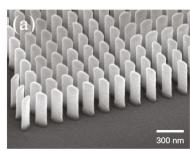  
$HfO_{2}$ hologram  
$E > 60\%$  
@ 266 nm

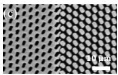  
GaN metalens  
Average AFE ≈ 40%  
@ 400 - 660 nm

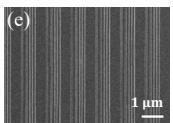  
c-Si grating  
$AE = 61\%$  
@ 488 nm

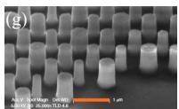  
a-Si metalens  
$AFE\approx82\%$  
@ 1550 nm

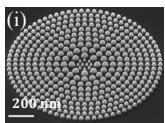  
GaSb metalens  
Maximum AFE ≈ 52%  
@ 3 - 5 μm

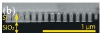  
c-Si metalens  
$T > 10\%, RFE > 48\%$  
@ 49 nm

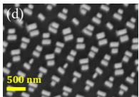  
$TiO_{2}$ metalens  
$AFE\approx20\%(500nm)$  
@ 470 - 670 nm

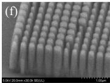  
SiN hologram  
Average DE = 72.7%  
@ 445,532,633 nm

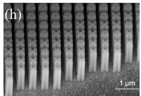  
$TiO_{2}$ metalens  
Average AFE ≈ 50%  
@ 400 - 1000 nm

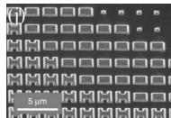  
PbTe metalens  
$AFE \approx 75\%$

@ 5.2 μm  
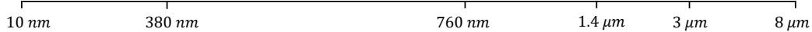

text_image

10 nm 380 nm 760 nm 1.4 µm 3 µm 8 µm

Ultraviolet  
Visible  
Near-infrared  
Short & Mid-  
wavelength infrared

Typical meta-atom materials operating at different wavelengths, where E means efficiency, T means transmittance, DE means diffraction efficiency, RFE means relative focusing efficiency, and AFE means absolute focusing efficiency. (a) Adapted from [350] under a Creative Commons license. (b) Adapted with permission from Ossiander et al., Science 380, 59–63 (2023) [68]. Copyright © 2023 American Association for the Advancement of Science. (c) Adapted with permission from Wang et al., Nat. Nanotechnol. 13, 227–232 (2018) [351]. Copyright © 2018 Springer Nature. (d) Adapted with permission from Chen et al., Nat. Nanotechnol. 13, 220–226 (2018) [139]. Copyright © 2018 Springer Nature. (e) Adapted with permission from Sell et al., ACS Photonics 3, 1919–1925 (2016) [352]. Copyright © 2016 American Chemical Society. (f) Adapted from [353] under a Creative Commons license. (g) Adapted with permission from Arbabi et al., Nat. Commun. 6, 7069 (2015) [8]. Copyright © 2015 Springer Nature. (h) Adapted from [354] under a Creative Commons license. (i) Adapted with permission from Zhang et al., Appl. Phys. Lett. 113, 111104 (2018) [355]. Copyright © 2018 American Institute of Physics. (j) Adapted from [37] under a Creative Commons license.

Tantalum pentoxide ( $Ta_{2}O_{5}$ ) and niobium pentoxide ( $Nb_{2}O_{5}$ ) are two promising meta-atom materials for visible-spectrum metasurfaces. $Ta_{2}O_{5}$ has a refractive index around 2.1 and negligible absorption across a broad spectrum. It can be easily deposited over large areas with high quality using physical vapor deposition and patterned into sub-wavelength nanostructures with aspect ratios as high as $\sim12$ via fluorine-gas-based reactive ion etching [363]. $Nb_{2}O_{5}$ exhibits a refractive index around 2.3 and has a broad transparency window covering the ultraviolet, visible, and infrared regions, along with excellent mechanical strength and chemical stability [364,365].

(II) Secondly, the target electromagnetic response of the metasurface is determined by the device's function. For most devices, such as metalenses and metagratings, the target complex amplitude distribution can be explicitly defined. In cases where the target response cannot be directly expressed—such as in metasurface holograms—specific computational algorithms, including CGH methods, or phase optimization tools in optical design software [366], can be employed to determine the desired response. It's noted that, in some cases, the electromagnetic responses of multiple metasurfaces performing successive functions can be directly superimposed, accomplished by a single metasurface. For example, as shown in Fig. 22(a), the metasurface needs to perform two functions: firstly, to deflect obliquely incident light to exit horizontally, with the introduced phase distribution denoted as $\phi_{1}$ ; secondly, to focus the horizontally ex-

Figure 22  
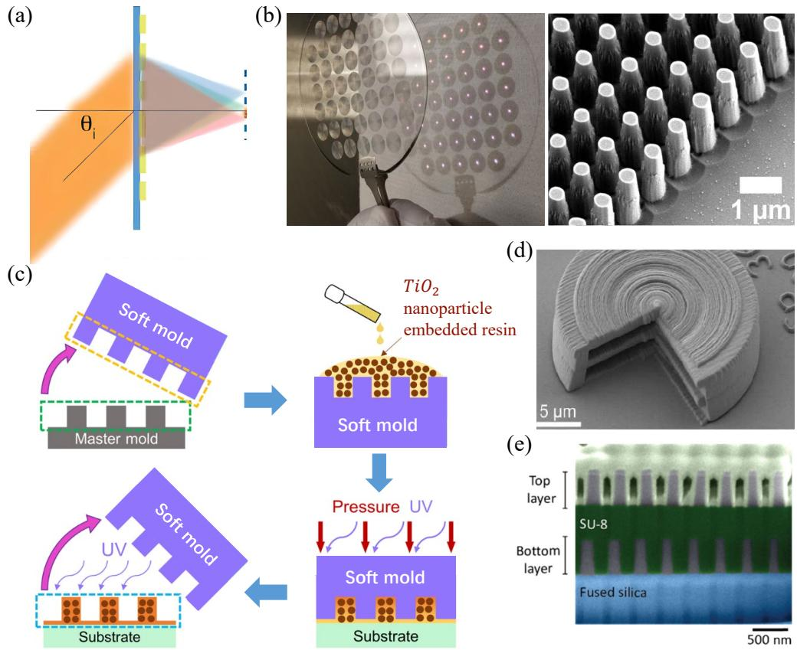

The basic design process of metasurface. (a) Schematic of the superposition of metasurface functions. (b) Left: photograph of 45 fabricated metalenses fabricated using photolithography on a 4-in. diameter $SiO_{2}$ wafer. Right: tilted SEM view of meta-atoms of the metalens. (c) Schematic of the one-step fabrication process based on nanoimprint lithography. (d) SEM of a 3D-printed three-layer metasurface. (e) SEM of a bilayer metasurface from the cross-sectional view. (a) Adapted with permission from Shaltout et al., Science 365, 374–377 (2019) [367]. Copyright © 2019 American Association for the Advancement of Science. (b) Adapted with permission from Park et al., Nano Lett. 19, 8673–8682 (2019) [368]. Copyright © 2019 American Chemical Society. (c) Adapted with permission from Kim et al., Laser Photonics Rev. 16, 2200098 (2022) [369]. Copyright © 2022 WILEY-VCH Verlag GmbH & Co. KGaA, Weinheim. (d) Reprinted from [3] under a Creative Commons license. (e) Reprinted with permission from Mansouree et al., Optica 7, 77–84 (2020) [191]. Copyright © 2020 Optica Publishing Group.

iting light, with the introduced phase distribution denoted as $\phi_{2}$ . In reality, a single metasurface introducing the phase distribution $\phi = \phi_{1} + \phi_{2}$ can achieve both functions simultaneously [367].

(III) Subsequently, choose an appropriate design method to realize the target electromagnetic response. Limited by the memory requirements and solution time of full-wave simulations, typically only the near-field response of the metasurface is calculated. When interested in the far-field (for example, to calculate the field intensity distribution at the focal plane of a metalens), scalar diffraction theory is often used to calculate the far-field from the near-field. Given its applicability range and computational accuracy, the Rayleigh–Sommerfeld diffraction theory is commonly employed to calculate the far-field distribution of the metasurface. The first kind of

Rayleigh–Sommerfeld diffraction integral formula is as follows [90]:

$$
E (\vec {r}) = \iint_ {\Sigma} E \left(\vec {r} ^ {\prime}\right) \left(\frac {1}{2 \pi \bar {r} + \frac {1}{i \lambda}}\right) \cos (\vec {n}, \vec {\bar {r}}) \frac {e ^ {i k \bar {r}}}{\bar {r}} \mathrm{d} s, \tag {157}
$$

where $\Sigma$ represents the diffracted field region, $\lambda$ and $k$ are the wavelength and wavenumber of light in the background medium, respectively, $\vec{r}$ is the spatial position vector of the observation point, $\vec{r}'$ is the spatial position vector of a point on the diffraction surface, $\vec{n}$ is the unit normal vector of the area element ds of this point on the diffraction surface, $\vec{\vec{r}} = \vec{r} - \vec{r}'$ , and $\vec{r} = |\vec{\vec{r}}|$ . When the distance between the observation point and the diffraction surface is sufficiently far, Eq. (157) can be approximated as

$$
E (\vec {r}) = \iint_ {\Sigma} E (\vec {r} ^ {\prime}) \frac {1}{i \lambda} \cos (\vec {n}, \vec {\bar {r}}) \frac {e ^ {i k \bar {r}}}{\bar {r}} \mathrm{d} s, \tag {158}
$$

(IV) After the design and simulation verification of the metasurface are completed, the layout file is generated for further manufacturing. The following factors should be considered comprehensively to choose the appropriate fabrication process: the shape complexity, minimum size, and precision requirement of the metasurface structure; the materials of the meta-atoms and the substrate; the aspect ratio; the size of the metasurface (the size determines the processing time, and for larger sizes, such as centimeter-level, the processing time of some fabrication techniques may be unacceptable); whether mass production is required; etc.

High-quality fabrication is crucial for ensuring the consistency of metasurface performance between simulations and actual measurements. For instance, in 2024, Johansen et al. [370] employed EBL to fabricate a series of metalenses operating at 940 nm with NA ranging from 0.08 to 0.93 and discovered that nanoscale precision and control within the manufacturing pipeline could bridge the efficiency gap between simulations and experimental outcomes, particularly for metalenses with lower NAs.

Given the significance of the fabrication process, it is wise to incorporate manufacturability considerations into the design phase to develop metasurface structures that are resilient to fabrication-induced imperfections:

(1) Adopting meta-atom geometries with inherent fabrication robustness. For instance, in 2021, Kühne et al. [371] compared three types of quasi-symmetry-protected BIC metasurface unit cells: tilted ellipses, asymmetric double rods, and split rings. The Q-factor of these high-Q-factor metasurfaces is highly sensitive to geometrical deviations. Among the configurations, all-dielectric tilted ellipses exhibited the highest Q-factors across a wide range of geometric variations, highlighting their superior robustness.  
(2) Robust metasurface design via topology optimization. Topology optimization can enhance robustness by explicitly incorporating fabrication-induced perturbations—such as geometric erosion and dilation—into the iterative optimization algorithm. This approach has been shown to yield metasurfaces that maintain performance under fabrication variability $[372,373]$ .  
(3) Machine learning-assisted robust metasurface design. Machine learning offers a powerful tool to account for fabrication tolerances in metasurface design [374]. As discussed in Subsection 3.4, machine learning models are categorized as forward or inverse models. Forward models can be integrated with optimization algorithms to efficiently explore the design space and identify robustconfigurations

[375,376]. Additionally, they can be used to construct large meta-atom databases significantly faster than traditional full-wave simulations, facilitating the selection of fabrication-tolerant geometries [377]. Inverse models, on the other hand, can incorporate robustness criteria directly into their training loss functions to generate metasurface designs that are resilient to fabrication imperfections [378].

Below, we briefly introduce the mainstream metasurface fabrication methods.

(i) Photolithography utilizes a photon beam to transfer the pattern from a mask to the photoresist, offering short production times and low costs once the mask is prepared. It is promising for industrial-scale mass production of large-area metasurfaces. The achievable feature size depends on the sophistication of the lithography equipment. It's essential to note that resists are generally not accepted as meta-atom materials due to their low refractive index (unless through specific designs $[379]$ ), so transferring the pattern from the resist to the meta-atom layer is usually required by additional processing steps, such as direct etching $[158]$ , lift-off $[174,380]$ , or hard mask etching $[381,382]$ . In 2019, as shown in Fig. 22(b), Capasso's group $[368]$ successfully used deep ultraviolet (DUV) lithography to fabricate 45 all-glass metalenses on a fused-silica wafer with a diameter of 4 inches. These metalenses, composed of $SiO_{2}$ pillars with a height of 1.5 $\mu$ m, operate at a wavelength of 633 nm, each with a diameter of 1 mm and an NA of 0.1. In 2023, Ni's group $[383]$ used DUV lithography to fabricate an a–Si metalens with a diameter of 80 mm, achieving a peak absolute focusing efficiency of 80.84% at the wavelength of 1450 nm (with an effective focusing area diameter appropriately 3–5 times the FWHM of the focal spot). In 2024, Capasso's group $[384]$ employed DUV lithography to fabricate an all-glass metalens in the visible spectrum, comprising 18.7 billion nanostructures. This metalens features a diameter of 100 mm and a fast f-number (f/1.5, NA = 0.32).  
(ii) Nanoimprint lithography (NIL) is a pattern transfer method through mechanical deformation, which is emerging as an alternate manufacturing method for large-scale production due to its low cost and high throughput. NIL transfers the metasurface structure pattern of a prefabricated mold onto the resist, such as the curable liquid polymer, which is then solidified under certain pressure using heat or UV light. Because the refractive index of typical resists is too low for use as meta-atoms, additional processing is usually required to transfer the patterns from the resist to the meta-atom layer $[385]$ . It is worth noting that slight etching of the resist pattern can remove any residue, making it suitable for lift-off processes. However, the patterned resist itself can serve as the final metasurface when specialized resists are used—such as $TiO_{2}$ -nanoparticle-embedded resin [as shown in Fig. 22(c)] $[117,369]$ —or when the printed resin nanostructures are coated with a thin layer of high-index material $[386]$ . This approach eliminates the need for additional pattern transfer steps. Although the achievable aspect ratio with NIL is generally low due to the impact of shear stress exerted on the nanostructures by the mold $[387]$ , it can be enhanced with process optimizations. For instance, in 2023, Choi et al. $[387]$ demonstrated a centimeter-scale metalens design with an aspect ratio of 5.8, fabricated by NIL using a water-soluble mold made from polyvinyl alcohol.  
(iii) Electron beam lithography (EBL) and focused ion beam (FIB), both maskless lithography techniques that rely on point-by-point scanning, allow a feature size on the order of 10 nm but are time-consuming, low-throughput, and costly, making them primarily suitable for lab-scale prototype verification. EBL can only etch structures on low-refractive-index resists, so subsequent processes must be followed to transfer patterns from resist to meta-atom layer. FIB can directly etch hard metals $[388]$ and dielectric materials $[389]$ with support for freeform surface patterning $[389]$ , at the cost of a higher expense and a lower processing efficiency $[390]$ .

(iv) Direct laser writing (DLW) uses the scanning of a focused laser beam to change the properties of materials, thereby achieving specific structures. It is known for its low cost, flexibility, and capability for large-area fabrication. Among various DLW technologies, 3D laser printing technology based on two-photon polymerization $[391]$ is the most widely used in the fabrication of both single-layer metasurfaces $[392]$ and cascaded metasurfaces $[3]$ . For example, a three-layer metasurface fabricated with this technology is shown in Fig. 22(d). Compared to traditional single-photon polymerization technology, it allows the feature size to be reduced from 1 $\mu$ m to about 200 nm. Its main advantage lies in allowing a high aspect ratio and even supporting the processing of structures that break out-of-plane symmetry $[393]$ .

(v) Additionally, new fabrication methods are continuously emerging, such as self-assembly lithography [394,395], laser ablation [396], etc., which are not covered here. For a detailed introduction to metasurface manufacturing, see references [397-399].

(vi) For cascaded metasurfaces, except for DLW methods, there are generally two fabrication strategies: one is to align multiple metasurface layers during fabrication $[186,191]$ ; the other is to fabricate each layer of the metasurface separately and then align and bond them together $[187,188]$ . For the former approach, when the interlayer distance is small, as shown in Fig. 22(e), a common practice is that, after fabricating the bottom metasurface layer, an interlayer material is introduced through methods such as spin-coating $[191]$ and film deposition $[186]$ , and its surface is polished before continuing with the fabrication of the upper metasurface layer. For larger interlayer distances, the substrate thickness can be controlled to match the interlayer distance, and each layer of the metasurface can be directly fabricated on the respective sides of the substrate $[184,185]$ . A common practice to align between layers is to fabricate specific alignment marks additionally outside the metasurface structure $[185,191]$ . The limit of interlayer alignment error is approximately in the order of tens of nanometers $[191]$ .

# 3.2. Forward Design Method

# 3.2.1. Locally Periodic Approximation and Forward Design Method

When solving for the electromagnetic response of a meta-atom in Subsection 2.1, the periodic boundary condition is assumed. This assumption implies that all surrounding meta-atoms have identical structures. As a result, the influence of adjacent meta-atoms—which may differ in an actual inhomogeneous metasurface—is neglected in the meta-atom's electromagnetic response characteristics. This approximation is known as the locally periodic approximation (LPA).

In the traditional forward design strategy, the metasurface is divided into units or unit cells arranged periodically, which are typically in the shape of a square or a hexagon with a fixed lattice constant to cover the entire surface. For square or hexagonal units, the lattice constant is often defined as the side length, also referred to as the unit cell size or unit size. The simulation boundary condition for the meta-atoms should be matched to the lattice of the metasurface. A meta-atom, selected from a pre-constructed database based on iterative adjustments of structural parameters, is placed at the center of each unit according to the desired electromagnetic modulation.

When the coupling between adjacent meta-atoms is neglected under the LPA, the overall electromagnetic response of the metasurface to incident light is equivalent to the concatenation of the local electromagnetic responses of all the meta-atoms. It is important to note that when combining the near-field responses of the meta-atoms to derive the overall near-field response of the metasurface for further analysis, it is preferable

not to approximate the near-field distribution of a single meta-atom as a uniform field determined solely by the amplitude transmission coefficient t and phase shift $\phi$ , as often done in theoretical analyses. Instead, one should use the near-field distribution within the meta-atom region calculated under the periodic boundary condition for a more accurate approximation [370,400].

It is important to note that the core feature of the forward design method is the construction of the meta-atom database. In contrast, for the inverse design methods introduced in Subsections 3.3 and 3.4, constructing a meta-atom database is not necessary. Instead, the meta-atom design for the desired electromagnetic modulation is obtained directly through optimization algorithms or neural networks. While LPA serves as the foundation for the forward design method, inverse design methods can also leverage LPA to facilitate large-area metasurface design $[401]$ .

In the discussion above, each metasurface unit contains only a single meta-atom at its center. It is worth noting that unit cells consisting of multiple meta-atoms can significantly enhance the design flexibility, enabling more complex metasurface configurations. This approach will be explored further in Section 5.

# 3.2.2. Limitations of the Forward Design Method

Although the forward design method is the most commonly used approach for various types of metasurface devices, it may introduce certain limitations on design freedom and device performance $[402]$ .

(I) Discretization and sampling of continuous wavefront modulation. The target electromagnetic response of various types of devices, such as the lens, varies continuously in space. Under the LPA, the size of the metasurface unit determines the spatial sampling rate of the discretized electromagnetic response introduced by the metasurface. When the sampling of the metasurface is insufficient relative to the spatial variation of the target electromagnetic response, it can lead to significant performance degradation $[403]$ .  
In 2020, Chung et al. [403] theoretically calculated the efficiency limit of forward-designed metalenses under the LPA. By employing modal decomposition analysis, they calculated the ratio of the field intensity at the focal point of a forward-designed metalens, which is characterized by a specific operating wavelength, lattice constant, and NA, to the field intensity at the focal point of an ideal lens. This ratio is defined as the upper limit of focusing efficiency. Reasons for the limit include, but are not limited to, the effect of insufficient spatial sampling for the target phase profile mentioned above. Mathematically, this limit arises because, for the forward-designed metalens, the ideal outgoing light field distribution on each unit is non-periodic and cannot be perfectly represented by its periodic diffraction orders. The upper limits of focusing efficiency for metalenses with different NAs are shown in Fig. 23, where the maximum focusing efficiency drastically decreases as the NA increases. Utilizing inverse design methods that optimize multiple units or even the entire metasurface simultaneously could potentially break through this performance limitation.  
(II) Neglecting the effect of coupling between adjacent meta-atoms. From the perspective of mode analysis, the limitation of the LPA lies in neglecting the impact of modes that span the space between adjacent meta-atoms, also known as the coupling between adjacent meta-atoms, which must be considered in many cases.  
(i) When the difference between target phase shifts of two adjacent units is large, the corresponding difference in shape, size, or rotation angles of adjacent

Figure 23  
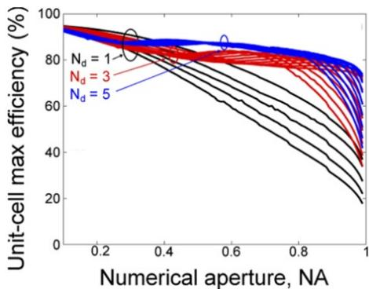

line

| Numerical aperture, NA | Nd=1 (Efficiency %) | Nd=3 (Efficiency %) | Nd=5 (Efficiency %) |
| --- | --- | --- | --- |
| 0.1 | ~94 | ~94 | ~94 |
| 0.2 | ~92 | ~92 | ~92 |
| 0.3 | ~88 | ~88 | ~88 |
| 0.4 | ~82 | ~82 | ~88 |
| 0.5 | ~75 | ~80 | ~86 |
| 0.6 | ~68 | ~78 | ~84 |
| 0.7 | ~60 | ~72 | ~82 |
| 0.8 | ~50 | ~65 | ~78 |
| 0.9 | ~38 | ~50 | ~70 |
| 1.0 | ~18 | ~35 | ~45 |

The focusing efficiencies of the forward-designed metalenses with different NAs. The diameter of the metalens is 100 times the wavelength. $N_{d}$ is the number of diffraction orders per unit. Reprinted with permission from Chung and Miller, Opt. Express 28, 6945–6965 (2020) [403]. Copyright © 2020 Optica Publishing Group.

meta-atoms is always significant. In this case, the premise of the LPA no longer holds, leading to significant discrepancies between the actual introduced phase shifts and the target values. Large phase gradients are often unavoidable for applications such as high-NA lenses, wide-FOV holograms, etc. (refer to Sections 4 and 5); thus, the forward design approach will inherently impose limitations on device performance.

(ii) For high-refractive-index dielectric meta-atoms, examination of the near-field coupling shows that enhancing the effective magnetic response by changing the distance between meta-atoms can be used to control electromagnetic response characteristics [404].  
(iii) In general, for metasurfaces operating under off-axis illumination, the larger the angle of incidence, the poorer the locality of the meta-atom's interaction with light, and the stronger the coupling between adjacent meta-atoms. This angle-dependent electromagnetic response characteristic, typically undesirable in traditional forward design strategies (see the design of wide-FOV metalenses in Subsection 4.3 as an example), is extensively utilized in nonlocal metasurfaces [197]. For more details on nonlocal metasurfaces, refer to Subsection 2.2.2.  
(iv) For high-Q-factor metasurfaces, the introduction of a nonlocal resonant mode to achieve a large Q-factor results in strong coupling between adjacent meta-atoms. Consequently, the Q-factor becomes highly sensitive to variations in individual meta-atoms within the meta-atom array. A detailed discussion on high-Q-factor metasurfaces is provided in Subsection 2.2.3.

In recent years, the coupling between meta-atoms has gradually gained attention, and novel metasurface devices based on this have been developed $[209,238,405]$ . In addition, advanced design methods that incorporate the coupling into consideration through optimization-based inverse design methods $[204,343]$ or deep learning $[406]$ have emerged, giving rise to a variety of metasurface designs with novel functionality or high performance. Related works will be introduced in Sections 3.3 and 3.4.

# 3.3. Inverse Design Methods Based on Optimization Theory

# 3.3.1. Overview of Inverse Design in Metasurface Optimization

In the context of optimization, the design for a metasurface can be treated as a mathematical optimization problem that can be formally stated as [407]

$$
\begin{array}{l} \max _ {\epsilon (\vec {r}), \mu \mathrm{m} (\vec {r})} \quad F \left(\vec {E} (\vec {r}), \vec {H} (\vec {r})\right) \\ \text {subject to} \quad \vec {\nabla} \cdot \epsilon (\vec {r}) \vec {E} (\vec {r}) = \rho (\vec {r}), \\ \vec {\nabla} \cdot \mu \mathrm{m} (\vec {r}) \vec {H} (\vec {r}) = 0, \tag {159} \\ \vec {\nabla} \times \vec {E} (\vec {r}) = - i \omega \mu \mathrm{m} (\vec {r}) \vec {H} (\vec {r}), \\ \vec {\nabla} \times \vec {H} (\vec {r}) = \vec {J} (\vec {r}) + i \omega \vec {E} (\vec {r}), \\ \end{array}
$$

...

where $\omega$ is the incident light's angular frequency, $\vec{r} = x\vec{e}_x + y\vec{e}_y + z\vec{e}_z$ , $\rho(\vec{r})$ and $\vec{J}(\vec{r})$ are the spatial distributions of charge density and current density, respectively, and the optimization variables $\epsilon(\vec{r})$ and $\mu \mathrm{m}(\vec{r})$ are the spatial distributions of permittivity and permeability across the metasurface, respectively, the optimization objective $F$ is defined by the device's functional requirements and generally can be expressed as a function of the electromagnetic response of the metasurface, i.e., the electric field strength $\vec{E}(\vec{r})$ and magnetic field strength $H(\vec{r})$ . The relation between the permittivity and permeability distributions and the electromagnetic response follows the constraints set by Maxwell's equations. Given the limitations of natural materials and manufacturing processes, $\epsilon(\vec{r})$ and $\mu \mathrm{m}(\vec{r})$ are further subjected to other constraints.

In practical designs, the material for the metasurface can often be determined first. When disregarding multilayer metasurfaces to ignore changes in material properties in the z-direction, the spatial distributions of permittivity and permeability can be directly determined by a 2D distribution function $\mathcal{B}(x,y)$ of the meta-atom material, where a function value of 1 indicates the presence of material at the location $(x,y)$ , and a value of 0 indicates its absence. In practice, this function $\mathcal{B}(x,y)$ is subject to various degrees of simplification, leading to different types of metasurface designs with specific expressions for the metasurface structural parameter vector $\vec{p}=[p_{1} p_{2} \cdots p_{i} \cdots p_{N}]$ and different methods for solving the optimization problem.

(i) As illustrated in Figs. 24(a) and 24(b), when employing finite elements with the feature size around the $10^{-2}\lambda$ scale to discretize the material distribution and directly designing the material's topology structure, this approach, namely topology optimization, allows for the highest degree of design freedom [410].  
(ii) As shown in Figs. 24(c) and 24(d), when discretizing the metasurface into a pixel array with the pixel feature size around the $10^{-1}\lambda$ scale, where pixels are the smallest structural units of the metasurface with only filled and unfilled states (here, “filled” can be interpreted in two ways, corresponding to two types of pixelated metasurfaces: one where the metasurface material completely fills the pixel space [411,412], and the other where a meta-atom with fixed shape and size is placed at the pixel position [409]), this type of metasurface is known as the pixelated metasurface.  
(iii) As depicted in Figs. 24(e) and 24(f), mimicking forward design by introducing the concept of meta-atoms for structural division of the metasurface, but instead of creating a database by traversing structural parameters, this method uses optimization techniques for the design of the shape and size of meta-atoms. More importantly, the design region is no longer confined to individual meta-atoms but is allowed to extend to an array of meta-atoms or even the entire metasurface,

Figure 24  
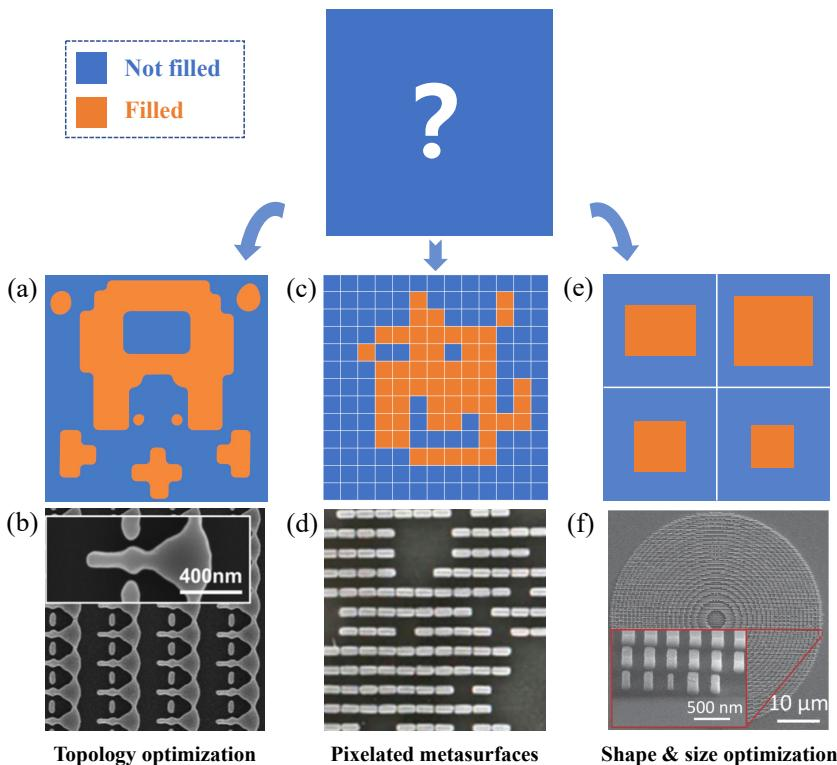

Schematics of inverse design methods based on the optimization theory (a), (c), (e) and the SEMs of the corresponding metasurface designs (b), (d), (f). (b) Adapted with permission from Sell et al., Nano Lett. 17, 3752–3757 (2017) [408]. Copyright © 2017 American Chemical Society. (d) Adapted with permission from Jin et al., ACS Nano 13, 821–829 (2019) [409]. Copyright © 2019 American Chemical Society. (f) Adapted with permission from Mansouree et al., ACS Photonics 8, 455–463 (2021) [343]. Copyright © 2021 American Chemical Society.

which takes into account the coupling between adjacent meta-atoms, thus effectively expanding the design space $[413]$ . For simplicity, we refer to this kind of optimization directly as shape optimization later.

# 3.3.2. Techniques for Solving Metasurface Optimization Problems

To solve the optimization problem of metasurface design, there are mainly two types of methods: gradient descent methods and heuristic algorithms. The former are local optimization algorithms, while the latter include both global optimization algorithms, such as genetic algorithms, and local optimization algorithms, such as the simulated annealing algorithm. A common reproach for gradient descent methods is that they can only obtain local optimum solutions. However, it's important to note that global optimization algorithms like genetic algorithms also do not guarantee a global optimum solution. In fact, given the complex non-convex nature of the optimization problem in metasurface inverse design, no optimization algorithm can guarantee a global optimum solution. Instead, these algorithms can only iteratively approximate the optimum solution. Furthermore, employing mature gradient descent algorithms like the Adam (adaptive moment estimation) algorithm $[414]$ , or applying neural network technology $[415]$ (which will be further introduced in Subsection 3.4.2), can help gradient optimization algorithms escape from local optima and saddle points, thereby improving optimization results and accelerating convergence.

(I) Gradient descent methods require calculating the gradient of the objective function F with respect to the metasurface structural parameter $p_{i}$ , represented as $\frac{\partial F}{\partial p_{i}}$ . After acquiring the gradient information, structural parameters are updated based on the gradient descent algorithm to progressively approach the optimal configuration of the metasurface. Four primary methods for gradient calculation are outlined below.  
(i) The finite difference method is the simplest approach, whose gradient formula is

$$
\frac {\partial F}{\partial p _ {i}} = \frac {F \left(p _ {1} , p _ {2} , \dots , p _ {i} + \Delta p , \dots , p _ {N}\right) - F \left(p _ {1} , p _ {2} , \dots , p _ {i} , \dots , p _ {N}\right)}{\Delta p}, \tag {160}
$$

where $\Delta p$ is a small perturbation of structural parameter $p_{i}$ . It can be seen that the gradient of each structural parameter is calculated by simulating the metasurface additionally after applying a small increment $\Delta p$ to that parameter, thus requiring $N + 1$ simulations to solve all gradients. This method is time-consuming due to the computational burden of electromagnetic simulations, making it suitable only for small-area metasurface optimizations. In practice, it is mainly used for fine-tuning the forward design result to enhance device performance [416,417].

(ii) The adjoint method is the most widely used approach for solving gradients. It can be seen from Eq. (159) that metasurface optimization is a type of optimization problem constrained by partial differential equations, for which the adjoint method is particularly well-suited [418]. By conducting one additional special adjoint simulation on top of the normal forward simulation for the metasurface with current structural parameters, gradients of the objective function with respect to all structural parameters can be obtained. This method has a very high gradient solving speed, and the maximum area of the metasurface that can be optimized is only limited by the capability of electromagnetic simulation software. Up to now, the adjoint method has been widely used in the topology optimization [419] and the shape optimization for metasurfaces with rectangular meta-atoms [343]. More specifically, within these two methodologies, the optimization variable for the latter is the size parameters describing the shape of the meta-atoms, while the optimization variable for the former is the dielectric constant distribution $\epsilon(x,y)\in\left[\epsilon_{\mathrm{cladding}},\epsilon_{\mathrm{meta}}\right]$ of the metasurface, where $\epsilon_{\mathrm{meta}}$ and $\epsilon_{\mathrm{cladding}}$ are dielectric constants for the meta-atom material and the material encapsulating the meta-atoms, respectively. Additional algorithmic processing [420] should be applied to gradually converge this distribution to reasonable values of $\epsilon_{\mathrm{meta}}$ or $\epsilon_{\mathrm{cladding}}$ .

As shown in Fig. 25(a), by introducing the level set function $\Phi(x,y)$ , where the boundary of $\Phi(x,y) \geq 0$ defines the cross-sectional shape contour of the meta-atom, adjoint method can be further extended to support meta-atoms with freeform cross-sectional shapes [421]. To our knowledge, there are currently no instances of the adjoint method being applied to pixelated metasurfaces, but there is no theoretical barrier to its application.

(iii) Automatic differentiation is a powerful and popular technique for solving partial derivatives. Gradients can be derived using electromagnetic solvers integrated with automatic differentiation frameworks. With this approach, a single forward simulation allows for the calculation of gradients of the objective function with respect to all structural parameters via backward propagation. Developing a comprehensive electromagnetic simulation tool based on automatic differentiation for metasurface design is indeed challenging. Nonetheless, preliminary efforts have been made in this direction $[424,425]$ . For example, in 2021, Colburn and Majumdar $[425]$ developed an RCWA solver using TensorFlow, a widely used automatic differentiation framework. This advancement facilitates flexible shape and topology optimization for various multilayer and multifunctional metasurface devices.

Figure 25  
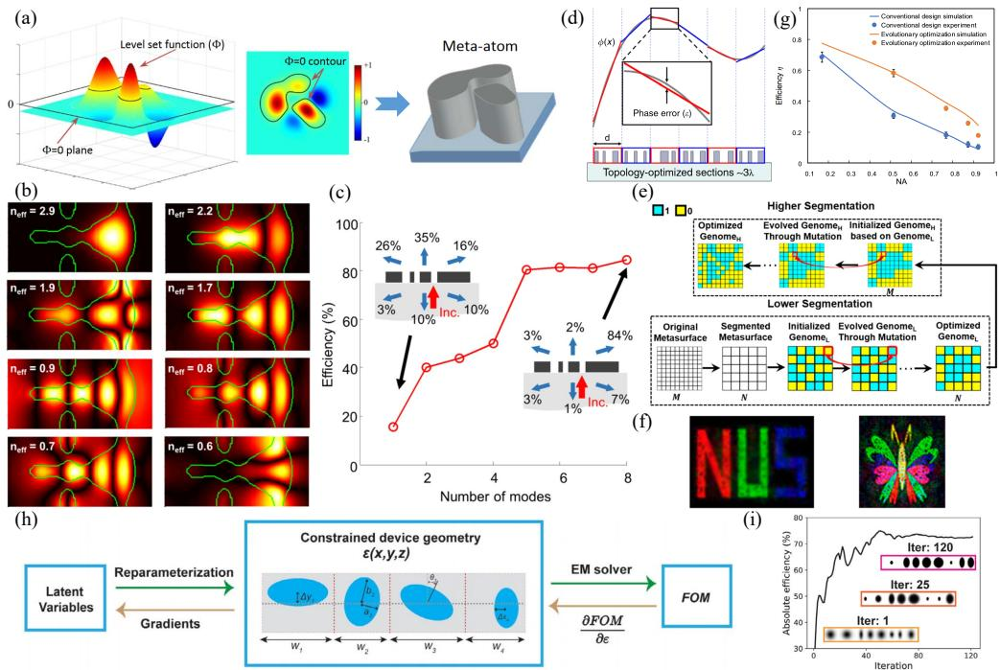

Inverse design methods based on the optimization theory and their applications. (a) Schematic of the level set function defining the shape of the meta-atom. (b) Amplitude distributions of the magnetic field strength of eight propagation modes of the topology-optimized meta-atom. The effective refractive index corresponding to the mode is marked in the upper left corner of each picture, and the outlines of the meta-atom are drawn in green. (c) Plot of the deflection efficiency of the topology-optimized metagrating as a function of the number of modes (the modes are added in the order of decreasing the effective refractive index). (d) Schematic of the section-by-section topology optimization algorithm. (e) Schematic of the algorithm for segmented hierarchical design of pixelated metasurfaces. (f) Experimental holographic images of two full-color holograms based on the pixelated metasurface. (g) Comparison of focusing efficiencies of metalenses with different NAs designed through forward and inverse design methods. (a) Adapted with permission from Mansouree and Arbabi, International Applied Computational Electromagnetics Society Symposium (2019) [421]. Copyright © 2019 International Applied Computational Electromagnetics Society Symposium. (b) and (c) Reprinted with permission from Sell et al., Nano Lett. 17, 3752–3757 (2017) [408]. Copyright © 2017 American Chemical Society. (d) Reprinted from [422] under a Creative Commons license. (e) and (f) Adapted with permission from Jin et al., ACS Nano 13, 821–829 (2019) [409]. Copyright © 2019 American Chemical Society. (g) Reprinted from [204] under a Creative Commons license. (h) and (i) Reprinted with permission from Zhou et al., Laser Photonics Rev. 18, 2300988 (2024) [423]. Copyright © 2024 WILEY-VCH Verlag GmbH & Co. KGaA, Weinheim.

(iv) Surrogate models have been proposed recently to replace traditional electromagnetic solvers for forward simulation, based on interpolation methods $[426]$ or neural networks $[427]$ . These models offer rapid solutions and differentiability, thus not only accelerating the solution process but also facilitating the easy acquisition of gradient information via direct derivation or automatic differentiation. This approach is also referred to as the adjoint method in some studies for metasurface shape optimization $[426,428,429]$ . Actually, the surrogate model is obtained through interpolation, fitting,

or machine learning methods based on a database of meta-atoms, which generally cannot take into account the coupling between meta-atoms. This results in significant differences in design degrees of freedom between shape optimizations based on the surrogate model and adjoint method. Nonetheless, the shape optimization based on surrogate models can outperform forward design methods in certain scenarios. For example, its advantages in rapid solution and differentiability enable end-to-end design for metasurface holograms, making multi-wavelength designs feasible even in limited design spaces [429]. Surrogate models will be further discussed in Subsection 3.4.1.

(II) Heuristic algorithms, unlike gradient descent methods, do not rely on gradient information and are essentially search methods based on certain intelligent strategies. The heuristic algorithms commonly used in metasurface design include particle swarm optimization $[430]$ , genetic algorithms and their variants such as the differential evolution algorithm $[431]$ , among others. Compared to gradient descent methods that leverage gradient information to converge after relatively few iterations, heuristic algorithms, while avoiding the need for gradient calculation, tend to converge more slowly and often require a great number of electromagnetic simulations. This issue becomes more severe with an increase in optimization variables. Therefore, heuristic algorithms are generally used for small-area pixelated metasurfaces $[409,432]$ , and for the shape optimization of small-area metasurfaces with metasurface sizes typically around several tens of micrometers $[204]$ . Using surrogate models instead of traditional electromagnetic solvers for simulation can help the algorithm converge in less time due to their faster solution speed $[412]$ .

# 3.3.3. Progress in Inverse Design Methods Based on Optimization Theory

Below, we briefly review representative works in various types of inverse-designed metasurfaces.

(I) In the design of topology-optimized metasurfaces, the adjoint method is generally employed to solve for gradients, with detailed optimization theories available in references $[420,433,434]$ . In this field, significant contributions have been made by Fan's group $[372,408,415,419,422,435]$ , Johnson's group $[339,401,436]$ , and others over time. In 2017, Sell et al. $[408]$ demonstrated a metagrating supporting freeform meta-atom designs through topology optimization. The metagrating, made of poly–Si meta-atoms, operated at a wavelength of 1050 nm, exhibiting the diffraction angle up to $75^{\circ}$ with absolute deflection efficiencies (defined as the ratio of the power of the deflected beam at the diffraction angle to the power of the incident light through the substrate) of 75% and 74% for perpendicularly incident light polarized along the x and y axes, respectively. The meta-atom supports eight propagating Bloch modes, with the mode field distribution for perpendicularly incident light polarized along the x axis shown in Fig. 25(b). As depicted in Fig. 25(c), a single mode cannot effectively deflect the incident light to the specified direction, but the interference of all modes can achieve this, explaining the origin of high performance of topology-optimized devices. Topology optimization can also be applied to the design of multifunctional metagratings for wavelength multiplexing, which deflect perpendicularly incident light of M different wavelengths into M distinct angles. These designs achieve average absolute deflection efficiencies at the level of $\frac{1}{\sqrt{M}}$ , far surpassing the typical benchmark of $\frac{1}{M}$ set by current advanced designs $[435]$ . These designs are limited to homogeneous metasurfaces, mainly because topology optimization requires a large number of computational resources, with computational load increasing significantly with the size of the metasurface to be optimized, thus limiting its application to small-area designs. In 2019, to facilitate the design of large-area topology-optimized metasurfaces, Phan et al. $[422]$ introduced a computationally efficient design algorithm, as

shown in Fig. 25(d). The target phase distribution is spatially divided into linear regions on the scale of wavelengths, with the metasurface structure of each region designed through topology optimization before being stitched together. Using c–Si as the meta-atom material, 1D metalenses of 200 $\mu$ m width with NAs of 0.2, 0.5, and 0.8 were designed, achieving a relative focusing efficiency of over 89% and absolute focusing efficiency of over 67% for the TM-polarized light at the wavelength of 640 nm.

(II) Pixelated metasurfaces are usually designed using heuristic algorithms, facing limitations related to device size: as the design space increases with device size, the number of iterations required for optimization convergence and the computational cost of full-wave simulations increase significantly. To address this issue, in 2019, Jin et al. [409] proposed conducting the optimization process in phases from low to high resolution, where low resolution refers to using a larger pixel size and high resolution the opposite. The algorithm's schematic is shown in Fig. 25(e). Once the metasurface design at low resolution converges, it is used as the initial structure for the optimization at the high-resolution phase, thereby accelerating the convergence of the metasurface optimization at high resolution. By utilizing the strategy of spatial multiplexing, designs of pixelated metasurfaces for multiple wavelengths are interlaced (for more details and applications of the spatial multiplexing strategy, see Subsection 5.2), achieving the full-color metasurface hologram. The experimental holographic images of two such metasurface holograms are shown in Fig. 25(f). In recent years, machine learning has started to be applied in the design of pixelated metasurfaces. In 2021, Zhu et al. [437] implemented an inverse model based on transfer learning networks, which can directly generate the structure of pixelated meta-atoms from the target phase. In 2021 and 2024, Zhang et al. [412] and Chen et al. [438] relatively applied a surrogate model to accelerate the optimization of pixelated metasurfaces using genetic algorithms. These efforts help to explore the design space more efficiently and effectively shorten the design cycle of pixelated metasurfaces.

(III) For shape-optimized metasurfaces, both heuristic algorithms and gradient descent methods based on the adjoint method can be used for optimization, with the latter offering faster convergence and supporting larger device sizes. In 2020, Cai et al. [204] utilized the traditional forward design method and the evolutionary optimization method based on genetic algorithms to design a set of metalenses with different NAs. The metalenses are composed of cylindrical $TiO_{2}$ meta-atoms and operate at a wavelength of 532 nm. As shown in Fig. 25(g), the simulation and experimental comparison results regarding focusing efficiency (the focusing efficiency is defined as the focal spot power divided by the glass background power of the same size as the metalens), highlighted the superiority of inverse design, although the device diameter is limited to tens of micrometers. In 2021, Mansouree et al. [343] applied the gradient descent method based on adjoint method to the design of metasurfaces using rectangular a–Si pillar meta-atoms with a height of 430 nm. The experiment demonstrated a metalens operating at a wavelength of 840 nm, with a diameter of 50 $\mu$ m and an NA as high as 0.94. The absolute focusing efficiency (with an effective focusing area diameter of 7 $\mu$ m) was 49%, which was higher than the 43% achieved by the forward-designed metalens under identical conditions. In 2024, Bao et al. [439] further extended the applicability of this algorithm from non-rotatable rectangular pillar meta-atoms to rotatable polygonal pillar meta-atoms, thus capable of optimizing metasurfaces based on the hybrid phase modulation mechanism. Based on this method, they experimentally demonstrated a dual-focus metalens multiplexing orthogonal circular polarization states, with an NA of 0.65 and a focal length of 20 $\mu$ m. Operating at a wavelength of 940 nm, the metalens exhibited a average absolute focusing efficiency (with an effective focusing area diameter six times the FWHM of the focal spot) for LCP and RCP light of 58.81%. Another application of this method

is the multilayer metasurface design [191] introduced in Subsection 2.2.1. Compared to topology optimization, despite this method's lower design degrees of freedom, the shape of the meta-atoms is controllable and easier to fabricate, and the computational costs are slightly lower, thus supporting larger-area metasurface designs.

Counterintuitively, topology optimization can also facilitate the design of metasurfaces based on the shape optimization. This provides a new avenue for gradient optimization of metasurfaces made from meta-atoms with shapes that do not lend themselves to straightforward gradient calculation formulas of the adjoint method. This algorithm was proposed by Fan's group in 2024 [423], and was used for optimizing metasurfaces consisting of elliptical cylindrical meta-atoms for validation. The algorithm schematic is shown in Fig. 25(h). Characterizing the size and position of all meta-atoms by introducing a set of latent variables $p_1, p_2, \ldots, p_i, \ldots, p_N$ , the dielectric constant distribution $\epsilon(x, y)$ of the metasurface can be expressed as a function of these latent variables, denoted as $\tilde{\epsilon}(p_1, p_2, \ldots, p_i, \ldots, p_N)$ . By the chain rule of differentiation, the gradient of the optimization objective function $F$ with respect to the latent variable $p_i$ can be expressed as

$$
\frac {\partial F}{\partial p _ {i}} = \frac {\partial F}{\partial \tilde {\epsilon}} \frac {\partial \tilde {\epsilon}}{\partial p _ {i}}, \tag {161}
$$

where the first term on the right side represents the gradient of the objective function with respect to the dielectric constant distribution, which can be obtained through topology optimization, and the second term on the right side can be solved through backpropagation using automatic differentiation, even if the expression of $\tilde{\epsilon}\left(p_{1},p_{2},\ldots,p_{N}\right)$ may be very complex. The optimization trajectory, as depicted in Fig. 25(i), shows that an initial solution of random dielectric cylinders with varying gray levels quickly converges to an optimized solution of elliptical cylindrical meta-atoms.

# 3.4. Design Methods Based on Machine Learning

Machine learning in metasurface design primarily falls into two categories: first, substituting traditional electromagnetic simulation software to solve Maxwell's equations for specific cases (for instance, calculating the visible transmittance spectrum of cylindrical meta-atoms), and second, generating metasurface structural designs directly from design objectives $[440–442]$ . The former deals with the forward problem of relating specific structures to their optical responses, while the latter tackles the inverse problem of deducing unknown structures from desired optical responses. For convenience, these two types of machine learning models are respectively termed as forward models and inverse models, with the forward model also referred to as the surrogate model mentioned in Subsection 3.3. Given a certain tolerance for error, multiple structures might correspond to the same optical response, hence, these two types of problems usually exhibit many-to-one and one-to-many mapping relationships between inputs and outputs, respectively.

The general workflow for both forward models and inverse models includes several key steps. First, based on the characteristics of the problem, determine the model inputs and outputs, and choose an appropriate model (for deep learning, consider which neural network architecture to employ). Second, use electromagnetic simulation software to prepare the training dataset (the size and composition of the training set may need to be further adjusted if the underfitting or overfitting issue is observed after training the model). Finally, train, validate, and fine-tune the model. According to the amount and type of supervision during training, machine learning can be categorized into

four main types: supervised learning, unsupervised learning, semi-supervised learning, and reinforcement learning $[443]$ . From an algorithmic strategy perspective, machine learning algorithms mainly consist of discriminative algorithms and generative algorithms, with their corresponding machine learning models known as discriminative models and generative models, respectively. Roughly speaking, for many-to-one forward problems, discriminative algorithms are suitable for learning the mapping relationship between metasurface structures and their optical responses; whereas for one-to-many inverse problems, generative algorithms are appropriate for learning the pattern characteristics behind metasurface structures to generate new structural designs $[402]$ .

# 3.4.1. Forward Models and Their Applications in Metasurface Design

Compared to full-wave electromagnetic simulation methods, surrogate models based on machine learning offer the significant advantages of rapid solution and differentiability. However, achieving accurate predictions is not trivial, and this presents the most critical challenge. The difficulty stems from the complex mapping relationship between the model inputs and outputs in practical applications, such as when the metasurface structure allows for complex variations or when a wide spectral range is considered.

In 2019, Nadell et al. [444] implemented a surrogate model for solving the transmittance spectrum of the metasurface supercell, which is depicted on the left side of Fig. 26(a). Here, a supercell, also known as a molecule, refers to the metasurface unit consisting of multiple adjacent meta-atoms, as opposed to the unit containing only a single meta-atom. Although each meta-atom only has two variables, i.e., radius and height, and the entire supercell has only eight variables, considering each variable can take 13 discrete values within a certain range, the supercell can have a vast number of possible geometric shapes ( $\sim8\times10^{8}$ ). This exemplifies the potential for the curse of dimensionality that can arise with an increase in the number of variables in machine learning [443]. By the way, this instance also illustrates the difficulty of the forward design method in building the supercell database for the unbearable computational cost. Moreover, due to resonant effects and the coupling between adjacent meta-atoms, the transmittance spectrum can exhibit sudden changes, as indicated by the black arrow in the rightmost panel of Fig. 26(a). Therefore, for the frequency range from 0.8 THz to 1.5 THz, it was necessary to set 2003 discrete sampling points to avoid overlooking abrupt changes due to a low sampling rate. The cost of this is a severe mismatch between the dimensions of the model input and output. Addressing this issue inevitably requires complex neural network architectures and relatively large training sets. The neural network architecture used is shown in Fig. 26(a), and the dataset covered $\sim21,000$ different geometries of supercell and their simulated spectra. Ultimately, the model achieved an average mean square error (MSE) of $1.16\times10^{-3}$ on the evaluation set.

In 2019, An et al. [445] trained a surrogate model to solve for the amplitude and phase spectra of cylindrical meta-atoms with varying radii, heights, dielectric constants, and lattice constants within the frequency range from 30 THz to 60 THz. As shown in the top panel of Fig. 26(b), the amplitude and phase spectra of these meta-atoms exhibit multiple abrupt changes due to resonant effects, especially the discontinuity of $\pi$ of the phase, posing significant challenges to accurate prediction. To address this issue, the model's output was changed from the amplitude and phase spectra to the spectra of the real and imaginary parts of the complex amplitude, as shown in the bottom panel of Fig. 26(b). This adjustment made spectra smoother and non-singular, allowing for a lower sampling rate for spectral sampling (requiring only 31 sampling points) and avoiding the problem of input and output dimension mismatch. With a simple network

Figure 26  
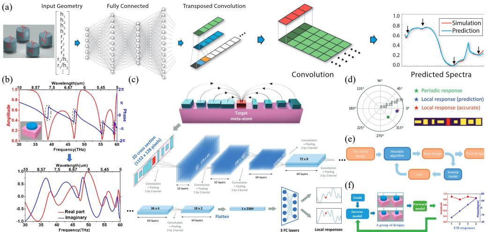

flowchart

```mermaid
graph LR
  A["Input Geometry"] --> B["Fully Connected"]
  B --> C["Transposed Convolution"]
  C --> D["Convolution"]
  D --> E["Predicted Spectra"]
  E --> F["The initial design"]
  F --> G["Heuristic algorithm"]
  G --> H["New design"]
  H --> I["Final design"]
  I --> J["Inverse model"]
  J --> K["A group of designs"]
  K --> L["Forward model"]
  L --> M["EM responses"]
```

Forward models and their applications in the inverse design of metasurfaces. (a) Schematic of the neural network architecture for predicting the transmittance spectrum of the supercell. (b) Top: the amplitude and phase distribution of a meta-atom. Bottom: the real and imaginary part distribution of the equivalent complex amplitude. (c) The neural network architecture of the surrogate model considering the coupling between meta-atoms. (d) Representation of the complex amplitudes in the polar graph of three types of meta-atom responses for a set of data randomly selected from the test set. (e) Schematic of the inverse design algorithm with the surrogate model based on the heuristic algorithm. (f) Schematic of the inverse design algorithm with the surrogate model based on the inverse model. (a) Adapted with permission from An et al., Opt. Express 27, 27523–27535 (2019) [444]. Copyright © 2019 Optica Publishing Group. (b) and (f) Adapted with permission from An et al., ACS Photonics 6, 3196–3207 (2019) [445]. Copyright © 2019 American Chemical Society. (c)–(e) Adapted with permission from An et al., Adv. Opt. Mater. 10, 2102113 (2022) [406]. Copyright © 2021 WILEY-VCH Verlag GmbH & Co. KGaA, Weinheim.

architecture comprising only several fully connected layers and a dataset with the size of 50,000, the model achieved a relative prediction error of 0.5% for both amplitude and phase on the test set. Further testing indicated that this strategy is also applicable to meta-atoms with complex shapes (e.g., H-shaped meta-atoms).

Machine learning provides an opportunity for designing metasurfaces considering the influence of the coupling between adjacent meta-atoms, which is difficult for traditional forward design methods as discussed in Subsection 3.2.2. In 2022, An et al. [406] conducted simulation verification for this in a 1D scenario. The neural network, as shown in Fig. 26(c), considered the influence of the surrounding 8 meta-atoms on the target meta-atom. The meta-atoms were rectangular pillars with a refractive index of 3.67, a height of 270 nm, an operating wavelength of 1.55 $\mu$ m, a lattice constant of 800 nm, but different cross-sectional size parameters. The dataset size was 200,000. The trained model achieved an average prediction standard deviation of 0.005 and 3.15° for amplitude and phase, respectively, on the test set. For the scenario shown in Fig. 26(d), the periodic response from traditional forward simulation significantly differed from the local response with coupling considered in the simulation, while the surrogate model prediction closely matched the latter. Similarly, in 2021, Zhelyeznyakov et al. [427] demonstrated a 2D scenario considering the coupling between meta-atoms.

The training cost of surrogate models may increase rapidly with the complexity of the task, which can be mitigated to some extent through active learning techniques $[446]$ and data augmentation techniques $[447]$ .

Apart from the direct applications in forward problems, surrogate models can also be used for the inverse design of metasurfaces. Mathematically, a surrogate model can be seen as a vector-valued function $G(\vec{p})$ mapping the structure of the metasurface (represented by a vector of structural parameters $\vec{p}$ ) to its electromagnetic response (represented by a vector of response parameters $\vec{s}$ ). To obtain the optimal structure design $\vec{p}^{*}$ that achieves the target response $\vec{s}^{*}$ , one needs to solve the optimization problem

$$
\vec {p} ^ {\star} = \underset {\vec {p}} {\arg \min} D (G (\vec {p}), \vec {s} ^ {\star}), \tag {162}
$$

where D is a distance operator, which could be chosen as, for example, the Euclidean distance. To solve this optimization problem, there are primarily four algorithmic strategies.

(i) For all possible values of $\vec{p}$ , use the surrogate model to compute the corresponding output, build a lookup table, and then find the optimal solution through exhaustive search [444]. This method, due to its high time and space complexity, is suitable only for small-scale problems. Furthermore, since the structural parameters are often continuous, the lookup table inevitably leads to some loss of precision.  
(ii) For larger problem scales, as shown in Fig. 26(e), heuristic algorithms can be used to iteratively approximate the optimal solution, such as employing the double-sequence simulated annealing method [406].  
(iii) Utilizing the differentiability of the surrogate model, the gradient of the objective function $D$ with respect to the vector of structural parameters can be expressed as $\frac{\mathrm{d}D}{\mathrm{d}\vec{p}} = \frac{\mathrm{d}D}{\mathrm{d}G}\frac{\mathrm{d}G}{\mathrm{d}\vec{p}}$ , where the first term on the right side can be obtained directly from the expression of $D$ , and the second term can be obtained from the surrogate model through backpropagation. On this basis, the optimization problem can be solved using gradient descent methods [448,449].  
(iv) Combining the inverse model with the surrogate model, as shown in Fig. 26(f), the surrogate model can be utilized to train the inverse model to learn how to generate a set of metasurfaces that meet design requirements [445].

The approaches above showcase the versatility and potential of surrogate models in tackling the challenging problem of metasurface design.

# 3.4.2. Inverse Models and Their Applications in Metasurface Design

Compared to forward problems, inverse problems are more challenging due to the one-to-many mapping relationship between the model input and output. Generative models address this challenge by computing the distribution of all possible structures that can achieve similar target responses $[450]$ . Generative models that have been applied to the inverse design of metasurfaces include the Generative Adversarial Network (GAN) $[451–454]$ , Variational Auto-Encoder (VAE) $[455]$ , Compositional Pattern Producing Network (CPPN) $[456]$ , and others. These generative models offer powerful tools for exploring the vast design space of metasurfaces, enabling the discovery of novel structures that fulfill the target electromagnetic response.

Since Liu et al. [451] introduced the GAN into the inverse model of metasurface design in 2018, GANs have been widely applied in the inverse design of metasurfaces [452–454]. In the work by Liu et al., to directly generate the corresponding meta-atom structure (represented as a $64 \times 64$ binarized image) from the transmittance spectrum (represented by four vectors $\vec{\tau}_{xx}$ , $\vec{\tau}_{yy}$ , $\vec{\tau}_{xy} = \vec{\tau}_{yx}$ , each vector taking 32 frequency points at equal intervals from 170 THz to 600 THz), the inverse model consists of three relatively independent networks [all are convolutional neural networks (CNNs), just with some differences in configuration]: the simulator, the generator, and the discriminator, as depicted in Fig. 27(a). The simulator is a pre-trained surrogate model that remains unchanged during the training of the inverse model, which is used for ensuring the spectral accuracy of the generated meta-atom. The generator and the discriminator together form the GAN. During training, the discriminator's goal is to determine whether a meta-atom structure is generated by the generator or comes from the training data, while the generator aims to produce meta-atom structures that the discriminator cannot distinguish. In this way, the generator eventually learns the structural features of meta-atoms in the training data. As shown in Fig. 27(b), for a randomly generated transmittance spectrum, the inverse model can generate meta-atoms that exhibit consistent spectral characteristics. The most serious problem with this method is that, while this network architecture ensures stable convergence of the neural network, it also limits the model's freedom to discover novel structures, causing the structure of the meta-atoms generated from a target spectrum to be very similar to that of the meta-atoms associated with a spectrum that is close to the target spectrum in the training data. Further work was completed by An et al. in 2021 [454]. By combining the structure of the Wasserstein Generative Adversarial Network (WGAN) with the approach of the Conditional Generative Adversarial Network (CGAN), a new neural network architecture was proposed, as shown in Fig. 27(c). Given a target complex amplitude, the model generates a set of meta-atom structures represented as $64 \times 64$ binarized images. As shown in Fig. 27(d), the test result of the inverse model for a specific target complex amplitude indicates that the model has the advantages of being time-efficient, accurate in prediction, and strong in generalization capability.

In the forward design of metasurfaces, it's a common practice to cluster meta-atoms with similar geometric shapes into several groups. Fine-tuning the size parameters of each group can then yield similar optical responses. In 2019, Ma et al. [455] implemented this by incorporating a VAE into the neural network architecture, as shown in Fig. 27(e). Latent variables are introduced as a probabilistic representation of the meta-atom structure, encoding both the structure and its corresponding optical response into a high-dimensional latent space. New meta-atom designs are obtained by sampling and decoding in the latent variable space, thus allowing the generation of various geometric shapes of meta-atoms that meet the target optical response. Furthermore, the model supports a semi-supervised learning strategy, enabling performance improvement through unlabeled data. As a validation, the inverse model was trained to generate a set of meta-atoms (represented as $64 \times 64$ binarized images) from the reflectance spectrum (represented as four vectors $\vec{r}_{xx}, \vec{r}_{yy}, \vec{r}_{xy} = \vec{r}_{yx}$ , each vector taking 31 frequency points at equal intervals from 40 THz to 100 THz). After reducing the 20-dimensional latent space to a 2D space, the distribution of the latent variables is shown in Fig. 27(f), where meta-atoms cluster according to their shapes, indicating that the model has automatically learned how to distinguish between different shape types. The model's test results for a target reflectance spectrum, as shown in Fig. 27(h), reveal that the generated meta-atoms have different shape types and their reflectance spectra match well with the target, demonstrating the effectiveness of the model in generating meta-atoms with the desired optical responses.

Figure 27  
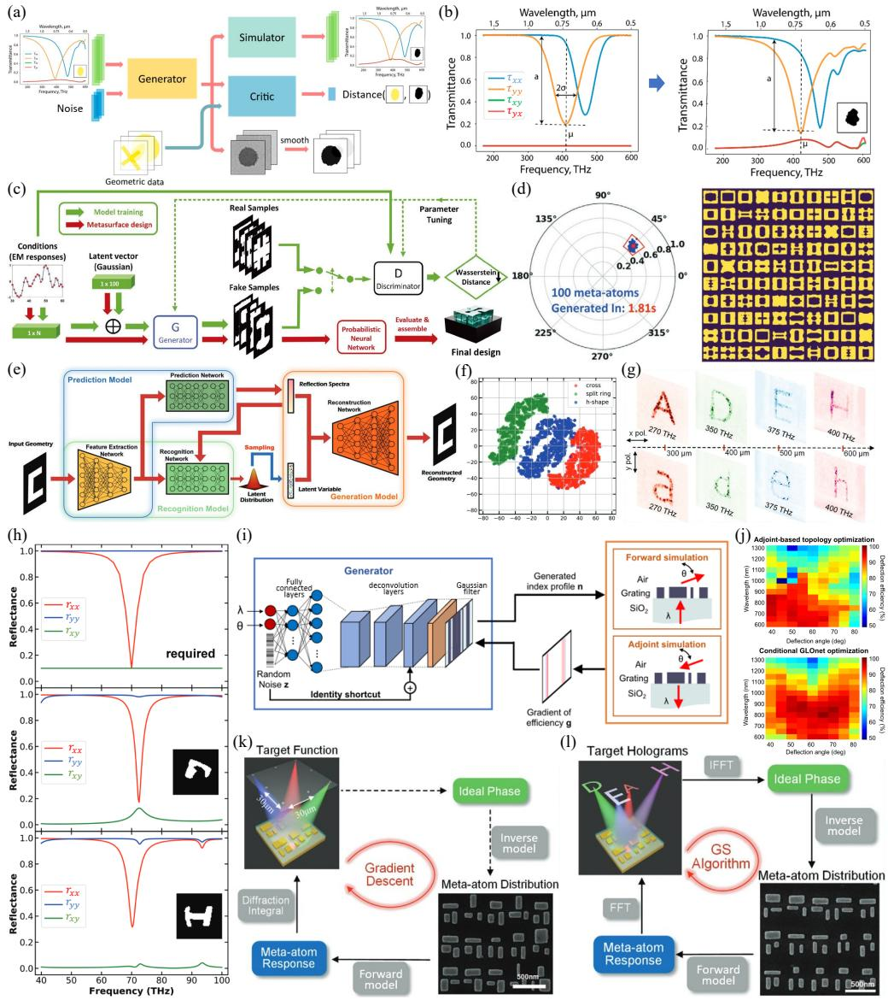

Inverse models and their applications in the inverse design of metasurfaces. (a) Schematic of the neural network architecture of the inverse model based on GAN. (b) Left: the target transmittance spectrum. Right: the transmittance spectrum of the meta-atom (inset) generated by the model. (c) The neural network architecture of the inverse model based on WGAN and CGAN. (d) Left: the complex amplitude distribution (blue dots) of 100 meta-atoms generated by the inverse model for the target complex amplitude response (the red dot). Right: structures of the generated meta-atoms. The complex amplitude in the region surrounded by red lines has the absolute amplitude difference less than 0.1 and the absolute phase difference less than $10^{\circ}$ relative to the target complex amplitude. (e) Neural network architecture of the inverse model based on VAE. (f) Latent variable distribution in the latent space reduced from 20-dimensional space to 2D space. Red dots, green dots, and blue dots represent cross, split ring, and H-shaped meta-atoms, respectively. (g) Experimental holographic images of the 8-channel wavelength and polarization-multiplexed metasurface hologram. (h) Top: the target reflectance spectrum. Middle and bottom: the reflectance spectra of two meta-atoms (inset) generated by the inverse model based on VAE for the target reflectance spectrum. (i) Schematic of conditional Global Topology Optimization Network (GLONet) optimization algorithm. (j) The deflection (continued)

(continued) efficiencies of metagratings with different operating wavelengths and deflection angles, designed by topology optimization based on the adjoint method (top) and conditional GLONet optimization (bottom), respectively. (k) Embedding machine learning models in the gradient-based optimization loop for the multi-functional metalens design. (l) Embedding machine learning models in the Gerchberg–Saxton (GS) algorithm for the multi-functional metasurface hologram design. (a) and (b) Adapted with permission from Liu et al., Nano Lett. 18, 6570–6576 (2018) [451]. Copyright © 2018 American Chemical Society. (c) and (d) Adapted with permission from An et al., Adv. Opt. Mater. 9, 2001433 (2021) [454]. Copyright © 2021 WILEY-VCH Verlag GmbH & Co. KGaA, Weinheim. (e), (f), and (h) Adapted with permission from Ma et al., Adv. Mater. 31, 1901111 (2019) [455]. Copyright © 2019 WILEY-VCH Verlag GmbH & Co. KGaA, Weinheim. (g), (k), and (l) Adapted with permission from Ma et al., Adv. Mater. 34, 2110022 (2022) [449]. Copyright © 2022 WILEY-VCH Verlag GmbH & Co. KGaA, Weinheim. (i) and (j) Adapted with permission from Jiang and Fan, Nano Lett. 19, 5366–5372 (2019) [415]. Copyright © 2019 American Chemical Society.

Beyond merely utilizing inverse models for metasurface design $[457]$ , these models, along with potential forward models, can be integrated with optimization methods outlined in Subsection 3.3. This integration helps overcome the limitations of existing design approaches, thereby enabling the design of metasurfaces with enhanced performance and more complex functionalities.

In 2019, Jiang et al. [415,458] combined generative models with topology optimization to propose the unconditional and conditional Global Topology Optimization Networks (GLONets). The conditional GLONet is an upgrade of the unconditional GLONet, for the former can generate efficient 1D metagratings for specified wavelengths and deflection angles, while the latter is trained only for the fixed wavelength and deflection angle. The architecture of the conditional GLONet is shown in Fig. 27(i). The generative model takes as input a specified wavelength, deflection angle, and random noise vector, and outputs a 256-dimensional vector $\vec{p}$ consisting of structural parameters of a 1D metagrating, where each element in $\vec{p}$ represents the refractive index of a finite element of the metagrating, with values between that of air and the meta-atom material. The core of the algorithm is the use of topology optimization based on the adjoint method for model training. The goal of the generative model is to produce metagratings with as high a deflection efficiency $E$ as possible for any wavelength and deflection angle. In each iteration of model training, for any weight coefficient $w$ of the generative model, the gradient $\frac{\partial E}{\partial w}$ needs to be calculated for updating the model weights. By the chain rule of differentiation, we have

$$
\frac {\partial E}{\partial w} = \frac {\partial E}{\partial \vec {p}} \frac {\partial \vec {p}}{\partial w}, \tag {163}
$$

where the first term on the right side can be obtained by the adjoint method and the second term by neural network backpropagation. The wavelength range from 600 nm to 1300 nm and the deflection angles from 40° to 80° are covered by the generative model. By designing a set of metagratings for different wavelengths and deflection angles through both topology optimization and conditional GLONet and selecting the highest-efficiency device, the device efficiency comparison shown in Fig. 27(j) indicates that conditional GLONet, with its global nature, achieves higher device performance compared to topology optimization.

In 2022, Ma et al. [449] combined both forward and inverse models with optimization algorithms, achieving multifunctional metasurface designs with the number of

multiplexing channels beyond the reach of the traditional forward design method. The challenge with traditional methods is the need for $2\pi$ phase coverage for each multiplexed channel, which becomes impractical for a large number of channels even if the design space is theoretically capable, due to the prohibitive time required to build a complete database through enumeration. In this work, the forward model was built using a mix of the convolutional neural network and recurrent neural network with residual connections, enabling accurate prediction from the supercell structure to the reflectance spectrum, and the inverse model was essentially the same as the VAE-based model $[455]$ introduced earlier. Each supercell is composed of three rectangular pillar meta-atoms, as depicted in Fig. 27(k). Based on the models, two kinds of design algorithms were proposed.

(i) Combining the models with a gradient optimization algorithm, as shown in Fig. 27(k), for a given design goal, an initial metasurface design is generated using the inverse model, followed by further optimization based on gradient descent using the forward model. With this algorithm, an experimental multifocal metalens was implemented, featuring eight multiplexing channels comprising two orthogonally polarized states and four frequencies (270 THz, 350 THz, 375 THz, and 400 THz).  
(ii) Utilizing the models' rapid solution, as shown in Fig. 27(l), an end-to-end meta-surface hologram design method was proposed by combining the models with the CGH algorithm. With this algorithm, a Fresnel hologram multiplexing for the aforementioned eight channels was designed, and experimentally reconstructed holographic images are shown in Fig. 27(g).

# 4. METASURFACES FOR IMAGING: METALENSES

The metalens, a type of metasurface designed for focusing and imaging, has garnered increased attention from the research community due to its substantial benefits over traditional lenses, such as lighter weight, thinner profiles, multifunctionality, and easier integration. Such attributes have catalyzed significant advancements in achieving high-efficiency and high-quality imaging $[459–462]$ . Nowadays, metalenses have been widely applied in various fields, such as endoscopy $[463]$ , microscopic imaging $[340]$ , virtual reality $[464]$ , and polarization cameras $[465,466]$ , showcasing their potential to revolutionize numerous optical applications.

The design workflow for metalenses, including fundamental design and analysis techniques, is available in our open-source code repository $[73]$ .

# 4.1. Ideal Phase Distributions for Imaging

Let $\lambda_0$ be the wavelength of incident light in free space, $n_{\mathrm{back}}$ the refractive index of the background environment medium, $n_{\mathrm{meta}}$ the refractive index of the meta-atom material, $n_{\mathrm{cladding}}$ the refractive index of the material encapsulating the meta-atom structures [these refractive index-related symbols are distinguished in Fig. 6(a)], $c_0$ the speed of light in free space, $\lambda = \frac{\lambda_0}{n_{\mathrm{back}}}$ the wavelength of light in the environmental medium, $k = \frac{2\pi}{\lambda}$ the wavenumber of light in the environmental medium, and $\omega = kc = k\frac{c_0}{n_{\mathrm{back}}}$ the angular frequency. A coordinate system is established, as shown in Fig. 28(a). The angle between the projection of the light's direction vector on the $xOz$ ( $yOz$ ) plane and the $z$ -axis is defined as the $x$ -direction ( $y$ -direction) incident angle $\alpha_x$ ( $\alpha_y$ ). Since the angles in media with different refractive indices vary, we note that $\alpha_x$ and $\alpha_y$ are defined in the background environment medium. When the $x$ -component ( $y$ -component)

Figure 28  
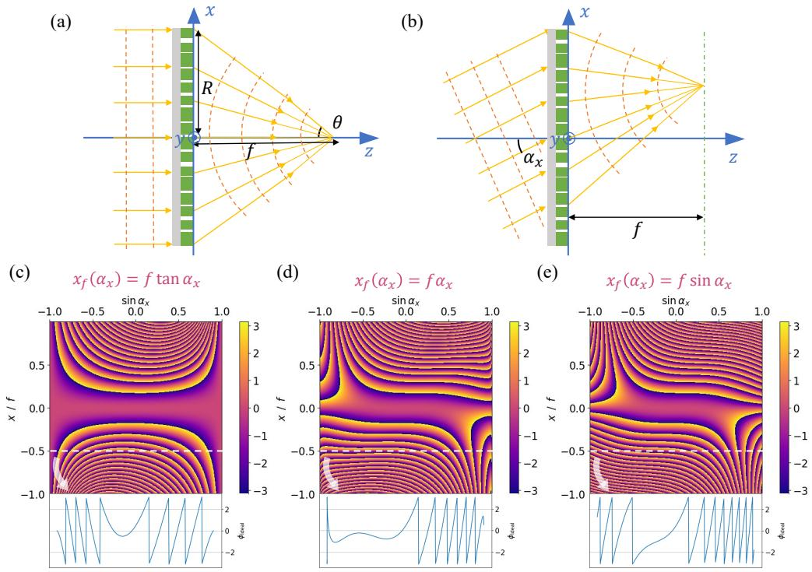

The principle and ideal phase distributions of metalens. (a) Schematic of the focusing principle of metalens under the perpendicularly incident light. (b) Schematic of the focusing principle of metalens under the obliquely incident light. (c) The ideal phase profile when $x_{\mathrm{f}}(\alpha_{x}) = f \tan \alpha_{x}$ and $y_{\mathrm{f}}(\alpha_{y}) = f \tan \alpha_{y}$ . Here, $x \in [-f, f]$ , y = 0, $\alpha_{x} \in \left[-\frac{\pi}{2}, \frac{\pi}{2}\right]$ , $\alpha_{y} = 0$ , and $\lambda = 0.03f$ (the same as below). The ideal phase $\phi_{ideal}$ vs $\sin \alpha_{x}$ when x = -0.5f is drawn at the bottom (the same as below). (d) The ideal phase profile when $x_{\mathrm{f}}(\alpha_{x}) = f \alpha_{x}$ and $y_{\mathrm{f}}(\alpha_{y}) = f \alpha_{y}$ . (e) The ideal phase profile when $x_{\mathrm{f}}(\alpha_{x}) = f \sin \alpha_{x}$ and $y_{\mathrm{f}}(\alpha_{y}) = f \sin \alpha_{y}$ .

of the incident light's direction vector is in the same direction as the positive $x$ -axis (y-axis), $\alpha_{x}(\alpha_{y})$ is taken as positive; otherwise, it is negative. For example, the $x$ -direction incident angle $\alpha_{x}$ in Fig. 28(b) is positive.

An ideal lens can achieve aberration-free, ideal focusing on the focal plane for light of any angular frequency $\omega$ and incident angle $\left(\alpha_{x},\alpha_{y}\right)$ . Figures 28(a) and 28(b) show the scenarios of ideal focusing under normal and oblique incidences, respectively. The phase distribution of an ideal lens is defined as the ideal phase distribution $\phi_{\mathrm{ideal}}$ , which is a function of the coordinate $(x,y)$ on the lens, the angular frequency, and the incident angle. Light of different angular frequencies should focus at the same point on the focal plane to eliminate chromatic aberration. For light with different incident angles, the focusing position is a function of the incident angle, denoted as $\left(x_{\mathrm{f}}\left(\alpha_{x}\right),y_{\mathrm{f}}\left(\alpha_{y}\right)\right)$ . By Fermat's principle, the formula for the ideal phase distribution can be derived [467]

$$
\begin{array}{l} \phi_ {\text {ideal}} \left(x, y, \omega , \alpha_ {x}, \alpha_ {y}\right) \\ = - \frac {\omega}{c} \left(x \sin \alpha_ {x} + y \sin \alpha_ {y} + \sqrt {f ^ {2} + (x - x _ {\mathrm{f}}) ^ {2} + (y - y _ {\mathrm{f}}) ^ {2}} - \sqrt {f ^ {2} + x _ {\mathrm{f}} ^ {2} + y _ {\mathrm{f}} ^ {2}}\right) \\ + C \left(\omega , \alpha_ {x}, \alpha_ {y}\right), \tag {164} \\ \end{array}
$$

where $f$ is the lens's focal length, $C\left(\omega, \alpha_x, \alpha_y\right)$ is a position-independent constant term, indicating that adding a constant phase shift to the ideal phase distribution for a certain angular frequency and incident angle does not affect the focusing effect but can introduce a new design degree of freedom for achieving complex designs such as wide-FOV lenses [468] and broadband achromatic lenses [351]. For brevity, in Eq. (164), $x_{\mathrm{f}}\left(\alpha_x\right)$ and $y_{\mathrm{f}}\left(\alpha_y\right)$ are abbreviated as $x_{\mathrm{f}}$ and $y_{\mathrm{f}}$ , respectively.

For undistorted ideal imaging, $x_{\mathrm{f}}(\alpha_{x})$ and $y_{\mathrm{f}}(\alpha_{y})$ satisfy

$$
x _ {\mathrm{f}} \left(\alpha_ {x}\right) = f \tan \alpha_ {x}, \quad y _ {\mathrm{f}} \left(\alpha_ {y}\right) = f \tan \alpha_ {y}. \tag {165}
$$

In this case, the focusing effects of a metalens that meets the ideal phase distribution at different incident angles are shown in Figs. 29(a)–29(d). Unexpectedly, when $\alpha_{x}=60^{\circ}$ , the focal spot exhibits a slight broadening in the x direction, indicating a decrease in the effective NA. This phenomenon can be attributed to the constraint imposed by the spatial bandwidth product of the lens. When taking

$$
x _ {\mathrm{f}} \left(\alpha_ {x}\right) = f \alpha_ {x}, \quad y _ {\mathrm{f}} \left(\alpha_ {y}\right) = f \alpha_ {y}, \tag {166}
$$

or

$$
x _ {\mathrm{f}} \left(\alpha_ {x}\right) = f \sin \alpha_ {x}, \quad y _ {\mathrm{f}} \left(\alpha_ {y}\right) = f \sin \alpha_ {y}. \tag {167}
$$

Although distortions are intentionally introduced, comparing Figs. 28(c)–28(e) reveals that the dependence of the ideal phase distribution on the incident angle is reduced, i.e., the phase changes more flatly with the incident angle, making it easier to approximate with a phase distribution that does not depend on the incident angle. Moreover, while distortions may affect angular resolution in certain directions near the edge of FOV, they do not significantly degrade the intrinsic imaging resolution and can often be corrected through post-processing, albeit with additional computational cost. Therefore, this approach greatly aids in the design of metalenses with wide FOV [467].

For a monochromatic plane wave incident perpendicularly, as shown in Fig. 28(a), an ideal lens modifies the wavefront of the incident light from a plane to a spherical surface centered at the focal point. Substituting Eq. (165) into Eq. (164), and taking $\alpha_{x} = \alpha_{y} = 0$ for perpendicularly incident light, the ideal phase distribution becomes

$$
\phi_ {\text {hyperbolic}} (r, \omega) = - \frac {\omega}{c} \left(\sqrt {f ^ {2} + r ^ {2}} - f\right) + C (\omega), \tag {168}
$$

where $r = \sqrt{x^{2} + y^{2}}$ is the distance from a point $(x, y)$ on the metalens to the center. This is the classic hyperbolic phase distribution. A metalens that conforms to this hyperbolic phase distribution is referred to as a hyperbolic metalens. Eq. (168) can further be simplified to

$$
\phi_ {\text {hyperbolic}} (r, \omega) = - \frac {\omega}{c} \sqrt {f ^ {2} + r ^ {2}} + \frac {\omega}{c} f + C (\omega) = - \frac {\omega}{c} \sqrt {f ^ {2} + r ^ {2}} + C ^ {\prime} (\omega). \tag {169}
$$

The hyperbolic phase distribution has the advantage of being free of the spherical aberration [469] and is suited for applications with small FOV. It's important to emphasize that, strictly speaking, the hyperbolic phase distribution is free of spherical aberration only for parallel incident light, i.e., light from an object at infinity. The wavefront of light from a point object at a finite distance is spherical, and when the point object is close to the lens, it cannot be approximated as a plane wave, resulting in significant

Figure 29  
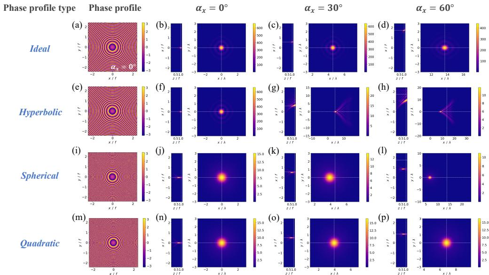

heatmap

| Phase profile type | \(\alpha x = 0{}^{\circ}\) | \(\alpha x = 30{}^{\circ}\) | \(\alpha x = 60{}^{\circ}\) |
| --- | --- | --- | --- |
| Ideal | Complex wave pattern with high intensity at center | Distinct wave pattern with high intensity at center | Distinct wave pattern with high intensity at center |
| Hyperbolic | Complex wave pattern with high intensity at center | Distinct wave pattern with high intensity at center | Distinct wave pattern with high intensity at center |
| Spherical | Complex wave pattern with high intensity at center | Distinct wave pattern with high intensity at center | Distinct wave pattern with high intensity at center |
| Quadratic | Complex wave pattern with high intensity at center | Distinct wave pattern with high intensity at center | Distinct wave pattern with high intensity at center |

Simulated focusing effects of metalenses with the ideal phase distribution (a)–(d), hyperbolic phase distribution (e)–(h), spherical phase distribution (i)–(l), and quadratic phase distribution (m)–(p). The first column shows the type of phase profiles. The second column shows the phase profiles of metalenses. Note that only the phase profile when $\alpha_{x}=0$ is given, considering the ideal phase distribution is dependent on the incident angle. The last three columns illustrate the focusing effect by showing the electric field intensity profiles on the xOz longitudinal section and the focal plane for metalenses when $\alpha_{x}$ equals $0^{\circ}$ , $30^{\circ}$ , and $60^{\circ}$ , respectively. The white dashed lines mark the ideal focus position, namely, $x_{\mathrm{f}}\left(\alpha_{x}\right)=f\tan\alpha_{x}, y_{\mathrm{f}}\left(\alpha_{y}\right)=f\tan\alpha_{y}, z_{f}=f$ for the first three phase profiles, and $x_{\mathrm{f}}\left(\alpha_{x}\right)=f\sin\alpha_{x}, y_{\mathrm{f}}\left(\alpha_{y}\right)=f\sin\alpha_{y}, z_{f}=f$ for the last phase profile. The green dashed lines mark the upper and lower bounds in the x direction of the metalens. Simulation parameters: the radius of the metalens is $12\ \mum$ , the focal length is $5\ \mum$ , the wavelength of the incident light in the environmental media is 633 nm, $\alpha_{y}$ is fixed at $0^{\circ}$ , the metalens is put at z=0, and $\rho=20\ \mum$ for the spherical phase profile.

spherical aberration [470]. For a point object at a fixed object distance, a phase distribution capable of correcting chromatic and spherical aberrations simultaneously can be derived based on the generalized law of refraction in Eq. (57), with more details available in references [470,471].

Given the material and structural limitations, meta-atoms exhibit limited dispersion characteristics, which may not simultaneously meet the phase distribution requirements across different wavelengths of an ideal or hyperbolic lens for multiple wavelengths or broadband operation. When the spatial dispersion of meta-atoms (see Subsection 2.2.2) is not considered, the phase shift introduced by a meta-atom is consistent for light incident at different angles. However, this contradicts the fact that the ideal phase distribution in Eq. (164) is angle-dependent. That is to say, unless angle-dependent electromagnetic responses are considered in the design, the target phase distribution adopted in the wide-FOV metalens design must inevitably be a compromise among the ideal phase distributions at various incident angles. Differences between the target phase distribution and the ideal phase distributions will further result in limitations regarding NA, efficiency, and other aspects $[472,473]$ .

# 4.2. Design Metrics and Analysis of Metalenses

This Subsection introduces the main design metrics in metalens design, as well as the relationships and constraints among these indicators. Achieving excellence across multiple performance indicators simultaneously is particularly challenging. In practice, it often requires a balance, focusing on the most crucial indicators based on specific application scenarios. When evaluating the performance of metalenses, it is recommended to consult the comment $[474]$ to maintain uniformity in the evaluation criteria for metalenses.

Except for specially designed Janus metasurfaces $[475–477]$ (discussed in Subsection 5.2.4), metasurfaces typically exhibit the same electromagnetic response and corresponding device function for both forward and backward incidences. Therefore, the performance metrics of a metalens are generally not differentiated between the object and image sides as with traditional optical systems.

Considering monochromatic light incident at a certain angle, due to differences between the target phase distribution used in the design and the ideal phase distribution, discrepancies between the actual electromagnetic response and the design target, as well as the effect of discretizing the continuous phase distribution determined by the lattice constant, the actual wavefront always differs from the ideal spherical wavefront, resulting in varying focusing effects and thereby affecting imaging resolution. This can be measured by indicators such as the point spread function (PSF), Strehl ratio, and modulation transfer function (MTF) [478]. The PSF is defined as the image formed by a point object through the optical system, the Strehl ratio is defined as the ratio of the PSF peak of the actual lens to that of an ideal lens, and the MTF is defined as the magnitude of the Fourier transform of the PSF. The PSF of an ideal lens is the Airy pattern, whose function can be expressed as

$$
I _ {\text {Airy}} (\xi) = I _ {0} \left(\frac {2 J _ {1} (\xi)}{\xi}\right) ^ {2}, \tag {170}
$$

where $I_{0}$ is the maximum light intensity at the center of the Airy pattern, and $J_{1}(\xi)$ is the first-order Bessel function of the first kind. The experimentally measured PSF $I_{\mathrm{PSF}}(x)$ ( $x \in [-x_{\mathrm{m}}, x_{\mathrm{m}}]$ , meaning that the measured PSF is always truncated to a limited physical size of $2x_{m}$ ) requires normalization, which can be done using the property that the power of the actual PSF and the ideal PSF (the Airy pattern) are consistent, namely [479]

$$
\int_ {- \infty} ^ {+ \infty} I _ {\mathrm{Airy}} (\xi) \mathrm{d} \xi = \int_ {- x _ {\mathrm{m}}} ^ {x _ {\mathrm{m}}} I _ {\mathrm{PSF}} (x) \mathrm{d} x. \tag {171}
$$

Substituting Eq. (170) into Eq. (171), $I_0$ can be solved. It's noted that the experimentally measured $I_{\mathrm{PSF}}(x)$ is always discrete, so the integral on the far right of Eq. (171) is taken as a summation in actual calculations. Thus, the expression for the normalized PSF $\bar{I}_{\mathrm{PSF}}(x)$ is

$$
\bar {I} _ {\mathrm{PSF}} (x) = \frac {1}{I _ {0}} I _ {\mathrm{PSF}} (x). \tag {172}
$$

Clearly, the Strehl ratio is simply $\bar{I}_{\mathrm{PSF}}(0)$ . When the Strehl ratio exceeds 0.8, it is considered that the difference between the actual PSF and the Airy pattern can be neglected [90], meaning the optical system's aberrations are within acceptable limits and do not affect the resolution at the diffraction limit. In 2023, Menon's group [479] pointed out that in the experimental measurement of these indicators, if the actual PSF is prematurely truncated due to the limited FOV of the magnifying objective, the Strehl ratio and MTF could be overestimated. Irregularities in actual PSF measurements can lead

to a loss of credibility in characterizing the performance of metalenses, which is detrimental to the verification of theoretical analyses and the long-term development of the field.

Taking metasurfaces operating in transmission mode as an example, now we introduce the relevant indicators describing the efficiency of metalenses. The indicators for metasurfaces operating in reflection mode can be obtained similarly.

The transmittance $\tau$ is defined as the ratio of the transmitted light power $P_{out}$ through the metasurface to the incident light power $P_{in}$ , i.e.,

$$
\tau = \frac {P _ {\text {out}}}{P _ {\text {in}}}. \tag {173}
$$

A higher transmittance of the metasurface implies less energy loss due to reflection and absorption.

Effective focusing is defined as the concentration of incident light into a circular area of a certain diameter (typically an iris in experiments) in the center of the focal plane. Unfortunately, the choice of diameter for the effective focusing circular area is not consistent across studies, leading to significant difficulties in comparing the focusing efficiency of different metalenses, and some studies overestimate the focusing efficiency of metalenses $[479]$ . Specifying the diameter of the effective focusing area can alleviate this problem to some extent. This is the approach maintained in this tutorial, unless no related data are found.

The absolute focusing efficiency ( $\eta_{AFE}$ ) is defined as

$$
\eta_ {\mathrm{AFE}} = \frac {P _ {\text {focusing}}}{P _ {\text {in}}}, \tag {174}
$$

where $P_{focusing}$ is the focused light power within the effective focusing area. The relative focusing efficiency ( $\eta_{RFE}$ ) is defined as

$$
\eta_ {\mathrm{RFE}} = \frac {P _ {\text {focusing}}}{P _ {\text {out}}} \tag {175}
$$

The relative focusing efficiency (more strictly, $\frac{\eta_{RFE}}{1-\eta_{RFE}}$ ) measures the energy ratio of the focused transmitted light to the unfocused transmitted light, the latter of which can cause background noise and secondary foci, resulting in haze and ghost images, respectively [480]. The relationship among these three indicators is

$$
\eta_ {\mathrm{AFE}} = \tau \eta_ {\mathrm{RFE}}, \tag {176}
$$

which means that the absolute focusing efficiency accounts for both the efficiency losses due to reflection and absorption by the metasurface (quantified by transmittance) and the focusing effect of the transmitted light, as modulated by the metalens (quantified by relative focusing efficiency) [481].

Another similar set of indicators is the absolute diffraction efficiency $\eta_{ADE}$ and relative diffraction efficiency $\eta_{ADE}$ , which are defined as

$$
\eta_ {\mathrm{ADE}} = \frac {P _ {\text {diffraction}}}{P _ {\text {in}}}, \tag {177}
$$

and

$$
\eta_ {\mathrm{RDE}} = \frac {P _ {\text {diffraction}}}{P _ {\text {out}}}, \tag {178}
$$

respectively, where $P_{diffraction}$ is the light power reaching the target diffraction order. Here, the target diffraction order refers to the entire area from the center of the PSF to where it completely flattens [482]. Similarly, we have

$$
\eta_ {\mathrm{ADE}} = \tau \eta_ {\mathrm{RDE}}. \tag {179}
$$

The relative diffraction efficiency (more strictly, $\frac{\eta_{RDE}}{1-\eta_{RDE}}$ ) quantifies the relative magnitude of the light power in the target diffraction order to the stray background light (known in photography as veiling glare), which is just the signal-to-noise ratio (SNR) of the imaging.

Without specifying absolute or relative, focusing efficiency and diffraction efficiency generally refer to absolute focusing efficiency and absolute diffraction efficiency, respectively.

Note that the above evaluation of efficiency does not take into account the fact that some metasurfaces operate under the specific polarization states for incident and output light, for which it is necessary to introduce additional indicators. For instance, metasurfaces based on geometric phase require the introduction of the PCE, with relevant definitions and discussions found in Subsection 2.1.3.

In the monochromatic case, the two most important metrics describing imaging performance are resolution and SNR. Levy's group recommends using the MTF to characterize resolution and using transmittance and absolute diffraction efficiency to represent SNR [474]. There are two main reasons why focusing on efficiency is not considered a suitable metric. First, as mentioned above, the effective focusing area diameter used to evaluate focusing efficiency varies across different studies, leading to inconsistency. Second, and more fundamentally, focusing efficiency inherently intertwines both resolution and SNR, making it less suitable for clear and independent analysis [474].

The NA is a dimensionless parameter that describes the angular range over which an optical system can collect or emit light, which is defined as

$$
\mathrm{NA} = n _ {\text {back}} \sin \theta , \tag {180}
$$

where $\theta$ is half the angle of the maximum light cone entering or leaving the lens. As shown in Fig. 28(a), when examining the image side, the NA relates to the focal length f and the radius R of the metalens as

$$
\mathrm{NA} = n _ {\mathrm{back}} \sin \left(\arctan \left(\frac {R}{f}\right)\right). \tag {181}
$$

The NA is also a crucial indicator of imaging resolution. Under the diffraction limit, the FWHM of the metalens's focal spot satisfies

$$
\mathrm{FWHM} \approx 0. 5 1 \frac {\lambda_ {0}}{\mathrm{NA}}, \tag {182}
$$

indicating that the imaging resolution is inversely proportional to the NA, i.e., with a fixed wavelength, metalenses with a larger NA can theoretically support higher resolutions. However, it must be noted that metalenses often struggle to reach the theoretical limit of imaging resolution in practice due to various aberrations $[471]$ . It's important to emphasize that merely comparing the experimentally measured FWHM with Eq. (182) is not sufficient to assert that the imaging has reached the diffraction limit, as aberrations tend to redistribute light energy from the central lobe of the focal spot to the side lobes rather than changing the width of the central lobe $[474]$ . As mentioned earlier, comparing the actual MTF of a metalens with the ideal MTF under the diffraction limit is a better approach.

Due to the certain physical dimensions of the unit in a metasurface, the actual phase distribution is always a discretized approximation of the continuous target phase distribution. When sampling a phase range of $2\pi$ using N units, the phase gradient, denoted as $\frac{d\phi}{d\vec{r}} = \frac{\partial\phi}{\partial x}\vec{e}_{x} + \frac{\partial\phi}{\partial y}\vec{e}_{y}$ (where $\vec{r} = x\vec{e}_{x} + y\vec{e}_{y}$ ), is limited by (the discussion here considers the square units)

$$
\left| \frac {\mathrm{d} \phi}{\mathrm{d} \vec {r}} \right| \leq \frac {2 \pi}{N a}, \tag {183}
$$

where $a$ is the lattice constant. The smaller $N$ is, the larger the error between the actual wavefront generated by the discretized phase distribution and the ideal wavefront, which can result in lower focusing efficiency and more severe imaging aberrations. According to the Nyquist sampling criterion, the sampling period should be less than half the signal period to fully resolve the high-frequency components. Therefore, at least two meta-atoms are required to sample a spatial phase change of $2\pi$ [483], i.e.,

$$
N \geq 2. \tag {184}
$$

Substituting Eq. (184) into Eq. (183), we obtain

$$
\left| \frac {\mathrm{d} \phi}{\mathrm{d} \vec {r}} \right| \leq \frac {\pi}{a}, \tag {185}
$$

which means that the maximum absolute value of the phase gradient supported by the metasurface is $\frac{\pi}{a}$ , limited by the Nyquist sampling criterion, instead of $\frac{2\pi}{a}$ [when taking N = 1 in Eq. (183)].

For the hyperbolic phase distribution, the phase gradient $\frac{d\phi}{dr}$ (since the phase distribution is solely a function of r, the phase gradient can be expressed in scalar form) is

$$
\frac {\mathrm{d} \phi}{\mathrm{d} r} = \frac {\partial \phi_ {\text {hyperbolic}} (r , \omega)}{\partial r} = - \frac {\omega}{c} \frac {r}{\sqrt {f ^ {2} + r ^ {2}}}. \tag {186}
$$

Clearly, the phase gradient above must satisfy Eq. (183), that is, it is limited by the lattice constant and the Nyquist sampling criterion. By substituting Eq. (186) into Eq. (183), we can solve for the maximum theoretically feasible radius of the metalens as

$$
r _ {\max} = \frac {f}{\sqrt {(N a / \lambda) ^ {2} - 1}}. \tag {187}
$$

The actual radius $R$ of the metalens must satisfy $R \leq r_{\mathrm{max}}$ . When $R > r_{\mathrm{max}}$ , the contribution of regions with radii exceeding $r_{\mathrm{max}}$ on the metalens is questionable. Using Eq. (181), when $R = r_{\mathrm{max}}$ , the maximum theoretically feasible NA of the metalens can be derived as

$$
\mathrm{NA} _ {\max} = n _ {\text {back}} \sin \left(\arctan \left(\frac {1}{\sqrt {(N a / \lambda) ^ {2} - 1}}\right)\right). \tag {188}
$$

Equations (187) and (188) reveal the limitations imposed by the lattice constant on the radius and NA of the metalens. When the lattice constant satisfies

$$
a = \frac {\lambda}{N}, \tag {189}
$$

we have $r_{max} \rightarrow \infty$ and NA $\rightarrow n_{back}$ , meaning that, from a theoretical perspective, a metalens operating under perpendicular incident monochromatic light would not have size limitations, and the achievable maximum NA would reach the upper limit of a lens.

Generally speaking, due to constraints on design degrees of freedom and fabrication processes, the lattice constant is chosen to be around half the wavelength, leading to a maximum size limitation for metasurfaces as given by Eq. (187), although inverse design methods may slightly relax this limitation. This presents a challenge in designing large-area metalenses. Additionally, considering a metalens with the radius of R, a larger NA means a shorter focal length [according to Eq. (181)]; thus the maximum radius $r_{max}$ that the metasurface can support becomes smaller [according to Eq. (187)]. This indicates there is a fundamental trade-off between the NA and the maximum achievable size of the metalens.

To achieve a lens with a specific NA, using Eq. (181), the maximum magnitude of the transverse wavevector required is $k \sin \theta = \frac{2\pi}{\lambda_0} \mathrm{NA}$ . Thus, for the phase gradient provided by the metasurface to meet the lens's requirements regarding the transverse wavevector, we have

$$
\left| \frac {\mathrm{d} \phi}{\mathrm{d} \vec {r}} \right| \geq \frac {2 \pi}{\lambda_ {0}} \mathrm{NA}. \tag {190}
$$

Substituting Eq. (183) into Eq. (190), i.e.,

$$
\frac {2 \pi}{\lambda_ {0}} \mathrm{NA} \leq \left| \frac {\mathrm{d} \phi}{\mathrm{d} \vec {r}} \right| \leq \frac {2 \pi}{N a}, \tag {191}
$$

we obtain

$$
a \leq \frac {\lambda_ {0}}{N \cdot \mathrm{NA}}. \tag {192}
$$

At the Nyquist sampling limit, i.e., $N = 2$ , we have

$$
a \leq \frac {\lambda_ {0}}{2 \cdot \mathrm{NA}}. \tag {193}
$$

When the lattice constant satisfies Eq. (193), it ensures that the phase gradient provided by the metasurface is sufficient to deflect the light incident perpendicularly at any position on the metalens to the focus. However, Eq. (193) does not guarantee the exclusion of higher-order diffraction orders $[484,485]$ . It can be seen from Eq. (192) that a sufficiently small lattice constant must be chosen to obtain a high-NA metalens, and the shorter the operating wavelength, the smaller the required lattice constant. However, the lattice constant is constrained by several factors. First, in terms of the meta-atom design, smaller units result in more limited design spaces, making it difficult to achieve a $2\pi$ phase shift coverage while maintaining high efficiency $[486,487]$ . Furthermore, smaller units mean shorter distances between meta-atoms, potentially exacerbating the coupling among them. Additionally, the fabrication process imposes limits on reducing lattice constants excessively.

# 4.3. Design of Metalenses with Wide Field of View

The key factor limiting the FOV is the presence of various off-axis aberrations, particularly coma, which leads to asymmetric imaging and severely degrades image quality. As shown in Figs. 29(e)–29(h), despite the hyperbolic phase distribution offering the advantages of being free from the spherical aberration and distortion, it introduces significant coma $[467,478]$ . Therefore, it is necessary to introduce new phase distributions to accommodate imaging applications with a wide FOV. When the spatial dispersion is not considered, the new target phase distribution must be independent of the angle of incidence. In this case, the phase distribution of a single planar metasurface cannot perfectly correct both the spherical aberration and coma simultaneously $[467,478]$ .

Any phase distribution will be a compromise between the spherical aberration, coma, numerical aperture, and efficiency $[472]$ . Therefore, the key lies in finding the optimal compromise for specific application scenarios.

# 4.3.1. Wide-FOV Metalenses Based on the Optimized Phase Distribution

A common approach in designing wide-FOV metalenses is to obtain the target phase distribution through optimization based on methods like ray tracing $[179,185]$ . A typical form of the target phase distribution, proposed by Capasso's group $[185]$ , involves modifying the hyperbolic phase distribution in Eq. (168) by introducing several polynomial terms to be optimized:

$$
\phi_ {\text {optim}} (r, \omega) = - \frac {\omega}{c} \left(\sqrt {f ^ {2} + r ^ {2}} - f\right) + \sum_ {i = 1} ^ {n} c _ {i} \left(\frac {r}{R}\right) ^ {2 i}, \tag {194}
$$

where $c_{i}$ is the coefficient of the polynomial term to be optimized, and $n$ is the number of polynomial terms. The hyperbolic phase distribution term in Eq. (194) can be omitted [480,488]. The core reason why the optimized phase distribution can eliminate coma lies in introducing an effective aperture that moves laterally with the incident angle [472]. The effective aperture is not a physical aperture but a region within the metalens that actually contributes to focusing the light. Its mechanism is that, although it's difficult to introduce angle-dependent phase control, the effective aperture can delineate an angle-dependent active region on the metalens, causing incident light at different angles to interact with different areas of the metalens. This essentially constitutes a spatial multiplexing strategy. From the perspective of the effective aperture, the analysis by Liang et al. [472] further shows that the above-optimized phase distribution exhibits consistent characteristics with the phase distribution of the traditional spherical lens (hereinafter referred to as the spherical phase distribution), which is mathematically expressed as

$$
\phi_ {\text {spherical}} (r, \omega) = - \frac {\omega}{c} \frac {\rho}{f} \left(\rho - \sqrt {\rho^ {2} - r ^ {2}}\right), \tag {195}
$$

where $\rho$ is the radius of curvature of the spherical lens. The focusing effects of a metalens following the spherical phase distribution at different incident angles are shown in Figs. 29(j)–29(l). Compared to the hyperbolic phase distribution, the spherical phase distribution exhibits significantly less coma, although it also presents distortions, which are difficult to avoid in wide-FOV imaging. As a trade-off, the effective aperture limits the NA of the imaging system, and regions outside the effective aperture may produce stray light, leading to a reduction in the imaging SNR. Therefore, it is best to restrict it with an additional aperture in front [472], as shown in Fig. 30(a). If the optimized phase distribution in Eq. (194) introduces significant spherical aberration, an additional metalens can be added to correct it. This corrective metalens can be overlapped with the aperture to make the system more compact, as shown in Fig. 30(b). In addition, the doublet metasurface architecture can also be employed to eliminate distortion in wide-FOV imaging, as illustrated in Fig. 30(c) [489].

Based on this approach, in 2016, Arbabi et al. [179] achieved a dual-metalens imaging system with an FOV of $60^{\circ}$ , as introduced in Subsection 2.2.1. In 2017, Groever et al. [185] utilized the system design shown in Fig. 30(b) to realize a dual-metalens system operating at a wavelength of 532 nm, with a focal length of 342.5 $\mu$ m, an NA of 0.44, an absolute focusing efficiency of about 50%, and an FOV of $50^{\circ}$ . Two $TiO_{2}$ metasurfaces based on the geometric phase were fabricated on both sides of a silica substrate with a thickness of 0.5 mm. The MTF curves at different FOVs, as shown in Fig. 30(d), demonstrate near-diffraction-limit resolution at various incident angles. In 2020, Shalaginov et al. [488] employed the system structure shown in Fig. 30(a)

Figure 30  
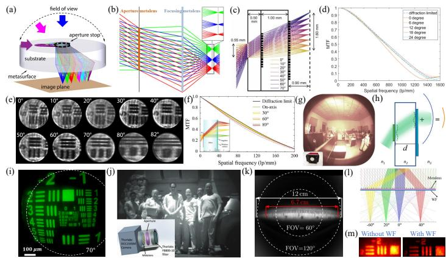

text_image

(a)
field of view
aperture stop
substrate
metsurface
image plane
(b)
Aperture metals
Focusing metals
(c)
0.50 mm
1.00 mm
0.90 mm
0.90 mm
0.55 mm
0.4
0.3
0.2
0.1
0
0
0
0
0
0
0
0
0
0
0
0
0
0
0
0
0
0
0
0
0
0
0
0
0
0
0
0
0
0
0
0
0
0
0
0
0
0
0
0
0
0
0
0
0
0
0
0
0
0
(0)
0
0
0
0
0
0
0
0
0
0
0
0
0
0
0
0
0
0
0
0
0
0
0
0
0
0
0
0
0
0
0
0
0
0
0
0
0
0
0
0
0
0
0
0
0
0
0
0
0
0

Design methods for wide-FOV metalenses. (a) Schematic of a wide-FOV imaging system composed of a single metalens and a front aperture. (b) Schematic of a wide-FOV imaging system composed of two metalenses, with one metalens overlapping with the aperture. (c) Schematic of a wide-FOV imaging system composed of two metalenses and a front aperture. (d) The MTF curve along the x direction at different incident angles of an imaging system composed of two metalenses. (e) Imaging results at different incident angles obtained with an imaging system composed of a metalens and an aperture. (f) The measured MTF curve at different incident angles of an imaging system composed of a metalens and an aperture. The horizontal axis is in units of line pairs per millimeter. Dashed curves: tangential MTF. Solid curves: sagittal MTF. Inset: schematic of the imaging system. The metalens substrate thickness is 0.45 mm, the quartz substrate thickness is 4.99 mm, and the aperture diameter is 1 mm. (g) Imaging result obtained with a near-infrared wide-FOV metalens system. Inset: imaging setup. (h) Schematic of correcting the spherical aberration of a quadratic metalens using an extra metasurface. (i) The imaging result of a USAF 1964 chart obtained with a quadratic metalens. (j) Imaging result of a quadratic metalens camera. Inset: imaging setup. (k) Imaging of a ruler taken with a quadratic metalens. (l) Schematic of utilizing a wavevector filter to alleviate the spherical aberration of the quadratic metalens. (m) Comparison between the imaging results obtained with a quadratic metalens, whether to use the wavevector filter or not. (a) and (e) Adapted with permission from Shalaginov et al., Nano Lett. 20, 7429–7437 (2020) [488]. Copyright © 2020 American Chemical Society. (b) and (d) Adapted with permission from Groever, Chen, and Capasso, Nano Lett. 17, 4902–4907 (2017) [185]. Copyright © 2017 American Chemical Society. (c) Reprinted from [489] under a Creative Commons license. (f) and (g) Adapted with permission from Zhang et al., Adv. Mater. 33, 2008157 (2021) [158]. Copyright © 2021 WILEY-VCH Verlag GmbH & Co. KGaA, Weinheim. (h) Reprinted from [490] under a Creative Commons license. (i) Adapted with permission from Martins et al., ACS Photonics 7, 2073–2079 (2020) [491]. Copyright © 2020 American Chemical Society. (j) Adapted from [482] under a Creative Commons license. (k) Adapted with permission from Lassalle et al., ACS Photonics 8, 1457–1468 (2021) [483]. Copyright © 2021 American Chemical Society. (l) and (m) Adapted with permission from Xie et al., Laser Photonics Rev. 17, 2300119 (2023) [492]. Copyright © 2023 WILEY-VCH Verlag GmbH & Co. KGaA, Weinheim.

to design a fisheye metalens system operating at a wavelength of 5.2 $\mu$ m, with a focal length of 2 mm, a diameter of 5.2 mm, and an effective NA of 0.24. The meta-atoms were made of PbTe with a lattice constant of 2.5 $\mu$ m, and the substrate was made of $CaF_{2}$ with a thickness of 2 mm. The imaging results at different incident angles, as shown in Fig. 30(e), exhibited a large FOV close to 180°.

As illustrated in Fig. 30(a) or 30(b), the larger the FOV required by such systems, the larger the size of the metalens needed. Hence, the size of the metalens restricts the maximum achievable FOV. Using a medium with a higher refractive index as the spacer between the aperture and the metalens can induce greater bending of light, thereby mitigating the size requirements of the metalens due to the FOV to some extent $[488]$ .

In 2021, Luo's group [158] used the system shown in the inset of Fig. 30(f) to develop a metalens system operating at a wavelength of $940~\mathrm{nm}$ , with a focal length of $4.48~\mathrm{mm}$ , a diameter of $12~\mathrm{mm}$ , and a large FOV of $178^{\circ}$ . By utilizing an optimized, streamlined Si metasurface to make phase control spatially continuous, the system exhibited an absolute diffraction efficiency above $80\%$ and a relative diffraction efficiency close to $100\%$ at all incident angles. The MTF curves at different FOVs, as shown in Fig. 30(f), indicate the near-diffraction-limit resolution of the metalens system at various incident angles. Under the illumination of an ordinary near-infrared LED light source, the imaging result with an ultra-wide FOV is shown in Fig. 30(g).

The thickness of the aforementioned non-single-element imaging systems is comparable to or even exceeds the focal length, which negates the advantage of the ultrathin thinness of metasurface devices. This could be understood with a straightforward explanation. For simplicity, we consider the case in Fig. 30(b) when $\alpha_{y}=0$ . To deflect the incident light at an angle of $\alpha_{x}$ to the position of $x_{\mathrm{f}}(\alpha_{x})$ on the focal plane, the thickness d of the medium between the aperture metalens and the focusing metalens satisfies [492]

$$
d \left(\alpha_ {x}\right) \approx \frac {x _ {\mathrm{f}} \left(\alpha_ {x}\right)}{\tan \left(\sin^ {- 1} \frac {\sin \alpha_ {x}}{n _ {\mathrm{gap}}}\right)}, \tag {196}
$$

where $n_{gap}$ is the refractive index of the medium. This preliminarily explains why the thickness of the medium layer is comparable to the focal length.

It should be noted that there indeed exists a fundamental trade-off between the FOV and the thickness of the imaging system, namely Eq. (153) introduced in Subsection 2.3.1. However, the thickness of the aforementioned metalens systems, as well as the thickness values derived from Eq. (196), have not yet reached this theoretical limit. It's possible to realize thinner wide-FOV imaging systems through introducing new design methods.

# 4.3.2. Wide-FOV Metalenses Based on the Quadratic Phase Distribution

The quadratic phase distribution was first proposed by Luo's group in 2017 [487], with its expression as follows:

$$
\phi_ {\text {quadratic}} (r, \omega) = - \frac {\omega}{c} \frac {1}{2 f} r ^ {2} + C (\omega). \tag {197}
$$

A metalens that conforms to this phase distribution is referred to as a quadratic metalens. When light is incident perpendicularly, the phase distribution of the light emerging from the metalens is

$$
\phi_ {\text {out}} (x, y, \omega) = \phi_ {\text {quadratic}} (r, \omega). \tag {198}
$$

Now, we consider light incident at angles $\alpha_{x}$ and $\alpha_{y}$ in the x and y directions, respectively. Due to the oblique incidence, the light arriving at the metalens already carries an initial phase distribution of

$$
\phi_ {\text {init}} (x, y, \omega) = k x \sin \alpha_ {x} + k y \sin \alpha_ {y}. \tag {199}
$$

Here we assume the initial phase is 0 when x = 0 and y = 0. Thus, the phase distribution of the light emerging from the metalens is the sum of this initial phase distribution and

Eq. (197), i.e.,

$$
\begin{array}{l} \phi_ {\text {out}} (x, y, \omega) = \phi_ {\text {init}} (x, y, \omega) + \phi_ {\text {quadratic}} (r, \omega) \\ = - \frac {\omega}{c} \frac {1}{2 f} \left(\left(x - f \sin \alpha_ {x}\right) ^ {2} + \left(y - f \sin \alpha_ {y}\right) ^ {2}\right) + C ^ {\prime} (\omega), \tag {200} \\ \end{array}
$$

where $C'(\omega) = C(\omega) + \frac{\omega f}{2c}\left(\sin^2\alpha_x + \sin^2\alpha_y\right)$ is a position-independent phase term. From Eq. (200), it is apparent that for light incident at the angle of $(\alpha_x, \alpha_y)$ , compared to perpendicularly incident light, the only difference is the movement of the focal point on the focal plane from position (0,0) to position $(f\sin \alpha_x, f\sin \alpha_y)$ , with no other differences in focusing effects or any other aspects. In this case, although the distortion described by Eq. (167) is introduced, other off-axis aberrations such as coma are effectively eliminated. The correction of coma by a quadratic metalens can be intuitively seen in Figs. 29(m)-29(p).

From a physical perspective, we could further elucidate on the aforementioned characteristic of the quadratic phase distribution. From Eq. (200), the phase gradient of the emerging light's phase distribution is

$$
\begin{array}{l} \frac {\mathrm{d} \phi_ {\text {out}}}{\mathrm{d} \vec {r}} = \frac {\partial \phi_ {\text {out}} (x , y , \omega)}{\partial x} \vec {e} _ {x} + \frac {\partial \phi_ {\text {out}} (x , y , \omega)}{\partial y} \vec {e} _ {y} \tag {201} \\ = - \frac {\omega}{c f} \left(\left(x - f \sin \alpha_ {x}\right) \vec {e} _ {x} + \left(y - f \sin \alpha_ {y}\right) \vec {e} _ {y}\right). \\ \end{array}
$$

Using Eq. (65), for areas where $\left|\frac{d\phi}{d\vec{r}}\right|>k$ , the output light becomes an evanescent wave. Thus, the positions of the propagating waves satisfy

$$
\left| \frac {\mathrm{d} \phi_ {\mathrm{out}}}{\mathrm{d} \vec {r}} \right| <   k. \tag {202}
$$

Substituting Eq. (201) into Eq. (202), we obtain

$$
(x - f \sin \alpha_ {x}) ^ {2} + (y - f \sin \alpha_ {y}) ^ {2} <   f ^ {2}, \tag {203}
$$

which implies that for light incident at the angle of $(\alpha_{x}, \alpha_{y})$ , only a circular region centered at $(f \sin \alpha_{x}, f \sin \alpha_{y})$ with a radius $r_{v} = f$ is permitted to pass through. As shown in Figs. 29(n)–29(p), such a non-physical aperture that moves with the incident angle is referred to as a virtual aperture. Light incident outside the virtual aperture undergoes total internal reflection and contributes neither to focusing nor to stray light, suggesting that theoretically, a quadratic metalens does not need an additional aperture to filter out stray light. For wide-FOV imaging, the virtual aperture plays a similar role to the effective aperture mentioned earlier. Therefore, the limitation for NA brought by the effective aperture also applies to quadratic metalenses. Specifically, substituting the virtual aperture radius $r_{v}$ into Eq. (181) (taking $R = r_{v} = f$ ), we obtain the upper limit of the NA

$$
\mathrm{NA} _ {\max, \text {quadratic}} = \frac {n _ {\text {back}}}{\sqrt {2}}, \tag {204}
$$

meaning that even if the NA derived directly from Eq. (181) exceeds this limit, the actual NA can only reach up to $NA_{max,quadratic}$ [483].

Ideally, a quadratic metalens has an FOV of $180^{\circ}$ [483]. However, in practice, we may not be able to achieve a lattice constant small enough to satisfy the requirements of the quadratic phase distribution, where phase gradients in the x and y directions linearly increase with x and y, as described by Eq. (201). This consequently limits the maximum achievable FOV. Substituting Eq. (201) into (183), the maximum feasible radius

of the metalens is

$$
r _ {\max} = \frac {2 \pi c f}{N a \omega} = \frac {\lambda f}{N a}. \tag {205}
$$

With Eq. (203), when ensuring an NA of $NA_{max,quadratic}$ across all angles of incidence, the maximum achievable FOV is

$$
\mathrm{FOV} _ {\max, \text {quadratic}} = 2 \alpha_ {\max, \text {quadratic}} = 2 \arcsin \left(\frac {r _ {\max} - f}{f}\right) = 2 \arcsin \left(\frac {\lambda}{N a} - 1\right). \tag {206}
$$

The final step in the above equation relies on Eq. (205). For incident light with an FOV slightly higher than $FOV_{max,quadratic}$ , its NA will be lower than $NA_{max,quadratic}$ .

Based on Eq. (206), we further discuss three scenarios based on different values of $r_{max}$ [the value of $r_{max}$ is determined by Eq. (205)].

(i) When $r_{max} = 2f$ , we have $FOV_{max,quadratic} = 180^{\circ}$ , meaning the effective radius of the quadratic metalens need only reach 2f to achieve imaging with an NA of $NA_{max,quadratic}$ for all incident angles. When taking R > 2f, areas of r > 2f on the metalens contribute nothing to focusing.  
(ii) When $r_{\mathrm{max}} < f$ , no reasonable solution exists for $\mathrm{FOV}_{\mathrm{max,quadratic}}$ , indicating the NA cannot reach $\mathrm{NA}_{\mathrm{max,quadratic}}$ at any incident angle. For a metalens with radius $R \leq r_{\mathrm{max}}$ , when light is incident perpendicularly, it achieves the maximum NA of $n_{\mathrm{back}} \sin \left(\arctan \frac{R}{f}\right)$ . As the angle of incidence increases, the NA decreases, leading to a reduction in imaging resolution, and the area of the metalens that contributes to focusing decreases, resulting in a diminish in image illumination.  
(iii) When $f \leq r_{\mathrm{max}} \leq 2f$ , Eq. (206) provides the maximum incident angle that satisfies $\mathrm{NA} = \mathrm{NA}_{\mathrm{max, quadratic}}$ . As the incident angle increases beyond this limit, both the imaging resolution and illumination decrease due to the reasons discussed in (ii).

The analysis above suggests a fundamental trade-off between the FOV and NA for the quadratic metalens. This trade-off arises naturally as a consequence of the limited spatial bandwidth product of the optical system $[493]$ .

In 2018, Liu et al. [468] experimentally demonstrated a 1D Fourier metalens based on the quadratic phase distribution, with a lattice constant of 450 nm and a metasurface dimension of 190 $\mu$ m × 190 $\mu$ m, achieving an FOV from 0° to 60° and a working bandwidth spanning from 1100 nm to 1700 nm. However, it lacked chromatic aberration correction, resulting in a focal length that decreases with increasing wavelength. In 2020, Martins et al. [491] demonstrated a quadratic metalens operating at a wavelength of 532 nm, with a lattice constant of only 190 nm, a diameter of 2 mm and a focal length of 750 $\mu$ m. Meta-atoms were made from c–Si cylinders with a height of 230 nm. The absolute focusing efficiency of the metalens under perpendicular light incidence (with an effective focusing area diameter of 15 $\mu$ m) was 3.5%. The imaging result for an object at the edge incident angle of 70° is shown in Fig. 30(i). In the same year, Levy's group [482] developed a quadratic metalens operating at a wavelength of 850 nm, with a diameter of 2 mm and a focal length of 3.36 mm, showing good imaging quality within an FOV of 30°, suitable for outdoor photography and surveillance. Meta-atoms were made from a–Si cylinders with a height of 135 nm, arranged in a hexagonal lattice with a lattice constant of 500 nm. After packaging the imaging system with a camera, as illustrated in the inset of Fig. 30(j), the outdoor scene imaging result is presented in Fig. 30(j). The observed decrease in image illumination from center to edge aligns with the discussion in (ii) above. In 2021, Lassalle et al. [483] fabricated a quadratic metalens operating at a wavelength of 740 nm, with a lattice

constant of 300 nm, a diameter of 500 $\mu$ m, and a focal length of 203 $\mu$ m. The average absolute focusing efficiency across various incident angles was about 6%, and the imaging result for an object at a distance of 3 cm is shown in Fig. 30(k). The metal-ens exhibited a large FOV of 120°, but the imaging resolution in regions with larger incident angles noticeably decreased, consistent with the discussion (iii) above. In the same year, Luo's group [158] achieved a quadratic metalens operating in the long-wave infrared range at a wavelength close to 10 $\mu$ m, with a focal length of 6.5 mm and a diameter of 25.4 mm, exhibiting an FOV of over 140°. In 2024, Sharma et al. [494] realized a quadratic metalens operating at a wavelength of 740 nm, with a diameter of 5 mm, a focal length of 2.03 mm, and an FOV of nearly 180°. In the same year, Rho's group [495] extended the application of quadratic phase distribution to acoustics, realizing a metalens for sound capture with a wide field-of-hearing of approximately 140°.

Compared to the ideal phase distribution, a single-element quadratic metalens introduces significant spherical aberration, leading to a reduction in resolution as well as noticeable stray light issues that reduce the imaging SNR and decrease the focusing efficiency $[496]$ , as illustrated by the comparison between Figs. 29(b)–29(d) and 29(n)–29(p). It's also worth mentioning that, on the other hand, the presence of spherical aberration and defocus aberration endows the quadratic metalens with the characteristic of a large depth of field (DOF) $[483]$ . To correct for spherical aberration, as shown in Fig. 30(h), Martins et al. proposed placing a metasurface in front of the quadratic metalens to apply a corrective phase, thereby making the wavefront of the emerging light closer to the ideal spherical wave. Moreover, in 2023, Luo's group $[492]$ introduced another solution using a wavevector filter (WF). The comparison between Eq. (200) and the ideal phase distribution in Eq. (164) [or considering the case of perpendicular incidence, comparing Eq. (198) and Eq. (168)] reveals that regions closer to the edge of the virtual aperture introduce more severe spherical aberration. Therefore, as illustrated in Fig. 30(l), by introducing a wavevector filter immediately after the quadratic metalens that allows only a central portion of the virtual aperture to pass through, it is possible to mitigate the impact of spherical aberration on imaging at the cost of reducing the NA and focusing efficiency, thereby effectively enhancing the imaging SNR. The imaging results with and without a wavevector filter placed behind the quadratic metalens are compared in Fig. 30(m). Compared to the approach of introducing a metasurface to correct for spherical aberration, although the NA is somewhat reduced, the thickness-to-focal-length ratio of the entire imaging system can be compressed to about $\frac{1}{55}$ of its original value.

# 4.3.3. Wide-FOV Metalenses Based on Other Design Methods

Forward design methods. Beyond the aforementioned methods, there are several other approaches to achieve wide-FOV imaging. In 2013, Capasso's group $[478]$ proposed a non-planar metasurface on a spherical substrate, which theoretically can correct both spherical and coma aberrations but poses significant manufacturing challenges. In 2020 and 2022, Li's group $[340,497]$ proposed a computational imaging method that stitches together images from a metalens array operating at different incident angles to obtain a wide-field imaging and experimentally demonstrated wide-angle imaging with a horizontal FOV of $120^{\circ}$ , using an integrated camera composed of 17 metalenses $[497]$ . In 2023, Hu's group $[498]$ proposed an analytical design approach for the metalens system shown in Fig. 30(a). This approach was further validated experimentally in 2024 with an all-silicon metalens operating at a wavelength of $10.6 \mu m$ , featuring a diameter exceeding 4 cm and an FOV of $140^{\circ}$ $[499]$ . Further elaboration on these methods is omitted in this context.

Inverse design methods. In the design of the aforementioned wide-FOV metalens systems, the target phase distribution adopted is angle-independent. Therefore, it is necessary to have the electromagnetic response of the meta-atoms independent of the incident angle, which is usually unavoidable for large incident angles. Additionally, it's crucial to minimize the influence of the coupling between adjacent meta-atoms. However, the problem is that the coupling becomes increasingly significant as the angle of incidence increases. This leads to a decrease in lens efficiency at larger incident angles $[496]$ and introduces limitations to the achievable maximum FOV $[500]$ . To achieve ideal imaging with wide-FOV metalenses, it is essential to revert to the ideal phase distribution expressed by Eq. (164), necessitating considerations of the spatial dispersion and meta-atom coupling in the design process.

As a preliminary exploration, in 2018, targeting the angle-dependent phase distribution, Lin et al. [338] utilized topology optimization to design a cylindrical metalens with an NA of 0.35, which corrected aberrations at the incident angles of $0^{\circ}$ , $7.5^{\circ}$ , $15^{\circ}$ , and $20^{\circ}$ . However, the five-layer cascaded metasurface structure is challenging to fabricate with existing manufacturing processes.

The efficiency of the wide-FOV metalens systems discussed previously is relatively low owing to the inherent trade-off between FOV and efficiency. For optical systems designed for a wide FOV, whether employing physical apertures, effective apertures, or virtual apertures, due to the constraint of optical étendue conservation (manifested as the Abbe sine condition in imaging design problems), the area of the entrance pupil is inevitably much smaller than the area of the image plane and, consequently, much smaller than the physical cross-sectional area of the optical system. Therefore, for any given angle of incidence, the imaging system only collects a small portion of the light reaching the first surface of the optical system. This explains why designs for wide-FOV metalens systems generally exhibit lower efficiency metrics $[496]$ .

# 4.4. Achromatic Metalens Design

# 4.4.1. Theory of Achromatic Metalens Design

Due to the lack of a comprehensive theoretical framework, the initial designs of achromatic metalenses often featured very limited achromatic bandwidths $[501,502]$ . Since the pivotal achievements by Capasso's group $[139]$ and Tsai's group $[351]$ in 2018, the design theory of achromatic metalenses has been progressively developed and refined, as will be discussed in the following.

The ideal phase distribution of a metalens is frequency-dependent, exhibiting specific dispersion characteristics. Let the target phase distribution be denoted as $\phi(x,y,\omega)$ . For simplicity, we disregard the target phase distribution's dependency on the incident angle.

Assuming the achromatic imaging targets a frequency range centered around $\omega_{c}$ with a bandwidth of $\Delta\omega$ , $\phi(x,y,\omega)$ can be expanded into a Taylor series around $\omega_{c}$ [139]

$$
\begin{array}{l} \phi (x, y, \omega) = \phi (x, y, \omega_ {\mathrm{c}}) + \frac {\partial \phi (x , y , \omega)}{\partial \omega} \Bigg | _ {\omega = \omega_ {\mathrm{c}}} (\omega - \omega_ {\mathrm{c}}) \\ + \left. \frac {\partial^ {2} \phi (x , y , \omega)}{\partial \omega^ {2}} \right| _ {\omega = \omega_ {\mathrm{c}}} \frac {(\omega - \omega_ {\mathrm{c}}) ^ {2}}{2} + \mathcal {O} (\omega^ {3}). \\ \end{array}
$$

From Eq. (207), to achieve achromatic imaging, the meta-atoms at position $(x,y)$ need to not only provide a phase shift $\phi(x,y,\omega_{\mathrm{c}})$ at frequency $\omega_{c}$ but also satisfy higher-order derivative terms (usually considering up to the second order), namely $\left.\frac{\partial\phi(x,y,\omega)}{\partial\omega}\right|_{\omega=\omega_{\mathrm{c}}}$ and $\left.\frac{\partial^{2}\phi(x,y,\omega)}{\partial\omega^{2}}\right|_{\omega=\omega_{\mathrm{c}}}$ , which are referred to as group delay and group

delay dispersion, respectively. The group delay and group delay dispersion are typically used to describe the dispersion characteristics of the target phase distribution. When meta-atoms fail to meet the required phase dispersion, chromatic aberrations occur even if the target phase distribution at frequency $\omega_{c}$ is achieved. This results in the actual focal length of the metalens being frequency-dependent. For example, by applying the generalized refraction law in Eq. (57), we can see that for a metalens utilizing the geometric phase, chromatic aberration causes higher frequencies to have longer focal lengths.

For small FOV achromatic metalens design, it is common to adopt hyperbolic phase distribution, i.e., $\phi(x,y,\omega)=\phi_{\mathrm{hyperbolic}}(r,\omega)$ . Substituting the hyperbolic phase distribution expressed by Eq. (168) into Eq. (207), the conditions needed to achieve an achromatic metalens are as follows:

(i) Phase distribution at frequency $\omega_{c}$ satisfies

$$
\phi (r, \omega_ {\mathrm{c}}) = - \frac {\omega_ {\mathrm{c}}}{c} \left(\sqrt {f ^ {2} + r ^ {2}} - f\right) + C (\omega_ {\mathrm{c}}). \tag {208}
$$

(ii) Group delay distribution at frequency $\omega_{c}$ satisfies

$$
\left. \frac {\partial \phi (r , \omega)}{\partial \omega} \right| _ {\omega = \omega_ {\mathrm{c}}} = - \frac {1}{c} \left(\sqrt {f ^ {2} + r ^ {2}} - f\right) + \left. \frac {\mathrm{d} C (\omega)}{\mathrm{d} \omega} \right| _ {\omega = \omega_ {\mathrm{c}}}. \tag {209}
$$

(iii) Group delay dispersion distribution at frequency $\omega_{c}$ satisfies

$$
\left. \frac {\partial^ {2} \phi (r , \omega)}{\partial \omega^ {2}} \right| _ {\omega = \omega_ {\mathrm{c}}} = \left. \frac {\mathrm{d} ^ {2} C (\omega)}{\mathrm{d} \omega^ {2}} \right| _ {\omega = \omega_ {\mathrm{c}}}. \tag {210}
$$

Generally, the group delay dispersion expressed by Eq. (210) is typically assumed to be 0 according to the actual phase dispersion characteristic of meta-atoms (more strictly, other higher-order derivative terms in Eq. (207) are also 0), implying that $\phi(r, \omega)$ is linearly related to $\omega$ . For the case where the group delay dispersion is not 0, refer to the discussion on the asymptotic matched achromatic metalens [354] in Subsection 4.4.3. From this, it can be inferred that $\frac{\mathrm{d}C(\omega)}{\mathrm{d}\omega}$ is a constant independent of $\omega$ . Generally, $C(\omega)$ is taken in the form of

$$
C (\omega) = C _ {1} \omega + C _ {2}, \tag {211}
$$

where $C_{1}$ and $C_{2}$ are constants. Note that $C(\omega)$ introduces additional design degrees of freedom into the realization of the target phase distribution [see Eq. (208)] and group delay distribution [see Eq. (209)]. Physically, its effect is equivalent to placing a generic dispersive phase shifter in front of the metalens, whose dispersion characteristics might distort incident light pulses but do not affect focusing since no spatially varying modulation is introduced [136].

As illustrated in Fig. 31, condition (i), through the introduction of phase compensation, ensures that light at any position on the metalens at frequency $\omega_{c}$ reaches the focus simultaneously (simultaneous arrival of the output light at the focus means that the output light forms an ideal spherical wavefront centered at the focus). Conditions (ii) and (iii), by introducing group delay compensation while controlling group delay dispersion to be 0, ensure that at any position on the metalens, light at any frequency $\omega$ within the bandwidth $\Delta\omega$ arrives at the focus simultaneously with the light at the center frequency $\omega_{c}$ . Note that the group delay has the dimension of time, typically on the order of femtoseconds [139] for meta-atoms. The so-called group delay compensation can be understood as a form of temporal compensation, where through imposing the

Figure 31  
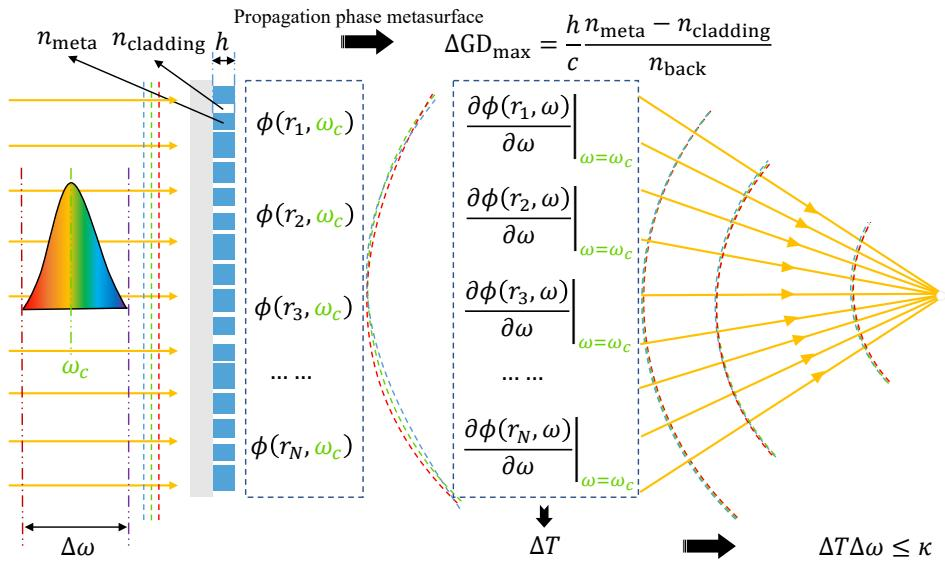

flowchart

This diagram illustrates a propagation phase metasurface model for a waveguide system, showing the relationship between wave numbers, propagation parameters, and their corresponding phase derivatives.

Schematic of the theory of the achromatic metalens design. For a propagation phase metasurface, the upper limit of the span of group delay is $\Delta GD_{max} = \frac{h}{c} \frac{n_{meta} - n_{cladding}}{n_{back}}$ [Eq. (218)], where h represents the height of meta-atoms, and $n_{meta}$ , $n_{cladding}$ , and $n_{back}$ are the refractive indices of the meta-atom material, the cladding material, and the background environment medium, respectively. The central frequency is denoted by $\omega_{c}$ , the bandwidth by $\Delta \omega$ , and the delay time by $\Delta T$ , as expressed by Eq. (225). The dimensionless quantity $\kappa$ limits the product of $\Delta T$ and $\Delta \omega$ , known as the time-bandwidth product [Eq. (220)]. For a more detailed discussion, refer to Subsection 4.4.2.

compensation time of $\left.\frac{\partial\phi(r,\omega)}{\partial\omega}\right|_{\omega=\omega_{c}}$ , light at frequency $\omega$ obtains an additional phase compensation of

$$
\Delta \phi (r, \omega) = \phi (r, \omega) - \phi (r, \omega_ {\mathrm{c}}) = \frac {\partial \phi (r , \omega)}{\partial \omega} \bigg | _ {\omega = \omega_ {\mathrm{c}}} (\omega - \omega_ {\mathrm{c}}) \tag {212}
$$

relative to light at the center frequency $\omega_{c}$ , thereby achieving simultaneity of all frequencies of light at the focus. When the above three conditions are all satisfied, ensuring that light of all frequencies at any position on the metalens arrives at the focus simultaneously, the correction of chromatic aberration, along with the spherical aberration, is successfully achieved.

To further elucidate the meaning of the coefficients in Eq. (211), let's express $C(\omega)$ in a form with clearer physical significance:

$$
C (\omega) = \frac {\sqrt {f ^ {2} + r _ {\mathrm{a}} ^ {2}} - f}{c} \omega + \phi_ {\mathrm{a}}, \tag {213}
$$

where $r_{a}$ and $\phi_{a}$ are parameters that can be freely adjusted. Substituting Eq. (213) into the target phase distribution $\phi(r,\omega)$ gives

$$
\phi (r, \omega) = - \frac {\omega}{c} \left(\sqrt {f ^ {2} + r ^ {2}} - f\right) + C (\omega) = - \frac {\omega}{c} \left(\sqrt {f ^ {2} + r ^ {2}} - \sqrt {f ^ {2} + r _ {\mathrm{a}} ^ {2}}\right) + \phi_ {\mathrm{a}}. \tag {214}
$$

When $r = r_{a}$ , we have $\phi(r_{\mathrm{a}}, \omega) = \phi_{\mathrm{a}}$ , meaning that $r_{a}$ represents the position where the target phase of light at all frequencies coincides, and $\phi_{a}$ determines the target phase value at the coincidence point. At $r = r_{a}$ , the group delay is zero. For $r < r_{a}$ and $r > r_{a}$ , the group delay is positive and negative, respectively. As an intuitive illustration, when

Figure 32  
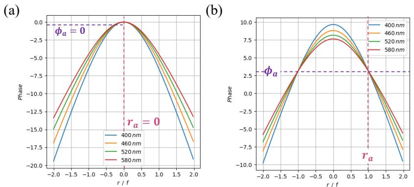

Schematic of the physical meaning of $r_{a}$ and $\phi_{a}$ in Eq. (213). (a) Target phase profiles of the achromatic metalens when $r_{a}=0$ and $\phi_{a}=0$ . (b) Destination phase profiles of the achromatic metalens when $r_{a}=f$ and $\phi_{a}=\pi$ .

$r_{a}=0$ and $\phi_{a}=0$ [i.e., $C(\omega)=0$ ], the target phase distribution diagram is shown in Fig. 32(a); when $r_{a}=f$ and $\phi_{a}=\pi$ , the target phase distribution diagram is shown in Fig. 32(b).

# 4.4.2. Fundamental Limitations of Achromatic Metalenses

Given that the maximum and minimum group delays achievable by meta-atoms are $GD_{max}$ and $GD_{min}$ , respectively, the span of the group delay is $\Delta GD = GD_{max} - GD_{min}$ (assuming the meta-atom database samples this range adequately). For the meta-atom based on the geometric phase modulation mechanism, the group delay is always 0, making it impossible to achieve achromatic imaging. For the meta-atom based on the resonant or propagation phase modulation mechanisms, from Eq. (6) (taking $\lambda_{0} = \frac{2\pi cn_{back}}{\omega}$ ), the group delay is given by

$$
\frac {\mathrm{d} \phi}{\mathrm{d} \omega} = \frac {n _ {\mathrm{eff}} (\omega) h}{n _ {\mathrm{back}} c} + \frac {\omega h}{n _ {\mathrm{back}} c} \frac {\mathrm{d} n _ {\mathrm{eff}} (\omega)}{\mathrm{d} \omega}, \tag {215}
$$

where the first and second terms on the right side represent the contributions of propagation phase and resonant phase modulation mechanisms, respectively. For the meta-atom based only on the propagation phase, $\frac{\mathrm{d}n_{\mathrm{eff}}(\omega)}{\mathrm{d}\omega}=0$ , thus Eq. (215) becomes

$$
\frac {\mathrm{d} \phi}{\mathrm{d} \omega} = \frac {n _ {\mathrm{eff}} (\omega) h}{n _ {\mathrm{back}} c}. \tag {216}
$$

From Eq. (4), the range of the effective refractive index $n_{\mathrm{eff}}(\omega) \in \left[n_{\mathrm{claddng}}(\omega), n_{\mathrm{meta}}(\omega)\right]$ . As a matter of fact, it's inevitable that the group delay of the meta-atom will be affected by the dispersion characteristics of the meta-atom material as well as the phase jump near the resonance frequency [502]. Ignoring these additional dispersion effects and making a rough estimate, the maximum achievable range of group delay is approximated by

$$
\frac {\mathrm{d} \phi}{\mathrm{d} \omega} \in \left[ \frac {h}{c} \frac {n _ {\text {cladding}}}{n _ {\text {back}}}, \frac {h}{c} \frac {n _ {\text {meta}}}{n _ {\text {back}}} \right], \tag {217}
$$

leading to an upper limit of the span of group delay:

$$
\Delta \mathrm{GD} _ {\max} = \frac {h}{c} \frac {\Delta n}{n _ {\mathrm{back}}}, \tag {218}
$$

where $\Delta n = n_{meta} - n_{cladding}$ . Considering the material dispersion, when $n_{meta}(\omega)$ and $n_{cladding}(\omega)$ in Eq. (218) are taken as the maximum and minimum values within the bandwidth range, respectively, the upper limit of the span of group delay is

$$
\Delta \mathrm{GD} _ {\max} = \frac {h}{c} \frac {\Delta n _ {\max}}{n _ {\text {back}}}, \tag {219}
$$

where $\Delta n_{\mathrm{max}} = \max_{\omega} n_{\mathrm{meta}}(\omega) - \min_{\omega} n_{\mathrm{cladding}}(\omega)$ . Equation (218) or Equation (219) indicates that to cover a broader range of group delays, it's necessary to increase the height of the meta-atoms or use meta-atoms made of materials with a higher refractive index.

The time-bandwidth product (TBP) of optical devices like waveguides is defined as the product of the interaction time or delay time $\Delta T$ of the signal light within the device and the signal light's bandwidth $\Delta \omega$ , with a theoretical upper limit given by

$$
\Delta T \Delta \omega \leq \kappa , \tag {220}
$$

where $\kappa$ is a dimensionless quantity that depends on the general properties of the specific device. For metasurfaces based on different phase modulation mechanisms, $\kappa$ has different values, detailed in reference [136].

From Eq. (209), for an achromatic metalens with a radius of $R$ , the range of the required group delay is

$$
- \frac {1}{c} \left(\sqrt {f ^ {2} + R ^ {2}} - f\right) + \left. \frac {\mathrm{d} C (\omega)}{\mathrm{d} \omega} \right| _ {\omega = \omega_ {\mathrm{c}}} \leq \left. \frac {\partial \phi (r , \omega)}{\partial \omega} \right| _ {\omega = \omega_ {\mathrm{c}}} \leq \left. \frac {\mathrm{d} C (\omega)}{\mathrm{d} \omega} \right| _ {\omega = \omega_ {\mathrm{c}}}. \tag {221}
$$

Thus, the span of the required group delay is

$$
\Delta \left(\left. \frac {\partial \phi (r , \omega)}{\partial \omega} \right| _ {\omega = \omega_ {\mathrm{c}}}\right) = \frac {1}{c} \left(\sqrt {f ^ {2} + R ^ {2}} - f\right). \tag {222}
$$

Generally, the group delay has the physical significance of the actual time delay experienced by the incident light when interacting with the metalens $[136]$ . However, this kind of time delay is only meaningful in relative terms—that is, the relative magnitude of the group delay at one position compared to another is meaningful, so it cannot be directly equated to $\Delta T$ , and a reference point for the time delay must be specified first. Choosing the left boundary in Eq. (221) as the zero point for time delay, the range of $\Delta T$ is

$$
0 \leq \Delta T \leq \frac {1}{c} \left(\sqrt {f ^ {2} + R ^ {2}} - f\right). \tag {223}
$$

Combining Eq. (223) with Eq. (220), we obtain

$$
\Delta \omega \leq \frac {\kappa c}{\sqrt {f ^ {2} + R ^ {2}} - f}. \tag {224}
$$

Clearly, although there are other choices for the zero point for time delay, Eq. (223) provides the smallest $\Delta T_{max}$ and thus the largest bandwidth range. Therefore, for achromatic metalenses, $\Delta T$ in Eq. (220) can be directly understood as the span of the group delay in Eq. (222), i.e.,

$$
\Delta T = \Delta \left(\left. \frac {\partial \phi (r , \omega)}{\partial \omega} \right| _ {\omega = \omega_ {\mathrm{c}}}\right) = \frac {1}{c} \left(\sqrt {f ^ {2} + R ^ {2}} - f\right). \tag {225}
$$

Substituting Eq. (181) into Eq. (224), the maximum achievable achromatic bandwidth is derived as

$$
\Delta \omega_ {\max} = \frac {\kappa c}{f} \frac {\sqrt {1 - \left(\mathrm{NA} / n _ {\mathrm{back}}\right) ^ {2}}}{1 - \sqrt {1 - \left(\mathrm{NA} / n _ {\mathrm{back}}\right) ^ {2}}}. \tag {226}
$$

Equation (226) reveals the intrinsic trade-off between the achromatic bandwidth and NA. The larger the lens's NA, the more limited the achievable achromatic bandwidth. This indicates that in the design of achromatic metalenses, a balance must be struck between the NA and bandwidth. For the most commonly used meta-atoms based on the propagation phase modulation mechanism, $\kappa$ can be expressed as [136]

$$
\kappa = \frac {\omega_ {\mathrm{c}} h \Delta n _ {\max}}{c _ {0}}. \tag {227}
$$

Substituting Eq. (227) into Eq. (226), the maximum achromatic bandwidth when utilizing the propagation phase modulation mechanism to achieve group delay is

$$
\Delta \omega_ {\max} = \omega_ {\mathrm{c}} \frac {h \Delta n _ {\max}}{f n _ {\mathrm{back}}} \frac {\sqrt {1 - \left(\mathrm{NA} / n _ {\mathrm{back}}\right) ^ {2}}}{1 - \sqrt {1 - \left(\mathrm{NA} / n _ {\mathrm{back}}\right) ^ {2}}}. \tag {228}
$$

The Fresnel number FN serves as a good measure of the practical workload of a lens $[503]$ , which is defined as

$$
\mathrm{FN} (r) = \frac {d (r)}{\lambda_ {\mathrm{c}} / 2}, \tag {229}
$$

where $\lambda_{c}=\frac{2\pi}{\omega_{c}}c$ is the wavelength in the environmental medium corresponding to the center angular frequency $\omega_{c}$ , and $d(r)$ is the optical path difference at a radius of r provided by a metalens conforming to the hyperbolic phase distribution, given by

$$
d (r) = \sqrt {r ^ {2} + f ^ {2}} - f. \tag {230}
$$

When assuming $\frac{r}{f} \ll 1$ , we have $d(r) \approx \frac{r^2}{2f}$ , thus $\mathrm{FN} \approx \frac{r^2}{\lambda_c f}$ , which is the traditional expression for the Fresnel number under the paraxial approximation. Considering a lens with a radius of $R$ , and defining the Fresnel number of the lens as $\mathrm{FN}(r = R) = \frac{d(R)}{\lambda_c / 2}$ [using Eq. (229)], from Eqs. (225) and (230), we obtain

$$
d (r = R) = c \Delta T. \tag {231}
$$

For an achromatic metalens based on the propagation phase modulation mechanism, by combining Eqs. (220), (227), (229), and (231), the product of the achievable bandwidth and Fresnel number satisfies [503]

$$
\Delta \omega \cdot \mathrm{FN} \leq \frac {n _ {\mathrm{back}} \Delta n _ {\mathrm{max}} h \omega_ {\mathrm{c}} ^ {2}}{\pi c}. \tag {232}
$$

Compared to Eq. (228), Eq. (232) indicates that, relative to NA, the Fresnel number has a more fundamental limiting relationship with the achromatic bandwidth. For an achromatic metalens with a specific achromatic bandwidth, the Fresnel number is subject to an upper limit as constrained by Eq. (232). In this case, from the definition of the Fresnel number, there must be a trade-off between the achievable NA and the size of the metalens: on the one hand, a high-NA achromatic metalens will inevitably have

a very limited metalens size; on the other hand, for a metalens of a certain size, the limitation of the achromatic bandwidth on the metalens's Fresnel number will translate into a restriction on its NA.

Given Eq. (209), the target group delay decreases from the center to the edge of the metalens. By adjusting $C(\omega)$ , it is always possible to set the target group delay at the metalens center to correspond to $GD_{max}$ , i.e.,

$$
\mathrm{GD} _ {\max} = \left. \frac {\mathrm{d} C (\omega)}{\mathrm{d} \omega} \right| _ {\omega = \omega_ {\mathrm{c}}}. \tag {233}
$$

This alignment makes the achievable range of group delay correspond to the target range of group delay. Therefore, from Eq. (221), to meet the group delay requirement, it must hold that

$$
- \frac {1}{c} \left(\sqrt {f ^ {2} + r ^ {2}} - f\right) + \left. \frac {\mathrm{d} C (\omega)}{\mathrm{d} \omega} \right| _ {\omega = \omega_ {\mathrm{c}}} \geq \mathrm{GD} _ {\min}. \tag {234}
$$

Combining Eqs. (233) and (234), we obtain

$$
\Delta \mathrm{GD} = \mathrm{GD} _ {\max} - \mathrm{GD} _ {\min} \geq \frac {1}{c} \left(\sqrt {f ^ {2} + r ^ {2}} - f\right). \tag {235}
$$

Thus, considering only the group delay, the maximum achievable radius $r_{max}$ of the metalens is

$$
r _ {\max} = f \sqrt {\left(1 + \frac {c \Delta \mathrm{GD}}{f}\right) ^ {2} - 1}. \tag {236}
$$

Combining Eq. (181) and (235), taking $R = r_{\mathrm{max}}$ , and eliminating $f$ , another expression for $r_{\mathrm{max}}$ is obtained [144]

$$
r _ {\max} = c \Delta \mathrm{GD} \left(\sqrt {\left(n _ {\text {back}} / \mathrm{NA}\right) ^ {2} - 1} + \left(n _ {\text {back}} / \mathrm{NA}\right)\right). \tag {237}
$$

Here, we see again the fundamental trade-off between the NA and the maximum achievable size of a metalens. In practical design, given a specific focal length or NA, when the maximum span of group delay $\Delta GD_{max}$ that can be achieved by meta-atoms is determined, Eq. (236) or Eq. (237) can be used to predict the maximum radius of an achromatic metalens achievable under the group delay limitation.

For cases utilizing the propagation phase modulation mechanism to achieve group delay, substituting the upper limit of group delay span expressed by Eq. (219) into Eq. (237) yields

$$
r _ {\max} = h \frac {\Delta n _ {\max}}{n _ {\text {back}}} \left(\sqrt {\left(n _ {\text {back}} / \mathrm{NA}\right) ^ {2} - 1} + \left(n _ {\text {back}} / \mathrm{NA}\right)\right). \tag {238}
$$

We note that the aforementioned limitations apply specifically to broadband achromatic metalenses. If chromatic aberration correction is required only at multiple discrete operational wavelengths rather than across a continuous bandwidth, these constraints can be significantly relaxed. This adjustment gives rise to the concept of quasi-achromatic metalenses $[504]$ , which effectively extends the bandwidth, as illustrated in Fig. 33. Details of this approach will be further explored in Subsection 4.4.3. Additionally, this flexibility enables broadband achromatic imaging using a multi-wavelength achromatic metalens with sufficiently small spectral sampling, a method that will also be introduced in Subsection 4.4.4.

Figure 33  
Bandwidth of broadband achromatic metalens (BAML) and quasi-achromatic metalens (QAML)  
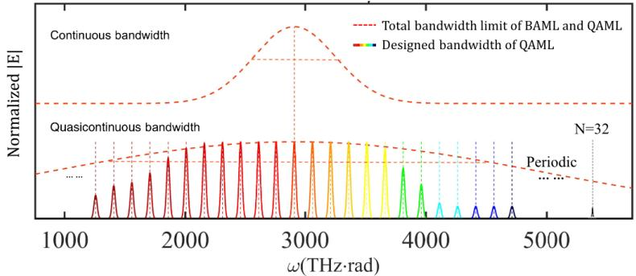

spectrogram

| Frequency \((\omega\) THz-rad) | Total bandwidth limit of BAML and QAML | Designed bandwidth of QAML | Signal |
| --- | --- | --- | --- |
| ~1200 | ~0.1 | ~0.1 | N/A |
| ~1400 | ~0.2 | ~0.2 | N/A |
| ~1600 | ~0.3 | ~0.3 | N/A |
| ~1800 | ~0.4 | ~0.4 | N/A |
| ~2000 | ~0.5 | ~0.5 | N/A |
| ~2200 | ~0.6 | ~0.6 | N/A |
| ~2400 | ~0.7 | ~0.7 | N/A |
| ~2600 | ~0.8 | ~0.8 | N/A |
| ~2800 | ~0.9 | ~0.9 | N/A |
| ~3000 | ~1.0 | ~1.0 | N/A |
| ~3200 | ~0.9 | ~0.9 | N/A |
| ~3400 | ~0.8 | ~0.8 | N/A |
| ~3600 | ~0.7 | ~0.7 | N/A |
| ~3800 | ~0.6 | ~0.6 | N/A |
| ~4000 | ~0.5 | ~0.5 | N/A |
| ~4200 | ~0.4 | ~0.4 | N/A |
| ~4400 | ~0.3 | ~0.3 | N/A |
| ~4600 | ~0.2 | ~0.2 | N/A |
| ~4800 | ~0.1 | ~0.1 | N/A |
| ~5000 | ~0.05 | ~0.05 | N/A |
| ~5200 | ~0.02 | ~0.02 | N/A |
| ~5400 | ~0.01 | ~0.01 | N/A |

Simulated achromatic spectra of the broadband achromatic metalens and quasi-achromatic metalens under flat spectral input conditions. Both metalenses were designed under identical conditions, each with a diameter of 2 mm and an NA of 0.15. Adapted with permission from Chen et al., Phys. Rev. Lett. 131, 193801 (2023) [504]. Copyright © 2023 American Physical Society.

Figure 34  
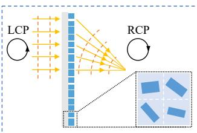

text_image

LCP
RCP

Polarization-sensitive achromatic metalens design

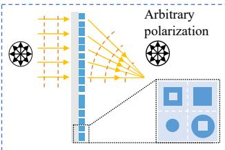

text_image

Arbitrary
polarization

Polarization-insensitive achromatic metalens design

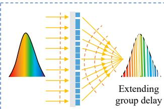

flowchart

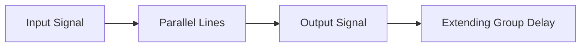
```mermaid
graph LR
  Input["Input Signal"] --> A["Parallel Lines"]
  A --> B["Output Signal"]
  B --> C["Extending Group Delay"]
```

Enhancing group delay range through theory innovation

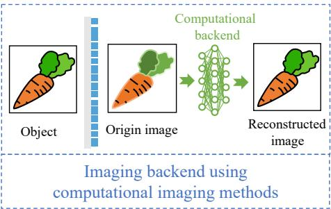

flowchart

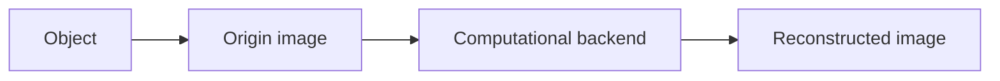
```mermaid
graph LR
  A["Object"] --> B["Origin image"]
  B --> C["Computational backend"]
  C --> D["Reconstructed image"]
```

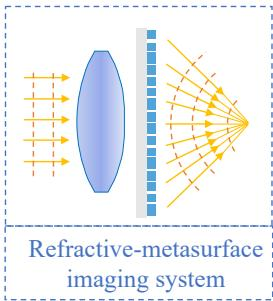

text_image

Refractive-metasurface
imaging system

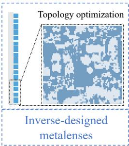

text_image

Topology optimization
Inverse-designed
metalenses

Schematic of the main methods for broadband achromatic metalens design.

# 4.4.3. Design Methods for Broadband Achromatic Metalenses

The main methods for designing broadband achromatic metalenses are presented in Fig. 34, which will be discussed in detail below.

Classic design methods for polarization-sensitive achromatic metalenses. The hybrid phase modulation mechanism is widely utilized to achieve polarization-sensitive achromatic metalenses.

By tailoring the shape and size parameters of meta-atoms, a meta-atom database is constructed to ensure coverage of the target group delay range as indicated by Eq. (221), while maintaining the group delay dispersion close to zero. Since $\left.\frac{\mathrm{d}C(\omega)}{\mathrm{d}\omega}\right|_{\omega = \omega_{\mathrm{c}}} = C_1$ is adjustable in Eq. (209), here the "coverage" of the target group delay range essentially requires the group delay span of the meta-atoms in the database to exceed the target

group delay span in Eq. (222). In the arrangement of meta-atoms, for a unit positioned at $(x,y)$ , one should first select a meta-atom from the database that satisfies the dispersion requirements [Eqs. (209) and (210)] at that position while maintaining the highest possible transmittance and PCE. Eq. (208) determines the target phase for the central frequency $\omega_{c}$ at that position, which is achieved through introducing a compensation of phase $\Delta\phi(x,y)$ by rotating the meta-atom, i.e.,

$$
\Delta \phi (x, y) = \phi (r, \omega_ {\mathrm{c}}) - \phi_ {0} (x, y) = - \frac {\omega_ {\mathrm{c}}}{c} \left(\sqrt {f ^ {2} + r ^ {2}} - f\right) + C (\omega_ {\mathrm{c}}) - \phi_ {0} (x, y), \tag {239}
$$

where $\phi_{0}(x,y)$ is the phase shift for $\omega_{c}$ introduced by this meta-atom when the rotation angle is $0^{\circ}$ , which can be obtained through simulation in actual design. Hence, according to Eq. (23), this meta-atom should rotate counterclockwise around the z-axis at an angle of $\theta(x,y)=\frac{\Delta\phi(x,y)}{2\sigma}$ , where $\sigma=\pm1$ corresponds to the cases when the incident light is LCP and RCP, respectively.

In 2018, Capasso's group [139] achieved an achromatic metalens with an NA of 0.2 and a focal length of $63~\mu \mathrm{m}$ , covering a bandwidth from $470~\mathrm{nm}$ to $670~\mathrm{nm}$ . To provide sufficient design freedom, the metasurface unit consists of one or more $\mathrm{TiO_2}$ nanofins with varying lateral dimensions but a uniform height of $600~\mathrm{nm}$ . The lattice constant was $400~\mathrm{nm}$ . As shown in Fig. 35(a), the actual focal lengths of the metalens at various wavelengths matched the designed focal length, demonstrating its achromatic performance. The Strehl ratios were above 0.8 across all wavelengths, but the absolute focusing efficiencies at various wavelengths were all below $20\%$ (with an effective focusing area diameter close to the diameter of the Airy disk), due to the compromise of using meta-atoms with low PCE to cover the complete range of group delay. To optimize efficiency, there is a need to encompass a broader array of meta-atom shapes to expand the design space, thereby constructing a more comprehensive database that meets both dispersion control and device efficiency requirements.

In 2017 and 2018, Tsai's group and their collaborators achieved achromatic metalenses operating in the near-infrared [100] and visible [351], respectively. Although their design algorithm differed in form from the aforementioned method, it was essentially consistent. For Eqs. (208)–(210), instead of positioning $\omega_{c}$ at the center of the bandwidth, it was chosen as the minimum angular frequency within the bandwidth. In addition, they set $r_{a}=R$ and $\phi_{a}=-\frac{\omega_{c}}{c}\left(\sqrt{f^{2}+R^{2}}-f\right)$ for $C(\omega)$ in Eq. (213). In this way, we obtain the target phase distribution for achromatic metalenses that they proposed in both works. Utilizing meta-atoms with an MIM structure (layers of Au, $SiO_{2}$ , and Au), the near-infrared metalens operated in reflection mode, with a lens radius of 27.775 $\mu$ m, a focal length of 100 $\mu$ m, and an NA of 0.268, covering a bandwidth from 1200 nm to 1680 nm. The visible metalens operated in transmission mode, using GaN meta-atoms with a height of 800 nm. The units were arranged in a hexagonal lattice with a lattice constant of 120 nm, employing both pillar and hole-type meta-atoms to meet dispersion engineering requirements. This metalens had a focal length of 235 $\mu$ m, an NA of 0.106, and operated across a bandwidth from 400 nm to 660 nm, with an average absolute focusing efficiency of about 40% across the bandwidth. The original images, as shown in the left panel of Fig. 35(b), and the metalens imaging results, as shown in the middle panel of Fig. 35(b), display minor color differences mainly due to variations in focusing efficiency across wavelengths. After the intensity compensation for the red, green, and blue color channels, the corrected images are shown in the right panel of Fig. 35(b). In 2019, Tsai's group and their collaborators [119] further assembled the aforementioned visible achromatic metalenses into a $60\times60$ metalens array, thus achieving an achromatic full-color light field camera with a resolution of 1.95 $\mu$ m under the white light illumination.

Figure 35  
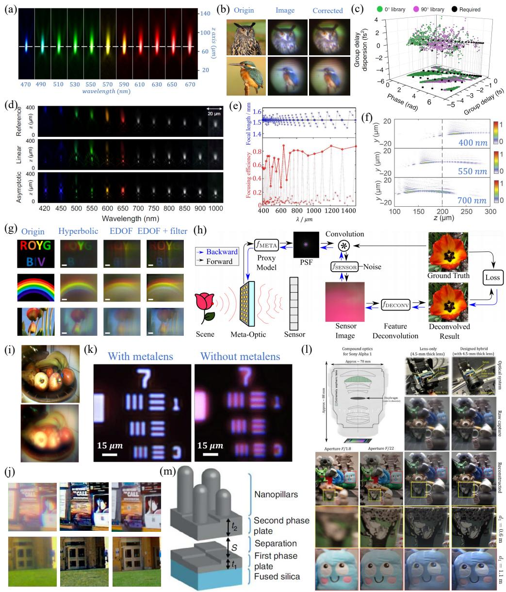

Design methods for broadband achromatic metalenses. (a) Measured intensity distributions on the xOz plane of the achromatic metalens. The white dashed line indicates the position of the focal length. (b) Imaging results of the achromatic metalens. Left: original image. Middle: imaging result. Right: color-corrected imaging result. (c) Meta-atom database constructed for the design of the polarization-independent achromatic metalens. (d) Measured intensity distributions along the propagation direction (z axis) of three kinds of metalenses. Top: reference hyperbolic metalens. Middle: linear matched achromatic metalens. Bottom: asymptotically matched achromatic metalens. (e) Focal lengths and focusing efficiencies of the quasi-achromatic metalens for different wavelengths within the bandwidth. The data points for extension and non-extension frequencies are plotted with circle and asterisk markers, respectively. (f) Simulated intensity distributions along the propagation direction of the extended depth of focus (EDOF) metalens. (g) Under white light illumination, for the original image (first column), the imaging results of the metalens with hyperbolic phase distribution (second column), the EDOF metalens (third column), and the EDOF metalens combined with deconvolution-based computational backend (fourth column). (h) Schematic of the end-to-end optimization algorithm of the metasurface (continued)

(continued) imaging system with a neural network-based computational backend. (i) Top: imaging result of the metalens after neural network image processing. Bottom: imaging result of the hyperbolic metalens operating at a wavelength of 511 nm, serving as a reference. (j) Raw captures (left panels), restored images (middle panels), and reference images (right panels) across real-world scenarios for a metalens operating at a wavelength of 526 nm. (k) Imaging result of a single refractive lens with (left) or without (right) the metalens for a 1951 USAF resolution target under white light illumination. (l) Imaging results of the traditional camera (first two columns), the refractive lens (third column), and the hybrid refractive-metasurface imaging system (fourth column) for real-world scenes. (m) Schematic of the cascaded structure of phase plates and meta-atoms. (a) Adapted with permission from Chen et al., Nat. Nanotechnol. 13, 220–226 (2018) [139]. Copyright © 2018 Springer Nature. (b) Adapted with permission from Wang et al., Nat. Nanotechnol. 13, 227–232 (2018) [351]. Copyright © 2018 Springer Nature. (c) Adapted from [156] under a Creative Commons license. (d) Adapted from [354] under a Creative Commons license. (e) Reprinted with permission from Chen et al., Phys. Rev. Lett. 131, 193801 (2023) [504]. Copyright © 2023 American Physical Society. (f) and (g) Adapted from [505] under a Creative Commons license. (h) and (i) Adapted from [506] under a Creative Commons license. (j) Adapted with permission from Dong et al., ACS Photonics 11, 1645–1656 (2024) [507]. Copyright © 2024 American Chemical Society. (k) Adapted with permission from Chen et al., Nano Lett. 18, 7801–7808 (2018) [121]. Copyright © 2018 American Chemical Society. (l) Reprinted from [508] under a Creative Commons license. (m) Adapted from [509] under a Creative Commons license.

Design methods for polarization-insensitive achromatic metalenses. The achromatic metalenses introduced above are polarization-sensitive. To achieve polarization-insensitive achromatic metalens designs, the most straightforward method involves solely using isotropic meta-atoms based on resonant or propagation phase modulation mechanisms to produce polarization-insensitive electromagnetic responses. In terms of design methodology, the distinction lies in that the target phase distribution at the central angular frequency can no longer be achieved by the geometric phase modulation mechanism. Thus, when constructing the meta-atom database, it is necessary to introduce an additional design dimension to cover the $2\pi$ phase shift for incident light at $\omega_{c}$ , while maintaining the coverage of the group delay range and ensuring that the group delay dispersion is near zero. Utilizing this approach (but without considering the group delay dispersion dimension), in 2018, Yu's group [144] developed a polarization-insensitive achromatic metalens with a radius of $50 \mu m$ , a focal length of $30 \mu m$ , an NA of approximately 0.88, and a bandwidth from 1200 nm to 1400 nm. To cover the complete phase and group delay modulation, the meta-atoms were made of high-refractive-index Si, with a height of 1400 nm and featuring various shapes such as crosses, squares, and square holes. The relative deviation of the focal length at each wavelength from the mean focal length was constrained within a range from 2% to 5%. The Strehl ratios were above 0.8 across all wavelengths, with an average absolute focusing efficiency (with an effective focusing area diameter approximately 3–5 times the FWHM of the focal spot) around 35%. Similarly, in 2020, Ndao et al. [510] introduced a meshed metasurface structure, achieving a polarization-insensitive achromatic metalens with dimensions of $20 \mu m \times 20 \mu m$ , an NA of 0.12, a bandwidth from 640 nm to 1200 nm, and an average absolute focusing efficiency exceeding 70%. The $TiO_{2}$ meta-atoms utilized isotropic structures, with a height of 350 nm and a lattice constant of 370 nm.

Based on Eq. (232), the most direct approach to further enhance the size, NA, or achromatic bandwidth of an achromatic metalens is to increase the height of the meta-atoms. In 2021, Xiao's group and their collaborators [138] developed a top-down etching fabrication technique that achieved a height of $1500\mathrm{nm}$ for $\mathrm{TiO_2}$ meta-atoms, with an aspect ratio of approximately 37.5. Utilizing four shapes of isotropic meta-atoms, they created a polarization-insensitive achromatic metalens with a radius of $15~{\mu\mathrm{m}}$ , an NA of 0.24, and a bandwidth from $650\mathrm{nm}$ to $1000\mathrm{nm}$ . The Strehl ratios were above 0.81 across all wavelengths within the bandwidth, with an average absolute focusing efficiency (with an effective focusing area diameter six times the FWHM of the focal spot) of approximately $77.1\%$ .

In 2019, Capasso's group [156] proposed a counterintuitive design approach that achieves polarization-insensitive metalens designs using polarization-sensitive structures. Based on Eq. (23), a meta-atom rotated by $\theta$ introduces geometric phase shifts of $-2\theta$ and $+2\theta$ for LCP and RCP incident light, respectively. The polarization sensitivity of the geometric phase is evident since these two phase shifts are usually not equal. However, by restricting the rotation angle of the meta-atoms to only $0^{\circ}$ or $90^{\circ}$ , it results in $2\theta = -2\theta$ , indicating that the introduced geometric phase is polarization-insensitive at these specific rotation angles, as discussed in detail in Subsection 2.1.3. The advantage of this approach is that the meta-atoms possess an anisotropic structure that provides a higher degree of shape tunability compared to the isotropic structures typically used in polarization-insensitive designs. In constructing the meta-atom database, it is only necessary to calculate the phase shift and dispersion properties of meta-atoms at a rotation angle of $0^{\circ}$ , as shown by the green dots in Fig. 35(c). When the meta-atom is rotated to $90^{\circ}$ , the introduced geometric phase increases by $\pi$ , while the dispersion properties remain unchanged. Hence, the electromagnetic response characteristics of the meta-atoms rotated by $90^{\circ}$ can be directly obtained, as indicated by the purple dots in Fig. 35(c). Utilizing this approach, they achieved a polarization-insensitive achromatic metalens with a radius of $13.2\mu \mathrm{m}$ , an NA of 0.2, and a bandwidth from $460\mathrm{nm}$ to $700\mathrm{nm}$ . The meta-atoms were made of $\mathrm{TiO_2}$ with a height of $600\mathrm{nm}$ and a lattice constant of $400\mathrm{nm}$ . The metalens showed deviations in the actual focal lengths from the set value of no more than $9\%$ across the wavelengths, with the Strehl ratios maintained around 0.8. The absolute focusing efficiency was about $30\%$ at the wavelength near $532\mathrm{nm}$ , with only about a $4\%$ variation under different incident polarization states.

In 2022, Ren et al. [511] employed the same method to develop a polarization-insensitive metalens with a radius of 100 $\mu$ m, an NA of 0.2, and an achromatic bandwidth ranging from 1.25 $\mu$ m to 1.65 $\mu$ m. Employing the 3D laser printing technology based on two-photon polymerization, the high degree of freedom for meta-atoms was unlocked. This adjustment allowed for a broader range of group delay modulation, extending from Eq. (218) to

$$
\Delta \mathrm{GD} _ {\max} = \frac {h _ {\max} n _ {\text {meta}} - h _ {\min} n _ {\text {cladding}}}{c n _ {\text {back}}}, \tag {240}
$$

where $h_{max}$ and $h_{min}$ represent the maximum and minimum heights of meta-atoms, respectively.

New advances for achromatic metalens design theory. Recently, there have been new developments in the design theory of achromatic metalenses, thereby breaking through the performance limits of the achromatic metalens design methods mentioned above.

Beforehand, we have consistently set $C(\omega)$ to satisfy the form of Eq. (211), thereby ensuring that the group delay dispersion expressed by Eq. (210) is 0, which requires the

phase shift introduced by the meta-atom to be linearly related to the angular frequency. However, as indicated by Eqs. (6) and (215), due to the effective refractive index of meta-atoms being frequency-dependent, the relationship between the phase shift of the meta-atom and angular frequency often exhibits nonlinearity, especially for achromatic metalens designs with a wide bandwidth, making the chromatic aberration correction less than ideal, as shown in the middle panel of Fig. 35(d). If the second derivative of $C(\omega)$ is non-zero, a nonlinear relationship between the target phase shift and angular frequency can be accommodated. In this way, $C(\omega)$ expressed in Eq. (213) becomes

$$
C (\omega) = \frac {\omega}{c} \left(\sqrt {f ^ {2} + r _ {\mathrm{a}} ^ {2} (\omega)} - f\right) + \phi_ {\mathrm{a}}, \tag {241}
$$

where $r_{\mathrm{a}}(\omega)$ is a now function of angular frequency. Consequently, the hyperbolic phase distribution, as given by Eq. (168), can be rewritten as

$$
\phi_ {\text {hyperbolic}} (r, \omega) = - \frac {\omega}{c} \left(\sqrt {f ^ {2} + r ^ {2}} - \sqrt {f ^ {2} + r _ {\mathrm{a}} ^ {2} (\omega)}\right) + \phi_ {\mathrm{a}}. \tag {242}
$$

Here, $r_{\mathrm{a}}(\omega)$ represents the distance from the intersection of the metasurface and the spherical wavefront of the output light with angular frequency $\omega$ to the center of the metalens $[\phi_{\mathrm{hyperbolic}}(r_{\mathrm{a}}(\omega),\omega)=\phi_{\mathrm{a}}]$ . In this case, the target group delay is given by

$$
\begin{array}{l} \frac {\partial \phi (r , \omega)}{\partial \omega} \bigg | _ {\omega = \omega_ {\mathrm{c}}} = - \frac {1}{c} \sqrt {f ^ {2} + r ^ {2}} \\ \left. + \frac {1}{c} \left(\sqrt {f ^ {2} + r _ {\mathrm{a}} ^ {2} \left(\omega_ {\mathrm{c}}\right)} + \frac {\omega_ {\mathrm{c}} r _ {\mathrm{a}} \left(\omega_ {\mathrm{c}}\right)}{\sqrt {f ^ {2} + r _ {\mathrm{a}} ^ {2} \left(\omega_ {\mathrm{c}}\right)}} \frac {\mathrm{d} r _ {\mathrm{a}} (\omega)}{\mathrm{d} \omega} \right| _ {\omega = \omega_ {\mathrm{c}}}\right). \tag {243} \\ \end{array}
$$

For a specific central angular frequency $\omega_{c}$ , the second term in Eq. (243) becomes a constant with respect to $\omega$ , which corresponds to the scenario discussed earlier. However, by dividing the achromatic bandwidth into a series of sub-bandwidths, each with a central angular frequencies $\omega_{c_{i}}$ ( $i=1,2,\ldots,M$ , where M is the number of sub-bandwidths), different ranges of group delay can be adopted for different sub-bandwidths by selecting different values for $r_{\mathrm{a}}\left(\omega_{\mathrm{c}_{\mathrm{i}}}\right)$ . We note that the span of the target group delay for different $\omega_{c_{i}}$ remains consistent, as represented by Eq. (222). This approach is particularly advantageous for designing achromatic metalenses with very wide bandwidths, where the dispersion characteristics of meta-atoms cannot be accurately approximated by a linear relationship between phase shift and angular frequency. The main challenge in this design lies in selecting appropriate values for $r_{\mathrm{a}}\left(\omega_{\mathrm{c}_{\mathrm{i}}}\right)$ so that the target dispersion characteristic for different values of $\omega_{c_{i}}$ and r, as described by Eq. (243), can be covered as much as possible by the meta-atoms in the database. In 2023, Hu et al. [354] optimized $r_{\mathrm{a}}\left(\omega_{\mathrm{c}_{\mathrm{i}}}\right)$ using a particle swarm optimization method and achieved a polarization-insensitive achromatic metalens with a radius of 25 $\mu$ m, an NA of 0.164, and a bandwidth covering from 400 nm to 1000 nm. This type of metalens is termed “asymptotic matched metalenses.” The meta-atoms were made of $TiO_{2}$ , with a height of 1 $\mu$ m, an aspect ratio of up to 20, and a lattice constant of 500 nm, featuring isotropic structures. The absolute focusing efficiency within the bandwidth (with an effective focusing area diameter approximately three times the FWHM of the focal spot) varied from 30% to 80%, with an average value of about 50%. The focusing performance, as shown in the bottom panel of Fig. 35(d), exhibited chromatic aberration correction superior to that of the metalens designed by the previous method under the same condition.

Due to manufacturing constraints associated with high aspect ratio nanostructures and multilayer metasurfaces, the achievable group delay range of meta-atoms, and

consequently, the performance of achromatic metalenses, are constrained. In 2023, Chen et al. [504] introduced the concept of quasi-achromatic metalenses to address this problem in a novel way. Unlike achromatic metalenses, in the design of quasi-achromatic metalenses, akin to allowing phase to extend periodically with $2\pi$ , group delay is permitted to extend periodically with a period of $\frac{2\pi}{\Delta\omega}$ . In this case, chromatic aberration can be corrected only for a set of discrete extension frequencies with a certain angular frequency interval $\Delta\omega$ within the quasi-achromatic bandwidth, but this approach significantly reduces the stringent requirements on the range of group delay for wide bandwidth, high NA, or large-size metalenses, thus overcoming the fundamental performance limitations indicated by Eq. (232). To validate this approach, a quasi-achromatic metalens with a radius of 1 mm, an NA of 0.55, and a quasi-achromatic bandwidth from 400 nm to 1500 nm was simulated. Its focal lengths at different wavelengths are depicted in the top panel of Fig. 35(e), showcasing good achromatic focusing performance at the extension frequencies. As shown in the bottom panel of Fig. 35(e), at non-extension frequencies, although the focal length deviations are large, their absolute focusing efficiencies are close to 0 (meanwhile, the average absolute focusing efficiency at the extension frequencies is about 70%), thus not severely impacting the imaging quality.

Achromatic metalens imaging based on computational imaging methods. Combining computational imaging methods with metalenses represents a cutting-edge trend in the field.

(I) Integration of traditional digital image processing with metalenses. In 2018, Colburn et al. [505] achieved the achromatic metalens imaging in the visible range from 400 nm to 700 nm using computational imaging techniques. As previously mentioned, the chromatic aberration of a metalens manifests as a correlation between the actual focal length and the angular frequency. However, by employing a metalens with extended depth of focus (EDOF), it's possible to preserve spatial frequency information within an expanded focal range at the cost of reduced image SNR, thereby increasing the imaging system's tolerance to focal shifts. Superimposing a cubic phase on the hyperbolic phase distribution effectively extends the depth of focus, with the phase distribution expressed as

$$
\phi_ {\mathrm{EDOF}} (x, y, \omega) = - \frac {\omega}{c} \left(\sqrt {f ^ {2} + x ^ {2} + y ^ {2}} - f\right) + \frac {\gamma}{R ^ {3}} \left(x ^ {3} + y ^ {3}\right) + C (\omega), \tag {244}
$$

where $\gamma$ is a constant that represents the contribution of the cubic phase. Setting $\gamma = 55\pi$ , and using isotropic cylindrical c-Si meta-atoms with a height of $633~\mathrm{nm}$ and a lattice constant of $443~\mathrm{nm}$ , they realized a metalens that operates at a wavelength of $550~\mathrm{nm}$ with a focal length of $200\mu \mathrm{m}$ and a radius of approximately $100\mu \mathrm{m}$ . Simulations of its focusing performance at different wavelengths are shown in Fig. 35(f). Further improvements in image quality were achieved using the Wiener filtering method, where the convolution kernel was calibrated by measuring the PSF of the metalens. Under white light illumination, the comparison of imaging results of the hyperbolic metalens, EDOF metalens, and EDOF metalens combined with deconvolution computational backend is shown in Fig. 35(g), which demonstrates that this method can achieve good chromatic aberration correction with a certain degree of sacrifice in SNR.

(II) End-to-end optimization methods. A particularly promising design approach involves jointly optimizing the meta-optics and the computational backend within an end-to-end framework, thereby ensuring optimal performance at the system level.

In 2021, Tseng et al. [506] implemented a neural network as the computational backend for a metalens, achieving wide-FOV and chromatic aberration-free high-quality imaging. The algorithm is shown in Fig. 35(h). The initial target phase distribution of

the metalens, operating at a single wavelength, was defined by Eq. (194) to support wide FOV imaging. Subsequently, the metasurface structure was co-optimized with a neural network performing image post-processing in an end-to-end manner, where the optimization loss function was defined as the discrepancy between the imaging result of the metalens processed by the neural network and the ground truth. By incorporating a surrogate model that solves for the electromagnetic response of the meta-atoms, the forward computational process from the metasurface structure to the loss function was ensured to be differentiable, allowing the entire system to be optimized based on the gradient descent algorithm. Compared to the imaging result of a hyperbolic metalens operating at a wavelength of 511 nm shown in the bottom panel of Fig. 35(i), the post-processed imaging result of the metalens shown in the top panel of Fig. 35(i) exhibits the excellent achromatic imaging effect. In 2025, a similar end-to-end framework was employed by Park et al. to achieve full-color imaging with a 70° FOV [512].

Another end-to-end optimization method, proposed by Pinilla et al. [508], will be discussed in the context of refractive-metasurface hybrid imaging systems.

Additionally, we note that end-to-end-optimized metasurfaces have also been applied to a wide range of applications, including subwavelength-resolution imaging $[513]$ , multidimensional information extraction $[513]$ , multi-channel imaging $[514]$ , compressed sensing recovery $[515]$ , and temperature imaging in the long-wavelength infrared regime $[516]$ .

(III) Through deep-learning-enabled image denoising and super-resolution reconstruction, high-quality imaging can be achieved for metalenses without requiring any hardware modifications to the metalens itself $[507,517–519]$ . For instance, in 2024, Dong et al. $[507]$ achieved chromatic aberration correction for the imaging result of a metalens operating at a wavelength of 526 nm, with the task being accomplished using solely the U-Net, a universal neural network architecture. The metalens, composed of cylindrical Si pillar meta-atoms, has a radius of 2.5 mm, a focal length of 8 mm, and a lattice constant of 180 nm. To prevent overfitting and boost generalization, the training dataset incorporates 1500 images from both real and synthetic objects. The experimental results shown in Fig. 35(j) demonstrate the neural network's capability to significantly enhance the metalens's imaging quality across a variety of environmental conditions and focusing distances.

Refractive-metasurface imaging system. Due to the limitation between the achromatic bandwidth, NA, and lens size as indicated by Eq. (232), the radii of almost all of the aforementioned achromatic metalenses are confined to the scale of tens of micrometers, failing to meet the demands of practical applications. By utilizing the flexible phase and dispersion modulation features of metasurfaces in conjunction with other optical elements such as traditional lenses, it is possible to achieve the design of large-scale and high-NA achromatic optical systems.

In 2018, Capasso's group [121] introduced the concept of the refractive-metasurface imaging system, which utilizes a metalens to correct for the spherical aberration and chromatic aberration for a refractive optical system. The advantage of this approach is twofold: from the perspective of the metalens, the span of group delay provided by the meta-atoms only needs to compensate for the material dispersion of the refractive optical system, which is significantly less than the span of group delay required by a standalone metalens as represented by Eq. (222); from the perspective of the refractive optical system, the metalens is expected to reduce the number of refractive optical elements needed to correct aberrations, thereby reducing the volume and weight of the optical system. For a standard refractive spherical lens (LA4249, Thorlabs Inc.), the imaging results under non-coherent white light illumination with and without a preceding corrective metalens are shown in Fig. 35(k). This refractive-metasurface

imaging system has an NA of 0.075, an effective focal length of 9.96 mm, and a peak focusing efficiency of approximately 35%, covering the entire visible spectrum for chromatic aberration correction.

In 2023, Pinilla et al. [508] leveraged a refractive-metasurface imaging system and computational imaging technology to develop a compact camera capable of high-quality full-color imaging with a large DOF. As shown in the top right of Fig. 35(1), the imaging system consists of a CMOS sensor, a refractive lens, and a front-mounted metalens, with an aperture and focal length of 5 mm. The original imaging results of the system are further reconstructed through a computational backend based on the neural network. In the design process, the hardware system was first assembled, where a spatial light modulator (SLM) was used in place of the metalens. Then, a hardware-in-loop end-to-end strategy was employed to co-optimize the phase distribution of the SLM and the neural network. Subsequently, the metalens was designed based on the optimized phase distribution of the SLM. The imaging results of the designed camera compared to those of a commercial traditional camera for a real-world scene are shown in Fig. 35(1), demonstrating the advantage of its large DOF.

Other design methods for achromatic metalenses. Beyond the methods mentioned above, there are other approaches to achieve broadband achromatic metalens designs. In 2020, Balli et al. [509] achieved a hybrid achromatic metalens with an entrance pupil diameter of 40 $\mu$ m, an NA of 0.32, and a bandwidth from 1000 nm to 1800 nm, utilizing the unit structure composed of a phase plate cascaded with a meta-atom, as illustrated in Fig. 35(m), along with a compatible design method and lithography process. The average absolute focusing efficiency (with an effective focusing area diameter three times the FWHM of the focal spot) was 27%, and the maximum relative deviation between the designated and actual focal lengths across the wavelengths was 8.1%. In 2021, this approach was further expanded by the same group to design a hybrid achromatic metalens with an entrance pupil diameter of 20 $\mu$ m, an NA of 0.27, and a bandwidth from 450 nm to 1700 nm [520].

# 4.4.4. Design Methods for Multi-Wavelength Achromatic Metalenses

In application fields such as digital imaging systems $[521]$ , augmented and virtual reality $[464]$ , and microscopy $[471]$ , multi-wavelength achromatic metalenses are fully capable of meeting performance requirements. In these cases, the NA, size, and achromatic bandwidth of the metalens are not constrained by Eq. (232).

While such metalenses are typically designed to operate under illumination at specific wavelengths, a straightforward approach for using them under broadband illumination is to introduce an appropriate bandpass filter in front of the metalens $[522]$ . Furthermore, recent experimental studies have demonstrated that multi-wavelength achromatic metalenses can also directly achieve achromatic full-color imaging under broadband illumination, provided that the sampled achromatic wavelengths are sufficiently dense to cover the target spectral bandwidth $[463,523,524]$ .

It should be noted that, theoretically, the maximum achievable range and the upper limit of the chromatic aberration-free wavelengths, as well as the limits on the lens radius and NA, have not yet been elucidated.

(I) Constructing a meta-atom database with various shapes and sizes to independently modulate the phase shift of light at different wavelengths is the most direct method to achieve multi-wavelength achromatic metalenses. Based on this approach, in 2015, Capasso's group $[525]$ achieved a 1D achromatic metalens operating at the wavelengths of 1300 nm, 1550 nm, and 1800 nm, with a focal length of 7.5 mm and an NA of 0.05. In 2016, Faraon's group $[526]$ realized a metalens with an NA of 0.7 and a ra-

dius of 100 $\mu$ m, which multiplexed for orthogonally polarized light at the wavelengths of 780 nm and 915 nm, respectively. In 2018, Capasso's group and their collaborators [527] developed a metalens operating in reflection mode with a focal length of 0.98 mm, an NA of 0.2, and a radius of 300 $\mu$ m, which corrected the chromatic aberration at the wavelengths of 460 nm, 540 nm, 567 nm, and 700 nm. These designs are either limited to restricted performance, polarization sensitivity, or reflection mode, largely due to the limited design freedom of meta-atoms, making it difficult to independently modulate the phase at each wavelength. To address this, Faraon's group [528] used 2 × 2 cylindrical a–Si meta-atoms with a height of 718 nm as the metasurface unit to realize a polarization-insensitive achromatic metalens operating at the wavelengths of 915 nm and 1550 nm, with an NA of 0.46 and a radius of 150 $\mu$ m, achieving absolute focusing efficiencies (with an effective focusing area diameter of 20 $\mu$ m) of 22% and 65% at 915 nm and 1550 nm, respectively. In 2022, Feng et al. [521] proposed using a bilayer metasurface to expand the design space and realized a polarization-insensitive achromatic metalens operating at the wavelengths of 488 nm, 532 nm, and 633 nm, with an NA of 0.8 and a diameter of 1 mm. The c–Si bilayer meta-atoms took the shapes of square pillars and cylinders, respectively, with a uniform height of 400 nm, and a uniform lattice constant of 300 nm. The layer spacing was set to be 800 nm to eliminate the interlayer coupling, making the bilayer metasurface satisfy Eq. (72). The similar work by Zhou et al. [187] has already been introduced in Subsection 2.2.1.

(II) To address the issue of insufficient design degrees of freedom, another approach is based on the strategy of spatial multiplexing $[186,187,529]$ . The most common method involves the use of multilayer metasurfaces. In 2017, Avayu et al. $[186]$ employed a three-layer cascaded structure as shown in Fig. 36(a), with a layer spacing of 200 nm to minimize interlayer coupling. Three layers of metasurfaces were designed to focus light of wavelengths 450 nm, 550 nm, and 650 nm to the same focal spot, respectively. The absolute focusing efficiency at these wavelengths ranged approximately from 5.8% to 8.7%. The metalens's imaging result is shown in Fig. 36(b), indicating the chromatic aberration-free imaging for the three wavelengths. In 2023, Baranikov et al. $[530]$ adopted a system structure with multiple metasurfaces arranged in parallel, as shown in Fig. 36(c), where three metalenses were designed as quadratic metalenses operating at the wavelengths of 460 nm, 530 nm, and 620 nm, respectively, thus achieving wide-FOV imaging without chromatic aberration for the three wavelengths. In 2024, Wang et al. $[531]$ drew inspiration from the design concept of the color metasurface hologram $[532]$ (which will be introduced in Subsection 5.2.2), arranging meta-atoms corresponding to different wavelengths in a single metasurface, thereby achieving chromatic aberration correction at the wavelengths of 400 nm, 590 nm, and 750 nm.  
(III) Applying the design method for broadband achromatic metalenses based on the hybrid phase modulation mechanism to the design of multi-wavelength achromatic lenses is expected to yield better device performance. In 2021, Capasso's group and their collaborators $[464]$ utilized this approach to achieve a metalens that corrected chromatic aberration at three wavelengths of 488 nm, 532 nm, and 658 nm, with an NA of 0.7 and a radius of 1 mm. The actual focal lengths at the operating wavelengths deviate from the set value by approximately 0.1%. To break through the constraints imposed by the achievable group delay range on the lens size and NA, as shown in Fig. 36(d), the target group delay distribution given by Eq. (209) is folded over the span of the achievable group delay $\Delta$ GD, forming several annular zones. Additional optimization is necessary for the issue of phase discontinuities at the edges of the annular zones. The experimental demonstration of the augmented reality based on the fabricated RGB-achromatic metalens is shown in Fig. 36(e).

Figure 36  
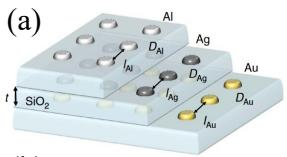

text_image

(a)
Al
Ag
DAl
IAl
DAg
Au
IAg
DAu
IAu
SiO2

(b)

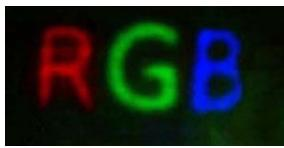

text_image

RGB

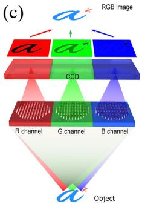

text_image

(c)
RGB image
a
a
CCD
R channel
G channel
B channel
Object

(d)  
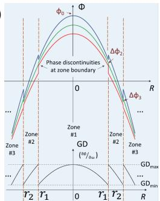

contour

| Category | \(\Phi (\)Value) | R (Value) |
| --- | --- | --- |
| Zone #1 | \(\phi0\) | 0 |
| Zone #2 | \(\Delta\phi2\) | 0 |
| Zone #3 | \(\Delta\phi3\) | 0 |

(e)  

natural_image

Two teddy bears, one wearing a purple 'HABARO' vest, both sitting on a white cow (no text or symbols visible)

natural_image

Red beaver holding a book labeled 'HARVARD.' with 'SLIK' logo, against a blurred background with 'RGB' and 'B' text (no readable text on beaver or background)

(f)  
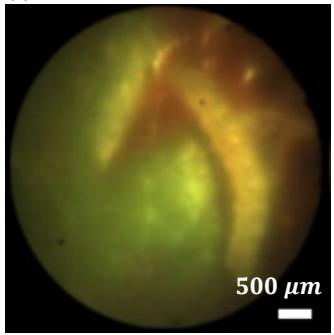

natural_image

Microscopic view of a biological sample with a 500 μm scale bar, showing internal structures (no text or symbols beyond scale indicator)

Design methods for multi-wavelength achromatic metalenses. (a) Schematic of the structure of the multilayer multi-wavelength achromatic metalens. (b) Imaging result of the multilayer multi-wavelength achromatic metalens. (c) Schematic of the structure of a parallel imaging system composed of multiple metasurfaces. (d) Schematic of the design method for multi-wavelength achromatic metalenses based on group delay wrapping. (e) Experimental augmented reality imaging results based on an RGB-achromatic metalens, which show the RGB-color virtual image floating in a real-world scene. (f) Imaging result of a fiber endoscope based on a metalens capturing a real scene of a caterpillar crawling on a strawberry leaf. The scene was illuminated using a broad halogen light source, with the endoscope positioned approximately 10 mm away from the scene. (a) and (b) Adapted from $[186]$ under a Creative Commons license. (c) Reprinted with permission from Baranikov et al., Laser Photonics Rev. 18, 2300553 (2024) $[530]$ . Copyright © 2023 WILEY-VCH Verlag GmbH & Co. KGaA, Weinheim. (d) and (e) Adapted from $[464]$ under a Creative Commons license. (f) Adapted from $[463]$ under a Creative Commons license.

(IV) Inverse design-enabled multi-wavelength achromatic metalenses for monochromatic imaging. Utilizing inverse design algorithms for designing multi-wavelength achromatic metalenses holds the promise of breaking through the performance limitations imposed by traditional forward design methods $[3]$ . In 2020, Chung and Miller $[403]$ validated the superiority of topological optimization in achieving high-efficiency or high-NA achromatic metalenses through simulations. In 2023, Jiang et al. $[428]$ employed the shape optimization algorithm based on the surrogate model to design a polarization-insensitive metalens eliminating chromatic aberration at four wavelengths of 465 nm, 548 nm, 600 nm, and 620 nm, with an NA of 0.3 and a radius of 57.6 $\mu$ m. This algorithm has been discussed in Subsection 3.3. The GaN meta-atoms were rectangular pillars with a height of 600 nm and a lattice constant of 400 nm. Experimentally, the maximum deviation between the actual and designed focal lengths across the operating wavelengths was 5.2778%, and the absolute focusing efficiencies at the four wavelengths were 42.8%, 42.4%, 38%, and 33.3%, respectively.

(V) Inverse design-enabled multi-wavelength achromatic metalenses for broadband imaging. Utilizing inverse design methods to realize achromatic metalenses for multiple wavelengths with sufficiently small spectral separation enables direct full-color achromatic imaging under broadband illumination $[463,523,524,533]$ .

In 2018, Mohammad et al. [523] experimentally demonstrated an achromatic diffractive lens with an NA of 0.05 and a focal length of 1 mm, achieving a measured focusing efficiency exceeding 40% across the entire visible spectrum. The lens consisted of concentric rings with varying heights and fixed widths, optimized using a modified binary-search algorithm to maximize the average focusing efficiency across all target wavelengths within the bandwidth.

In 2023, Fröch et al. [463] utilized the inverse design method to achieve an achromatic metalens in the visible with a radius of 0.5 mm, an FOV of 22.5°, and an effective NA of 0.24, which could replace traditional gradient-index lenses in fiber endoscopes to effectively reduce the length of the rigid tip. In the design process, a surrogate model mapping from the structure of the meta-atom to its phase shift was first constructed utilizing the neural network. For incident light at a specific wavelength and incident angle, the surrogate model determines the phase distribution introduced by the current metalens design, and the PSF is calculated using the angular spectrum method (which will be introduced in Appendix A), further yielding the corresponding Strehl ratio. The optimization objective is to maximize the Strehl ratios for all incident angles within the FOV and all wavelengths within the bandwidth. In practice, continuous incident angles and wavelengths are sampled at certain intervals, with an incident angle sampling interval of 5° and a wavelength sampling interval of 10 nm. Due to the differentiability of the surrogate model and the implementation of subsequent computations using an automatic differentiation framework, the entire forward problem from the metalens structure to the objective function is differentiable, allowing for the derivation of gradient information for optimizing the metalens. The imaging result of a fiber endoscope system based on this metalens for a real scene is shown in Fig. 36(f).

In 2024, a similar approach was employed to realize a polarization-insensitive metalens with a radius of 0.5 cm, an NA of 0.45, and an achromatic bandwidth ranging from 8 $\mu$ m to 12 $\mu$ m [524].

(VI) Clearly, the previously mentioned method of employing the neural network as the computational backend for a metalens to achieve broadband achromatic imaging can also be applied to the design of multi-wavelength achromatic metalenses. Utilizing this approach, in 2024, Cheng et al. [534] achieved chromatic aberration correction at three wavelengths of 488 nm, 532 nm, and 660 nm, just using a geometric phase metalens designed for the operating wavelength of 532 nm. The image post-processing by the neural network could result in an improvement of up to 12 dB in the peak SNR of the imaging.

# 5. METASURFACE HOLOGRAMS

Computational holography creates holograms through numerical calculations without the need for actual optical devices and physical recording materials. Such holograms are known as computer-generated holograms (CGHs) [535]. Traditionally, CGHs are realized using spatial light modulators (SLMs), which are arrays of units capable of independently modulating the amplitude, phase, or polarization of light waves. In contrast, metasurface holography utilizes metasurfaces to achieve CGHs, with these holograms referred to as metasurface holograms or meta-holograms. Traditional holography manipulates wavefronts through phase accumulation, and the current SLM units

are of micrometer-scale dimensions, leading to limitations such as large device size, low holographic image resolution, low SNR, small FOV, and difficulties in eliminating higher-order diffractions and twin images $[536]$ . Metasurface holograms, with their advantages of being lightweight and ultrathin, subwavelength unit sizes, supporting flexible design, etc., can effectively address these issues.

The design of metasurface holograms proceeds in two steps. First, theoretical modeling and calculations are performed to generate the target hologram based on the desired holographic display objective. Then, adopt a metasurface to realize the target hologram, i.e., achieve the required modulation of amplitude, phase, or polarization of the incident light. Depending on the modulation type of holograms, metasurface holograms can be categorized into phase-only holograms, amplitude-only holograms, and complex amplitude holograms. Due to the advantages of metasurfaces in phase modulation, phase-only holograms are the most commonly used. Based on the multiplexing characteristics, metasurface holograms can be divided into various categories, including non-multiplexed holograms, polarization-multiplexed holograms, wavelength-multiplexed holograms, orbital angular momentum (OAM)-multiplexed, and so on.

The design workflow for metasurface holograms, including the CGH algorithms as well as metasurface design and analysis methods, is available in our open-source code repository $[73]$ .

# 5.1. Theory, Design, and Performance Analysis of Metasurface Holograms

When the plane wave interacts with a hologram, it forms a diffraction field of finite size, whose complex amplitude distribution is consistent with that of the hologram (the difference in the phase distributions is a constant term that can be ignored). The propagation of the field from the diffraction plane to the observation plane is based on the scalar diffraction theory of monochromatic light propagating in the isotropic, linear, and uniform background medium. The diffraction model for the hologram, detailed in Appendix A, serves as the foundation for the discussion on metasurface holograms. We strongly encourage readers to review this appendix, as the symbols and equations introduced therein will be frequently referenced in the subsequent discussion.

# 5.1.1. Computer-Generated Hologram Algorithms in Metasurface Holography

Corresponding to the design steps of metasurface holograms, this Subsection presents fundamental and widely used techniques for generating holograms in metasurface holography, and Subsection 5.1.2 will delve into the application of various metasurface designs to realize different types of holograms.

Computational holography involves solving for the hologram based on the target of the holographic display, which can be categorized into two types: 2D holographic images and 3D holographic scenes. Each category requires different CGH algorithms. It's necessary to emphasize that, whether designing metasurface holograms for 2D images or 3D scenes, the differences lie mainly in the hologram generation, while the methods for designing metasurfaces generally remain the same.

For 3D holographic scenes, the basic method for generating holograms is as follows. Firstly, break down 3D objects into multiple primitives using the point-based method, the polygon-based method, the layer-based method, etc. Then, based on scalar diffraction theory, the diffractive superposition of all primitives on the hologram plane is calculated to obtain the complex amplitude distribution of the hologram. To ensure subsequent metasurface designs only need to consider phase modulation, methods like adding random phases to the primitives to simulate diffuse scatterers $[537]$ can be em-

ployed to uniformize the amplitude distribution of the hologram. Based on this method, as early as 2013, Huang et al. [537] realized a 3D holographic display utilizing geometric phase metasurfaces. In recent years, CGH algorithms based on deep learning have surpassed traditional methods in terms of performance for 3D scene reconstruction [538]. For a detailed introduction to these algorithms, refer to reference [539].

Current research in metasurface holography focuses mainly on 2D holographic display, which will be discussed in detail below.

The Gerchberg–Saxton algorithm (GS algorithm) and its variants for metasurface holograms. The GS algorithm, proposed by Gerchberg and Saxton in 1972 $[540]$ , might be the first successful algorithm developed for phase retrieval. In 1978, Fienup $[541]$ reinterpreted the GS algorithm and introduced the Fienup algorithm, which can be considered a more general form of the GS algorithm. The GS algorithm for CGHs is currently the most commonly used CGH algorithm in metasurface holography. It is suitable for phase-only holograms, but can also be extended for amplitude-only or complex amplitude holograms. The core idea of the algorithm is to allow the freedom of the phase distribution on the output plane (the observation plane) and solve for the phase distribution on the input plane (the hologram) iteratively, while maintaining fixed amplitude distributions on both the input and output planes. It’s essential to note that this algorithm has diverged from its original form. For instance, the GS and Fienup algorithms were initially developed for real, non-negative signals in fields such as astronomy, not the complex amplitude signals we discuss here $[542]$ . For a systematic discussion on phase retrieval algorithms, see references $[542,543]$ .

The details of the GS algorithm and its variants can be found in Appendix B.

When the output plane lies in the Fraunhofer diffraction zone, the holograms are referred to as Fraunhofer holograms. Conversely, when the output plane is within the Fresnel diffraction zone but outside the Fraunhofer zone, they are classified as Fresnel holograms. It is essential to highlight the differences in characteristics between Fraunhofer and Fresnel holograms, as these distinctions significantly impact their optical properties and applications. For Fraunhofer holograms, it can be seen from Eq. (A18) that the diffraction pattern of the same hologram at different positions only varies in scale, as illustrated in the left panel of Fig. 37. However, for Fresnel holograms, due to the impact of the $e^{i\frac{\pi}{\lambda d}(x^{2}+y^{2})}$ term within the Fourier transform in Eq. (A17), the diffraction pattern of the same hologram is related to the position of the observation plane, as illustrated in the right panel of Fig. 37. From one perspective, this makes position-multiplexed holographic display possible for the latter but not for the former; from another perspective, the holographic image of the former can be observed at any sufficiently far position meeting the Fraunhofer diffraction approximation condition in Eq. (A5), whereas the holographic image of the latter can only be observed at a fixed position.

Now, we consider the phase dispersion-free metasurface hologram based on the geometric phase modulation mechanism. Similarly, it can be observed from Eq. (A18) that for Fraunhofer holograms, the diffraction pattern of the same hologram at different wavelengths only varies in scale $[544]$ ; whereas for Fresnel holograms, due to the impact of the $e^{i\frac{\pi}{\lambda d}(x^{2}+y^{2})}$ term within the Fourier transform in Eq. (A17), the diffraction pattern of the same hologram is wavelength-dependent. From one perspective, this makes wavelength-multiplexed geometric phase-based metasurface holograms possible for the latter but not for the former; from another perspective, the former exhibits broadband characteristics not present in the latter.

Figure 37  
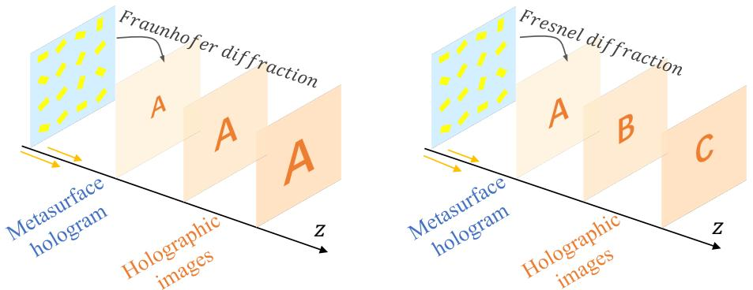

Schematic of holographic display of the holograms operating under Fraunhofer diffraction (left panel) and Fresnel diffraction (right panel), respectively.

Speckle suppression or high-quality holographic image generation. Speckle noise in traditional digital holography primarily originates from two sources. The first source is technical noise, which includes photon noise, electronic noise from the recording sensor, and quantization noise introduced by analog-to-digital conversion. The second source is coherent noise, which results from the differences between the actual modulation (primarily phase modulation) introduced by the hologram and the target modulation, due to factors such as the surface roughness of the sample during recording $[545]$ . For metasurface holography, speckle noise mainly arises from the latter source. The cause of modulation error of metasurface holograms is attributed to the coupling between adjacent meta-atoms not considered in the design and fabrication defects of the nanoscale features of the metasurface $[546]$ . Besides speckle noise, it's crucial to emphasize that insufficient sampling of the hologram for the target holographic image results in the actual holographic image being composed of individual speckles. In fact, the speckle issue in holographic images generated by numerous demonstrated metasurface holograms is mainly due to inadequate sampling. This type of speckle is referred to as the sampling speckle to distinguish it from the noise speckle due to the modulation error. We note that by clearly differentiating the origins of the noise speckle and sampling speckle, it is helpful to suppress the speckle problem for acquiring high-quality holographic images.

Focus on the sampling speckle first. As illustrated in Fig. 38, for the same pattern (the capital letter H), when sampled at a lower sampling rate (first row), the holographic image exhibits severe speckle issues. Increasing the sampling rate (rows 2 to 4) can significantly suppress the speckle and enhance the quality of the holographic image. However, it's important to note that increasing the sampling rate does not truly eliminate speckles but only reduces their feature size, as shown in the last column of Fig. 38. The feature size $s_{\mathrm{speckle}}$ of speckles can be estimated by the diameter of the Airy disk [547], i.e.,

$$
s _ {\text {speckle}} = 1. 2 2 \frac {\lambda}{L} d, \tag {245}
$$

where L is the aperture size of the hologram, and d is the distance from the hologram to the observation plane. For a hologram composed of $N \times N$ units, with each unit size being a, L = Na can be used as an estimate. From Eq. (245), the feature size of speckles is determined by the physical size of the hologram when the operating wavelength and the position of the observation plane are fixed. When the feature size of speckles is smaller than the size of detector pixels on the observation plane (as in the situation illustrated in the fourth row of Fig. 38), speckles will no longer be observed. Instead, differences in the intensity distributions of the actual holographic image and the target holographic image will be seen, appearing similar to noise.

Figure 38  
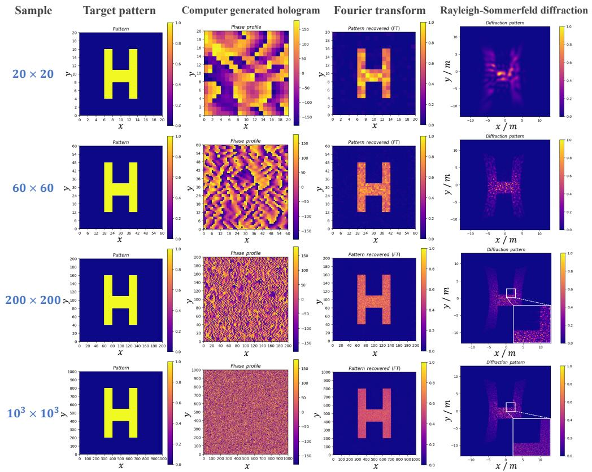

heatmap

| Sample Size | Pattern Type | Description |
| --- | --- | --- |
| 20 x 20 | Pattern | Yellow H-shaped pattern |
| 20 x 20 | Phase profile | Heatmap showing high intensity in the central region |
| 20 x 20 | Fourier transform | Heatmap showing high intensity in the central region |
| 20 x 20 | Rayleigh-Sommerfeld diffraction | Heatmap showing high intensity in the central region |
| 60 x 60 | Pattern | Yellow H-shaped pattern |
| 60 x 60 | Phase profile | Heatmap showing high intensity in the central region |
| 60 x 60 | Fourier transform | Heatmap showing high intensity in the central region |
| 60 x 60 | Rayleigh-Sommerfeld diffraction | Heatmap showing high intensity in the central region |
| 200 x 200 | Pattern | Yellow H-shaped pattern |
| 200 x 200 | Phase profile | Heatmap showing high intensity in the central region |
| 200 x 200 | Fourier transform | Heatmap showing high intensity in the central region |
| 200 x 200 | Rayleigh-Sommerfeld diffraction | Heatmap showing high intensity in the central region |
| 10^3 x 10^3 | Pattern | Yellow H-shaped pattern |
| 10^3 x 10^3 | Phase profile | Heatmap showing high intensity in the central region |
| 10^3 x 10^3 | Fourier transform | Heatmap showing high intensity in the central region |
| 10^3 x 10^3 | Rayleigh-Sommerfeld diffraction | Heatmap showing high intensity in the central region |

Impact of the sampling speckle on the quality of the holographic image. For the target patterns in the second column with different sampling conditions (the first column), the GS algorithm is applied to solve the phase distributions of the holograms, as shown in the third column. The Fourier transform results of the complex amplitude distributions of the holograms are shown in the fourth column. When the unit size of the hologram is 300 nm, the operating wavelength is 633 nm, and the observation plane is located at 10 m from the hologram, the Rayleigh–Sommerfeld diffraction results of the complex amplitude distributions of the holograms on the observation plane are shown in the fifth column.

Next, we consider the noise speckle. As shown in Fig. 39, applying different degrees of random noise $\alpha_{\mathrm{n}}U\left(-\frac{1}{2}\pi,\frac{1}{2}\pi\right)$ [where $\alpha_{n}$ is the noise intensity factor, and $U\left(-\frac{1}{2}\pi,\frac{1}{2}\pi\right)$ represents the random number obtained from a uniform distribution between $-\frac{1}{2}\pi$ and $\frac{1}{2}\pi$ ] to the phase distribution of a hologram solved by the GS algorithm, it can be seen that when the phase deviation reaches a certain degree, severe noise speckles appear in the holographic image generated by the hologram.

The field of traditional digital holography has extensively researched speckle suppression methods. Techniques such as using a diffuser to reduce the coherence of a laser light source $[548]$ , employing partially coherent light sources $[549]$ , spatial filtering $[550]$ , and improving CGH algorithms $[547]$ can be directly adopted or adapted for use in metasurface holography. For a systematic review of these methods, see reference $[545]$ .

The field of metasurface holography has also noticed the speckle issue and made some preliminary efforts. In 2015, Zheng et al. [114] used $2 \times 2$ periodic metasurface holograms in place of a single metasurface hologram, where each hologram generates the

Figure 39  
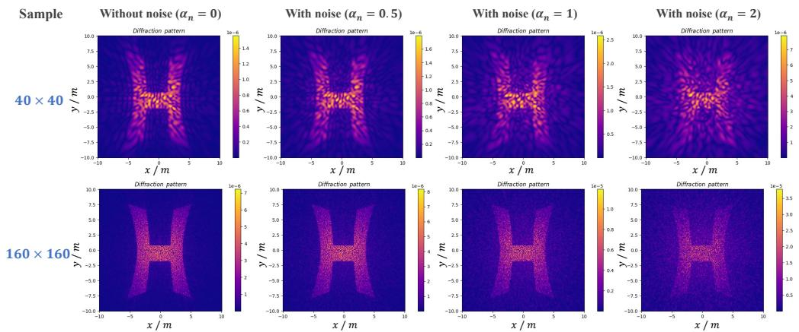

heatmap

| Sample | Noise Condition | X-axis Range (m) | Y-axis Range (m) | Intensity Range (x10^-6) |
| --- | --- | --- | --- | --- |
| \(40 \times 40\) | Without noise \((\alpha n\) = 0) | -10~10 | -10~10 | 0.0~1.4 |
| \(40 \times 40\) | With noise \((\alpha n\) = 0.5) | -10~10 | -10~10 | 0.0~1.6 |
| \(40 \times 40\) | With noise \((\alpha n\) = 1) | -10~10 | -10~10 | 0.0~2.5 |
| \(40 \times 40\) | With noise \((\alpha n\) = 2) | -10~10 | -10~10 | 0.0~7.5 |
| \(160 \times 160\) | Without noise \((\alpha n\) = 0) | -10~10 | -10~10 | 0.0~7.5 |
| \(160 \times 160\) | With noise \((\alpha n\) = 0.5) | -10~10 | -10~10 | 0.0~8.0 |
| \(160 \times 160\) | With noise \((\alpha n\) = 1) | -10~10 | -10~10 | 0.0~1.0 |
| \(160 \times 160\) | With noise \((\alpha n\) = 2) | -10~10 | -10~10 | 0.0~3.5 |

Impact of noise speckle on the quality of the holographic image. Holographic images generated by the hologram are computed using the Rayleigh–Sommerfeld diffraction formula under different sampling conditions (the first and second rows), with noise coefficient $\alpha_{n}$ taking values of 0, 0.5, 1, and 2 represented in the second through fifth columns, respectively.

Figure 40  
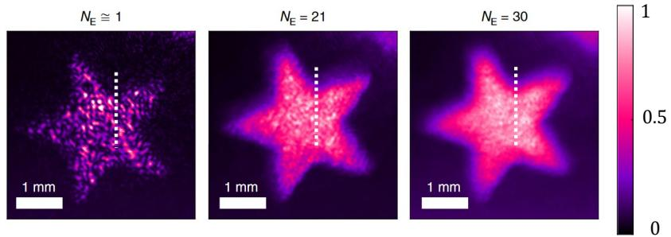

text_image

NE ≈ 1
NE = 21
NE = 30
1 mm
1 mm
1 mm

Holographic images of a metasurface hologram under the spatial coherent laser illumination with different numbers of effective spatial modes $N_{E}$ . Adapted from [546] under a Creative Commons license.

same holographic image but exhibits different speckle distributions, thereby effectively suppressing speckles through the superposition multiple holographic images. Both the sampling speckle and noise speckle are the result of the coherence of light waves on the observation plane, and reducing the coherence of the light source helps eliminate speckles. In 2021, Eliezer et al. [546] used a degenerate cavity laser to adjust the number of spatial modes of the laser light source, thereby modulating the spatial coherence of the light waves. As shown in Fig. 40, the more effective spatial modes a laser has, the poorer its coherence, leading to a more pronounced smoothing effect on the speckles of the holographic image. However, it's important to note that this comes at the cost of lower resolution of the holographic image.

Compensation algorithms for wide-FOV and color holographic display. The holographic image generated by the hologram solved by the GS algorithm based on the Fraunhofer or Fresnel diffraction formula will show significant distortion under a wide FOV, as shown in Fig. 38. Besides, from Fig. 38, it's also observed that when comparing the intensity distribution between the holographic image and the target image, the holographic image displays a problem that the brightness gradually decreases as the diffraction angle increases. To solve these problems, to address these issues, compensation algorithms for wide-FOV holograms are provided in Appendix C.

To achieve a color holographic display, holograms generally need to generate independent holographic images for the red, green, and blue wavelengths. According to Eqs. (A4) and (A6), for both Fresnel and Fraunhofer holograms, the diffraction pattern on the observation plane remains unchanged when $\lambda d$ is constant. Consequently, for incident light of different wavelengths, the diffraction pattern undergoes varying degrees of scaling on a fixed observation plane. From another perspective, this can also be considered the result of varying FOV angles of the same hologram for different wavelengths, as determined by Eq. (275). To mitigate this issue, compensation algorithms for color holograms are also provided in Appendix D.

Multi-objective CGH algorithms. Position multiplexing of Fresnel holograms is achieved through the multi-objective CGH algorithm. Extending the GS algorithm's notation to this context, here, the holographic display target comprises multiple output planes located at $z^i$ , each generating a holographic image $I^i(x,y)$ , corresponding to target amplitude distributions $A_2^i(x,y) = \sqrt{I^i(x,y)}$ , where the superscript $i$ , ranging from 1 to $M$ , denotes the channel index for position multiplexing. There are several algorithms available to realize this target [159,551,552], and one algorithm [159] is as follows. Specifying the positions of the output planes, perform multiple diffraction calculations to obtain the complex amplitude distributions $A_1^i(x,y) e^{i\phi_1^i(x,y)}$ for each output plane. By replacing $A_1^i(x,y)$ with $A_2^i(x,y)$ and then calculating the complex amplitude distributions $A_3^i(x,y) e^{i\phi_3^i(x,y)}$ on the input plane, the complex amplitude distribution of the hologram is taken as

$$
A _ {0} (x, y) e ^ {i \phi_ {3} (x, y)} = \sum_ {i = 1} ^ {M} w ^ {i} A _ {0} (x, y) e ^ {i \phi_ {3} ^ {i} (x, y)}, \tag {246}
$$

where $w^{i}$ is the weight of the $i^{th}$ multiplexing channel, which can be estimated by the root mean square error $RMSE^{i}$ between the amplitude distribution of the output plane in the previous iteration and the corresponding target amplitude distribution, for example,

$$
w ^ {i} = \frac {\mathrm{RMSE} ^ {i}}{\sum_ {i = 1} ^ {M} \mathrm{RMSE} ^ {i}}. \tag {247}
$$

The remaining steps are the same as those described for the GS algorithm.

Based on the multi-objective CGH algorithm, in 2017, Wei et al. [154] achieved a position-multiplexed Fresnel metasurface hologram with a multiplexing channel count of up to 6.

Since position multiplexing can be achieved solely through multi-objective CGH algorithms, it's easy to be integrated with other multiplexing methods implemented through metasurface design, such as OAM multiplexing and polarization multiplexing, thus obtaining a higher number of multiplexing channels [173,392]. Additionally, position multiplexing can enable Fresnel holograms with multiplexed orthogonal circular polarization states, which will be introduced in Subsection 5.1.2.

Apart from position multiplexing, multi-objective CGH algorithms can also be leveraged to achieve wavelength multiplexing for Fresnel holograms based on geometric phase metasurfaces $[552]$ . The algorithm is similar to the one previously described. It's evident that for geometric phase-based Fresnel metasurface holograms, implementing both position multiplexing and wavelength multiplexing is not contradictory. Applications of this will be introduced in Subsection 5.2.2. In addition, multi-

objective CGH algorithms have also been applied to realize nonlinear geometric phase metasurface holograms with simultaneous polarization and wavelength multiplexing [160].

Other CGH algorithms. Beyond the iterative algorithms such as the GS algorithm and its variants, the field of holography has been developing novel CGH algorithms in recent years, including the speckle-free CGH algorithm for partially coherent light sources based on camera-in-the-loop calibration technology $[549]$ , the real-time CGH algorithm for 3D scenes based on deep learning $[538]$ , the high-fidelity and high-resolution CGH algorithm also based on deep learning $[553]$ , and the CGH algorithm based on optimization methods $[552]$ . Among these, the algorithm utilizing automatic differentiation technology for gradient optimization has already been applied in the domain of metasurface holography $[552]$ . As the field of metasurface holography demands higher-quality holograms and better real-time performance, these computational methods are likely to see increased applications.

The implementations of the GS algorithm and the compensation algorithms for wide-FOV holographic displays are provided in our open-source code repository [73].

# 5.1.2. Metasurface Design

Holograms can be classified by their modulation type into phase-only holograms, amplitude-only holograms, and complex amplitude holograms. Here, we briefly outline the implementation methods of these three types of holograms using metasurfaces.

Phase-only metasurface holograms. It is straightforward to implement phase-only metasurface holograms based on resonant phase, propagation phase, or geometric phase modulation mechanisms. Here we focus on the characteristics of metasurface holograms using these phase modulation mechanisms.

(I) Based on resonant phase or propagation phase, by selecting appropriate structural parameters, it's possible to achieve metasurface holograms that multiplex orthogonal linear polarization states [170] and even wavelength-multiplexed metasurface holograms [527].  
(II) Geometric/Detour phase metasurfaces have the characteristic of being phase dispersion-free, meaning the phase shift distribution introduced to incident light at different wavelengths varies only by a constant term. As mentioned in Subsection 5.1.1, Fraunhofer holograms implemented based on this principle exhibit a certain working bandwidth. Ideally, without considering the influence of the coupling effect of adjacent meta-atoms, the holographic images generated within this working bandwidth will differ in only two aspects for light at different wavelengths. The first is the degree of scaling, as explained in Subsection 5.1.1. The second is the variation in energy utilization efficiency, which arises from differences in transmittance and PCE for geometric phase metasurfaces and diffraction efficiency for detour phase metasurfaces at different wavelengths.  
(III) For a Fraunhofer hologram based on the geometric phase metasurface, assuming it is designed to operate in the scenario of converting incident LCP light to output RCP light and located at $z = z_{0} = 0$ (for ease of discussion, let's denote x and y on this plane as $x'$ and $y'$ ), the introduced phase distribution is $\phi(x', y', 0)$ , with a constant amplitude distribution $A_{0}$ . From Eq. (A18), the holographic image $I(x, y, d)$ generated on the observation plane at z = d satisfies (at this point, the factors before the Fourier transform can be ignored)

$$
I (x, y, d) = \left| \mathcal {F} \left\{A _ {0} e ^ {i \phi (x ^ {\prime}, y ^ {\prime}, 0)} \right\} \left(u = \frac {x}{\lambda d}, v = \frac {y}{\lambda d}, d\right) \right| ^ {2}. \tag {248}
$$

For the same metasurface hologram, when operating in the scenario of converting incident RCP light to output LCP light, the introduced phase distribution $\phi^{\prime}(x^{\prime},y^{\prime},0)=-\phi(x^{\prime},y^{\prime},0)$ [see Eq. (23)], and the holographic image $I^{\prime}(x,y,d)$ generated on the observation plane satisfies [554]

$$
I ^ {\prime} (x, y, d) = \left| \mathcal {F} \left\{A _ {0} e ^ {- i \phi (x ^ {\prime}, y ^ {\prime}, 0)} \right\} \left(u = \frac {x}{\lambda d}, v = \frac {y}{\lambda d}, d\right) \right| ^ {2}. \tag {249}
$$

Expanding Eqs. (248) and (249) using Eq. (A11) reveals the relationship between the two holographic images:

$$
I ^ {\prime} (x, y, d) = I (- x, - y, d), \tag {250}
$$

which is a diagonal mirror image transformation. Based on this, Fraunhofer holograms based on geometric phase metasurfaces can achieve the holographic display as shown in Fig. 41(a) under the incidence of different circularly polarized light $[554]$ . By further restricting the observation area to either the left half or the right half of the observation plane, a display effect of orthogonal circular polarization state multiplexing can be realized.

(IV) For a Fresnel hologram based on the geometric phase metasurface, assuming it is designed to operate in the scenario of converting incident LCP light to output RCP light, with all conditions and symbols consistent with those in the Fraunhofer hologram case, the holographic image generated on the observation plane satisfies [from Eq. (A17)]

$$
I (x, y, d) = \left| \mathcal {F} \left\{A _ {0} e ^ {i \phi \left(x ^ {\prime}, y ^ {\prime}, 0\right)} e ^ {i \frac {\pi}{\lambda d} \left(x ^ {\prime 2} + y ^ {\prime 2}\right)} \right\} \left(u = \frac {x}{\lambda d}, v = \frac {y}{\lambda d}, d\right) \right| ^ {2}. \tag {251}
$$

For the same metasurface hologram, when operating in the scenario of converting incident RCP light to output LCP light, the holographic image generated on the observation plane satisfies

$$
I ^ {\prime} (x, y, d) = \left| \mathcal {F} \left\{A _ {0} e ^ {- i \phi \left(x ^ {\prime}, y ^ {\prime}, 0\right)} e ^ {i \frac {\pi}{\lambda d} \left(x ^ {\prime 2} + y ^ {\prime 2}\right)} \right\} \left(u = \frac {x}{\lambda d}, v = \frac {y}{\lambda d}, d\right) \right| ^ {2}. \tag {252}
$$

Expanding Eqs. (251) and (252) using Eq. (A11) reveals the relationship between the two holographic images:

$$
I ^ {\prime} (x, y, d) = I (- x, - y, - d), \tag {253}
$$

which implies that the holographic image generated at $z = d$ when operating in the scenario of converting incident RCP light to output LCP light is the diagonal mirror image of the holographic image generated at $z = -d$ when operating in the scenario of converting incident LCP light to output RCP light. Combining this rule with the position multiplexing of Fresnel holograms, when setting $z^1 = d, z^2 = -d$ in the multi-objective CGH algorithm for position multiplexing, and implementing the hologram with the geometric phase metasurface, one can achieve the holographic display effect of multiplexed orthogonal circular polarization states on the observation plane at $z = d$ [154,558]. Based on this, in 2017, Huang's group [154] achieved a metasurface hologram that combines position multiplexing with polarization multiplexing, reaching a multiplexing channel number of 8, with experimental results shown in Fig. 41(b).

Amplitude-only metasurface holograms. In the GS algorithm introduced in Subsection 5.1.1, the hologram's amplitude distribution is constant, with its phase distribution serving as the degree of freedom to generate the target holographic image. It's also conceivable to set the hologram's phase distribution as constant and utilize its amplitude modulation as the degree of freedom for hologram design [559].

Figure 41  
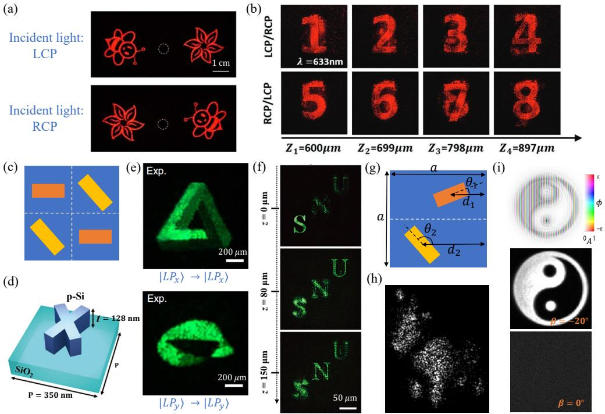

Metasurface design of the hologram. (a) Experimental holographic images generated by the geometric phase-based Fraunhofer metasurface hologram under the incidence of different circularly polarized light at a wavelength of 633 nm. (b) Experimental holographic images generated by the geometric phase-based Fresnel metasurface hologram at different observation positions and under different circular polarization states of the incident and output light. (c) Schematic of metasurface unit used for amplitude manipulation or complex amplitude manipulation, in which orange and yellow represent two kinds of meta-atoms with different sizes and rotation angles. (d) Schematic of metasurface unit used for complex amplitude hologram design. (e) Experimental holographic images generated by the complex amplitude Fresnel metasurface hologram with orthogonal linear polarization multiplexing. $|LP_{x}\rangle$ and $|LP_{y}\rangle$ mean the linear polarization state along the x and y directions, respectively. Top: polarization states of the incident and output light are $|LP_{x}\rangle$ and $|LP_{y}\rangle$ , respectively. Bottom: polarization states of the incident and output light are $|LP_{y}\rangle|LP_{y}$ and $|LP_{x}\rangle$ , respectively. (f) Experimental holographic images generated by a complex amplitude Fresnel metasurface hologram at the operating wavelength of 532 nm. (g) Schematic of metasurface unit for complex amplitude modulation based on geometric phase and detour phase. (h) Experimental reconstruction result of the complex amplitude metasurface hologram for a 3D object. (i) Top: complex amplitude profile of destination holographic scene. Middle and bottom: experimental holographic images under the observation angle $\beta$ of $-20^{\circ}$ and $0^{\circ}$ . (a) Adapted from [554] under a Creative Commons license. (b) Adapted with permission from Wei et al., Adv. Opt. Mater. 5, 1700434 (2017) [154]. Copyright © 2017 WILEY-VCH Verlag GmbH & Co. KGaA, Weinheim. (d) and (f) Adapted with permission from Lee et al., Nanoscale 10, 4237–4245 (2018) [555]. Copyright © 2018 The Royal Society of Chemistry. (e) Adapted from [556] under a Creative Commons license. (h) and (i) Adapted from [557] under a Creative Commons license.

(I) Generally, metasurfaces are better at phase modulation, making the former approach more commonly used. However, for several types of metasurfaces suitable for amplitude modulation, such as those based on photon sieves $[560]$ , the latter approach

also finds its application [561]. Due to the isotropic nature of photon sieve structures, metasurface holograms based on this principle exhibit polarization-insensitive characteristics, but the quantized range of amplitude modulation is often quite limited [559].

(II) Utilizing the advantage of metasurfaces in phase modulation can indeed enable arbitrary manipulation of the light field's amplitude. As shown in Fig. 41(c), we consider a $2 \times 2$ meta-atom array as the metasurface unit for amplitude modulation, containing two types of meta-atoms with different sizes and rotation angles. Let the modulation introduced by these two types of meta-atoms for any orthogonal polarization states be denoted as $t_1^\pm e^{i\phi_1^\pm}$ and $t_2^\pm e^{i\phi_2^\pm}$ , where $t$ represents the amplitude transmission coefficient, $\phi$ represents the introduced phase shift, superscript $\pm$ indicates the two orthogonal polarization states, and subscript 1 or 2 denotes the type of meta-atoms. Assuming the influence of the coupling between adjacent meta-atoms is neglected (the coupling may cause actual amplitude and phase modulation to deviate from the designed values because of the disruption of the LPA), due to the interference effect, the overall output field of the unit is the superposition of the output fields of each meta-atom; thus, the complex amplitude modulation introduced by the unit is given by

$$
t ^ {\pm} e ^ {i \phi^ {\pm}} = \frac {1}{2} \left(t _ {1} ^ {\pm} e ^ {i \phi_ {1} ^ {\pm}} + t _ {2} ^ {\pm} e ^ {i \phi_ {2} ^ {\pm}}\right). \tag {254}
$$

From Eq. (254), $t^{\pm}$ and $\phi^{\pm}$ satisfy

$$
\left(t ^ {\pm}\right) ^ {2} = \frac {1}{4} \left(\left(t _ {1} ^ {\pm}\right) ^ {2} + \left(t _ {2} ^ {\pm}\right) ^ {2} + 2 t _ {1} ^ {\pm} t _ {2} ^ {\pm} \cos \left(\phi_ {1} ^ {\pm} - \phi_ {2} ^ {\pm}\right)\right), \tag {255}
$$

and

$$
\phi^ {\pm} = \arctan \frac {t _ {1} ^ {\pm} \sin \phi_ {1} ^ {\pm} + t _ {2} ^ {\pm} \sin \phi_ {2} ^ {\pm}}{t _ {1} ^ {\pm} \cos \phi_ {1} ^ {\pm} + t _ {2} ^ {\pm} \cos \phi_ {2} ^ {\pm}}, \tag {256}
$$

respectively.

Based on the hybrid phase modulation mechanism introduced in Subsection 2.1.5, it's possible to independently modulate the phase for any orthogonal polarization states. Thus, $\phi_1^\pm -\phi_2^\pm$ in Eq. (255) can be freely adjusted by changing the shape, size, and rotation angle of the meta-atoms, thereby varying the amplitude modulation $t^{\pm}$ introduced to the light of orthogonal polarization states. In this way, the independent amplitude modulation for any orthogonal polarization states is achieved. Based on this, in 2020, Fan et al. [562] implemented orthogonal circular polarization state multiplexing metasurface nanoprinting. Nanoprinting is not the main focus of this text, and the related introduction can be found in reference [563].

Assuming the transmittance of the meta-atoms is maintained at a high level, we have $t_1^\pm \approx 1$ , and $t_2^\pm \approx 1$ . Then from Eq. (254), we have

$$
t ^ {\pm} e ^ {i \phi^ {\pm}} = \cos \frac {\phi_ {1} ^ {\pm} - \phi_ {2} ^ {\pm}}{2} e ^ {i \frac {\phi_ {1} ^ {\pm} + \phi_ {2} ^ {\pm}}{2}}. \tag {257}
$$

For amplitude-modulated metasurface holograms requiring a constant phase distribution, the phase term in Eq. (257) must be constant. For simplicity, it is set to 0, which means that

$$
\phi_ {2} ^ {\pm} = - \phi_ {1} ^ {\pm}. \tag {258}
$$

Figure 42  
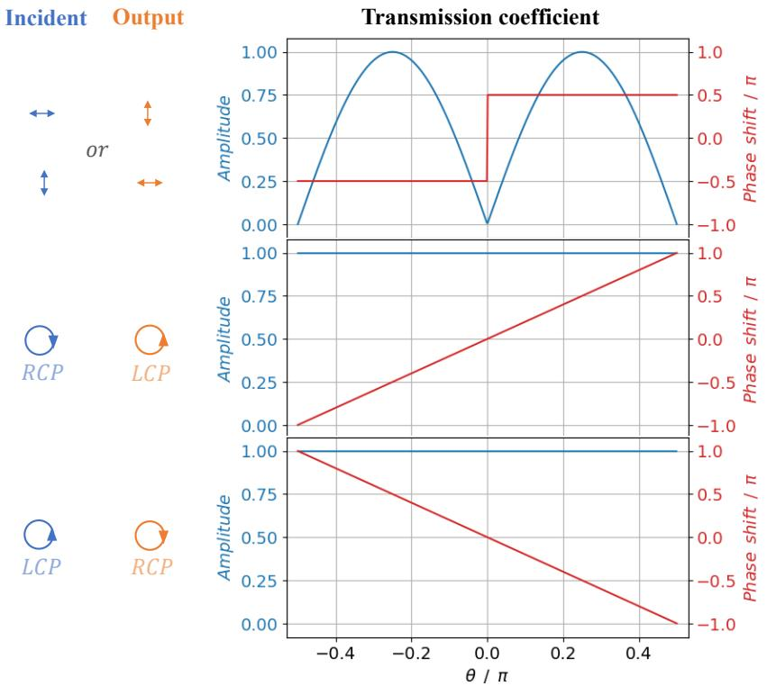

line

| \(\theta / \pi\) | Transmission coefficient (Amplitude) | Phase shift \((\pi)\) (Amplitude) | Phase shift \((\pi)\) (Amplitude) | Phase shift \((\pi)\) (Amplitude) |
| --- | --- | --- | --- | --- |
| -0.5 | 0.00 | -0.5 | -1.0 | 1.0 |
| -0.25 | 1.00 | -0.5 | -0.5 | 1.0 |
| 0.0 | 0.00 | 0.5 | 0.0 | 1.0 |
| 0.25 | 1.00 | 0.5 | 0.5 | 1.0 |
| 0.5 | 0.00 | 0.5 | 1.0 | 1.0 |

Transmission coefficients for various polarization channels of a meta-atom rotated by $\theta$ . Top: for $y(x)$ -polarized light under $x(y)$ -polarized incidence. Middle: for RCP light under LCP incidence. Bottom: for LCP light under RCP incidence. The meta-atom is described by Eq. (14), where $t_{x}=t_{y}=1$ and $\left|\phi_{x}-\phi_{y}\right|=\pi$ .

Substituting Eq. (258) into Eq. (257) yields the expression for the overall amplitude transmission coefficient of the unit

$$
t ^ {\pm} = \cos \phi_ {1} ^ {\pm}. \tag {259}
$$

Using Eqs. (258) and (259), along with the hybrid phase modulation mechanism, it's possible to implement metasurface holograms with independent amplitude modulation for any orthogonal polarization states. A disadvantage of this method is that the lattice constant of the metasurface doubles.

(III) From Eq. (22), geometric phase metasurfaces enable phase manipulation while maintaining constant amplitude modulation. Correspondingly, we propose here a mechanism that continuously controls the amplitude by simply rotating the meta-atom, without altering the phase shift.

For a meta-atom governed by Eq. (14), the complex amplitude of the output light polarized in the y direction under x-polarized incidence is given by

$$
O (\theta) = \left[ \begin{array}{l l} 0 & 1 \end{array} \right] \mathbf {T} \left[ \begin{array}{l} 1 \\ 0 \end{array} \right] = \frac {1}{2} \sin 2 \theta \left(t _ {x} e ^ {i \phi_ {x}} - t _ {y} e ^ {i \phi_ {y}}\right). \tag {260}
$$

This expression also applies to the complex amplitude of the output light in the x polarization under y-polarized incidence.

Using Eqs. (22) and (260), when $t_{x}=t_{y}=1$ and $\left|\phi_{x}-\phi_{y}\right|=\pi$ , the amplitude and phase modulations for different polarization channels of the meta-atom at a rotation angle $\theta$ are illustrated in Fig. 42.

As shown in the top panel of Fig. 42, when the rotation angle of the meta-atom shifts from 0 to $\frac{\pi}{4}$ , the amplitude of $O$ transitions from 0 to $\frac{1}{2}\left(t_x e^{i\phi_x} - t_y e^{i\phi_y}\right)$ , while the phase of $O$ remains constant. The maximum amplitude variation of $O$ reaches $\frac{1}{2}(t_x + t_y)$ when $\left|\phi_x - \phi_y\right| = \pi$ , aligning with Eq. (26).

From Eq. (260), we derive

$$
O \left(\theta\right) = O \left(\frac {\pi}{2} - \theta\right) = e ^ {i \pi} \left(O \left(- \theta\right)\right) = e ^ {i \pi} \left(O \left(\theta - \frac {\pi}{2}\right)\right), \tag {261}
$$

which indicates that the amplitude modulation remains consistent across the four rotation angles— $\theta$ , $\frac{\pi}{2}-\theta$ , $-\theta$ , and $\theta-\frac{\pi}{2}$ —even though the corresponding phase shifts between the first two and the last two differ by $\pi$ . As observed from Fig. 42, these four rotation angles correspond to distinct geometric phases. This property facilitates the independent modulation of amplitude and phase for various polarization channels, as demonstrated in recent studies [564,565].

Complex amplitude metasurface holograms. The extension from phase-only metasurface holograms to complex amplitude metasurface holograms introduces a series of new advantages. Firstly, under the same design conditions, a complex amplitude metasurface hologram provides an additional dimension of the light field's amplitude modulation, hence capable of generating higher quality holographic images $[11,555,557]$ , achieving a greater number of multiplexing channels $[555]$ , and even utilizing amplitude and phase modulation for distinct functionalities such as nanoprinting and holographic display $[557]$ . Secondly, phase-only metasurface holograms are generally reliant on iterative methods such as the GS algorithm, which can only reproduce the amplitude information of the target holographic display. Conversely, complex amplitude metasurface holograms overcome this limitation. Utilizing the inverse diffraction formula, either Eq. (B2) or Eq. (B1), the complex amplitude distribution of the hologram can be directly obtained from the target holographic display, thereby reconstructing both the amplitude and phase information $[557]$ . This aspect is particularly beneficial for the holographic display of 3D scenes. As described in Subsection 5.1.1, if based on phase-only holograms, achieving a uniform amplitude distribution of the hologram requires adding random phases to the primitives to simulate a diffuse body $[537]$ , at the cost of destroying the surface texture information of 3D objects. In contrast, complex amplitude holograms do not have this limitation. Below, we introduce the implementation methods of complex amplitude metasurface holograms and further present several experimental results to substantiate the aforementioned conclusions.

(I) From Eq. (257), for the metasurface unit structure as depicted in Fig. 41(c), based on the hybrid phase modulation mechanism, by modifying the shape, size, and rotation angles of two meta-atoms to adjust $\phi_{1}^{\pm}$ and $\phi_{2}^{\pm}$ , it becomes feasible to implement arbitrary complex amplitude modulation for any orthogonal polarization states. On this foundation, in 2021, Liu et al. [556] realized a complex amplitude Fresnel metasurface hologram multiplexing for orthogonal linearly polarized light, with the holographic display demonstrated in Fig. 41(e). The meta-atoms were rectangular $TiO_{2}$ pillars with a height of 600 nm. The unit size was $2 \times 450$ nm, and the operating wavelength was around 530 nm.

(II) Continue with the method previously discussed, but now consider relying solely on the geometric phase modulation mechanism. Taking orthogonal polarization states as LCP and RCP, respectively, according to Eq. (23), we have

$$
\phi_ {1} ^ {\sigma} = 2 \sigma \theta_ {1}, \phi_ {2} ^ {\sigma} = 2 \sigma \theta_ {2}, \tag {262}
$$

where $\sigma=\pm1$ corresponds to the scenarios of LCP light converting to RCP light and RCP light converting to LCP light, respectively, and $\theta_{1}$ and $\theta_{2}$ are the rotation angles

of the two types of meta-atoms, respectively. In this case, Eq. (257) simplifies to

$$
t ^ {\sigma} e ^ {i \phi^ {\sigma}} = \cos \left(\theta_ {1} - \theta_ {2}\right) e ^ {i \sigma \left(\theta_ {1} + \theta_ {2}\right)}. \tag {263}
$$

In Eq. (263), there are only two degrees of freedom on the right side of the equality $(\theta_{1}$ and $\theta_{2})$ , whereas there are four parameters to be adjusted on the left side ( $t^{\pm}$ and $\phi^{\pm}$ ), indicating that multiplexing for orthogonal circular polarization states cannot be achieved. The reason is that, when based solely on geometric phase, we have

$$
\phi_ {1} ^ {+} = - \phi_ {1} ^ {-}, \quad \phi_ {2} ^ {+} = - \phi_ {2} ^ {-}, \tag {264}
$$

meaning that the phase shifts introduced by the meta-atom for the orthogonal polarization states are coupled, rather than being independent as in the hybrid phase modulation mechanism, thus reverting to the situations described in Eq. (250) or Eq. (253) discussed earlier. If a certain value is set for $\sigma$ in Eq. (263), then arbitrary complex amplitude modulation can be realized under the corresponding polarization operational scenario by adjusting the rotation angles of the two meta-atoms. In this way, the hologram will inherit the broadband characteristic of geometric phase metasurfaces. Based on this, in 2018, Lee et al. [555] implemented a design of a complex amplitude Fresnel metasurface hologram. In this work, they overlapped the centers of two rectangular pillar meta-atoms with different rotation angles as the metasurface unit, as depicted in Fig. 41(d). The metasurface operated in the scenario of converting incident RCP light to output LCP light. Experimental demonstration of the position multiplexed holographic display is shown in Fig. 41(f). Compared to phase-only holograms designed and processed under the same conditions, the complex amplitude hologram exhibited superior SNR and speckle suppression effects.

(III) In 2020, Deng et al. [168] proposed to combine the detour phase and geometric phase to achieve independent and arbitrary control of the amplitude, phase, and polarization of light. As shown in Fig. 41(g), the metasurface unit consists of two meta-atoms with the same anisotropic structure, each possessing rotation angles of $\theta_{1}$ and $\theta_{2}$ , and displacements of $d_{1}$ and $d_{2}$ , respectively. According to Eq. (33), assuming the detour phase to be zero when $d_{1}=0$ and $d_{2}=0$ , the detour phases introduced by the two meta-atoms are $\sigma_{d}2\pi\frac{d_{1}}{a}$ and $\sigma_{d}2\pi\frac{d_{2}}{a}$ , respectively. By rationally designing the size of the meta-atoms so that the electromagnetic response intensity along their short axis is negligible compared to that along their long axis. Thus, from Eq. (14), the Jones matrices of the two meta-atoms can be expressed as

$$
\mathbf {T} _ {1} = \mathbf {R} \left(\theta_ {1}\right) \left[ \begin{array}{c c} e ^ {i \sigma_ {\mathrm{d}} 2 \pi \frac {d _ {1}}{a}} & 0 \\ 0 & 0 \end{array} \right] \mathbf {R} \left(- \theta_ {1}\right), \mathbf {T} _ {2} = \mathbf {R} \left(\theta_ {2}\right) \left[ \begin{array}{c c} e ^ {i \sigma_ {\mathrm{d}} 2 \pi \frac {d _ {2}}{a}} & 0 \\ 0 & 0 \end{array} \right] \mathbf {R} \left(- \theta_ {2}\right). \tag {265}
$$

When disregarding the coupling between adjacent meta-atoms, due to the interference effect, the unit's Jones matrix is given by

$$
\mathbf {T} = \mathbf {T} _ {1} + \mathbf {T} _ {2}. \tag {266}
$$

Taking $\sigma_{\mathrm{d}} = +1$ and assuming the displacements of the two meta-atoms satisfy $d_{1} - d_{2} = \frac{a}{2}$ , for incident light with a Jones vector of $\vec{E}^{\mathrm{in}} = [01]^{\top}$ , the Jones vector $\vec{E}^{\mathrm{out}}$ of the output light is given by

$$
\vec {E} ^ {\text {out}} = \mathbf {T} \vec {E} ^ {\text {in}} = i e ^ {i \pi \frac {d _ {1} + d _ {2}}{a}} \sin \left(\theta_ {1} - \theta_ {2}\right) \left[ \begin{array}{l} \cos \left(\theta_ {1} + \theta_ {2}\right) \\ \sin \left(\theta_ {1} + \theta_ {2}\right) \end{array} \right]. \tag {267}
$$

From Eq. (267), it is evident that the sum $d_{1} + d_{2}$ of the displacements of the two meta-atoms modulates the phase of the light field, the difference $\theta_{1} - \theta_{2}$ in their rotation angles modulates the amplitude of the light field, and the sum $\theta_{1} + \theta_{2}$ of their rotation angles controls the polarization state of the output light. The application of this method in color holographic display will be introduced in Subsection 5.2.2.

Additionally, the metasurface based on this unit structure was also applied by Bao et al. [566] in the same year for the generation of vector vortex beams. There was no change in principle, but instead of deriving the explicit modulation formulas mentioned above, a genetic algorithm was used to find the structural parameters corresponding to the targeted complex amplitude modulation.

To achieve higher modulation freedom, in 2021, Bao et al. [11] further expanded the aforementioned unit structure to a unit composed of $2 \times 2$ meta-atoms, thus extending the unit's Jones matrix from Eq. (266) to

$$
\begin{array}{l} \mathbf {T} = \sum_ {j = 1} ^ {n} \mathbf {T} _ {j} = \sum_ {j = 1} ^ {n} \mathbf {R} \Big (\theta_ {j} \Big) \left[ \begin{array}{c c} e ^ {i \sigma_ {\mathrm{d}} 2 \pi \frac {d _ {j}}{a}} & 0 \\ 0 & 0 \end{array} \right] \mathbf {R} \Big (- \theta_ {j} \Big) \\ = \left[ \begin{array}{c c} \sum_ {j = 1} ^ {n} e ^ {i \sigma_ {\mathrm{d}} 2 \pi \frac {d _ {j}}{a}} \cos^ {2} \theta_ {j} & \sum_ {j = 1} ^ {n} e ^ {i \sigma_ {\mathrm{d}} 2 \pi \frac {d _ {j}}{a}} \sin \theta_ {j} \cos \theta_ {j} \\ \sum_ {j = 1} ^ {n} e ^ {i \sigma_ {\mathrm{d}} 2 \pi \frac {d _ {j}}{a}} \sin \theta_ {j} \cos \theta_ {j} & \sum_ {j = 1} ^ {n} e ^ {i \sigma_ {\mathrm{d}} 2 \pi \frac {d _ {j}}{a}} \sin^ {2} \theta_ {j} \end{array} \right], \tag {268} \\ \end{array}
$$

where n is the number of meta-atoms in the unit, here taken as 4, and $\theta_{j}$ and $d_{j}$ represent the rotation angle and displacement of the $j^{th}$ meta-atom, respectively. The application of the metasurface based on this unit structure will be introduced in Subsection 5.2.1.

(IV) Metasurfaces composed of single meta-atom units. In essence, the methods mentioned above are all based on the interference of the electromagnetic responses of multiple meta-atoms within a metasurface unit to produce a more complex light field modulation. For the metasurface composed of single meta-atom units, if resonant or propagation phase is used for complex amplitude modulation, it is necessary to traverse the shape and size parameters of the meta-atoms to simultaneously satisfy the amplitude and phase modulation requirements. This is often not trivial and might require a large enough unit to provide sufficient design space, as well as the use of various shapes of meta-atoms $[567]$ .

In 2018, Song et al. [357] utilized the hybrid phase modulation mechanism to realize the complex amplitude metasurface composed of single meta-atom units. Firstly, the shape and size parameters of the meta-atoms are traversed to select multiple meta-atoms with different efficiencies (the product of transmittance and PCE) corresponding to discrete amplitude modulation at different quantization levels. From the PCE expressions in Eq. (25) or Eq. (28), the amplitude modulation is primarily realized through resonant or propagation phase [568]. Subsequently, phase modulation is introduced by rotating the meta-atoms. It should be noted that when the rotation angles of the meta-atoms with different shape and size parameters are all 0, the introduced geometric phases $\phi_{i}$ are not consistent (the subscript $i$ indicates the index of each type of meta-atom). To compensate for the initial phase inconsistency, when the $i^{\mathrm{th}}$ meta-atom is used to achieve the target phase shift $\phi_{\mathrm{d}}$ , its rotation angle should be

$$
\theta = \frac {\phi_ {\mathrm{d}} - \phi_ {i}}{2 \sigma}, \tag {269}
$$

where $\sigma = \pm 1$ corresponds to the cases when the incident light is LCP and RCP, respectively. Since meta-atoms of different shapes and sizes have different phase dispersion characteristics, the complex amplitude metasurface based on this method can only operate at a single operating wavelength. On this foundation, in 2019, Overvig et al. [557] experimentally demonstrated the superiority of complex amplitude metasurface holograms over phase-only metasurface holograms. To verify that the complex amplitude hologram can simultaneously reconstruct the amplitude and phase information of holographic scenes, as shown in the top panel of Fig. 41(i), the target holographic scene is a superposition of the amplitude distribution of the Tai Chi diagram and the

phase distribution with a specific gradient. The holographic image generated for this target scene using the complex amplitude hologram can only be observable at a certain tilted viewing angle determined by the phase gradient, as shown in the middle and bottom panels of Fig. 41(i). Besides, the 3D object generated by another complex amplitude metasurface hologram is shown in Fig. 41(h), demonstrating its fidelity in reproducing the surface texture effects such as the roughness of 3D objects.

The aforementioned method achieves different quantization levels of amplitude modulation by changing the shape and size of the meta-atoms. Similarly, in 2020, Ren et al. [392] realized the same effect by adjusting the height of the meta-atoms. However, metasurfaces composed of meta-atoms with different heights require specific fabrication techniques, such as the 3D laser nanoprinting mentioned in Subsection 3.1.

# 5.1.3. Performance Metrics and Analysis of Metasurface Holography

Unlike metalenses, the performance evaluation of metasurface holograms lacks a unified system. Moreover, the quantitative assessment of efficiency, FOV, and quality of holographic images, among other factors, is often overlooked in some studies. This poses significant challenges for comparing different works and understanding the characteristics and performance limits of metasurface holograms.

To measure the efficiency of metasurface holograms operating in transmission mode, transmittance and absolute/relative efficiencies are commonly used. The definition of transmittance $\tau$ remains the same as before, following Eq. (173). The absolute efficiency is defined as

$$
\eta_ {\mathrm{AE}} = \frac {P _ {\text {hologram}}}{P _ {\text {in}}}, \tag {270}
$$

where $P_{hologram}$ is the light power in the area of the holographic image, and $P_{in}$ is the incident light power. The relative efficiency is defined as

$$
\eta_ {\mathrm{RE}} = \frac {P _ {\text {hologram}}}{P _ {\text {out}}}, \tag {271}
$$

where $P_{out}$ is the transmitted light power. Relative efficiency (more strictly, $\frac{\eta_{RE}}{1-\eta_{RE}}$ ) measures the ratio of transmitted light inside and outside the holographic image area, where the latter may contribute to undesirable effects such as stray light, twin holographic images, and unwanted diffraction orders. The relationship between these three indicators is

$$
\eta_ {\mathrm{AE}} = \tau \eta_ {\mathrm{RE}}. \tag {272}
$$

Due to the coupling between adjacent meta-atoms and the fabrication defects, a zeroth-order diffraction bright spot may appear on the observation plane, which often has a high light power $P_{\mathrm{zero}}$ [569]. When the measured result of $P_{\mathrm{hologram}}$ according to its definition includes $P_{\mathrm{zero}}$ , it's necessary to separately measure the absolute efficiency $\eta_{\mathrm{zero,AE}} = \frac{P_{\mathrm{zero}}}{P_{\mathrm{in}}}$ or relative efficiency $\eta_{\mathrm{zero,RE}} = \frac{P_{\mathrm{zero}}}{P_{\mathrm{out}}}$ of the zeroth-order diffraction spot to avoid overestimating the efficiency of the metasurface hologram.

The quality of holographic images may be affected by the speckles, zeroth-order diffraction spot, uneven energy distribution, etc. Based on theories from the field of image processing, currently, the most commonly used indicators for measuring the quality of holographic images include RMSE $[167,570]$ and peak signal-to-noise ratio (PSNR) $[388]$ . The RMSE measures the difference between the generated holographic image

and the target image, which is defined as

$$
\mathrm{RMSE} = \sqrt {\frac {\sum_ {n _ {x} = 1} ^ {N _ {x}} \sum_ {n _ {y} = 1} ^ {N _ {y}} \left(I _ {\text {target}} \left(n _ {x} , n _ {y}\right) - I _ {\text {real}} \left(n _ {x} , n _ {y}\right)\right) ^ {2}}{N _ {x} N _ {y}}}, \tag {273}
$$

where $N_{x} \times N_{y}$ is the size of the target image, $I_{\mathrm{target}}\left(n_{x}, n_{y}\right)$ is the normalized target image, $I_{\mathrm{real}}\left(n_{x}, n_{y}\right)$ is the normalized $N_{x} \times N_{y}$ holographic image obtained through sampling the actual generated holographic image. The PNSR is defined as the ratio of the peak intensity of the generated holographic image to the background noise intensity. When taking RMSE as an estimate of the background noise for the generated holographic image, its formula in decibels is

$$
\mathrm{PSNR} [ d B ] = 1 0 \lg \left(\frac {\max _ {n _ {x} , n _ {y}} I _ {\text {real}} \left(n _ {x} , n _ {y}\right)}{\mathrm{RMSE}}\right) ^ {2}. \tag {274}
$$

The hologram's FOV equals twice its maximum diffraction angle. In the design of metasurface holograms, the theoretically achievable maximum diffraction angle is generally used as an estimate of the FOV. The maximum phase gradient that a metasurface hologram can introduce is $\frac{\pi}{a}$ , where $a$ is the lattice constant of the metasurface. According to the generalized law of refraction or reflection [Eq. (57) or (58)], regardless of whether the hologram operates in transmission or reflection mode, the upper limit of the achievable diffraction angle for perpendicularly incident light is expressed as

$$
\theta_ {\max} = \arcsin \frac {\lambda_ {0}}{2 a n _ {\text {back}}} = \arcsin \frac {\lambda}{2 a}. \tag {275}
$$

From Eq. (275), it is evident that the FOV is related to the relative magnitude of the operating wavelength and the lattice constant. To achieve a holographic image with an FOV of $2\theta_{max}$ , the lattice constant of the metasurface must satisfy

$$
a \leq \frac {\lambda}{2 \sin \theta_ {\max}}. \tag {276}
$$

From Eq. (276), to achieve a holographic image with a full FOV, i.e., $2\theta_{max} = 2\pi$ , the lattice constant must satisfy

$$
a \leq \frac {\lambda}{2}. \tag {277}
$$

# 5.2. Design Methods for Multiplexed Metasurface Holography

Multiplexed metasurface holography is crucial for various applications in full-color holographic display, higher-density information storage, encryption, etc. The design methods for different types of multiplexed metasurface holograms are systematically reviewed below, with a special focus on the design philosophy behind each method.

# 5.2.1. Polarization-Multiplexed Metasurfaces

As discussed in Subsection 2.1.5, for metasurfaces operating at a single wavelength, the hybrid phase modulation mechanism can be used for realizing metasurface holograms multiplexed for arbitrary orthogonal polarization states $[169]$ and multi-channel polarization-multiplexed metasurface holograms $[135,170]$ . As mentioned in Subsection 5.1.2, by exploiting the properties of geometric phase metasurfaces, holographic displays multiplexed for orthogonal circular polarization states can be achieved $[154,554,558]$ . We now continue to introduce other design methods for polarization-multiplexed metasurface holograms.

(I) A simple form of orthogonal circular polarization multiplexing. As discussed in Subsection 2.1.5, by simultaneously utilizing geometric phase and resonant or propagating phase, it is possible to design metasurfaces multiplexing orthogonal circular polarization states. Here, a simpler form of this conclusion is presented, along with the corresponding design method.

According to Eq. (22), for the output light with the circular polarization state opposite to that of the incident light, the geometric phase introduces a phase shift of $\phi_{\mathrm{geometric}}(\sigma) = 2\sigma \theta$ . The resonant or propagating phase introduces the complex amplitude modulation $t_x e^{i\phi_x} - t_y e^{i\phi_y}$ , denoted as $te^{i\phi}$ . After normalization of the amplitude, we have

$$
t e ^ {i \phi} = \frac {1}{2} \left(t _ {x} e ^ {i \phi_ {x}} - t _ {y} e ^ {i \phi_ {y}}\right). \tag {278}
$$

Assuming the transmittance of the designed meta-atoms remains at a high level, i.e., $t_{x} \approx 1$ and $t_{y} \approx 1$ , Eq. (278) becomes

$$
t e ^ {i \phi} = \sin \frac {\phi_ {x} - \phi_ {y}}{2} e ^ {i \frac {\phi_ {x} + \phi_ {y} + \pi}{2}}, \tag {279}
$$

which indicates that the resonant or propagating phase introduced by the meta-atom is

$$
\phi_ {\text {non - geometric}} = \frac {\phi_ {x} + \phi_ {y} + \pi}{2}, \tag {280}
$$

which is independent of $\sigma$ . From Eqs. (28) and (279), meta-atoms satisfying

$$
\left| \phi_ {x} - \phi_ {y} \right| = \pi \tag {281}
$$

achieve the maximum amplitude transmission coefficient of 1 and the maximum PCE of 1 simultaneously. When the design space is sufficient, it is feasible to select meta-atoms that realize a phase coverage of $2\pi$ for $\phi_{non-geometric}$ while satisfying Eq. (281). Thus, for the output light of opposite circular polarization to the incident light, the total phase shift introduced by the meta-atom is

$$
\phi_ {\text {total}} (\sigma) = \phi_ {\text {geometric}} (\sigma) + \phi_ {\text {non - geometric}}. \tag {282}
$$

To introduce independent phase modulations $\phi_{+}$ and $\phi_{-}$ for the LCP and RCP incident light, respectively, we have

$$
\phi_ {\text {total}} (\sigma = + 1) = \phi_ {+}, \quad \phi_ {\text {total}} (\sigma = - 1) = \phi_ {-}, \tag {283}
$$

Substituting Eq. (282) into Eq. (283), we obtain

$$
\phi_ {\text {non - geometric}} = \frac {\phi_ {+} + \phi_ {-}}{2}, \quad 2 \theta = \frac {\phi_ {+} - \phi_ {-}}{2}. \tag {284}
$$

which shows that by using both geometric phase and resonant or propagating phase, independent phase modulation can be introduced to LCP and RCP incident light, respectively. Based on this, in 2020 and 2024, Li et al. [564] and Gong et al. [565] realized metasurfaces that incorporate both nanoprinting and holographic display multiplexing orthogonal circular polarization states, respectively. Wherein, the nanoprinting functionality is achieved by imposing restrictions on the rotation angles of the meta-atoms, as described by Eq. (261). In 2023, Yang et al. [571] applied this method to realize metasurface holograms multiplexing both orthogonal circular polarization states and OAMs, which will be further introduced in Subsection 5.2.3.

(II) Arbitrary symmetric Jones matrix modulation with six degrees of freedom. Now we further extend the discussion concerning J in Subsection 2.1.5. For a fixed wavelength,

arbitrary amplitude and phase modulation can be described by Eq. (36). For a single-layer metasurface with the unit composed of multiple meta-atoms, J should still satisfy the constraint of Eq. (37). In this context, J can be expressed as

$$
\mathbf {J} = \left[ \begin{array}{l l} J _ {x x} & J _ {x y} \\ J _ {x y} & J _ {y y} \end{array} \right] = \left[ \begin{array}{l l} t _ {x x} e ^ {i \phi_ {x x}} & t _ {x y} e ^ {i \phi_ {x y}} \\ t _ {x y} e ^ {i \phi_ {x y}} & t _ {y y} e ^ {i \phi_ {y y}} \end{array} \right], \tag {285}
$$

which comprises a total of 6 degrees of freedom. For a single-layer metasurface with the unit composed of only one meta-atom, each unit only has three adjustment degrees of freedom $(\phi_x, \phi_y, \text{and} \theta)$ (only 5 adjustment degrees of freedom even considering $t_x$ and $t_y$ , additionally), so this kind of metasurfaces cannot be used to realize the Jones matrix expressed by Eq. (285).

To achieve the modulation expressed by Eq. (285), in 2021, Bao et al. [11] adopted the unit structure composed of $2 \times 2$ meta-atoms described by Eq. (268), which has been introduced in Subsection 5.1.2. The unit structure is depicted in Fig. 43(a). Utilizing both the detour phase and the geometric phase, each meta-atom has two degrees of freedom for adjustment: displacement $d_{j}$ and rotation angle $\theta_{j}$ , giving the entire unit a total of 8 degrees of freedom. The extra degrees of freedom are provided to impose additional constraints $d_{2} - d_{1} > \frac{a_{x}}{2}$ and $d_{4} - d_{3} > \frac{a_{y}}{2}$ [see Fig. 43(a) for the definitions of $a_{x}$ and $a_{y}$ ], to prevent overlapping of meta-atoms due to their displacements. Taking the 6 target amplitude and phase parameters in Eq. (285) as the optimization objective, with displacements $d_{j}$ and rotation angles $\theta_{j}$ as optimization variables, and using Eq. (268) and the aforementioned two inequalities as constraints, the metasurface unit structure is found through a genetic algorithm. Based on this, a polarization-multiplexed metasurface incorporating both nanoprinting and holographic display functions was realized. The rectangular pillar meta-atoms were made of c–Si, with a height of 600 nm and dimensions of 170 nm by 40 nm. The unit size is $a_{x} = 900$ nm, and $a_{y} = 450$ nm. To avoid the coupling between adjacent units, the spacing between units is set to be 4 $\mu$ m. Under different linear polarization states for incident and output light, nanoprinting images modulated by $t_{xx}$ , $t_{xy}$ , and $t_{yy}$ were observed near the metasurface, as shown in the first row of Fig. 43(b), and holographic images generated by the complex amplitude distributions $t_{xx} e^{i\phi_{xx}}$ , $t_{xy} e^{i\phi_{xy}}$ , and $t_{yy} e^{i\phi_{yy}}$ were observed at 1.5 mm above the metasurface, as shown in the second row of Fig. 43(b).

Certainly, to achieve the modulation expressed by Eq. (285), the unit structure above is not the only option. For example, as shown in Fig. 43(c), the unit is composed of $2 \times 2$ meta-atoms based on geometric phase and resonant or propagating phase. Using the Jones matrix expression of a single meta-atom described by Eq. (14), the unit's Jones matrix can be written as

$$
\mathbf {T} = \sum_ {j = 1} ^ {n} \mathbf {T} _ {j} = \sum_ {j = 1} ^ {n} \mathbf {R} \left(\theta_ {j}\right) \mathbf {T} _ {0, j} \mathbf {R} \left(- \theta_ {j}\right), \tag {286}
$$

where n is the number of meta-atoms in the unit, here taken as 4. This setup still allows for the use of the aforementioned optimization method to design the unit structure.

(III) Full-parameter Jones matrix modulation with eight degrees of freedom. The discussion above indicates that a symmetric Jones matrix, as expressed by Eq. (285), can be achieved through single-layer metasurfaces with sufficient design degrees. Yet, to realize a full-parameter Jones matrix with a total of 8 degrees of freedom, we must use metasurfaces that break the out-of-plane symmetry, with multilayer metasurfaces being a common choice.

Figure 43  
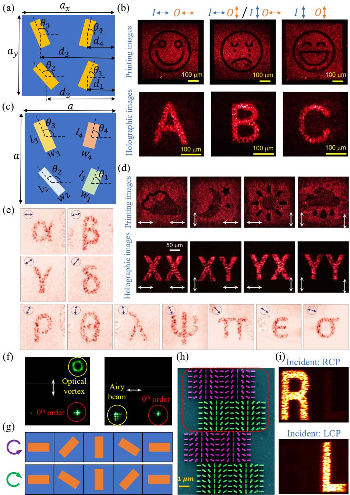

Multi-polarization metasurface hologram design. (a) Schematic of metasurface unit for arbitrary polarization and complex amplitude modulation based on geometric phase and detour phase. (b) Experimental nanoprinting images and holographic images generated by the metasurface hologram under different polarization states of the incident and output light. The metasurface operated at a wavelength of 671 nm. The arrows represent the directions of the linear polarizations, and “I” and “O” represent the input and output light, respectively. (c) Schematic of metasurface unit for arbitrary polarization and complex amplitude modulation based on geometric phase and resonant or propagation phase. (d) Experimental nanoprinting and holographic images generated by the bilayer metasurface. The arrows located at the lower left and lower right of each panel represent the incident and output polarization, respectively. (e) Experimental holographic images of a multi-polarization metasurface hologram at 11 linear polarization states. The metasurface operated at a wavelength of 700 nm. (continued)

(continued) The arrows represent the directions of the linear polarizations. (f) Experimental holographic images generated by the multi-polarization detour phase metasurface hologram under the incidence of orthogonal linearly polarized light at a wavelength of 532 nm. The white arrows in the center of images indicate the directions of the linear polarizations. (g) Schematic of the detour phase metasurface unit based on geometric phase in two meta-atom rotation directions. (h) False-color SEM of two units of the multi-polarization detour phase metasurface hologram. Each unit consists of two parts painted purple and green, respectively. (i) Experimental holographic images generated by the multi-polarization detour phase metasurface hologram under the incidence of different circularly polarized light at a wavelength of 1350 nm. (b) Adapted from [11] under a Creative Commons license. (d) Adapted from [172] under a Creative Commons license. (e) Adapted with permission from Xiong et al., Science 379, 294–299 (2023) [173]. Copyright © 2023 American Association for the Advancement of Science. (f) Adapted with permission from Min et al., Laser Photonics Rev. 10, 978–985 (2016) [166]. Copyright © 2016 WILEY-VCH Verlag GmbH & Co. KGaA, Weinheim. (h) and (i) Adapted from [161] under a Creative Commons license.

For example, consider the case of a bilayer metasurface. The Jones matrices of the bottom and top layer metasurfaces under forward illumination are denoted, respectively, as

$$
\mathbf {T} _ {\mathrm{f}} ^ {1} = \left[ \begin{array}{l l} T _ {x x} ^ {1} & T _ {x y} ^ {1} \\ T _ {y x} ^ {1} & T _ {y y} ^ {1} \end{array} \right], \quad \mathbf {T} _ {\mathrm{f}} ^ {2} = \left[ \begin{array}{l l} T _ {x x} ^ {2} & T _ {x y} ^ {2} \\ T _ {y x} ^ {2} & T _ {y y} ^ {2} \end{array} \right], \tag {287}
$$

where $T_{yx}^{1}=T_{xy}^{1}$ and $T_{yx}^{2}=T_{xy}^{2}$ because of the out-of-plane symmetry for single-layer metasurfaces. Under backward illumination, as described by Eq. (12), the reciprocity dictates that the Jones matrices of the two layers of metasurfaces become, respectively:

$$
\mathbf {T} _ {\mathrm{b}} ^ {1} = \left[ \begin{array}{c c} T _ {x x} ^ {1} & - T _ {y x} ^ {1} \\ - T _ {x y} ^ {1} & T _ {y y} ^ {1} \end{array} \right], \quad \mathbf {T} _ {\mathrm{b}} ^ {2} = \left[ \begin{array}{c c} T _ {x x} ^ {2} & - T _ {y x} ^ {2} \\ - T _ {x y} ^ {2} & T _ {y y} ^ {2} \end{array} \right]. \tag {288}
$$

Ignoring the interlayer coupling, the total Jones matrices of the bilayer metasurface under forward illumination and backward illumination are, respectively,

$$
\mathbf {T} _ {\mathrm{f}} = \mathbf {T} _ {\mathrm{f}} ^ {2} \mathbf {T} _ {\mathrm{f}} ^ {1}, \quad \mathbf {T} _ {\mathrm{b}} = \mathbf {T} _ {\mathrm{b}} ^ {1} \mathbf {T} _ {\mathrm{b}} ^ {2}. \tag {289}
$$

Substituting Eqs. (287) and (288) into Eq. (289), we obtain

$$
\mathbf {T} _ {\mathrm{f}} = \left[ \begin{array}{c c} A & C \\ D & B \end{array} \right], \quad \mathbf {T} _ {\mathrm{b}} = \left[ \begin{array}{c c} A & - D \\ - C & B \end{array} \right], \tag {290}
$$

where $A = T_{xx}^{1}T_{xx}^{2} + T_{xy}^{1}T_{xy}^{2}$ , $B = T_{xy}^{1}T_{xy}^{2} + T_{yy}^{1}T_{yy}^{2}$ , $C = T_{xy}^{1}T_{xx}^{2} + T_{yy}^{1}T_{xy}^{2}$ , and $D = T_{xx}^{1}T_{xy}^{2} + T_{xy}^{1}T_{yy}^{2}$ . To break the out-of-plane symmetry, we have

$$
C \neq D, \tag {291}
$$

i.e.,

$$
T _ {x y} ^ {1} \left(T _ {x x} ^ {2} - T _ {y y} ^ {2}\right) \neq T _ {x y} ^ {2} \left(T _ {x x} ^ {1} - T _ {y y} ^ {1}\right). \tag {292}
$$

From Eq. (292), it's evident that when $T_{xy}^{1} = T_{xy}^{2} = 0$ , it's impossible to achieve a full-parameter Jones matrix. We note that the scenario of backward illumination has also been considered in the above derivation, which will be used in Subsection 5.2.4.

In 2020, Yuan et al. [171] achieved independent phase modulation of the four polarization channels in the Jones matrix using a five-layer cascade of metasurfaces operating in the microwave band. Subsequently, in 2022, Bao et al. [172] experimentally demonstrated a bilayer metasurface supporting a full-parameter Jones matrix with 8 degrees of freedom. The layer spacing of 150 $\mu$ m corresponds to scenario (I) discussed in Subsection 2.2.1. The total electromagnetic response of the bilayer metasurface was calculated using the Rayleigh–Sommerfeld diffraction formula. The Jones matrix distributions for the two layers of metasurfaces, as expressed by Eq. (285), were optimized using the gradient descent algorithm to achieve the target full-parameter Jones matrix distribution. Each layer of metasurfaces utilized the unit composed of 2 × 2 c–Si meta-atoms to obtain a Jones matrix with 6 degrees of freedom. The unit size is 800 nm, and the operating wavelength is 808 nm. Under various linear polarization states for incident and output light, experimental nanoprinting images modulated by $t_{xx}$ , $t_{xy}$ , $t_{yx}$ , and $t_{yy}$ as well as holographic images generated by the complex amplitude distributions $t_{xx}e^{i\phi_{xx}}$ , $t_{xy}e^{i\phi_{xy}}$ , $t_{yx}e^{i\phi_{yx}}$ , and $t_{yy}e^{i\phi_{yy}}$ , are shown in Fig. 43(i).

(IV) Breaking the limitation on the number of independent polarization multiplexing channels. For a single-layer metasurface whose Jones matrix is expressed by Eq. (285), considering a linearly polarized incident light with the Jones vector of $\vec{E}^{in} = [\cos\gamma \sin\gamma]^{\top}$ , where $\gamma$ is the angle of the x axis and linear polarization direction, the complex amplitude of the output light in that polarization direction is

$$
O = \left[ \begin{array}{l l} \cos \gamma & \sin \gamma \end{array} \right] \mathbf {J} \left[ \begin{array}{l} \cos \gamma \\ \sin \gamma \end{array} \right] = \left[ \begin{array}{l l l} \cos^ {2} \gamma & \sin 2 \gamma & \sin^ {2} \gamma \end{array} \right] \left[ \begin{array}{l} J _ {x x} \\ J _ {x y} \\ J _ {y y} \end{array} \right]. \tag {293}
$$

Further considering a set of incident lights with polarization angles $\gamma_{1}, \gamma_{2}, \ldots, \gamma_{M}$ , after interacting with the metasurface, the matrix $O = [O_{1}, O_{2}, \ldots, O_{M}]^{\top}$ of complex amplitudes of the output light in the corresponding polarization direction is

$$
\mathbf {O} = \mathbf {A} \tilde {\mathbf {J}} = \left[ \begin{array}{l l l} \cos^ {2} \gamma_ {1} & \sin 2 \gamma_ {1} & \sin^ {2} \gamma_ {1} \\ \cos^ {2} \gamma_ {2} & \sin 2 \gamma_ {2} & \sin^ {2} \gamma_ {2} \\ \dots \\ \cos^ {2} \gamma_ {M} & \sin 2 \gamma_ {M} & \sin^ {2} \gamma_ {M} \end{array} \right] \left[ \begin{array}{l} J _ {x x} \\ J _ {x y} \\ J _ {y y} \end{array} \right], \tag {294}
$$

where $\tilde{J}$ can be seen as another form of the symmetric Jones matrix J. From Eq. (294), for M specific polarization angles and the corresponding complex amplitudes, the solution for the Jones matrix of the metasurface is

$$
\tilde {\mathbf {J}} = \mathbf {A} ^ {- 1} \mathbf {O}. \tag {295}
$$

From Eq. (295), it is clear that when $M \leq 3$ , an exact solution for $\tilde{\mathbf{J}}$ can be obtained, meaning that $M$ polarization channels are entirely independent, whereas when $M > 3$ , the components within the actual $\mathbf{O}$ will be correlated, leading to crosstalk between polarization channels. To disrupt the linear correlation between polarization channels when the number of channels exceeds 3, in 2023, Xiong et al. [173] introduced engineered noise into the metasurface, thereby breaking the physical limit on the number of independent polarization multiplexing channels. A novel solution for Eq. (294) was proposed as

$$
\tilde {\mathbf {J}} ^ {\prime} = \left(\mathbf {A} ^ {\top} \mathbf {A}\right) ^ {- 1} \mathbf {A} ^ {\top} \mathbf {O} + \delta \mathbf {J}, \tag {296}
$$

where the first term on the right side represents the minimum square error approximation solution for Eq. (294), and $\delta \mathbf{J}$ represents the noncorrelated noise matrix where each component is randomly sampled from a 2D complex normal distribution. The introduction of noise breaks the correlation between the components of the new output matrix $\mathbf{O}' = \mathbf{A}\tilde{\mathbf{J}}'$ , meaning that the crosstalk between different polarization channels

will be eliminated by the noise. The metasurface utilized the unit structure expressed by Eq. (286), as shown in Fig. 43(c), to achieve the modulation represented by $\tilde{\mathbf{J}}'$ . As demonstrated in Fig. 43(d), a metasurface hologram multiplexing up to 11 independent linear polarization states was realized.

The concept described above can be extended to a more generalized framework, enabling access to a larger number of polarization multiplexing channels. Consider a series of polarization states, each represented by a Jones vector $\vec{E}^{i}$ ( $i=1,2,\ldots,M$ , where M denotes the number of polarization states). According to Eq. (55), for a single-layer metasurface characterized by the Jones matrix J, the complex amplitude of the output light in the polarization state $\vec{E}^{j}$ for incident light in the polarization state $\vec{E}^{i}$ is given by

$$
O ^ {i j} = \left(\vec {E} ^ {j}\right) ^ {\dagger} \mathbf {J} \vec {E} ^ {i}. \tag {297}
$$

Due to the symmetry of J, it follows that $O^{ij} = O^{ji}$ . Consequently, the number of independent elements for $O^{ij}$ is $\left(M^{2} + M\right)/2$ . We note that the previously introduced design is a specific case of this more general form, where only symmetric polarization channels $(O^{ii})$ are utilized, and only linear polarization states are considered. The primary challenge in this approach lies in achieving holographic image generation across all these polarization channels with minimal crosstalk through the elaborate design of the metasurface's Jones matrix distribution J $(x, y)$ . In 2024, Wang et al. [572] developed a neural network to compute the diffraction patterns for various polarization channels associated with J $(x, y)$ . The neural network's support for automatic differentiation allowed for the application of the gradient descent algorithm to optimize J $(x, y)$ , minimizing the MSE between the reconstructed and target holographic images across all polarization channels. By employing a metasurface with a hybrid phase modulation mechanism [where J $(x, y)$ assumes the form given by Eq. (54)], holographic display multiplexing was achieved for up to 55 linear polarization channels $(M = 10)$ .

(V) Leveraging the polarization sensitivity of the diffraction characteristics of detour phase metasurface units, the design for polarization-multiplexed detour phase metasurface holograms can be realized.

Sub-wavelength slits on metal films exhibit strong polarization sensitivity. For a horizontal slit, only the incident light polarized along the vertical direction can excite surface plasmons to pass through the slit, while the incident light polarized along the horizontal direction is almost entirely reflected. Based on this, in 2016, Yuan's group $[166]$ achieved the metasurface that generated optical vortices and Airy beams, respectively, for orthogonal linearly polarized incident light, as shown in Fig. 43(e). The unit structure was composed of two slits oriented in orthogonal directions, where the slits along each direction introduced an independent detour phase for corresponding linearly polarized incident light.

Similarly, in 2018, Deng et al. [167] used the polarization-sensitive rectangular pillar as the unit for a detour phase metasurface, achieving the holographic display multiplexed for orthogonal linear polarization states.

Considering the design of the detour phase metasurface unit based on geometric phase, as shown in the first row of Fig. 43(f), by rotating the meta-atoms, a specific phase gradient is formed and the incident light will be diffracted to the corresponding diffraction angle. From Eq. (23), for LCP and RCP incident light, the introduced phase gradients are opposite to each other; thus, the diffraction angles of the output light are also opposites of each other when light is incident perpendicularly. A detour phase metasurface hologram implemented with such units will generate the same holographic image for the perpendicularly incident light with different circular polarization states at the cor-

responding opposite diffraction angles. If the meta-atoms are rotated in the opposite direction, as shown in the second row of Fig. 43(f), for LCP or RCP incident light, the introduced phase gradient will be the opposite of the original, and the corresponding diffraction angle will also be reversed. In 2016, Capasso's group $[161]$ combined two groups of geometric phase meta-atoms arranged in opposite rotation directions as the unit for a detour phase metasurface, as shown in Fig. 43(g), with the meta-atom groups with two rotation directions represented in purple and green, respectively. The meta-atom groups with different rotation directions introduce independent displacements, thus detour phase distributions for generating different holographic images. When observation is made only at one diffraction angle, with the incidence of different circularly polarized light, two distinct holographic images will be observed, as shown in Fig. 43(h).

(VI) Despite the design methods for polarization-multiplexed metasurface holograms mentioned above, the classic strategy of spatial multiplexing still finds its applications. In 2022, Rho's group $[573]$ spatially interleaved metasurface units corresponding to different vector polarization states in the design of vector metasurface holograms. In 2020, Deng et al. $[168]$ alternately arranged the metasurface units corresponding to different polarization channels in a direction perpendicular to the meta-atoms' displacement direction, achieving polarization multiplexing for the complex amplitude metasurface hologram based on detour phase and geometric phase. Essentially, these approaches are all based on the strategy of spatial multiplexing, which will not be further elaborated here.

# 5.2.2. Wavelength-Multiplexed Metasurfaces

The design of wavelength-multiplexed metasurface holograms is of significant importance for achieving the long-sought goal of full-color holographic display in the field of metasurface holography. A target color image can be decomposed into three grayscale images for the red, green, and blue primary color components. To realize a full-color holographic display, the metasurface hologram is designed to generate holographic images of the corresponding color components for the incident light at red, green, and blue wavelengths, respectively, which are finally combined into a color holographic image. In the step of solving for the holograms, the compensation algorithm for color holographic displays introduced in Subsection 5.1.1 might be required. In Subsection 2.1.5, we have introduced a design method that utilizes polarization multiplexing channels to decouple the phase modulation of meta-atoms for each wavelength, thereby achieving wavelength-multiplexed holographic display $[135]$ . Below, we continue to introduce other design methods for wavelength-multiplexed metasurface holograms.

(I) Constructing a meta-atom database to independently modulate the phase shift at different wavelengths. Directly requiring a single meta-atom to meet the independent phase modulation for multiple wavelengths is not easy to achieve. Specifically, target phase distributions for different wavelengths are generally independently solved through multiple uses of the CGH algorithm, and the target phase shifts introduced at the same position on the metasurface for different wavelengths are somewhat randomly related. Therefore, for meta-atoms with certain phase dispersion characteristics, as analyzed in Subsection 4.4.2, it is often difficult to simultaneously meet the phase modulation requirements for all wavelengths at every position on the metasurface $[429]$ . To achieve this, a large lattice constant and complex meta-atom structures are needed to provide sufficient design space $[574]$ , and it is necessary to overcome the unacceptably high time cost for the forward design method when exploring a large design space, as explained in Subsection 3.4. Leveraging inverse design methods holds promise for efficiently exploring the large design space of complex meta-atoms, with the relevant work $[449]$ already introduced at the end of Subsection 3.4.2.

Figure 44  
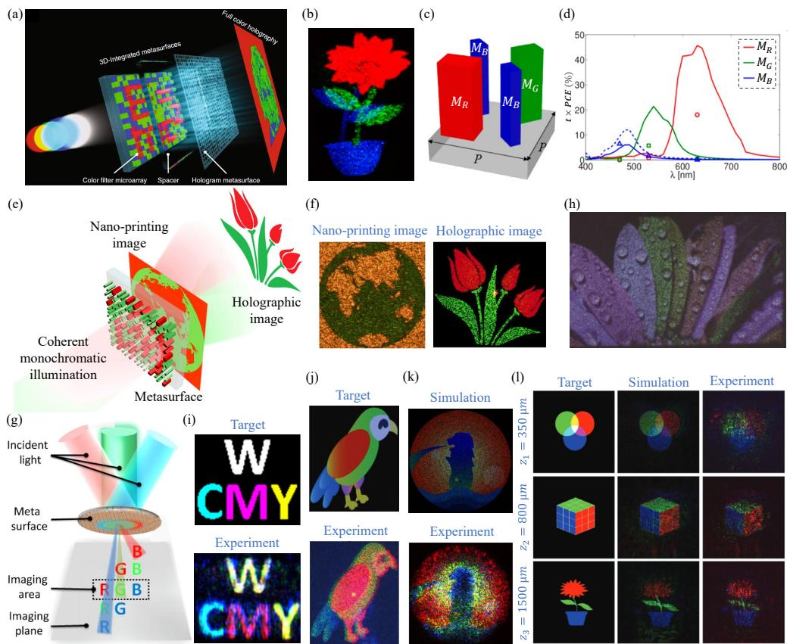

Multi-wavelength metasurface hologram design. (a) Schematic of the principle of the metasurface hologram integrated with the color filter microarray. (b) Experimental color holographic image generated by the multi-wavelength metasurface hologram based on space division multiplexing. (c) Schematic of the metasurface unit based on space division multiplexing. (d) Simulated spectra of the product of transmittance and PCE of three kinds of meta-atoms in (c). (e) Schematic of the principle of metasurface with both nanoprinting and color holographic display functions. (f) Experimental nanoprinting image (left) and color holographic image (right) generated by the metasurface with both nanoprinting and holography functions. (g) Schematic of the principle of color holographic display based on off-axis illumination method. (h) Experimental color holographic image generated by the metasurface hologram based on the off-axis illumination. (i) Top: target image. Bottom: experimental color holographic image generated by the metasurface hologram based on off-axis illumination. (j) Top: target image. Bottom: experimental color holographic image generated by the complex amplitude metasurface hologram based on detour phase and geometric phase. (k) Simulated (top) and experimental (bottom) color holographic images generated by the Fresnel metasurface hologram. (l) Experimental color holographic images generated by the Fresnel metasurface hologram at different positions. (a) Reprinted from [576] under a Creative Commons license. (b)–(d) Adapted with permission from Wang et al., Nano Lett. 16, 5235–5240 (2016) [356]. Copyright © 2016 American Chemical Society. (e) and (f) Adapted from [532] under a Creative Commons license. (g) and (h) Adapted from [577] under a Creative Commons license. (i) Adapted with permission from Wan et al., ACS Nano 10, 10671–10680 (2016) [578]. Copyright © 2016 American Chemical Society. (j) Adapted with permission from (continued)

(continued) Deng et al., Adv. Funct. Mater. 30, 1910610 (2020) [168]. Copyright © 2020 WILEY-VCH Verlag GmbH & Co. KGaA, Weinheim. (k) Adapted from [551] under a Creative Commons license. (l) Adapted with permission from So et al., Adv. Mater. 35, 2208520 (2023) [552]. Copyright © 2023 WILEY-VCH Verlag GmbH & Co. KGaA, Weinheim.

(II) Using the spatial multiplexing design strategy, it is possible to achieve wavelength-multiplexed metasurfaces when a single meta-atom cannot simultaneously meet the independent phase modulation for multiple wavelengths $[353,575]$ . In this case, the metasurface unit is composed of multiple meta-atoms, with each one (or possibly multiple ones) corresponding to a wavelength component, fulfilling the independent phase modulation requirements for that wavelength. Additionally, to prevent crosstalk between holographic images of different wavelengths, the transmittance (reflectance) of the meta-atom of the transmissive (reflective) metasurface corresponding to a certain wavelength should be as close to zero as possible at other wavelengths, which can be achieved through elaborate design of the meta-atom structure $[356,532]$ , or indirectly by additionally integrating a front-mounted monolithic color filter microarray based on Fabry–Pérot cavity $[576]$ , as illustrated in Fig. 44(a). In 2016, Wang et al. $[356]$ utilized this method to achieve the full-color holographic display, as shown in Fig. 44(b). The metasurface unit, as shown in Fig. 44(c), is composed of $2 \times 2$ meta-atoms corresponding to different wavelengths, with independent geometric phase modulation introduced by rotating the meta-atoms corresponding to those wavelengths. The meta-atoms are made of Si, with a height of 320 nm. The spectral characteristics of the efficiency (the product of transmittance and PCE) of the meta-atoms are shown in Fig. 44(d), indicating that crosstalk between different wavelength components is effectively eliminated. Due to the low efficiency of the meta-atom corresponding to blue light, two meta-atoms corresponding to blue light are arranged within the unit to balance the intensity of holographic images generated at each wavelength. The metasurface is composed of $452 \times 452$ units, with each unit sized at 420 nm. The experimentally measured efficiencies of the metasurface hologram at operating wavelengths of 473 nm, 532 nm, and 633 nm were 3.6%, 5.2%, and 18%, respectively. A drawback of this spatial multiplexing method is that, aside from the loss in device efficiency, the unit size is expanded to twice its original, which, according to Eq. (275), limits the FOV of the hologram.

As a variant of the spatial multiplexing strategy, the meta-atoms responsible for different wavelengths don't necessarily have to be interlaced within the same unit but can be arranged in certain patterns, as shown in Fig. 44(e). For a given wavelength component, the corresponding meta-atoms have almost zero efficiency at other wavelengths, and likewise, other meta-atoms have almost zero efficiency at that wavelength. Therefore, through the arrangement of these meta-atoms, specific amplitude modulation can be formed, thus achieving a nanoprinting function. When solving for the hologram for that wavelength through the GS algorithm, the amplitude distribution on the input plane is determined according to the arrangement of the corresponding meta-atoms. Using this method, in 2019, Wei et al. [532] achieved a geometric phase metasurface hologram multiplexed for wavelengths of 532 nm and 650 nm. The meta-atoms are made of Si, with a height of 300 nm. The metasurface consists of 666 × 666 units, with each unit sized at 300 nm. The nanoprinting image of the metasurface is shown in the left panel of Fig. 44(f), and the reconstructed color holographic image is shown in the right panel of Fig. 44(f). Similarly, in 2020, Wen et al. [579] achieved a detour phase metasurface hologram with nanoprinting functionality multiplexed for wavelengths of 450 nm, 532 nm, and 635 nm.

(III) Achieving a color holographic display based on the off-axis illumination method. Indeed, to achieve color holographic displays, it's not strictly necessary for the metasurface units to realize independent phase modulation for each wavelength. As illustrated in Fig. 44(g), the metasurface generates the same holographic image for the incident light of every wavelength, where the holographic image is an assembly of the spatially separated holographic images for all color components. This can be easily accomplished through a geometric phase metasurface. Then, by varying the incident angles of light at different wavelengths, the positions of the holographic images generated at different wavelengths are adjusted, thus retaining only the portion of the required holographic image corresponding to each wavelength within the effective FOV. Based on this, in 2016, Luo's group and their collaborators [577] and Yang's group and their collaborators [578] separately achieved full-color holographic display, with the experimental holographic images shown in Figs. 44(h) and 44(i), respectively. The advantage of this method is that the metasurface is based solely on geometric phase, making it easy to design and fabricate. While the disadvantages include reduced device efficiency, limited holographic display FOV, and the issue of unwanted holographic images outside the effective FOV. These unwanted holographic images can be eliminated through expanding the effective FOV to $\pm90^{\circ}$ [580]. By doing so, any unwanted holographic images become evanescent waves when viewing one holographic image under its specific incident angle. This method will be further detailed in Subsection 5.2.4.

Just like geometric phase, detour phase also exhibits phase dispersion-free characteristics, meaning the aforementioned method can also be implemented with detour phase metasurfaces. An additional benefit of this approach is that, as indicated by Eq. (29), for a detour phase metasurface working at a fixed diffraction order $\sigma_{\mathrm{d}}$ , incident light at different wavelengths will have different diffraction angles. Therefore, by reasonably controlling the spacing between the holographic images corresponding to different wavelengths during assembly, it's possible to directly observe the target color holographic image within the effective FOV without the need for off-axis illumination. This characteristic is still retained for the complex amplitude modulation metasurfaces based on both detour phase and geometric phase introduced in Subsection 5.1.2. Based on this, in 2020, Deng et al. [168] realized a complex amplitude metasurface hologram that generated a full-color holographic image within the effective FOV, as shown in Fig. 44(j).

(IV) Wavelength-multiplexed Fresnel metasurface holograms. The above-discussed metasurface holograms are all Fraunhofer holograms. For Fresnel holograms implemented based on geometric phase metasurfaces, holographic displays that multiplex both wavelength and position can be achieved solely through multi-objective CGH algorithms, as introduced in Subsection 5.1.1. Utilizing an iterative multi-objective CGH algorithm, in 2019, Qiu's group and their collaborators $[551]$ realized a geometric phase-based metasurface hologram multiplexed for wavelengths of 488 nm, 532 nm, and 633 nm, with the full-color holographic image shown in Fig. 44(k). In 2023, Rho's group $[552]$ solved the multi-objective CGH problem through gradient optimization based on automatic differentiation, achieving holographic display with a total of 9 multiplexing channels for wavelengths of 450 nm, 532 nm, and 635 nm and three observation plane positions. As shown in Fig. 44(l), a full-color holographic image is reconstructed at each of the three observation planes. The PSNR of the three holographic images are 12.24 dB, 12.08 dB, and 15.56 dB, respectively. The geometric phase metasurface consists of $900 \times 900$ rectangular pillar meta-atoms made of titanium dioxide nanoparticle-embedded resin, with a height of 910 nm and a lattice constant of 450 nm. Experimental results show the meta-atoms have an average

PCE of up to $63\%$ at the three wavelengths. It's important to note that the color holographic image of Fresnel holograms can only be observed at specific positions, which fundamentally differs from Fraunhofer holograms.

# 5.2.3. Orbital Angular Momentum-Multiplexed Metasurfaces

Orbital angular momentum (OAM), characterized by a light's helical wavefront, represents a novel physical property and a new degree of freedom for light field manipulation arising from the spatial variation of the light field's phase [581]. If a light field possesses a complex amplitude distribution of $e^{il\varphi}$ (the integer $l$ defined as the topological charge), where the phase continuously changes from 0 to $2l\pi$ along the azimuthal direction and returns to the starting point, then a phase singularity, where the phase is undefined, emerges at the center of this continuous loop of phase change, thereby forming an optical vortex. Microscopically, each photon in such a state carries an OAM of $l\hbar$ . A vortex beam, possessing a Hilbert factor $e^{il\varphi}$ , is a paraxial light beam that exhibits an optical vortex along its propagation axis. The design workflow for vortex-beam-generating metasurfaces is available in our open-source code repository [73].

The OAM provides a physically infinite set of orthogonal helical modes (l can be any integer); hence, OAM-multiplexed metasurface holography holds the promise of achieving an unprecedented number of multiplexing channels.

(I) Achieving OAM-multiplexed metasurface holograms using multi-objective CGH algorithms. A vortex beam inherently depends on a topological charge l for its phase distribution

$$
\phi_ {\text {vortex}} (l) = l \varphi . \tag {298}
$$

When l=0, the vortex beam transitions to the plane wave scenario, which has been consistently considered in previous designs. After interacting with a metasurface hologram with a phase distribution of $\phi_{meta}$ , the phase distribution of the output light is

$$
\phi_ {\text {output}} (l) = \phi_ {\text {vortex}} (l) + \phi_ {\text {meta}}, \tag {299}
$$

which depends on the topological charge $l$ . This means that vortex beams with different topological charges $l_{1}, l_{2}, \ldots, l_{M}$ interacting with the same metasurface will result in output light with distinct phase distributions, thereby potentially achieving holographic display multiplexing with a number of channels equivalent to $M$ . The phase distribution of the metasurface is fixed, so it can be solved using the multi-objective CGH algorithms mentioned in Subsection 5.1.1. Based on this, in 2019, Qiu's group and their collaborators [551] achieved a geometric phase metasurface hologram multiplexed for three different OAMs with topological charges of 0, +3, and +6, with simulation and experimental holographic images shown in Fig. 45(a). Operating at a wavelength of 532 nm, the metasurface is composed of $300 \times 300$ rectangular $\mathrm{TiO_2}$ pillar meta-atoms with a height of 600 nm and a lattice constant of 325 nm.

Now, let's consider a non-multiplexed metasurface hologram that selectively responds to a vortex beam with a specific topological charge of $l_0$ . The phase distribution of the metasurface hologram is defined as

$$
\phi_ {\text {select}} ^ {l _ {0}} = \phi_ {\text {plane}} - \phi_ {\text {vortex}} \left(l _ {0}\right), \tag {300}
$$

where $\phi_{plane}$ is the phase distribution of the hologram generating the target holographic image under plane wave incidence. When a vortex beam with a topological charge of l is incident, the phase distribution of the output light is [Eq. (298) is used in the last

Figure 45  
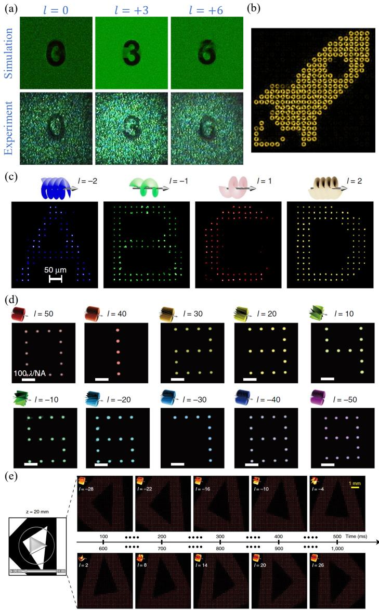

Orbital angular momentum-multiplexed metasurface hologram design. (a) Holographic images generated by the OAM-multiplexed metasurface hologram based on the multi-objective computer-generated hologram algorithm under the incidence of vortex beams with different topological charges. Top: simulated results. Bottom: experimental results. (b) Experimental holographic image generated by metasurface hologram conserving the OAM property of the incident vortex beam. The topology charge of the vortex beam is +2. Pseudo colors are used to visualize different OAM modes [the same as (c) and (d)]. (c) Experimental holographic images generated by the OAM-multiplexed metasurface hologram with 4 multiplexing channels under the incidence of vortex beams with different topological charges. (d) Experimental holographic images generated by the OAM-multiplexed metasurface hologram with 10 multiplexing channels under the incidence of vortex beams with different topological charges. (e) Experimental holographic video generated by the OAM-multiplexed complex amplitude metasurface hologram. (a) Adapted from Jin et al., Nat. Commun. 10, 4789 (2019) [551] under a Creative Commons license. (b) and (c) Adapted from [582] under a Creative Commons license. (d) Reprinted with permission (continued)

(continued) from Fang et al., Nat. Photonics 14, 102–108 (2020) [583]. Copyright © 2020 Nature Springer. (e) Reprinted with permission from Ren et al., Nat. Nanotechnol. 15, 948–955 (2020) [392]. Copyright © 2020 Nature Springer.

step]

$$
\phi_ {\text {output}} (l) = \phi_ {\text {select}} ^ {l _ {0}} + \phi_ {\text {vortex}} (l) = \phi_ {\text {plane}} + (l - l _ {0}) \varphi . \tag {301}
$$

From Eq. (301), it is clear that only when the incident vortex beam has a topological charge of $l_0$ can it cancel out the $-\phi_{\mathrm{vortex}}(l_0)$ term in the metasurface phase distribution expressed by Eq. (300), allowing the output light to acquire $\phi_{\mathrm{plane}}$ , the phase distribution that can generate the target holographic image. If the topological charge of the incident vortex beam is not $l_0$ , the phase distribution of the output light is effectively $\phi_{\mathrm{plane}}$ with a disruptive phase of $(l - l_0)\varphi$ , failing to generate the target holographic image. This means that the metasurface hologram with the phase distribution satisfying Eq. (300) will exhibit OAM selectivity. In 2020, Zhou et al. [584] demonstrated the application of this feature in the field of encryption. By combining this with the 3-channel polarization-multiplexed metasurface hologram design [170] introduced in Subsection 2.1.5, they achieved a metasurface hologram that reconstructs the holographic image only under the incidence of the vortex beam with a specific polarization state and topological charge.

Now we re-examine the previously introduced OAM-multiplexed metasurface hologram [551]. From Eq. (299), in this context, the phase distribution of the metasurface is

$$
\phi_ {\text {meta}} = \phi_ {\text {output}} (l) - \phi_ {\text {vortex}} (l), \tag {302}
$$

where $\phi_{\mathrm{output}}(l)$ is the phase distribution that generates a holographic image under plane wave incidence. Equation (302) shows a corresponding relationship to the phase distribution of the OAM selective metasurface hologram expressed by Eq. (300). The difference lies in that the phase distribution of the hologram obtained through the multi-objective CGH algorithm can generate corresponding holographic images for vortex beams with a set of various topological charges $l_{1}, l_{2}, \ldots, l_{M}$ , that is, it has selectivity for multiple OAMs. From this perspective, OAM selectivity forms the basis for implementing OAM multiplexing.

(II) Achieving OAM-multiplexed metasurface holograms through the superposition of phase distributions corresponding to different topological charges. In the previous demonstrations, after interacting with the metasurface, the vortex beam loses its OAM property. When a vortex beam is perpendicularly incident on a Fraunhofer hologram, the generated holographic image can be seen as the convolution of the Fourier transform of the vortex beam's helical wavefront (which acts as a convolution kernel) with the original holographic image generated by the hologram under plane wave incidence. To avoid spatial overlap of the convolution kernel to preserve the OAM property at every point on the holographic image, the original holographic image needs to be sampled using a 2D Dirac comb function to serve as the new target holographic image, with the subsequent design process remaining unchanged. The sampling period is determined by the vortex beam, since vortex beams with different OAMs exhibit different spatial frequency characteristics. Based on this, in 2019, Ren et al. [582] achieved metasurface holograms that preserve the incident light's OAM property. The holographic image generated by a hologram designed for the vortex beam with a topological charge of +2 is shown in Fig. 45(b).

Leveraging the previous discussion concerning OAM selectivity, it's possible to further realize a metasurface hologram that exhibits OAM selectivity for the vortex beam with a specific topological charge $l_0$ . In this case, the phase distribution of the metasurface hologram is

$$
\phi_ {\text {select}} ^ {l _ {0}} = \phi_ {\text {cons}} ^ {l _ {0}} - \phi_ {\text {vortex}} \left(l _ {0}\right), \tag {303}
$$

where $\phi_{\mathrm{cons}}^{l_0}$ is the phase distribution of a hologram preserving the property of OAM with a topological charge of $l_0$ . It is important to note that for an incident vortex beam with a topological charge of $l_0$ , the phase distribution of the output light is $\phi_{\mathrm{cons}}^{l_0}$ , rather than $\phi_{\mathrm{cons}}^{l_0} + \phi_{\mathrm{vortex}}(l_0)$ as would be the case if the OAM property were preserved. Therefore, the generated holographic image will no longer preserve the OAM property.

Taking a step further, let the phase distribution of the metasurface hologram be the superposition of the OAM-selective phase distributions for vortex beams with topological charges $l_{1}, l_{2}, \ldots, l_{M}$ , i.e.,

$$
\phi_ {\text {multiplex}} = \phi_ {\text {select}} ^ {l _ {1}} + \phi_ {\text {select}} ^ {l _ {2}} + \dots + \phi_ {\text {select}} ^ {l _ {M}}. \tag {304}
$$

When an incident vortex beam has a topological charge that matches one of $l_{1}, l_{2}, \ldots, l_{M}$ , for instance, $l_{m}$ , the phase distribution of the output light is

$$
\phi_ {\text {output}} = \phi_ {\text {cons}} ^ {l _ {m}} + \phi_ {\text {select}} ^ {l _ {1}} + \dots + \phi_ {\text {select}} ^ {l _ {m - 1}} + \phi_ {\text {select}} ^ {l _ {m + 1}} + \dots + \phi_ {\text {select}} ^ {l _ {M}}, \tag {305}
$$

meaning that the metasurface will generate the corresponding holographic image associated with $\phi_{cons}^{l_{m}}$ , despite being subject to crosstalk from the diffractive patterns generated by the phase distributions corresponding to other channels [the terms except for the first term on the right side of Eq. (305)]. In this way, OAM multiplexing for a total of M channels corresponding to $l_{1}, l_{2}, \ldots, l_{M}$ is achieved. Considering another incident vortex beam with a topological charge that matches one of $l_{1}, l_{2}, \ldots, l_{M}$ , for instance, $l_{m}^{\prime}$ , the closer $l_{m}$ and $l_{m}^{\prime}$ are, the more similar the phase distributions of their respective output light, thus the stronger the crosstalk between them might be. Therefore, it's often preferred to maintain a certain separation between the topological charges of different multiplexing OAMs to achieve a higher number of multiplexing channels [583].

Building on this, in 2019, Ren et al. [582] achieved a propagation phase metasurface hologram multiplexed for vortex beams with topological charges of -2, -1, +1, and +2, with the experimental holographic images shown in Fig. 45(c). Operating at a wavelength of 632 nm, the metasurface is made of cylindrical GaN meta-atoms with a height of 1 $\mu$ m. Following the same design method, in 2020, Fang et al. [583] demonstrated a metasurface hologram with up to 10 OAM multiplexing channels, with experimental holographic images shown in Fig. 45(d). In the same year, Ren et al. [392] further achieved an OAM-multiplexed complex amplitude metasurface hologram. The meta-atoms are rectangular pillars made of polymer material, with a cross-sectional dimension of 780 nm by 390 nm and heights ranging from 3.4 $\mu$ m to 4.45 $\mu$ m. Different levels of amplitude modulation are introduced by adjusting the heights of the meta-atoms, and phase modulation is applied by rotating the meta-atoms, as introduced at the end of Subsection 5.1.2. Operating at a wavelength of 633 nm, the metasurface, composed of 2000 × 2000 meta-atoms, has a large size of 2.5 mm × 2.5 mm. The metasurface hologram features up to 60 OAM multiplexing channels and was used to realize two segments of video, each with 30 frames, with some frames from one segment shown in Fig. 45(e).

From a theoretical perspective, the phase distribution of the OAM-multiplexed meta-surface hologram, as expressed by Eq. (304), remains feasible whether $\phi_{select}^{l_{m}}$ is de-

fined by Eq. (300) or Eq. (303), because the preservation of OAM properties is not critical in this context. However, the complexity of the target holographic image after sampling with a comb function will be significantly reduced compared to the original image, thus decreasing the design pressure.

The native phase distribution introduced by the incident vortex beam is fundamentally what makes OAM multiplexing possible. Generally, this does not conflict with polarization multiplexing, wavelength multiplexing, or other types of multiplexing based on the response characteristics of metasurface units, and vortex beams can also have polarization, wavelength, or other properties at the same time, allowing for the coexistence of various multiplexing types. In 2023, Yang et al. [571] combined OAM multiplexing with orthogonal circular polarization state multiplexing to achieve a metasurface hologram with a total of 8 multiplexing channels for two circular polarization states and four OAMs. In this case, the orthogonal circular polarization state multiplexing was achieved based on Eq. (284), and OAM multiplexing was implemented using the aforementioned method. In 2024, He et al. [585] realized a complex amplitude metasurface hologram capable of generating independent nanoprinting or holographic images at two different wavelengths, $473~\mathrm{nm}$ and $633~\mathrm{nm}$ , and five distinct OAMs with topological charges of $0, \pm 3$ , and $\pm 6$ . The complex amplitude modulation was implemented by leveraging the interference of electromagnetic responses from multiple meta-atoms within a single unit. Wavelength multiplexing was accomplished using a spatial multiplexing design strategy [method (II) in Subsection 5.2.2], while OAM multiplexing was realized using the same method.

# 5.2.4. Other Types of Multiplexed Metasurfaces

Here, we primarily focused on incident angle-multiplexed metasurface holograms and Janus metasurface holograms. Other types of multiplexed metasurface holograms, such as metasurface holograms multiplexing transmitted and reflected light $[568,586]$ , metasurface holograms multiplexing free space light and guided waves $[587]$ , etc., will not be covered.

Incident angle-multiplexed metasurfaces. Incident angle multiplexing is significant for the development of off-axis optical components and further expanding the number of multiplexing channels of metasurfaces.

(I) Constructing a meta-atom database to independently modulate the phase shift at different incident angles. The electromagnetic response of meta-atoms is inherently dependent on the angle of incidence. Yet, some shapes of meta-atoms exhibit significant incident-angle-dependent electromagnetic response characteristics, while others do not. The former can be used to introduce independent modulation for the light incident at multiple angles, and the latter are more suitable for applications requiring phase modulation to remain essentially unchanged within a certain range of the incident angle $[488]$ .

In 2017, Faraon's group [588] achieved an incident angle-multiplexed metasurface hologram operating in reflection mode, utilizing meta-atoms with a U-shaped cross-section as shown in Fig. 46(a). The meta-atom database covered the complete phase

Figure 46  
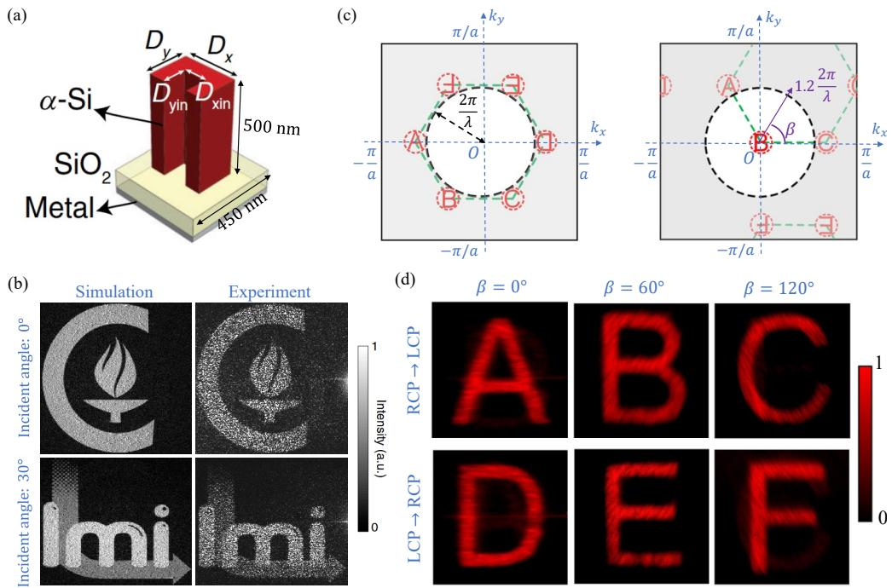

Multi-angle metasurface hologram design. (a) Schematic of meta-atom in U-shaped cross section. (b) Experimental holographic images generated by the multi-angle metasurface hologram under the illumination at different incident angles. (c) Schematic of the multi-angle metasurface hologram with an extended effective FOV. Left: diffraction pattern in the momentum space under perpendicular incidence. Right: diffraction pattern in the momentum space under specific oblique incidence. The metasurface with a lattice constant $a$ supports a spatial angular frequency range expressed by Eq. (306). The dotted circle represents the boundary of the effective FOV, constrained by the maximum spatial angular frequency $\frac{2\pi}{\lambda}$ . Oblique incident light carries an in-plane wavevector of $1.2\frac{2\pi}{\lambda}$ and is oriented at an azimuthal angle $\beta$ . The purple arrow depicts the direction and magnitude of this in-plane wavevector. Each letter pattern represents a holographic image corresponding to a specific azimuthal angle. (d) Experimental holographic images generated by the multi-angle metasurface hologram under various illumination directions and polarization channels. (a) and (b) Adapted from [588] under a Creative Commons license. (c) and (d) Adapted from [580] under a Creative Commons license.

modulation for light of TE polarization state and 915 nm wavelength incident at specific angles of $0^{\circ}$ and $30^{\circ}$ . The simulation and experimental holographic images are shown in Fig. 46(b). Using a similar method, in 2021, Wan et al. [567] covered complex amplitude modulation for two angles of incidence by traversing different shapes and sizes of meta-atoms, thus realizing a metasurface hologram working in reflection mode with both nanoprinting and holographic display functions at each incident angle.

(II) Leveraging the effective FOV of the metasurface hologram. For a metasurface with a lattice constant a, the maximum phase gradient that it can introduce is $\frac{\pi}{a}$ . Therefore, the spatial angular frequency range supported by the metasurface can be expressed as

$$
k _ {x} \in \left[ - \frac {\pi}{a}, \frac {\pi}{a} \right], \quad k _ {y} \in \left[ - \frac {\pi}{a}, \frac {\pi}{a} \right]. \tag {306}
$$

Referring to Eq. (65), the allowable spatial angular frequency range for propagation waves is

$$
k _ {x} ^ {2} + k _ {y} ^ {2} \leq \left(\frac {2 \pi}{\lambda}\right) ^ {2}. \tag {307}
$$

When $a \leq \frac{\lambda}{2}$ , the spatial angular frequency range specified in Eq. (306) exceeds that in Eq. (307), implying that any diffraction pattern of the metasurface hologram outside the range in Eq. (307) becomes invisible due to transitioning into evanescent waves, as illustrated in the left panel of Fig. 46(c). However, when the incident light is oblique and carries a suitable in-plane wavevector, it is possible to shift the diffraction pattern outside the range in Eq. (307) to the center of the FOV. Drawing on the method depicted in Fig. 44(g), by carefully designing combinations of holographic images for different azimuthal angles, the specific oblique incidence can render the holographic image corresponding to the particular azimuthal angle visible while concealing the others, as demonstrated in the right panel of Fig. 46(c).

Utilizing this approach, in 2024, Liu et al. [580] developed a multi-angle geometric metasurface hologram operating at a wavelength of 637 nm and featuring a lattice constant of 177 nm. For RCP light under oblique incident LCP light at various azimuthal angles, three independent holographic images are generated in the center of FOV, as illustrated in the top panel of Fig. 46(d). Employing the technique in Eq. (250), another set of three holographic images becomes observable for LCP light under oblique incident RCP light, as depicted in the bottom panel of Fig. 46(d).

(III) Achieving incident angle-multiplexing through detour phase metasurface holograms. As introduced in Subsection 2.1.4, based on Eq. (35), it's possible to introduce independent detour phase modulation for output light at diffraction angles $\theta_{x}$ and $\theta_{y}$ in the x and y directions, respectively. Considering the light incident at angles $-\theta_{x}$ and $-\theta_{y}$ , the original output light at the diffraction angles of $\theta_{x}$ and $\theta_{y}$ will now exit the metasurface perpendicularly, thus achieving the multiplexing for incident angles of $-\theta_{x}$ and $-\theta_{y}$ . Based on this, in 2021, Jang et al. [589] achieved an incident angle-multiplexed metasurface hologram and utilized the spatial multiplexing strategy to further increase the number of angle multiplexing channels.

(IV) The incident angle-multiplexed metasurface can also be achieved through the spatial multiplexing strategy. In this design, the metasurface unit consists of multiple meta-atoms, each tasked with phase modulation for a specific angle of incidence. To reduce crosstalk among different incident angles, it is crucial to meticulously design the meta-atom structure such that the efficiency of each meta-atom is negligible at all angles of incidence other than its corresponding angle. Utilizing this approach, in 2024, Latif et al. [590] realized a metasurface hologram that multiplexes at incident angles of $\pm35^{\circ}$ for LCP light.

Janus metasurfaces. Janus metasurfaces, as illustrated in Fig. 47(a), exhibit distinct electromagnetic responses and corresponding device functions for forward and backward incident light [475]. As indicated by Eq. (290), utilizing a multilayer metasurface that supports a Jones matrix with unequal non-diagonal elements, this asymmetric electromagnetic response can be realized for the specific polarization channel.

(I) Achieving Janus metasurface holograms through the asymmetric electromagnetic response of multilayer metasurfaces. In 2019, Zentgraf's group and their collaborators [476] achieved a metasurface hologram that displays a holographic image only under a specific polarization state and illumination direction, utilizing a bilayer metasurface unit structure, as shown in Fig. 47(b). The meta-atoms are made of Au with a height of 50 nm, and the two layers are separated by a 50 nm thick dielectric layer of $SiO_{2}$ . Under

Figure 47  
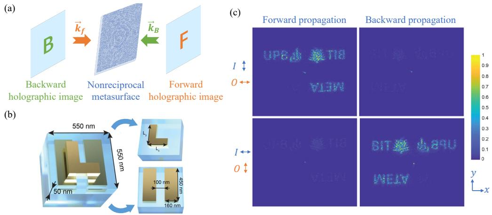

Janus metasurface hologram design. (a) Schematic of the Janus metasurface hologram. (b) Schematic of bilayer structure of the unit of the Janus metasurface. (c) Experimental holographic images generated by the Janus metasurface hologram under different illumination directions and polarization states. (b) and (c) Adapted with permission from Frese et al., Nano Lett. 19, 3976–3980 (2019) [476]. Copyright © 2019 American Chemical Society.

forward illumination, the L-shaped cross-section meta-atoms in the bottom layer can be represented by the Jones matrix

$$
\mathbf {T} _ {\mathrm{f}} ^ {1} = \left[ \begin{array}{l l} T _ {x x} ^ {1} & T _ {x y} ^ {1} \\ T _ {y x} ^ {1} & T _ {y y} ^ {1} \end{array} \right], \tag {308}
$$

where $T_{yx}^{1}=T_{xy}^{1}\neq0$ . To introduce non-reciprocity, a top layer of meta-atoms should be added, which has polarization selectivity, maintaining high transmittance (assumed to be 1) only for light polarized along the x direction. The meta-atoms under forward illumination can be represented by the Jones matrix

$$
\mathbf {T} _ {\mathrm{f}} ^ {2} = \left[ \begin{array}{l l} T _ {x x} ^ {2} & T _ {x y} ^ {2} \\ T _ {y x} ^ {2} & T _ {y y} ^ {2} \end{array} \right] = \left[ \begin{array}{l l} 1 & 0 \\ 0 & 0 \end{array} \right]. \tag {309}
$$

In this case, Eq. (292) is satisfied. Ignoring the interlayer coupling in the bilayer structure, the total Jones matrices $T_{f}$ and $T_{b}$ follow Eq. (290). For incident light with a Jones vector of $[0\ 1]^{\top}$ , the complex amplitudes of the output light linearly polarized along the x direction under forward and backward illumination are, respectively,

$$
O ^ {\mathrm{f}} = \left[ \begin{array}{l l} 1 & 0 \end{array} \right] \mathbf {T} _ {\mathrm{f}} \left[ \begin{array}{l} 0 \\ 1 \end{array} \right] = T _ {x y} ^ {1}, \quad O ^ {\mathrm{b}} = \left[ \begin{array}{l l} 1 & 0 \end{array} \right] \mathbf {T} _ {\mathrm{b}} \left[ \begin{array}{l} 0 \\ 1 \end{array} \right] = 0, \tag {310}
$$

which indicates that under forward illumination, the output light linearly polarized along the x direction obtains a complex amplitude distribution determined by $T_{xy}^{1}$ . Under backward illumination, however, its amplitude is 0. By changing the size of the bottom layer meta-atoms, $T_{xy}^{1}$ can be adjusted. Based on this, a Janus metasurface hologram with dimensions of $200\mu m \times 200\mu m$ and an operating wavelength of 1150 nm was realized, with experimental holographic images corresponding to Eq. (310) shown in the first row of Fig. 47(c). Now further consider another scenario. For incident light with a Jones vector of $[10]^{\top}$ , the complex amplitudes of the output light linearly polarized along the y direction under forward and backward illumination are, respectively,

$$
O ^ {\mathrm{f}} = \left[ \begin{array}{l l} 0 & 1 \end{array} \right] \mathbf {T} _ {\mathrm{f}} \left[ \begin{array}{l} 1 \\ 0 \end{array} \right] = 0, \quad O ^ {\mathrm{b}} = \left[ \begin{array}{l l} 0 & 1 \end{array} \right] \mathbf {T} _ {\mathrm{b}} \left[ \begin{array}{l} 1 \\ 0 \end{array} \right] = - T _ {x y} ^ {1}, \tag {311}
$$

which explains the experimental holographic images shown in the second row of Fig. 47(c).

(II) Achieving Janus metasurface holograms using nonreciprocal metasurfaces. Nonreciprocal metasurfaces can break the reciprocity derived from the time-reversal symmetry of Maxwell's equations using magnetic materials [591], nonlinearity [592], or spatiotemporal modulation [593]. Notably, Janus metasurfaces can also be implemented using nonreciprocal metasurfaces [594].

It is important to note that while multilayer metasurfaces can achieve an asymmetric electromagnetic response, this is limited to specific polarization channels and does not violate the time-reversal symmetry inherent in Maxwell's equations. Therefore, they do not qualify as nonreciprocal metasurfaces.

# 6. METASURFACES FOR QUANTUM PHOTONICS

In recent years, the rapid development of metasurfaces in areas such as polarization optics, high-Q-factor resonances, and multifunctional multiplexing has introduced new opportunities for quantum photonics, particularly in the generation, manipulation, and characterization of quantum light. This progress offers a promising technological pathway toward miniaturized, highly integrated, high-performance, and multifunctional quantum photonic devices $[595–599]$ . Unlike previous reviews $[595,598,599]$ , we categorize metasurfaces for quantum photonics into two primary groups: direct and indirect applications. Here, “indirect applications” refer to cases where metasurfaces are first designed as independent optical components, such as lenses or gratings, before being utilized in specific quantum photonic applications. We believe that this classification provides a clearer understanding of the role of metasurfaces in different quantum photonic systems.

# 6.1. Direct Applications of Metasurfaces in Quantum Photonics

# 6.1.1. Single-Photon Source

The most common method for generating single photons is through the spontaneous emission of a two-level system, where the simultaneous emission of more than one photon is fundamentally prohibited. Typical solid-state systems used as single-photon sources include colloidal and epitaxial quantum dots, molecules, color centers in diamond, defects in solids, and two-dimensional materials $[600]$ . High-performance single-photon emitters require exceptional brightness (i.e., a high photon emission rate), remarkable indistinguishability (i.e., uniform quantum characteristics), and superior purity (i.e., ensuring that only one photon is emitted at a time) $[601]$ . Among these, brightness is directly correlated with the photon emission rate of the single-photon source.

Enhancing the brightness of single-photon sources through metasurfaces. The excited-state electrons in these typical single-photon sources generally have relatively long lifetimes, on the order of 10 ns [598], which significantly limits the photon emission rate of these single-photon emitters. According to Fermi's golden rule, the excited-state lifetime is not an intrinsic property of the system but is strongly dependent on the photonic environment through the local density of optical states. When a single-photon emitter is placed in a photonic environment with an increased local

Figure 48  
(a)  
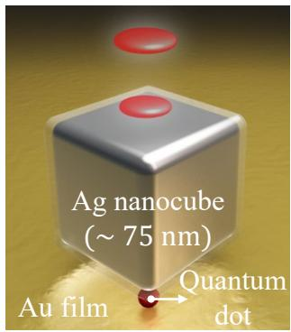

text_image

Ag nanocube
(~ 75 nm)
Au film
Quantum dot

(c)  
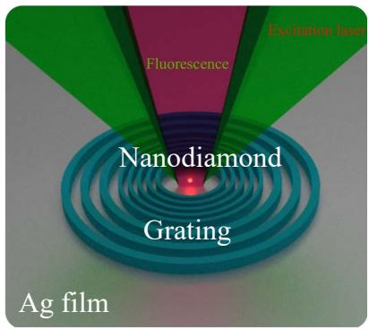

text_image

Fluorescence
Excitation laser
Nanodiamond
Grating
Ag film

(b)  
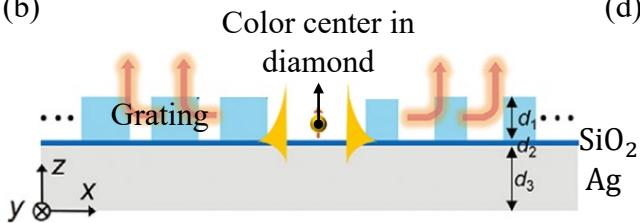

text_image

(b)
Color center in
diamond
Grating
...
d₁
d₂
d₃
SiO₂
Ag
z
y
x
(d)

(d)

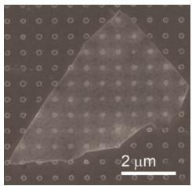

natural_image

Microscopic view of a textured surface with circular indentations and a 2 μm scale bar (no text or symbols beyond scale indicator)

Applications of metasurfaces in enhancing the brightness of single-photon sources. (a) Schematic of the single-photon source utilizing a single metallic nanocavity to enhance the photon emission rate from the quantum dot. (b) xOz cross-section of an SPP-based single-photon source system. (c) Schematic of a single-photon source integrated with a bullseye grating. (d) SEM of a hexagonal boron nitride flake positioned atop an Ag nanoparticle array on silica. (a) Adapted from $[603]$ under a Creative Commons license. (b) Adapted from $[604]$ under a Creative Commons license. (c) Adapted with permission from Kumar et al., J. Chem. Phys. 154, 044303 (2021) $[605]$ . Copyright © 2021 American Institute of Physics. (d) Adapted with permission from Tran et al., Nano Lett. 17, 2634–2639 (2017) $[606]$ . Copyright © 2017 American Chemical Society.

density of optical states, its photon emission rate can be significantly enhanced. Leveraging the Purcell effect $[602]$ , this enhancement can be achieved by integrating the emitter into an optical cavity with a high Q-factor or a small mode volume V, where the excited-state lifetime of the quantum system is modified by a Purcell factor proportional to Q/V. Therefore, by engineering the Purcell factor of the cavity integrated with the emitter, the photon emission rate can be effectively improved.

(I) A classic approach involves utilizing a single plasmonic metal nanocavity, as illustrated in Fig. 48(a). The extremely small mode volume of the nanocavity significantly reduces the emitter's lifetime, enhancing the average emission intensity of the single-photon source by up to 1900 times compared to its original value $[603]$ . At the same time, due to the relatively low Q-factor, the nanocavity supports a broadband mode, which alleviates the stringent spectral matching requirement between the emission spectrum of the photon emitter and the resonance spectrum of the cavity—a common challenge in nanofabrication. However, a major drawback of this approach is the loss induced by metal absorption. This issue can be mitigated by adopting MIM structures or improving the metallic materials used $[607]$ .  
(II) By leveraging the resonance effects of metasurfaces, as detailed in Section 2, the integration of metasurfaces with single-photon emitters can significantly enhance the photon emission rate.

(i) Enhancing the photon emission rate of single-photon sources through SPPs along the metal/air interface. When a single-photon source is placed near a metal surface, the emitted photons excite SPPs that propagate along the metal/air interface. Since these surface waves do not radiate into the far field, additional structures, such as gratings or metasurfaces, must be introduced on the metal surface, as illustrated in Fig. 48(b), to convert the nonradiative surface waves into radiative waves for efficient photon collection $[604,605,608–614]$ . In 2021, as shown in Fig. 48(c), Bozhevolnyi's group $[605]$ integrated single germanium-vacancy (GeV) centers in nanodiamonds with a hydrogen silsesquioxane (HSQ) bullseye grating. By optimizing the grating parameters, they enhanced the radiative decay rate by approximately 5.5 times compared to the case without the grating. Moreover, the emission properties of the photons can be tailored through the careful design of the grating structure, which will be discussed in detail later.

(ii) Enhancing the photon emission rate of single-photon sources via plasmonic resonances in the meta-atom array. In 2017, Tran et al. [606] coupled photon emitters in hexagonal boron nitride (hBN) flakes to an Ag nanoparticle array, as illustrated in Fig. 48(d). By tuning the structural parameters, they matched the resonance spectrum of the Ag nanoparticle array with the emission spectrum of the quantum emitter (560–700 nm). This coupling reduced the emitter's lifetime from 8.5 ns to 0.27 ns and enhanced the emission intensity by approximately a factor of two.

Modulating the polarization, direction, and angular momentum of single-photon sources via metasurfaces. Metasurfaces offer unparalleled advantages in optical field manipulation. By integrating metasurfaces with single-photon sources, it is possible to efficiently and flexibly control various properties of emitted photons, including polarization, propagation direction, and OAM. In this field, Bozhevolnyi's group has conducted a significant body of pioneering work $[604,608–614]$ , while contributions have also been made through the collaboration between Chen's and Li's groups $[615,616]$ . We now systematically present the underlying principles of the aforementioned works, from simpler to more complex mechanisms.

(I) System prototype of variants discussed later. The system we consider, in which a single-photon source is integrated with a metasurface, is illustrated in Fig. 48(b). The centrally positioned single-photon source (e.g., a quantum dot) can be approximated as an electric dipole oriented perpendicular to the surface. Its spontaneous emission excites cylindrically diverging SPPs. When these SPPs interact with a bullseye grating, as shown in Fig. 48(c), the surface waves are converted into radiative propagation waves. The emission angle $\theta$ relative to the surface normal is determined from the grating equation

$$
k _ {0} \sin \theta = k _ {\mathrm{SPP}} + M \frac {2 \pi}{\Lambda}, \tag {312}
$$

where $k_{0}$ is the free space wavevector, $k_{SPP} = 2\pi / \lambda_{SPP}$ is the wavevector of the SPPs, $\lambda_{SPP}$ is the effective wavelength of the SPPs, M is the diffraction order, and $\Lambda$ is the grating period. When the grating period satisfies the Bragg resonance condition

$$
\Lambda = N \frac {\lambda_ {\mathrm{SPP}}}{2}, \quad N = 2, 3, 4, \dots , \tag {313}
$$

the resonance enhances the Purcell factor, leading to a higher photon emission rate. Additionally, the enhanced local field facilitates the collection of scattered photons, thereby improving the overall efficiency of the single-photon source. In this case, the emitted photons exhibit radial polarization, as illustrated in Fig. 49(a), with the experimentally observed far-field intensity distribution shown in the inset of Fig. 49(a) [609].

Figure 49  
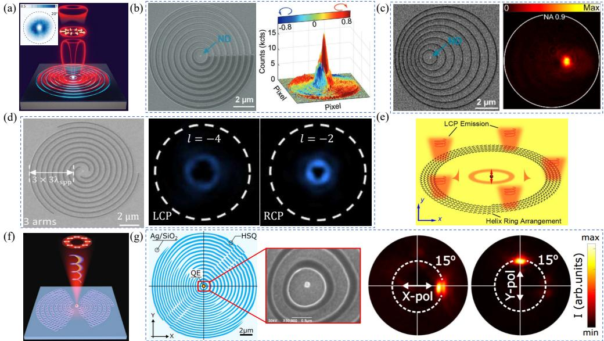

Applications of metasurfaces in modulating single-photon sources in polarization, direction, and angular momentum. (a) Schematic of a bullseye grating for generating radially polarized single photons. Inset: experimental far-field intensity distribution of emitted single-photon superposition beams. (b) Left: SEM of a grating for producing RCP single photons. ND, nanodiamond. Right: experimental far-field intensity and polarization distributions of emitted single-photon beams, where height represents intensity and color indicates polarization states. (c) Left: SEM of a directional single-photon-generating grating. Right: experimental far-field intensity distribution of emitted single-photon beams. (d) Left: SEM of a grating for generating single photons with defined spin and orbital angular momentum. Right: experimental intensity distributions of LCP and RCP components in emitted single-photon beams. (e) Schematic of the metasurface for generating single photons with specific circular polarization states. (f) Metasurface design for generating single photons carrying defined OAM and linear polarization states. (g) Left: schematic and SEM of the metasurface enabling directional emission of polarization-controlled single photons. Right: experimental far-field intensity distributions of x- and y-polarized components in emitted single-photon beams. (a) Adapted with permission from Komisar et al., ACS Photonics 8, 2190–2196 (2021) [609]. Copyright © 2021 American Chemical Society. (b) Adapted from [604] under a Creative Commons license. (c) Adapted with permission from Kan et al., ACS Photonics 7, 1111–1116 (2020) [608]. Copyright © 2020 American Chemical Society. (d) Adapted from [610] under a Creative Commons license. (e) Reprinted with permission from Xue et al., Laser Photonics Rev. 16, 2200179 (2022) [615]. Copyright © 2022 WILEY-VCH Verlag GmbH & Co. KGaA, Weinheim. (f) Reprinted [614] under a Creative Commons license. (g) Adapted from [613] under a Creative Commons license.

(II) Building upon the previous design, as illustrated in the left panel of Fig. 49(b), the width of each concentric ring in the bullseye grating is modified from a fixed value to a gradual increase from 110 nm to 407 nm as a function of the azimuthal angle. This gradual variation induces a continuous phase shift in the scattered optical field, ranging from 0 to $2\pi$ . At any two points on the ring separated by an azimuthal angle of $\pi/2$ , the scattered electric fields not only have orthogonal polarization directions but also exhibit a phase difference of $\pi/2$ . As a result, their superposition in the far field leads

to the generation of circularly polarized photons. The experimentally observed far-field intensity and polarization distributions are shown in the right panel of Fig. 49(b) [604].

(III) Still based on the design in (I), as illustrated in the left panel of Fig. 49(c), the grating constants on the x < 0 and x > 0 sides of the bullseye grating are set to $\Lambda_{-}$ and $\Lambda_{+}$ , respectively, satisfying

$$
\frac {2 \pi}{\Lambda_ {-}} = k _ {\mathrm{SPP}} + k _ {0} \sin \tilde {\theta}, \quad \frac {2 \pi}{\Lambda_ {+}} = k _ {\mathrm{SPP}} - k _ {0} \sin \tilde {\theta}. \tag {314}
$$

Substituting these expressions into the grating equation (noting that $k_{SPP}$ should be taken as negative in the x < 0 region), we find that the first-order diffracted light on the x < 0 side and the negative first-order diffracted light on the x > 0 side (both being the only diffracted orders satisfying $k_{0} \sin \theta < k_{0}$ that can radiate outward) share the same diffraction angle $\tilde{\theta}$ . This design enables directional control of single-photon emission, with the observed effect shown in the right panel of Fig. 49(c) [608].

(IV) Still based on the design in (I), the bullseye grating is modified into a superposition of m helical gratings, as illustrated in the left panel of Fig. 49(d) (where m = -3, with the negative sign indicating a counterclockwise helicity). In this configuration, the far-field polarization state of the emitted single photon can be expressed as an entangled state of LCP and RCP photons with different orbital angular momenta. Specifically, the topological charges of the LCP and RCP photons are m - 1 and $m + 1$ , respectively. The observed effect is shown in the right panel of Fig. 49(d) [610].

(V) Still based on the design in (I), as illustrated in Fig. 49(e), the concentric ring structure is replaced with an array of meta-atoms arranged in a circular pattern. These meta-atoms are deliberately designed to exhibit chiral responses, enabling the conversion of SPPs into freely propagating photons with a specific circular polarization state. This design achieves a polarization control similar to that of (II). However, a key advantage is its greater tolerance to lateral displacement of the single-photon source relative to the center, making it more robust for practical implementations $[615]$ .

(VI) By combining the designs of (III) and (V), meta-atoms with specific chiral responses are arranged along the trajectory of the grating structure in (III). This configuration enables the generation of photons with specific OAM in a designated direction [616].

(VII) By integrating the concepts of (IV) and (V), meta-atoms with specific chiral responses are arranged in a helical pattern, facilitating the generation of photons with tailored spin and orbital angular momentum $[612]$ . Furthermore, as illustrated in Fig. 49(f), when the meta-atoms are designed to convert SPPs within a specific azimuthal range into freely propagating photons with a well-defined linear polarization state, it is also possible to generate linearly polarized photons with specific OAM $[614]$ .

(VIII) Utilizing the scattering holography method developed by Bozhevolnyi's group [611,613], more sophisticated metasurfaces can be designed to generate single photons with specific polarization characteristics propagating in predefined directions. For example, a metasurface designed using this approach [illustrated in the left panel of Fig. 49(g)] can spatially separate single photons with $x$ - and $y$ -linear polarizations in two predefined directions in the far field, as demonstrated in the right panel of Fig. 49(g) [613].

For single-photon sources that do not rely on SPPs, metasurfaces can still be directly used to manipulate various properties of emitted photons. In 2019, Huang et al. [617] employed a propagation-phase-based metalens as an immersion lens to collect and collimate photons emitted by a single-photon source, achieving an NA exceeding 1. In

2020, Bao et al. [618] utilized a geometric-phase metasurface to deflect photons with different circular polarization states into distinct directions. More recently, in 2023, Li et al. [619] designed meta-atoms based on propagation phase to cover complete phase modulation for orthogonal linearly polarized light. This enabled polarization-multiplexed metasurfaces capable of deflecting single photons with different linear polarization states into different directions while simultaneously imparting distinct OAM. It is important to note that in certain cases, single-photon sources must be approximated as point dipole sources. Therefore, metasurface designs need to account for additional considerations beyond those required for plane-wave illumination [618].

# 6.1.2. Two-Photon Source Based on Nonlinear Metasurfaces

Spontaneous parametric down-conversion (SPDC) is one of the most widely used nonlinear optical techniques for generating entangled and correlated photon-pairs. When an intense pump laser photon of frequency $\omega_{p}$ interacts with the nonlinear crystal such as KDP or lithium niobate ( $LiNbO_{3}$ ), the high-energy pump photon is converted into a pair of low-energy photons with frequencies $\omega_{s}$ (signal photon) and $\omega_{i}$ (idler photon). This process must satisfy energy conservation

$$
\omega_ {\mathrm{p}} = \omega_ {\mathrm{s}} + \omega_ {\mathrm{i}}, \tag {315}
$$

and momentum conservation (phase-matching condition)

$$
\vec {k} _ {\mathrm{p}} = \vec {k} _ {\mathrm{s}} + \vec {k} _ {\mathrm{i}}, \tag {316}
$$

where $\vec{k}_{p}$ , $\vec{k}_{s}$ , and $\vec{k}_{i}$ represent the wavevectors of the pump photon, signal photon, and idler photon, respectively. We note that it is essential to satisfy the phase-matching condition to ensure both high conversion efficiency and the desired properties of the generated photons, such as polarization. When $\omega_{s} = \omega_{i}$ , the SPDC is referred to as degenerate.

Conventional SPDC implementations typically employ bulky centimeter-scale crystals, which present two main limitations: (i) relatively low photon-pair rates and (ii) considerable difficulty in aligning multiple optical components following the SPDC crystal. The advent of nonlinear metasurfaces $[254–257]$ has created novel opportunities for realizing miniaturized, easily integrated, and high-performance two-photon sources. Benefiting from subwavelength thickness, metasurfaces relax the longitudinal phase-matching condition in SPDC processes $[620]$ , enabling diverse emission configurations including simultaneous forward emission, simultaneous backward emission, or a combination of both directions $[621,622]$ —a feature unattainable in conventional SPDC systems. According to the generalized laws of refraction and reflection [Eqs. (59) and (60)], the arrangement of meta-atoms also permits the relaxation of the transverse momentum conservation condition. Furthermore, by utilizing the high-Q-factor resonant modes, metasurfaces can enhance the nonlinear effects by several orders of magnitude at the resonance wavelength $[256]$ , supporting higher photon-pair rates than precedents of enhanced SPDC using individual nanoantennas $[623]$ . Additionally, the light field manipulation capabilities of metasurfaces enable flexible and efficient control over various dimensions of the generated two photons, such as direction and polarization.

In 2021, Santiago-Cruz et al. [624] modulate the frequency of the Mie resonance in a homogeneous lithium niobate metasurface to half the pump light frequency, which enhanced the degenerate SPDC significantly. Experimentally, the metasurface composed of truncated pyramid meta-atoms with a height of $680\mathrm{nm}$ achieved a two-order-of-magnitude increase in the photon-pair rate compared to an unpatterned thin film of the same material and thickness. Following this, researchers further investigated the

application of various nonlinear metasurfaces in two-photon sources through theoretical analysis and numerical simulations $[625–627]$ . Notably, simulations demonstrated that resonant modes with ultra-high Q-factors, such as quasi-BICs, could potentially enhance the photon-pair rate by up to five orders of magnitude relative to unpatterned thin films under identical conditions $[625]$ .

In 2022, utilizing a guided-mode resonance metasurface, the Sukhorukov's group $[628]$ significantly increased the photon-pair rate by 450 times compared to an unpatterned thin film under the same conditions. As shown in Fig. 50(a), the two-photon source consists of a 304 nm thick lithium niobate film on a silica substrate, with a silica grating layer on top. The relationship between eigenfrequencies of grating resonant modes and the transverse wavevector $k_{y}$ at $k_{z}=0$ is shown in Fig. 50(b). The guided-mode resonance (Mode 2) was utilized, where half of the pump photon frequency falls within the resonance frequency range of this mode. In this case, the signal and idler photons generated symmetrically naturally satisfy energy and transverse momentum conservation. As shown in Fig. 50(b), the $k_{y}$ values of the signal and idler photons can be adjusted by fine-tuning the pump photon frequency within the resonance range of the guided mode resonance, enabling a certain extent of manipulation over the emission angles of the photon-pairs $[622]$ . This feature can be utilized in the SPDC-based ghost imaging system to realize scanning imaging, which allows the use of a 1D detector to capture 2D images $[630]$ . Further simulation analysis for this system showed that the spatial entanglement of the two photons can be adjusted by the wavelength and beam size of the pump laser $[631]$ . In 2023, the research group further demonstrated experimentally that the polarization state of the emitted photon-pairs can be manipulated by changing the groove direction of the grating $[632]$ .

In 2022, almost simultaneously with the Sukhorukov's group [628], Santiago-Cruz et al. [629] utilized the quasi-BIC metasurface to enhance the photon-pair rate by three orders of magnitude compared to an unpatterned thin film under identical conditions. The metasurface structure is shown in Fig. 50(c), with meta-atoms made of GaAs, one of the traditional materials with the highest second-order susceptibilities. As shown in Fig. 50(d), the meta-atom is designed with the symmetry-breaking structure, which transforms the symmetry-protected BIC into quasi-BIC, achieving a sufficiently high Q-factor. For three metasurfaces based on the same structure but with different meta-atom sizes and lattice constants, the experimental transmission spectra and SPDC spectra are shown in Fig. 50(e). (I) For the first metasurface (left panel), the pump photon frequency is exactly twice the resonance frequency of the quasi-BIC, resulting in the degenerate SPDC, with both the signal and idler photon frequencies matching the resonance frequency of the quasi-BIC. (II) For the second metasurface (middle panel), the pump photon frequency is slightly offset from twice the resonance frequency of the quasi-BIC, leading to the signal photon frequency matching the quasi-BIC resonance frequency, while the idler photon frequency is determined by the energy conservation condition. (III) For the third metasurface (right panel), by choosing the appropriate polarization state of the pump light, two quasi-BICs within the metasurface can be excited, leading to the emission of two sets of photon-pairs, where the frequency of the signal photon in each set is the resonance frequency of a certain quasi-BIC, and the frequency of the idler photon is given by the energy conservation condition. In 2023, Son et al. [621] reproduced the above scenario (II) based on a GaP metasurface shown in Fig. 50(f), increasing the photon-pair rate by a factor of 67 compared to an unpatterned thin film under the same conditions.

# 6.1.3. Quantum Interference

Optical quantum interference, particularly two-photon interference, is a quantum phenomenon without a classical analogue, which plays an irreplaceable role in fields such

Figure 50  
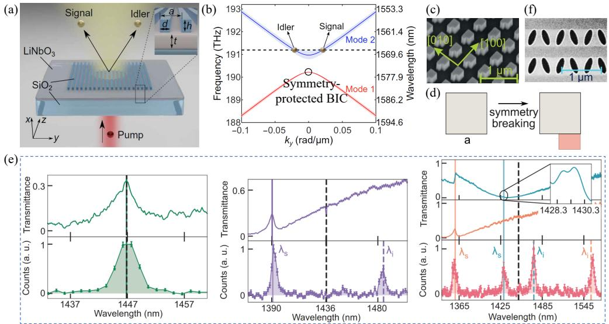

Nonlinear metasurface-based two-photon sources. (a) Schematic of a silica-grating-patterned lithium niobate thin film for generating spatially entangled signal and idler photons under continuous-wave laser pumping. (b) Relationship between resonance frequencies and transverse wavenumber $k_{y}$ when $k_{z}=0$ for the grating in (a). Shaded regions indicate resonant bandwidths. (c) SEM of a BIC metasurface. (d) Structural schematic of the symmetry-broken meta-atom for the metasurface in (c). (e) Experimental transmission spectra (top) and SPDC spectra (bottom) for three metasurfaces with identical geometries but varying meta-atom dimensions and lattice constants. Black dashed lines mark the position corresponding to twice the pump wavelength for the degenerate SPDC. Colored vertical lines indicate quasi-BIC resonance wavelengths. (f) SEM of an alternative BIC metasurface architecture. (a) and (b) Adapted from [628] under a Creative Commons license. (c), (d), and (e) Adapted with permission from Santiago-Cruz et al., Science 377, 991–995 (2022) [629]. Copyright © 2022 American Association for the Advancement of Science. (f) Adapted from [621] under a Creative Commons license.

as quantum information and quantum imaging [633]. Traditionally, the beam splitter is the core element for achieving two-photon interference. When two photons, completely indistinguishable to the detector, simultaneously enter the two input ports of a 50:50 beam splitter, quantum interference results in the photon-pairs emerging only from the same output port, leading to a significant reduction in coincidence counts, known as the Hong–Ou–Mandel (HOM) effect. Essentially, such a bunching effect arises from the bosonic nature of photons.

For a traditional 50:50 beam splitter, the phase difference $\phi_{\mathrm{rt}}$ between the reflected and transmitted light is inherently $\pi /2$ . By allowing the adjustment of $\phi_{\mathrm{rt}}$ , the result of two-photon interference can overcome the limitations of the bunching effect. In 2021, Zhang's group [634] proposed replacing the traditional beam splitter with a metasurface, as shown in Fig. 51(a), to enable free adjustment of $\phi_{\mathrm{rt}}$ . The metasurface was deliberately designed with a vertically symmetric structure to satisfy the requirement of reciprocity. Through structural parameter optimization, it was achieved that when the metasurface is rotated around the $z$ -axis by an angle $\theta$ of 0 or $\pi /2$ , the phase difference $\phi_{\mathrm{rt}}$ for specific linearly polarized incident light also becomes 0 or $\pi /2$ , while maintaining equal amplitude values for both the transmission and reflection coefficients. As shown in Fig. 51(b), when $\theta = 0$ , two-photon interference exhibits

Figure 51  
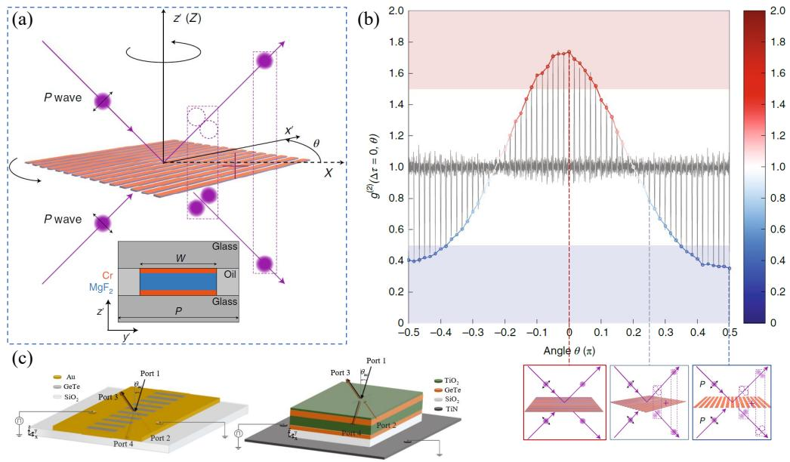

Metasurface applications in quantum interference. (a) Schematic of continuous control over two-photon interference from bunching to anti-bunching via metasurface rotation. (b) Experimentally measured second-order correlation function as a function of metasurface rotation angle. Inset: schematics of two-photon interference phenomena at rotation angles of 0, $\pi/4$ , and $\pi/2$ (left to right). (c) Structural schematics of two phase-change-material-based metasurfaces for two-photon interference manipulation. (a) and (b) Adapted with permission from Li et al., Nat. Photonics 15, 267–271 (2021) [634]. Copyright © 2021 Springer Nature. (c) Reprinted with permission from Estakhri et al., Opt. Express 29, 14245–14259 (2021) [635]. Copyright © 2021 Optica Publishing Group.

an anti-bunching effect (fermion-like); when $\theta = \pi/2$ , the interference shows a bunching effect similar to the traditional beam splitter (boson-like); and when $0 < \theta < \pi/2$ , the interference exhibits a middle state (anyon-like). Such metasurface beam splitters with the phase modulation function can also find applications in quantum computing [636]. Following similar ideas, in 2021, Estakhri and Norris [635] proposed two types of active metasurface designs based on the phase-change material GeTe [as shown in Fig. 51(c)] to control the switching between bunching and anti-bunching in two-photon interference, supported by simulation verification.

# 6.1.4. Quantum Entanglement

A landmark application of metasurfaces in quantum entanglement was made by Stav et al. in 2018 [637]. The generation of vortex beams (for example, with a topological charge of $\Delta l$ ) using geometric phase metasurfaces is a well-established topic in the metasurface field. For classical light with a linear polarization state, the outgoing light can be decomposed into orthogonal circular polarization components, each with a topological charge of $\pm \Delta l$ . However, the situation becomes much more interesting when considering non-classical light. A single photon with an OAM of 0 and horizontal polarization can be represented as a superposition of the $|L\rangle$ and $|R\rangle$ spins, i.e.,

$$
| H \rangle | l = 0 \rangle = \frac {1}{\sqrt {2}} \left(| L \rangle + | R \rangle\right) | l = 0 \rangle . \tag {317}
$$

Figure 52  
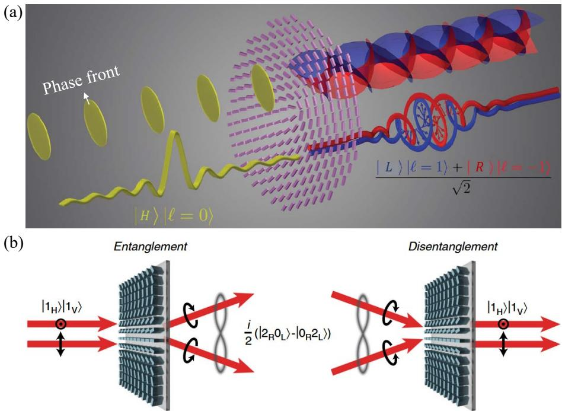

Metasurface applications in quantum entanglement. (a) Schematic of a geometric phase metasurface establishing spin-orbit entanglement for a single photon. (b) Design concept of a geometric phase metagrating enabling controlled entanglement generation and disentanglement of two-photon states. (a) Adapted with permission from Stav et al., Science 361, 1101–1104 (2018) [637]. Copyright © 2018 American Association for the Advancement of Science. (b) Reprinted from [638] under a Creative Commons license.

As shown in Fig. 52(a), after interaction with the metasurface, the photon state becomes

$$
\frac {1}{\sqrt {2}} \left(| L \rangle | l = \Delta l > + | R \rangle | l = - \Delta l \rangle\right). \tag {318}
$$

It is noteworthy that the single photon is now in a Bell state, with its spin entangled with the OAM. By changing the incident light to vertical polarization $|V\rangle$ and flipping the metasurface, three other Bell states can be generated. Further experiments demonstrated that the metasurface does not destroy the coherence of the wave function and allows for the generation of spin-OAM entanglement with high fidelity.

In 2019, Georgi et al. [638] used the interaction of single-photon pairs with orthogonal linear polarization states and a geometric phase metagrating to generate path-entangled two-photon N00N states. As shown in the left part of Fig. 52(b), when the single-photon pairs with orthogonal linear polarization states interact with the grating, they are decomposed into circularly polarized components propagating along different paths. This occurs because the geometric phase causes phase gradients of opposite sign for LCP and RCP light. Since the quantum state of the incident photon-pair is represented as a two-photon N00N state in the circular basis, the two photons always select the same output channel, leading to the spatial entanglement. The further experiment achieved a HOM interference visibility of $86 \pm 4\%$ . As shown in the right part of Fig. 52(b), if this process is reversed, the spatially entangled N00N state will return to its initial orthogonal polarization state after undergoing quantum interference on

the metasurface, thereby achieving spatial disentanglement of the photon-pair. Introducing a phase delay between the two incident circular polarization channels allows for further control over the degree of entanglement in the output state, a feature with promising applications in quantum sensing.

Other applications of metasurfaces in quantum entanglement will be discussed in Subsection 6.2.

# 6.2. Indirect Applications of Metasurfaces in Quantum Photonics

Multi-photon source based on the metalens array. Traditional SPDC-based multiphoton sources require multiple nonlinear crystals and long-term stable, complex optical setups. In 2020, Li et al. [639] realized a compact, stable, and controllable 100-channel SPDC photon-pair source by integrating a 0.5 mm thick type-II $\beta$ -barium borate (BBO) crystal at the focal length of a $10 \times 10$ metalens array. All the metalenses were identical and operated at a pump wavelength of 404 nm. As shown in Fig. 53(a), when the pump light is incident on the metalens array, a $10 \times 10$ focal array is formed inside the BBO crystal. Each focal point can trigger the generation of a photon pair through SPDC in the crystal with a certain probability, ultimately creating a 100-dimensional path-encoded quantum entangled state.

Cold atom generation based on the metasurface hologram. As one of the techniques for atomic cooling and trapping, the standard magneto-optical trap (MOT) typically uses three pairs of orthogonal, counter-propagating laser beams with appropriate circular polarization. When implemented with traditional optics, a large number of optical components are required to achieve functions such as laser beam transmission and polarization conversion, which detracts from the system's compactness and stability. In 2020, Zhu et al. [640] significantly simplified the system by using a metasurface hologram. As shown in Fig. 53(b), the geometric phase metasurface hologram diffracts a single LCP light beam into five RCP light beams. After being reflected by mirrors, these beams overlap in the center with the polarization states required by the MOT. The atoms are trapped near the zero point of the quadrupole magnetic field in the region where the beams overlap. Experimentally, they achieved the capture of approximately $10^{7}$ atoms at a temperature of about $35\mu \mathrm{K}$ .

Quantum computing. In 2024, Hu et al. [649] used orthogonal linear polarization states as the ground states $|0\rangle$ and $|1\rangle$ and employed the polarization-multiplexed metasurface to implement four quantum logic gates (Pauli-X, Pauli-Y, Pauli-Z, and Hadamard gates) for the superposition state $\alpha |0\rangle +\beta |1\rangle$ , where $\alpha ,\beta \in \mathbb{R}$ . The target phase distributions required for the metasurface to realize these operations were optimized with deep learning. In the same year, Tanuwijaya et al. [650] used the complex amplitude modulation metasurface described in Subsection 5.1.2 [Method (II)] for a quantum computing system, successfully implementing Grover's search algorithm and quantum Fourier transform.

Quantum entanglement. In 2018, Jha et al. [651] demonstrated through simulations that the optical deflection effect of metasurfaces could induce quantum entanglement between atomic qubits of two atoms separated by a macroscopic distance. In 2022, Zhang et al. [641] combined a nonlinear metasurface with a photoisomerizable azo layer to achieve dynamic control of the transmission and phase of orthogonal linearly polarized light by optically switching the azo molecules between their binary isomeric states. This was applied to the distillation of quantum entanglement, as shown in Fig. 53(c). In the same year, Gao et al. [642] employed a propagating phase meta-grating to achieve multi-channel distribution and entanglement state transformation of photon-pairs, as shown in Fig. 53(d). Also in 2022, Li et al. [652] encoded path

Figure 53  
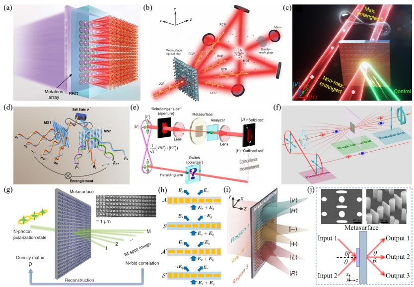

Indirect applications of metasurfaces in quantum photonics. (a) Schematic of a metal-ens array-based multiphoton source. (b) Design concept of a metasurface hologram-integrated cold atom generation system. (c) Schematic illustrating dynamic control of entangled quantum states via a nonlinear metasurface. (d) Metagrating configuration for quantum entanglement distribution and transformation. (e) Principle schematic of edge detection mode switching in polarization-entangled photon source-based imaging systems. (f) Quantum weak measurement protocol for phase reconstruction of pure-phase objects. (g) Polarization-multiplexed metasurface enabling multiphoton quantum state reconstruction. Top-right: SEM of the fabricated Si metasurface. (h) Schematic of metasurface-enabled field manipulation for polarization Bell state measurement. (i) Schematic of the metasurface for implementing positive operator-valued measures. $|\pm\rangle = (|H\rangle \pm |V\rangle) / \sqrt{2}$ (j) Top: SEMs of fabricated metasurface in top-view and tilted-view configurations. Bottom: two-input/three-output metagrating design. $\theta = \arcsin \lambda / a_x$ (the key to achieving the two-input/three-output functionality), where $\lambda$ denotes the operational wavelength and $a_x$ represents the metasurface period along the $x$ -direction. (a) Reprinted with permission from Li et al., Science 368, 1487–1490 (2020) [639]. Copyright © 2020 American Association for the Advancement of Science. (b) Reprinted from [640] under a Creative Commons license. (c) Reprinted from [641] under a Creative Commons license. (d) Reprinted with permission from Gao et al., Phys. Rev. Lett. 129, 023601 (2022) [642]. Copyright © 2022 American Physical Society. (e) Reprinted from [643] under a Creative Commons license. (f) Reprinted with the permission from Liu et al., Phys. Rev. Lett. 132, 043601 (2024) [644]. Copyright © 2024 American Physical Society. (g) Reprinted with permission from Wang et al., Science 361, 1104–1108 (2018) [645]. Copyright © 2018 American Association for the Advancement of Science. (h) Reprinted from [646] under a Creative Commons license. (i) Reprinted from [647] under a Creative Commons license. (j) Adapted with permission from Zhang et al., Optica 11, 753–758 (2024) [648]. Copyright © 2024 Optica Publishing Group.

(direction of deflection) and OAM information onto one of the polarization-entangled photon-pairs (simultaneously LCP or RCP) by a geometric phase metasurface, which realized the phase distribution of the superposition of vortex light generation and beam deflection.

Quantum imaging. In 2020, Zhou et al. [643] demonstrated the dynamic switching between normal imaging and edge detection modes in an imaging system using a polarization-entangled photon source. As shown in Fig. 53(e), the quantum state of the entangled photon source is $\frac{1}{\sqrt{2}}\left(|H\rangle|H\rangle+|V\rangle|V\rangle\right)$ , and the edge detection system is effective only for vertically polarized light [653]. Therefore, by selecting the appropriate polarization state in the heralding arm, either normal imaging ( $|H\rangle$ ) or edge detection ( $|V\rangle$ ) can be performed. Using a similar approach, in 2024, Liu et al. [644] introduced a nonlocal weak measurement method, as shown in Fig. 53(f), into microscopic imaging, achieving higher image contrast at low quantum levels than standard methods.

Quantum state characterization. Traditional quantum state characterization devices suffer from several drawbacks, including large size, difficulty in integration, complex alignment procedures, limited functionality, and slow measurement speeds (multiple measurements are required to complete the characterization for some complex quantum states). The application of metasurfaces holds promise in overcoming these limitations. In 2018, Sukhorukov's group $[645]$ employed a metasurface to achieve stable and efficient reconstruction of the amplitude, phase, correlations, and entanglement of the polarization-encoded quantum state of the multiphoton, as shown in Fig. 53(g). By applying the hybrid phase modulation mechanism introduced in Subsection 2.1.5 $[169]$ , they designed a metagrating capable of deflecting any orthogonal polarization state in different directions. Using spatial multiplexing, they arranged M gratings corresponding to different orthogonal elliptical polarization states on the same metasurface. By directly measuring all possible N-photon correlations from the 2M output beams, the density matrix of the N-photon incident on the metasurface could be reconstructed when $2M \geq N + 3$ . Based on a similar approach, in 2023, Gao et al. $[646]$ replaced the polarization beam splitter in the Innsbruck Bell states measurement scheme with a polarization-multiplexed metasurface to achieve the polarization and phase control of the output light, as shown in Fig. 53(h). The further numerical simulations demonstrated that this system could perform the complete polarization Bell state measurement with only two measurements. In 2023, Wang et al. $[654]$ utilized a metasurface with orthogonal linear polarization state multiplexing to reconstruct the density matrix of the OAM quantum states of single-photons. In 2024, An et al. $[647]$ significantly reduced the complexity of positive operator-valued measures (POVMs) by using three polarization-multiplexed metagratings arranged side by side, as shown in Fig. 53(i). In 2024, Zhang et al. $[648]$ used topological optimization to design a metagrating [shown in Fig. 53(j)] as a multi-channel interferometer with two inputs and three outputs. This design enables the characterization of the indistinguishability of two photons across multiple degrees of freedom, including time, spectrum, spatial mode, and polarization, all with a single measurement.

# 7. METASURFACES FOR OPTICAL COMPUTING

Compared to electronics for computing, optical computing technology is expected to demonstrate significant advantages in computational speed and energy efficiency $[655]$ . Optical computing leverages the physical properties of light to encode, transmit, and process data, with a long-standing research history. Compared to traditional optics, metasurface-based optical computing offers many important advantages, including low loss, light weight, miniaturization, ease of integration, multifunctionality, and the ability to perform parallel operations $[656–662]$ . Currently, the application of metasurfaces in optical computing mainly focuses on mathematical operations on input optical fields, constructing mathematical equation solvers, and building optical neural networks, all of which we will introduce one by one in the following.

# 7.1. Mathematical Operations

# 7.1.1. Realizing the Transformation Function with Nonlocal Metasurfaces

In 2014, Engheta's group introduced the concept of metamaterial analog computing in their pioneering paper [663], demonstrating the feasibility of using metamaterials to perform mathematical operations such as spatial differentiation, integration, and convolution. The paper proposed two architectures to achieve this, one of which employs nonlocal metamaterials to realize the transfer function $\tilde{\mathbf{H}}\left(\vec{k}_T\right)$ (i.e., the Green function kernel), thereby directly manipulating the spatial frequency spectrum of the input wave. The concept of the transfer function has been introduced in Subsection 2.2.2. Different mathematical operations in real space correspond to different transfer functions. For instance, the transfer function of the first-order differentiation operation is given by

$$
\tilde {\mathbf {H}} \left(\vec {k} _ {\mathrm{T}}\right) = \left[ \begin{array}{l l} i C _ {x x} k _ {x} & i C _ {x y} k _ {y} \\ i C _ {y x} k _ {x} & i C _ {y y} k _ {y} \end{array} \right], \tag {319}
$$

where $C_{xx}$ , $C_{xy}$ , $C_{yx}$ , and $C_{yy}$ are constants characterizing polarization properties. The transfer function of the second-order differentiation operation is given by

$$
\tilde {\mathbf {H}} \left(\vec {k} _ {\mathrm{T}}\right) = \left[ \begin{array}{l l} C _ {x x} \left(k _ {x} ^ {2} + k _ {y} ^ {2}\right) & C _ {x y} \left(k _ {x} ^ {2} + k _ {y} ^ {2}\right) \\ C _ {y x} \left(k _ {x} ^ {2} + k _ {y} ^ {2}\right) & C _ {y y} \left(k _ {x} ^ {2} + k _ {y} ^ {2}\right) \end{array} \right]. \tag {320}
$$

For the integration operation, the transfer function is expressed as

$$
\tilde {\mathbf {H}} \left(\vec {k} _ {\mathrm{T}}\right) = \left[ \begin{array}{l l} C _ {x x} \frac {1}{i k _ {x}} & C _ {x y} \frac {1}{i k _ {y}} \\ C _ {y x} \frac {1}{i k _ {x}} & C _ {y y} \frac {1}{i k _ {y}} \end{array} \right]. \tag {321}
$$

To implement these transfer functions, the amplitude of the transmission or reflection coefficient of the metasurface must vary significantly with the incident angle. Consequently, it is necessary to leverage various resonance effects introduced in Section 2.

When implementing first-order differentiation or integration operations using a metasurface, it is necessary to break the mirror symmetry of the metasurface along both the x- and z-directions. Taking the 1D mathematical operation along the x-direction as an example, the transfer function $\tilde{H}(k_{x})$ differs by a negative sign (i.e., a phase difference of $\pi$ ) between $k_{x} < 0$ and $k_{x} > 0$ . This requires the transmission coefficient of the metasurface (assuming it operates in transmission mode) to be antisymmetric, i.e., $T(k_{x}) = -T(-k_{x})$ . If the metasurface only breaks mirror symmetry along the z-direction (i.e., a nonreciprocal metasurface), as shown in the top panel of Fig. 54(a), the mirror symmetry along the x-direction ensures that

$$
T _ {1 \rightarrow 4} = T _ {2 \rightarrow 3}, \tag {322}
$$

where $T_{M \to N}$ represents the transmission coefficient from direction $M$ to direction $N$ . This equation implies that $T(k_x) = T(-k_x)$ . If the metasurface only breaks mirror symmetry along the $x$ -direction, as shown in the bottom panel of Fig. 54(a), the mirror symmetry along the $z$ -direction leads to

$$
T _ {4 \rightarrow 1} = T _ {2 \rightarrow 3}. \tag {323}
$$

Additionally, due to reciprocity,

$$
T _ {1 \rightarrow 4} = T _ {4 \rightarrow 1}. \tag {324}
$$

From the above two equations, we again obtain

$$
T _ {1 \rightarrow 4} = T _ {2 \rightarrow 3}. \tag {325}
$$

Figure 54  
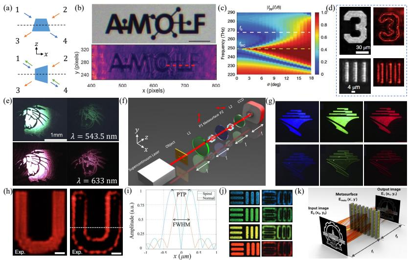

Mathematical operations based on metasurfaces. (a) Schematic of the meta-atom with mirror symmetry broken only in the z-direction (top) or only in the x-direction (bottom). (b) Top: original image. Bottom: experimental edge detection result using a metasurface for the second-order differentiation operation in the x-direction. (c) For p-polarization, the amplitude of the transmission coefficient as a function of the incident angle $\theta$ and frequency. $f_{0}$ is the operating frequency. $f_{BIC}$ is the BIC frequency. (d) Left: original images. Right: experimental edge detection results using a metasurface for the second-order differentiation operation. (e) Experimental edge detection results (right) on original images (left) under the illumination of different wavelengths achieved using a metasurface-based 4f system. (f) A 4f system for edge detection based on the geometric phase metasurface. CCD, charge-coupled camera; L, lens; P, polarizer. (g) Top: original images. Bottom: experimental edge detection results after performing first-order differential operation in the y-direction using the system in (f). From left to right, illumination wavelengths are 430 nm, 500 nm, and 670 nm, respectively. (h) Experimental edge detection result (right) on the original image (left) through convolution with the PSF of metalens. Scale bars: 10 $\mu$ m. (i) PSFs of a spiral metalens and a normal hyperbolic metalens. (j) Experimental edge detection results (right) on original images (left) using a geometric phase spiral metalens. From top to bottom, illumination wavelengths are 497 nm, 532 nm, 580 nm, and 633 nm, respectively (k) A 2f optical system with metasurface-enabled direct Fourier spectrum modulation. (b) Adapted from [664] under a Creative Commons license. (c) and (d) Adapted with permission from Zhou et al., Nat. Photonics 14, 316–323 (2020) [198]. Copyright © 2020 Springer Nature. (e) Adapted from [665] under a Creative Commons license. (f) and (g) Adapted from [653] under a Creative Commons license. (h) Adapted from [666] under a Creative Commons licensee. (i) and (j) Adapted from [667] under a Creative Commons license. (k) Reprinted from [668] under a Creative Commons license.

Thus, the metasurface must simultaneously break mirror symmetry along both the x- and z-directions to achieve $T_{1\to4} \neq T_{2\to3}$ , which makes it possible to realize $T(k_{x}) = -T(-k_{x})$ .

When implementing second-order differentiation along the x-direction, the transfer function $\tilde{H}(k_{x})$ remains the same for both $k_{x}<0$ and $k_{x}>0$ , meaning that the transmission coefficient of the metasurface must satisfy $T(k_{x})=T(-k_{x})$ . In this case, it is only necessary for the metasurface to maintain mirror symmetry along the x-direction.

In summary, implementing first-order differentiation or integration operations is more challenging than implementing second-order differentiation [197].

In practice, a metasurface can approximate a given transfer function for a specific mathematical operation only within a limited range of the incident angle, denoted as $\alpha \leq \alpha_{max}$ . This limitation can be described using the NA:

$$
\mathrm{NA} = n _ {\text {incident}} \sin \alpha_ {\max} = \frac {k _ {\mathrm{T} , \max}}{k _ {0}}, \tag {326}
$$

where $n_{incident}$ is the refractive index of the incident medium, and $k_{T,max}$ is the maximum transverse wavenumber. For a metasurface designed to perform differentiation operations for image edge detection, a higher NA corresponds to higher edge resolution.

In 2014, Engheta's group [663] numerically demonstrated that mathematical operations such as second-order differentiation and convolution can be achieved using the multilayer metamaterial slab that is laterally uniform but vertically inhomogeneous. The dielectric permittivity, magnetic permeability, and thickness of each layer of the metamaterial slab are optimized to realize specific transfer functions. From 2018 to 2021, researchers proposed various types of metasurface designs based on numerical simulations, leveraging resonant effects such as guided mode resonance and quasi-BIC to implement first-order differentiation [197,664,669] and second-order differentiation [197,199,669–671]. In 2019, Cordaro et al. [664] experimentally demonstrated second-order differentiation along the x-direction with an NA of 0.35 by tuning the operating frequency near the guided mode resonance of a metagrating, as shown in Fig. 54(b). In 2020, Zhou et al. [198] demonstrated a homogeneous metasurface composed of cylindrical Si meta-atoms to perform second-order differentiation. As illustrated in Fig. 54(c), this metasurface exhibited symmetry-protected BIC at normal incidence and a specific frequency $f_{BIC}$ . By selecting an operating frequency near $f_{BIC}$ , the metasurface can approximate the amplitude variation of the transmission coefficient required for second-order differentiation [Eq. (320)], within an NA of 0.32, while maintaining a nearly constant phase. The resulting edge detection performance for images is shown in Fig. 54(d). In 2021, Komar et al. [212] designed a homogeneous metasurface composed of cylindrical Si meta-atoms arranged in a hexagonal lattice. At the operating wavelength, the metasurface exhibited Mie resonance effects, enabling the experimental realization of polarization-insensitive second-order differentiation (although the NA varied for different polarizations).

Implementing a specific transfer function using a metasurface essentially involves complex amplitude modulation in momentum space (wavevector space) to realize mathematical operations in real space. Conversely, complex amplitude modulation in real space can also be used to perform mathematical operations in momentum space. In 2024, Deng et al. [672] experimentally demonstrated the differentiation operations in momentum space employing the amplitude modulation method introduced in Subsection 5.1.2 [Eq. (260)].

# 7.1.2. Metasurface-Based 4f Systems

Another architecture proposed in Engheta's paper [663] for implementing mathematical operations is the metasurface-enabled 4f system. This system consists of three cascaded subblocks: a Fourier transform subblock to obtain the frequency spectrum of the input wave (object), a metasurface to modulate the spectrum, and an inverse Fourier transform subblock to reconstruct the modulated spectrum into a real-space field distribution. In this case, only a conventional local metasurface is required to realize the transfer function $\tilde{\mathbf{H}}\left(\vec{k}_{\mathrm{T}}\right)$ for a given mathematical operation. This is because,

with the assistance of the Fourier transform and inverse Fourier transform subblocks, the metasurface needs only to perform complex amplitude modulation in real space to manipulate the frequency spectrum of the input wave. For example, in the case of first-order differentiation along the x-direction, the transfer function is given by

$$
\tilde {H} \left(k _ {x}\right) = i C _ {x x} k _ {x}. \tag {327}
$$

Due to the correspondence between the spatial position on the metasurface and the frequency spectrum, from Eq. (327), the transmission coefficient profile of the metasurface (assuming it operates in transmission mode) should satisfy

$$
T _ {x x} (x) = t _ {\max} \frac {x}{L _ {x} / 2}, \tag {328}
$$

where $t_{max}$ is the maximum amplitude transmission coefficient, $L_{x}$ is the metasurface size in the x-direction, and the coordinate origin is at the center of the metasurface. Here, we omit the constant phase factor $i = e^{i\pi/2}$ . Similarly, for second-order differentiation along the x-direction, according to Eq. (320), the transmission coefficient profile should satisfy

$$
T _ {x x} (x) = t _ {\max} \frac {x ^ {2}}{(L _ {x} / 2) ^ {2}}. \tag {329}
$$

For integration along the x-direction, based on Eq. (321), the transmission coefficient profile should satisfy

$$
T _ {x x} (x) = \left\{ \begin{array}{l l} t _ {\max}, & | x | \leq d, \\ t _ {\max} \frac {d}{x}, & | x | > d, \end{array} \right. \tag {330}
$$

where $d \ll L_{x}$ is introduced to prevent divergence in the transmission coefficient as $x \to 0$ .

Based on this approach, in 2015, Pors et al. [673] experimentally realized one-dimensional first-order differentiation and integration using MIM metasurfaces. In 2016 [674] and 2017 [675], Salehi's group numerically verified the mathematical operations of 4f systems based on the MIM metasurface and dielectric metasurface, respectively. In 2023, Tanriover et al. [665] used an annular metagrating with aluminum meta-atoms to achieve, within a certain bandwidth, a transmission coefficient profile matching Eq. (329) (with $x$ replaced by $r$ ). This second-order differentiation metasurface can be applied to image edge detection, as shown in Fig. 54(e).

7.1.3. First-Order Differentiation Operation Based on 4f System Modified by Polarization Optics In 2019, Zhou et al. [653] proposed a 4f system incorporating two orthogonal linear polarizers and a geometric phase metasurface, as shown in Fig. 54(f), to perform first-order differentiation for applications such as edge detection. After passing through the first lens and linear polarizer, the frequency spectrum of the incident optical field $E_{\mathrm{in}}(x,y)$ is modulated by the metasurface. The metasurface is designed based on the geometric phase, with a phase distribution given by

$$
\phi (x, y) = \sigma \frac {2 \pi x}{\Lambda}, \tag {331}
$$

where $\sigma=\pm1$ corresponds to LCP and RCP, respectively, and $\Lambda$ is the period over which the geometric phase varies by $2\pi$ along the x-direction. According to Fourier transform properties, a linear phase shift in the frequency domain corresponds to a spatial displacement in the real space. Since the metasurface introduces opposite phase shifts for the LCP and RCP components of the linearly polarized light, the LCP and RCP components of the output light undergo opposite displacements along the x-direction, given by $\pm\Delta=\pm\lambda f/\Lambda$ , where f is the focal length of the lens. After passing

through the second orthogonal linear polarizer, only the non-overlapping edge regions remain, leading to

$$
E _ {\mathrm{out}} (x, y) = E _ {\mathrm{in}} (x + \Delta , y) - E _ {\mathrm{in}} (x - \Delta , y) \approx 2 \Delta \frac {\mathrm{d} E _ {\mathrm{in}} (x , y)}{\mathrm{d} x}. \tag {332}
$$

Thus, the output field is approximately proportional to the first-order derivative of the input field along the x-direction. By rotating the metasurface, differentiation can be performed in different directions. The system also inherits broadband characteristics from the geometric phase. Experimental results for edge detection under different illumination wavelengths are shown in Fig. 54(g).

If the phase gradient of the metasurface extends beyond the x-direction to an arbitrary radial direction, described by

$$
\phi (x, y) = \sigma \frac {2 \pi r}{\Lambda} = \sigma \frac {2 \pi \sqrt {x ^ {2} + y ^ {2}}}{\Lambda}, \tag {333}
$$

the system can further achieve two-dimensional first-order differentiation [676].

# 7.1.4. Arbitrary Convolution Enabled by Metalenses

The imaging process can be regarded as the convolution of an object with the PSF of a lens, where the PSF acts as the convolution kernel. By tailoring the PSF through the deliberate design of a metalens, various convolution functions can be realized. Similarly, in a 4f system, applying complex amplitude modulation T to the spectrum of the incident optical field (object) is equivalent to convolving the input field with $F\{T\}$ , where $F\{T\}$ serves as the PSF [677].

In 2022, Fu et al. [666] experimentally demonstrated operations such as edge detection, spatial differentiation, and salt-and-pepper noise removal using bilayer metasurfaces. Even with a single-layer metasurface, edge detection can still be achieved, as shown in Fig. 54(h), although the FOV in this case is limited. In the same year, Kim et al. [667] proposed a helical metalens by superimposing a hyperbolic phase distribution in Eq. (168) and a vortex beam phase distribution in Eq. (298) with a topological charge of 1. The resulting PSF, illustrated in Fig. 54(i), enables helical phase-contrast imaging, which functions as edge detection, as shown in Fig. 54(j). In 2023, Zhang et al. [678] combined the helical lens phase with a beam deflection phase in one direction and the hyperbolic phase with a beam deflection phase in another direction, as given in Eq. (56). The resulting metalens supports simultaneous helical phase-contrast imaging and bright-field imaging in two distinct directions.

7.1.5. 2f Systems with Metasurface-Enabled Direct Spatial Frequency Response Modulation If additional complex amplitude modulation is applied to the metasurface beyond focusing, a 2f system, as shown in Fig. 54(k), can be used to achieve the spatial frequency response of a conventional 4f system. When the complex amplitude modulation of the metasurface satisfies

$$
E _ {\mathrm{meta}} \left(x ^ {\prime}, y ^ {\prime}\right) = e ^ {- i \frac {k}{2 f} \left(x ^ {\prime 2} + y ^ {\prime 2}\right)} E _ {\mathrm{H}} \left(x ^ {\prime}, y ^ {\prime}\right), \tag {334}
$$

where $1/f = 1/f_{1} + 1/f_{2}$ , the output optical field $E_{1}(x_{1}, y_{1})$ and the input optical field $E_{0}(x_{1}, y_{1})$ satisfies

$$
E _ {\mathrm{H}} \left(- x ^ {\prime}, - y ^ {\prime}\right) \frac {\mathcal {F} \left\{E _ {1} \left(x _ {1} , y _ {1}\right) \right\}}{\mathcal {F} \left\{E _ {0} \left(x _ {1} , y _ {1}\right) e ^ {i \frac {k f _ {1}}{2 f _ {2} ^ {2}} \left(x _ {1} ^ {2} + y _ {1} ^ {2}\right)} \right\}}, \tag {335}
$$

indicating that the term $E_{H}$ in the complex amplitude modulation of the metasurface effectively acts as the transfer function. Based on this principle, in 2022, Wang et al. [668] experimentally demonstrated first-order differentiation and cross-correlation operations in the microwave regime using a single-layer metasurface.

# 7.2. Equation Solving

# 7.2.1. Solving Differential Equations

The Fourier transform method is a commonly used approach for solving linear ordinary differential equations (ODEs), particularly those involving infinite domains or periodic boundary conditions. Interestingly, this method can be implemented optically to solve ODEs. Consider the following second-order ODE as an example:

$$
\frac {\mathrm{d} ^ {2} y}{\mathrm{d} x ^ {2}} - \zeta y (x) = f (x), \tag {336}
$$

where $f(x)$ is the input signal of the system, integrable over $(-\infty, +\infty)$ , $y(x)$ is the system's output signal as the solution of the equation, and the parameter $\zeta$ is an arbitrary constant. Applying the Fourier transform to this equation yields

$$
\tilde {y} (k) = \tilde {H} (k) \tilde {f} (k), \quad \tilde {H} (k) = \frac {1}{- k ^ {2} - \zeta}, \tag {337}
$$

where $\tilde{y}(k)=\mathcal{F}\{y(x)\}(k)$ and $\tilde{f}(k)=\mathcal{F}\{f(x)\}(k)$ . Thus, solving the original equation follows these steps:

(1) Compute the Fourier transform of the input signal $f(x)$ to obtain $\tilde{f}(k)$ .  
(2) Apply the modulation function $\tilde{H}(k)$ to $\tilde{f}(k)$ to obtain $\tilde{y}(k)$ .  
(3) Compute the inverse Fourier transform of $\tilde{y}(k)$ to obtain the solution $y(x)$ .

These steps correspond precisely to the 4f system, where $\tilde{H}(k)$ acts as the transfer function and can be implemented using a metasurface. Notably, when m=0, the transfer function corresponds to a one-dimensional double integration operator. In 2016, Zhang et al. [679] numerically verified the feasibility of this method for solving second- and fourth-order ODEs.

The above method can also be extended to certain other types of differential equations, such as the following integro-differential equation [675]:

$$
\zeta \frac {\mathrm{d} y}{\mathrm{d} x} + \eta y (x) + \kappa \int y (x) \mathrm{d} x = f (x), \tag {338}
$$

where $f(x)$ is the system's input signal, $y(x)$ is the system's output signal as the solution of the equation, and $\zeta, \eta,$ and $\kappa$ are arbitrary constants. Applying the Fourier transform to this equation, the transfer function is obtained as

$$
\tilde {H} (k) = \frac {i k}{\kappa + i \eta k - \zeta k ^ {2}}. \tag {339}
$$

# 7.2.2. Solving Integral Equations

The Fredholm integral equation of the second kind is an important class of integral equations in physics, engineering, and mathematics, expressed as

$$
g (u) = I _ {\mathrm{in}} (u) + \int_ {a} ^ {b} K (u, v) g (v) \mathrm{d} v, \tag {340}
$$

where $g(u)$ is the solution of the integral equation, given an arbitrary input function $I_{\mathrm{in}}(u)$ and a known kernel operator $K(u, v)$ .

Figure 55  
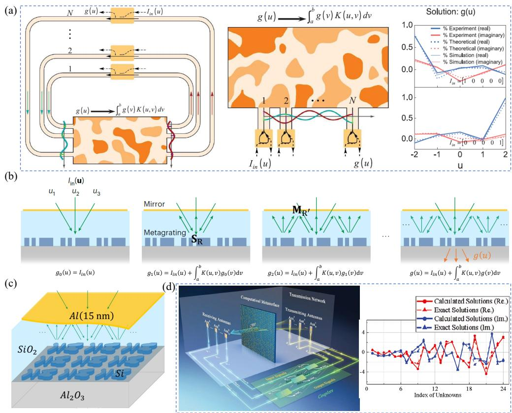

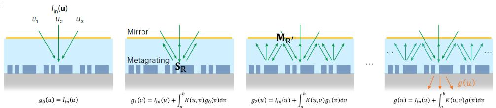

Mathematical equation solving based on metasurfaces. (a) Left and middle: schematics of two metamaterial systems for solving the Fredholm integral equation of the second kind with waves. Right: theoretical, simulation, and experimental results of the equation solutions of the integral equation corresponding to the two input signals (insets). (b) Schematic of the principle of a metagrating-based system for solving the Fredholm integral equation of the second kind with waves. (c) Schematic of the structure of the topology-optimized metagrating. (d) Left: schematic of the metasurface-based complex matrix equation solver. Right: comparison between the exact solution and the experimental solution of a complex matrix equation. (a) Adapted with permission from Estakhri et al., Science 363, 1333–1338 (2019) [680]. Copyright © 2019 American Association for the Advancement of Science. (b) and (c) Adapted with permission from Cordaro et al., Nat. Nanotechnol. 18, 365–372 (2023) [681]. Copyright © 2023 Springer Nature. (d) Adapted with permission from Yang et al., Adv. Funct. Mater. 34, 2310234 (2024) [682]. Copyright © 2023 WILEY-VCH Verlag GmbH & Co. KGaA, Weinheim.

A common technique for solving this equation is the Neumann successive approximation method, which starts with an initial solution $g_{0}(u) = I_{\mathrm{in}}(u)$ and iteratively updates it using

$$
g _ {i + 1} (u) = I _ {\mathrm{in}} (u) + \int_ {a} ^ {b} K (u, v) g _ {i} (v) \mathrm{d} v. \tag {341}
$$

As $n \to \infty$ , the sequence $g_{n}(u)$ converges to the solution $g(u)$ . In 2019 and 2023, Mohammadi et al. [680] and Andrea et al. [681] each proposed a metasurface-based system for the physical implementation of this iterative solving process.

(I) The system proposed by Mohammadi et al. in 2019 has two slightly different configurations, as illustrated in the left and middle panels of Fig. 55(a). The system samples both the metasurface's input $g(u)$ and its output $\int_{a}^{b} K(u, v) g(v) \, \mathrm{d}v$ at $N$ discrete points over the interval $[a, b]$ , and the scattering matrix corresponding to the discretized kernel operator $\mathbf{K}$ is realized by the topology-optimized metasurface. Through the waveguide channels (left panel) or reflection (middle panel), a recursive wave propagation feedback mechanism is established within the system to implement the iterative equation in Eq. (341). The discretized input function $I_{\mathrm{in}}(u)$ is coupled into the waveguides via the couplers embedded in the feedback loop, and a single optical wave propagation cycle within the loop corresponds to one iteration of Eq. (341). At steady state, the field distribution inside the system directly represents the solution $g(u)$ of the integral equation, which is then extracted through the couplers. Experimentally, the system shown in the middle panel of Fig. 55(a) was implemented in the microwave regime. The kernel operator used was

$$
K (u, v) = 0. 0 6 \left[ (4 - 4 i) J _ {0} (u v) + 3 e ^ {i \frac {2 \pi}{5} (u + v)} - (1 - 2 i) \right], \tag {342}
$$

where $J_0$ is the zeroth-order Bessel function of the first kind. Five samples are taken for the integration range $u \in [-2, 2]$ . The results of solving the equations for different inputs are shown in the right panel of Fig. 55(a), demonstrating strong agreement between experimental results and theoretical predictions.

(II) The system proposed by Andrea et al. in 2023 is shown in Fig. 55(b). The metagrating possesses N diffraction orders, corresponding to N discrete samples. The discretized kernel operator K is realized through the scattering matrix of a topology-optimized metasurface [specifically, $K = S_{R} M_{R'}$ , where the meanings of $S_{R}$ and $M_{R'}$ are illustrated in Fig. 55(b)]. Initially, incident light waves from different directions enter the system via a semi-transparent mirror, representing the input function $I_{\mathrm{in}}(u)$ . Upon the first reflection, the waves interact with the scattering matrix of the metagrating. The reflected light is then redirected by the semi-transparent mirror, completing one iteration. This process repeats as the reflected light re-enters the metagrating for subsequent iterations. In the steady state, the transmitted light in different directions corresponds to the discretized $g(u)$ , which represents the solution of the equation. The optimized metagrating structure is shown in Fig. 55(c), where a 15 nm Al film coated on the $SiO_{2}$ cladding layer functions as the semi-transparent mirror. Based on this configuration, the experimentally measured equation solutions exhibit good agreement with the ideal solutions.

# 7.2.3. Solving Complex Matrix Equations

In 2024, Yang et al. [682] proposed a complex matrix equation solver, as shown in the left panel of Fig. 55(d). The solver consists of a metasurface, N four-port couplers, and a 2N-port transmission network composed of N transmitting antennas and N receiving antennas. The complex matrix equation has the general form:

$$
\mathbf {K} \cdot \vec {x} + \vec {c} = \vec {0}, \tag {343}
$$

where $K \in C^{N \times N}$ , $\vec{c} \in C^{N \times 1}$ , and $\vec{x} \in C^{N \times 1}$ are the complex coefficient matrix, the constant vector, and the unknown vector, respectively. When the metasurface is designed such that the scattering matrix of the transmission network satisfies

$$
\mathbf {S} = \frac {1}{s _ {1 3} ^ {\mathrm{C}}} (\mathbf {K} + \mathbf {I}), \tag {344}
$$

and the input signal vector for the couplers is set as

$$
\vec {a} _ {\mathrm{in}} = [ a _ {\mathrm{in}, 1}, a _ {\mathrm{in}, 2}, \dots , a _ {\mathrm{in}, N} ] ^ {\top} = \frac {1}{s _ {1 2} ^ {\mathrm{C}}} \vec {c}, \tag {345}
$$

the solution to the equation can be obtained as

$$
\vec {x} = \frac {s _ {1 3} ^ {\mathrm{C}}}{s _ {4 3} ^ {\mathrm{C}}} (\vec {a} _ {\text {out}} - s _ {4 2} ^ {\mathrm{C}} \vec {a} _ {\text {in}}) + s _ {1 2} ^ {\mathrm{C}} \vec {a} _ {\text {in}}, \tag {346}
$$

where $\vec{a}_{out} = [a_{out,1}, a_{out,2}, \ldots, a_{out,N}]^{\top}$ represents the output signal vector of the couplers, and $s_{ij}^{C}$ denotes the $(i,j)$ element of the scattering matrix of the four-port coupler. Experimentally, this solver was implemented in the microwave regime. For N = 3, eight sets of $\vec{c}$ were randomly selected as inputs, yielding solutions for a total of 24 unknown variables. The right panel of Fig. 55(d) presents the results, where the relative error compared to the exact solutions is approximately 21%.

# 7.3. Optical Neural Networks

Recently, with the rapid advancement of deep learning, the application of metasurfaces in optical neural networks has garnered significant attention. Compared to traditional electronic neural networks, which are constrained by energy efficiency bottlenecks, metasurface-based neural networks leverage subwavelength-scale artificial nanostructures to enable wavefront modulation and optical field interconnections, facilitating ultrafast parallel computation and ultra-low-power information processing. However, current metasurface neural networks still face several challenges, including limited dynamic reconfigurability, high losses and fabrication difficulties associated with multilayer structures, and the lack of algorithm-hardware co-optimization strategies.

# 7.3.1. All-Optical Neural Networks Based on Metasurfaces

(I) All-optical diffractive neural networks. In 2018, Ozcan's group [683] proposed an all-optical diffractive neural network architecture as a novel physical platform for implementing machine learning. Since then, researchers have realized similar designs and functionalities on various types of metasurfaces [182,684–686].

The all-optical diffractive neural network proposed by Ozcan's group is shown in Fig. 56(a), consisting of an input layer, at least one diffractive layer, and an output layer. The diffractive layer, characterized by complex-valued transmission (or reflection) coefficients, modulates the complex amplitude of the incident optical field, thereby generating a tailored output field that propagates to subsequent layers. The wave propagation between layers follows the Rayleigh–Sommerfeld diffraction formula in Eq. (157). Based on this, the entire wave diffraction process from the input layer to the output layer can be mathematically modeled. Through deep learning, the diffractive neural network can be trained by iteratively optimizing the transmission (or reflection) coefficients of the diffractive layers using the backpropagation algorithm, where the gradient information is obtained via automatic differentiation techniques. Physically, the complex amplitude distribution of the trained diffractive layers can be implemented using metasurfaces, where each meta-atom corresponds to a neuron of the neural network. By constraining the amplitude distribution of the diffractive layers to a fixed value of 1 during training, a phase-only diffractive neural network design can be obtained. For example, in the handwritten digit recognition task shown in Fig. 56(a), digit patterns are fed into the diffractive neural network as amplitude distributions of the input optical field. The different regions of the output layer's intensity distribution correspond to different digit values, with the brightest region indicating the predicted digit. Experimental validation was performed in the terahertz regime using

Figure 56  
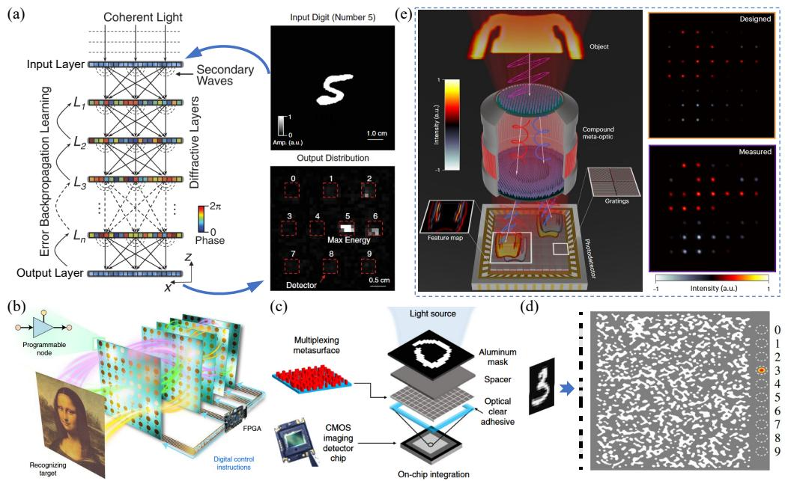

Applications of metasurfaces in optical neural networks. (a) Left: schematic of the all-optical diffractive neural network architecture. Right: incident and output images during the handwritten digit recognition task. The red dashed boxes represent the detector regions corresponding to different digits. (b) Schematic of a programmable diffractive neural network. (c) Schematic of the structure of a diffractive neural network system operating in the visible. (d) Schematic of a 2D neural network for handwritten digit recognition using a topologically optimized metasurface. (e) Left: convolution operator based on a bilayer metasurface. A polarization-sensitive photodetector is achieved through the oriented grating on each detector. Right: numerically computed ideal convolution kernel (top) and the PSF of the fabricated bilayer metasurface (bottom). (a) Adapted with permission from Lin et al., Science 361, 1004–1008 (2018) [683]. Copyright © 2018 American Association for the Advancement of Science. (b) Reprinted with permission from Liu et al., Nat. Electron. 5, 113–122 (2022) [684]. Copyright © 2022 Springer Nature. (c) Reprinted from [685] under a Creative Commons license. (d) Adapted with permission from Khoram et al., Photonics Res. 7, 823–827 (2019) [687]. Copyright © 2019 Chinese Laser Press. (e) Adapted with permission from Zheng et al., Nat. Nanotechnol. 19, 471–478 (2024) [688]. Copyright © 2024 Springer Nature.

a 3D-printed diffractive neural network with five diffractive layers. Two classic machine learning tasks were successfully demonstrated: handwritten digit classification (91.75% simulated accuracy) and fashion product classification (86.33% simulated accuracy), with experimental results showing 88% and 90% agreement to the numerical tests, respectively.

In 2022, Cui's group [684] implemented a programmable diffractive neural network, as shown in Fig. 56(b), using digital-coding metasurfaces operating in the microwave regime. Each meta-atom was integrated with two amplifier chips, providing a dynamic modulation range from $-22$ dB to $13$ dB. The wave propagation through the multilayer metasurfaces in this system is governed by linear equations, resulting in an inherently linear neural network. Therefore, the network's ability to handle nonlinear functionalities is limited. In the same year, Luo et al. [685] employed the system shown in Fig. 56(c) to experimentally realize a diffractive neural network with a single-

layer metasurface diffractive layer in the visible. The propagation phase metasurface enabled full phase modulation for orthogonal linearly polarized light, allowing the system to simultaneously support two polarization-multiplexed neural networks to perform different classification tasks: four-category handwritten digit classification and four-category fashion product classification. Also in 2022, Zhao et al. [686] experimentally implemented a diffractive neural network for trigonometric operations using a single-layer metasurface operating in the microwave regime. In 2024, He et al. [182] experimentally demonstrated a diffractive neural network in the near-infrared regime, utilizing a bilayer metasurface.

Additionally, applications of metasurface-based diffractive neural networks in logical operations will be introduced in Subsection 7.4.

(II) All-optical scattering neural networks. In 2019, Khoram et al. [687] proposed another metasurface-based architecture, i.e., the scattering neural network, as illustrated in Fig. 56(b). Taking handwritten digit classification as an example, the input image is first converted into a vector and then encoded into the spatial intensity of the incident light on the left side. After undergoing complex scattering interactions with the metasurface, the light exits on the right side, where each region corresponds to a specific digit. The region with the maximum light intensity represents the predicted digit. In this setup, the scattering interactions between the wave and the metasurface are highly complex and require full-wave simulations for accurate modeling. The gradient information needed for backpropagation in neural network training is obtained using the adjoint method introduced in Subsection 3.3. Consequently, the training process of the neural network is equivalent to the inverse design of a topology-optimized metasurface. However, full-wave simulations are computationally expensive, making the training process highly time-consuming. As a result, only a 2D metasurface design was numerically demonstrated, as shown in Fig. 56(d).

# 7.3.2. Optical-Digital Hybrid Neural Networks Empowered by Metasurfaces

In 2022, Qu et al. [689] proposed a hybrid optical-digital framework for optical neural networks to bypass the need for cascading multiple metasurface layers. The intensity distribution of the output light from a single-layer metasurface neural network is encoded into a feature vector and then processed by a digital neural network with a fully connected layer in the computer to generate final predictions.

In 2024, Zheng et al. [688] proposed a hybrid neural network that leverages a bilayer metasurface to perform computationally expensive convolution operations on input images, as shown in the left panel of Fig. 56(e). The convolution results are subsequently processed by the digital neural network backend, forming a complete hybrid neural network. Since optical imaging inherently involves the convolution of the original image with a PSF, the key to implementing convolution operators lies in designing a bilayer metasurface that realizes the PSF corresponding to the convolution kernel. In this case, each focal spot in the PSF represents an element of the convolution kernel, with RCP and LCP focal spots denoting positive and negative element values, respectively. To realize a specific PSF, the bottom metasurface functions as a polarization-insensitive lens, while the top metasurface employs a hybrid phase modulation mechanism to generate polarization-multiplexed holographic images that encode the LCP and RCP components of the convolution kernel. The calculated and measured convolution kernels implemented by the bilayer metasurface are shown in the right panel of Fig. 56(e). Experimentally, the hybrid neural network achieved accuracies of $98.6\%$ for handwritten digit classification and $88.8\%$ for fashion product classification.

Figure 57  
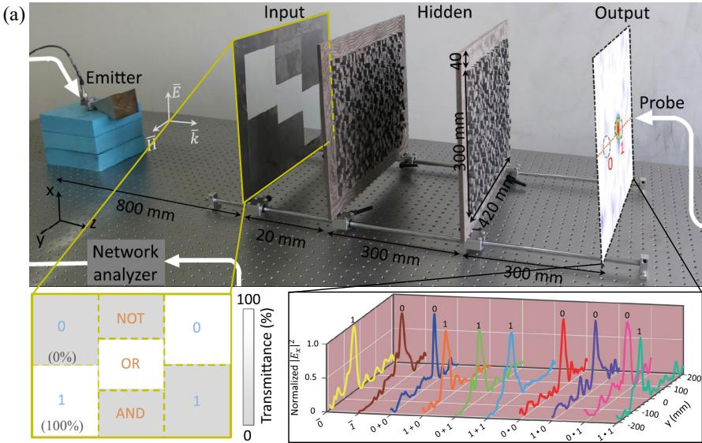

text_image

(a)
Emitter
Input
Hidden
Output
Probe
Network
analyzer
20 mm
300 mm
300 mm
300 mm
100
Transmittance (%)
0
NOT
0
OR
1
AND
1
0
0
1
1
1
1
1
1
1
1
1
1
0
0
0
0
1
1
1
1
1
1
1
1
1
1
1
1
1
1
1
1
1
1
1
1
1
1
1
1
1
1
1
1
1
1
1
1
1
1
1
1
1
1
1
1
1
1
1
1
1
1
1
1
1
1
0
0
0
0
0
0
0
0
0
0
0
0
0
0
0
0
0
0
0
0
0
0
0
0
0
0
0
0
0
0
0
0
0
0
0
0
0
0
0
0
0
0
0
0
0
0
0
0
0
0
1
1
1
1
1
1
1
1
1
1
1
1
1
1
1
1
1
1
1
1
1
1
1
1
1
1
1
1
1
1
1
1
1
1
1
1
1
1
1
1
1
1
1
1
1
0
0
0
0
1
1
1
1
1
1
1
1
1
1
1
1
1
1
1
1
1
1
1
1
1
1
1
1
1
1
1
1
1
1
1
1
1
1
1
0
0
0
0
0
0
0
0
0
0
0
0
0
0
1
1
1
1
1
1
1
1
1
1
1
1
1
1
1
1
1
1
1
1
1
1
1
1
1
1
1
1
1
1
1
1
1
1
1
0
0
0
0
0
0
0
0
0
0
1
1
1
1
1
1
1
1
1
1
1
1
1
1
1
1
1
1
1
1
1
1
1
1
1
1
1
1
1
1
1
1
1
1
1
1
1
1
1
0
0
0
0
0
0
0
0
0
0
1
1
1
1
0
0
0
0
0
0
0
0
0
0
0
0
0
0
0
0
0
0
0
0
0
0
0
0
0
0
0
0
0
0
0
0
0
0
0
0
0
0
0
0
0
0
0
0
0
1
1
1
1
0
0
0
0
0
0
0
0
0
0
0
0
0
0
0
0
0
0
0
0
0
0
0
0
0
0
0
0
0
0
0
0
0
0
0
1
1
1
1
1
1
1
1
1
1
1
1
1
1
0
0
0
0
0
0
0
0
0
0
0
0
0
0
0
0
0
0
0
0
0
0
0
0
0
0
0
0
0
0
0
0
0
0
0
1
1
1
1
1
1
1
1
1
1
0
0
0
0
0
0
0
0
0
0
0
0
0
0
0
0
0
0
0
0
0
0
0
0
0
0
0
0
0
0
0
0
0
0
0
0
0
0
0
1
1
1
1
1
1
1
1
1
1
0
0
0
0
1
1
1
1
1
1
1
1
1
1
1
1
1
1
1
1
1
1
1
1
1
1
1
1
1
1
1
1
1
1
1
1
1
0
0
0
0
0
0
0
0
0
0
0
0
0
0
0
0
1
1
1
1
1
1
1
1
1
1
1
1
1
1
1
1
1
1
1
1
1
1
1
1
1
1
1
1
1
1
1
1
1
0
0
0
0
0
0
0
0
0
0
0
0
1
1
1
1
1
1
1
1
1
1
1
1
1
1
1
1
1
1
1
1
1
1
1
1
1
1
1
1
1
1
1
1
1
1
1
1
1
0
0
0
0
0
0
0
0
0
0
0
0
1
1
1
1
0
0
0
0
0
0
0
0
0
0
0
0
0
0
0
0
0
0
0
0
0
0
0
0
0
0
0
0
0
0
0
0
0
1
1
1
1
1
1
1
1
1
1
1
1
1
1
1
1
0
0
0
0
0
0
0
0
0
0
0
0
0
0
0
0
0
0
0
0
0
0
0
0
0
0
0
0
0
0
0
0
0
1
1
1
1
1
1
1
1
1
1
1
1
0
0
0
0
0
0
0
0
0
0
0
0
0
0
0
0
0
0
0
0
0
0
0
0
0
0
0
0
0
0
0
0
0
0
0
0
0
1
1
1
1
1
1
1
1
1
1
1
1
0
0
0
0
1
1
1
1
1
1
1
1
1
1
1
1
1
1
1
1
1
1
1
1
1
1
1
1
1
1
1
1
1
1
1
1
1
0
0
1
1
1
1
1
1
1
1
1
1
1
1
1
1
1
1
1
1
1
1
1
1
1
1
1
1
1
1
1
1
1
1
1
1
1
1
1
1
1
1
1
1
1
1
1
1
1
0
0
1
1
1
1
1
1
1
1
1
1
1
1
1
1
0
0
0
0
0
0
0
0
0
0
0
0
0
0
0
0
0
0
0
0
0
0
0
0
0
0
0
0
0
0
0
0
0
1
1
0
0
0
0
0
0
0
0
0
0
0
0
0
0
0
0
0
0
0
0
0
0
0
0
0
0
0
0
0
0
0
0
0
0
0
0
0
0
0
0
0
0
0
0
0
0
0
1
1
0
0
0
0
0
0
0
0
0
0
0
0
0
0
1
1
0
0
0
0
0
0
0
0
0
0
0
0
0
0
0
0
0
0
0
0
0
0
0
0
0
0
0
0
0
0
0
0
0
1
1
0
0
0
0
0
0
0
0
0
0
0
0
1
1
0
0
0
0
0
0
0
0
0
0
0
0
0
0
0
0
0
0
0
0
0
0
0
0
0
0
0
0
0
0
0
0
0
0
0
1
1
0
0
0
0
0
0
0
0
0
0
0
0
1
1
1
1
1
1
1
1
1
1
1
1
1
1
1
1
1
1
1
1
1
1
1
1
1
1
1
1
1
1
1
1
1
1
1
0
0
1
1
1
1
1
1
1
1
1
1
1
1
0
0
0
0
0
0
0
0
0
0
0
0
0
0
0
0
0
0
0
0
0
0
0
0
0
0
0
0
0
0
0
0
0
0
0
1
1
0
0
0
0
0
0
0
0
0
0
1
1
0
0
0
0
0
0
0
0
0
0
0
0
0
0
0
0
0
0
0
0
0
0
0
0
0
0
0
0
0
0
0
0
0
0
0
0
0
1
1
0
0
0
0
0
0
0
0
0
0
1
1
1
1
1
1
1
1
1
1
1
1
1
1
1
1
1
1
1
1
1
1
1
1
1
1
1
1
1
1
1
1
1
1
1
1
1
0
0
1
1
1
1
1
1
1
1
1
1
0
0
0
0
0
0
0
0
0
0
0
0
0
0
0
0
0
0
0
0
0
0
0
0
0
0
0
0
0
0
0
0
0
0
0
0
0
1
1
0
0
0
0
0
0
0
0
1
1
0
0
0
0
0
0
0
0
0
0
0
0
0
0
0
0
0
0
0
0
0
0
0
0
0
0
0
0
0
0
0
0
0
0
0
0
0
0
0
1
1
0
0
0
0
0
0
0
0
1
1
1
1
1
1
1
1
1
1
1
1
1
1
1
1
1
1
1
1
1
1
1
1
1
1
1
1
1
1
1
1
1
1
1
1
1
1
1
1
1
0
0
0
0
0
0
0
0
1
1
0
0
0
0
0
0
0
0
0
0
0
0
0
0
0
0
0
0
0
0
0
0
0
0
0
0
0
0
0
0
0
0
0
0
0
0
0
1
1
1
1
1
1
1
1
1
1
0
0
1
1
1
1
1
1
1
1
1
1
1
1
1
1
1
1
1
1
1
1
1
1
1
1
1
1
1
1
1
1
1
1
1
1
1
1
1
0
0
0
0
0
0
0
0
0
0
1
1
0
0
0
0
0
0
0
0
0
0
0
0
0
0
0
0
0
0
0
0
0
0
0
0
0
0
0
0
0
0
0
0
0
0
0
1
1
1
1
1
1
1
1
1
1
1
1
0
0
1
1
1
1
1
1
1
1
1
1
1
1
1
1
1
1
1
1
1
1
1
1
1
1
1
1
1
1
1
1
1
1
1
1
1
0
0
0
0
0
0
0
0
0
0
0
0
1
1
0
0
0
0
0
0
0
0
0
0
0
0
0
0
0
0
0
0
0
0
0
0
0
0
0
0
0
0
0
0
0
0
0
1
1
1
1
1
1
1
1
1
1
1
1
1
1
0
0
1
1
1
1
1
1
1
1
1
1
1
1
1
1
1
1
1
1
1
1
1
1
1
1
1
1
1
1
1
1
1
1
1
0
0
0
0
0
0
0
0
0
0
0
0
0
0
1
1
0
0
0
0
0
0
0
0
0
0
0
0
0
0
0
0
0
0
0
0
0
0
0
0
0
0
0
0
0
0
0
1
1
1
1
1
1
1
1
1
1
1
1
1
1
1
1
1
1
0
0
0
0
0
0
0
0
0
0
0
0
0
0
0
0
0
0
0
0
0
0
0
0
0
0
0
0
0
0
0
1
1
1
1
1
1
1
1
1
1
1
1
1
1
1
1
0
0
1
1
1
1
1
1
1
1
1
1
1
1
1
1
1
1
1
1
1
1
1
1
1
1
1
1
1
1
1
1
1
0
0
0
0
0
0
0
0
0
0
0
0
0
0
0
0
0
0
1
1
1
1
1
1
1
1
1
1
1
1
1
1
1
1
1
1
1
1
1
1
1
1
1
1
1
1
1
1
1
0
0
0
0
0
0
0
0
0
0
0
0
0
0
0
0
1
1
0
0
0
0
0
0
0
0
0
0
0
0
0
0
0
0
0
0
0
0
0
0
0
0
0
0
0
0
0
0
0
1
1
0
0
0
0
0
0
0
0
0
0
0
0
0
0
0
0
1
1
0
0
0
0
0
0
0
0
0
0
0
0
0
0
0
0
0
0
0
0
0
0
0
0
0
0
0
0
0
1
1
0
0
0
0
0
0
0
0
0
0
0
0
0
0
0
0
0
0
1
1
0
0
0
0
0
0
0
0
0
0
0
0
0
0
0
0
0
0
0
0
0
0
0
0
0
0
0
0
0
1
1
1
1
1
1
1
1
1
1
1
1
1
1
1
1
1
1
1
1
0
0
0
0
0
0
0
0
0
0
0
0
0
0
0
0
0
0
0
0
0
0
0
0
0
0
0
0
0
1
1
1
1
1
1
1
1
1
1
1
1
1
1
1
1
1
1
0
0
1
1
1
1
1
1
1
1
1
1
1
1
1
1
1
1
1
1
1
1
1
1
1
1
1
1
1
1
1
0
0
0
0
0
0
0
0
0
0
0
0
0
0
0
0
0
0
0
0
1
1
1
1
1
1
1
1
1
1
1
1
1
1
1
1
1
1
1
1
1
1
1
1
1
1
1
1
1
0
0
0
0
0
0
0
0
0
0
0
0
0
0
0
0
0
0
1
1
0
0
0
0
0
0
0
0
0
0
0
0
0
0
0
0
0
0
0
0
0
0
0
0
0
0
0
1
1
1
1
1
1
1
1
1
1
1
1
1
1
1
1
1
1
1
1
1
1
0
0
0
0
0
0
0
0
0
0
0
0
0
0
0
0
0
0
0
0
0
0
0
0
0
0
0
1
1
1
1
1
1
1
1
1
1
1
1
1
1
1
1
1
1
1
1
0
0
1
1
1
1
1
1
1
1
1
1
1
1
1
1
1
1
1
1
1
1
1
1
1
1
1
1
1
0
0
0
0
0
0
0
0
0
0
0
0
0
0
0
0
0
0
0
0
0
0
1
1
1
1
1
1
1
1
1
1
1
1
1
1
1
1
1
1
1
1
1
1
1
1
1
1
1
0
0
0
0
0
0
0
0
0
0
0
0
0
0
0
0
0
0
0
0
1
1
0
0
0
0
0
0
0
0
0
0
0
0
0
0
0
0
0
0
0
0
0
0
0
0
0
0
0
1
1
0
0
0
0
0
0
0
0
0
0
0
0
0
0
0
0
0
0
0
0
1
1
1
1
1
1
1
1
1
1
1
1
1
1
1
1
1
1
1
1
1
1
1
1
1
1
1
0
0
1
1
1
1
1
1
1
1
1
1
1
1
1
1
1
1
1
1
1
1
0
0
0
0
0
0
0
0
0
0
0
0
0
0
0
0
0
0
0
0
0
0
0
0
0
0
0
1
1
0
0
0
0
0
0
0
0
0
0
0
0
0
0
0
0
0
0
1
1
1
1
1
1
1
1
1
1
1
1
1
1
1
1
1
1
1
1
1
1
1
1
1
1
1
1
1
0
0
1
1
1
1
1
1
1
1
1
1
1
1
1
1
1
1
1
1
0
0
0
0
0
0
0
0
0
0
0
0
0
0
0
0
0
0
0
0
0
0
0
0
0
0
0
0
0
1
1
0
0
0
0
0
0
0
0
0
0
0
0
0
0
0
0
1
1
1
1
1
1
1
1
1
1
1
1
1
1
1
1
1
1
1
1
1
1
1
1
1
1
1
1
1
1
1
0
0
1
1
1
1
1
1
1
1
1
1
1
1
1
1
1
1
0
0
0
0
0
0
0
0
0
0
0
0
0
0
0
0
0
0
0
0
0
0
0
0
0
0
0
0
0
0
0
1
1
0
0
0
0
0
0
0
0
0
0
0
0
0
0
1
1
1
1
1
1
1
1
1
1
1
1
1
1
1
1
1
1
1
1
1
1
1
1
1
1
1
1
1
1
1
1
1
0
0
1
1
1
1
1
1
1
1
1
1
0
0
0
0
1
1
1
1
1
1
1
1
1
1
1
1
1
1
1
1
1
1
1
1
1
1
1
1
1
1
1
1
1
1
1
1
0
0
0
0
0
0
0
0
0
0
0
0
0
0
0
0
0
1
1
1
1
1
1
1
1
1
1
1
1
1
1
1
1
1
1
1
1
1
1
1
1
1
1
1
1
1
1
1
1
0
0
0
0
0
0
0
0
0
0
0
0
0
1
1
1
1
1
1
1
1
1
1
1
1
1
1
1
1
1
1
1
1
1
1
1
1
1
1
1
1
1
1
1
1
1
1
1
1
0
0
0
0
0
0
0
0
0
0
0
0
0
1
1
1
1
0
0
0
0
0
0
0
0
0
0
0
0
0
0
0
0
0
0
0
0
0
0
0
0
0
0
0
0
0
0
0
0
1
1
1
1
1
1
1
1
1
1
1
1
1
1
1
1
1
0
0
0
0
0
0
0
0
0
0
0
0
0
0
0
0
0
0
0
0
0
0
0
0
0
0
0
0
0
0
0
0
1
1
1
1
1
1
1
1
1
1
1
1
1
0
0
0
0
0
0
0
0
0
0
0
0
0
0
0
0
0
0
0
0
0
0
0
0
0
0
0
0
0
0
0
0
0
0
0
0
1
1
1
1
1
1
1
1
1
1
1
1
1
0
0
0
0
1
1
1
1
1
1
1
1
1
1
1
1
1
1
1
1
1
1
1
1
1
1
1
1
1
1
1
1
1
1
1
1
0
0
0
1
1
1
1
1
1
1
1
1
1
1
1
1
1
1
1
1
1
1
1
1
1
1
1
1
1
1
1
1
1
1
1
1
1
1
1
1
1
1
1
1
1
1
1
1
1
0
0
0
1
1
1
1
1
1
1
1
1
1
1
1
1
1
0
0
0
0
0
0
0
0
0
0
0
0
0
0
0
0
0
0
0
0
0
0
0
0
0
0
0
0
0
0
0
0
1
1
1
0
0
0
0
0
0
0
0
0
0
0
0
0
0
0
0
0
0
0
0
0
0
0
0
0
0
0
0
0
0
0
0
0
0
0
0
0
0
0
0
0
0
0
0
0
0
1
1
1
0
0
0
0
0
0
0
0
0
0
0
0
0
0
1
1
1
1
1
1
1
1
1
1
1
1
1
1
1
1
1
1
1
1
1
1
1
1
1
1
1
1
1
1
1
1
0
0
0
1
1
1
1
1
1
1
1
1
1
0
0
0
0
0
0
0
0
0
0
0
0
0
0
0
0
0
0
0
0
0
0
0
0
0
0
0
0
0
0
0
0
0
0
0
0
1
1
1
0
0
0
0
0
0
0
0
0
0
1
1
1
1
1
1
1
1
1
1
1
1
1
1
1
1
1
1
1
1
1
1
1
1
1
1
1
1
1
1
1
1
1
1
1
1
0
0
0
1
1
1
1
1
1
1
1
1
1
0
0
0
0
1
1
1
1
1
1
1
1
1
1
1
1
1
1
1
1
1
1
1
1
1
1
1
1
1
1
1
1
1
1
1
1
0
1
1
1
1
1
1
1
1
1
1
1
1
1
1
1
1
1
1
1
1
1
1
1
1
1
1
1
1
1
1
1
1
1
1
1
1
1
1
1
1
1
1
1
1
1
1
1
1
0
1
1
1
1
1
1
1
1
1
1
1
1
1
1
1
1
0
0
0
0
0
0
0
0
0
0
0
0
0
0
0
0
0
0
0
0
0
0
0
0
0
0
0
0
0
0
0
0
1
0
0
0
0
0
0
0
0
0
0
0
0
0
0
0
0
0
0
0
0
0
0
0
0
0
0
0
0
0
0
0
0
0
0
0
0
0
0
0
0
0
0
0
0
0
0
0
0
1
0
0
0
0
0
0
0
0
0
0
0
0
0
0
0
0
1
1
1
1
1
1
1
1
1
1
1
1
1
1
1
1
1
1
1
1
1
1
1
1
1
1
1
1
1
1
1
1
0
1
1
1
1
1

(b)  
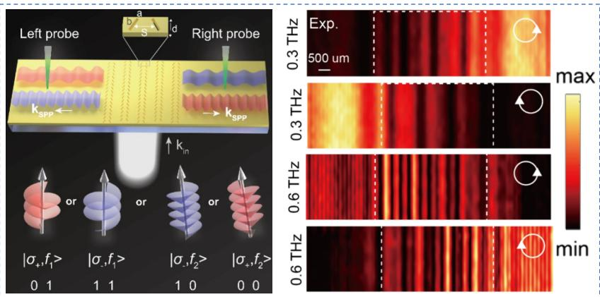

text_image

Left probe
Right probe
kSPP
kSPP
kin
|σ+,f1>
|σ,f1>
|σ,f2>
|σ+,f2>
0 1 1 1 0 0
Exp.
500 um
0.3 THz
0.3 THz
0.6 THz
0.6 THz
max
min

Logic operations based on metasurfaces. (a) Experimental setup of the diffractive neural network for performing basic logic operations. Bottom left: schematic of the encoding of logic operators and input logical states at the input layer. Bottom right: experimental result showing the light intensity distributions along the red dashed line on the output plane when the diffractive neural network performs different logic operations. (b) Left: schematic of a frequency and polarization multiplexed metasurface used for logic operations. Right: experimental SPP intensity distributions measured under incident light with different frequencies and polarizations. The inserted arrows indicate the circular polarization state of the incident light. The dashed rectangular region represents the nano-slit array. (a) Adapted from $[690]$ under a Creative Commons license. (b) Adapted with permission from Zhang et al., Nano Lett. 25, 1367–1372 (2025) $[691]$ . Copyright © 2025 American Chemical Society.

# 7.4. Logic Operations

Logic operations based on diffractive neural networks. Using the metasurface-based diffractive neural network introduced in Subsection 7.3, various logic operations can be realized by designing appropriate encoding strategies.

In 2020, Qian et al. [690] experimentally demonstrated three fundamental logic operations—NOT, OR, and AND—in the microwave regime using a bilayer metasurface-based diffractive neural network. The experimental setup is shown in the top panel of Fig. 57(a). Each region of the input layer was encoded to represent a specific logic operator or input logic state with two distinct transmittance states (0 or 1). In this

way, by defining a binary amplitude distribution, a complete logic operation input could be established. For example, the bottom left panel of Fig. 57(a) illustrates an OR operation performed on the inputs 0 and 1. The metasurface directed the diffracted wave toward one of two designated regions in the output layer, representing 0 and 1, respectively, as the logic operation result. As shown in the bottom right panel of Fig. 56(a), experimentally obtained logic operation results were in agreement with theoretical predictions. In 2022, Zhao et al. [692] utilized the same approach to implement a similar functionality using a single-layer metasurface-based diffractive neural network.

In 2021, Wang et al. [693] used OAM modes with topological charges of 1 and 2 to represent logic states 0 and 1, respectively. Numerical simulations verified that a bilayer metasurface-based diffractive neural network could independently implement AND, OR, and NOT gates. Furthermore, by cascading these logic gates, more complex logical operations could be realized.

Logic operations based on frequency and polarization multiplexed metasurfaces. In 2025, Zhang et al. [691] demonstrated the independent realization of all fundamental logic operations in the terahertz regime using a frequency and polarization multiplexed metasurface to selectively route SPPs. As shown in the left panel of Fig. 57(b), different combinations of circular polarization states ( $\sigma_{\pm}$ ) and frequencies ( $f_{1}/f_{2}$ ) of the incident light were encoded as distinct logic state inputs. The presence or absence of the SPP on either side of the metasurface represented logic state outputs 1 or 0, respectively. The spin-dependent SPP interference effect was induced by geometric phase modulation, while the frequency-dependent SPP interference effect was governed by propagation phase differences at different frequencies. In this way, various logic operations could be realized by designing appropriate metasurfaces. For example, in the structure shown in the left panel of Fig. 57(b), the experimentally observed SPP intensity distributions under different illumination conditions (varying frequency and spin states) are displayed in the right panel of Fig. 57(b). According to the definitions of input and output logic states, the metasurface implemented an XOR gate on the left side and an XNOR gate on the right side.

# 8. ACTIVE METASURFACES

Active metasurfaces, as an innovative advancement over traditional passive counterparts, achieve dynamic control over the amplitude, phase, polarization, and even frequency of electromagnetic waves by incorporating dynamically tunable materials or architectures $[5,315,694–699]$ . In recent years, driven by the rapid development of tunable materials (e.g., 2D materials, liquid crystals, phase-change materials, and transparent conductive oxides) and external excitation techniques (including electrical, optical, thermal, and mechanical actuation), active metasurfaces have transitioned from fundamental theories to functional applications. In terms of applications, active metasurfaces can be categorized into four categories: transmittance/reflectance and phase modulation, switchable or continuously tunable optical components (such as gratings for beam steering, lenses, holograms, and nanoprinting), SLMs consisting of multiple independently addressable metasurface elements, and temporal modulation. While research on the first two categories has achieved relative maturity, investigations into the latter two still face challenges spanning theoretical frameworks, device design, and fabrication. This section provides a systematical review of these metasurfaces based on their dynamic modulation mechanisms, discussing design principles, tuning strategies, and representative cutting-edge applications.

# 8.1. Active Metasurfaces Based on 2D Materials

2D materials are layered crystalline materials with atomic-scale thickness, whose quantum confinement effects and surface-dominated optical properties have sparked extensive research in photonics. Typical 2D material systems include graphene, transition metal dichalcogenides (TMDCs), and hexagonal boron nitride (hBN). Among them, graphene and TMDCs are the two primary 2D materials used for realizing active metasurfaces.

Graphene, a monolayer of hexagonally arranged carbon atoms, achieves optical modulation through electrical gating by tuning the carrier density via Fermi-level control, enabling broadband absorption modulation and plasmon resonance tuning. In contrast, TMDCs are a class of layered semiconductor materials with the chemical formula $MX_{2}$ , where M represents transition metals such as Mo or W, and X denotes chalcogen elements such as S or Se. Their monolayer structure consists of a transition metal atomic layer sandwiched between two chalcogen atomic layers, forming a hexagonal lattice through strong covalent bonding. The optical property of TMDCs can be dynamically controlled through exciton-trion transitions induced by doping (via photochemical or electrical gating), wherein injected carriers convert neutral excitons into charged trions, shifting excitonic resonances and modifying photoluminescence efficiency.

Metasurfaces integrated with 2D materials. (I) Metasurfaces integrated with a graphene layer. In 2013, Capasso's group $[700]$ proposed an active metasurface leveraging the gate-voltage-dependent optical properties of graphene, as illustrated in the left panel of Fig. 58(a). By introducing a graphene layer beneath the Au meta-atom array, they achieved electro-optical modulation over the metasurface reflectance spectrum, as shown in the right panel of Fig. 58(a), with a modulation speed of approximately 40 MHz. In this design, graphene facilitates dynamic modulation of the metasurface. Conversely, the presence of the metasurface significantly enhances the modulation depth of monolayer graphene $[709]$ .

Notably, resonant modes played a crucial role in extending the modulation range of this metasurface design $[710,711]$ . In 2014, based on the same architecture, Emani et al. $[710]$ demonstrated electrically tunable Fano resonances through careful design of the meta-atoms. More recently, in 2024, Han et al. $[712]$ proposed introducing a dielectric barrier layer between the metallic meta-atom array and graphene to reduce electrical coupling, which helps to enhance the modulation range.

In 2014, Capasso's group extended the aforementioned architecture by incorporating a MIM metasurface design, enabling an electrically tunable perfect absorber operating in the 5 $\mu$ m–7 $\mu$ m wavelength range. By switching the metasurface in and out of the critical coupling condition via gate voltage, they achieved a modulation depth of up to 100% with a modulation speed of 20 GHz. In 2017, Sherrott et al. [713] demonstrated a similar active MIM metasurface, achieving a phase modulation range of 237° at an operating wavelength of 8.5 $\mu$ m.

In 2015, Miao et al. [701] proposed a slightly modified architecture, as illustrated in the top left panel of Fig. 58(b). The metasurface consisted of an array of Al meta-atoms and an Al film separated by an SU8 spacer layer. A monolayer of graphene was transferred onto the top of the metasurface and covered with a gel-like ion liquid. The electrically tunable full-phase modulation in the terahertz regime was realized, along with complex amplitude modulation shown in the bottom panel of Fig. 58(b). Furthermore, by the deliberate design of the metasurface structure, dynamic control over the polarization state of incident light could also be achieved, as demonstrated in the top right panel of Fig. 58(b).

Figure 58  
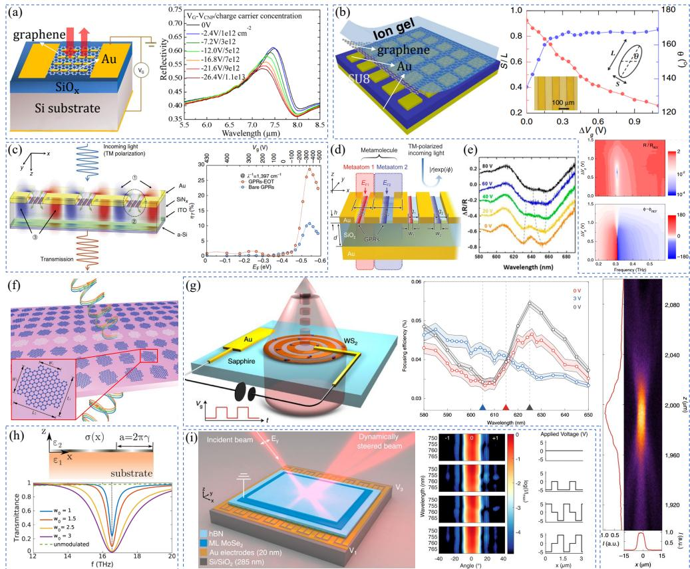

Active metasurfaces based on 2D materials. (a) Left: schematic of an active metasurface incorporating monolayer graphene between the meta-atom array and substrate. Right: measured reflectance spectra under different gate voltages ( $V_{G}$ ) and corresponding charge carrier concentrations. $V_{CNP}$ denotes the gate voltage at the charge neutral point. (b) Top left: schematic of an active metasurface with monolayer graphene atop the meta-atom array. Top right: polarization states of reflected light for linearly polarized incident light (the polarization angle is $32^{\circ}$ relative to the x-axis) at 0.63 THz, characterized by elliptical axis ratio (S/L, red curve) and rotation angle (blue curve) under varying gate voltages. Bottom: measured reflectance and reflection phase shift as functions of gate voltage and frequency. (c) Left: schematic of graphene plasmonic ribbons coupled to a subwavelength metallic slit array. Right: measured modulation efficiency $\eta_{T}$ comparison at $\lambda^{-1}=1397~cm^{-1}$ as a function of Fermi level $E_{F}$ and corresponding gate voltage $V_{g}$ for the graphene plasmonic ribbons—extraordinary optical transmission (GPRs–EOT) device (left panel) versus bare GPRs. Here, $\eta_{T}=1-T/T_{max}$ , where T is the transmittance and $T_{max}$ corresponds to the maximum transmittance at the resonance frequency. (d) Schematic of a metasurface unit cell comprising a pair of independently controlled graphene-Au meta-atoms. (e) Differential reflectance spectra $\Delta R/R=(R_{\mathrm{sample}}-R_{\mathrm{substrate}})/R_{\mathrm{substrate}}$ under varying gate voltages for incident light with an angle of incidence $\sim18.7^{\circ}$ . (f) Schematic of a geometric phase graphene metasurface. Inset: detailed view of a graphene meta-atom. (g) Left: schematic of a $WS_{2}$ zone plate lens integrated into an electrochemical cell. Middle: focusing efficiency spectra in pristine (red, $V_{g}=0~V$ ), gated (blue, $V_{g}=3~V$ ), and restored states (gray, $V_{g}=0~V$ ). Shaded regions represent one standard deviation error bound. Right: xOz-plane scan of the focused beam at 620 nm wavelength, with normalized intensity cross-sections along the z-axis ( $x=0~\mum$ ) and x-axis ( $z=1993~\mum$ ) in arbitrary units (a.u.). (h) Top: schematic of conductivity profile $\sigma(x)$ modulation in monolayer graphene via periodic biasing, where $2\pi\gamma$ defines the (continued)

(continued) modulation periodicity. Bottom: simulated transmittance spectra at normal incidence under voltage profiles with varying modulation strengths $w_{0}$ . (i) Left: schematic of an exciton-based $MoSe_{2}$ metasurface for dynamic beam steering. Right: measured spectral Fourier plane images at the operating wavelength of 757 nm, demonstrating dynamic beam deflection at $\pm30^{\circ}$ under distinct electrode voltage configurations. (a) Adapted with permission from Yao et al., Nano Lett. 13, 1257–1264 (2013) [700]. Copyright © 2013 American Chemical Society. (b) Adapted from [701] under a Creative Commons license. (c) Adapted from [702] under a Creative Commons license. (d) Adapted with permission from Han et al., ACS Nano 14, 1166–1175 (2020) [703]. Copyright © 2020 American Chemical Society. (e) Adapted with permission from Lee et al., Nano Lett. 17, 4541–4547 (2017) [704]. Copyright © 2017 American Chemical Society. (f) Adapted with permission from Cheng et al., Adv. Opt. Mater. 3, 1744–1749 (2015) [705]. Copyright © 2015 WILEY-VCH Verlag GmbH & Co. KGaA, Weinheim. (g) Adapted with permission from van de Groep et al., Nat. Photonics 14, 426–430 (2020) [706]. Copyright © 2020 Springer Nature. (h) Adapted with permission from Huidobro et al., ACS Nano 10, 5499–5506 (2016) [707]. Copyright © 2016 American Chemical Society. (i) Adapted with permission from Li et al., Nano Lett. 23, 2771–2777 (2023) [708]. Copyright © 2023 American Chemical Society.

(II) Metasurfaces with graphene plasmonic ribbons. In 2016, Kim et al. [702] demonstrated the dynamic control of extraordinary optical transmission (EOT) in a subwavelength metallic slit array using graphene plasmonic ribbons. As illustrated in the left panel of Fig. 58(c), TM-polarized incident light induces SPPs on the top metallic surface. These SPPs propagate through the metallic slits, exciting SPPs on the bottom metallic surface. The SPPs on the bottom surface are diffracted by the periodic structure and radiate into free space with enhanced intensity, forming EOT. When graphene plasmonic ribbons are introduced, and the gate voltage is adjusted such that their plasmonic resonance frequency matches the EOT frequency, the coupling between the SPPs on the top and bottom metallic surfaces is suppressed, thereby inhibiting the EOT. The resulting modulation of the metasurface transmittance is shown in the right panel of Fig. 58(c).

In 2020, Han et al. [703] proposed a metasurface unit composed of two Au meta-atoms, as illustrated in Fig. 58(d), where each meta-atom's response can be independently tuned using graphene ribbons controlled by different gate voltages. Simulations for this design verified a $2\pi$ phase modulation, perfect absorption, and other large dynamic-range modulations.

In 2023, Park et al. [714] realized an electrically tunable wave retarder operating in the terahertz regime by integrating the Au metasurface with graphene ribbons.

(III) Metasurfaces integrated with monolayer TMDCs. The monolayer graphene in the aforementioned active metasurface architectures can be replaced with monolayer TMDCs, as both exhibit electrically tunable optical properties $[704,715,716]$ . In 2017, Lee et al. $[704]$ implemented a similar architecture to the one shown in Fig. 58(a) but replaced graphene with monolayer $MoS_{2}$ , achieving the reflectance spectrum modulation illustrated in Fig. 58(e). In 2018, Zhang et al. $[715]$ realized optoelectronic and photochemical dynamic tuning of photoluminescence intensity and transmittance spectrum using a SiN metasurface (consisting of a periodic square array of air holes) covered with monolayer $MoS_{2}$ .

Metasurfaces with 2D-material-based meta-atoms. An emerging direction in metasurface development is their integration with 2D and layered 2D materials $[596]$ . Metasurfaces incorporating 2D-material-based meta-atoms not only enable ultrathin, com-

pact devices but also harness the unique optoelectronic properties of 2D materials. However, the inherently weak light–matter interactions present challenges for efficient optical manipulation, necessitating innovative strategies to enhance photonic behavior and interaction efficiency.

In 2015 [705] and 2018 [717], Tian's group and Chen's group collaboratively proposed graphene-based metasurfaces utilizing geometric phase, designed for operation in the terahertz and mid-infrared regimes, respectively, as illustrated in Fig. 58(f). Their simulations verified functionalities such as electrically tunable beam deflection with high efficiency.

In 2020, Brongersma's group [706] proposed an electrically tunable, atomically thin zone plate lens based on monolayer $\mathrm{WS}_2$ , as shown in the left panel of Fig. 58(g). The focusing performance of the lens without an applied bias voltage is depicted in the right panel of Fig. 58(g). As illustrated in the middle panel of Fig. 58(g), the focusing efficiency can be dynamically modulated via time-dependent ionic-liquid gate voltages, which suppress exciton resonance effects. The rise and fall times of the focal intensity at the operating wavelength of $625\mathrm{nm}$ were measured to be 39(3) ms and 16(1) ms, respectively.

2D materials modulated by a micron- or submicron-scale gate voltage profile. In 2016, as illustrated in the top panel of Fig. 58(h), Huidobro et al. [707] achieved periodic modulation of the electrical conductivity of monolayer graphene through a periodic bias. The modulated graphene acts as a grating that provides the necessary momentum mismatch to couple free-space radiation into the SPPs supported by the graphene layer. In the subwavelength regime, the modulated graphene layer behaves as a homogeneous 1D layer with an effective electrical conductivity for the incident radiation. As shown in the bottom panel of Fig. 58(h), simulations demonstrated that the transmittance spectrum of graphene could be tuned by varying the voltage profile of different modulation strengths.

In 2023, Li et al. [708] demonstrated near-infrared dynamic beam steering using the gate voltage profile modulation of monolayer $MoSe_{2}$ . As illustrated in the left panel of Fig. 58(i), monolayer $MoSe_{2}$ encapsulated in hBN was subjected to periodic modulation by a subwavelength-spaced Au electrode array, forming an excitonic metasurface for wavefront control of the reflected light. Experimentally, the electrodes were patterned to allow setting a periodic three level voltage gradient. The resulting beam steering result under different voltage gradients is shown in the right panel of Fig. 58(i).

# 8.2. Active Metasurfaces Based on Transparent Conducting Oxides

Transparent conductive oxides (TCOs) are a class of functional materials that combine high optical transparency with electrical conductivity. Their wide bandgap (>3.1 eV) allows for high transmittance, typically exceeding 80% in the visible spectrum. The carrier concentration of TCOs can be dynamically tuned via electric field effects, such as carrier injection or depletion, leading to modifications in their complex permittivity. Indium tin oxide (ITO) is a prototypical TCO, offering a balanced combination of low resistivity ( $\sim1 \times 10^{-4} \Omega \cdot cm$ ) and high transmittance (>85% at 550 nm), making it widely utilized in active metasurface applications.

Dynamic transmittance/reflectance and phase shift modulation via TCOs-integrated metasurfaces. (I) In 2016, Atwater's group [718] proposed an active MIM metasurface with an $\mathrm{Al_2O_3 / ITO}$ dielectric layer, as illustrated in the left panel of Fig. 59(a). The metasurface consists of a quartz substrate, an Au back reflector, a thin ITO film, and a thin $\mathrm{Al_2O_3}$ film on which a Au stripe nanoantenna array is patterned. By applying a bias voltage between combinations of adjacent antenna electrodes and

Figure 59  
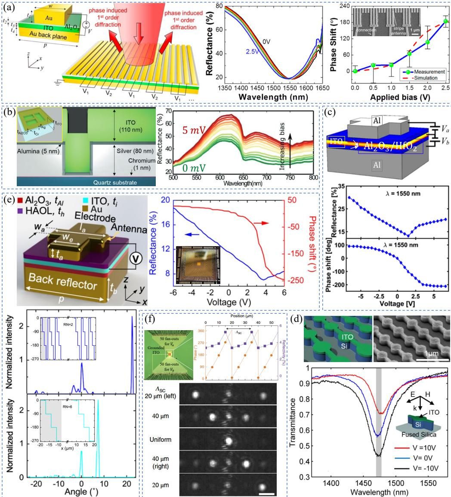

Active metasurfaces based on TCOs. (a) Left: schematic of an active MIM metasurface incorporating ITO. Here, $t_{1}=50$ nm, $t_{2}=5$ nm, $t_{3}=20$ nm, $t_{4}=80$ nm, and w=250 nm. Middle: measured reflectance spectrum of the metasurface under different applied voltages. Right: measured and simulated phase shift at a wavelength of 1573 nm as a function of applied bias. Inset: SEM of stripe antennas. (b) Left: cross-sectional schematic of an Ag metasurface covered with ITO. Inset: schematic of a meta-atom. Right: measured reflectance spectrum under different applied voltages. (c) Top: schematic of the unit cell of a dual-gated metasurface, which consists of an Al back reflector, a bottom gate dielectric, an ITO layer, another gate dielectric, and Al fishbone antennas. Bottom: measured reflectance and phase shift at a wavelength of 1550 nm as a function of applied bias. (d) Top: schematic and SEM of the dielectric metasurface. The thicknesses of the Si and ITO layers are 230 nm and 10 nm, respectively. Bottom: experimental transmittance spectrum of the metasurface under three different applied bias voltages. (e) Top left: schematic of the meta-atom of a 1D SLM. The metasurface consists of an Au back reflector, an $Al_{2}O_{3}$ dielectric layer, an ITO layer, a hafnium oxide/aluminum oxide laminated (HAOL) gate dielectric, and Au fishbone meta-atoms. Here, p=400 nm, $t_{b}=80$ nm, $t_{Al}=9.5$ nm, $t_{i}=5$ nm, $t_{h}=9.5$ nm, $t_{a}=40$ nm, $w_{a}=130$ nm, and $l_{a}=230$ nm. Top right: measured (continued)

(continued) reflectance (blue) and phase shift (red) as a function of applied bias voltage at a wavelength of 1522 nm. Inset: photographic image of the metasurface SLM containing 96 independently addressable elements. Bottom: experimental beam steering results of the metasurface with different spatial phase distributions (inset) corresponding to varying repeat number (RN) values. (f) Top left: optical microscopy image of the active array at the center of the fan-out connections designed to individually control the 50 $V_{a}$ and 50 $V_{b}$ terminals. Scale bar, 1 mm. Top right: reflectance and phase shift distribution of the 1D SLM used for beam steering. $\Lambda_{sc}$ represents the period corresponding to a $2\pi$ phase change in the metagrating. Bottom: intensity profiles for beam steering at five angles: $-3.84^{\circ}$ , $-1.92^{\circ}$ , $0^{\circ}$ , $+1.92^{\circ}$ , and $+3.84^{\circ}$ . Scale bar, 0.03 k 0. (a) Adapted with permission from Huang et al., Nano Lett. 16, 5319–5325 (2016) [718]. Copyright © 2016 American Chemical Society. (b) Adapted with permission from Thyagarajan et al., Adv. Mater. 29, 1701044 (2017) [719]. Copyright © 2017 WILEY-VCH Verlag GmbH & Co. KGaA, Weinheim. (c) Adapted with permission from Kafaie Shirmanesh et al., Nano Lett. 18, 2957–2963 (2018) [720]. Copyright © 2018 American Chemical Society. (d) Reprinted with permission from Howes et al., Optica 5, 787–792 (2018) [721]. Copyright © 2018 Optica Publishing Group. (e) Adapted with permission from Shirmanesh et al., ACS Nano 14, 6912–6920 (2020) [722]. Copyright © 2020 American Chemical Society. (f) Adapted with permission from Park et al., Nat. Nanotechnol. 16, 69–76 (2021) [723]. Copyright © 2021 Springer Nature.

the bottom Au layer, charge accumulation occurs at the $Al_{2}O_{3}/ITO$ interface, enabling efficient electrical modulation of ITO's refractive index and, consequently, the optical response of the metasurface. As shown in the middle and right panels of Fig. 59(a), applying a 2.5 V gate bias resulted in a $\sim30\%$ change in reflectance and a $180^{\circ}$ phase shift. The experimental modulation speed exceeded 10 MHz (with a potential speed of up to 11 GHz). Additionally, a two-level phase grating with a periodicity of 2.4 $\mu$ m operating at a wavelength of 1550 nm was also demonstrated. In 2017, Park et al. [724] experimentally demonstrated $180^{\circ}$ reflection phase tuning based on a similar architecture. In 2019, Zhao et al. [725] employed a similar design but replaced ITO with indium silicon oxide, achieving a maximum relative reflectance change of 57% at a wavelength of 2.73 $\mu$ m. In 2022, Kim et al. [45] demonstrated phase modulation exceeding $137^{\circ}$ in the infrared regime using a similar configuration. In 2023, Atwater's group [726] experimentally verified the thermal robustness of the ITO-integrated MIM metasurface under both continuous-wave and pulsed high-power laser illumination conditions, demonstrating its potential for high-power optical applications.

(II) In 2017, Atwater's group [719] proposed another active reflective metasurface design integrated with ITO, as illustrated in the left panel of Fig. 59(b). The metasurface consists of nanostructured Ag and ITO electrodes separated by a 5 nm-thick $Al_{2}O_{3}$ layer. The transport of silver ions through the $Al_{2}O_{3}$ layer leads to bias-induced nucleation and growth of Ag meta-atoms in the ITO counterelectrode, thereby altering the optical extinction response. As shown in the right panel of Fig. 59(b), the fabricated metasurface exhibited a relative reflectance change of up to 30% in the visible spectral range under an applied bias of only 5 mV.  
(III) In 2018, Forouzmand et al. [727] proposed, through numerical simulations, the use of multigate biasing to further enhance the modulation depth of the ITO-integrated metasurfaces. In the same year, Atwater's group [720] experimentally demonstrated a dual-gated active metasurface operating at a wavelength of $1550~\mathrm{nm}$ . As illustrated in the top panel of Fig. 59(c), a voltage bias $V_{\mathrm{a}}$ is applied between the ITO layer and the meta-atoms, while another voltage bias $V_{\mathrm{b}}$ is applied between the Al back reflector and the ITO layer. Under applied bias, charge accumulation or depletion occurs at both the

top and bottom ITO/gate-dielectric interfaces, leading to a significant variation in the complex refractive index of the ITO layer through carrier density modulation at both interfaces. As shown in the bottom panel of Fig. 59(c), the metasurface demonstrated a continuous phase shift ranging from $0^{\circ}$ to $303^{\circ}$ and a relative reflectance modulation of 89% under an applied voltage bias of 6.5 V.

(IV) Active transmissive metasurfaces integrated with ITO. In 2018, Howes et al. [721] proposed an active Si metasurface integrated with ITO, as illustrated in the top panel of Fig. 59(d). As shown in the bottom panel of Fig. 59(d), the metasurface exhibited a transmittance modulation between 0.71 and 0.42 at a wavelength of $\sim$ 1470 nm. In 2019, Forouzmand et al. [728] proposed an active Si metasurface based on a structure similar to the one shown in Fig. 59(a) (with Au replaced by Si). Numerical simulations verified a phase shift tunability of 240° for the reflected TE-polarized light at a wavelength of 1696 nm and a phase shift tunability of 270° for the transmitted TM-polarized light at 1563 nm.

SLM based on TCOs-integrated metasurfaces. In 2020, Atwater's group [722] experimentally demonstrated a 1D SLM based on the active metasurface unit shown in the top left panel of Fig. 59(e). The SLM had a pitch size of $400\mathrm{nm}$ and consisted of 96 independently addressable metasurface elements. As illustrated in the top right panel of Fig. 59(e), the operating wavelength was chosen to be $1522\mathrm{nm}$ to achieve a phase shift exceeding $270^{\circ}$ with moderate reflectance variation. By electro-optically modulating the phase of the scattered light from each identical metasurface element in the SLM, dynamic beam steering [as shown in the bottom panel of Fig. 59(e)] and reconfigurable light focusing—with varying focal lengths of $1.5\mu \mathrm{m}$ , $2\mu \mathrm{m}$ , and $3\mu \mathrm{m}$ —were demonstrated. In 2024, Atwater's group further applied a similar active MIM metasurface design with two independent electrodes to demonstrate spatiotemporal control over scattered light frequency and wavefront [326], as discussed in Subsection 2.2.7.

In 2021, Park et al. [723] experimentally realized a 1D SLM based on the dual-gate active metasurface shown in Fig. 59(c), as illustrated in the top left panel of Fig. 59(f). The SLM had a pitch size of 5 $\mu$ m and comprised 50 independently addressable metasurface elements. Each metasurface element consisted of 11 Au ridges, whose phase response was controlled by tuning the top and bottom gate voltages, $V_{a}$ and $V_{b}$ , respectively. This configuration enabled a $2\pi$ phase shift modulation at an operating wavelength of 1.34 $\mu$ m, with an estimated modulation speed of 5.4 MHz. The dynamic beam steering demonstration of the fabricated SLM is presented in the top right and bottom panels of Fig. 59(f).

# 8.3. Active Metasurfaces Based on Liquid Crystals

Liquid crystals, a distinct state of matter combining fluidity with partial molecular ordering, bridge the properties of isotropic liquids and crystalline solids. Their optical characteristics are intrinsically linked to self-organized molecular arrangements, which define four primary mesophases: nematic, cholesteric, smectic, and columnar [729]. In the uniaxial nematic phase, the molecules—collectively described by a macroscopic orientation vector termed the director—align parallel to one another, inducing pronounced optical birefringence ( $\Delta n = n_{\mathrm{e}} - n_{\mathrm{o}}$ , where $n_{\mathrm{e}}$ and $n_{\mathrm{o}}$ are the extraordinary and ordinary refractive indices, respectively). For visible wavelengths, $\Delta n$ typically spans 0.2–0.5 in conventional nematic liquid crystals. The orientation of the liquid crystal director can be controlled by external electric fields, enabling dynamic tuning of the birefringence ( $\Delta n$ ) along a specific optical axis. This mechanism facilitates electro-optic modulation through phase retardation and enables arbitrary polarization state control via tailored optical anisotropy.

Electrically tunable metasurfaces through refractive index modulation of liquid crystal. (I) Metasurfaces with meta-atoms encapsulated in liquid crystal. In 2019, Zou et al. [730] experimentally demonstrated a metasurface composed of Si nanocylinders integrated into a nematic liquid crystal cell with a thickness of approximately 5 $\mu$ m. As illustrated in the left panel of Fig. 60(a), when a bias voltage is applied, the alignment of liquid crystal molecules transitions from in-plane to out-of-plane, significantly altering the refractive index for incident light polarized along the x-direction. This enables the electrical modulation of the metasurface's transmittance spectrum, achieving an on/off transmission switching at the operating wavelength of 669 nm.

In 2021, Bosch et al. [731] demonstrated a tunable-focus Si metalens based on a similar architecture. The phase shifts of meta-atoms are modulated by applying a bias voltage to the liquid crystal cell, thereby adjusting the focal length of the metalens. By constructing a meta-atom database featuring diverse geometric shapes, complete phase control across M operating voltages could be achieved. Experimentally, this enabled the realization of an electrically tunable bifocal metalens (M = 2), as shown in Fig. 60(b).

Beyond the aforementioned forward design approach, inverse design methods can further enhance the efficiency of these active metasurfaces [741].

(II) Metasurfaces consisting of paired meta-atoms covered with liquid crystal and poly(methyl methacrylate) (PMMA), respectively. In 2020, Liu's group [732] proposed an active metasurface based on liquid crystal, as illustrated in the left panel of Fig. 60(c). The metasurface unit consisted of a pair of orthogonally arranged rectangular meta-atoms, each covered with a different dielectric medium [PMMA and liquid crystal]. The phase difference between adjacent meta-atoms was the sum of the geometric phase difference ( $\pi$ ) and the propagation phase difference caused by the refractive index contrast of the covering media. The propagation phase difference could be dynamically tuned by applying a voltage to adjust the refractive index of the liquid crystal. When the refractive index of the liquid crystal was tuned to match that of PMMA, the metasurface unit imposed a phase gradient exceeding $k = 2\pi/\lambda$ (where the lattice constant $a < \lambda/2$ ), converting the incident light into an evanescent wave that could not influence the far-field radiation. Furthermore, by rotating the liquid-crystal-covered meta-atoms to impose a geometric phase distribution corresponding to a specific holographic image (while maintaining orthogonality between PMMA-covered meta-atoms and their paired counterparts), a switchable holographic display was achieved. As shown in the middle panel of Fig. 60(c), independent electrode control enabled the on/off switching of seven metasurface holograms, where each metasurface hologram generated a single stripe of the digital pattern (as illustrated in the inset of Fig. 60(c), middle panel). Experimentally, a dynamic numeric indicator display was demonstrated, as shown in the right panel of Fig. 60(c).

In 2021, Liu's group [733] applied a similar architecture to achieve electrically tunable polarization conversion. As shown in Fig. 60(d), the liquid-crystal-covered meta-atoms were rotated clockwise to impose a geometric phase gradient of $\partial \phi / \partial x = k \sin \theta$ , while the adjacent PMMA-covered meta-atoms were rotated counterclockwise to apply an opposite gradient of $-\partial \phi / \partial x = -k \sin \theta$ . As a result, the LCP and RCP components of the reflected light for linearly polarized incidence recombined at $\pm \theta$ directions to restore linear polarization. By controlling the refractive index of the liquid crystal via an applied voltage, the propagation phase difference of the LCP and RCP components along $\pm \theta$ directions could be modulated, thereby enabling dynamic control over the polarization angle of the synthesized linearly polarized light.

Figure 60  
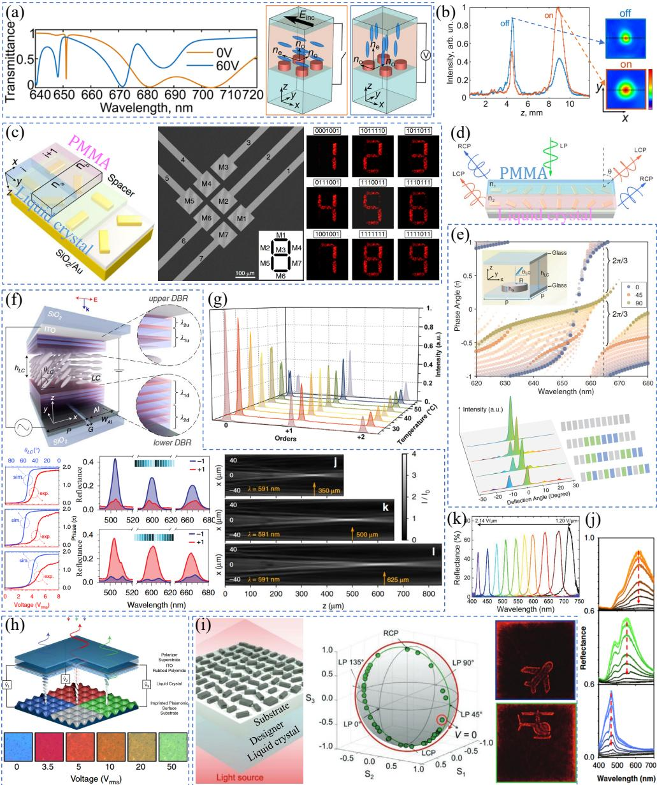

Active metasurfaces based on liquid crystals. (a) Left: measured transmittance spectra of the metasurface under different bias voltages. Middle and right: schematics of liquid crystal molecular orientations in unbiased and biased states, respectively. (b) Left: on-axis intensity profile of a bifocal metalens in the off-state (blue, focal length $f = 4.5 \mathrm{~mm}$ , bias voltage $V = 9.8 V_{\mathrm{pp}}$ , where $V_{\mathrm{pp}}$ denotes peak-to-peak voltage) and on-state (orange, $f = 9 \mathrm{~mm}$ , $V = 2.2 V_{\mathrm{pp}}$ ). Right: measured PSFs for both states. (c) Left: schematic of a reflective metasurface unit cell comprising Au nanorods embedded in a $50 \mathrm{~nm}$ -thick dielectric cladding ( $n = 1.5$ ) with alternating PMMA and liquid crystal columns. Middle: SEM of a dynamically reconfigurable metasurface hologram group controlled by seven independent electrodes. Inset: correlation between individual metasurfaces and their corresponding holographic displays for numeric indicators. Right: experimental holographic images corresponding to 7-bit optical information describing on/off states of the seven metasurfaces. (d) Schematic of a metasurface for dynamic polarization conversion. (e) Top: calculated phase shift of an optimized metatom for normally incident light as a function of liquid crystal director orientation. Here, $h_{\mathrm{a}} = 205 \mathrm{~nm}$ , $h_{\mathrm{LC}} = 1500 \mathrm{~nm}$ , $R = 150 \mathrm{~nm}$ , $p = 360 \mathrm{~nm}$ . Marker (continued)

(continued) colors represent rotation angles, transitioning from blue (in-plane) through orange to yellow-green (out-of-plane), while sizes indicate relative transmittance normalized to the bare liquid crystal layer. The size of the markers in the legend represents 50% transmittance. Inset: meta-atom configuration. Bottom: experimental results of an SLM operating as a tunable-periodicity grating. On the left, the measured diffraction intensities are plotted against deflection angle for various electrode-addressing configurations, as illustrated on the right. Gray patches represent grounded electrodes, blue patches represent biased ones inducing full liquid crystal rotation, and green patches represent intermediate-voltage-level ones. (f) Top: SLM schematic with two units. DBR: distributed Bragg reflector. Bottom left: simulated (blue curves) and measured (red curve) phase shifts at operational wavelengths of 503 nm, 596 nm, and 662 nm (simulated)/ 640 nm (experimental). Bottom middle: measured diffraction efficiencies for main grating orders with voltage patterns illustrated above. Bottom right: measured intensity distributions versus distance from SLM under different voltage patterns at the operating wavelength of 591 nm. (g) Diffraction order intensities (0, +1, +2) versus temperature for a liquid-crystal-infiltrated metagrating. (h) Top: schematic of the liquid-crystal-plasmonic device operating with ambient white light. Bottom: voltage-dependent microscope images of the metasurface. (i) Left: schematic of liquid-crystal-integrated polarization-multiplexed metasurface. Middle: measured output polarization states (green points) on the Poincare' sphere under AC voltages. Right: holographic images at AC voltages of 0.8 V (top) and 1 V (bottom). (j) Measured reflectance spectra for red, green, and blue metasurfaces with respect to the linear polarization axis from 0° to 90°. (k) Reflectance spectra of the liquid crystal cell for target wavelengths as a function of the bias voltage. (a) Adapted with permission from Zou et al., ACS Photonics 6, 1533–1540 (2019) [730]. Copyright © 2019 American Chemical Society. (b) Adapted from Bosch et al., Nano Lett. 21, 3849–3856 (2021) [731]. Copyright © 2021 American Chemical Society. (c) Adapted from [732] under a Creative Commons license. (d) Adapted with permission from Yu et al., Nano Lett. 21, 6690–6695 (2021) [733]. Copyright © 2021 American Chemical Society. (e) Adapted with permission from Li et al., Science 364, 1087–1090 (2019) [734]. Copyright © 2019 American Association for the Advancement of Science. (f) Adapted from [735] under a Creative Commons license. (g) Adapted with permission from Komar et al., ACS Photonics 5, 1742–1748 (2018) [736]. Copyright © 2018 American Chemical Society. (h) Adapted from [737] under a Creative Commons license. (i) Adapted with permission from Kim et al., Adv. Mater. 32, 2004664 (2020) [738]. Copyright © 2020 WILEY-VCH Verlag GmbH & Co. KGaA, Weinheim. (j) Reprinted from [739] under a Creative Commons license. (k) Reprinted from [740] under a Creative Commons license.

(III) Phase-only 1D SLMs based on liquid-crystal-integrated metasurfaces. In 2019, Li et al. [734] experimentally realized a three-phase-level transmissive SLM using a $TiO_{2}$ metasurface coated with a liquid crystal layer, as illustrated in the inset of the top panel of Fig. 60(e). As shown in the top panel of Fig. 60(e), within the wavelength range of 660 nm–670 nm, the meta-atom designed based on the Huygens phase principle (see Subsection 2.1.2) exhibited a uniform phase modulation of $2\pi/3$ at liquid crystal director orientations of $0^{\circ}$ , $45^{\circ}$ , and $90^{\circ}$ (controlled by an applied bias voltage), while maintaining a transmittance of approximately 60–90%. This satisfied the requirements for achieving a three-phase-level phase-only SLM. On this basis, a 1D SLM with a pitch size of $1.08 \mu m$ (where each pitch contained three meta-atoms) was fabricated, consisting of 28 individually addressable electrodes. By selecting different addressing schemes, the SLM could function as a grating with a tunable deflection angle,

as demonstrated in the bottom panel of Fig. 60(e). In 2023, Moitra et al. [742] utilized this architecture to develop a 1D reflective SLM with a small pitch size ( $\sim$ 1 $\mu$ m), operating at a wavelength of 650 nm.

In 2022, Mansha et al. [735] experimentally realized a 1D reflective SLM with 96 independently addressable pixels ( $\sim$ 1 $\mu$ m pitch). As illustrated in the top panel of Fig. 60(f), the metasurface unit comprised two partially reflecting mirrors functioning as top and bottom distributed Bragg reflectors, a top ITO layer serving as a common electrode, a liquid crystal layer, and a set of Al electrodes forming the SLM pixels. The Fabry–Pérot nanocavity design supported multiple resonances across the visible spectrum. As shown in the bottom left panel of Fig. 60(f), under bias voltage control, the unit exhibited 2 $\pi$ phase modulation at different resonance wavelengths simultaneously. Based on this, the SLM enabled multispectral programmable beam steering with an FOV of approximately 18° and absolute efficiencies exceeding 40%, as illustrated in the bottom middle panel of Fig. 60(f). Additionally, a multispectral metalens with tunable focal length and efficiencies of $\sim$ 27% was demonstrated, as shown in the bottom right panel of Fig. 60(f).

Thermally reconfigurable metasurfaces via liquid crystal phase transition. When liquid crystals are heated beyond their clearing point, they undergo a phase transition from a mesophase (such as the nematic phase) to an isotropic liquid phase, resulting in the complete disappearance of optical anisotropy. In 2018, Komar et al. $[736]$ built a liquid crystal cell with a thickness of 5 $\mu$ m on a propagation phase Si metagrating. By heating the liquid crystal cell, they achieved the switching of a laser beam from a 12° to a 0° angle with an efficiency of 50%, as illustrated in Fig. 60(g). In the same year, using the same architecture, Bohn et al. $[743]$ demonstrated a thermally induced resonance shift in the transmittance spectrum of a Si nanodisk metasurface. This effect was utilized to tune the spontaneous emission spectrum of a fluorescent glass by modifying the local photonic density of states through temperature-controlled resonance tuning.

Polarization-multiplexed metasurfaces embedded with liquid crystals. Liquid crystals allow for facile and repeatable manipulation of the polarization state of light. By integrating liquid crystals with polarization-multiplexed metasurfaces, the polarization state of the incident light can be dynamically controlled, and the metasurface performs different functions depending on the incident polarization. This enables electrically tunable active metasurfaces for applications such as dynamic holography $[738,744–747]$ , tunable nanoprinting $[737,739,745,748]$ , focus-tunable lenses $[744,749,750]$ , and switchable enhancement of nonlinear effects $[751]$ . The design methods for polarization-multiplexed metasurfaces have been detailed in Subsections 2.1.5 and 5.2.1.

In 2017, Franklin et al. [737] demonstrated a single-pixel full-color display based on liquid-crystal-controlled plasmonic resonance, as shown in the top panel of Fig. 60(h). The nanostructured Al surface exhibited a surface roughness with grain diameters of approximately 30 nm, inducing polarization-dependent grating-coupled surface plasmons. Under zero bias, the device displayed two orthogonal color states determined by the polarization of incident light relative to the liquid crystal director—blue for parallel alignment and red for perpendicular orientation. By applying a low voltage, the orientation of the liquid crystal across the cell could be controlled, leading to a superposition of the surface's two orthogonal color states. At higher voltages, the bulk liquid crystal became vertically saturated, while the liquid crystal near the surface began to reorient, increasing the effective refractive index experienced by the resonant mode. This dual-phase modulation mechanism enabled full RGB color generation through voltage-dependent resonance tuning, as illustrated in Fig. 60(h).

In 2020, Rho's group [738] utilized a liquid-crystal-integrated metasurface to realize a stimuli-responsive dynamic holographic image, as shown in the left panel of Fig. 60(i). The Si metasurface, designed using the method (I) in Subsection 5.2.1, enabled holographic display with LCP/RCP multiplexing. A designer liquid crystal layer with a thickness of $10\mu \mathrm{m}$ was integrated into the metasurface hologram to control the incident polarization state (LCP or RCP) via applied bias voltage, as illustrated in the middle panel of Fig. 60(i). When an alternating current (AC) voltage of $0.8\mathrm{V}$ (for LCP) or $1\mathrm{V}$ (for RCP) was applied, the generated holographic images are shown in the right panel of Fig. 60(i). In addition, the heat- and touch-responsive dynamic holographic displays were also demonstrated based on the similar principle. Utilizing the same approach, in 2021, Rho's group [749] further demonstrated an electrically tunable bifocal metalens. In 2022, Ou et al. [750] extended this approach by utilizing the method (I) for the multi-wavelength achromatic metalens design introduced in Subsection 4.4.4, achieving an electrically tunable bifocal metalens that eliminated chromatic aberration at three wavelengths of $450\mathrm{nm}$ , $532\mathrm{nm}$ , and $635\mathrm{nm}$ . In 2024, Wang et al. [746] introduced a pixelated liquid crystal layer to create specific LC director distributions, enabling versatile and tunable vectorial holography. This approach allowed independent and arbitrary modulation of both polarization and amplitude at different spatial positions.

By leveraging the polarization-sensitive transmittance/reflectance spectra of anisotropic metasurfaces, switchable $[748]$ or continuously tunable $[739]$ structural colors can be achieved. Based on a similar architecture to the one shown in Fig. 60(i), in 2022, Badloe et al. $[739]$ utilized the polarization-sensitive characteristics of Mie resonances to realize an electrically tunable metasurface capable of displaying saturated red, green, and blue pixels. These pixels could be continuously controlled between on and off states, as illustrated in Fig. 60(j).

In addition to functioning as a polarization modulator, the liquid crystal layer can also act as a wavelength modulator, selectively exhibiting narrow-bandwidth Bragg reflection and allowing the reflection wavelength to be controlled by an applied bias voltage. In 2024, Kim et al. [740] combined a wavelength-multiplexed metasurface with a micro-thick liquid crystal layer sandwiched between two glass substrates to create a stimuli-responsive wavelength modulator for dynamic holographic displays. The voltage-controlled wavelength modulation is depicted in Fig. 60(k).

# 8.4. Active Metasurfaces Based on Phase Change Materials

Active metasurfaces based on vanadium dioxide. Vanadium dioxide ( $VO_{2}$ ) is a transition metal oxide with a unique crystalline structure that undergoes significant structural changes under different temperatures, leading to abrupt variations in its physical properties $[752,753]$ . The most notable characteristic of $VO_{2}$ is its reversible metal-insulator transition. When the temperature rises above the critical point of approximately $68^{\circ}$ , $VO_{2}$ transitions from an insulating monoclinic phase to a metallic tetragonal phase; when the temperature decreases, it reverts to the insulating phase. This phase transition can be triggered by Joule heating through an electrical tuning mechanism $[754–758]$ , which is crucial for enabling complex functionalities such as phased arrays. During this transformation, the optical properties of $VO_{2}$ change dramatically. Alternatively, the transition can also be induced by laser heating $[758]$ . For instance, in the infrared spectrum, $VO_{2}$ in its insulating phase allows infrared light to pass through, whereas in its metallic phase, it strongly reflects infrared light. Leveraging this property, depositing a $VO_{2}$ layer onto an MIM metasurface and using electrodes near the metasurface to control Joule heating enables dynamic switching.

Figure 61  
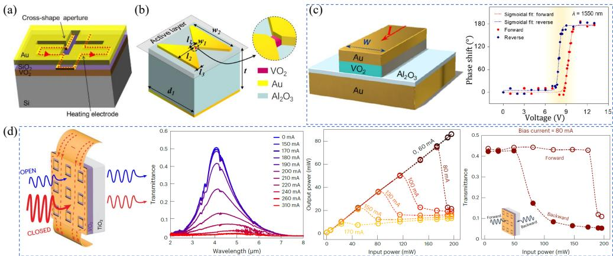

Active metasurfaces based on vanadium dioxide. (a) Schematic of an electrically tunable metasurface unit designed for beam steering. (b) Schematic of an addressable electrically tunable metasurface unit. (c) Left: schematic of an MIM metasurface unit incorporating $VO_{2}$ . Right: continuously tunable phase shift of the metasurface as a function of the applied voltage. (d) First column: schematic of an electrically driven active metasurface. The Au meta-atom array, which also serves as a heater, is positioned on top of a $VO_{2}$ thin film deposited on a $TiO_{2}$ substrate. Second column: transmittance spectra of the metasurface under different bias currents. Third column: output versus input optical power curves of the metasurface under different bias currents, demonstrating its application in optical limiting. Fourth column: transmittance spectra of the metasurface under forward and backward incidence when operating as a nonreciprocal optical isolator at a bias current of 80 mA. (a) Reprinted from [754] under a Creative Commons license. (b) Reprinted from [757] under a Creative Commons license. (c) Reprinted with permission from Kim et al., Nano Lett. 19, 3961–3968 (2019) [755]. Copyright © 2019 American Chemical Society. (d) Adapted with permission from Kang et al., Nat. Photonics 18, 74–80 (2024) [758]. Copyright © 2024 Springer Nature.

between two states: on ( $VO_{2}$ in the insulating phase, high transmission, allowing the metasurface to function) and off ( $VO_{2}$ in the metallic phase, high reflection, effectively turning the device into a mirror) [756].

In 2016, Hashemi et al. [754] experimentally demonstrated beam steering based on an Au metasurface, as illustrated in Fig. 61(a). By utilizing the temperature gradient generated by the current distribution in the Au layer, the metasurface induced a phase gradient, achieving a beam deflection tuning range of up to $\pm22^{\circ}$ at an operating frequency of 100 GHz. In 2022, Chen et al. [757] experimentally demonstrated beam steering at an operating frequency of 0.425 THz using an addressable metasurface, as shown in Fig. 61(b), achieving beam deflection over a $42.8^{\circ}$ angular range. In 2019, Kim et al. [755] realized an active MIM metasurface, as illustrated in the left panel of Fig. 61(c), where the temperature was modulated by controlling the current flowing through Au stripes. Experimentally, they demonstrated electrically tunable phase modulation of the reflected light over a bandwidth ranging from 1515 nm to 1575 nm, with the phase shift at 1550 nm shown in the right panel of Fig. 61(c). The maximum phase tuning range reached $250^{\circ}$ at 1520 nm. Additionally, at an operating wavelength of 1680 nm, the metasurface exhibited a maximum reflectance modulation range of 23.5%. In 2024, King et al. [758] demonstrated mid-infrared optical switching, limiting, and nonreciprocal isolation using an active metasurface, as illustrated in the first column of Fig. 61(d).

(1) Optical switching: As shown in the second column of Fig. 61(d), different bias currents induced varying temperatures, enabling the $VO_{2}$ layer to switch between a high-transmittance (on) state and a high-reflectance (off) state.  
(2) Optical limiting: As depicted in the third column of Fig. 61(d), incident light converted optical energy into thermal energy, raising the temperature of the $VO_{2}$ layer and thus driving the metasurface transmittance from high to low. If an additional bias current was applied, the threshold for this limiting effect became tunable, as the applied current reduced the optical intensity required to trigger the $VO_{2}$ phase transition.  
(3) Nonreciprocal isolation: As shown in the fourth column of Fig. 61(d), the metasurface exhibited asymmetric absorption for forward and backward incident light. Consequently, the optical intensity thresholds required to induce the $VO_{2}$ phase transition differed for forward and backward illumination. When the incident light intensity was between these two thresholds, the metasurface functioned as an optical isolator.

Active metasurfaces based on phase change chalcogenides. Chalcogenide phase-change materials are a class of functional materials based on chalcogen elements (S, Se, Te), known for their reversible phase transition between amorphous and crystalline states, which can be triggered by external energy sources such as electrical pulses. This rapid, energy-induced transition makes them ideal for active metasurface applications. The chalcogenide phase-change materials used in active metasurfaces include germanium antimony telluride (GST) [759–761], $Ge_{2}Sb_{2}Se_{4}Te$ (GSST) [762,763], $Sb_{2}Se_{3}$ [764], and $Sb_{2}S_{3}$ [765].

(I) Using chalcogenide phase-change materials as meta-atom materials. In 2021, Zhang et al. [762] proposed an active metasurface design, as illustrated in Fig. 62(a), consisting of a metal heater (which also serves as a reflector), two electrodes, and an array of GSST meta-atoms. When a long, low-voltage pulse is applied, Joule heating triggers the GSST meta-atoms to transition into the crystalline state. Conversely, applying a short, high-voltage pulse induces a melt-quench process that re-amorphizes the meta-atoms. Due to the significant optical property contrast between the crystalline and amorphous states of GSST, this enables bi-state reflectance tuning of the metasurface, as shown in Fig. 62(b). Similarly, as depicted in Fig. 62(c), a metagrating can be designed such that the diffraction order with the highest efficiency differs between the crystalline and amorphous states of GSST, enabling reconfigurable beam steering. Following the same principle, Wang et al. [759] designed an active metasurface based on GST, as illustrated in Fig. 62(d), which can also switch between crystalline and amorphous states under the same voltage pulse conditions, leading to the reflectance spectrum modulation shown in Fig. 62(e). In 2022, Abdollahramezani et al. [760] experimentally implemented the metasurface design shown in Fig. 62(a), achieving a reflectance ratio of 11 between the amorphous and crystalline states of the GST-based metasurface at the operating wavelength. Additionally, the switching speed has the potential to reach several kHz.

(II) Integrating metasurfaces with a chalcogenide phase-change material layer. In 2024, Fang et al. [764] introduced a 20 nm-thick $Sb_{2}Se_{3}$ layer into a quasi-BIC Si metasurface, as shown in Fig. 62(f). This enabled pure phase modulation of $0.2\pi$ , with transmittance variations of less than 10% between the crystalline and amorphous states, as illustrated in Fig. 62(g). Notably, this phase modulation was 10 times greater than that of a standalone $Sb_{2}Se_{3}$ film. Experimental results demonstrated that the metasurface maintained stable performance after over 1000 switching cycles. Based on

Figure 62  
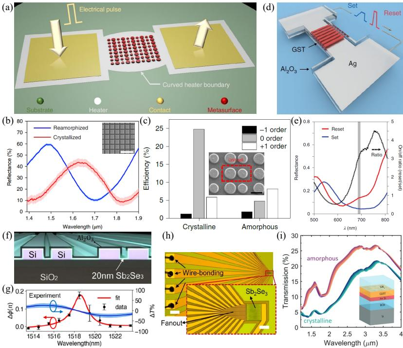

Active metasurfaces based on phase-change chalcogenides. (a) Schematic of an electrically tunable reflective metasurface based on phase-change materials. (b) Measured reflectance spectra of a GST isotropic metasurface in its crystalline and amorphous states. The shaded area represents the standard deviation of measurements over up to 40 switching cycles. Inset: SEM of the metasurface. Scale bar, 2 $\mu$ m. (c) Measured diffraction efficiencies of different orders for a GST metagrating in its crystalline and amorphous states. Inset: SEM of the metagrating. Scale bar, 1 $\mu$ m. (d) Schematic of another electrically tunable reflective metasurface based on phase-change materials. (e) Measured reflectance spectra of the metasurface shown in (d) in its crystalline (set) and amorphous (reset) states. (f) Schematic of an electrically tunable transmissive metasurface based on phase-change materials. (g) Measured changes in phase shift $\Delta\phi$ and transmittance $\Delta T$ at different wavelengths for the metasurface shown in (f) in its crystalline and amorphous states. The error bars indicate the standard deviation of measurements over three switching cycles. (h) Optical micrograph of a 1D SLM consisting of 17 pixels, where each channel is wire-bonded to a printed circuit board. Scale bar, 200 $\mu$ m. Inset: enlarged optical micrograph of a local region. Scale bar, 20 $\mu$ m. (i) Measured transmittance spectra of the metasurface shown in the inset in its crystalline and amorphous states. Inset: schematic of another electrically tunable transmissive metasurface based on phase-change materials. BOX, buried oxide. (a), (b), and (c) Adapted with permission from Zhang et al., Nat. Nanotechnol. 16, 661–666 (2021) [762]. Copyright © 2021 Springer Nature. (d) and (e) Reprinted with permission from Wang et al., Nat. Nanotechnol. 16, 667–672 (2021) [759]. Copyright © 2021 Springer Nature. (f), (g), and (h) Adapted with permission from Fang et al., ACS Nano 18, 11245–11256 (2024) [764]. Copyright © 2024 American Chemical Society. (i) Adapted from [763] under a Creative Commons license.

this, a preliminary demonstration of a 1D SLM composed of 17 independently electrically controlled pixels, each 1.8 $\mu$ m in size, was achieved, as shown in Fig. 62(h). In the same year, Sha et al. [765] experimentally integrated a chiral quasi-symmetry-protected BIC metasurface with a 30 nm layer of $Sb_{2}S_{3}$ , where the phase transition

of $Sb_{2}S_{3}$ between its amorphous and crystalline states enabled a stable chirality continuum ranging from CD = -0.947 to CD = 0.958. Also in 2024, Popescu et al. [763] integrated a 370 nm-thick GSST layer onto an $SiN_{x}$ metasurface, achieving electrically controlled switching of the transmittance spectrum between crystalline and amorphous states, as shown in Fig. 62(i). Experimental results confirmed that the device supported up to 1250 switching cycles.

# 8.5. Active Metasurfaces Based on Electro-Optic Effect

The electro-optic effect refers to the phenomenon in which a dielectric material undergoes polarization under an external electric field, leading to linear or nonlinear changes in its optical dielectric tensor. Based on the dependence of polarization on the electric field, the effect can be categorized into the first-order electro-optic effect (Pockels effect), which exhibits a linear response and occurs only in non-centrosymmetric crystals such as lithium niobate, and the second-order electro-optic effect (Kerr effect), which exhibits a quadratic nonlinear response and is present in all dielectric materials.

By integrating electro-optic materials into metasurfaces—such as using them as the dielectric layer in the MIM structure $[766–769]$ , as meta-atoms $[770,771]$ , or as a cladding medium $[772]$ —and leveraging high-Q-factor resonant modes within the metasurface, significant dynamic optical field modulation can be achieved near the resonance wavelength.

(I) Metasurfaces integrated with an electro-optic material layer. In 2021, Damgaard-Carstensen et al. [766] experimentally demonstrated an active MIM Fresnel lens using lithium niobate as the dielectric layer material, as shown in the left panel of Fig. 63(a). By leveraging the sensitivity of the MIM metasurface response to the dielectric layer, the refractive index of the lithium niobate layer was electrically tuned, enabling dynamic control over the lens's focusing efficiency, as shown in the right panel of Fig. 63(a). Based on the same architecture, in 2022, Weiss et al. [767] experimentally demonstrated dynamic reflectance modulation of an Al nanodisk metasurface coated with ITO. By applying an electric bias to a 480 nm-thick lithium niobate film, the resonance wavelength of the metasurface was tuned, achieving a maximum reflectance modulation depth of 42% at a driving voltage of ±25 V. In 2023, Damgaard-Carstensen et al. [768] further introduced the guided mode resonance into this architecture (with a lithium niobate film thickness of 300 nm) through meticulous metasurface design, achieving a maximum modulation depth of 42% at a driving voltage of ±10 V at a wavelength of 895 nm. In the same year, Zhang et al. [769] integrated this architecture into a fiber facet, realizing a metafiber electro-optic modulator, as shown in the top panel of Fig. 63(b). The electro-optic polymer used was a mixture of chromophore and PMMA. As shown in the bottom panel of Fig. 63(b), the metafiber enabled dual-band operation in the telecom O-band and S-band, with a maximum modulation depth of 11% at a wavelength of 1287 nm. The modulation speed reached approximately 1 GHz at a bias voltage of ±9 V.

(II) Metasurfaces with meta-atoms incorporating electro-optic materials. In 2021, Weigand et al. [770] proposed an active metasurface using lithium niobate as the meta-atom material, as shown in the left panel of Fig. 63(c), achieving MHz-level modulation speed. The modulation of the metasurface transmittance spectrum under different bias voltages is shown in the right panel of Fig. 63(c). Notably, the transmittance modulation was enhanced by a factor of 80 compared to an unstructured substrate. In 2022, Klopfer et al. [771] proposed the active metasurface shown in the top panel of Fig. 63(d). By introducing periodic structural perturbations into the metagrating, the guided mode resonance with a quality factor exceeding 30,000 was generated. Numerical simulations indicated that with an applied bias voltage within $\pm 25\mathrm{V}$ , a nearly $2\pi$ phase modulation was achieved at the resonance wavelength while

Figure 63  
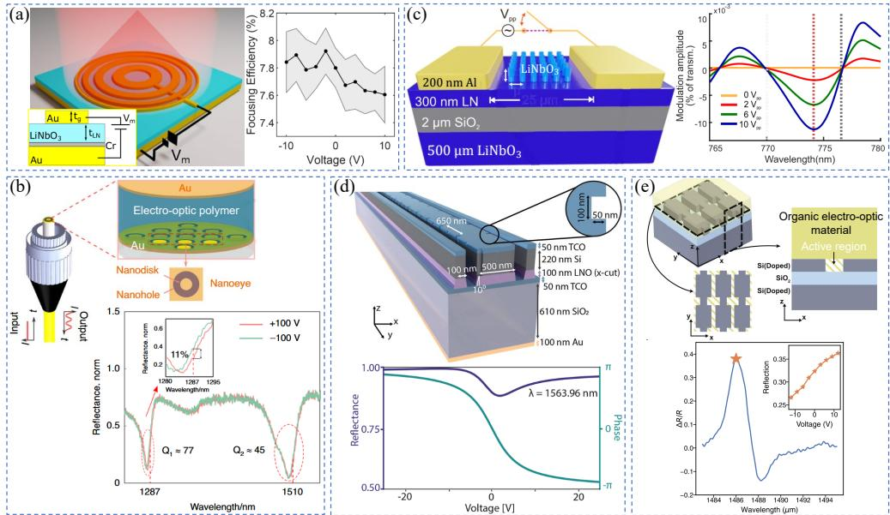

Electro-optically tunable metasurfaces. (a) Left: schematic of an electrically tunable Fresnel lens based on lithium niobate. Inset: cross-sectional diagram showing a semitransparent Au ring deposited on a thin lithium niobate film, adhered to an Au back-reflector by a thin chromium adhesive layer. The layer thicknesses are $t_{g} = 15$ nm and $t_{LN} = 300$ nm. Right: measured focusing efficiency as a function of the modulation voltage at a wavelength of 865 nm. The shaded region represents the linearly interpolated standard deviation of the mean value, derived from repeated measurements. (b) Top: schematic of a metafiber electro-optic modulator. Bottom: reflectance spectra of the metafiber under a bias voltage of $\pm 100$ V. (c) Left: schematic of a lithium niobate metasurface. Right: dependence of the transmittance modulation amplitude on the peak-to-peak AC voltage, varying from $0 V_{pp}$ to $10 V_{pp}$ , at a driving frequency of 180 kHz. $V_{pp}$ represents the peak-to-peak voltage. (d) Top: schematic of an integrated lithium niobate metasurface based on guided mode resonance. Bottom: simulated reflectance and phase shift of the metasurface as functions of the bias voltage at a wavelength of 1563.96 nm. (e) Top: schematic of a metasurface coated with an organic electro-optic material. Bottom: measured maximum modulation ratio, $\Delta R / R = (R_{\mathrm{max}} - R_{\mathrm{min}}) / R_{V=0}$ , for each wavelength. Inset: reflectance as a function of bias voltage, swept from -12 V to 12 V at a wavelength of 1486 nm. (a) Adapted with permission from Damgaard-Carstensen et al., ACS Photonics 8, 1576–1581 (2021) [766]. Copyright © 2021 American Chemical Society. (b) Adapted from [769] under a Creative Commons license. (c) Adapted with permission from Weigand et al., ACS Photonics 8, 3004–3009 (2021) [770]. Copyright © 2021 American Chemical Society. (d) Adapted with permission from Klopfer et al., Nano Lett. 22, 1703–1709 (2022) [771]. Copyright © 2022 American Chemical Society. (e) Adapted from [772] under a Creative Commons license.

maintaining a reflectance of over 91%, as shown in the bottom panel of Fig. 63(d). Based on this, two active devices were demonstrated in simulations: a switchable beam splitter with a deflection angle of $51^{\circ}$ and a diffraction efficiency of 93%, as well as an angle-tunable beam steerer covering an angular range of $18^{\circ}$ to $31^{\circ}$ with an efficiency of up to 86%.

(III) Metasurfaces with a cladding medium made of electro-optic materials. In 2024, Zheng et al. [772] adopted the electrode design shown in Fig. 65(b) [773] and

proposed the active metasurface illustrated in the top panel of Fig. 63(e). An organic electro-optic material was filled into the narrow gaps of slot-mode metasurfaces with high Q-factors, enabling efficient tunability at low voltages. Experimentally, the modulation of the metasurface reflectance at different wavelengths is shown in the bottom panel of Fig. 63(e).

# 8.6. Active Metasurfaces Based on Chemical Reactions

Active metasurfaces based on the lithiation and delithiation. In 2022, Eaves-Rathert et al. [774] designed an MIM metasurface using $TiO_{2}$ as the dielectric layer material, as illustrated in the inset of Fig. 64(a). By applying a voltage between the metasurface and the counter electrode, lithium ions can reversibly transform $TiO_{2}$ into $Li_{0.5}TiO_{2}$ , resulting in significant changes in the optical properties of the dielectric layer, as shown in Fig. 64(a). This enables functionalities such as electrically controlled structural color switching.

In the same year, Yang et al. [775] arranged Si meta-atoms of varying heights on a glass substrate coated with an Ag layer (serving as a mirror) to display different structural colors. By applying a voltage, the meta-atom material can be reversibly converted between Si and $Li_{x}Si$ . Moreover, due to the stability of $Li_{x}Si$ , the intermediate states between these conversions can be maintained. Based on this mechanism, the electrically tunable nanoprinting was realized, as shown in Fig. 64(b).

Active metasurfaces based on hydride-loading transition metal. Under certain conditions, magnesium (Mg) can react with hydrogen gas to form magnesium hydride (MgH $_2$ ), undergoing a phase transition from metal to dielectric. When exposed to oxygen, MgH $_2$ can revert back to Mg. Leveraging this property, Liu's group has designed various active metasurfaces for dynamic control of chirality, nanoprinting, and holography [776–779,783–785].

In 2016, Liu's group [776] demonstrated a metasurface capable of dynamically switching chirality through hydrogenation and dehydrogenation, as shown in Fig. 64(c). As illustrated in the inset of Fig. 64(c), the metasurface unit cell consists of four Mg meta-atoms (160 nm × 160 nm × 75 nm) and four Au meta-atoms (100 nm × 100 nm × 80 nm) arranged on a glass substrate. The Mg particles are coated with a 5 nm titanium spacer and a 10 nm palladium layer. Here, palladium acts as a catalyst, dissociating molecular hydrogen into atomic hydrogen, while titanium serves as a spacer to prevent alloying between Mg and palladium and to mitigate mechanical stress caused by volume expansion due to hydrogen absorption.

In 2017, Liu's group [777] employed an Mg metasurface to realize a dynamic nanoprinting. By adjusting the size and lattice constant of square pillar Mg meta-atoms, various structural colors were generated for nanoprinting. These structural colors originate from the resonance of the Mg meta-atoms and disappear when Mg is converted into $\mathrm{MgH_2}$ . Consequently, the nanoprinting metasurface's colors can be erased or restored by introducing hydrogen or oxygen gas, respectively, as shown in Fig. 64(d). Using another type of meta-atom structure, the reverse process can also be achieved, where introducing oxygen and hydrogen corresponds to color erasure and restoration, respectively [783]. Furthermore, by controlling the sequential chemical reactions of different regions of the nanoprinting metasurface with hydrogen or oxygen, specific color-erasure and restoration animations can be generated [777].

In 2018, Liu's group, in collaboration with Zhang's group [778], implemented dynamic holographic displays using geometric phase metasurfaces based on Mg meta-atoms. As shown in the top panel of Fig. 64(e), the efficiency of the meta-atom drops to nearly zero when Mg is converted into $MgH_{2}$ , enabling on-off control of the holographic image. As illustrated in the middle panel of Fig. 64(e), when Mg meta-

Figure 64  
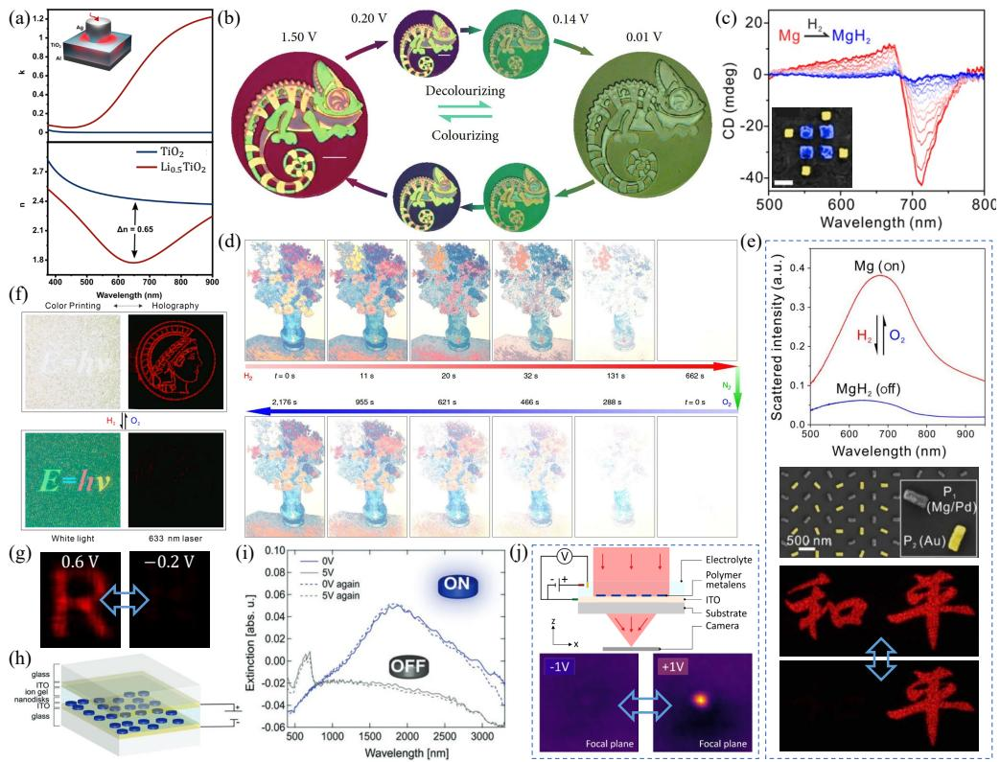

Active metasurfaces based on chemical reactions. (a) Refractive index and absorption coefficient spectra of $TiO_{2}$ and $Li_{0.5}TiO_{2}$ . Inset: schematic of an MIM metasurface with $TiO_{2}$ as the dielectric layer material. (b) Voltage-controlled dynamic display of an Si nanoprinting metasurface. (c) Time-dependent evolution of the experimentally measured circular dichroism spectra of the metasurface after hydrogen loading. Spectra were recorded continuously at 10 min intervals. Inset: SEM of the metasurface unit cell. Scale bar, 200 nm. (d) Optical micrographs of a nanoprinting metasurface during hydrogenation and dehydrogenation, demonstrating the dynamic process of color erasure and recovery. (e) Top: measured scattering spectra of Mg and $MgH_{2}$ meta-atoms. Middle: SEM of the metasurface, with Au meta-atoms highlighted in yellow. Inset: enlarged SEM of a metasurface unit cell (600 nm × 600 nm). Bottom: Holographic display of the metasurface under oxygen (top) and hydrogen (bottom) environments. The right-side Chinese character in the holographic image is generated by the Au meta-atom array, while the left-side character is generated by the $Mg/MgH_{2}$ meta-atom array. (f) Switching between nanoprinting and holographic display functions of the metasurface controlled by hydrogenation and dehydrogenation. (g) Experimental demonstration of dynamic holographic display of a metasurface by electrochemically tuning the state of PANI under different applied voltages. (h) Schematic of an electrically tunable metasurface featuring conducting polymer nanodisks on an ITO electrode, controlled electrochemically via a transparent ion gel and a top ITO electrode. The diameter of the meta-atom is 145 nm, and the height is 65 nm. (i) Extinction spectra of the metasurface described in (h) under applied voltages of 0 V and 5 V. The dashed lines indicate the excellent reversibility of the metasurface upon repeated switching. (j) Top: schematic of the experimental setup for an electrically tunable metalens. An electrochemical three-electrode system is used to tune the applied voltage via cyclic voltammetry. Bottom: camera images of the focal plane of the metalens under different applied voltages. (a) Adapted with permission from Eaves-Rathert et al., Nano Lett. 22, 1626–1632 (2022) [774]. Copyright © 2022 (continued)

(continued) American Chemical Society. (b) Reprinted from [775] under a Creative Commons license. (c) Adapted with permission from Duan et al., Nano Lett. 16, 1462–1466 (2016) [776]. Copyright © 2016 American Chemical Society. (d) Reprinted from [777] under a Creative Commons license. (e) Adapted from [778] under a Creative Commons license. (f) Reprinted from [779] under a Creative Commons license. (g) Adapted from [780] under a Creative Commons license. (h) and (i) Reprinted from [781] under a Creative Commons license. (j) Adapted from [782] under a Creative Commons license.

atoms are alternately arranged with chemically stable Au meta-atoms using spatial multiplexing, the two meta-atom arrays generate distinct holographic images, resulting in the dynamic display shown in the bottom panel of Fig. 64(e). More complex holographic display effects can be achieved through sophisticated designs combining Au and Mg meta-atoms [784].

In 2020, Liu's group, in collaboration with Duan's group [779], designed an Mg-based meta-atom that exhibited phase modulation in the metallic state and amplitude modulation in the hydride state, which enabled dynamic switching between nanoprinting and holographic display functionalities, as demonstrated in Fig. 64(f).

Active metasurfaces based on conducting polymers. Conductive polymers can reversibly switch between a lower-conducting reduced state and a highly conducting oxidized state through electrochemical redox reactions. This transition is usually accompanied by significant modulation of optical properties, including shifts in absorption spectra, changes in refractive index (due to free carrier density variations), and dynamic color switching. This makes them promising electrically tunable active materials for metasurfaces. Typical conductive polymer materials used in active metasurfaces include polyaniline (PANI) $[780,786,787]$ , poly(3,4-ethylenedioxythiophene) (PEDOT) $[787]$ , PEDOT:sulfate (PEDOT:Sulf) $[781,788]$ , and PEDOT:poly(styrene sulfonate) (PEDOT:PSS) $[782,789]$ .

In 2021, Kaissner et al. [780] designed a geometric phase metasurface hologram using Au nanorods locally conjugated with PANI as meta-atoms, demonstrating electrically switchable holographic displays, as shown in Fig. 64(g). This effect relies on the dynamic optical property of PANI, which exhibits minimal absorption in the visible and near-infrared wavelength regions when in its reduced state (placing the metasurface in the “on” state) but exhibits strong absorption in its oxidized state (turning the metasurface “off”). Experiments showed that the metasurface achieved a fast switching speed of approximately 35 ms and maintained its functionality over 100 switching cycles without significant degradation. Interestingly, when PANI was replaced with PEDOT, the switching behavior was reversed: the metasurface was in the “off” state when PEDOT was reduced and in the “on” state when PEDOT was oxidized. Based on this, for two metasurfaces utilizing PANI and PEDOT that are placed adjacent to each other, by applying a voltage to switch the conductive polymers between their oxidized and reduced states, only one metasurface remained in the “on” state at a time, enabling electrically tunable switching between their respective functions [787]. In 2022, Karki et al. [781] developed a metasurface using PEDOT:Sulf as the meta-atom material, achieving dynamically tunable extinction spectra, as shown in Figs. 64(h) and 64(i). Further improvements in metasurface structural design enabled more pronounced extinction spectrum variations [788]. In the same year, Karst et al. [782] employed PEDOT:PSS as the meta-atom material to create a metalens with a voltage-controlled on/off switching, as shown in Fig. 64(j). The experimental switching speed reached up to 33 Hz. In 2023, Jong et al. [789] extended this architecture to realize a

switchable metagrating. In 2024, Lu et al. [786] designed a propagation phase metagrating based on Si meta-atoms coated with PANI. When PANI was in its oxidized (reduced) state, the diffraction order with the highest efficiency was the zeroth (first) order, thereby enabling electrically tunable beam steering.

# 8.7. Nano-Mechanically Tunable Metasurfaces

The micro-electro-mechanical system (MEMS) and nano-electro-mechanical system (NEMS) enable dynamic optical field manipulation by converting electrical signals into structural reconfiguration of metasurfaces through actuation mechanisms such as electrostatic and piezoelectric control.

(I) Metasurfaces with a tunable gap thickness between meta-atoms and the substrate. In 2019, Brongersma's group $[790]$ proposed a MEMS-based active metasurface, as illustrated in the top panel of Fig. 65(a). Utilizing silicon-on-insulator technology, an array of Si meta-atoms with a height of $\sim100$ nm was suspended above a Si substrate. The electrostatic and capacitive coupling between the suspended metasurface and the substrate enabled vertical displacement of the meta-atom array by several hundred nanometers under low actuation voltage. By coupling the Mie resonances of the meta-atoms with the Fabry–Pérot resonances formed between the substrate and the meta-atom array, the structure exhibited vivid colors under white light reflection. As shown in the left panel of Fig. 65(a), metasurface pixels with distinct resonance peaks in the yellow and red spectral ranges achieved temporal color mixing by modulating the duty cycle of the input voltage bias. Additionally, tuning the gap between meta-atoms and the substrate allowed for dynamic phase modulation of reflected light, enabling electrically tunable wavefront control. Based on this, an active metagrating for dynamic beam steering and an active 1D metalens for dynamic light focusing were experimentally demonstrated, as shown in the middle right and bottom right panels of Fig. 65(a), respectively. Experimental results showed that the modulation speed exceeded 100 kHz.

(II) Metasurfaces with tunable meta-atom spacings. In 2021, Faraon's group [773] proposed a NEMS-based suspended metagrating, as illustrated in Fig. 65(b). The metagrating consisted of paired Si nanorods, each of which was connected to a Au electrode on one side. Under electrostatic actuation, the nanorods could shift in position along the direction indicated by the black arrows, enabling dynamic tuning of the spacing between the rods. The modulation speed reached up to 10 kHz. To ensure structural stability, the underlying $SiO_{2}$ layer is partially etched at 300 nm to create suspension conditions, with the anchors supported by the remaining $SiO_{2}$ layer. This configuration enabled electrically tunable reflectance spectrum modulation, as shown in Fig. 65(c). Additionally, as illustrated in Fig. 65(d), fine-tuning of the grating structure allowed for dynamic control of the metasurface's chirality [791]. Furthermore, adjusting the metagrating parameters enabled operation in a high-Q-factor regime, making its electromagnetic response highly sensitive to mechanical displacement [797]. In 2022, Faraon's group [792] further optimized the electrode design of the metagrating. They implemented a scheme where four distinct voltage biases ( $V_{1}, V_{2}, V_{3}, V_{4}$ ) were periodically applied to every four pairs of nanorods, significantly enhancing the dynamic optical field modulation capability. The diffraction patterns of the metagrating under different voltage biases are shown in Fig. 65(e). We note that, to improve the diffraction efficiency of the target $-1^{st}$ order, the metagrating adopted an asymmetric structure, as depicted in the inset of Fig. 65(e).

(III) MIM metasurfaces with a tunable dielectric (air) layer. In 2021, the Bozhevolnyi group, in collaboration with the Dirdal group $[793]$ , proposed an active metasurface system based on a piezoelectric MEMS mirror, as shown in the left panel of Fig. 65(f).

Figure 65  
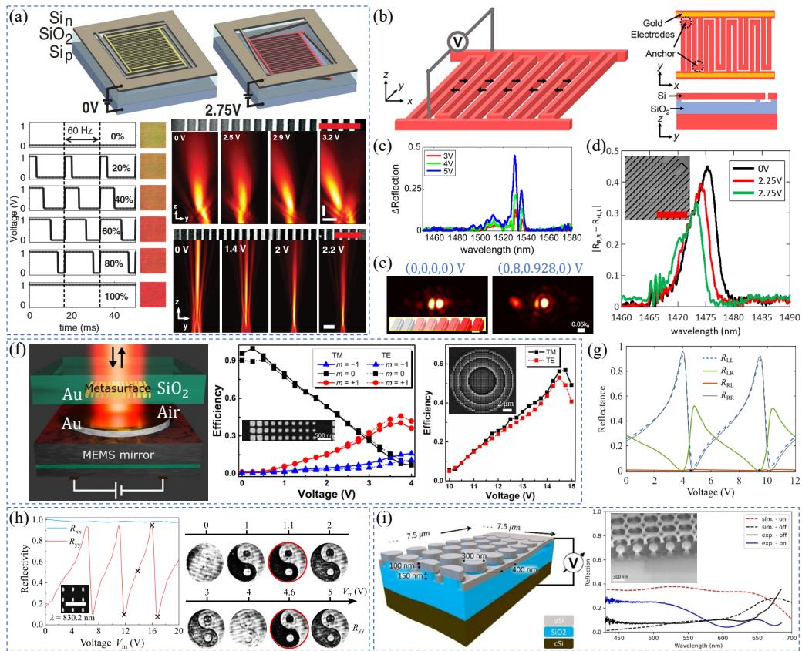

Nano-mechanically tunable metasurfaces. (a) Top: schematic of a MEMS-enabled active Si metasurface under 0 V and 2.75 V bias. Bottom left: metasurface pixels modulated by voltage modulation with different duty cycles. Scale bar, 2 $\mu$ m. Middle right: SEM of the metagrating, where Si ridges appear white (scale bar, 1 $\mu$ m), and the measured intensity distribution of the beam steering under different biases (scale bar, 3 $\mu$ m). Bottom right: SEM of a 1D metalens (scale bar, 1 $\mu$ m) and the measured intensity distribution in the yOz cross-section under different biases (scale bar, 5 $\mu$ m). (b) 3D and 2D cross-sectional schematics of a nano-electromechanically tunable suspended metagrating. (c) Change in the reflectance spectrum of the metagrating under different biases compared to the unbiased state. (d) Circular dichroism spectra of the metagrating under different biases. Inset: SEM of the metagrating. Scale bar, 5 $\mu$ m. (e) Diffraction patterns generated by the metagrating under varying combinations of bias voltages ( $V_{1}$ , $V_{2}$ , $V_{3}$ , $V_{4}$ ). Inset: schematic of the asymmetric metagrating structure. (f) Left: schematic of an active MIM metasurface based on piezoelectric MEMS. Middle: diffraction efficiency of the active metagrating for the zeroth and $\pm$ first diffraction orders under different biases for TM and TE incident light at a wavelength of 800 nm. Inset: SEM of the metagrating. Right: focusing efficiency of the active metalens under different biases for TM and TE incident light at a wavelength of 800 nm. Inset: SEM of the metalens. (g) Reflectance R of the active metasurface under different biases for various polarization channels. The first and second subscripts of R denote the polarization states of the reflected and incident light, respectively, where L and R represent LCP and RCP, respectively. When RCP degenerates, $R_{LR} = 0$ . (h) Left: measured reflectance of the metasurface under different bias voltages for incident light with orthogonal linear polarizations at a wavelength of 830.2 nm. Inset: SEM of the metasurface. Scale bar, 1 $\mu$ m. Right: intensity distribution of reflected light from a nanoprinting metasurface under different bias voltages. (i) Left: schematic of an active metasurface based on an electrically driven movable membrane. Right: simulated and (continued)

(continued) experimental reflectance spectra corresponding to the optical idle (on) and activated (off) states under applied voltages of 0 V and 70 V, respectively. Inset: SEM of the metasurface from a tilted view. (a) Adapted with permission from Holsteen et al., Science 365, 257–260 (2019) [790]. Copyright © 2019 American Association for the Advancement of Science. (b) and (c) Adapted with permission from Kwon et al., Nano Lett. 21, 2817–2823 (2021) [773]. Copyright © 2021 American Chemical Society. (d) Adapted with permission from Kwon et al., ACS Photonics 8, 2980–2986 (2021) [791]. Copyright © 2021 American Chemical Society. (e) Adapted from [792] under a Creative Commons license. (f) Adapted from [793] under a Creative Commons license. (g) Reprinted from [794] under a Creative Commons license. (h) Adapted with permission from Deng et al., Optica 11, 326–332 (2024) [795]. Copyright © 2024 Optica Publishing Group. (i) Adapted from [796] under a Creative Commons license.

The MEMS mirror, air gap, and Au meta-atom array together form an MIM metasurface. The electromagnetic response of the MIM metasurface is highly sensitive to the thickness of the dielectric layer. By leveraging the piezoelectric effect, the air gap thickness can be dynamically tuned via electrically driven MEMS mirrors, enabling efficient optical field modulation at a modulation speed exceeding 2.5 kHz. Based on this principle, a polarization-independent dynamic metagrating and metalens were realized, as shown in the middle and right panels of Fig. 65(f), respectively. In 2022, Bozhevolnyi's group [798] conducted further analysis of the aforementioned active metagrating design. When the air layer thickness exceeds half of the wavelength, the metasurface operates in the Fabry–Pérot region, which relaxes assembly requirements and operational tolerances. When the air layer thickness is much smaller than the wavelength, the metasurface operates in the gap-surface plasmon region, offering a broader operational bandwidth. Additionally, experimental results indicate that increasing the air gap enhances the coupling between adjacent metasurface elements, leading to a reduction in diffraction efficiency. In the same year, this piezoelectric MEMS-based MIM metasurface was further employed by Bozhevolnyi's group [799] to realize a dynamic reflective wave plate. The polarization state of the reflected light traces a trajectory that fully encircles the Poincaré sphere as the bias voltage varies. In 2024, based on the same architecture (operating in the Fabry–Pérot region), Bozhevolnyi's group [699] designed a metasurface unit cell that exhibits RCP degeneracy [133] at a specific air layer thickness, achieving electrically tunable emergence and disappearance of the exceptional point, as shown in Fig. 65(g). In the same year, Bozhevolnyi's group [795] further explored the polarization-sensitive properties of a homogeneous MIM metasurface [as illustrated in the inset of the left panel in Fig. 65(h)] under varying air layer thicknesses. As shown in the left panel of Fig. 65(h), at a set of specific bias voltages $\tilde{V}_{m}$ , we have $R_{xx} \gg R_{yy}$ and $R_{yy} \rightarrow 0$ , a characteristic that can be utilized for dynamic nanoprinting, as demonstrated in the right panel of Fig. 65(h). In the Tai Chi pattern, the black and white regions are composed of mutually perpendicular meta-atoms. When observing only the $R_{yy}$ component, at the specific voltage $\tilde{V}_{m}$ , only the meta-atoms in the black regions satisfy $R_{yy} \rightarrow 0$ , causing the metasurface to display the Tai Chi pattern. At other voltages, the meta-atoms in the black regions satisfy $R_{yy} \gg 0$ , leading to the erasure of the pattern.

(IV) Metasurfaces with a height-tunable membrane on top. In 2023, Herle et al. [795] proposed the active metasurface shown in the left panel of Fig. 65(i). The metasurface consists of an array of a–Si pillar meta-atoms (supported by a silica pillar array) and a suspended, movable a–Si film with circular apertures, integrated with an electrostatic actuator. As illustrated in the right panel of Fig. 65(i), in the idle state, the top surface

of the film aligns with the top of the meta-atoms, forming a highly reflective surface. In the activated state, the film can move vertically by a distance of $\delta$ under bias control, leading to a significant reduction in reflectance.

# 8.8. Stretchable Metasurfaces

Using flexible and elastic materials such as polydimethylsiloxane (PDMS) as the substrate for metasurfaces enables dynamic control by stretching the substrate along a specific direction. This deformation alters the lattice constant (or equivalently, the spacing between meta-atoms) in that direction, thereby tuning the metasurface's resonant modes $[800–802]$ or phase gradients $[803–806]$ .

Modulating resonant modes using stretchable metasurfaces. In 2011, Aksu et al. [800] fabricated an Au nanorod array on a 13 $\mu$ m-thick low-density polyethylene (LDPE) thin film and demonstrated the dynamic tuning of the resonant mode in the mid-infrared transmittance spectrum through stretching, as shown in Fig. 66(a). In 2016, Gutruf et al. [802] utilized a $TiO_{2}$ metasurface with PDMS (2 mm thick) as both the substrate and cladding material to achieve polarization-sensitive dynamic modulation of the transmittance spectrum, as shown in Fig. 66(b). By stretching the substrate to modify the lattice constant and adjust the metasurface's resonance peaks, this approach can be further applied to realize dynamically tunable structural colors. In 2015, Zhu et al. [801] employed a Si metasurface with PDMS as both the substrate and cladding material to achieve strain-dependent structural colors, as illustrated in.?[Fig. 66(c).

Modulating phase gradients using stretchable metasurfaces. When the substrate is stretched such that the lattice constant of the metasurface increases by a factor of $\gamma$ , the phase gradient along the stretching direction decreases to $1/\gamma$ of its original value, assuming that the phase modulation of the meta-atoms remains unchanged due to the lattice constant variation. This results in a modification of the diffraction angle of a metagrating and the focal length of a metalens. Specifically, for a metagrating, according to Eq. (56), the sine of the diffraction angle decreases to $1/\gamma$ of its original value. For a hyperbolic metalens, using Eq. (169) and assuming the approximation NA $\ll 1$ , i.e., $r/f \ll 1$ , the phase distribution is given by

$$
\begin{array}{l} \phi_ {\mathrm{hyperbolic,NA} \ll 1} (r, \omega) = - \frac {\omega}{c} f \sqrt {1 + \left(\frac {r}{f}\right) ^ {2}} + C ^ {\prime} (\omega) \\ \approx - \frac {\omega}{c} f \Bigg (1 + \frac {1}{2} \left(\frac {r}{f}\right) ^ {2} \Bigg) + C ^ {\prime} (\omega) \\ = - \frac {\omega}{2 c} \frac {r ^ {2}}{f} + C ^ {\prime \prime} (\omega). \tag {347} \\ \end{array}
$$

When the substrate is stretched by a factor of $\gamma$ , the new phase distribution is

$$
\phi_ {\text {hyperbolic,NA} \ll 1} ^ {\prime} (r, \omega) = \phi_ {\text {hyperbolic,NA} \ll 1} \left(\frac {r}{\gamma}, \omega\right) = - \frac {\omega}{2 c} \frac {r ^ {2}}{f ^ {\prime}} + C ^ {\prime \prime} (\omega), \tag {348}
$$

where

$$
f ^ {\prime} = \gamma^ {2} f. \tag {349}
$$

Thus, the focal length of the metalens increases by a factor of $\gamma^{2}$ .

In 2016, Ee and Agarwal [803] experimentally demonstrated a diffraction-angle-tunable metagrating and a focal-length-tunable metalens operating at a wavelength of 632.8 nm, as shown in Fig. 66(d). These devices were based on a geometric phase Au metasurface fabricated on a $\sim$ 0.2 mm-thick PDMS film substrate. In the same year, Kamali

Figure 66  
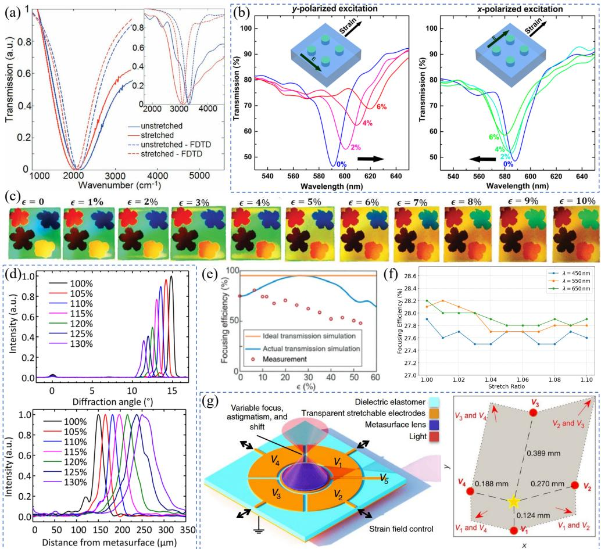

Stretchable metasurfaces. (a) Measured and calculated transmittance spectra of nanorod arrays with a periodicity of 1.5 $\mu$ m, a length of 1.2 $\mu$ m, a width of 250 nm, and a height of 70 nm, on an LDPE film before (blue curve) and after stretching (red curve). A 5% enlargement of the lattice constant was achieved after stretching. Inset: response of a nanorod array with a periodicity of 1.8 $\mu$ m and a length of 900 nm when stretched for a 16% enlargement in periodicity. (b) Transmittance spectra of the metasurface under increasing applied strain for incident x-polarized (left) and y-polarized (right) light. (c) Photographs of a nanoprinting metasurface (a flower pattern) under different deformations. $\epsilon$ represents the ratio of the change in sample length to its original length. (d) Top: intensity distributions of transmitted cross-polarized light along the x-axis (also the direction of the metagrating phase gradient) of a geometric phase metagrating under different stretch ratios. The stretch ratio is defined as the ratio of the stretched sample length to the original length. Bottom: intensity distributions of transmitted cross-polarized light along the optical axis of a geometric phase metalens under different stretch ratios. (e) Measured and two simulated focusing efficiencies of a propagation phase metalens as a function of strain $\epsilon$ . (f) Measured focusing efficiencies of a detour phase metalens as a function of stretch ratio. (g) Left: schematic of an electrically stretchable metalens. Right: measurement of two-axis displacement control from the focus position at 0 kV (yellow star) to various positions (red dots) as 1.9 kV is applied. The gray shaded area represents possible displacements, which can be accessed by concurrently activating combinations of electrodes. (a) Reprinted with permission from Aksu et al., Adv. Mater. 23, 4422–4430 (2011) [800]. Copyright © 2011 WILEY-VCH Verlag GmbH & Co. KGaA, Weinheim. (b) Adapted with permission from Gutruf et al., ACS Nano 10, 133–141 (2016) [802]. (continued)

(continued) Copyright © 2016 American Chemical Society. (c) Reprinted with permission from Zhu et al., Optica 2, 255–258 (2015) [801]. Copyright © 2015 Optica Publishing Group. (d) Adapted with permission from Ee et al., Nano Lett. 16, 2818–2823 (2016) [803]. Copyright © 2016 American Chemical Society. (e) Reprinted with permission from Kamali et al., Laser Photonics Rev. 10, 1002–1008 (2016) [804]. Copyright © 2016 WILEY-VCH Verlag GmbH & Co. KGaA, Weinheim. (g) Adapted from [805] under a Creative Commons license.

et al. [804] realized a stretchable propagation phase a–Si metalens operating at a wavelength of 915 nm, using a $\sim$ 0.1 mm-thick PDMS film as the substrate. The focusing efficiencies for varying strains are depicted in Fig. 66(e). We note that the focusing performance of both stretchable metalens designs, based on geometric or propagation phase modulation mechanisms, degrades significantly as the stretching ratio increases, as shown in the bottom panel of Figs. 66(d) and 66(e). This degradation arises from the increased spacing between meta-atoms, which affects the meta-atom coupling and consequently alters their electromagnetic response. In contrast, employing detour phase modulation effectively circumvents this issue, as detour phase inherently relies on adjusting the spacing between adjacent units for phase control. In 2021, Wei et al. [806] realized a detour phase graphene oxide metalens on a PDMS film substrate. As shown in Fig. 66(f), this metalens inherits the broadband characteristic of detour phase and exhibits minimal degradation in focusing efficiency under stretching.

More sophisticated and precise stretching control can be achieved via MEMS-based electrical tuning. In 2018, She et al. $[805]$ experimentally demonstrated an electrically tunable metalens controlled by dielectric elastomer actuators, as shown in the left panel of Fig. 66(g). Five addressable electrodes were integrated to enable electrical control over the strain field of the metasurface, allowing the metalens to achieve focal length tuning exceeding 100%, along with on-the-fly astigmatism and image shift corrections. The displacement of the metalens focal point in all cardinal directions under appropriate control voltages is illustrated in the right panel of Fig. 66(g).

# 8.9. Microfluidic Metasurfaces

Microfluidic technology enables highly automated guidance, mixing, and manipulation of minute liquid volumes, offering advantages such as high precision, efficiency, low consumption, and miniaturization. Integrating microfluidic technology with metasurfaces provides an attractive solution for dynamic metasurfaces. By controlling the type and flow rate of liquids within microfluidic channels, the refractive index of the meta-atoms or the cladding medium surrounding the meta-atoms can be tuned in real time, thereby dynamically altering the light field modulation of the metasurface.

Modulating the shape of meta-atoms using microfluidics. In 2017, Song et al. [807] experimentally demonstrated a microfluidic metasurface based on water meta-atoms, as illustrated in Fig. 67(a). By controlling the water volume within PDMS microfluidic channels, the height of the water meta-atoms was adjusted, thereby modulating the absorption spectrum of the metasurface. In the same year, Wu et al. [808] employed a gallium–indium–tin alloy (Galinstan) metasurface with actively addressable units to realize a broadband, wide-angle dynamic polarization converter operating in the microwave regime, as shown in Fig. 67(b). Each L-shaped meta-atom was integrated with a single-inlet, dual-outlet PDMS microfluidic channel, where the injection and removal of the liquid metal controlled the arm length of the L-shaped meta-atom. This tunability allowed the reflected light to be converted among three different polarization states: linear, circular, and elliptical. Similarly, in 2021, Zhang et al. [811]

Figure 67  
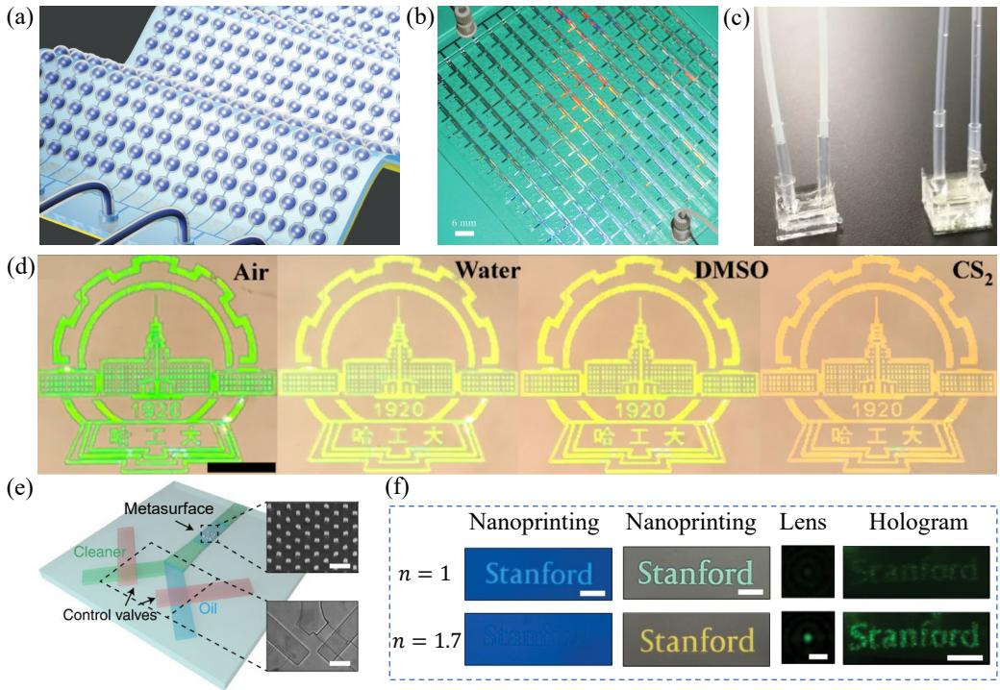

Microfluidic metasurfaces. (a) Schematic of a metasurface based on water resonators. (b) Photograph of a microfluidic metasurface designed for dynamic polarization conversion. (c) Photograph of a PDMS microfluidic chip integrated with a metasurface. (d) Dynamic display of a nanoprinting metasurface when different media (top right) with different refractive indices are introduced into the microfluidic chip. Scale bar, 150 $\mu$ m. (e) Schematic of a microfluidic chip integrated with a metasurface. Top inset: SEM of the metalens. Scale bar, 500 nm. Bottom inset: optical image of a fabricated Y-shaped microfluidic channel. Scale bar, 100 $\mu$ m. (f) Experimentally obtained dynamic light field modulation results based on microfluidic metasurfaces. From left to right: nanoprinting with switchable (first column) and color-tunable (second column) control, both based on reflectance spectrum modulation; a switchable metalens (third column) and a metasurface hologram (fourth column), both based on diffraction efficiency modulation. n represents the refractive index of the cladding medium controlled by the microfluidic chip. (a) Reprinted with permission from Song et al., Adv. Opt. Mater. 5, 1601103 (2017) [807]. Copyright © 2017 WILEY-VCH Verlag GmbH & Co. KGaA, Weinheim. (b) Reprinted with permission from Wu et al., Adv. Opt. Mater. 5, 1600938 (2017) [808]. Copyright © 2017 WILEY-VCH Verlag GmbH & Co. KGaA, Weinheim. (c) and (d) Reprinted with permission from Sun et al., ACS Nano 12, 2151–2159 (2018) [809]. Copyright © 2018 American Chemical Society. (e) and (f) Adapted with permission from Li et al., Nat. Nanotechnol. 17, 1097–1103 (2022) [810]. Copyright © 2022 Springer Nature.

demonstrated polarization control by modifying the structure of the meta-atoms via adjusting the volume of glycerol injected into the microfluidic system. Experimentally, they achieved polarization rotation of 0.19 THz linearly polarized light from $0^{\circ}$ to $14^{\circ}$ .

However, due to fabrication constraints, achieving sufficiently small microfluidic channels while maintaining effective liquid flow control remains challenging. As a result, the unit size of dynamic metasurfaces based on this approach remains on the millimeter or submillimeter scale, limiting their operation to the THz, GHz, or lower frequency bands. Current fabrication techniques are insufficient to further extend this method to higher-frequency applications.

Modulating the cladding medium of a metasurface using microfluidics. Shifting the target of microfluidic control from individual meta-atoms to the cladding medium of meta-atoms allows for eliminating the limitations imposed by microfluidic channel fabrication and realizing dynamic modulation—based on the metasurface's sensitivity to the variation of the cladding medium's refractive index $n_{\mathrm{cladding}}$ —for metasurfaces operating at high frequencies, such as in the visible spectrum.

In 2018, Sun et al. [809] demonstrated real-time tunable structural color by manipulating the refractive index of the fluid flowing over a dielectric metasurface using a microfluidic chip, as illustrated in Fig. 67(c). The system consisted of a $TiO_{2}$ metasurface embedded within a PDMS microfluidic channel. By injecting solutions with different refractive indices into the channel, the reflection peak of the metasurface could be precisely tuned, leading to dynamically adjustable structural colors, as shown in Fig. 67(d). Experimental results indicated that the color-switching response time of the system was only 16 ms.

In 2022, Brongersma's group [810] integrated a metasurface with a Y-shaped microfluidic channel, as illustrated in Fig. 67(e). This system enabled controlled injection of high-refractive-index oil ( $n = 1.7$ ) and low-refractive-index liquid cleaner (HFE-7500, $n = 1.29$ ) into the main channel (where the metasurface was placed) via pneumatic valves. By designing the meta-atom with the reflection spectrum sensitive to $n_{\mathrm{cladding}}$ , they experimentally demonstrated switchable and continuously tunable nanoprinting, as shown in the first two columns of Fig. 67(f). Furthermore, by designing a geometric phase metasurface with the meta-atom shape optimized for $n_{\mathrm{cladding}}$ -dependent diffraction efficiency—yielding near-zero efficiency at low $n_{\mathrm{cladding}}$ and high efficiency at high $n_{\mathrm{cladding}}$ —the switchable metalens and metasurface hologram were achieved, as illustrated in the last two columns of Fig. 67(f). Experiments indicated that the system operated at a modulation frequency of approximately $10\mathrm{Hz}$ .

# 8.10. Moiré Metasurfaces

A moiré lattice consists of two superimposed structures with the same periodicity but a relative rotational offset. In recent years, interest in moiré lattices has surged due to their rich physical phenomena, with the most well-known example being the unconventional superconductivity observed in magic-angle graphene. With the advancement of cascaded metasurfaces, moiré metasurfaces have emerged as a new research frontier $[812,813]$ . Here, we will introduce the applications of moiré metasurfaces in active optical field manipulation.

In 2022, Liu et al. [814] demonstrated dynamic beam steering through the mutual twisting of two closely stacked metasurfaces, as illustrated in Fig. 68(a). Due to the moiré effect, the superposition of two high-spatial-frequency patterns generates a low-spatial-frequency moiré pattern. When the twist angle between the two high-spatial-frequency patterns changes, the spatial frequency of the resulting moiré pattern also varies, thereby deflecting the incident light to different angles. For instance, in the bilayer metasurface shown in Fig. 68(a), when the twist angle is set to $10^{\circ}$ , the corresponding spatial frequency and its superposition are depicted in Fig. 68(b). The superposition produces two sets of spatial frequency distributions, represented in yellow and blue, respectively. The blue set contains spatial frequencies exceeding the free-space limit ( $k = 2\pi/\lambda$ ) and is therefore not observable, while only the yellow set contributes to the beam radiation. By continuously adjusting the twist angle from $0^{\circ}$ to $90^{\circ}$ , dynamic beam steering, as illustrated in Fig. 68(c), can be achieved. Experiments in the microwave regime verified the dynamic control of the deflection angle of the proposed moiré metasurface, as shown in Fig. 68(d).

Figure 68  
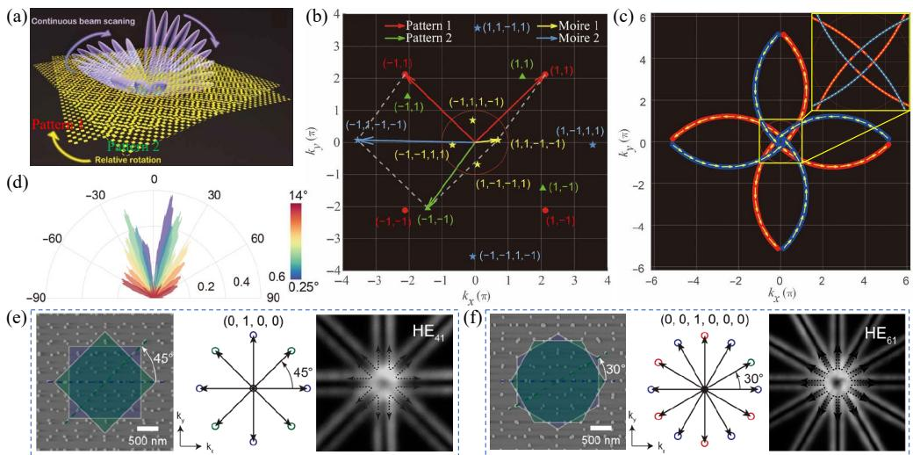

Moiré metasurfaces. (a) Schematic of a moiré metasurface designed for dynamic beam steering. (b) Bilayer metasurface and the spatial frequency analysis of their superposition. (c) Theoretically predicted beam scanning trajectory as the twist angle of the Moiré metasurface varies from $0^{\circ}$ to $90^{\circ}$ . Inset: enlarged view of the central region of the scanning trajectory. (d) Cutting-plane view of the experimentally observed radiation pattern of the moiré metasurface as the twist angle changes from $0.25^{\circ}$ to $14^{\circ}$ . (e) Left: SEM of a bilayer metasurface with a square lattice at a twist angle of $45^{\circ}$ . The colored regions indicate the geometry of the base lattices. Middle: spatial frequency distribution corresponding to the first-order diffraction of the Moiré metasurface shown in the left panel. Right: laser emission perpendicular to the metasurface laser. Double-headed arrows indicate the polarization directions. (f) Same as (e), except that the metasurface laser is based on a bilayer metasurface with a hexagonal lattice at a twist angle of $30^{\circ}$ . (a)–(d) Adapted from [814] under a Creative Commons license. (e) and (f) Adapted with permission from Tan et al., ACS Nano 18, 23181–23188 (2024) [815]. Copyright © 2024 American Chemical Society.

In 2023, Lyu et al. [816] leveraged symmetry breaking induced by the mutual twisting of a bilayer moiré metasurface to dynamically control the chirality of the metasurface, achieving a maximum experimentally observed circular dichroism of 0.81.

In 2024, Tan et al. [815] utilized a moiré metasurface laser to generate hybrid-electric mode beams with high rotational symmetry. The metasurface was composed of plasmonic nanoparticles arranged in a square or hexagonal lattice on a perovskite nanocrystal film. As shown in Fig. 68(e), when the twist angle of the bilayer square-lattice moiré metasurface was set to $45^{\circ}$ , the laser emission under optical pumping exhibited the $HE_{41}$ mode. Similarly, as depicted in Fig. 68(f), when the twist angle of the bilayer hexagonal-lattice moiré metasurface was set to $30^{\circ}$ , the laser emission exhibited the $HE_{61}$ mode. The high symmetry of these beam modes originates from the symmetry of the moiré pattern formed by the bilayer metasurface.

# 9. SUMMARY AND OUTLOOK

After more than a decade of development, the research on metasurfaces seems to have matured considerably. A comprehensive understanding of the physical mechanisms of light interaction with individual meta-atoms has been established. Current explorations into the phase modulation mechanisms are quite comprehensive, and even if new phase

modulation methods are proposed, it's plausible that they can be seen as supplements to the existing mechanisms [153,158]. The forward design method based on LPA has been verified in various metasurface designs, with little room for further improvement. Applications of technologies such as topology optimization, heuristic algorithms, deep learning, and automatic differentiation in the inverse design of metasurfaces have undergone preliminary but comprehensive exploration. For major metasurface devices like metalenses and metasurface holograms, a systematic design framework has gradually taken shape, encompassing basic theory, design methods, performance evaluation, and analytical approaches. Meanwhile, the applications of metasurfaces in quantum photonics, optical computing, and dynamic light field manipulation have also been under comprehensive development. In terms of achieving broadband, wide FOV, and function multiplexing in metasurface designs, current researches are gradually approaching the theoretical limits of metasurfaces [173,503,504]. Through such a comprehensive review of the metasurface field, we find that what lies before us is no longer a nascent field. Nonetheless, there remain many unsolved problems and unknown territories in metasurface design awaiting further exploration. On the road to the practical application of metasurfaces, we still face multiple scientific and engineering challenges.

More possibilities in the light–matter interaction. As showcased in Subsection 2.1, there's now a comprehensive and in-depth understanding of the physical mechanisms behind the interaction between single meta-atoms and light, which serves as the basis for the current light field manipulation methods using metasurfaces. However, the nonlocal coupling between adjacent meta-atoms is almost always neglected. How to incorporate the nonlocal coupling into the metasurface design remains a challenge $[568]$ . One approach is to introduce inverse design methods, which involve optimization algorithms $[343]$ and deep learning $[406]$ , as discussed in Section 3. Nevertheless, this approach only improves the device performance to a certain extent through utilizing an additional degree of freedom of the coupling, and it is inadequate to unveil the physical mechanisms behind the meta-atom coupling or to develop applications with novel functionalities. Another approach that builds on the forward design paradigm involves expanding the unit cell of a metasurface from a single meta-atom to a cluster of multiple meta-atoms. In this context, our primary focus is the electromagnetic coupling among the meta-atoms within each unit, which contrasts with the assumptions made in Section 5, where each meta-atom in the unit was considered to follow the electromagnetic response characteristics dictated by the LPA. For example, in 2024, Chen et al. experimentally demonstrated that even a configuration of just four meta-atoms can achieve a full $2\pi$ phase shift, enabling the efficient generation of high-purity optical vortices with varying topological charges $[817]$ .

With the proposal and advancement of active metasurfaces, along with continuous improvements in fabrication techniques, metasurfaces have evolved to incorporate time as a novel degree of freedom beyond spatial light field manipulation. The principles of causality and the second law of thermodynamics impose a unidirectional evolution of time in spatiotemporal metasurfaces, thereby enriching light–matter interactions—for example, enabling nonreciprocal effects without the need for magnetic biasing $[818]$ . We have already introduced some of the exciting and unconventional physical phenomena enabled by this in Subsection 2.2.7. Nevertheless, these findings mark only the initial stage of exploration.

The interaction between metasurfaces and novel light sources is expected to reveal new physical phenomena and functionalities. Complex-frequency light, characterized by its virtual gain or loss, has attracted increasing attention in recent years $[328]$ . An introduction to complex-frequency metasurfaces can be found in Subsection 2.2.8. Mean-

while, nonclassical optics has demonstrated remarkable potential for future applications. In Section 6, we discuss the integration of quantum photonics with metasurfaces, which opens up new opportunities for research in both fields.

The convergence of metasurfaces with related disciplines provides a powerful foundation for exploring novel light–matter interactions. For instance, as discussed in Subsection 2.2.3, metasurfaces have incorporated the concept of high-Q-factor nonlocal resonant modes from photonic crystals, topological phases from topological photonics, and exceptional points from non-Hermitian physics. In Subsection 7.1, we introduced the implementation of mathematical operations using nonlocal metasurfaces inspired by Fourier optics. In Subsection 8.10, we presented dynamic modulation mechanisms of Moiré metasurfaces inspired by Moiré optics. We believe that such interdisciplinary integration will continue to invigorate the field and create new opportunities for metasurface research.

Challenges and future developments in design methods. Nowadays, forward design methods are widely used, while inverse design approaches are gradually gaining traction but still face lots of limitations.

Inverse design methods encounter some longstanding issues that preclude their widespread adoption. The computational cost of iterative optimization is prohibitive for larger-area metasurface devices, often restricting inverse design to small-area devices $[408,453]$ or 2D structure optimizations $[3,422]$ , with heuristic algorithms facing even greater limitations than gradient optimization methods. Besides, when the number of optimization variables is large (e.g., the metasurface to be optimized contains a significant number of meta-atoms), designs obtained from inverse design methods tend to converge to local optima or saddle points, potentially resulting in device performance that is inferior to that achieved by forward design. Moreover, deep learning-based design methods also have inherent limitations, including a lack of generalization capability and excessively high training costs for complex models $[402]$ .

It is crucial for both forward and inverse design methodologies to clearly understand their respective roles within the metasurface design framework to fully exploit their inherent strengths. Forward design is predicated on an understanding of the physical mechanisms underpinning metasurface configurations $[819]$ , making it especially suited to realize novel metasurface designs from 0 to 1. In contrast, inverse design should specifically address those challenges that limit forward design, such as incorporating the coupling for enhanced device performance $[406]$ , navigating high-dimensional design spaces $[449]$ , crafting optical devices considering spatial dispersion $[338]$ , and developing multilayer metasurface designs that account for interlayer coupling $[191]$ , among others.

The advancement of electromagnetic simulation software is crucial for metasurface design. It will significantly enhance the capabilities and broaden the application scope of metasurface design methodologies. Often, the choice of simulation and design strategy for metasurfaces is dictated by the limitations of the current computational tools. The complexity of electromagnetic simulations is approximately related to the simulation area by a high-degree polynomial $[422]$ , and the accurate and efficient simulation for large-area metasurface devices remains a challenge. Recent proposals like GPU parallel computing $[820]$ and distributed computing $[400]$ represent advances, yet they are still not commonplace.

Furthermore, the impact of design methodologies on device performance has not been systematically elucidated, particularly from a theoretical perspective, despite some initial comparative discussions $[343,403,449]$ . This leads to an inadequate understanding of the fundamental limits of these design methods.

Beneficial interaction and mutual promotion between theoretical analysis and device design. On one hand, metasurface device designs provide the basis for experimental validation of theoretical analysis. On the other hand, theoretical analysis deepens our understanding of metasurfaces, pointing the way for further improvement of device design $[821]$ . The positive interaction between theoretical analysis and device design is important for the healthy development of the entire metasurface design community $[474,479]$ .

Achieving higher device performance is a ubiquitous challenge in metasurface design $[822]$ , especially when there are high demands on NA, FOV, achromatic bandwidth, and multiplexing, as pointed out in Sections 4 and 5. Although some work has theoretically indicated several limitations between various metrics, the current understanding of the mechanisms is still insufficient $[823]$ .

Realizing large-area metasurface devices has been a long-standing goal within the field $[383]$ . Theoretically, for instance, Eqs. (187) and (237), respectively, reveal the constraints imposed by the lattice constant and NA on the size of a metalens. How to maintain high performance for a large-area metasurface or even break through the aforementioned limits with inverse optimization $[426]$ , ingenious design methods $[400,504]$ , and advanced fabrication techniques $[824]$ remains an area ripe for exploration.

Improved and novel devices empowered by the development of fabrication processes. It goes without saying that advancing fabrication processes is significant for enabling metasurface designs with higher degrees of freedom and for enhancing consistency between simulated and experimental results. For example, the issue of the zeroth-order bright spot in metasurface holography is in part due to fabrication imperfections $[569]$ , and Eq. (232) reveals the impact of aspect ratio on the performance of achromatic metalenses. Challenges in this area include compatibility between current processes and the CMOS process $[341]$ , efficient and low-cost mass production $[369,385,386]$ , controlling the shape and dimensional accuracy of meta-atom structures $[825]$ , improving the surface roughness of metasurfaces $[825]$ , managing interlayer distance and alignment in cascaded metasurfaces, achieving a higher aspect ratio $[826,827]$ , etc.

In addition, we should also recognize that advanced manufacturing technologies will make more novel metasurface designs possible. For instance, multi-height meta-atoms can be used for complex amplitude modulation $[392]$ (as detailed in Subsection 5.1.2), and fabrication processes that unlock out-of-plane dimensions empower the design of chiral metasurfaces $[284,287]$ (as detailed in Subsection 2.2.5).

# APPENDIX A: DIFFRACTION MODEL FOR METASURFACE HOLOGRAMS

As shown in Fig. 69, light propagates in the positive direction of the $z$ -axis. The diffraction plane is located on the $z = z_0$ plane, whose complex amplitude distribution is denoted as $E(x,y,z_0)$ . The complex amplitude distribution on the observation plane is denoted as $E(x,y,z)$ . The refractive index of the background medium is $n_{\mathrm{back}}$ , adhering to the symbol convention consistent with Subsection 4.1. The Rayleigh-Sommerfeld diffraction formula provides an exact solution for field propagation, with the first kind of Rayleigh-Sommerfeld diffraction formula given by [535]

$$
E (x, y, z) = \iint_ {\Sigma} E \left(x ^ {\prime}, y ^ {\prime}, z _ {0}\right) \left(\frac {1}{2 \pi \bar {r}} + \frac {1}{i \lambda}\right) \frac {d}{\bar {r}} \frac {e ^ {i k \bar {r}}}{\bar {r}} \mathrm{d} x ^ {\prime} \mathrm{d} y ^ {\prime}, \tag {A1}
$$

where $\Sigma$ represents the diffracted field region, x and y on the diffraction plane are denoted as $x'$ and $y'$ for ease of subsequent discussion, $d = z - z_{0}$ , $\bar{r} =$

Figure 69  
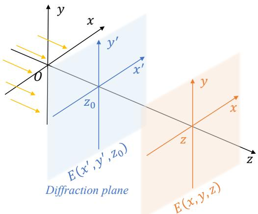

text_image

y
x
y'
O
x'
z0
E(x', y', z0)
Diffraction plane
y
x
z
E(x, y, z)
z

Observation plane

Geometry and the coordinate system used for illustrating scalar diffraction theory.

$\sqrt{(x - x')^2 + (y - y')^2 + d^2}$ is the distance between points on the diffraction plane and the observation plane. We note that Eq. (A1) can be derived from Eq. (157), which represents a more general form of this formula.

When the distance between the observation plane and the diffraction plane is sufficiently large such that the $\frac{1}{2\pi\bar{r}}$ term in Eq. (A1) can be neglected and the paraxial approximation ( $\bar{r} \approx d$ ) is applied, Eq. (A1) simplifies to

$$
E (x, y, z) = \frac {1}{i \lambda d} \iint E \left(x ^ {\prime}, y ^ {\prime}, z _ {0}\right) e ^ {i k \bar {r}} \mathrm{d} x ^ {\prime} \mathrm{d} y ^ {\prime}. \tag {A2}
$$

When the approximation

$$
d \gg \frac {1}{2} \left(\frac {\left(\left(x - x ^ {\prime}\right) ^ {2} + \left(y - y ^ {\prime}\right) ^ {2}\right) ^ {2}}{\lambda}\right) ^ {\frac {1}{3}} \tag {A3}
$$

is applied, we obtain the Fresnel diffraction formula

$$
E (x, y, z) = \frac {e ^ {i k d}}{i \lambda d} \iint_ {\Sigma} E \left(x ^ {\prime}, y ^ {\prime}, z _ {0}\right) e ^ {i \frac {\pi}{\lambda d} \left(\left(x - x ^ {\prime}\right) ^ {2} + \left(y - y ^ {\prime}\right) ^ {2}\right)} \mathrm{d} x ^ {\prime} \mathrm{d} y ^ {\prime}. \tag {A4}
$$

The region constrained by Eq. (A3) where the Fresnel diffraction formula is valid, is known as the Fresnel diffraction zone. When the approximation

$$
d \gg \frac {1}{2} \frac {x ^ {\prime 2} + y ^ {\prime 2}}{\lambda} \tag {A5}
$$

is further applied, we obtain the Fraunhofer diffraction formula

$$
E (x, y, z) = \frac {e ^ {i k d}}{i \lambda d} e ^ {i \frac {\pi}{\lambda d} \left(x ^ {2} + y ^ {2}\right)} \iint_ {\Sigma} E \left(x ^ {\prime}, y ^ {\prime}, z _ {0}\right) e ^ {- i \frac {2 \pi}{\lambda d} \left(x x ^ {\prime} + y y ^ {\prime}\right)} \mathrm{d} x ^ {\prime} \mathrm{d} y ^ {\prime}. \tag {A6}
$$

The region constrained by Eq. (A5) where the Fraunhofer diffraction formula is valid, is known as the Fraunhofer diffraction zone. Clearly, the range of the Fresnel diffraction zone includes that of the Fraunhofer diffraction zone. However, within the Fraunhofer diffraction zone, it is unnecessary to use the relatively more complex Fresnel formula for calculations. It is important to note that both formulas are derived based on the paraxial approximation, thus limiting the Fresnel and Fraunhofer diffraction zones to the vicinity of the optical axis.

Using the angular spectrum method, we can derive diffraction formulas based on angular spectrum propagation from the Helmholtz equation. These formulas are more suited for numerical computations compared to the integral formulas mentioned previously $[535]$ . Define u, v, and w as the spatial frequencies in the x, y, and z directions, respectively, satisfying

$$
u = \frac {k _ {x}}{2 \pi}, \quad v = \frac {k _ {y}}{2 \pi}, \quad w = \frac {k _ {z}}{2 \pi}, \tag {A7}
$$

where $k_{x}$ , $k_{y}$ , and $k_{z}$ are the components of the wavevector $\vec{k}$ in the x, y, and z directions, respectively, also known as the spatial angular frequencies. Let the direction cosines of $\vec{k}$ be $\cos\gamma_{x}$ , $\cos\gamma_{y}$ , and $\cos\gamma_{z}$ for x, y, and z directions, respectively; then we have

$$
u = \frac {\cos \gamma_ {x}}{\lambda}, \quad v = \frac {\cos \gamma_ {y}}{\lambda}, \quad w = \frac {\cos \gamma_ {z}}{\lambda}. \tag {A8}
$$

From Eqs. (A7) and (A8), it's evident that $u, v$ , and $w$ satisfy

$$
u ^ {2} + v ^ {2} + w ^ {2} = \left(\frac {k}{2 \pi}\right) ^ {2} = \left(\frac {1}{\lambda}\right) ^ {2}. \tag {A9}
$$

Thus, w can be viewed as a function of u and v, i.e.,

$$
w = w (u, v) = \sqrt {\left(\frac {1}{\lambda}\right) ^ {2} - u ^ {2} - v ^ {2}}. \tag {A10}
$$

For any field distribution $E(x,y,z)$ , its angular spectrum is defined as its 2D Fourier transform with respect to x and y, denoted as

$$
\tilde {E} (u, v, z) = \mathcal {F} \left\{E (x, y, z) \right\} (u, v, z) = \iint_ {- \infty} ^ {+ \infty} E (x, y, z) e ^ {- i 2 \pi (u x + v y)} \mathrm{d} x \mathrm{d} y, \tag {A11}
$$

where F represents the 2D Fourier transform. The spatial field distribution can be obtained from the angular spectrum by performing an inverse Fourier transform

$$
E (x, y, z) = \mathcal {F} ^ {- 1} \left\{\tilde {E} (u, v, z) \right\} (x, y, z) = \iint_ {- \infty} ^ {+ \infty} \tilde {E} (u, v, z) e ^ {i 2 \pi (u x + v y)} \mathrm{d} u \mathrm{d} v, \tag {A12}
$$

where $\mathcal{F}^{-1}$ denotes the 2D Fourier inverse transform.

The angular spectrum propagation formula corresponding to the Rayleigh–Sommerfeld diffraction formula is

$$
\tilde {E} (u, v, z) = \tilde {E} (u, v, z _ {0}) H (u, v, d), \tag {A13}
$$

where $\tilde{E}(u,v,z_{0})$ is the angular spectrum of the field distribution $E(x,y,z_{0})$ on the diffraction plane, $\tilde{E}(u,v,z)$ is the angular spectrum of the field distribution $E(x,y,z)$ on the observation plane, and $H(u,v,d)=e^{-i2\pi w(u,v)d}$ is known as the transfer function. Thus, the field distribution on the observation plane is

$$
\begin{array}{l} E \left(x, y, z\right) = \mathcal {F} ^ {- 1} \left\{\tilde {E} \left(u, v, z\right) \right\} \left(x, y, z\right) \\ = \mathcal {F} ^ {- 1} \left\{\mathcal {F} \left\{E (x, y, z _ {0}) \right\} (u, v, z _ {0}) e ^ {- i 2 \pi w (u, v) d} \right\} (x, y, z). \tag {A14} \\ \end{array}
$$

Equation (A14) is consistent with Eq. (A1), albeit expressed differently, leading to a different computational approach. Applying the paraxial approximation to the transfer function, i.e.,

$$
w (u, v) = \frac {1}{\lambda} \left(1 - \lambda^ {2} \left(u ^ {2} + v ^ {2}\right)\right) ^ {\frac {1}{2}} \approx \frac {1}{\lambda} - \frac {\lambda}{2} \left(u ^ {2} + v ^ {2}\right), \tag {A15}
$$

yields the Fresnel diffraction formula. Under this approximation, we have

$$
u = \frac {\cos \gamma_ {x}}{\lambda} \approx \frac {x}{\lambda d}, \quad v = \frac {\cos \gamma_ {y}}{\lambda} \approx \frac {y}{\lambda d}. \tag {A16}
$$

Figure 70  
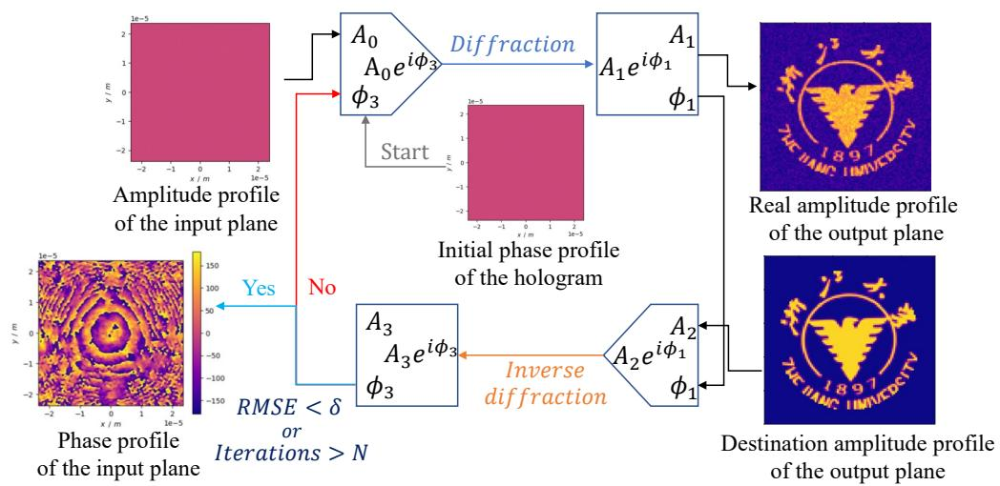

flowchart

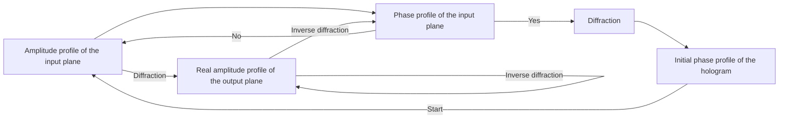
```mermaid
graph LR
  InputPlane["Amplitude profile of the input plane"] --> PhasePlane["Phase profile of the input plane"]
  PhasePlane -->|Yes| Diffraction["Diffraction"]
  PhasePlane -->|No| InputPlane
  Diffraction --> InitialPhase["Initial phase profile of the hologram"]
  InitialPhase -->|Start| InputPlane
  InputPlane -->|Diffraction| OutputPlane["Real amplitude profile of the output plane"]
  OutputPlane -->|Inverse diffraction| PhasePlane
  OutputPlane -->|Inverse diffraction| OutputPlane
  OutputPlane -->|Inverse diffraction| OutputPlane
  OutputPlane -->|Inverse diffraction| OutputPlane
```

Schematic of the Gerchberg-Saxton algorithm.

In this context, by the properties of Fourier transforms, Eq. (A14) can further simplify to

$$
E (x, y, z) = \frac {e ^ {i k d}}{i \lambda d} e ^ {i \frac {\pi}{\lambda d} (x ^ {2} + y ^ {2})} \mathcal {F} \left\{E (x, y, z _ {0}) e ^ {i \frac {\pi}{\lambda d} (x ^ {2} + y ^ {2})} \right\} \left(u = \frac {x}{\lambda d}, v = \frac {y}{\lambda d}, z _ {0}\right), \tag {A17}
$$

which is known as the single-step Fresnel propagation formula. Introducing a further approximation that the phase factor inside the Fourier transform in Eq. (A17) satisfies $\frac{\pi}{\lambda d}\left(x^{2}+y^{2}\right)\ll2\pi$ , which aligns with Eq. (A5), we obtain the Fraunhofer diffraction formula

$$
E (x, y, z) = \frac {e ^ {i k d}}{i \lambda d} e ^ {i \frac {\pi}{\lambda d} \left(x ^ {2} + y ^ {2}\right)} \mathcal {F} \left\{E (x, y, z _ {0}) \right\} \left(u = \frac {x}{\lambda d}, v = \frac {y}{\lambda d}, z _ {0}\right). \tag {A18}
$$

When only interested in the diffraction pattern or light intensity distribution on the observation plane, factors outside the Fourier transform in Eqs. (A17) and (A18) [including a constant $\frac{1}{\lambda d}$ and a spatially varying phase factor $-ie^{ikd}e^{i\frac{\pi}{\lambda d}\left(x^{2} + y^{2}\right)}]$ can be disregarded.

In practical numerical calculations, it's necessary to sample the field distribution, and the discrete Fourier transforms in Eqs. (A14), (A17), and (A18) can be efficiently computed using the fast Fourier transform (FFT) algorithm. Thus, compared to Eqs. (A1), (A4), and (A6), which rely on integrals with a higher time complexity, these methods are generally more efficient. However, it is important to note that the presence of the phase factors $-2\pi w(u,v)d$ and $\frac{\pi}{\lambda d}(x^2 + y^2)$ in Eqs. (A14) and (A17), respectively, can lead to aliasing of the transfer function when the sampling is insufficient. This aliasing effect can result in inaccurate computational outcomes. At present, there is no complete solution to this issue [828,829], which imposes certain limitations on the practical application of Eqs. (A14) and (A17).

# APPENDIX B: THE GERCHBERG-SAXTON ALGORITHM (GS ALGORITHM)

The basic processes of the GS algorithm, depicted in Fig. 70, are outlined below:

(1) From the target holographic image $I(x,y)$ , obtain the target amplitude distribution on the output plane $A_{2}(x,y) = \sqrt{I(x,y)}$ . Note that the grayscale values of the image correspond to intensity, not amplitude.  
(2) Fix the amplitude distribution on the input plane $A_0(x, y)$ , which is typically set to all ones.  
(3) Choose an initial phase distribution for the input plane, which could be a constant or random distribution.  
(4) Based on the diffraction formula, calculate the complex amplitude distribution on the output plane, denoted as $A_{1}(x,y)e^{i\phi_{1}(x,y)}$ , from the complex amplitude distribution on the input plane.  
(5) Replace $A_{1}(x,y)$ with $A_{2}(x,y)$ while retaining $\phi_{1}(x,y)$ , to get a new complex amplitude distribution $A_{2}(x,y)e^{i\phi_{1}(x,y)}$ on the output plane. Then, using the inverse diffraction formula, calculate the complex amplitude distribution on the input plane, denoted as $A_{3}(x,y)e^{i\phi_{3}(x,y)}$ .  
(6) If the root mean square error (RMSE) between $A_2(x,y)$ and $A_1(x,y)$ is below an error threshold $\delta$ , or if the current number of iterations exceeds the upper limit $N$ , exit the iteration loop and the phase distribution $\phi_3(x,y)$ is the sought phase distribution on the input plane. Otherwise, replace $A_3(x,y)$ with $A_0(x,y)$ while retaining $\phi_3(x,y)$ , to get a new complex amplitude distribution $A_0(x,y) e^{i\phi_3(x,y)}$ on the input plane. Then, repeat steps (4)-(6).

The following discussion will further explore the details of the algorithm and its subsequent evolution.

(I) In the iteration, the amplitude distribution on the input plane is fixed but not necessarily constant. This feature can be utilized in the design of wavelength-multiplexed metasurface holograms based on space division multiplexing $[356,576]$ , which will be further discussed in Subsection 5.2.2.

(II) The solution for the input plane's phase distribution is not unique, and its initial phase distribution may influence the quality of the reconstructed holographic image [830].

(III) When the output plane is in the Fraunhofer diffraction zone, Eq. (A18) is used as the diffraction formula. The corresponding inverse diffraction formula, derived from Eq. (A18), is

$$
\begin{array}{l} E (x, y, z _ {0}) = \frac {i \lambda d}{e ^ {i k d}} e ^ {- i \frac {\pi}{\lambda d} \left(x ^ {2} + y ^ {2}\right)} \mathcal {F} ^ {- 1} \left\{\tilde {E} (u, v, z) \right\} (x, y, z) \tag {B1} \\ = \frac {i \lambda d}{e ^ {i k d}} e ^ {- i \frac {\pi}{\lambda d} \left(x ^ {2} + y ^ {2}\right)} \mathcal {F} ^ {- 1} \left\{E \left(x = \lambda d u, y = \lambda d v, z\right) \right\} (x, y, z). \\ \end{array}
$$

Since only the diffraction pattern on the observation plane is of concern, factors outside the (inverse) Fourier transform in Eqs. (A18) and (B1) can be ignored. Thus, the diffraction formula effectively becomes the Fourier transform formula, and the corresponding inverse diffraction formula becomes the inverse Fourier transform formula, with numerical implementations utilizing the FFT and inverse fast Fourier transform (IFFT) algorithms, respectively. Holograms in this category are referred to as Fraunhofer holograms.

(IV) When the output plane is in the Fresnel diffraction zone but not in the Fraunhofer zone, Eq. (A17) is used as the diffraction formula. The corresponding inverse

Figure 71  
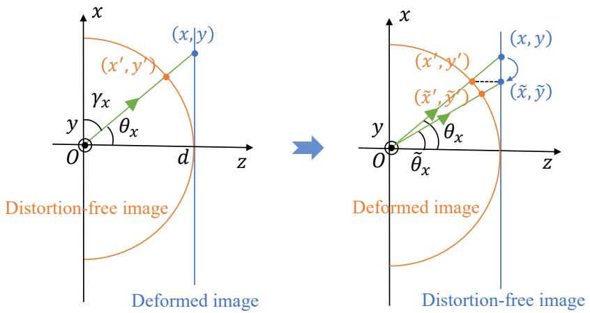

text_image

Distortion-free image
Deformed image
x
(x',y')
γx
θx
y
O
d
z
x
(x',y')
(x, y)
(x, y)
θx
θx
y
O
θx
z
Deformed image
Distortion-free image

Left: schematic of holographic display with uncorrected distortion. Right: schematic of distortion-free holographic display.

diffraction formula can be derived from Eq. (A17), resulting in

$$
\begin{array}{l} E \left(x, y, z _ {0}\right) = \frac {i \lambda d}{e ^ {i k d}} e ^ {- i \frac {\pi}{\lambda d} \left(x ^ {2} + y ^ {2}\right)} \mathcal {F} ^ {- 1} \left\{\tilde {E} \left(u, v, z\right) e ^ {- i \pi \lambda d \left(u ^ {2} + v ^ {2}\right)} \right\} \left(x, y, z\right) \\ = \frac {i \lambda d}{e ^ {i k d}} e ^ {- i \frac {\pi}{\lambda d} \left(x ^ {2} + y ^ {2}\right)} \mathcal {F} ^ {- 1} \left\{E (x = \lambda d u, y = \lambda d v, z) e ^ {- i \pi \lambda d \left(u ^ {2} + v ^ {2}\right)} \right\} (x, y, z). \tag {B2} \\ \end{array}
$$

Similarly, factors outside the (inverse) Fourier transform in Eqs. (A17) and (B2) can be ignored. Holograms in this category are referred to as Fresnel holograms.

# APPENDIX C: COMPENSATION ALGORITHMS FOR WIDE-FOV HOLOGRAPHIC DISPLAY

For the beauty and clarity of the equations, here we denote $u$ and $v$ as $u_x$ and $u_y$ , respectively.

(I) Distortion compensation. As illustrated in the left panel of Fig. 71, the hologram is positioned at z=0, the observation plane is located at z=d, and $\theta_{x}=\frac{\pi}{2}-\gamma_{x}$ and $\theta_{y}=\frac{\pi}{2}-\gamma_{y}$ are the diffraction angles in the x and y directions, respectively. Using Eq. (A8), we have

$$
u _ {x} = \frac {\sin \theta_ {x}}{\lambda}, \quad u _ {y} = \frac {\sin \theta_ {y}}{\lambda}. \tag {C1}
$$

On a spherical surface centered at the hologram with a radius of $d$ , the coordinate of a point can be expressed as $\left(x' = d \sin \theta_x, y' = d \sin \theta_y\right)$ , which differs from $\left(u_x, u_y\right)$ in Eq. (C1) only by a constant term, so there's no distortion on the spherical surface. However, on the observation plane, the coordinate of the corresponding point is $\left(x = d \tan \theta_x, y = d \tan \theta_y\right)$ , and distortion can be ignored only under the paraxial approximation where $x \approx u_x \lambda d$ and $y \approx u_y \lambda d$ as $\theta_x$ and $\theta_y$ tend towards 0 [from Eq. (A16)]. As the diffraction angle increases, the differences between $\left(x', y'\right)$ and $(x, y)$ , i.e., $x' - x = d$ ( $\sin \theta_x - \tan \theta_x$ ) and $y' - y = d$ ( $\sin \theta_y - \tan \theta_y$ ), become more significant, leading to more severe distortion. Hence, the holographic image generated by the hologram solved by the GS algorithm based on the Fraunhofer or Fresnel diffraction formula will show significant distortion under a wide FOV.

For a point $(x,y)$ on the observation plane, we define its radius vector as $\vec{l}=\sqrt{x^{2}+y^{2}\vec{l}_{0}}$ [where $\vec{l}_{0}$ is the unit vector along the direction from the origin to $(x,y)$ ], and its diffraction angle as $\theta(x,y)$ . This point has a corresponding point $(x^{\prime},y^{\prime})$ on the spherical surface with the same diffraction angle, whose radius vector is defined as $\vec{l}^{\prime}=\sqrt{x^{\prime2}+y^{\prime2}\vec{l}_{0}}$ . The lengths of $\vec{l}$ and $\vec{l}^{\prime}$ satisfy

$$
l = d \tan \theta (x, y), \quad l ^ {\prime} = d \sin \theta (x, y), \tag {C2}
$$

leading to a relationship between the lengths:

$$
l ^ {\prime} = l \cos \theta (x, y) = \frac {l}{\sqrt {1 + \tan^ {2} \theta (x , y)}}. \tag {C3}
$$

Since the radius vectors $\vec{l}$ and $\vec{l}^{\prime}$ are co-directional, from Eq. (C3), we have

$$
x ^ {\prime} = \frac {x}{\sqrt {1 + \tan^ {2} \theta (x , y)}}, \quad y ^ {\prime} = \frac {y}{\sqrt {1 + \tan^ {2} \theta (x , y)}}, \tag {C4}
$$

which reflects the transformation relationship between a point $(x, y)$ on the observation plane and the corresponding point $(x', y')$ on the spherical surface.

To correct distortion, as illustrated in the right panel of Fig. 71, the holographic image on the observation plane, rather than that on the spherical surface, should be distortion-free, meaning that each point $(x,y)$ on the observation plane must move to a new position $(\tilde{x},\tilde{y})$ to coincide with its original undistorted counterpart $\left(x^{\prime}=d\sin\theta_{x},y^{\prime}=d\sin\theta_{y}\right)$ , i.e.,

$$
\tilde {x} = d \tan \tilde {\theta} _ {x} = d \sin \theta_ {x}, \quad \tilde {y} = d \tan \tilde {\theta} _ {y} = d \sin \theta_ {y}, \tag {C5}
$$

where $\tilde{\theta}_{x}$ and $\tilde{\theta}_{y}$ are the diffraction angles of $(\tilde{x},\tilde{y})$ in the x and y directions, respectively.

From the definition, we have

$$
\tan \tilde {\theta} _ {x} \left(\tilde {x}\right) = \frac {\tilde {x}}{d}, \quad \tan \tilde {\theta} _ {y} \left(\tilde {y}\right) = \frac {\tilde {y}}{d}, \tag {C6}
$$

and

$$
\tan \tilde {\theta} \left(\tilde {x}, \tilde {y}\right) = \frac {\sqrt {\tilde {x} ^ {2} + \tilde {y} ^ {2}}}{d}, \tag {C7}
$$

where $\tilde{\theta}\left(\tilde{x},\tilde{y}\right)$ is the corresponding diffraction angle of $(\tilde{x},\tilde{y})$ . Substituting Eq. (C6) into Eq. (C7), we obtain

$$
\tan^ {2} \tilde {\theta} \left(\tilde {x}, \tilde {y}\right) = \tan^ {2} \tilde {\theta} _ {x} \left(\tilde {x}\right) + \tan^ {2} \tilde {\theta} _ {y} \left(\tilde {y}\right). \tag {C8}
$$

Equations (C7) and (C8) will be used later.

From Eq. (C5), if the maximum diffraction angle is $\theta_{max}$ before distortion correction, which follows Eq. (275), the maximum diffraction angle $\tilde{\theta}_{max}$ after correction is

$$
\tilde {\theta} _ {\max} = \arctan \left(\sin \theta_ {\max}\right). \tag {C9}
$$

Substituting Eq. (275) into Eq. (C9) yields

$$
\tilde {\theta} _ {\max} = \arctan \frac {\lambda}{2 a}. \tag {C10}
$$

Based on Eq. (C4), the coordinate $(\tilde{x}', \tilde{y}')$ of the point on the spherical surface corresponding to $(\tilde{x}, \tilde{y})$ satisfies

$$
\tilde {x} ^ {\prime} = \frac {\tilde {x}}{\sqrt {1 + \tan^ {2} \tilde {\theta} \left(\tilde {x} , \tilde {y}\right)}}, \quad \tilde {y} ^ {\prime} = \frac {\tilde {y}}{\sqrt {1 + \tan^ {2} \tilde {\theta} \left(\tilde {x} , \tilde {y}\right)}}. \tag {C11}
$$

Equation (C11) indicates that the holographic image on the spherical surface is inevitably distorted now. In this case, from Eq. (C1), the target image for the GS algorithm possesses the same distortion as the holographic image on the spherical surface. This means that by pre-introducing specific distortions into the original target image, it is possible to achieve a distortion-free holographic display on the observation plane. The introduced distortion follows Eq. (C11), where the coordinate $(\tilde{x},\tilde{y})$ is reinterpreted as the coordinate of a pixel on the target image (taking the center of the image as the origin, the same as below) before distortion correction, and the coordinate $(\tilde{x}^{\prime},\tilde{y}^{\prime})$ is reinterpreted as the coordinate of this pixel on the distortion-corrected target image. The current issue is to calculate the diffraction angle $\tilde{\theta}\left(\tilde{x},\tilde{y}\right)$ corresponding to the pixel $(\tilde{x},\tilde{y})$ on the target image.

Equation (C6) indicates that the tangent of the diffraction angle is directly proportional to the coordinate values, with the holographic image edge marking the maximum diffraction angle, leading to

$$
\tan \tilde {\theta} _ {x} (\tilde {x}) = \frac {\tilde {x}}{D _ {x} / 2} \tan \tilde {\theta} _ {\max}, \quad \tan \tilde {\theta} _ {y} (\tilde {y}) = \frac {\tilde {y}}{D _ {y} / 2} \tan \tilde {\theta} _ {\max}, \tag {C12}
$$

where $D_{x} \times D_{y}$ is the size of the target image. We note that Eq. (C12) indicates that the degree of distortion in the x and y directions will differ if $D_{x} \neq D_{y}$ . Therefore, it is advisable to use the target holographic image with $D_{x} = D_{y}$ to avoid this issue. Substituting Eq. (C12) into Eq. (C8), we obtain

$$
\tilde {\theta} (\tilde {x}, \tilde {y}) = \arctan \left(\sqrt {\left(\frac {\tilde {x}}{D _ {x} / 2}\right) ^ {2} + \left(\frac {\tilde {y}}{D _ {y} / 2}\right) ^ {2}} \tan \tilde {\theta} _ {\max}\right). \tag {C13}
$$

Further substituting Eq. (C10) into Eq. (C13), we obtain the final expression of the diffraction angle

$$
\tilde {\theta} (\tilde {x}, \tilde {y}) = \arctan \left(\sqrt {\left(\frac {\tilde {x}}{D _ {x} / 2}\right) ^ {2} + \left(\frac {\tilde {y}}{D _ {y} / 2}\right) ^ {2}} \frac {\lambda}{2 a}\right). \tag {C14}
$$

Incorporating Eq. (C14) into Eq. (C11), we obtain the distortion correction formula for wide-FOV holography:

$$
\tilde {x} ^ {\prime} = \kappa \tilde {x}, \tilde {y} ^ {\prime} = \kappa \tilde {y}, \kappa = \frac {1}{\sqrt {1 + \left(\left(\frac {\tilde {x}}{D _ {x} / 2}\right) ^ {2} + \left(\frac {\tilde {y}}{D _ {y} / 2}\right) ^ {2}\right) \left(\frac {\lambda}{2 a}\right) ^ {2}}}. \tag {C15}
$$

To correct for distortion, the target image of the GS algorithm should undergo distortion compensation according to Eq. (C15).

(II) Intensity compensation. Aside from the distortion issue, the holographic image also suffers from a gradual decrease in brightness as the diffraction angle increases. This issue is primarily attributed to two factors.  
(i) Firstly, the intensity distribution of the holographic image on the spherical surface decreases with the diffraction angle. Now we derive the complex amplitude distribution on a spherical observation surface centered at the diffraction plane with a radius of R. From Eq. (A1), when the distance between the observation surface and the

diffracting plane is sufficiently large to neglect the $\frac{1}{2\pi\bar{r}}$ term, we obtain

$$
E (x, y, z) = \frac {1}{i \lambda} \frac {z - z _ {0}}{R ^ {2}} \iint_ {\Sigma} E \left(x ^ {\prime}, y ^ {\prime}, z _ {0}\right) e ^ {i k \bar {r}} \mathrm{d} x ^ {\prime} \mathrm{d} y ^ {\prime}. \tag {C16}
$$

Here, we use $z - z_{0}$ instead of d to emphasize that this value may vary for different points on the spherical observation surface. In Eq. (C16), since the spherical surface is used as the observation surface, we do not use the paraxial approximation $\bar{r} \approx z - z_{0}$ , but instead $\bar{r} \approx R$ . From the definition of the diffraction angle $\theta$ , we have

$$
\cos \theta = \frac {z - z _ {0}}{R}, \tag {C17}
$$

Substituting Eq. (C17) into Eq. (C16), we further obtain

$$
E (x, y, z) = \frac {1}{i \lambda R} \cos \theta \iint_ {\Sigma} E (x ^ {\prime}, y ^ {\prime}, z _ {0}) e ^ {i k \bar {r}} \mathrm{d} x ^ {\prime} \mathrm{d} y ^ {\prime}, \tag {C18}
$$

which implies that the amplitude of the electric field intensity on the spherical surface decreases with the increase of the diffraction angle according to the law of $\cos \theta$ , and thus the intensity values of the diffraction pattern on the spherical surface decrease with the increase of the diffraction angle according to the law of $\cos^2\theta$ . Comparing Eq. (C18) with Eq. (A2), it's evident that the diffraction formula based on the paraxial approximation neglects the factor $\cos \theta$ related to amplitude change, explaining why the intensity of the holographic image on the spherical surface of the hologram solved by the GS algorithm based on the Fresnel or Fraunhofer diffraction formulas decreases with the diffraction angle.

(ii) The second factor is that, as shown in Fig. 71, the propagation of light from the spherical surface to the observation plane is essentially a projection process of the diffraction pattern, where the power per unit area $P_{\mathrm{sphere}}(x',y')$ on the spherical surface is higher than the corresponding power per unit area $P_{\mathrm{plane}}(x,y)$ on the observation plane. This relationship is described by the projection formula

$$
P _ {\text {plane}} (x, y) = P _ {\text {sphere}} \left(x ^ {\prime}, y ^ {\prime}\right) \cos \theta (x, y), \tag {C19}
$$

where $\theta(x, y)$ is the diffraction angle at the location $(x, y)$ , and the coordinates $(x, y)$ and $(x', y')$ follow Eq. (C4).

To correct this issue, it's necessary to perform intensity compensation on the target image.

(I) Assume that distortion correction will follow this intensity compensation. Considering both factors, if the grayscale distribution of the target image before correction is $I(\tilde{x},\tilde{y})$ , then the corrected target image's grayscale distribution $I'(\tilde{x},\tilde{y})$ satisfies

$$
I ^ {\prime} \left(\tilde {x}, \tilde {y}\right) = \frac {I \left(\tilde {x} , \tilde {y}\right)}{\cos^ {3} \tilde {\theta} \left(\tilde {x} , \tilde {y}\right)}, \tag {C20}
$$

where $\tilde{\theta}\left(\tilde{x},\tilde{y}\right)$ is the actual diffraction angle of the corresponding point on the holographic image of a pixel at location $(\tilde{x},\tilde{y})$ on the target image. Substituting Eq. (C14) into Eq. (C20), the intensity compensation formula for the target image is obtained:

$$
I ^ {\prime} (\tilde {x}, \tilde {y}) = \frac {I (\tilde {x} , \tilde {y})}{\cos^ {3} \left(\arctan \left(\sqrt {\left(\frac {\tilde {x}}{D _ {x} / 2}\right) ^ {2} + \left(\frac {\tilde {y}}{D _ {y} / 2}\right) ^ {2}} \frac {\lambda}{2 a}\right)\right)}. \tag {C21}
$$

To correct the amplitude distribution $A(\tilde{x},\tilde{y}) = \sqrt{I(\tilde{x},\tilde{y})}$ , simply take the square root

Figure 72  
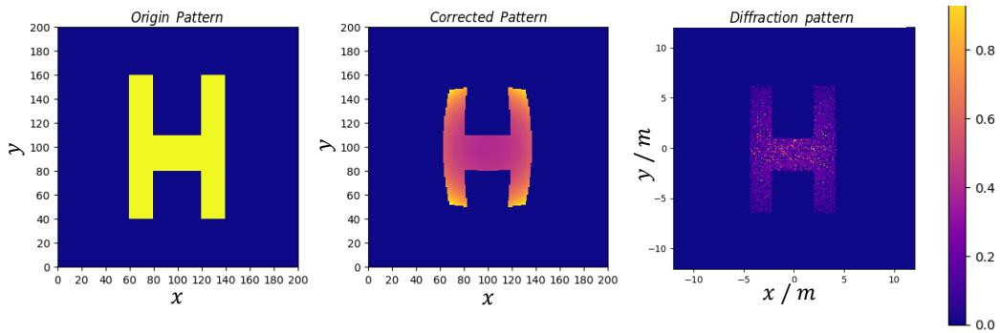  
Left: origin target image (the same as the target image in the third row in Fig. 38). Middle: result of distortion and intensity compensation for the origin target image. Right: Diffraction pattern on the observation plane of the hologram after distortion and intensity correction, calculated using the Rayleigh–Sommerfeld diffraction formula.

of both sides of Eq. (C21) to obtain the corresponding correction formula.

However, tests of this algorithm have indicated that there might be other reasons for the uneven brightness in holographic images. For example, the hologram solved by the GS algorithm may not always restore the holographic image intensity variations as represented by Eq. (C21), thus often requiring overcompensation in intensity correction. By further introducing an adjustment parameter $\beta$ into Eq. (C21), the intensity compensation formula becomes

$$
I ^ {\prime} \left(\tilde {x}, \tilde {y}\right) = \frac {I \left(\tilde {x} , \tilde {y}\right)}{\cos^ {\beta} \left(\arctan \left(\sqrt {\left(\frac {\tilde {x}}{D _ {x} / 2}\right) ^ {2} + \left(\frac {\tilde {y}}{D _ {y} / 2}\right) ^ {2}} \frac {\lambda}{2 a}\right)\right)}. \tag {C22}
$$

When $\beta > 3$ , the intensity compensation is excessive compared to Eq. (C21). In practice, $\beta$ can be adjusted until the Rayleigh–Sommerfeld diffraction pattern (holographic image) of the hologram obtained by the GS algorithm matches the target image well. For the original target image shown in the left panel of Fig. 72, the target image after distortion and intensity compensation (taking $\beta = 4$ ) is shown in the middle panel of Fig. 72, and the diffraction pattern of the hologram solved by the GS algorithm is shown in the right panel of Fig. 72. Note that both distortion and the issue of the image darkening with an increased FOV have been corrected.

(II) If no further distortion correction is conducted after intensity compensation, the intensity correction formula becomes

$$
I ^ {\prime} (x, y) = \frac {I (x , y)}{\cos^ {\beta} \left(\arcsin \left(\sqrt {\left(\frac {x}{D _ {x} / 2}\right) ^ {2} + \left(\frac {y}{D _ {y} / 2}\right) ^ {2}} \sin \theta_ {\max}\right)\right)}, \tag {C23}
$$

where the coordinate $(x,y)$ is the coordinate of a pixel on the target image, $I(x,y)$ is the grayscale distribution of the target image before correction, $I'(x,y)$ is the corrected target image's grayscale distribution, and $\theta_{max}$ is the maximum diffraction angle of the hologram, given by Eq. (275).

Figure 73  
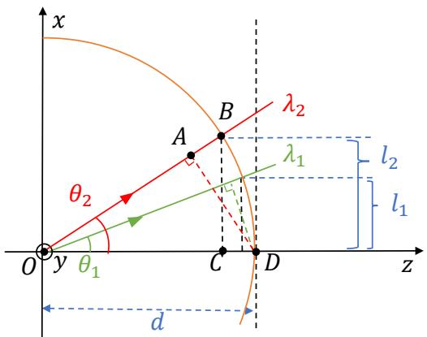

text_image

x
A
B
λ₂
θ₂
λ₁
l₂
l₁
O
y
C
D
z
d

Schematic for deriving the formula of chromatic aberration compensation.

# APPENDIX D: COMPENSATION ALGORITHMS FOR COLOR HOLOGRAPHIC DISPLAY

According to Eqs. (A4) and (A6), for both Fresnel and Fraunhofer holograms, when $\lambda d$ is a constant, the diffraction pattern on the observation plane remains unchanged. This results in varying degrees of scaling of the diffraction pattern on a fixed observation plane for incident light at different wavelengths.

As shown in Fig. 73, for light at wavelengths $\lambda_{1}$ and $\lambda_{2}$ ( $\lambda_{1}<\lambda_{2}$ ), their half FOV angles (namely, maximized diffraction angles) are denoted as $\theta_{1}$ and $\theta_{2}$ , respectively. From Eq. (275), we have

$$
\sin \theta_ {1} = \frac {\lambda_ {1}}{2 a}, \quad \sin \theta_ {2} = \frac {\lambda_ {2}}{2 a}, \tag {D1}
$$

where $a$ is the unit size of the hologram. When compensating for chromatic aberration, the compensation for wide-FOV holography mentioned above is not considered. This means that intensity and distortion corrections are applied to the grayscale images of each color component of the target color image, following chromatic aberration correction, if necessary. Thus, the holographic image on a spherical surface centered at the hologram with a radius of $d$ is examined. Taking the wavelength $\lambda_{2}$ as an example, the semi-width of the holographic image is $l_{2} = \overline{\mathrm{BC}}$ , and it's easy to prove that $\triangle \mathrm{OBC}$ is congruent to $\triangle \mathrm{ODA}$ , leading to $l_{2} = \overline{\mathrm{BC}} = \overline{\mathrm{AD}} = d\sin \theta_{2}$ . Substituting Eq. (D1) gives

$$
l _ {2} = d \sin \theta_ {2} = d \frac {\lambda_ {2}}{2 a}. \tag {D2}
$$

Similarly, the semi-width of the holographic image generated by light at wavelength $\lambda_{1}$ is

$$
l _ {1} = d \sin \theta_ {1} = d \frac {\lambda_ {1}}{2 a}. \tag {D3}
$$

To ensure the holographic image generated by light at wavelength $\lambda_{2}$ is the same size as that generated by light at wavelength $\lambda_{1}$ , the target image for wavelength $\lambda_{2}$ needs to be scaled by a factor $s = \frac{l_{1}}{l_{2}}$ , referred to as chromatic aberration compensation. Using Eqs. (D2) and (D3), the scaling ratio is

$$
s = \frac {\sin \theta_ {1}}{\sin \theta_ {2}} = \frac {\lambda_ {1}}{\lambda_ {2}}. \tag {D4}
$$

This formula is given in reference [135].

# FUNDING

National Natural Science Foundation of China (62222511 and 61905213); Natural Science Foundation of Zhejiang Province (LR22F050006); National Key Research and Development Program of China (2023YFF0613000).

# ACKNOWLEDGMENT

The authors would like to thank the editor and anonymous reviewers for their constructive feedback, which has greatly improved the quality of this paper. The authors are also grateful to Prof. Liangcai Cao for his valuable comments and suggestions.

# DISCLOSURES

The authors declare no conflicts of interest.

# DATA AVAILABILITY

Data underlying the results presented in this paper are not publicly available at this time but may be obtained from the authors upon reasonable request.

# REFERENCES

1. Q. Zhang, Z. He, Z. Xie, et al., “Diffractive optical elements 75 years on: from micro-optics to metasurfaces,” Photonics Insights 2, R09 (2023).  
2. W. Freese, T. Kämpfe, E.-B. Kley, et al., “Design of binary subwavelength multiphase level computer generated holograms,” Opt. Lett. 35, 676–678 (2010).  
3. C.-F. Pan, H. Wang, H. Wang, et al., “3D-printed multilayer structures for high-numerical aperture achromatic metalenses,” Sci. Adv. 9, eadj9262 (2023).  
4. X. Zu, X. Sun, W. Yan, et al., “Fast and efficient inverse design framework for multifunctional metalenses,” Laser Photonics Rev. 19, 2400886 (2025).  
5. T. Gu, H. J. Kim, C. Rivero-Baleine, et al., “Reconfigurable metasurfaces towards commercial success,” Nat. Photonics 17, 48–58 (2023).  
6. Y. Yang, E. Lee, Y. Park, et al., “The road to commercializing optical metasurfaces: current challenges and future directions,” ACS Nano 19, 3008–3018 (2025).  
7. M. L. Brongersma, R. A. Pala, H. Altug, et al., “The second optical metasurface revolution: moving from science to technology,” Nat. Rev. Electr. Eng. 2, 125–143 (2025).  
8. A. Arbabi, Y. Horie, A. J. Ball, et al., “Subwavelength-thick lenses with high numerical apertures and large efficiency based on high-contrast transmitarrays,” Nat. Commun. 6, 7069 (2015).  
9. R. Paniagua-Domínguez, Y. F. Yu, E. Khaidarov, et al., “A metalens with a near-unity numerical aperture,” Nano Lett. 18, 2124–2132 (2018).  
10. M. Decker, W. T. Chen, T. Nobis, et al., “Imaging performance of polarization-insensitive metalenses,” ACS Photonics 6, 1493–1499 (2019).  
11. Y. Bao, L. Wen, Q. Chen, et al., “Toward the capacity limit of 2D planar jones matrix with a single-layer metasurface,” Sci. Adv. 7, eabh0365 (2021).  
12. N. A. Rubin, A. Zaidi, A. H. Dorrah, et al., “Jones matrix holography with metasurfaces,” Sci. Adv. 7, eabg7488 (2021).  
13. Y. Liu and X. Zhang, “Metamaterials: a new frontier of science and technology,” Chem. Soc. Rev. 40, 2494–2507 (2011).  
14. T. J. Cui, D. R. Smith, and R. Liu, Metamaterials Theory, Design, and Applications, 1st ed. (Springer Nature, 2010).  
15. V. G. Veselago, “The electrodynamics of substances with simultaneously negative values of $\varepsilon$ and $\mu$ ,” Uspekhi Fizicheskikh Nauk 92, 517–526 (1967).  
16. J. B. Pendry, A. J. Holden, W. J. Stewart, et al., “Extremely low frequency plasmons in metallic mesostructures,” Phys. Rev. Lett. 76, 4773–4776 (1996).  
17. J. Pendry, A. Holden, D. Robbins, et al., “Magnetism from conductors and enhanced nonlinear phenomena,” IEEE Trans. Microw. Theory Tech. 47, 2075–2084 (1999).  
18. R. A. Shelby, D. R. Smith, and S. Schultz, “Experimental verification of a negative index of refraction,” Science 292, 77–79 (2001).  
19. J. B. Pendry, D. Schurig, and D. R. Smith, “Controlling electromagnetic fields,” Science 312, 1780–1782 (2006).  
20. D. R. Smith and J. B. Pendry, “Homogenization of metamaterials by field averaging (invited paper),” J. Opt. Soc. Am. B 23, 391–403 (2006).  
21. D. R. Smith, D. C. Vier, T. Koschny, et al., “Electromagnetic parameter retrieval from inhomogeneous metamaterials,” Phys. Rev. E 71, 036617 (2005).  
22. R. Liu, T. J. Cui, D. Huang, et al., “Description and explanation of electromagnetic behaviors in artificial metamaterials based on effective medium theory,” Phys. Rev. E Stat. Nonlin. Soft Matter Phys. 76, 026606 (2007).  
23. A. Grbic and G. V. Eleftheriades, “Overcoming the diffraction limit with a planar left-handed transmission-line lens,” Phys. Rev. Lett. 92, 117403 (2004).  
24. U. Leonhardt, "Optical conformal mapping," Science 312, 1777-1780 (2006).  
25. D. Schurig, J. J. Mock, B. J. Justice, et al., “Metamaterial electromagnetic cloak at microwave frequencies,” Science 314, 977–980 (2006).  
26. R. Liu, C. Ji, J. J. Mock, et al., “Broadband ground-plane cloak,” Science 323, 366–369 (2009).  
27. S. Ma, B. Yang, and S. Zhang, “Topological photonics in metamaterials,” Photon. Insights 1, R02 (2022).  
28. Y. Zhai, Y. Ma, S. N. David, et al., “Scalable-manufactured randomized glass-polymer hybrid metamaterial for daytime radiative cooling,” Science 355, 1062–1066 (2017).  
29. S. Zeng, S. Pian, M. Su, et al., “Hierarchical-morphology metafabric for scalable passive daytime radiative cooling,” Science 373, 692–696 (2021).  
30. P. Camayd-Muñoz, C. Ballew, G. Roberts, et al., “Multifunctional volumetric meta-optics for color and polarization image sensors,” Optica 7, 280–283 (2020).  
31. J. Chen, S. Hu, S. Zhu, et al., “Metamaterials: from fundamental physics to intelligent design,” Interdiscip. Mater. 2, 5–29 (2023).  
32. O. Quevedo-Teruel, H. Chen, A. Díaz-Rubio, et al., “Roadmap on metasurfaces,” J. Opt. 21, 073002 (2019).  
33. A. I. Kuznetsov, M. L. Brongersma, J. Yao, et al., “Roadmap for optical metasurfaces,” ACS Photonics 11, 816–865 (2024).  
34. T. J. Cui, S. Zhang, A. Alu, et al., “Roadmap on electromagnetic metamaterials and metasurfaces,” J. Phys. Photonics 6, 032502 (2024).  
35. S. A. Schulz, R. F. Oulton, M. Kenney, et al., “Roadmap on photonic metasurfaces,” Appl. Phys. Lett. 124, 260701 (2024).  
36. I. Brener, S. Liu, I. Staude, et al., Dielectric Metamaterials: Fundamentals, Designs and Applications (Elsevier, 2019).  
37. L. Zhang, J. Ding, H. Zheng, et al., “Ultra-thin high-efficiency mid-infrared transmissive Huygens meta-optics,” Nat. Commun. 9, 1481 (2018).  
38. C. L. Holloway, E. F. Kuester, J. A. Gordon, et al., “An overview of the theory and applications of metasurfaces: the two-dimensional equivalents of metamaterials,” IEEE Antennas Propag. Mag. 54, 10–35 (2012).  
39. J. R. Reis, M. Vala, and R. F. S. Caldeirinha, “Review paper on transmitarray antennas,” IEEE Access 7, 94171–94188 (2019).  
40. J. A. Joy, S. K. Palaniswamy, S. Kumar, et al., “Modern reflectarray antennas: a review of the design, state-of-the-art, and research challenges,” IEEE Access 12, 46717–46740 (2024).  
41. J. Wang, Y. Li, Z. H. Jiang, et al., “Metantenna: when metasurface meets antenna again,” IEEE Trans. Antennas Propag. 68, 1332–1347 (2020).  
42. A. V. Kildishev, A. Boltasseva, and V. M. Shalaev, “Planar photonics with metasurfaces,” Science 339, 1232009 (2013).  
43. T. J. Cui, M. Q. Qi, X. Wan, et al., “Coding metamaterials, digital metamaterials and programmable metamaterials,” Light Sci. Appl. 3, e218 (2014).  
44. P. Bharadwaj, B. Deutsch, and L. Novotny, “Optical antennas,” Adv. Opt. Photonics 1, 438–483 (2009).  
45. S. I. Kim, J. Park, B. G. Jeong, et al., “Two-dimensional beam steering with tunable metasurface in infrared regime,” Nanophotonics 11, 2719–2726 (2022).  
46. W. Yang, J. Li, D. Chen, et al., “Advanced metasurface-based antennas: a review,” IEEE Open J. Antennas Propag. 6, 6–24 (2025).  
47. A. Wirth-Singh, J. E. Fröch, F. Yang, et al., “Wide field of view large aperture meta-doublet eyepiece,” Light Sci. Appl. 14, 17 (2025).  
48. W. Meng, J. E. Fröch, K. Cheng, et al., “Ultranarrow-linewidth wavelength-vortex metasurface holography,” Sci. Adv. 11, eadt9159 (2025).  
49. R. Zhou, C. Wang, Y. Huang, et al., "Label-free terahertz microfluidic biosensor for sensitive DNA detection using graphene-metasurface hybrid structures," Biosens. Bioelectron. 188, 113336 (2021).  
50. Z. Yu, H. Li, W. Zhao, et al., “High-security learning-based optical encryption assisted by disordered metasurface,” Nat. Commun. 15, 2607 (2024).  
51. G. H. Yuan and N. I. Zheludev, “Detecting nanometric displacements with optical ruler metrology,” Science 364, 771–775 (2019).  
52. G. Cai, Y. Li, Y. Zhang, et al., “Compact angle-resolved metasurface spectrometer,” Nat. Mater. 23, 71–78 (2024).  
53. S. T. Ha, Q. Li, J. K. W. Yang, et al., “Optoelectronic metadevices,” Science 386, eadm7442 (2024).  
54. W. Jia, G. Saerens, Ü.-L. Talts, et al., “Polarization-entangled bell state generation from an epsilon-near-zero metasurface,” Sci. Adv. 11, eads3576 (2025).  
55. A. Tripathi, C. F. Ugwu, V. S. Asadchy, et al., “Nanoscale optical nonreciprocity with nonlinear metasurfaces,” Nat. Commun. 15, 5077 (2024).  
56. Z. Li, Q. Dai, M. Q. Mehmood, et al., “Full-space cloud of random points with a scrambling metasurface,” Light Sci. Appl. 7, 63 (2018).  
57. R. C. Devlin, A. Ambrosio, N. A. Rubin, et al., “Arbitrary spin-to-orbital angular momentum conversion of light,” Science 358, 896–901 (2017).  
58. M. Choi, J. Kim, S. Moon, et al., “Roll-to-plate printable rgb achromatic metalens for wide-field-of-view holographic near-eye displays,” Nat. Mater. 24, 535–543 (2025).  
59. S. Divitt, W. Zhu, C. Zhang, et al., “Ultrafast optical pulse shaping using dielectric metasurfaces,” Science 364, 890–894 (2019).  
60. H. Chen, W.-B. Lu, Z.-G. Liu, et al., “Microwave programmable graphene metasurface,” ACS Photonics 7, 1425–1435 (2020).  
61. S. B. Glybovski, S. A. Tretyakov, P. A. Belov, et al., “Metasurfaces: from microwaves to visible,” Phys. Rep. 634, 1–72 (2016).  
62. X. Zhao, J. Schalch, J. Zhang, et al., “Electromechanically tunable metasurface transmission waveplate at terahertz frequencies,” Optica 5, 303–310 (2018).  
63. I. Al-Naib and W. Withayachumnankul, “Recent progress in terahertz metasurfaces,” J. Infrared, Millimeter, Terahertz Waves 38, 1067–1084 (2017).  
64. P. Li, I. Dolado, F. J. Alfaro-Mozaz, et al., “Infrared hyperbolic metasurface based on nanostructured van der Waals materials,” Science 359, 892–896 (2018).  
65. Y. Lei, Q. Chen, Y. Liu, et al., “Principles and application progress of mid-infrared metasurfaces in imaging and detection (invited),” Infr. Laser Eng. 51, 20220082 (2022).  
66. M. Khorasaninejad, W. T. Chen, R. C. Devlin, et al., “Metalenses at visible wavelengths: diffraction-limited focusing and subwavelength resolution imaging,” Science 352, 1190–1194 (2016).  
67. D. Neshev and I. Aharonovich, “Optical metasurfaces: new generation building blocks for multi-functional optics,” Light Sci. Appl. 7, 58 (2018).  
68. M. Ossiander, M. L. Meretska, H. K. Hampel, et al., “Extreme ultraviolet metalens by vacuum guiding,” Science 380, 59–63 (2023).  
69. D. Zhao, Z. Lin, W. Zhu, et al., “Recent advances in ultraviolet nanophotonics: from plasmonics and metamaterials to metasurfaces,” Nanophotonics 10, 2283–2308 (2021).  
70. Z. Bomzon, V. Kleiner, and E. Hasman, “Formation of radially and azimuthally polarized light using space-variant subwavelength metal stripe gratings,” Appl. Phys. Lett. 79, 1587–1589 (2001).  
71. Z. Bomzon, V. Kleiner, and E. Hasman, “Pancharatnam–Berry phase in space-variant polarization-state manipulations with subwavelength gratings,” Opt. Lett. 26, 1424–1426 (2001).  
72. W. Freese, T. Kämpfe, W. Rockstroh, et al., “Optimized electron beam writing strategy for fabricating computer-generated holograms based on an effective medium approach,” Opt. Express 19, 8684–8692 (2011).  
73. Y. Gao, “Metasurface-design” (2024), https://github.com/hzzg0727/MetasurfaceDesign.  
74. S. Sun, Q. He, J. Hao, et al., “Electromagnetic metasurfaces: physics and applications,” Adv. Opt. Photonics 11, 380–479 (2019).  
75. N. I. Landy, S. Sajuyigbe, J. J. Mock, et al., “Perfect metamaterial absorber,” Phys. Rev. Lett. 100, 207402 (2008).  
76. J. Hao, Y. Yuan, L. Ran, et al., “Manipulating electromagnetic wave polarizations by anisotropic metamaterials,” Phys. Rev. Lett. 99, 063908 (2007).  
77. L. Martín-Moreno, F. J. García-Vidal, H. J. Lezec, et al., “Theory of extraordinary optical transmission through subwavelength hole arrays,” Phys. Rev. Lett. 86, 1114–1117 (2001).  
78. S. Liu, M. B. Sinclair, T. S. Mahony, et al., “Optical magnetic mirrors without metals,” Optica 1, 250–256 (2014).  
79. W. Liu, “Generalized magnetic mirrors,” Phys. Rev. Lett. 119, 123902 (2017).  
80. K. L. Koshelev, P. Tonkaev, and Y. S. Kivshar, “Nonlinear chiral metaphotonics: a perspective,” Adv. Photonics 5, 064001 (2023).  
81. W. Liu and Y. S. Kivshar, “Generalized Kerker effects in nanophotonics and meta-optics [invited],” Opt. Express 26, 13085–13105 (2018).  
82. A. E. Miroshnichenko, A. B. Evlyukhin, Y. F. Yu, et al., “Nonradiating anapole modes in dielectric nanoparticles,” Nat. Commun. 6, 8069 (2015).  
83. V. Savinov, N. Papasimakis, D. P. Tsai, et al., “Optical anapoles,” Commun. Phys. 2, 1–4 (2019).  
84. N. Muhammad, Z. Su, Q. Jiang, et al., “Radiationless optical modes in metasurfaces: Recent progress and applications,” Light Sci. Appl. 13, 192 (2024).  
85. C. Chen, P. Gao, Y. Dai, et al., “All-dielectric near-infrared metasurface with field enhancement and high Q-factor based on anapole precise manipulation,” Adv. Opt. Mater. 13, 2403312 (2025).  
86. M. F. Limonov, M. V. Rybin, A. N. Poddubny, et al., “Fano resonances in photonics,” Nat. Photonics 11, 543–554 (2017).  
87. A. E. Miroshnichenko, S. Flach, and Y. S. Kivshar, “Fano resonances in nanoscale structures,” Rev. Mod. Phys. s 82, 2257–2298 (2010).  
88. K. Koshelev, S. Lepeshov, M. Liu, et al., “Asymmetric metasurfaces with high-Q resonances governed by bound states in the continuum,” Phys. Rev. Lett. 121, 193903 (2018).  
89. G. Mie, “Beiträge zur Optik trüber Medien, speziell kolloidaler Metallösungen,” Ann. Phys. 330, 377–445 (1908).  
90. M. Born and E. Wolf, Principles of Optics, 7th ed. (Cambridge University Press, Cambridge, 2019).  
91. V. Grigoriev, A. Tahri, S. Varault, et al., “Optimization of resonant effects in nanostructures via Weierstrass factorization,” Phys. Rev. A 88, 011803 (2013).  
92. S. W. D. Lim, M. L. Meretska, and F. Capasso, “A high aspect ratio inverse-designed holey metalens,” Nano Lett. 21, 8642–8649 (2021).  
93. F. Binkowski, F. Betz, R. Colom, et al., “Poles and zeros in non-Hermitian systems: application to photonics,” Phys. Rev. B 109, 045414 (2024).  
94. C. L. Holloway, E. F. Kuester, and A. Dienstfrey, “Characterizing metasurfaces/metafilms: the connection between surface susceptibilities and effective material properties,” IEEE Antennas Wirel. Propag. Lett. 10, 1507–1511 (2011).  
95. C. L. Holloway, A. Dienstfrey, E. F. Kuester, et al., “A discussion on the interpretation and characterization of metafilms/metasurfaces: the two-dimensional equivalent of metamaterials,” Metamaterials 3, 100–112 (2009).  
96. R. Rumpf, Electromagnetic and Photonic Simulation for the Beginner: Finite-Difference Frequency-Domain in MATLAB, 1st ed. (Artech House, 2022).  
97. V. Liu and S. Fan, “S4: a free electromagnetic solver for layered periodic structures,” Comput. Phys. Commun. 183, 2233–2244 (2012).  
98. O. C. Zienkiewicz and R. L. Taylor, The Finite Element Method: Its Basis and Fundamentals (Butterworth-Heinemann, 2013).  
99. T. Weiland, “A discretization model for the solution of Maxwell’s equations for six-component fields,” Archiv Elektronik Und Uebertragungstechnik 31, 116–120 (1977).  
100. S. Wang, P. C. Wu, V.-C. Su, et al., “Broadband achromatic optical metasurface devices,” Nat. Commun. 8, 187 (2017).  
101. A. A. High, R. C. Devlin, A. Dibos, et al., “Visible-frequency hyperbolic metasurface,” Nature 522, 192–196 (2015).  
102. L. Novotny and B. Hecht, Principles of Nano-Optics, 2nd ed. (Cambridge University Press, Cambridge, 2012).  
103. S. A. Maier, Plasmonics: Fundamentals and Applications, 1st ed. (Springer, Berlin, Heidelberg, 2007).  
104. S. V. Gaponenko, Introduction to Nanophotonics (Cambridge University Press, 2010).  
105. K. Koshelev, A. Bogdanov, and Y. Kivshar, “Meta-optics and bound states in the continuum,” Sci. Bull. (Beijing) 64, 836–842 (2019).  
106. A. I. Kuznetsov, A. E. Miroshnichenko, M. L. Brongersma, et al., “Optically resonant dielectric nanostructures,” Science 354, aag2472 (2016).  
107. D. R. Smith, J. J. Mock, A. F. Starr, et al., “Gradient index metamaterials,” Phys. Rev. E 71, 036609 (2005).  
108. S. RoyChoudhury, V. Rawat, A. H. Jalal, et al., “Recent advances in metamaterial split-ring-resonator circuits as biosensors and therapeutic agents,” Biosens. Bioelectron. 86, 595–608 (2016).  
109. S. Sun, Q. He, S. Xiao, et al., “Gradient-index meta-surfaces as a bridge linking propagating waves and surface waves,” Nat. Mater. 11, 426–431 (2012).  
110. S. Sun, K.-Y. Yang, C.-M. Wang, et al., “High-efficiency broadband anomalous reflection by gradient meta-surfaces,” Nano Lett. 12, 6223–6229 (2012).  
111. V. G. Kravets, A. V. Kabashin, W. L. Barnes, et al., “Plasmonic surface lattice resonances: a review of properties and applications,” Chem. Rev. 118, 5912–5951 (2018).  
112. M. S. Bin-Alam, O. Reshef, Y. Mamchur, et al., “Ultra-high-Q resonances in plasmonic metasurfaces,” Nat. Commun. 12, 974 (2021).  
113. A. Boltasseva and H. A. Atwater, “Low-loss plasmonic metamaterials,” Science 331, 290–291 (2011).  
114. G. Zheng, H. Mühlenbernd, M. Kenney, et al., “Metasurface holograms reaching 80% efficiency,” Nat. Nanotechnol. 10, 308–312 (2015).  
115. S. M. Kamali, E. Arbabi, A. Arbabi, et al., “A review of dielectric optical metasurfaces for wavefront control,” Nanophotonics 7, 1041–1068 (2018).  
116. H. Liang, Q. Lin, X. Xie, et al., “Ultrahigh numerical aperture metalens at visible wavelengths,” Nano Lett. 18, 4460–4466 (2018).  
117. G. Yoon, K. Kim, D. Huh, et al., “Single-step manufacturing of hierarchical dielectric metalens in the visible,” Nat. Commun. 11, 2268 (2020).  
118. B. H. Chen, P. C. Wu, V.-C. Su, et al., “GaN metalens for pixel-level full-color routing at visible light,” Nano Lett. 17, 6345–6352 (2017).  
119. R. J. Lin, V.-C. Su, S. Wang, et al., “Achromatic metalens array for full-colour light-field imaging,” Nat. Nanotechnol. 14, 227–231 (2019).  
120. L. Wang, S. Kruk, H. Tang, et al., “Grayscale transparent metasurface holograms,” Optica 3, 1504–1505 (2016).  
121. W. T. Chen, A. Y. Zhu, J. Sisler, et al., “Broadband achromatic metasurface-refractive optics,” Nano Lett. 18, 7801–7808 (2018).  
122. Y. Kivshar and A. Miroshnichenko, “Meta-optics with Mie resonances,” Opt. Photonics News 28, 24–31 (2017).  
123. W. Liu and Y. S. Kivshar, “Multipolar interference effects in nanophotonics,” Philos. Trans. Roy. Soc. A: Math. Phys. Eng. Sci. 375, 20160317 (2017).  
124. K. Koshelev and Y. Kivshar, “Dielectric resonant metaphotonics,” ACS Photonics 8, 102–112 (2021).  
125. D. Barton, J. Hu, J. Dixon, et al., “High-q nanophotonics: sculpting wavefronts with slow light,” Nanophotonics 10, 83–88 (2020).  
126. R. Colom, E. Mikheeva, K. Achouri, et al., “Crossing of the branch cut: the topological origin of a universal $2\pi$ -phase retardation in non-Hermitian metasurfaces,” Laser Photonics Rev. 17, 2200976 (2023).  
127. C. Pfeiffer and A. Grbic, “Metamaterial Huygens’ surfaces: tailoring wave fronts with reflectionless sheets,” Phys. Rev. Lett. 110, 197401 (2013).  
128. M. Decker, I. Staude, M. Falkner, et al., “High-efficiency dielectric Huygens’ surfaces,” Adv. Opt. Mater. 3, 813–820 (2015).  
129. K. E. Chong, L. Wang, I. Staude, et al., “Efficient polarization-insensitive complex wavefront control using Huygens’ metasurfaces based on dielectric resonant meta-atoms,” ACS Photonics 3, 514–519 (2016).  
130. M. Chen, M. Kim, A. M. H. Wong, et al., “Huygens’ metasurfaces from microwaves to optics: a review,” Nanophotonics 7, 1207–1231 (2018).  
131. J. Engelberg and U. Levy, “The advantages of metalenses over diffractive lenses,” Nat. Commun. 11, 1991 (2020).  
132. C. Gigli, Q. Li, P. Chavel, et al., “Fundamental limitations of Huygens’ metasurfaces for optical beam shaping,” Laser Photonics Rev. 15, 2000448 (2021).  
133. Q. Song, M. Odeh, J. Zúñiga-Pérez, et al., “Plasmonic topological metasurface by encircling an exceptional point,” Science 373, 1133–1137 (2021).  
134. E. Mikheeva, R. Colom, K. Achouri, et al., “Asymmetric phase modulation of light with parity-symmetry broken metasurfaces,” Optica 10, 1287–1294 (2023).  
135. Y. Hu, L. Li, Y. Wang, et al., “Trichromatic and tripolarization-channel holography with noninterleaved dielectric metasurface,” Nano Lett. 20, 994–1002 (2020).  
136. F. Presutti and F. Monticone, “Focusing on bandwidth: achromatic metalens limits,” Optica 7, 624–631 (2020).  
137. P. R. West, J. L. Stewart, A. V. Kildishev, et al., “All-dielectric subwavelength metasurface focusing lens,” Opt. Express 22, 26212–26221 (2014).  
138. Y. Wang, Q. Chen, W. Yang, et al., “High-efficiency broadband achromatic metalens for near-ir biological imaging window,” Nat. Commun. 12, 5560 (2021).  
139. W. T. Chen, A. Y. Zhu, V. Sanjeev, et al., “A broadband achromatic metalens for focusing and imaging in the visible,” Nat. Nanotechnol. 13, 220–226 (2018).  
140. C. Menzel, C. Rockstuhl, and F. Lederer, “Advanced jones calculus for the classification of periodic metamaterials,” Phys. Rev. A 82, 053811 (2010).  
141. N. A. Rubin, Z. Shi, and F. Capasso, “Polarization in diffractive optics and metasurfaces,” Adv. Opt. Photonics 13, 836–970 (2021).  
142. S. N. Volkov, K. Dolgaleva, R. W. Boyd, et al., “Optical activity in diffraction from a planar array of achiral nanoparticles,” Phys. Rev. A 79, 043819 (2009).  
143. A. Arbabi, Y. Horie, M. Bagheri, et al., “Dielectric metasurfaces for complete control of phase and polarization with subwavelength spatial resolution and high transmission,” Nat. Nanotechnol. 10, 937–943 (2015).  
144. S. Shrestha, A. C. Overvig, M. Lu, et al., “Broadband achromatic dielectric metalenses,” Light Sci. Appl. 7, 85 (2018).  
145. X. Zhang, X. Li, J. Jin, et al., “Polarization-independent broadband metaholograms via polarization-dependent nanoholes,” Nanoscale 10, 9304–9310 (2018).  
146. E. Cohen, H. Larocque, F. Bouchard, et al., “Geometric phase from Aharonov–Bohm to Pancharatnam–Berry and beyond,” Nat. Rev. Phys. 1, 437–449 (2019).  
147. C. P. Jisha, S. Nolte, and A. Alberucci, “Geometric phase in optics: from wavefront manipulation to waveguiding,” Laser Photonics Rev. 15, 2100003 (2021).  
148. S. Pancharatnam, “Generalized theory of interference, and its applications,” Proc. Indian Acad. Sci. Sect. A 44, 247–262 (1956).  
149. M. V. Berry, “Quantal phase factors accompanying adiabatic changes,” Proc. Roy. Soc. Lond. A Math. Phys. Sci. 392, 45–57 (1984).  
150. M. V. Berry, “The adiabatic phase and Pancharatnam’s phase for polarized light,” J. Mod. Opt. 34, 1401–1407 (1987).  
151. Z. Bomzon, G. Biener, V. Kleiner, et al., “Space-variant Pancharatnam–Berry phase optical elements with computer-generated subwavelength gratings,” Opt. Lett. 27, 1141–1143 (2002).  
152. G. Biener, A. Niv, V. Kleiner, et al., “Formation of helical beams by use of Pancharatnam–Berry phase optical elements,” Opt. Lett. 27, 1875–1877 (2002).  
153. X. Xie, M. Pu, J. Jin, et al., “Generalized Pancharatnam-Berry phase in rotationally symmetric meta-atoms,” Phys. Rev. Lett. 126, 183902 (2021).  
154. Q. Wei, L. Huang, X. Li, et al., “Broadband multiplane holography based on plasmonic metasurface,” Adv. Opt. Mater. 5, 1700434 (2017).  
155. X. Jing, R. Zhao, X. Li, et al., “Single-shot 3D imaging with point cloud projection based on metadevice,” Nat. Commun. 13, 7842 (2022).  
156. W. T. Chen, A. Y. Zhu, J. Sisler, et al., “A broadband achromatic polarization-insensitive metalens consisting of anisotropic nanostructures,” Nat. Commun. 10, 355 (2019).  
157. H.-H. Hsiao, C. H. Chu, and D. P. Tsai, “Fundamentals and applications of metasurfaces,” Small Methods 1, 1600064 (2017).  
158. F. Zhang, M. Pu, X. Li, et al., “Extreme-angle silicon infrared optics enabled by streamlined surfaces,” Adv. Mater. 33, e2008157 (2021).  
159. K. Huang, Z. Dong, S. Mei, et al., “Silicon multi-meta-holograms for the broadband visible light,” Laser Photonics Rev. 10, 500–509 (2016).  
160. W. Ye, F. Zeuner, X. Li, et al., “Spin and wavelength multiplexed nonlinear metasurface holography,” Nat. Commun. 7, 11930 (2016).  
161. M. Khorasaninejad, A. Ambrosio, P. Kanhaiya, et al., “Broadband and chiral binary dielectric meta-holograms,” Sci. Adv. 2, e1501258 (2016).  
162. Y. Shi, C. Wan, C. Dai, et al., “Augmented reality enabled by on-chip metaholography multiplexing,” Laser Photonics Rev. 16, 2100638 (2022).  
163. B. R. Brown and A. W. Lohmann, “Complex spatial filtering with binary masks,” Appl. Opt. 5, 967–969 (1966).  
164. A. W. Lohmann and D. P. Paris, “Binary Fraunhofer holograms, generated by computer,” Appl. Opt. 6, 1739–1748 (1967).  
165. D. Wang, Y. Hwang, Y. Dai, et al., “Broadband high-efficiency chiral splitters and holograms from dielectric nanoarc metasurfaces,” Small 15, e1900483 (2019).  
166. C. Min, J. Liu, T. Lei, et al., “Plasmonic nano-slits assisted polarization selective detour phase meta-hologram,” Laser Photonics Rev. 10, 978–985 (2016).  
167. Z.-L. Deng, J. Deng, X. Zhuang, et al., “Facile metagrating holograms with broadband and extreme angle tolerance,” Light Sci. Appl. 7, 78 (2018).  
168. Z.-L. Deng, M. Jin, X. Ye, et al., “Full-color complex-amplitude vectorial holograms based on multi-freedom metasurfaces,” Adv. Funct. Mater. 30, 1910610 (2020).  
169. J. P. B. Mueller, N. A. Rubin, R. C. Devlin, et al., “Metasurface polarization optics: independent phase control of arbitrary orthogonal states of polarization,” Phys. Rev. Lett. 118, 113901 (2017).  
170. R. Zhao, B. Sain, Q. Wei, et al., “Multichannel vectorial holographic display and encryption,” Light Sci. Appl. 7, 95 (2018).  
171. Y. Yuan, K. Zhang, B. Ratni, et al., “Independent phase modulation for quadruplex polarization channels enabled by chirality-assisted geometric-phase metasurfaces,” Nat. Commun. 11, 4186 (2020).  
172. Y. Bao, F. Nan, J. Yan, et al., “Observation of full-parameter Jones matrix in bilayer metasurface,” Nat. Commun. 13, 7550 (2022).  
173. B. Xiong, Y. Liu, Y. Xu, et al., “Breaking the limitation of polarization multiplexing in optical metasurfaces with engineered noise,” Science 379, 294–299 (2023).  
174. N. Yu, P. Genevet, M. A. Kats, et al., “Light propagation with phase discontinuities: generalized laws of reflection and refraction,” Science 334, 333–337 (2011).  
175. B. E. A. Saleh and M. C. Teich, Fundamentals of Photonics, 3rd ed. (Wiley, 2019).  
176. H.-T. Chen, A. J. Taylor, and N. Yu, “A review of metasurfaces: physics and applications,” Rep. Prog. Phys. 79, 076401 (2016).  
177. X. Li, Z. Cen, and S. Fan, Geometrical Optics, Aberrations and Optical Design, 2nd ed. (Zhejiang University Press, 2007).  
178. N. Yu and F. Capasso, “Flat optics with designer metasurfaces,” Nat. Mater. 13, 139–150 (2014).  
179. A. Arbabi, E. Arbabi, S. M. Kamali, et al., “Miniature optical planar camera based on a wide-angle metasurface doublet corrected for monochromatic aberrations,” Nat. Commun. 7, 13682 (2016).  
180. F. Mei, G. Qu, X. Sha, et al., “Cascaded metasurfaces for high-purity vortex generation,” Nat. Commun. 14, 6410 (2023).  
181. P. Georgi, Q. Wei, B. Sain, et al., “Optical secret sharing with cascaded metasurface holography,” Sci. Adv. 7, eabf9718 (2021).  
182. C. He, D. Zhao, F. Fan, et al., “Pluggable multitask diffractive neural networks based on cascaded metasurfaces,” Opto-Electron. Adv. 7, 230005 (2024).  
183. L. Zhang, L. Zhang, R. Xie, et al., “Highly tunable cascaded metasurfaces for continuous two-dimensional beam steering,” Adv. Sci. 10, 2300542 (2023).  
184. A. Arbabi, E. Arbabi, Y. Horie, et al., “Planar metasurface retroreflector,” Nat. Photonics 11, 415–420 (2017).  
185. B. Groever, W. T. Chen, and F. Capasso, “Meta-lens doublet in the visible region,” Nano Lett. 17, 4902–4907 (2017).  
186. O. Avayu, E. Almeida, Y. Prior, et al., “Composite functional metasurfaces for multispectral achromatic optics,” Nat. Commun. 8, 14992 (2017).  
187. Y. Zhou, I. I. Kravchenko, H. Wang, et al., “Multilayer noninteracting dielectric metasurfaces for multiwavelength metaoptics,” Nano Lett. 18, 7529–7537 (2018).  
188. Y. Zhou, I. I. Kravchenko, H. Wang, et al., “Multifunctional metaoptics based on bilayer metasurfaces,” Light Sci. Appl. 8, 80 (2019).  
189. A. H. Dorrah, J.-S. Park, A. Palmieri, et al., “Free-standing bilayer metasurfaces in the visible,” Nat. Commun. 16, 3126 (2025).  
190. A. Palmieri, A. H. Dorrah, J. Yang, et al., “Do dielectric bilayer metasurfaces behave as a stack of decoupled single-layer metasurfaces?” Opt. Express 32, 8146–8159 (2024).  
191. M. Mansouree, H. Kwon, E. Arbabi, et al., “Multifunctional 2.5D metastructures enabled by adjoint optimization,” Optica 7, 77–84 (2020).  
192. Z. Shi, N. A. Rubin, J.-S. Park, et al., “Nonseparable polarization wavefront transformation,” Phys. Rev. Lett. 129, 167403 (2022).  
193. K. Tanaka, D. Arslan, S. Fasold, et al., “Chiral bilayer all-dielectric metasurfaces,” ACS Nano 14, 15926–15935 (2020).  
194. J. W. Goodman, Introduction to Fourier Optics (Roberts Company Publishers, 2004).  
195. K. Shastri and F. Monticone, “Nonlocal flat optics,” Nat. Photonics 17, 36–47 (2023).  
196. A. Overvig and A. Alù, “Diffractive nonlocal metasurfaces,” Laser Photonics Rev. 16, 2100633 (2022).  
197. H. Kwon, D. Sounas, A. Cordaro, et al., “Nonlocal metasurfaces for optical signal processing,” Phys. Rev. Lett. 121, 173004 (2018).  
198. Y. Zhou, H. Zheng, I. I. Kravchenko, et al., “Flat optics for image differentiation,” Nat. Photonics 14, 316–323 (2020).  
199. D. Pan, L. Wan, M. Ouyang, et al., “Laplace metasurfaces for optical analog computing based on quasi-bound states in the continuum,” Photonics Res. 9, 1758–1766 (2021).  
200. M. Cotrufo, A. Arora, S. Singh, et al., “Dispersion engineered metasurfaces for broadband, high-NA, high-efficiency, dual-polarization analog image processing,” Nat. Commun. 14, 7078 (2023).  
201. C. Guo, H. Wang, and S. Fan, “Squeeze free space with nonlocal flat optics,” Optica 7, 1133–1138 (2020).  
202. A. Chen and F. Monticone, “Dielectric nonlocal metasurfaces for fully solid-state ultrathin optical systems,” ACS Photonics 8, 1439–1447 (2021).  
203. M. Kim, D. Lee, J. Kim, et al., “Nonlocal metasurfaces-enabled analog light localization for imaging and lithography,” Laser Photonics Rev. 18, 2300718 (2024).  
204. H. Cai, S. Srinivasan, D. A. Czaplewski, et al., “Inverse design of metasurfaces with non-local interactions,” NPJ Comput. Mater. 6, 1–8 (2020).  
205. S. So, J. Mun, J. Park, et al., “Revisiting the design strategies for metasurfaces: fundamental physics, optimization, and beyond,” Adv. Mater. 35, e2206399 (2023).  
206. E. Isnard, S. Héron, S. Lanteri, et al., “Advancing wavefront shaping with resonant nonlocal metasurfaces: beyond the limitations of lookup tables,” Sci. Rep. 14, 1555 (2024).  
207. A. C. Overvig, S. C. Malek, and N. Yu, “Multifunctional nonlocal metasurfaces,” Phys. Rev. Lett. 125, 017402 (2020).  
208. J.-H. Song, J. van de Groep, S. J. Kim, et al., “Non-local metasurfaces for spectrally decoupled wavefront manipulation and eye tracking,” Nat. Nanotechnol. 16, 1224–1230 (2021).  
209. S. C. Malek, A. C. Overvig, A. Alù, et al., “Multifunctional resonant wavefront-shaping meta-optics based on multilayer and multi-perturbation nonlocal meta-surfaces,” Light Sci. Appl. 11, 246 (2022).  
210. A. Overvig, S. A. Mann, and A. Alù, “Spatio-temporal coupled mode theory for nonlocal metasurfaces,” Light Sci. Appl. 13, 28 (2024).  
211. J. Yao, F. Lai, Y. Fan, et al., “Nonlocal meta-lens with Huygens’ bound states in the continuum,” Nat. Commun. 15, 6543 (2024).  
212. A. Komar, R. A. Aoni, L. Xu, et al., “Edge detection with Mie-resonant dielectric metasurfaces,” ACS Photonics 8, 864–871 (2021).  
213. R. Chai, Q. Liu, W. Liu, et al., “Emerging planar nanostructures involving both local and nonlocal modes,” ACS Photonics 10, 2031–2044 (2023).  
214. J. D. Joannopoulos, S. G. Johnson, J. N. Winn, et al., Photonic Crystals: Molding the Flow of Light, 2nd ed. (Princeton University Press, Princeton, New Jersey, 2008).  
215. S. G. Tikhodeev, A. L. Yablonskii, E. A. Muljarov, et al., “Quasiguided modes and optical properties of photonic crystal slabs,” Phys. Rev. B 66, 045102 (2002).  
216. Q. Quan and M. Loncar, “Deterministic design of wavelength scale, ultra-high Q photonic crystal nanobeam cavities,” Opt. Express 19, 18529–18542 (2011).  
217. C. W. Hsu, B. Zhen, J. Lee, et al., “Observation of trapped light within the radiation continuum,” Nature 499, 188–191 (2013).  
218. J. Jin, X. Yin, L. Ni, et al., “Topologically enabled ultrahigh-Q guided resonances robust to out-of-plane scattering,” Nature 574, 501–504 (2019).  
219. H. Qin, Z. Su, M. Liu, et al., “Arbitrarily polarized bound states in the continuum with twisted photonic crystal slabs,” Light Sci. Appl. 12, 66 (2023).  
220. S. Han, M. V. Rybin, P. Pitchappa, et al., “Guided-mode resonances in all-dielectric terahertz metasurfaces,” Adv. Opt. Mater. 8, 1900959 (2020).  
221. L. Huang, R. Jin, C. Zhou, et al., “Ultrahigh-Q guided mode resonances in an all-dielectric metasurface,” Nat. Commun. 14, 3433 (2023).  
222. M. Lawrence, D. R. Barton, J. Dixon, et al., “High quality factor phase gradient metasurfaces,” Nat. Nanotechnol. 15, 956–961 (2020).  
223. K. Koshelev, A. Bogdanov, and Y. Kivshar, “Engineering with bound states in the continuum,” Opt. Photonics News 31, 38–45 (2020).  
224. X. Guo, Y. Ding, X. Chen, et al., “Molding free-space light with guided wave-driven metasurfaces,” Sci Adv. 6, eabb4142 (2020).  
225. H. Huang, A. C. Overvig, Y. Xu, et al., “Leaky-wave metasurfaces for integrated photonics,” Nat. Nanotechnol. 18, 580–588 (2023).  
226. R. Yang, S. Wan, Y. Shi, et al., “Immersive tuning the guided waves for multifunctional on-chip metaoptics,” Laser Photonics Rev. 16, 2200127 (2022).  
227. Y. Shi, C. Wan, C. Dai, et al., “On-chip meta-optics for semi-transparent screen display in sync with ar projection,” Optica 9, 670–676 (2022).  
228. B. Fang, Z. Wang, S. Gao, et al., “Manipulating guided wave radiation with integrated geometric metasurface,” Nanophotonics 11, 1923–1930 (2022).  
229. C. W. Hsu, B. Zhen, A. D. Stone, et al., “Bound states in the continuum,” Nat. Rev. Mater. 1, 1–13 (2016).  
230. A. F. Sadreev, “Interference traps waves in an open system: bound states in the continuum,” Rep. Prog. Phys. 84, 055901 (2021).  
231. K. L. Koshelev, Z. F. Sadrieva, A. A. Shcherbakov, et al., “Bound states in the continuum in photonic structures,” Physics-Uspekhi 66, 494–517 (2023).  
232. M. Kang, T. Liu, C. T. Chan, et al., “Applications of bound states in the continuum in photonics,” Nat. Rev. Phys. 5, 659–678 (2023).  
233. J. Wang, P. Li, X. Zhao, et al., “Optical bound states in the continuum in periodic structures: mechanisms, effects, and applications,” Photonics Insights 3, R01 (2024).  
234. P. Hu, J. Wang, Q. Jiang, et al., “Global phase diagram of bound states in the continuum,” Optica 9, 1353–1361 (2022).  
235. M. V. Rybin, K. L. Koshelev, Z. F. Sadrieva, et al., “High-Q supercavity modes in subwavelength dielectric resonators,” Phys. Rev. Lett. 119, 243901 (2017).  
236. Y. Liang, K. Koshelev, F. Zhang, et al., “Bound states in the continuum in anisotropic plasmonic metasurfaces,” Nano Lett. 20, 6351–6356 (2020).  
237. Y. Liang, D. P. Tsai, and Y. Kivshar, “From local to nonlocal high-Q plasmonic metasurfaces,” Phys. Rev. Lett. 133, 053801 (2024).  
238. A. Tittl, A. Leitis, M. Liu, et al., “Imaging-based molecular barcoding with pixelated dielectric metasurfaces,” Science 360, 1105–1109 (2018).  
239. A. Leitis, A. Tittl, M. Liu, et al., “Angle-multiplexed all-dielectric metasurfaces for broadband molecular fingerprint retrieval,” Sci. Adv. 5, eaaw2871 (2019).  
240. A. C. Overvig, S. A. Mann, and A. Alù, “Thermal metasurfaces: complete emission control by combining local and nonlocal light-matter interactions,” Phys. Rev. X 11, 021050 (2021).  
241. A. Overvig and A. Alù, “Wavefront-selective fano resonant metasurfaces,” Adv. Photonics 3, 026002 (2021).  
242. Z. Dong, L. Jin, S. D. Rezaei, et al., “Schrödinger’s red pixel by quasi-bound-states-in-the-continuum,” Sci. Adv. 8, eabm4512 (2022).  
243. A. A. Bogdanov, K. L. Koshelev, P. V. Kapitanova, et al., “Bound states in the continuum and Fano resonances in the strong mode coupling regime,” Adv. Photonics 10, 1 (2019).  
244. K. Koshelev, S. Kruk, E. Melik-Gaykazyan, et al., “Subwavelength dielectric resonators for nonlinear nanophotonics,” Science 367, 288–292 (2020).  
245. S. Campione, S. Liu, L. I. Basilio, et al., “Broken symmetry dielectric resonators for high quality factor Fano metasurfaces,” ACS Photonics 3, 2362–2367 (2016).  
246. M. Liu, D. A. Powell, R. Guo, et al., “Polarization-induced chirality in metamaterials via optomechanical interaction,” Adv. Opt. Mater. 5, 1600760 (2017).  
247. S. You, H. He, Y. Zhang, et al., “Resonance wavelength stabilization of quasi-bound states in the continuum constructed by symmetry breaking and area compensation,” Nano Lett. 24, 15300–15307 (2024).  
248. F. Tang, J. Wu, T. Albrow-Owen, et al., “Metasurface spectrometers beyond resolution-sensitivity constraints,” Sci. Adv. 10, eadr7155 (2024).  
249. K. Watanabe, T. Nagao, and M. Iwanaga, “Low-contrast BIC metasurfaces with quality factors exceeding 100,000,” Nano Lett. 25, 2777–2784 (2025).  
250. L. Lin, J. Hu, S. Dagli, et al., “Universal narrowband wavefront shaping with high quality factor meta-reflect-arrays,” Nano Lett. 23, 1355–1362 (2023).  
251. B. Zhao, L. Lin, and M. Lawrence, “Polarization-independent high-Q phase gradient metasurfaces,” Nano Lett. 25, 1862–1869 (2025).  
252. A. C. Overvig, S. C. Malek, M. J. Carter, et al., “Selection rules for quasibound states in the continuum,” Phys. Rev. B 102, 035434 (2020).  
253. J. Yao, Y. Fan, Y. Gao, et al., “Nonlocal Huygens’ meta-lens for high-quality-factor spin-multiplexing imaging,” Light Sci. Appl. 14, 65 (2025).  
254. G. Li, S. Zhang, and T. Zentgraf, “Nonlinear photonic metasurfaces,” Nat. Rev. Mater. 2, 1–14 (2017).  
255. A. Krasnok, M. Tymchenko, and A. Alù, “Nonlinear metasurfaces: a paradigm shift in nonlinear optics,” Mater. Today 21, 8–21 (2018).  
256. Y. Kivshar, “All-dielectric meta-optics and non-linear nanophotonics,” Nat. Sci. Rev. 5, 144–158 (2018).  
257. T. Huang, X. Zhao, S. Zeng, et al., “Planar nonlinear metasurface optics and their applications,” Rep. Prog. Phys. 83, 126101 (2020).  
258. Y. Fan, H. Liang, J. Li, et al., “Emerging trend in unconventional metasurfaces: from nonlinear, non-Hermitian to nonclassical metasurfaces,” ACS Photonics 9, 2872–2890 (2022).  
259. M. R. Shcherbakov, D. N. Neshev, B. Hopkins, et al., “Enhanced third-harmonic generation in silicon nanoparticles driven by magnetic response,” Nano Lett. 14, 6488–6492 (2014).  
260. M. Celebrano, X. Wu, M. Baselli, et al., “Mode matching in multiresonant plasmonic nanoantennas for enhanced second harmonic generation,” Nat. Nanotechnol. 10, 412–417 (2015).  
261. J. Lee, M. Tymchenko, C. Argyropoulos, et al., “Giant nonlinear response from plasmonic metasurfaces coupled to intersubband transitions,” Nature 511, 65–69 (2014).  
262. G. Li, S. Chen, N. Pholchai, et al., “Continuous control of the nonlinearity phase for harmonic generations,” Nat. Mater. 14, 607–612 (2015).  
263. N. Segal, S. Keren-Zur, N. Hendler, et al., “Controlling light with metamaterial-based nonlinear photonic crystals,” Nat. Photonics 9, 180–184 (2015).  
264. E. Almeida, G. Shalem, and Y. Prior, “Subwavelength nonlinear phase control and anomalous phase matching in plasmonic metasurfaces,” Nat. Commun. 7, 10367 (2016).  
265. W. K. Burns and N. Bloembergen, “Third-harmonic generation in absorbing media of cubic or isotropic symmetry,” Phys. Rev. B 4, 3437–3450 (1971).  
266. S. Bhagavantam and P. Chandrasekhar, “Harmonic generation and selection rules in nonlinear optics,” Proc. Indian Acad. Sci. Sect. A 76, 13–20 (1972).  
267. K. Y. Bliokh, F. J. Rodríguez-Fortuño, F. Nori, et al., “Spin–orbit interactions of light,” Nat. Photonics 9, 796–808 (2015).  
268. K. Konishi, T. Higuchi, J. Li, et al., “Polarization-controlled circular second-harmonic generation from metal hole arrays with threefold rotational symmetry,” Phys. Rev. Lett. 112, 135502 (2014).  
269. S. Chen, G. Li, F. Zeuner, et al., “Symmetry-selective third-harmonic generation from plasmonic metacrystals,” Phys. Rev. Lett. 113, 033901 (2014).  
270. M. Tymchenko, J. S. Gomez-Diaz, J. Lee, et al., “Gradient nonlinear pancharatnam-berry metasurfaces,” Phys. Rev. Lett. 115, 207403 (2015).  
271. E. Almeida, O. Bitton, and Y. Prior, “Nonlinear metamaterials for holography,” Nat. Commun. 7, 12533 (2016).  
272. L. Wang, S. Kruk, K. Koshelev, et al., “Nonlinear wavefront control with all-dielectric metasurfaces,” Nano Lett. 18, 3978–3984 (2018).  
273. J. Mun, M. Kim, Y. Yang, et al., “Electromagnetic chirality: from fundamentals to nontraditional chiroptical phenomena,” Light Sci. Appl. 9, 139 (2020).  
274. J. Kim, A. S. Rana, Y. Kim, et al., “Chiroptical metasurfaces: principles, classification, and applications,” Sensors 21, 4381 (2021).  
275. Z. Han, F. Wang, J. Sun, et al., “Recent advances in ultrathin chiral metasurfaces by twisted stacking,” Adv. Mater. 35, e2206141 (2023).  
276. L. Gui, M. Feng, X. Liao, et al., “Research progresses and applications of chiral metasurfaces,” Laser Optoelectronics Prog 60, 0500001 (2023).  
277. H. S. Khaliq, A. Nauman, J.-W. Lee, et al., “Recent progress on plasmonic and dielectric chiral metasurfaces: fundamentals, design strategies, and implementation,” Adv. Opt. Mater. 11, 2300644 (2023).  
278. Q.-M. Deng, X. Li, M.-X. Hu, et al., “Advances on broadband and resonant chiral metasurfaces,” NPJ Nanophotonics 1, 1–22 (2024).  
279. Z. Hu, Y. Sun, H. Dong, et al., “Recent advances in dielectric chiral metasurfaces,” Adv. Phys. Res. 4, 2400187 (2025).  
280. M. Hentschel, M. Schäferling, T. Weiss, et al., “Three-dimensional chiral plasmonic oligomers,” Nano Lett. 12, 2542–2547 (2012).  
281. R. Ogier, Y. Fang, M. Svedendahl, et al., “Macroscopic layers of chiral plasmonic nanoparticle oligomers from colloidal lithography,” ACS Photonics 1, 1074–1081 (2014).  
282. J. T. Collins, D. C. Hooper, A. G. Mark, et al., “Second-harmonic generation optical rotation solely attributable to chirality in plasmonic metasurfaces,” ACS Nano 12, 5445–5451 (2018).  
283. M. V. Gorkunov, A. A. Antonov, and Y. S. Kivshar, “Metasurfaces with maximum chirality empowered by bound states in the continuum,” Phys. Rev. Lett. 125, 093903 (2020).  
284. L. Kühner, F. J. Wendisch, A. A. Antonov, et al., “Unlocking the out-of-plane dimension for photonic bound states in the continuum to achieve maximum optical chirality,” Light Sci. Appl. 12, 250 (2023).  
285. A. Overvig, N. Yu, and A. Alù, “Chiral quasi-bound states in the continuum,” Phys. Rev. Lett. 126, 073001 (2021).  
286. X. Zhang, Y. Liu, J. Han, et al., “Chiral emission from resonant metasurfaces,” Science 377, 1215–1218 (2022).  
287. Y. Chen, H. Deng, X. Sha, et al., “Observation of intrinsic chiral bound states in the continuum,” Nature 613, 474–478 (2023).  
288. M. V. Gorkunov, A. A. Antonov, V. R. Tuz, et al., “Bound states in the continuum underpin near-lossless maximum chirality in dielectric metasurfaces,” Adv. Opt. Mater. 9, 2100797 (2021).  
289. Y. Lim, I. C. Seo, S.-C. An, et al., “Maximally chiral emission via chiral quasibound states in the continuum,” Laser Photonics Rev. 17, 2200611 (2023).  
290. Y. Tang, Y. Liang, J. Yao, et al., “Chiral bound states in the continuum in plasmonic metasurfaces,” Laser Photonics Rev. 17, 2200597 (2023).  
291. J. Hu, X. Zhao, Y. Lin, et al., “All-dielectric metasurface circular dichroism waveplate,” Sci. Rep. 7, 41893 (2017).  
292. J. Li, J. Li, C. Zheng, et al., “Lossless dielectric metasurface with giant intrinsic chirality for terahertz wave,” Opt. Express 29, 28329–28337 (2021).  
293. T. Shi, Z.-L. Deng, G. Geng, et al., “Planar chiral metasurfaces with maximal and tunable chiroptical response driven by bound states in the continuum,” Nat. Commun. 13, 4111 (2022).  
294. D. Gryb, F. J. Wendisch, A. Aigner, et al., “Two-dimensional chiral metasurfaces obtained by geometrically simple meta-atom rotations,” Nano Lett. 23, 8891–8897 (2023).  
295. C. Wang, R. Wang, X. Cheng, et al., “Passively broadband tunable dual circular dichroism via bound states in the continuum in topological chiral metasurface,” ACS Nano 18, 18922–18932 (2024).  
296. A. Y. Zhu, W. T. Chen, A. Zaidi, et al., “Giant intrinsic chiro-optical activity in planar dielectric nanostructures,” Light Sci. Appl. 7, 17158 (2018).  
297. Z. Li, S. Yu, G. Geng, et al., “Chiral guided mode resonance with independently controllable quality factor and circular dichroism,” Nano Lett. 25, 2519–2527 (2025).  
298. L. Mao, K. Liu, S. Zhang, et al., “Extrinsically 2D-chiral metamirror in near-infrared region,” ACS Photonics 7, 375–383 (2020).  
299. R. El-Ganainy, K. G. Makris, M. Khajavikhan, et al., “Non-Hermitian physics and PT symmetry,” Nat. Phys. 14, 11–19 (2018).  
300. Y. Ashida, Z. Gong, and M. Ueda, “Non-Hermitian physics,” Adv. Phys. 69, 249–435 (2020).  
301. K. Ding, C. Fang, and G. Ma, “Non-Hermitian topology and exceptional-point geometries,” Nat. Rev. Phys. 4, 745–760 (2022).  
302. C. Wang, Z. Fu, W. Mao, et al., “Non-Hermitian optics and photonics: from classical to quantum,” Adv. Opt. Photonics 15, 442–523 (2023).  
303. L. Feng, R. El-Ganainy, and L. Ge, “Non-Hermitian photonics based on parity-time symmetry,” Nat. Photonics 11, 752–762 (2017).  
304. M.-A. Miri and A. Alù, “Exceptional points in optics and photonics,” Science 363, eaar7709 (2019).  
305. A. Li, H. Wei, M. Cotrufo, et al., “Exceptional points and non-Hermitian photonics at the nanoscale,” Nat. Nanotechnol. 18, 706–720 (2023).  
306. Z. Yang, P.-S. Huang, Y.-T. Lin, et al., “Creating pairs of exceptional points for arbitrary polarization control: asymmetric vectorial wavefront modulation,” Nat. Commun. 15, 232 (2024).  
307. M. Lawrence, N. Xu, X. Zhang, et al., “Manifestation of PT symmetry breaking in polarization space with terahertz metasurfaces,” Phys. Rev. Lett. 113, 093901 (2014).  
308. S. H. Park, S.-G. Lee, S. Baek, et al., “Observation of an exceptional point in a non-Hermitian metasurface,” Nanophotonics 9, 1031–1039 (2020).  
309. Z. Yang, P.-S. Huang, Y.-T. Lin, et al., “Asymmetric full-color vectorial metaholograms empowered by pairs of exceptional points,” Nano Lett. 24, 844–851 (2024).  
310. X. Wang, X. Fang, D. Mao, et al., “Extremely asymmetrical acoustic metasurface mirror at the exceptional point,” Phys. Rev. Lett. 123, 214302 (2019).  
311. T. He, Z. Zhang, J. Zhu, et al., “Scattering exceptional point in the visible,” Light Sci. Appl. 12, 229 (2023).  
312. S. Dong, G. Hu, Q. Wang, et al., “Loss-assisted metasurface at an exceptional point,” ACS Photonics 7, 3321–3327 (2020).  
313. J.-H. Park, A. Ndao, W. Cai, et al., “Symmetry-breaking-induced plasmonic exceptional points and nanoscale sensing,” Nat. Phys. 16, 462–468 (2020).  
314. Y. Xu, L. Li, H. Jeong, et al., “Subwavelength control of light transport at the exceptional point by non-Hermitian metagratings,” Sci. Adv. 9, eadf3510 (2023).  
315. A. M. Shaltout, V. M. Shalaev, and M. L. Brongersma, “Spatiotemporal light control with active metasurfaces,” Science 364, eaat3100 (2019).  
316. N. Engheta, “Metamaterials with high degrees of freedom: space, time, and more,” Nanophotonics 10, 639–642 (2020).  
317. S. Taravati and G. V. Eleftheriades, “Space-time metasurfaces: analysis, design and applications,” in 2021 15th European Conference on Antennas and Propagation (EuCAP) (2021), pp. 1–5.  
318. E. Mikheeva, C. Kyrou, F. Bentata, et al., “Space and time modulations of light with metasurfaces: recent progress and future prospects,” ACS Photonics 9, 1458–1482 (2022).  
319. V. Pacheco-Peña and N. Engheta, “Temporal aiming,” Light Sci. Appl. 9, 129 (2020).  
320. C. Rizza, G. Castaldi, and V. Galdi, “Nonlocal effects in temporal metamaterials,” Nanophotonics 11, 1285–1295 (2022).  
321. V. Pacheco-Peña, M. Fink, and N. Engheta, “Temporal chirp, temporal lensing and temporal routing via space-time interfaces,” Phys. Rev. B 111, L100306 (2023).  
322. Y. Xiao, D. N. Maywar, and G. P. Agrawal, “Reflection and transmission of electromagnetic waves at a temporal boundary,” Opt. Lett. 39, 574–577 (2014).  
323. A. Shaltout, A. Kildishev, and V. Shalaev, “Time-varying metasurfaces and Lorentz non-reciprocity,” Opt. Mater. Express 5, 2459–2467 (2015).  
324. Z. Liu, Z. Li, and K. Aydin, “Time-varying metasurfaces based on graphene microribbon arrays,” ACS Photonics 3, 2035–2039 (2016).  
325. K. Lee, J. Son, J. Park, et al., “Linear frequency conversion via sudden merging of meta-atoms in time-variant metasurfaces,” Nat. Photonics 12, 765–773 (2018).  
326. J. Sisler, P. Thureja, M. Y. Grajower, et al., “Electrically tunable space–time metasurfaces at optical frequencies,” Nat. Nanotechnol. 19, 1491–1498 (2024).  
327. Y. Shi and S. Fan, “Dynamic non-reciprocal meta-surfaces with arbitrary phase reconfigurability based on photonic transition in meta-atoms,” Appl. Phys. Lett. 108, 021110 (2016).  
328. S. Kim, A. Krasnok, and A. Alù, “Complex-frequency excitations in photonics and wave physics,” Science 387, eado4128 (2025).  
329. F. Guan, X. Guo, K. Zeng, et al., “Overcoming losses in superlenses with synthetic waves of complex frequency,” Science 381, 766–771 (2023).  
330. V. Grigoriev, S. Varault, G. Boudarham, et al., “Singular analysis of Fano resonances in plasmonic nanostructures,” Phys. Rev. A 88, 063805 (2013).  
331. S. Kim, S. Lepeshov, A. Krasnok, et al., “Beyond bounds on light scattering with complex frequency excitations,” Phys. Rev. Lett. 129, 203601 (2022).  
332. K. Zeng, C. Wu, X. Guo, et al., “Synthesized complex-frequency excitation for ultrasensitive molecular sensing,” eLight 4, 1 (2024).  
333. F. Guan, X. Guo, S. Zhang, et al., “Compensating losses in polariton propagation with synthesized complex frequency excitation,” Nat. Mater. 23, 506–511 (2024).  
334. A. Arbabi and A. Faraon, “Fundamental limits of ultrathin metasurfaces,” Sci. Rep. 7, 43722 (2017).  
335. S. Molesky, Z. Lin, A. Y. Piggott, et al., “Inverse design in nanophotonics,” Nat. Photonics 12, 659–670 (2018).  
336. D. A. B. Miller, “Why optics needs thickness,” Science 379, 41–45 (2023).  
337. S. Li and C. W. Hsu, “Thickness bound for nonlocal wide-field-of-view metalenses,” Light Sci. Appl. 11, 338 (2022).  
338. Z. Lin, B. Groever, F. Capasso, et al., “Topology-optimized multilayered metaoptics,” Phys. Rev. Appl. 9, 044030 (2018).  
339. Z. Lin, C. Roques-Carmes, R. E. Christiansen, et al., “Computational inverse design for ultra-compact single-piece metalenses free of chromatic and angular aberration,” Appl. Phys. Lett. 118, 041104 (2021).  
340. B. Xu, H. Li, S. Gao, et al., “Metalens-integrated compact imaging devices for wide-field microscopy,” Adv. Photonics 2, 066004 (2020).  
341. Y. Yang, J. Seong, M. Choi, et al., “Integrated metasurfaces for re-envisioning a near-future disruptive optical platform,” Light Sci. Appl. 12, 152 (2023).  
342. Z. Ma, K.-H. Shih, C. Lopez-Zelaya, et al., “Volumetric imaging efficiency: the fundamental limit to compactness of imaging systems,” Opt. Express 29, 3173–3192 (2021).  
343. M. Mansouree, A. McClung, S. Samudrala, et al., “Large-scale parametrized metasurface design using adjoint optimization,” ACS Photonics 8, 455–463 (2021).  
344. C. Chen, X. Ye, J. Sun, et al., “Bifacial-metasurface-enabled pancake metalens with polarized space folding,” Optica 9, 1314–1322 (2022).  
345. O. Reshef, M. P. DelMastro, K. K. M. Bearne, et al., “An optic to replace space and its application towards ultra-thin imaging systems,” Nat. Commun. 12, 3512 (2021).  
346. M. Faraji-Dana, E. Arbabi, A. Arbabi, et al., “Compact folded metasurface spectrometer,” Nat. Commun. 9, 4196 (2018).  
347. B. Born, S.-H. Lee, J.-H. Song, et al., “Off-axis metasurfaces for folded flat optics,” Nat. Commun. 14, 5602 (2023).  
348. M. M. R. Elsawy, S. Lanteri, R. Duvigneau, et al., “Numerical optimization methods for metasurfaces,” Laser Photonics Rev. 14, 1900445 (2020).  
349. J. Yang and J. A. Fan, “Analysis of material selection on dielectric metasurface performance,” Opt. Express 25, 23899–23909 (2017).  
350. C. Zhang, S. Divitt, Q. Fan, et al., “Low-loss metasurface optics down to the deep ultraviolet region,” Light Sci. Appl. 9, 55 (2020).  
351. S. Wang, P. C. Wu, V.-C. Su, et al., “A broadband achromatic metalens in the visible,” Nat. Nanotechnol. 13, 227–232 (2018).  
352. D. Sell, J. Yang, S. Doshay, et al., “Visible light metasurfaces based on single-crystal silicon,” ACS Photonics 3, 1919–1925 (2016).  
353. M. Yamaguchi, H. Saito, S. Ikezawa, et al., “Highly-efficient full-color holographic movie based on silicon nitride metasurface,” Nanophotonics 13, 1425–1433 (2024).  
354. Y. Hu, Y. Jiang, Y. Zhang, et al., “Asymptotic dispersion engineering for ultra-broadband meta-optics,” Nat. Commun. 14, 6649 (2023).  
355. S. Zhang, A. Soibel, S. A. Keo, et al., “Solid-immersion metalenses for infrared focal plane arrays,” Appl. Phys. Lett. 113, 111104 (2018).  
356. B. Wang, F. Dong, Q.-T. Li, et al., "Visible-frequency dielectric metasurfaces for multiwavelength achromatic and highly dispersive holograms," Nano Lett. 16, 5235–5240 (2016).  
357. X. Song, L. Huang, C. Tang, et al., “Selective diffraction with complex amplitude modulation by dielectric metasurfaces,” Adv. Opt. Mater. 6, 1701181 (2018).  
358. Q. Fan, M. Liu, C. Yang, et al., “A high numerical aperture, polarization-insensitive metalens for long-wavelength infrared imaging,” Appl. Phys. Lett. 113, 201104 (2018).  
359. Y. Bao, Y. Yu, H. Xu, et al., “Full-colour nanoprint-hologram synchronous meta-surface with arbitrary Hue-saturation-brightness control,” Light Sci. Appl. 8, 95 (2019).  
360. L. Huang, Z. Coppens, K. Hallman, et al., “Long wavelength infrared imaging under ambient thermal radiation via an all-silicon metalens,” Opt. Mater. Express 11, 2907–2914 (2021).  
361. J. Li, Y. Wang, S. Liu, et al., “Largest aperture metalens of high numerical aperture and polarization independence for long-wavelength infrared imaging,” Opt. Express 30, 28882–28891 (2022).  
362. S. Loke, Z. Wu, E. Lassalle, et al., “Using optical absorption to reduce cross-talk in spatially multiplexed waveguiding metasurfaces,” Sci. Rep. 14, 25002 (2024).  
363. C. Zhang, L. Chen, Z. Lin, et al., “Tantalum pentoxide: a new material platform for high-performance dielectric metasurface optics in the ultraviolet and visible region,” Light Sci. Appl. 13, 23 (2024).  
364. Z. Zhang, T. Li, X. Jiao, et al., “High-efficiency all-dielectric metasurfaces for the generation and detection of focused optical vortex for the ultraviolet domain,” Appl. Sci. 10, 5716 (2020).  
365. Y.-H. Liao, W.-L. Hsu, C.-Y. Yu, et al., “Antireflection of optical anisotropic dielectric metasurfaces,” Sci. Rep. 13, 1641 (2023).  
366. H. Zuo, D.-Y. Choi, X. Gai, et al., “High-efficiency all-dielectric metalenses for mid-infrared imaging,” Adv. Opt. Mater. 5, 1700585 (2017).  
367. A. M. Shaltout, K. G. Lagoudakis, J. van de Groep, et al., “Spatiotemporal light control with frequency-gradient metasurfaces,” Science 365, 374–377 (2019).  
368. J.-S. Park, S. Zhang, A. She, et al., “All-glass, large metalens at visible wavelength using deep-ultraviolet projection lithography,” Nano Lett. 19, 8673–8682 (2019).  
369. J. Kim, D. K. Oh, H. Kim, et al., “Metasurface holography reaching the highest efficiency limit in the visible via one-step nanoparticle-embedded-resin printing,” Laser Photonics Rev. 16, 2200098 (2022).  
370. V. E. Johansen, U. M. Gür, J. Martínez-Llinás, et al., “Nanoscale precision brings experimental metalens efficiencies on par with theoretical promises,” Commun. Phys. 7, 1–7 (2024).  
371. J. Kühne, J. Wang, T. Weber, et al., “Fabrication robustness in BIC metasurfaces,” Nanophotonics 10, 4305–4312 (2021).  
372. E. W. Wang, D. Sell, T. Phan, et al., “Robust design of topology-optimized metasurfaces,” Opt. Mater. Express 9, 469–482 (2019).  
373. S. S. Panda, H. S. Vyas, and R. S. Hegde, “Robust inverse design of all-dielectric metasurface transmission-mode color filters,” Opt. Mater. Express 10, 3145–3159 (2020).  
374. A. Ueno, J. Hu, and S. An, “AI for optical metasurface,” NPJ Nanophotonics 1, 1–8 (2024).  
375. R. P. Jenkins, S. D. Campbell, and D. H. Werner, “Establishing exhaustive metasurface robustness against fabrication uncertainties through deep learning,” Nanophotonics 10, 4497–4509 (2021).  
376. R. P. Jenkins, S. D. Campbell, P. L. Werner, et al., “Robustness optimization of nanophotonic devices using deep learning,” in 2022 IEEE International Symposium on Antennas and Propagation and USNC-URSI Radio Science Meeting (AP-S/URSI) (2022), pp. 487–488.  
377. A. Ueno, H.-I. Lin, F. Yang, et al., “Dual-band optical collimator based on deep-learning designed, fabrication-friendly metasurfaces,” Nanophotonics 12, 3491–3499 (2023).  
378. F. Wen, J. Jiang, and J. A. Fan, “Robust freeform metasurface design based on progressively growing generative networks,” ACS Photonics 7, 2098–2104 (2020).  
379. Z. Jin, Y. Lin, C. Wang, et al., “Topologically optimized concentric-nanoring metalens with 1 mm diameter, 0.8 NA and 600 nm imaging resolution in the visible,” Opt. Express 31, 10489–10499 (2023).  
380. J. Zhang, M. ElKabbash, R. Wei, et al., “Plasmonic metasurfaces with 42.3% transmission efficiency in the visible,” Light Sci. Appl. 8, 53 (2019).  
381. J. Wang, J. Kühne, T. Karamanos, et al., “All-dielectric crescent metasurface sensor driven by bound states in the continuum,” Adv. Funct. Mater. 31, 2104652 (2021).  
382. J. Zuo, J. Bai, S. Choi, et al., “Chip-integrated metasurface full-Stokes polarimetric imaging sensor,” Light Sci. Appl. 12, 218 (2023).  
383. L. Zhang, S. Chang, X. Chen, et al., “High-efficiency, 80 mm aperture metalens telescope,” Nano Lett. 23, 51–57 (2023).  
384. J.-S. Park, S. W. D. Lim, A. Amirzhan, et al., “All-glass 100 mm diameter visible metalens for imaging the Cosmos,” ACS Nano 18, 3187–3198 (2024).  
385. A. McClung, M. Torfeh, V. J. Einck, et al., “Visible metalenses with high focusing efficiency fabricated using nanoimprint lithography,” Adv. Opt. Mater. 12, 2301865 (2024).  
386. J. Kim, J. Seong, W. Kim, et al., “Scalable manufacturing of high-index atomic layer–polymer hybrid metasurfaces for metaphotonics in the visible,” Nat. Mater. 22, 474–481 (2023).  
387. H. Choi, J. Kim, W. Kim, et al., “Realization of high aspect ratio metalenses by facile nanoimprint lithography using water-soluble stamps,” PhotoniX 4, 18 (2023).  
388. X. Ni, A. V. Kildishev, and V. M. Shalaev, “Metasurface holograms for visible light,” Nat. Commun. 4, 2807 (2013).  
389. M. V. Gorkunov, O. Y. Rogov, A. V. Kondratov, et al., “Chiral visible light metasurface patterned in monocrystalline silicon by focused ion beam,” Sci. Rep. 8, 11623 (2018).  
390. Y. Hu, X. Li, X. Wang, et al., “Progress of micro-nano fabrication technologies for optical metasurfaces,” Infrared Laser Eng. 49, 20201035 (2020).  
391. W. R. Zipfel, R. M. Williams, and W. W. Webb, “Nonlinear magic: multiphoton microscopy in the biosciences,” Nat. Biotechnol. 21, 1369–1377 (2003).  
392. H. Ren, X. Fang, J. Jang, et al., “Complex-amplitude metasurface-based orbital angular momentum holography in momentum space,” Nat. Nanotechnol. 15, 948–955 (2020).  
393. H. Wang, Y. Liu, Q. Ruan, et al., “Off-axis holography with uniform illumination via 3D printed diffractive optical elements,” Adv. Opt. Mater. 7, 1900068 (2019).  
394. N. Bonod, “Large-scale dielectric metasurfaces,” Nat. Mater. 14, 664–665 (2015).  
395. H. Zheng, Y. Zhou, C. F. Ugwu, et al., “Large-scale metasurfaces based on grayscale nanosphere lithography,” ACS Photonics 8, 1824–1831 (2021).  
396. L. Huang, K. Xu, D. Yuan, et al., “Sub-wavelength patterned pulse laser lithography for efficient fabrication of large-area metasurfaces,” Nat. Commun. 13, 5823 (2022).  
397. V.-C. Su, C. H. Chu, G. Sun, et al., “Advances in optical metasurfaces: fabrication and applications [invited],” Opt. Express 26, 13148–13182 (2018).  
398. B. Leng, Y. Zhang, D. P. Tsai, et al., “Meta-device: advanced manufacturing,” Light Adv. Manuf. 5, 1–16 (2024).  
399. W. Yang, J. Zhou, D. P. Tsai, et al., “Advanced manufacturing of dielectric metadevices,” Photonics Insights 3, R04 (2024).  
400. J. Skarda, R. Trivedi, L. Su, et al., “Low-overhead distribution strategy for simulation and optimization of large-area metasurfaces,” NPJ Comput. Mater. 8, 1–6 (2022).  
401. Z. Lin, V. Liu, R. Pestourie, et al., “Topology optimization of freeform large-area metasurfaces,” Opt. Express 27, 15765–15775 (2019).  
402. Y. Gao, Q. Chen, S. Pian, et al., “Inverse design in flat optics,” Photonics Nanostruct. Fundam. Appl. 52, 101074 (2022).  
403. H. Chung and O. D. Miller, “High-NA achromatic metalenses by inverse design,” Opt. Express 28, 6945–6965 (2020).  
404. S. Lepeshov and Y. Kivshar, “Near-field coupling effects in Mie-resonant photonic structures and all-dielectric metasurfaces,” ACS Photonics 5, 2888–2894 (2018).  
405. A. Díaz-Rubio, V. S. Asadchy, A. Elsakka, et al., “From the generalized reflection law to the realization of perfect anomalous reflectors,” Sci. Adv. 3, e1602714 (2017).  
406. S. An, B. Zheng, M. Y. Shalaginov, et al., “Deep convolutional neural networks to predict mutual coupling effects in metasurfaces,” Adv. Opt. Mater. 10, 2102113 (2022).  
407. O. D. Miller, Photonic Design: from Fundamental Solar Cell Physics to Computational Inverse Design (UMI Dissertation Publishing, 2013).  
408. D. Sell, J. Yang, S. Doshay, et al., “Large-angle, multifunctional metagratings based on freeform multimode geometries,” Nano Lett. 17, 3752–3757 (2017).  
409. Z. Jin, S. Mei, S. Chen, et al., “Complex inverse design of meta-optics by segmented hierarchical evolutionary algorithm,” ACS Nano 13, 821–829 (2019).  
410. J. A. Fan, “Freeform metasurface design based on topology optimization,” MRS Bull. 45, 196–201 (2020).  
411. Q. Zhang, X. Wan, S. Liu, et al., “Shaping electromagnetic waves using software-automatically-designed metasurfaces,” Sci. Rep. 7, 3588 (2017).  
412. J. Zhang, G. Wang, T. Wang, et al., “Genetic algorithms to automate the design of metasurfaces for absorption bandwidth broadening,” ACS Appl. Mater. Interfaces 13, 7792–7800 (2021).  
413. M. Mansouree and A. Arbabi, “Large-scale metasurface design using the adjoint sensitivity technique,” presented at the Conference on Lasers and Electro-Optics, Optica Publishing Group, 2018, paper FF1F.7.  
414. A. Zhang, Z. C. Lipton, M. Li, et al., Dive into Deep Learning, 1st ed. (Cambridge University Press, Cambridge, New York, Port, Melbourne, New Delhi, Singapore, 2023).  
415. J. Jiang and J. A. Fan, “Global optimization of dielectric metasurfaces using a physics-driven neural network,” Nano Lett. 19, 5366–5372 (2019).  
416. Y. Ni, S. Chen, Y. Wang, et al., “Metasurface for structured light projection over $120^{\circ}$ field of view,” Nano Lett. 20, 6719–6724 (2020).  
417. X. Zu, B. Chen, N. Tang, et al., “Versatile optical beam routers based on inversely designed supercell metagratings,” Photonics Nanostruct. Fundam. Appl. 52, 101075 (2022).  
418. C. M. Lalau-Keraly, S. Bhargava, O. D. Miller, et al., “Adjoint shape optimization applied to electromagnetic design,” Opt. Express 21, 21693–21701 (2013).  
419. D. Sell, J. Yang, E. W. Wang, et al., “Ultra-high-efficiency anomalous refraction with dielectric metasurfaces,” ACS Photonics 5, 2402–2407 (2018).  
420. R. E. Christiansen and O. Sigmund, “Compact 200 line MATLAB code for inverse design in photonics by topology optimization: tutorial,” J. Opt. Soc. Am. B 38, 510–520 (2021).  
421. M. Mansouree and A. Arbabi, “Metasurface design using level-set and gradient descent optimization techniques,” in 2019 International Applied Computational Electromagnetics Society Symposium (ACES) (2019), pp. 1–2.  
422. T. Phan, D. Sell, E. W. Wang, et al., “High-efficiency, large-area, topology-optimized metasurfaces,” Light Sci. Appl. 8, 48 (2019).  
423. Y. Zhou, C. Mao, E. Gershnabel, et al., “Large-area, high-numerical-aperture, freeform metasurfaces,” Laser Photonics Rev. 18, 2300988 (2024).  
424. T. W. Hughes, I. A. D. Williamson, M. Minkov, et al., “Forward-mode differentiation of Maxwell’s equations,” ACS Photonics 6, 3010–3016 (2019).  
425. S. Colburn and A. Majumdar, “Inverse design and flexible parameterization of meta-optics using algorithmic differentiation,” Commun. Phys. 4, 1–11 (2021).  
426. Z. Li, R. Pestourie, J.-S. Park, et al., “Inverse design enables large-scale high-performance meta-optics reshaping virtual reality,” Nat. Commun. 13, 2409 (2022).  
427. M. V. Zhelyeznyakov, S. Brunton, and A. Majumdar, “Deep learning to accelerate scatterer-to-field mapping for inverse design of dielectric metasurfaces,” ACS Photonics 8, 481–488 (2021).  
428. Q. Jiang, J. Liu, J. Li, et al., “Multiwavelength achromatic metalens in visible by inverse design,” Adv. Opt. Mater. 11, 2300077 (2023).  
429. Y. Yin, Q. Jiang, H. Wang, et al., “Multi-dimensional multiplexed metasurface holography by inverse design,” Adv. Mater. 36, e2312303 (2024).  
430. C.-Y. Fan, C.-P. Lin, and G.-D. J. Su, “Ultrawide-angle and high-efficiency metalens in hexagonal arrangement,” Sci. Rep. 10, 15677 (2020).  
431. P. R. Wiecha, A. Arbouet, C. Girard, et al., “Evolutionary multi-objective optimization of colour pixels based on dielectric nanoantennas,” Nat. Nanotechnol. 12, 163–169 (2017).  
432. S. Jafar-Zanjani, S. Inampudi, and H. Mosallaei, “Adaptive genetic algorithm for optical metasurfaces design,” Sci. Rep. 8, 11040 (2018).  
433. J. Jensen and O. Sigmund, “Topology optimization for nano-photonics,” Laser Photonics Rev. 5, 308–321 (2011).  
434. R. E. Christiansen and O. Sigmund, “Inverse design in photonics by topology optimization: tutorial,” J. Opt. Soc. Am. B 38, 496–509 (2021).  
435. D. Sell, J. Yang, S. Doshay, et al., “Periodic dielectric metasurfaces with high-efficiency, multiwavelength functionalities,” Adv. Opt. Mater. 5, 1700645 (2017).  
436. Z. Lin and S. G. Johnson, “Overlapping domains for topology optimization of large-area metasurfaces,” Opt. Express 27, 32445–32453 (2019).  
437. R. Zhu, T. Qiu, J. Wang, et al., “Phase-to-pattern inverse design paradigm for fast realization of functional metasurfaces via transfer learning,” Nat. Commun. 12, 2974 (2021).  
438. J. Chen, W. Ding, Y.-C. Shi, et al., “Achieving functional meta-devices by generalized meta-atom model for metasurfaces and genetic algorithm,” Adv. Opt. Mater. 12, 2302255 (2024).  
439. H. Bao, F. Zhang, M. Pu, et al., “Field-driven inverse design of high-performance polarization-multiplexed meta-devices,” Laser Photonics Rev. 18, 2301158 (2024).  
440. S. So, T. Badloe, J. Noh, et al., “Deep learning enabled inverse design in nanophotonics,” Nanophotonics 9, 1041–1057 (2020).  
441. W. Ma, Z. Liu, Z. A. Kudyshev, et al., “Deep learning for the design of photonic structures,” Nat. Photonics 15, 77–90 (2021).  
442. Y. Jin, L. He, Z. Wen, et al., “Intelligent on-demand design of phononic metamaterials,” Nanophotonics 11, 439–460 (2022).  
443. A. Geron, Hands-on Machine Learning with Scikit-Learn, Keras, and TensorFlow, 3rd ed. (O'Reilly Media, 2022).  
444. C. C. Nadell, B. Huang, J. M. Malof, et al., “Deep learning for accelerated all-dielectric metasurface design,” Opt. Express 27, 27523–27535 (2019).  
445. S. An, C. Fowler, B. Zheng, et al., “A deep learning approach for objective-driven all-dielectric metasurface design,” ACS Photonics 6, 3196–3207 (2019).  
446. R. Pestourie, Y. Mroueh, T. V. Nguyen, et al., “Active learning of deep surrogates for PDEs: application to metasurface design,” NPJ Comput. Mater. 6, 1–7 (2020).  
447. J. Wang, R. Xi, T. Cai, et al., “Deep neural network with data cropping algorithm for absorptive frequency-selective transmission metasurface,” Adv. Opt. Mater 10, 2200178 (2022).  
448. Y. Deng, S. Ren, K. Fan, et al., “Neural-adjoint method for the inverse design of all-dielectric metasurfaces,” Opt. Express 29, 7526–7534 (2021).  
449. W. Ma, Y. Xu, B. Xiong, et al., “Pushing the limits of functionality-multiplexing capability in metasurface design based on statistical machine learning,” Adv. Mater. 34, e2110022 (2022).  
450. Q. Wang, M. Makarenko, A. B. Lopez, et al., “Advancing statistical learning and artificial intelligence in nanophotonics inverse design,” Nanophotonics 11, 2483–2505 (2022).  
451. Z. Liu, D. Zhu, S. P. Rodrigues, et al., “Generative model for the inverse design of metasurfaces,” Nano Lett. 18, 6570–6576 (2018).  
452. S. So and J. Rho, “Designing nanophotonic structures using conditional deep convolutional generative adversarial networks,” Nanophotonics 8, 1255–1261 (2019).  
453. J. Jiang, D. Sell, S. Hoyer, et al., “Free-form diffractive metagrating design based on generative adversarial networks,” ACS Nano 13, 8872–8878 (2019).  
454. S. An, B. Zheng, H. Tang, et al., “Multifunctional metasurface design with a generative adversarial network,” Adv. Opt. Mater. 9, 2001433 (2021).  
455. W. Ma, F. Cheng, Y. Xu, et al., “Probabilistic representation and inverse design of metamaterials based on a deep generative model with semi-supervised learning strategy,” Adv. Mater. 31, e1901111 (2019).  
456. Z. Liu, D. Zhu, K.-T. Lee, et al., “Compounding meta-atoms into metamolecules with hybrid artificial intelligence techniques,” Adv. Mater. 32, e1904790 (2020).  
457. T. B. Kanmaz, E. Ozturk, H. V. Demir, et al., “Deep-learning-enabled electromagnetic near-field prediction and inverse design of metasurfaces,” Optica 10, 1373–1382 (2023).  
458. J. Jiang and J. A. Fan, “Simulator-based training of generative models for the inverse design of metasurfaces,” Nanophotonics 9, 1059–1069 (2020).  
459. P. Lalanne and P. Chavel, “Metalenses at visible wavelengths: past, present, perspectives,” Laser Photonics Rev. 11, 1600295 (2017).  
460. X. Zou, G. Zheng, Q. Yuan, et al., “Imaging based on metalenses,” PhotoniX 1, 2 (2020).  
461. Q. Chen, Y. Liu, Y. Lei, et al., “Recent progress on achromatic metalenses (invited review),” Prog. Electromagn. Res. 173, 9–23 (2022).  
462. T. Li, C. Chen, X. Xiao, et al., “Revolutionary meta-imaging: from superlens to metalens,” Photonics Insights 2, R01 (2023).  
463. J. E. Fröch, L. Huang, Q. A. Tanguy, et al., “Real time full-color imaging in a meta-optical fiber endoscope,” eLight 3, 13 (2023).  
464. Z. Li, P. Lin, Y.-W. Huang, et al., “Meta-optics achieves RGB-achromatic focusing for virtual reality,” Sci. Adv. 7, eabe4458 (2021).  
465. N. A. Rubin, G. D'Aversa, P. Chevalier, et al., "Matrix Fourier optics enables a compact full-Stokes polarization camera," Science 365, eaax1839 (2019).  
466. Q. Fan, W. Xu, X. Hu, et al., “Disordered metasurface enabled single-shot full-Stokes polarization imaging leveraging weak dichroism,” Nat. Commun. 14, 7180 (2023).  
467. A. Kalvach and Z. Szabó, “Aberration-free flat lens design for a wide range of incident angles,” J. Opt. Soc. Am. B 33, A66–A71 (2016).  
468. W. Liu, Z. Li, H. Cheng, et al., “Metasurface enabled wide-angle Fourier lens,” Adv. Mater. 30, e1706368 (2018).  
469. Y. Liu, Q. Chen, Z. Tang, et al., “Research progress of aberration analysis and imaging technology based on metalens,” Chin. Opt. 14, 831–850 (2021).  
470. C. Chen, W. Song, J.-W. Chen, et al., “Spectral tomographic imaging with aplanatic metalens,” Light Sci. Appl. 8, 99 (2019).  
471. J. Li, W. Liu, H. Xu, et al., “An RGB-achromatic aplanatic metalens,” Laser Photonics Rev. 18, 2300729 (2024).  
472. H. Liang, A. Martins, B.-H. V. Borges, et al., “High performance metalenses: numerical aperture, aberrations, chromaticity, and trade-offs,” Optica 6, 1461–1470 (2019).  
473. M. Pan, Y. Fu, M. Zheng, et al., “Dielectric metalens for miniaturized imaging systems: progress and challenges,” Light Sci. Appl. 11, 195 (2022).  
474. J. Engelberg and U. Levy, “Standardizing flat lens characterization,” Nat. Photonics 16, 171–173 (2022).  
475. K. Chen, G. Ding, G. Hu, et al., “Directional Janus metasurface,” Adv. Mater. 32, e1906352 (2020).  
476. D. Frese, Q. Wei, Y. Wang, et al., “Nonreciprocal asymmetric polarization encryption by layered plasmonic metasurfaces,” Nano Lett. 19, 3976–3980 (2019).  
477. H.-X. Xu, C. Wang, G. Hu, et al., “Spin-encoded wavelength-direction multitasking Janus metasurfaces,” Adv. Opt. Mater. 9, 2100190 (2021).  
478. F. Aieta, P. Genevet, M. Kats, et al., “Aberrations of flat lenses and aplanatic metasurfaces,” Opt. Express 21, 31530–31539 (2013).  
479. R. Menon and B. Sensale-Rodriguez, “Inconsistencies of metalens performance and comparison with conventional diffractive optics,” Nat. Photonics 17, 923–924 (2023).  
480. W. T. Chen, A. Y. Zhu, and F. Capasso, “Flat optics with dispersion-engineered metasurfaces,” Nat. Rev. Mater. 5, 604–620 (2020).  
481. W. T. Chen, J.-S. Park, J. Marchioni, et al., “Dispersion-engineered metasurfaces reaching broadband 90% relative diffraction efficiency,” Nat. Commun. 14, 2544 (2023).  
482. J. Engelberg, C. Zhou, N. Mazurski, et al., “Near-IR wide-field-of-view Huygens metalens for outdoor imaging applications,” Nanophotonics 9, 361–370 (2020).  
483. E. Lassalle, T. W. W. Mass, D. Eschimese, et al., “Imaging properties of large field-of-view quadratic metalenses and their applications to fingerprint detection,” ACS Photonics 8, 1457–1468 (2021).  
484. M. Khorasaninejad and F. Capasso, “Metalenses: versatile multifunctional photonic components,” Science 358, eaam8100 (2017).  
485. S. Kim, J. Kim, K. Kim, et al., “Anti-aliased metasurfaces beyond the Nyquist limit,” Nat. Commun. 16, 411 (2025).  
486. A. Y. Nikitin, D. Zueco, F. J. García-Vidal, et al., “Electromagnetic wave transmission through a small hole in a perfect electric conductor of finite thickness,” Phys. Rev. B 78, 165429 (2008).  
487. M. Pu, X. Li, Y. Guo, et al., “Nanoapertures with ordered rotations: symmetry transformation and wide-angle flat lensing,” Opt. Express 25, 31471–31477 (2017).  
488. M. Y. Shalaginov, S. An, F. Yang, et al., “Single-element diffraction-limited fisheye metalens,” Nano Lett. 20, 7429–7437 (2020).  
489. H. Zheng, F. Yang, H.-I. Lin, et al., “Compound metalens enabling distortion-free imaging,” Engineering 45, 52–58 (2025).  
490. A. Martins, J. Li, B.-H. V. Borges, et al., “Fundamental limits and design principles of doublet metalenses,” Nanophotonics 11, 1187–1194 (2022).  
491. A. Martins, K. Li, J. Li, et al., “On metalenses with arbitrarily wide field of view,” ACS Photonics 7, 2073–2079 (2020).  
492. T. Xie, F. Zhang, M. Pu, et al., “Ultrathin, wide-angle, and high-resolution meta-imaging system via rear-position wavevector filter,” Laser Photonics Rev. 17, 2300119 (2023).  
493. J. N. Mait, G. W. Euliss, and R. A. Athale, “Computational imaging,” Adv. Opt. Photonics 10, 409–483 (2018).  
494. D. K. Sharma, K. H. Lai, A. V. Baranikov, et al., “Stereo imaging with a hemispherical field-of-view metalens camera,” ACS Photonics 11, 2016–2021 (2024).  
495. D. Lee, B. Oh, J. Park, et al., “Wide field-of-hearing metalens for aberration-free sound capture,” Nat. Commun. 15, 3044 (2024).  
496. F. Yang, M. Y. Shalaginov, H.-I. Lin, et al., “Wide field-of-view metalens: a tutorial,” Adv. Photonics 5, 033001 (2023).  
497. J. Chen, J. Chen, X. Ye, et al., “Planar wide-angle-imaging camera enabled by metalens array,” Optica 9, 431–437 (2022).  
498. F. Yang, S. An, M. Y. Shalaginov, et al., “Understanding wide field-of-view flat lenses: an analytical solution [invited],” Chin. Opt. Lett. 21, 023601 (2023).  
499. H.-I. Lin, J. Geldmeier, E. Baleine, et al., “Wide-field-of-view, large-area long-wave infrared silicon metalenses,” ACS Photonics 11, 1943–1949 (2024).  
500. X. Luo, F. Zhang, M. Pu, et al., “Recent advances of wide-angle metalenses: principle, design, and applications,” Nanophotonics 11, 1–20 (2022).  
501. M. Khorasaninejad, Z. Shi, A. Y. Zhu, et al., “Achromatic metalens over 60 nm bandwidth in the visible and metalens with reverse chromatic dispersion,” Nano Lett. 17, 1819–1824 (2017).  
502. E. Arbabi, A. Arbabi, S. M. Kamali, et al., “Controlling the sign of chromatic dispersion in diffractive optics with dielectric metasurfaces,” Optica 4, 625–632 (2017).  
503. J. Engelberg and U. Levy, “Achromatic flat lens performance limits,” Optica 8, 834–845 (2021).  
504. Q. Chen, Y. Gao, S. Pian, et al., “Theory and fundamental limit of quasi-achromatic metalens by phase delay extension,” Phys. Rev. Lett. 131, 193801 (2023).  
505. S. Colburn, A. Zhan, and A. Majumdar, “Metasurface optics for full-color computational imaging,” Sci. Adv. 4, eaar2114 (2018).  
506. E. Tseng, S. Colburn, J. Whitehead, et al., “Neural nano-optics for high-quality thin lens imaging,” Nat. Commun. 12, 6493 (2021).  
507. Y. Dong, B. Zheng, H. Li, et al., “Achromatic single metalens imaging via deep neural network,” ACS Photonics 11, 1645–1656 (2024).  
508. S. Pinilla, J. E. Fröch, S. R. Miri Rostami, et al., “Miniature color camera via flat hybrid meta-optics,” Sci. Adv. 9, eadg7297 (2023).  
509. F. Balli, M. Sultan, S. K. Lami, et al., “A hybrid achromatic metalens,” Nat. Commun. 11, 3892 (2020).  
510. A. Ndao, L. Hsu, J. Ha, et al., “Octave bandwidth photonic fishnet-achromatic-metalens,” Nat. Commun. 11, 3205 (2020).  
511. H. Ren, J. Jang, C. Li, et al., “An achromatic metafiber for focusing and imaging across the entire telecommunication range,” Nat. Commun. 13, 4183 (2022).  
512. Y. Park, Y. Kim, C. Kim, et al., “End-to-end optimization of metalens for broadband and wide-angle imaging,” Adv. Opt. Mater. 13, 2402853 (2025).  
513. Z. Lin, C. Roques-Carmes, R. Pestourie, et al., “End-to-end nanophotonic inverse design for imaging and polarimetry,” Nanophotonics 10, 1177–1187 (2021).  
514. Z. Lin, R. Pestourie, C. Roques-Carmes, et al., “End-to-end metasurface inverse design for single-shot multi-channel imaging,” Opt. Express 30, 28358–28370 (2022).  
515. G. Arya, W. F. Li, C. Roques-Carmes, et al., “End-to-end optimization of meta-surfaces for imaging with compressed sensing,” ACS Photonics 11, 2077–2087 (2024).  
516. S. Fisher, G. Arya, A. Majumdar, et al., “End-to-end metasurface design for temperature imaging via broadband planck-radiation regression,” Adv. Opt. Mater. 13, 2402498 (2025).  
517. Q. Chen, J. Zhou, S. Pian, et al., “Hybrid meta-optics enabled compact augmented reality display with computational image reinforcement,” ACS Photonics 11, 3794–3803 (2024).  
518. J. Seo, J. Jo, J. Kim, et al., “Deep-learning-driven end-to-end metalens imaging,” Adv. Photonics 6, 066002 (2024).  
519. Y. Dong, B. Zheng, F. Yang, et al., “Full-color, wide field-of-view metalens imaging via deep learning,” Adv. Opt. Mater. 13, 2402207 (2025).  
520. F. Balli, M. A. Sultan, A. Ozdemir, et al., “An ultrabroadband 3D achromatic metalens,” Nanophotonics 10, 1259–1264 (2021).  
521. W. Feng, J. Zhang, Q. Wu, et al., “RGB achromatic metalens doublet for digital imaging,” Nano Lett. 22, 3969–3975 (2022).  
522. H. Li, X. Xiao, B. Fang, et al., “Bandpass-filter-integrated multiwavelength achromatic metalens,” Photonics Res. 9, 1384–1390 (2021).  
523. N. Mohammad, M. Meem, B. Shen, et al., “Broadband imaging with one planar diffractive lens,” Sci. Rep. 8, 2799 (2018).  
524. L. Huang, Z. Han, A. Wirth-Singh, et al., “Broadband thermal imaging using meta-optics,” Nat. Commun. 15, 1662 (2024).  
525. F. Aieta, M. A. Kats, P. Genevet, et al., “Multiwavelength achromatic metasurfaces by dispersive phase compensation,” Science 347, 1342–1345 (2015).  
526. E. Arbabi, A. Arbabi, S. M. Kamali, et al., “High efficiency double-wavelength dielectric metasurface lenses with dichroic birefringent meta-atoms,” Opt. Express 24, 18468–18477 (2016).  
527. Z. Shi, M. Khorasaninejad, Y.-W. Huang, et al., “Single-layer metasurface with controllable multiwavelength functions,” Nano Lett. 18, 2420–2427 (2018).  
528. E. Arbabi, A. Arbabi, S. M. Kamali, et al., “Multiwavelength polarization-insensitive lenses based on dielectric metasurfaces with meta-molecules,” Optica 3, 628–633 (2016).  
529. M. Li, S. Li, L. K. Chin, et al., “Dual-layer achromatic metalens design with an effective abbe number,” Opt. Express 28, 26041–26055 (2020).  
530. A. V. Baranikov, E. Khaidarov, E. Lassalle, et al., “Large field-of-view and multicolor imaging with gap quadratic metalenses,” Laser Photonics Rev. 18, 2300553 (2024).  
531. X. Wang, S. Liu, L. Xu, et al., “A holographic broadband achromatic metalens,” Laser Photonics Rev. 18, 2300880 (2024).  
532. Q. Wei, B. Sain, Y. Wang, et al., “Simultaneous spectral and spatial modulation for color printing and holography using all-dielectric metasurfaces,” Nano Lett. 19, 8964–8971 (2019).  
533. F. Yang, S. An, M. Y. Shalaginov, et al., “Design of broadband and wide-field-of-view metalenses,” Opt. Lett. 46, 5735–5738 (2021).  
534. W. Cheng, Y. Wang, Y. Zhang, et al., “Broadband achromatic imaging of a metalens with optoelectronic computing fusion,” Nano Lett. 24, 254–260 (2024).  
535. K. Matsushima, Introduction to Computer Holography: Creating Computer-Generated Holograms as the Ultimate 3D Image, 1st ed. (Springer Nature, 2020).  
536. Q. Jiang, G. Jin, and L. Cao, “When metasurface meets hologram: principle and advances,” Adv. Opt. Photonics 11, 518–576 (2019).  
537. L. Huang, X. Chen, H. Mühlenbernd, et al., “Three-dimensional optical holography using a plasmonic metasurface,” Nat. Commun. 4, 2808 (2013).  
538. L. Shi, B. Li, C. Kim, et al., “Towards real-time photorealistic 3D holography with deep neural networks,” Nature 591, 234–239 (2021).  
539. D. Pi, J. Liu, and Y. Wang, “Review of computer-generated hologram algorithms for color dynamic holographic three-dimensional display,” Light Sci. Appl. 11, 231 (2022).  
540. R. Gerchberg and W. O. Saxton, “A practical algorithm for the determination of phase from image and diffraction plane pictures,” Optik 35, 237–250 (1972).  
541. J. R. Fienup, “Reconstruction of an object from the modulus of its fourier transform,” Opt. Lett. 3, 27–29 (1978).  
542. E. Osherovich, "Numerical Methods for Phase Retrieval," arXiv (2012).  
543. X. Sui, Z. He, D. Chu, et al., “Non-convex optimization for inverse problem solving in computer-generated holography,” Light Sci. Appl. 13, 1–23 (2024).  
544. B. Lyu, C. Chen, J. Wang, et al., “Multi-wavelength structured light based on metasurfaces for 3D imaging,” Nanophotonics 13, 477–485 (2024).  
545. V. Bianco, P. Memmolo, M. Leo, et al., “Strategies for reducing speckle noise in digital holography,” Light Sci. Appl. 7, 48 (2018).  
546. Y. Eliezer, G. Qu, W. Yang, et al., “Suppressing meta-holographic artifacts by laser coherence tuning,” Light Sci. Appl. 10, 104 (2021).  
547. C. Chang, J. Xia, L. Yang, et al., “Speckle-suppressed phase-only holographic three-dimensional display based on double-constraint Gerchberg–Saxton algorithm,” Appl. Opt. 54, 6994–7001 (2015).  
548. J. Garcia-Sucerquia, J. H. Ramírez, and R. Castaneda, “Incoherent recovering of the spatial resolution in digital holography,” Opt. Commun. 260, 62–67 (2006).  
549. Y. Peng, S. Choi, J. Kim, et al., “Speckle-free holography with partially coherent light sources and camera-in-the-loop calibration,” Sci. Adv. 7, eabg5040 (2021).  
550. J. Maycock, B. M. Hennelly, J. B. McDonald, et al., “Reduction of speckle in digital holography by discrete fourier filtering,” J. Opt. Soc. Am. A Opt. Image Sci. Vis. 24, 1617–1622 (2007).  
551. L. Jin, Y.-W. Huang, Z. Jin, et al., “Dielectric multi-momentum meta-transformer in the visible,” Nat. Commun. 10, 4789 (2019).  
552. S. So, J. Kim, T. Badloe, et al., “Multicolor and 3D holography generated by inverse-designed single-cell metasurfaces,” Adv. Mater. 35, e2208520 (2023).  
553. K. Liu, J. Wu, Z. He, et al., “4k-DMDNet: diffraction model-driven network for 4K computer-generated holography,” Opto-Electron. Adv. 6, 220135 (2023).  
554. D. Wen, F. Yue, G. Li, et al., “Helicity multiplexed broadband metasurface holograms,” Nat. Commun. 6, 8241 (2015).  
555. G.-Y. Lee, G. Yoon, S.-Y. Lee, et al., “Complete amplitude and phase control of light using broadband holographic metasurfaces,” Nanoscale 10, 4237–4245 (2018).  
556. M. Liu, W. Zhu, P. Huo, et al., “Multifunctional metasurfaces enabled by simultaneous and independent control of phase and amplitude for orthogonal polarization states,” Light Sci. Appl. 10, 107 (2021).  
557. A. C. Overvig, S. Shrestha, S. C. Malek, et al., “Dielectric metasurfaces for complete and independent control of the optical amplitude and phase,” Light Sci. Appl. 8, 92 (2019).  
558. L. Huang, H. Mühlenbernd, X. Li, et al., “Broadband hybrid holographic multiplexing with geometric metasurfaces,” Adv. Mater. 27, 6444–6449 (2015).  
559. Z. Xu, L. Huang, X. Li, et al., “Quantitatively correlated amplitude holography based on photon sieves,” Adv. Opt. Mater. 8, 1901169 (2020).  
560. K. Huang, H. Liu, F. J. Garcia-Vidal, et al., “Ultrahigh-capacity non-periodic photon sieves operating in visible light,” Nat. Commun. 6, 7059 (2015).  
561. B. Walther, C. Helgert, C. Rockstuhl, et al., “Spatial and spectral light shaping with metamaterials,” Adv. Mater. 24, 6300–6304 (2012).  
562. Q. Fan, M. Liu, C. Zhang, et al., “Independent amplitude control of arbitrary orthogonal states of polarization via dielectric metasurfaces,” Phys. Rev. Lett. 125, 267402 (2020).  
563. R. Fu, K. Chen, Z. Li, et al., “Metasurface-based nanoprinting: principle, design and advances,” Opto-Electron. Sci. 1, 220011 (2022).  
564. Z. Li, C. Chen, Z. Guan, et al., “Three-channel metasurfaces for simultaneous meta-holography and meta-nanoprinting: a single-cell design approach,” Laser Photonics Rev. 14, 2000032 (2020).  
565. J. Gong, L. Xiong, M. Pu, et al., “Visible meta-displays for anti-counterfeiting with printable dielectric metasurfaces,” Adv. Sci. 11, 2308687 (2024).  
566. Y. Bao, J. Ni, and C.-W. Qiu, “A minimalist single-layer metasurface for arbitrary and full control of vector vortex beams,” Adv. Mater. 32, e1905659 (2020).  
567. S. Wan, C. Wan, C. Dai, et al., “Angular-multiplexing metasurface: building up independent-encoded amplitude/phase dictionary for angular illumination,” Adv. Opt. Mater. 9, 2101547 (2021).  
568. C. Wang, H.-X. Xu, T. Liu, et al., “Hybrid-phase assisted amplitude and phase control using full-space metasurface,” Adv. Opt. Mater. 12, 2302153 (2024).  
569. G. Kim, Y. Kim, J. Yun, et al., “Metasurface-driven full-space structured light for three-dimensional imaging,” Nat. Commun. 13, 5920 (2022).  
570. K. Huang, H. Liu, G. Si, et al., “Photon-nanosieve for ultrabroadband and large-angle-of-view holograms,” Laser Photonics Rev. 11, 1700025 (2017).  
571. H. Yang, P. He, K. Ou, et al., “Angular momentum holography via a minimalist metasurface for optical nested encryption,” Light Sci. Appl. 12, 79 (2023).  
572. J. Wang, J. Chen, F. Yu, et al., “Unlocking ultra-high holographic information capacity through nonorthogonal polarization multiplexing,” Nat. Commun. 15, 6284 (2024).  
573. J. Kim, D. Jeon, J. Seong, et al., “Photonic encryption platform via dual-band vectorial metaholograms in the ultraviolet and visible,” ACS Nano 16, 3546–3553 (2022).  
574. Y. Yin, Q. Jiang, H. Wang, et al., “Color holographic display based on complex-amplitude metasurface,” Laser Photonics Rev. 19, 2400884 (2025).  
575. Y.-W. Huang, W. T. Chen, W.-Y. Tsai, et al., “Aluminum plasmonic multicolor meta-hologram,” Nano Lett. 15, 3122–3127 (2015).  
576. Y. Hu, X. Luo, Y. Chen, et al., “3D-integrated metasurfaces for full-colour holography,” Light Sci. Appl. 8, 86 (2019).  
577. X. Li, L. Chen, Y. Li, et al., “Multicolor 3D meta-holography by broadband plasmonic modulation,” Sci. Adv. 2, e1601102 (2016).  
578. W. Wan, J. Gao, and X. Yang, “Full-color plasmonic metasurface holograms,” ACS Nano 10, 10671–10680 (2016).  
579. D. Wen, J. J. Cadusch, J. Meng, et al., “Multifunctional dielectric metasurfaces consisting of color holograms encoded into color printed images,” Adv. Funct. Mater. 30, 1906415 (2020).  
580. Z. Liu, H. Gao, T. Ma, et al., “Broadband spin and angle co-multiplexed waveguide-based metasurface for six-channel crosstalk-free holographic projection,” eLight 4, 7 (2024).  
581. Y. Shen, X. Wang, Z. Xie, et al., “Optical vortices 30 years on: OAM manipulation from topological charge to multiple singularities,” Light Sci. Appl. 8, 90 (2019).  
582. H. Ren, G. Briere, X. Fang, et al., “Metasurface orbital angular momentum holography,” Nat. Commun. 10, 2986 (2019).  
583. X. Fang, H. Ren, and M. Gu, “Orbital angular momentum holography for high-security encryption,” Nat. Photonics 14, 102–108 (2020).  
584. H. Zhou, B. Sain, Y. Wang, et al., “Polarization-encrypted orbital angular momentum multiplexed metasurface holography,” ACS Nano 14, 5553–5559 (2020).  
585. G. He, Y. Zheng, C. Zhou, et al., “Multiplexed manipulation of orbital angular momentum and wavelength in metasurfaces based on arbitrary complex-amplitude control,” Light Sci. Appl. 13, 98 (2024).  
586. R. Chen, Y. Zhou, W. Chen, et al., “Multifunctional metasurface: coplanar embedded design for metalens and nanoprinted display,” ACS Photonics 7, 1171–1177 (2020).  
587. W. Li, Y. Zhou, C. Ye, et al., “Multifunctional metasurface for simultaneous light manipulation under both guided-wave and free-space incidence,” ACS Photonics 11, 1724–1733 (2024).  
588. S. M. Kamali, E. Arbabi, A. Arbabi, et al., “Angle-multiplexed metasurfaces: Encoding independent wavefronts in a single metasurface under different illumination angles,” Phys. Rev. X 7, 041056 (2017).  
589. J. Jang, G.-Y. Lee, J. Sung, et al., “Independent multichannel wavefront modulation for angle multiplexed meta-holograms,” Adv. Opt. Mater. 9, 2100678 (2021).  
590. S. Latif, J. Kim, H. S. Khaliq, et al., “Spin-selective angular dispersion control in dielectric metasurfaces for multichannel meta-holographic displays,” Nano Lett. 24, 708–714 (2024).  
591. W. Yang, J. Qin, J. Long, et al., “A self-biased non-reciprocal magnetic metasurface for bidirectional phase modulation,” Nat. Electron. 6, 225–234 (2023).  
592. M. Cotrufo, A. Cordaro, D. L. Sounas, et al., “Passive bias-free non-reciprocal metasurfaces based on thermally nonlinear quasi-bound states in the continuum,” Nat. Photonics 18, 81–90 (2024).  
593. X. Guo, Y. Ding, Y. Duan, et al., “Nonreciprocal metasurface with space–time phase modulation,” Light Sci. Appl. 8, 123 (2019).  
594. A. S. Ansari, A. K. Iyer, and B. Gholipour, “Asymmetric transmission in nanophotonics,” Nanophotonics 12, 2639–2667 (2023).  
595. A. S. Solntsev, G. S. Agarwal, and Y. S. Kivshar, “Metasurfaces for quantum photonics,” Nat. Photonics 15, 327–336 (2021).  
596. C.-W. Qiu, T. Zhang, G. Hu, et al., “Quo Vadis, metasurfaces?” Nano Lett. 21, 5461–5474 (2021).  
597. Y. Kan and S. I. Bozhevolnyi, “Advances in metaphotonics empowered single photon emission,” Adv. Opt. Mater. 11, 2202759 (2023).  
598. D. Fei and S. I. Bozhevolnyi, “Advances in quantum meta-optics,” Mater. Today 71, 63–72 (2023).  
599. J. Zhang and Y. Kivshar, “Quantum metaphotonics: recent advances and perspective,” APL Quantum 1, 020902 (2024).  
600. I. Aharonovich, D. Englund, and M. Toth, “Solid-state single-photon emitters,” Nat. Photonics 10, 631–641 (2016).  
601. G. Liu, W. Zhou, D. Gromyko, et al., “Single-photon generation and manipulation in quantum nanophotonics,” Appl. Phys. Rev. 12, 011308 (2025).  
602. M. Agio and D. M. Cano, “The purcell factor of nanoresonators,” Nat. Photonics 7, 674–675 (2013).  
603. T. B. Hoang, G. M. Akselrod, and M. H. Mikkelsen, “Ultrafast room-temperature single photon emission from quantum dots coupled to plasmonic nanocavities,” Nano Lett. 16, 270–275 (2016).  
604. Y. Kan, S. K. H. Andersen, F. Ding, et al., “Metasurface-enabled generation of circularly polarized single photons,” Adv. Mater. 32, e1907832 (2020).  
605. S. Kumar, C. Wu, D. Komisar, et al., “Fluorescence enhancement of a single germanium vacancy center in a nanodiamond by a plasmonic Bragg cavity,” J. Chem. Phys. 154, 044303 (2021).  
606. T. T. Tran, D. Wang, Z.-Q. Xu, et al., “Deterministic coupling of quantum emitters in 2D materials to plasmonic nanocavity arrays,” Nano Lett. 17, 2634–2639 (2017).  
607. S. I. Bogdanov, M. Y. Shalaginov, A. S. Lagutchev, et al., “Ultrabright room-temperature sub-nanosecond emission from single nitrogen-vacancy centers coupled to nanopatch antennas,” Nano Lett. 18, 4837–4844 (2018).  
608. Y. Kan, F. Ding, C. Zhao, et al., “Directional off-normal photon streaming from hybrid plasmon-emitter coupled metasurfaces,” ACS Photonics 7, 1111–1116 (2020).  
609. D. Komisar, S. Kumar, Y. Kan, et al., “Generation of radially polarized single photons with plasmonic bullseye antennas,” ACS Photonics 8, 2190–2196 (2021).  
610. C. Wu, S. Kumar, Y. Kan, et al., “Room-temperature on-chip orbital angular momentum single-photon sources,” Sci. Adv. 8, eabk3075 (2022).  
611. Y. Kan and S. I. Bozhevolnyi, “Molding photon emission with hybrid plasmon-emitter coupled metasurfaces,” Adv. Opt. Mater. 10, 2102697 (2022).  
612. X. Liu, Y. Kan, S. Kumar, et al., “On-chip generation of single-photon circularly polarized single-mode vortex beams,” Sci. Adv. 9, eadh0725 (2023).  
613. D. Komisar, S. Kumar, Y. Kan, et al., “Multiple channelling single-photon emission with scattering holography designed metasurfaces,” Nat. Commun. 14, 6253 (2023).  
614. X. Liu, Y. Kan, S. Kumar, et al., “Ultracompact single-photon sources of linearly polarized vortex beams,” Adv. Mater. 36, e2304495 (2024).  
615. Z. Xue, S. Jia, X. Li, et al., “Scalar-superposition metasurfaces with robust placement of quantum emitters for tailoring single-photon emission polarization,” Laser Photonics Rev. 16, 2200179 (2022).  
616. S. Jia, Y. Li, Z. Xue, et al., “Multichannel single-photon emissions with on-demand momentums by using anisotropic quantum metasurfaces,” Adv. Mater. 35, e2212244 (2023).  
617. T.-Y. Huang, R. R. Grote, S. A. Mann, et al., “A monolithic immersion metalens for imaging solid-state quantum emitters,” Nat. Commun. 10, 2392 (2019).  
618. Y. Bao, Q. Lin, R. Su, et al., “On-demand spin-state manipulation of single-photon emission from quantum dot integrated with metasurface,” Sci. Adv. 6, eaba8761 (2020).  
619. C. Li, J. Jang, T. Badloe, et al., “Arbitrarily structured quantum emission with a multifunctional metalens,” eLight 3, 19 (2023).  
620. C. Okoth, A. Cavanna, T. Santiago-Cruz, et al., “Microscale generation of entangled photons without momentum conservation,” Phys. Rev. Lett. 123, 263602 (2019).  
621. C. Son, V. Sultanov, T. Santiago-Cruz, et al., “Photon pairs bi-directionally emitted from a resonant metasurface,” Nanoscale 15, 2567–2572 (2023).  
622. M. A. Weissflog, J. Ma, J. Zhang, et al., “Directionally tunable co- and counterpropagating photon pairs from a nonlinear metasurface,” Nanophotonics 13, 3563–3573 (2024).  
623. G. Marino, A. S. Solntsev, L. Xu, et al., “Spontaneous photon-pair generation from a dielectric nanoantenna,” Optica 6, 1416–1422 (2019).  
624. T. Santiago-Cruz, A. Fedotova, V. Sultanov, et al., “Photon pairs from resonant metasurfaces,” Nano Lett. 21, 4423–4429 (2021).  
625. M. Parry, A. Mazzanti, A. N. Poddubny, et al., “Enhanced generation of non-degenerate photon pairs in nonlinear metasurfaces,” Adv. Photonics 3, 055001 (2021).  
626. B. Jin, D. Mishra, and C. Argyropoulos, “Efficient single-photon pair generation by spontaneous parametric down-conversion in nonlinear plasmonic metasurfaces,” Nanoscale 13, 19903–19914 (2021).  
627. A. Mazzanti, M. Parry, A. N. Poddubny, et al., “Enhanced generation of angle correlated photon-pairs in nonlinear metasurfaces,” New J. Phys. 24, 035006 (2022).  
628. J. Zhang, J. Ma, M. Parry, et al., “Spatially entangled photon pairs from lithium niobate nonlocal metasurfaces,” Sci. Adv. 8, eabq4240 (2022).  
629. T. Santiago-Cruz, S. D. Gennaro, O. Mitrofanov, et al., “Resonant metasurfaces for generating complex quantum states,” Science 377, 991–995 (2022).  
630. J. Zhang, J. Ren, J. Ma, et al., “Quantum imaging with a nonlinear metasurface photon-pair source,” in 2023 Asia Communications and Photonics Conference/2023 International Photonics and Optoelectronics Meetings (ACP/POEM) (2023), pp. 1–3.  
631. J. Zhang, J. Ma, D. N. Neshev, et al., “Photon pair generation from lithium niobate metasurface with tunable spatial entanglement [invited],” Chin. Opt. Lett. 21, 010005 (2023).  
632. J. Ma, J. Zhang, Y. Jiang, et al., “Polarization engineering of entangled photons from a lithium niobate nonlinear metasurface,” Nano Lett. 23, 8091–8098 (2023).  
633. F. Bouchard, A. Sit, Y. Zhang, et al., “Two-photon interference: the Hong-Ou-Mandel effect,” Rep. Prog. Phys. 84, 012402 (2020).  
634. Q. Li, W. Bao, Z. Nie, et al., “A non-unitary metasurface enables continuous control of quantum photon–photon interactions from bosonic to fermionic,” Nat. Photonics 15, 267–271 (2021).  
635. N. M. Estakhri and T. B. Norris, “Tunable quantum two-photon interference with reconfigurable metasurfaces using phase-change materials,” Opt. Express 29, 14245–14259 (2021).  
636. M. Kang, K. M. Lau, T. K. Yung, et al., “Tailor-made unitary operations using dielectric metasurfaces,” Opt. Express 29, 5677–5686 (2021).  
637. T. Stav, A. Faerman, E. Maguid, et al., “Quantum entanglement of the spin and orbital angular momentum of photons using metamaterials,” Science 361, 1101–1104 (2018).  
638. P. Georgi, M. Massaro, K.-H. Luo, et al., “Metasurface interferometry toward quantum sensors,” Light Sci. Appl. 8, 70 (2019).  
639. L. Li, Z. Liu, X. Ren, et al., “Metalens-array-based high-dimensional and multiphoton quantum source,” Science 368, 1487–1490 (2020).  
640. L. Zhu, X. Liu, B. Sain, et al., “A dielectric metasurface optical chip for the generation of cold atoms,” Sci. Adv. 6, eabb6667 (2020).  
641. D. Zhang, Y. Chen, S. Gong, et al., “All-optical modulation of quantum states by nonlinear metasurface,” Light Sci. Appl. 11, 58 (2022).  
642. Y.-J. Gao, Z. Wang, Y. Jiang, et al., “Multichannel distribution and transformation of entangled photons with dielectric metasurfaces,” Phys. Rev. Lett. 129, 023601 (2022).  
643. J. Zhou, S. Liu, H. Qian, et al., “Metasurface enabled quantum edge detection,” Sci. Adv. 6, eabc4385 (2020).  
644. J. Liu, Q. Yang, Y. Shou, et al., “Metasurface-assisted quantum nonlocal weak-measurement microscopy,” Phys. Rev. Lett. 132, 043601 (2024).  
645. K. Wang, J. G. Titchener, S. S. Kruk, et al., "Quantum metasurface for multiphoton interference and state reconstruction," Science 361, 1104-1108 (2018).  
646. Z. Gao, Z. Su, Q. Song, et al., “Metasurface for complete measurement of polarization bell state,” Nanophotonics 12, 569–577 (2023).  
647. K. An, Z. Liu, T. Zhang, et al., “Efficient characterizations of multiphoton states with an ultra-thin optical device,” Nat. Commun. 15, 3944 (2024).  
648. J. Zhang, J. Ma, N. Li, et al., “Single-shot characterization of photon indistinguishability with dielectric metasurfaces,” Optica 11, 753–758 (2024).  
649. X. Ding, Z. Zhao, P. Xie, et al., “Metasurface-based optical logic operators driven by diffractive neural networks,” Adv. Mater. 36, e2308993 (2024).  
650. R. S. Tanuwijaya, H. Liang, J. Xi, et al., “Metasurface for programmable quantum algorithms with classical and quantum light,” Nanophotonics 13, 927–936 (2024).  
651. P. K. Jha, N. Shitrit, J. Kim, et al., “Metasurface-mediated quantum entanglement,” ACS Photonics 5, 971–976 (2018).  
652. Z.-X. Li, D. Zhu, P.-C. Lin, et al., “High-dimensional entanglement generation based on a Pancharatnam–Berry phase metasurface,” Photonics Res. 10, 2702–2707 (2022).  
653. J. Zhou, H. Qian, C.-F. Chen, et al., “Optical edge detection based on high-efficiency dielectric metasurface,” Proc. Natl. Acad. Sci. 116, 11137–11140 (2019).  
654. M. Wang, L. Chen, D.-Y. Choi, et al., “Characterization of orbital angular momentum quantum states empowered by metasurfaces,” Nano Lett. 23, 3921–3928 (2023).  
655. P. L. McMahon, “The physics of optical computing,” Nat. Rev. Phys. 5, 717–734 (2023).  
656. S. Abdollahramezani, O. Hemmatyar, and A. Adibi, “Meta-optics for spatial optical analog computing,” Nanophotonics 9, 4075–4095 (2020).  
657. F. Zangeneh-Nejad, D. L. Sounas, A. Alù, et al., “Analogue computing with metamaterials,” Nat. Rev. Mater. 6, 207–225 (2020).  
658. S. He, R. Wang, and H. Luo, “Computing metasurfaces for all-optical image processing: a brief review,” Nanophotonics 11, 1083–1108 (2022).  
659. T. Badloe, S. Lee, and J. Rho, “Computation at the speed of light: metamaterials for all-optical calculations and neural networks,” Adv. Photonics 4, 064002 (2022).  
660. H. Zhou, C. Zhao, C. He, et al., “Optical computing metasurfaces: applications and advances,” Nanophotonics 13, 419–441 (2024).  
661. J. Hu, D. Mengu, D. C. Tzarouchis, et al., “Diffractive optical computing in free space,” Nat. Commun. 15, 1525 (2024).  
662. C. Zhou, Y. Wang, and L. Huang, “All-optical analog differential operation and information processing empowered by meta-devices,” Nanophotonics 14, 1021–1044 (2025).  
663. A. Silva, F. Monticone, G. Castaldi, et al., “Performing mathematical operations with metamaterials,” Science 343, 160–163 (2014).  
664. A. Cordaro, H. Kwon, D. Sounas, et al., “High-index dielectric metasurfaces performing mathematical operations,” Nano Lett. 19, 8418–8423 (2019).  
665. I. Tanriover, S. A. Dereshgi, and K. Aydin, “Metasurface enabled broadband all optical edge detection in visible frequencies,” Nat. Commun. 14, 6484 (2023).  
666. W. Fu, D. Zhao, Z. Li, et al., “Ultracompact meta-imagers for arbitrary all-optical convolution,” Light Sci. Appl. 11, 62 (2022).  
667. Y. Kim, G.-Y. Lee, J. Sung, et al., “Spiral metalens for phase contrast imaging,” Adv. Funct Materials 32, 2106050 (2022).  
668. Z. Wang, G. Hu, X. Wang, et al., “Single-layer spatial analog meta-processor for imaging processing,” Nat. Commun. 13, 2188 (2022).  
669. H. Kwon, A. Cordaro, D. Sounas, et al., “Dual-polarization analog 2D image processing with nonlocal metasurfaces,” ACS Photonics 7, 1799–1805 (2020).  
670. C. Guo, M. Xiao, M. Minkov, et al., “Photonic crystal slab laplace operator for image differentiation,” Optica 5, 251–256 (2018).  
671. A. Saba, M. R. Tavakol, P. Karimi-Khoozani, et al., “Two-dimensional edge detection by guided mode resonant metasurface,” IEEE Photonics Technol. Lett. 30, 853–856 (2018).  
672. M. Deng, M. Cotrufo, J. Wang, et al., “Broadband angular spectrum differentiation using dielectric metasurfaces,” Nat. Commun. 15, 2237 (2024).  
673. A. Pors, M. G. Nielsen, and S. I. Bozhevolnyi, “Analog computing using reflective plasmonic metasurfaces,” Nano Lett. 15, 791–797 (2015).  
674. A. Chizari, S. Abdollahramezani, M. V. Jamali, et al., “Analog optical computing based on a dielectric meta-reflect array,” Opt. Lett. 41, 3451–3454 (2016).  
675. S. Abdollahramezani, A. Chizari, A. E. Dorche, et al., “Dielectric metasurfaces solve differential and integro-differential equations,” Opt. Lett. 42, 1197–1200 (2017).  
676. J. Zhou, H. Qian, J. Zhao, et al., “Two-dimensional optical spatial differentiation and high-contrast imaging,” Nat. Sci. Rev. 8, nwaa176 (2021).  
677. P. Huo, C. Zhang, W. Zhu, et al., “Photonic spin-multiplexing metasurface for switchable spiral phase contrast imaging,” Nano Lett. 20, 2791–2798 (2020).  
678. Y. Zhang, P. Lin, P. Huo, et al., “Dielectric metasurface for synchronously spiral phase contrast and bright-field imaging,” Nano Lett. 23, 2991–2997 (2023).  
679. W. Zhang, C. Qu, and X. Zhang, “Solving constant-coefficient differential equations with dielectric metamaterials,” J. Opt. 18, 075102 (2016).  
680. N. M. Estakhri, B. Edwards, and N. Engheta, “Inverse-designed metastructures that solve equations,” Science 363, 1333–1338 (2019).  
681. A. Cordaro, B. Edwards, V. Nikkhah, et al., “Solving integral equations in free space with inverse-designed ultrathin optical metagratings,” Nat. Nanotechnol. 18, 365–372 (2023).  
682. H. Q. Yang, J. W. Wu, R. W. Shao, et al., “Complex matrix equation solver based on computational metasurface,” Adv. Funct. Mater. 34, 2310234 (2024).  
683. X. Lin, Y. Rivenson, N. T. Yardimci, et al., “All-optical machine learning using diffractive deep neural networks,” Science 361, 1004–1008 (2018).  
684. C. Liu, Q. Ma, Z. J. Luo, et al., “A programmable diffractive deep neural network based on a digital-coding metasurface array,” Nat. Electron. 5, 113–122 (2022).  
685. X. Luo, Y. Hu, X. Ou, et al., “Metasurface-enabled on-chip multiplexed diffractive neural networks in the visible,” Light Sci. Appl. 11, 158 (2022).  
686. Z. Zhao, Y. Wang, C. Guan, et al., “Deep learning-enabled compact optical trigonometric operator with metasurface,” PhotoniX 3, 15 (2022).  
687. E. Khoram, A. Chen, D. Liu, et al., “Nanophotonic media for artificial neural inference,” Photonics Res. 7, 823–827 (2019).  
688. H. Zheng, Q. Liu, I. I. Kravchenko, et al., “Multichannel meta-imagers for accelerating machine vision,” Nat. Nanotechnol. 19, 471–478 (2024).  
689. G. Qu, G. Cai, X. Sha, et al., “All-dielectric metasurface empowered optical-electronic hybrid neural networks,” Laser Photonics Rev. 16, 2100732 (2022).  
690. C. Qian, X. Lin, X. Lin, et al., “Performing optical logic operations by a diffractive neural network,” Light Sci. Appl. 9, 59 (2020).  
691. Z.-K. Zhang, T. Zhang, M.-Z. Chong, et al., “All-optical single-channel plasmonic logic gates,” Nano Lett. 25, 1367–1372 (2025).  
692. Z. Zhao, Y. Wang, X. Ding, et al., “Compact logic operator utilizing a single-layer metasurface,” Photonics Res. 10, 02000316 (2022).  
693. P. Wang, W. Xiong, Z. Huang, et al., “Orbital angular momentum mode logical operation using optical diffractive neural network,” Photonics Res. 9, 2116 (2021).  
694. T. Cui, B. Bai, and H.-B. Sun, “Tunable metasurfaces based on active materials,” Adv. Funct. Mater. 29, 1806692 (2019).  
695. L. Kang, R. P. Jenkins, and D. H. Werner, “Recent progress in active optical metasurfaces,” Adv. Opt. Mater. 7, 1801813 (2019).  
696. J. Yang, S. Gurung, S. Bej, et al., “Active optical metasurfaces: comprehensive review on physics, mechanisms, and prospective applications,” Rep. Prog. Phys. 85, 036101 (2022).  
697. O. A. M. Abdelraouf, Z. Wang, H. Liu, et al., “Recent advances in tunable metasurfaces: materials, design, and applications,” ACS Nano 16, 13339–13369 (2022).  
698. C. Jung, E. Lee, and J. Rho, “The rise of electrically tunable metasurfaces,” Sci. Adv. 10, eado8964 (2024).  
699. F. Ding, C. Meng, and S. I. Bozhevolnyi, “Electrically tunable optical metasurfaces,” Photonics Insights 3, R07 (2024).  
700. Y. Yao, M. A. Kats, P. Genevet, et al., “Broad electrical tuning of graphene-loaded plasmonic antennas,” Nano Lett. 13, 1257–1264 (2013).  
701. Z. Miao, Q. Wu, X. Li, et al., “Widely tunable terahertz phase modulation with gate-controlled graphene metasurfaces,” Phys. Rev. X 5, 041027 (2015).  
702. S. Kim, M. S. Jang, V. W. Brar, et al., “Electronically tunable extraordinary optical transmission in graphene plasmonic ribbons coupled to subwavelength metallic slit arrays,” Nat. Commun. 7, 12323 (2016).  
703. S. Han, S. Kim, S. Kim, et al., “Complete complex amplitude modulation with electronically tunable graphene plasmonic metamolecules,” ACS Nano 14, 1166–1175 (2020).  
704. B. Lee, W. Liu, C. H. Naylor, et al., “Electrical tuning of exciton–plasmon polariton coupling in monolayer $MoS_{2}$ integrated with plasmonic nanoantenna lattice,” Nano Lett. 17, 4541–4547 (2017).  
705. H. Cheng, S. Chen, P. Yu, et al., “Dynamically tunable broadband infrared anomalous refraction based on graphene metasurfaces,” Adv. Opt. Mater. 3, 1744–1749 (2015).  
706. J. van de Groep, J.-H. Song, U. Celano, et al., “Exciton resonance tuning of an atomically thin lens,” Nat. Photonics 14, 426–430 (2020).  
707. P. A. Huidobro, M. Kraft, S. A. Maier, et al., “Graphene as a tunable anisotropic or isotropic plasmonic metasurface,” ACS Nano 10, 5499–5506 (2016).  
708. M. Li, C. U. Hail, S. Biswas, et al., “Excitonic beam steering in an active van der Waals metasurface,” Nano Lett. 23, 2771–2777 (2023).  
709. W. Gao, J. Shu, K. Reichel, et al., “High-contrast terahertz wave modulation by gated graphene enhanced by extraordinary transmission through ring apertures,” Nano Lett. 14, 1242–1248 (2014).  
710. N. K. Emani, T.-F. Chung, A. V. Kildishev, et al., “Electrical modulation of Fano resonance in plasmonic nanostructures using graphene,” Nano Lett. 14, 78–82 (2014).  
711. N. Dabidian, I. Kholmanov, A. B. Khanikaev, et al., “Electrical switching of infrared light using graphene integration with plasmonic Fano resonant metasurfaces,” ACS Photonics 2, 216–227 (2015).  
712. F. Han, T. L. Pham, K. Pilarczyk, et al., “Tunable mid-infrared multi-resonant graphene-metal hybrid metasurfaces,” Adv. Opt. Mater. 12, 2303085 (2024).  
713. M. C. Sherrott, P. W. C. Hon, K. T. Fountaine, et al., “Experimental demonstration of $>230^{\circ}$ phase modulation in gate-tunable graphene–gold reconfigurable mid-infrared metasurfaces,” Nano Lett. 17, 3027–3034 (2017).  
714. H. Park, S. Jeong, C. Seo, et al., “Electrically tunable THz graphene metasurface wave retarders,” Nanophotonics 12, 2553–2562 (2023).  
715. X. Zhang, N. Biekert, S. Choi, et al., “Dynamic photochemical and optoelectronic control of photonic Fano resonances via monolayer $MoS_{2}$ trions,” Nano Lett. 18, 957–963 (2018).  
716. P. Ni, A. De Luna Bugallo, V. M. Arellano Arreola, et al., “Gate-tunable emission of exciton–plasmon polaritons in hybrid $MoS_{2}$ -gap-mode metasurfaces,” ACS Photonics 6, 1594–1601 (2019).  
717. C. Wang, W. Liu, Z. Li, et al., “Dynamically tunable deep subwavelength high-order anomalous reflection using graphene metasurfaces,” Adv. Opt. Mater. 6, 1701047 (2018).  
718. Y.-W. Huang, H. W. H. Lee, R. Sokhoyan, et al., “Gate-tunable conducting oxide metasurfaces,” Nano Lett. 16, 5319–5325 (2016).  
719. K. Thyagarajan, R. Sokhoyan, L. Zornberg, et al., “Millivolt modulation of plasmonic metasurface optical response via ionic conductance,” Adv. Mater. 29, 1701044 (2017).  
720. G. Kafaie Shirmanesh, R. Sokhoyan, R. A. Pala, et al., “Dual-gated active metasurface at 1550 nm with wide ( $>300^{\circ}$ ) phase tunability,” Nano Lett. 18, 2957–2963 (2018).  
721. A. Howes, W. Wang, I. Kravchenko, et al., “Dynamic transmission control based on all-dielectric Huygens metasurfaces,” Optica 5, 787–792 (2018).  
722. G. K. Shirmanesh, R. Sokhoyan, P. C. Wu, et al., “Electro-optically tunable multifunctional metasurfaces,” ACS Nano 14, 6912–6920 (2020).  
723. J. Park, B. G. Jeong, S. I. Kim, et al., “All-solid-state spatial light modulator with independent phase and amplitude control for three-dimensional lidar applications,” Nat. Nanotechnol. 16, 69–76 (2021).  
724. J. Park, J.-H. Kang, S. J. Kim, et al., “Dynamic reflection phase and polarization control in metasurfaces,” Nano Lett. 17, 407–413 (2017).  
725. H. Zhao, R. Zhang, H. T. Chorsi, et al., “Gate-tunable metafilm absorber based on indium silicon oxide,” Nanophotonics 8, 1803–1810 (2019).  
726. R. Sokhoyan, P. Thureja, J. Sisler, et al., “Electrically tunable conducting oxide metasurfaces for high power applications,” Nanophotonics 12, 239–253 (2023).  
727. A. Forouzmand, M. M. Salary, S. Inampudi, et al., “A tunable multigate indium-tin-oxide-assisted all-dielectric metasurface,” Adv. Opt. Mater. 6, 1701275 (2018).  
728. A. Forouzmand, M. M. Salary, G. K. Shirmanesh, et al., “Tunable all-dielectric metasurface for phase modulation of the reflected and transmitted light via permittivity tuning of indium tin oxide,” Nanophotonics 8, 415–427 (2019).  
729. D. Andrienko, “Introduction to liquid crystals,” J. Mol. Liq. 267, 520–541 (2018).  
730. C. Zou, A. Komar, S. Fasold, et al., “Electrically tunable transparent displays for visible light based on dielectric metasurfaces,” ACS Photonics 6, 1533–1540 (2019).  
731. M. Bosch, M. R. Shcherbakov, K. Won, et al., “Electrically actuated varifocal lens based on liquid-crystal-embedded dielectric metasurfaces,” Nano Lett. 21, 3849–3856 (2021).  
732. J. Li, P. Yu, S. Zhang, et al., “Electrically-controlled digital metasurface device for light projection displays,” Nat. Commun. 11, 3574 (2020).  
733. P. Yu, J. Li, and N. Liu, “Electrically tunable optical metasurfaces for dynamic polarization conversion,” Nano Lett. 21, 6690–6695 (2021).  
734. S.-Q. Li, X. Xu, R. Maruthiyodan Veetil, et al., “Phase-only transmissive spatial light modulator based on tunable dielectric metasurface,” Science 364, 1087–1090 (2019).  
735. S. Mansha, P. Moitra, X. Xu, et al., “High resolution multispectral spatial light modulators based on tunable Fabry-Perot nanocavities,” Light Sci. Appl. 11, 141 (2022).  
736. A. Komar, R. Paniagua-Domínguez, A. Miroshnichenko, et al., “Dynamic beam switching by liquid crystal tunable dielectric metasurfaces,” ACS Photonics 5, 1742–1748 (2018).  
737. D. Franklin, R. Frank, S.-T. Wu, et al., “Actively addressed single pixel full-colour plasmonic display,” Nat. Commun. 8, 15209 (2017).  
738. I. Kim, M. A. Ansari, M. Q. Mehmood, et al., “Stimuli-responsive dynamic metaholographic displays with designer liquid crystal modulators,” Adv. Mater. 32, e2004664 (2020).  
739. T. Badloe, J. Kim, I. Kim, et al., “Liquid crystal-powered Mie resonators for electrically tunable photorealistic color gradients and dark blacks,” Light Sci. Appl. 11, 118 (2022).  
740. J. Kim, J.-H. Im, S. So, et al., “Dynamic hyperspectral holography enabled by inverse-designed metasurfaces with oblique helicoidal cholesterics,” Adv. Mater. 36, e2311785 (2024).  
741. H. Chung and O. D. Miller, “Tunable metasurface inverse design for 80% switching efficiencies and 144° angular deflection,” ACS Photonics 7, 2236–2243 (2020).  
742. P. Moitra, X. Xu, R. Maruthiyodan Veetil, et al., “Electrically tunable reflective metasurfaces with continuous and full-phase modulation for high-efficiency wavefront control at visible frequencies,” ACS Nano 17, 16952–16959 (2023).  
743. J. Bohn, T. Bucher, K. E. Chong, et al., “Active tuning of spontaneous emission by Mie-resonant dielectric metasurfaces,” Nano Lett. 18, 3461–3465 (2018).  
744. Y. Hu, X. Ou, T. Zeng, et al., “Electrically tunable multifunctional polarization-dependent metasurfaces integrated with liquid crystals in the visible region,” Nano Lett. 21, 4554–4562 (2021).  
745. C. Wan, Z. Li, S. Wan, et al., “Electric-driven meta-optic dynamics for simultaneous near-/far-field multiplexing display,” Adv. Funct. Mater. 32, 2110592 (2022).  
746. Z.-Y. Wang, Z. Zhou, H. Zhang, et al., “Vectorial liquid-crystal holography,” eLight 4, 5 (2024).  
747. Y. Shi, C. Dai, S. Wan, et al., “Electrical-driven dynamic augmented reality by on-chip vectorial meta-display,” ACS Photonics 11, 2123–2130 (2024).  
748. K. Li, J. Wang, W. Cai, et al., “Electrically switchable, polarization-sensitive encryption based on aluminum nanoaperture arrays integrated with polymer-dispersed liquid crystals,” Nano Lett. 21, 7183–7190 (2021).  
749. T. Badloe, I. Kim, Y. Kim, et al., “Electrically tunable bifocal metalens with diffraction-limited focusing and imaging at visible wavelengths,” Adv. Sci. 8, 2102646 (2021).  
750. X. Ou, T. Zeng, Y. Zhang, et al., “Tunable polarization-multiplexed achromatic dielectric metalens,” Nano Lett. 22, 10049–10056 (2022).  
751. M. Sharma, M. Tal, C. McDonnell, et al., “Electrically and all-optically switchable nonlocal nonlinear metasurfaces,” Sci. Adv. 9, eadh2353 (2023).  
752. S. Wang, T. Jiang, Y. Meng, et al., “Scalable thermochromic smart windows with passive radiative cooling regulation,” Science 374, 1501–1504 (2021).  
753. K. Tang, K. Dong, J. Li, et al., “Temperature-adaptive radiative coating for all-season household thermal regulation,” Science 374, 1504–1509 (2021).  
754. M. R. M. Hashemi, S.-H. Yang, T. Wang, et al., “Electronically-controlled beam-steering through vanadium dioxide metasurfaces,” Sci. Rep. 6, 35439 (2016).  
755. Y. Kim, P. C. Wu, R. Sokhoyan, et al., “Phase modulation with electrically tunable vanadium dioxide phase-change metasurfaces,” Nano Lett. 19, 3961–3968 (2019).  
756. F.-Z. Shu, J.-N. Wang, R.-W. Peng, et al., “Electrically driven tunable broadband polarization states via active metasurfaces based on Joule-heat-induced phase transition of vanadium dioxide,” Laser Photonics Rev. 15, 2100155 (2021).  
757. B. Chen, X. Wang, W. Li, et al., “Electrically addressable integrated intelligent terahertz metasurface,” Sci. Adv. 8, eadd1296 (2022).  
758. J. King, C. Wan, T. J. Park, et al., “Electrically tunable $VO_{2}$ -metal metasurface for mid-infrared switching, limiting and nonlinear isolation,” Nat. Photonics 18, 74–80 (2024).  
759. Y. Wang, P. Landreman, D. Schoen, et al., “Electrical tuning of phase-change antennas and metasurfaces,” Nat. Nanotechnol. 16, 667–672 (2021).  
760. S. Abdollahramezani, O. Hemmatyar, M. Taghinejad, et al., “Electrically driven reprogrammable phase-change metasurface reaching 80% efficiency,” Nat. Commun. 13, 1696 (2022).  
761. S. Abdollahramezani, H. Taghinejad, T. Fan, et al., “Reconfigurable multifunctional metasurfaces employing hybrid phase-change plasmonic architecture,” Nanophotonics 11, 3883–3893 (2022).  
762. Y. Zhang, C. Fowler, J. Liang, et al., “Electrically reconfigurable non-volatile metasurface using low-loss optical phase-change material,” Nat. Nanotechnol. 16, 661–666 (2021).  
763. C. C. Popescu, K. Aryana, P. Garud, et al., “Electrically reconfigurable phase-change transmissive metasurface,” Adv. Mater. 36, e2400627 (2024).  
764. Z. Fang, R. Chen, J. E. Fröch, et al., “Nonvolatile phase-only transmissive spatial light modulator with electrical addressability of individual pixels,” ACS Nano 18, 11245–11256 (2024).  
765. X. Sha, K. Du, Y. Zeng, et al., “Chirality tuning and reversing with resonant phase-change metasurfaces,” Sci. Adv. 10, eadn9017 (2024).  
766. C. Damgaard-Carstensen, M. Thomaschewski, F. Ding, et al., “Electrical tuning of fresnel lens in reflection,” ACS Photonics 8, 1576–1581 (2021).  
767. A. Weiss, C. Frydendahl, J. Bar-David, et al., “Tunable metasurface using thin-film lithium niobate in the telecom regime,” ACS Photonics 9, 605–612 (2022).  
768. C. Damgaard-Carstensen and S. I. Bozhevolnyi, “Nonlocal electro-optic meta-surfaces for free-space light modulation,” Nanophotonics 12, 2953–2962 (2023).  
769. L. Zhang, X. Sun, H. Yu, et al., “Plasmonic metafibers electro-optic modulators,” Light Sci. Appl. 12, 198 (2023).  
770. H. Weigand, V. V. Vogler-Neuling, M. R. Escalé, et al., “Enhanced electro-optic modulation in resonant metasurfaces of lithium niobate,” ACS Photonics 8, 3004–3009 (2021).  
771. E. Klopfer, S. Dagli, D. I. Barton, et al., “High-quality-factor silicon-on-lithium niobate metasurfaces for electro-optically reconfigurable wavefront shaping,” Nano Lett. 22, 1703–1709 (2022).  
772. T. Zheng, Y. Gu, H. Kwon, et al., “Dynamic light manipulation via silicon-organic slot metasurfaces,” Nat. Commun. 15, 1557 (2024).  
773. H. Kwon, T. Zheng, and A. Faraon, “Nano-electromechanical tuning of dual-mode resonant dielectric metasurfaces for dynamic amplitude and phase modulation,” Nano Lett. 21, 2817–2823 (2021).  
774. J. Eaves-Rathert, E. Kovalik, C. F. Ugwu, et al., “Dynamic color tuning with electrochemically actuated $TiO_{2}$ metasurfaces,” Nano Lett. 22, 1626–1632 (2022).  
775. L. Yang, X. Hong, J. Li, et al., “Rechargeable metasurfaces for dynamic color display based on a compositional and mechanical dual-altered mechanism,” Research 2022, 9828757 (2022).  
776. X. Duan, S. Kamin, F. Sterl, et al., “Hydrogen-regulated chiral nanoplasmonics,” Nano Lett. 16, 1462–1466 (2016).  
777. X. Duan, S. Kamin, and N. Liu, “Dynamic plasmonic colour display,” Nat. Commun. 8, 14606 (2017).  
778. J. Li, S. Kamin, G. Zheng, et al., “Addressable metasurfaces for dynamic holography and optical information encryption,” Sci. Adv. 4, eaar6768 (2018).  
779. J. Li, Y. Chen, Y. Hu, et al., “Magnesium-based metasurfaces for dual-function switching between dynamic holography and dynamic color display,” ACS Nano 14, 7892–7898 (2020).  
780. R. Kaissner, J. Li, W. Lu, et al., “Electrochemically controlled metasurfaces with high-contrast switching at visible frequencies,” Sci. Adv. 7, eabd9450 (2021).  
781. A. Karki, G. Cincotti, S. Chen, et al., “Electrical tuning of plasmonic conducting polymer nanoantennas,” Adv. Mater. 34, e2209378 (2022).  
782. J. Karst, Y. Lee, M. Floess, et al., “Electro-active metaobjective from metalenses-on-demand,” Nat. Commun. 13, 7183 (2022).  
783. Y. Chen, X. Duan, M. Matuschek, et al., “Dynamic color displays using stepwise cavity resonators,” Nano Lett. 17, 5555–5560 (2017).  
784. P. Yu, J. Li, S. Zhang, et al., “Dynamic Janus metasurfaces in the visible spectral region,” Nano Lett. 18, 4584–4589 (2018).  
785. X. Duan and N. Liu, “Scanning plasmonic color display,” ACS Nano 12, 8817–8823 (2018).  
786. W. Lu, L. d S. Menezes, A. Tittl, et al., “Active Huygens’ metasurface based on in-situ grown conductive polymer,” Nanophotonics 13, 39–49 (2024).  
787. X. Huang, R. Kaissner, B. Renz, et al., “Organic metasurfaces with contrasting conducting polymers,” Nano Lett. 25, 890–897 (2025).  
788. S. Lee, D. Jeong, S. KK, et al., “Plasmonic polymer nanoantenna arrays for electrically tunable and electrode-free metasurfaces,” J. Mater. Chem. A 11, 21569–21576 (2023).  
789. D. de Jong, J. Karst, D. Ludescher, et al., “Electrically switchable metallic polymer metasurface device with gel polymer electrolyte,” Nanophotonics 12, 1397–1404 (2023).  
790. A. L. Holsteen, A. F. Cihan, and M. L. Brongersma, “Temporal color mixing and dynamic beam shaping with silicon metasurfaces,” Science 365, 257–260 (2019).  
791. H. Kwon and A. Faraon, “Nems-tunable dielectric chiral metasurfaces,” ACS Photonics 8, 2980–2986 (2021).  
792. H. Kwon, T. Zheng, and A. Faraon, “Nano-electromechanical spatial light modulator enabled by asymmetric resonant dielectric metasurfaces,” Nat. Commun. 13, 5811 (2022).  
793. C. Meng, P. C. V. Thrane, F. Ding, et al., “Dynamic piezoelectric MEMS-based optical metasurfaces,” Sci. Adv. 7, eabg5639 (2021).  
794. F. Ding, Y. Deng, C. Meng, et al., “Electrically tunable topological phase transition in non-Hermitian optical MEMS metasurfaces,” Sci. Adv. 10, eadl4661 (2024).  
795. Y. Deng, C. Meng, P. C. V. Thrane, et al., “MEMS-integrated metasurfaces for dynamic linear polarizers,” Optica 11, 326–332 (2024).  
796. D. Herle, A. Kiselev, L. G. Villanueva, et al., “Broadband mechanically tunable metasurface reflectivity modulator in the visible spectrum,” ACS Photonics 10, 1882–1889 (2023).  
797. T. Zheng, H. Kwon, and A. Faraon, “Nanoelectromechanical tuning of high-Q slot metasurfaces,” Nano Lett. 23, 5588–5594 (2023).  
798. P. C. V. Thrane, C. Meng, F. Ding, et al., “MEMS tunable metasurfaces based on gap plasmon or Fabry–Pérot resonances,” Nano Lett. 22, 6951–6957 (2022).  
799. C. Meng, P. C. V. Thrane, F. Ding, et al., “Full-range birefringence control with piezoelectric MEMS-based metasurfaces,” Nat. Commun. 13, 2071 (2022).  
800. S. Aksu, M. Huang, A. Artar, et al., “Flexible plasmonics on unconventional and nonplanar substrates,” Adv. Mater. 23, 4422–4430 (2011).  
801. L. Zhu, J. Kapraun, J. Ferrara, et al., “Flexible photonic metastructures for tunable coloration,” Optica 2, 255–258 (2015).  
802. P. Gutruf, C. Zou, W. Withayachumnankul, et al., “Mechanically tunable dielectric resonator metasurfaces at visible frequencies,” ACS Nano 10, 133–141 (2016).  
803. H.-S. Ee and R. Agarwal, “Tunable metasurface and flat optical zoom lens on a stretchable substrate,” Nano Lett. 16, 2818–2823 (2016).  
804. S. M. Kamali, E. Arbabi, A. Arbabi, et al., “Highly tunable elastic dielectric metasurface lenses,” Laser Photonics Rev. 10, 1002–1008 (2016).  
805. A. She, S. Zhang, S. Shian, et al., “Adaptive metalenses with simultaneous electrical control of focal length, astigmatism, and shift,” Sci. Adv. 4, eaap9957 (2018).  
806. S. Wei, G. Cao, H. Lin, et al., “A varifocal graphene metalens for broadband zoom imaging covering the entire visible region,” ACS Nano 15, 4769–4776 (2021).  
807. Q. Song, W. Zhang, P. C. Wu, et al., “Water-resonator-based metasurface: an ultrabroadband and near-unity absorption,” Adv. Opt. Mater. 5, 1601103 (2017).  
808. P. C. Wu, W. Zhu, Z. X. Shen, et al., “Broadband wide-angle multifunctional polarization converter via liquid-metal-based metasurface,” Adv. Opt. Mater. 5, 1600938 (2017).  
809. S. Sun, W. Yang, C. Zhang, et al., “Real-time tunable colors from microfluidic reconfigurable all-dielectric metasurfaces,” ACS Nano 12, 2151–2159 (2018).  
810. Q. Li, J. van de Groep, A. K. White, et al., “Metasurface optofluidics for dynamic control of light fields,” Nat. Nanotechnol. 17, 1097–1103 (2022).  
811. W. Zhang, B. Zhang, X. Fang, et al., “Microfluid-based soft metasurface for tunable optical activity in THz wave,” Opt. Express 29, 8786–8795 (2021).  
812. Z. Wu and Y. Zheng, “Moiré metamaterials and metasurfaces,” Adv. Opt. Mater. 6, 1701057 (2018).  
813. G. Hu, M. Wang, Y. Mazor, et al., “Tailoring light with layered and moiré metasurfaces,” Trends Chem. 3, 342–358 (2021).  
814. S. Liu, S. Ma, R. Shao, et al., “Moiré metasurfaces for dynamic beamforming,” Sci. Adv. 8, eabo1511 (2022).  
815. M. J. H. Tan, F. Freire-Fernández, and T. W. Odom, “Symmetry-guided engineering of polarization by 2D moiré metasurfaces,” ACS Nano 18, 23181–23188 (2024).  
816. B. Lyu, Y. Li, Q. Jia, et al., “Manipulating the chirality of moiré metasurface by symmetry breaking,” Laser Photonics Rev. 17, 2201004 (2023).  
817. Q. Chen, G. Qu, J. Yin, et al., “Highly efficient vortex generation at the nanoscale,” Nat. Nanotechnol. 19, 1000–1006 (2024).  
818. D. L. Sounas and A. Alù, “Non-reciprocal photonics based on time modulation,” Nat. Photonics 11, 774–783 (2017).  
819. Z. Haddadin, S. Khan, and L. V. Poulikakos, “Cutting corners to suppress high-order modes in Mie resonator arrays,” ACS Photonics 11, 187–195 (2024).  
820. T. W. Hughes, M. Minkov, V. Liu, et al., “A perspective on the pathway toward full wave simulation of large area metalenses,” Appl. Phys. Lett. 119, 150502 (2021).  
821. S. Li, H.-C. Lin, and C. W. Hsu, “High-efficiency high-numerical-aperture metalens designed by maximizing the efficiency limit,” Optica 11, 454–459 (2024).  
822. Y. Wang, Q. Fan, and T. Xu, “Design of high efficiency achromatic metalens with large operation bandwidth using bilayer architecture,” Opto-Electron. Adv. 4, 200008 (2021).  
823. A. Arbabi and A. Faraon, “Advances in optical metalenses,” Nat. Photonics 17, 16–25 (2023).  
824. A. She, S. Zhang, S. Shian, et al., “Large area metalenses: design, characterization, and mass manufacturing,” Opt. Express 26, 1573–1585 (2018).  
825. Y. Zhu, W. Wang, F. Yu, et al., “The impact of manufacturing imperfections on the performance of metalenses and a manufacturing-tolerant design method,” Micromachines 13, 1531 (2022).  
826. E. Shkondin, O. Takayama, J. M. Lindhard, et al., “Fabrication of high aspect ratio $TiO_{2}$ and $Al_{2}O_{3}$ nanogratings by atomic layer deposition,” J. Vac. Sci. Technol. A 34, 031605 (2016).  
827. Z.-Z. Li, H. Fan, L. Wang, et al., “Super-stealth dicing of transparent solids with nanometric precision,” Nat. Photonics, 18, 799–808 (2024).  
828. D. G. Voelz and M. C. Roggemann, “Digital simulation of scalar optical diffraction: revisiting chirp function sampling criteria and consequences,” Appl. Opt. 48, 6132–6142 (2009).  
829. W. Zhang, H. Zhang, and G. Jin, “Band-extended angular spectrum method for accurate diffraction calculation in a wide propagation range,” Opt. Lett. 45, 1543–1546 (2020).  
830. H. Pang, W. Liu, A. Cao, et al., “Speckle-reduced holographic beam shaping with modified Gerchberg–Saxton algorithm,” Opt. Commun. 433, 44–51 (2019).

natural_image

Portrait photo of a young man in a white collared shirt against a blue background (no text or symbols visible)

Yubin Gao received his B.E. degree in Optoelectronic Information Science and Engineering from Zhejiang University, Hangzhou, China, in 2023. He is currently pursuing a Ph.D. in Optical Engineering at the College of Optical Science and Engineering, Zhejiang University. His research interests include novel physical effects in metasurfaces and advanced metasurface design methodologies.

natural_image

Portrait of a man wearing glasses and a suit (no text or symbols visible)

Yaoguang Ma is a Professor and Associate Dean of the College of Optical Science and Engineering, directing the NanoOptics Group at Zhejiang University. His current research interest centers on the mechanisms and associated effects of light—matter interactions at the mesoscopic scale. This encompasses areas such as meta-optics, computational imaging, and spectroscopy as well as precise and intelligent sensing technologies. His work bridges multiple disciplines, combining scientific exploration with practical engineering

applications. He has authored over 80 journal papers in many leading scientific journals, including Science, Adv. Opt. Photon., and PRL, among others.