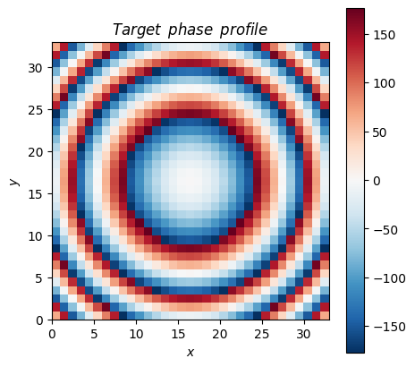
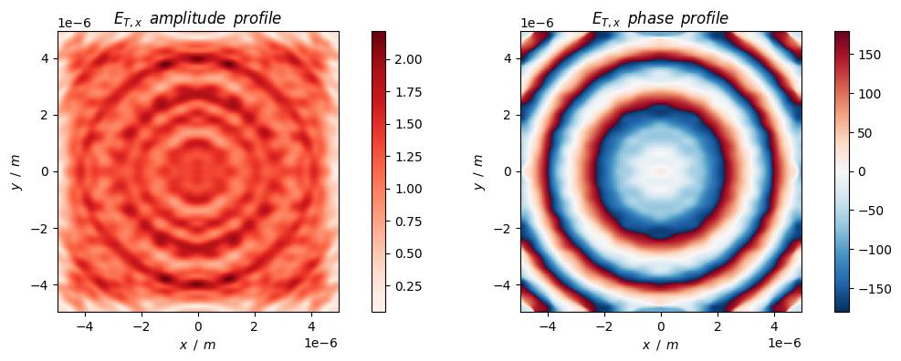
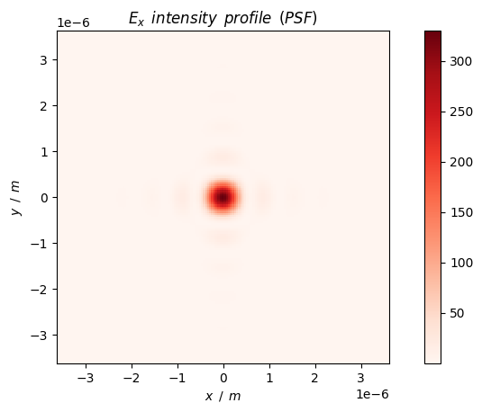
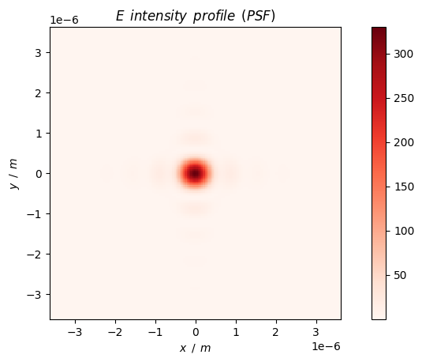
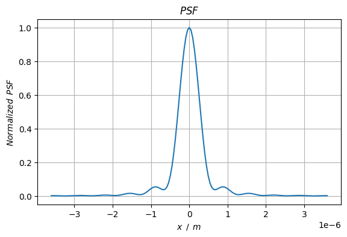
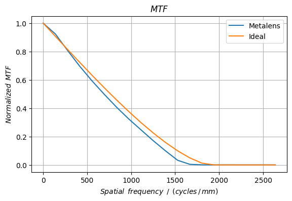
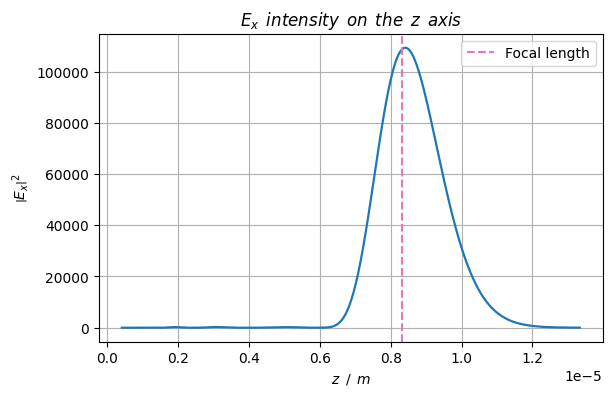

# Metalens design and analysis

A polarization-insensitive metalens based on propagation phase modulation mechanism is designed and analyzed.

## 0. Prepare


```python
import importlib.util
# import lumapi
spec = importlib.util.spec_from_file_location('lumapi', 'D:\\Program Files\\Lumerical\\v232\\api\\python\\lumapi.py')
lumapi = importlib.util.module_from_spec(spec)
spec.loader.exec_module(lumapi)
```


```python
import time
import sys
import numpy as np
import pandas as pd
import matplotlib.pyplot as plt
import scipy.constants as sc
```


```python
# import custom modules
sys.path.append("../module")
from FieldPropagation import fieldPropagationLumapi, em_field
from MetaTool import nk2permittivity, setResources, integrate, phaseDis, phaseNorm
```

## 1. Constants, classes and functions


```python
# colorbar setting
cmap_amp = "Reds"  # amplitude use
cmap_ang = "RdBu_r"  # angle (phase) use
```


```python
# hyperbolic phase distribution
def phi(r, wavelength, focal_length, phi_compensate=0):
    return -2 * np.pi / wavelength * (np.sqrt(r ** 2 + focal_length ** 2) - focal_length) + phi_compensate
```


```python
def getMTF(psf_vec, x_vec, unit="mm"):
    """
    Compute the normalized Modulation Transfer Function (MTF) from the Point Spread Function (PSF)

    @param psf_vec: array-like, intensity values of the PSF
    @param x_vec: array-like, position vector corresponding to the PSF intensity values [meters]
    @param unit: str, unit for frequency ["mm"(cycles per mm) or "um(cycles per um)]. Default: 'mm'
    @returns: frequency array, mtf array: frequency vector in cycles per unit distance, 
    normalized MTF values corresponding to the frequency vector.
    @tip: assume `x_vec` is uniform spacing
    """
    x_vec = np.array(x_vec)

    psf_fft_vec = np.fft.fftshift(np.fft.fft(psf_vec))
    center_idx = round(len(psf_fft_vec) / 2)
    mtf_vec = np.abs(psf_fft_vec) / np.abs(psf_fft_vec[center_idx])  # normalize

    # frequency axis: symmetric about zero
    dx = x_vec[1] - x_vec[0]  # in meters
    nyquist_freq = 0.5 / dx  # cycles/meter
    freq_vec = np.linspace(-nyquist_freq, nyquist_freq, len(x_vec))

    # unit conversion
    if unit == "mm":
        freq_vec = freq_vec / 1e3  # cycles/mm
    elif unit == "um":
        freq_vec = freq_vec / 1e6  # cycles/µm
    else:
        raise ValueError("Unit of frequency must be 'mm' or 'um'.")

    return freq_vec, mtf_vec
```


```python
def getIdealMTF(freq_vec, NA, wavelength, unit="mm"):
    """
    Compute the ideal diffraction-limited MTF for a circular aperture.

    @param freq_vec: frequency vector (cycles per mm or um depending on unit)
    @param NA: numerical aperture
    @param wavelength: wavelength in meters (default 550 nm)
    @param unit: frequency unit used in freq_vec ["mm", "um"]
    @return: ideal MTF array
    """
    # convert cutoff frequency to match freq_vec units
    fc = 2 * NA / wavelength  # in cycles per meter
    if unit == "mm":
        fc /= 1000  # convert to cycles/mm
    elif unit == "um":
        fc /= 1e6   # convert to cycles/µm
    else:
        raise ValueError("Unit must be 'mm' or 'um'.")

    f_norm = np.clip(np.abs(freq_vec) / fc, 0, 1)  # normalized frequency (clipped to 1)
    
    mtf_vec = (2 / np.pi) * (
        np.arccos(f_norm) - f_norm * np.sqrt(1 - f_norm**2)
    )
    mtf_vec[f_norm >= 1] = 0  # set MTF=0 above cutoff

    return mtf_vec
```

## 2. Metalens phase distribution

Here we design a polarization-insensitive metalens using the cylinder meta-atoms. 

In simulation, we use the x-polarized incident light.


```python
# metalens parameters
radius = 5e-6  # metalens radius [m]
na = 0.6  # NA
focal_length = radius / na  # focal length [m]
wavelength = 633e-9  # operating wavelength [m]
unit_size = 300e-9  # unit size [m]
units_rows = int(np.ceil(radius / unit_size)) * 2 - 1  # the number of rows of metasurface units
units_cols = int(np.ceil(radius / unit_size)) * 2 - 1  # the number of columns of metasurface units
offset_x = units_cols / 2 * unit_size - unit_size / 2  # the offset of metasurface in the x direction relative to the center
offset_y = units_rows / 2 * unit_size - unit_size / 2  # the offset of metasurface in the y direction relative to the center

# control parameters
hide = False  # whether to hide GUI or not

# spectral
wavelength_number = 1  # the number of discrete points of the spectral
wavelength_min = wavelength
wavelength_max = wavelength
source_polarization = np.deg2rad(0)  # the angle of polarization to the x axis [rad]

# simulation objects
material_atom = "TiO2"
material_substrate = "Al2O3 - Palik"

separation = wavelength_max / 2  # safe spacing between the objects and simulation boundaries
sep_ub_t = separation  # spacing between upper bound and transmission plane
sep_t_atom = separation  # spacing between transmission plane and atom
sep_interface_source = separation * 0.5  # spacing between interface (atom / substrate) and source
sep_source_lb = separation * 0.5  # spacing between source and lower bound
height_atom = 500e-9  # [m]
height_substrate = separation * 2  # [m]. If 0, no substrate

# simulation size
sim_x_span = unit_size * units_cols
sim_y_span = unit_size * units_rows
sim_z_span = sep_ub_t + sep_t_atom + height_atom + sep_interface_source + sep_source_lb

# boundary conditions: PML / Period / Bloch / (Anti-)Symmetric
boundary_x_min = "PML"
boundary_x_max = "PML"
boundary_y_min = "PML"
boundary_y_max = "PML"
boundary_z_min = "PML"
boundary_z_max = "PML"

# mesh settings (automate mesh)
mesh_accuracy = 2
```


```python
# define target phase distribution for metalens
phase_profile_dest = np.zeros((units_rows, units_cols))
for i in range(units_rows):
    for j in range(units_cols):
        x = j * unit_size - offset_x
        y = i * unit_size - offset_y
        phase_profile_dest[i, j] = phi(np.sqrt(x ** 2 + y ** 2), wavelength, focal_length)

phase_profile_dest = phaseNorm(phase_profile_dest)
```


```python
# draw the target phase profile
fig = plt.figure(figsize=(5, 5))
c = plt.pcolor(np.rad2deg(phase_profile_dest), cmap=cmap_ang)
plt.xlabel("$x$")
plt.ylabel("$y$")
plt.title("$Target \enspace phase \enspace profile$")
fig.colorbar(c)
plt.gca().set_aspect(1)
plt.show()
```


    

    


## 3. Arrangement of library meta-atoms

Here we use the propagation phase meta-atom library built by the notebook `PropagationPhaseMetasurface.ipynb`.


```python
# load library
with open('../data/propagation_library.npy', 'rb') as f:
    radius_vec = np.load(f)
    phase_vec = np.load(f)
    t_vec = np.load(f)
```


```python
def fom(phase_dest, phase, t):
    """ 
    Figure of merit 
    """
    tolerance_phase = np.deg2rad(5)  # phase error we can tolerate considering solving accuracy
    lambda_phase = 2e0  # weight for phase item
    lambda_t = 1e0  # weight for transmittance item
    return phaseDis(phase, phase_dest) * (phaseDis(phase, phase_dest) > tolerance_phase) * lambda_phase + \
        (-1) * t * lambda_t
```


```python
# sort phase and make dictionary of index and order
phase_sort_vec = sorted(enumerate(phase_vec), key=lambda x:x[1])
index_order_dict = {phase_sort_vec[i][0]: i for i in range(len(phase_sort_vec))}
order_index_dict = {i: phase_sort_vec[i][0] for i in range(len(phase_sort_vec))}
```


```python
# choose suitable meta-atom from library
units_pos_r_dict = {}  # dictionary for metasurface units (position and radius)
for i in range(units_rows):
    for j in range(units_cols):
        phase_dest = phase_profile_dest[i, j]
        matched = False
        tolerance = np.deg2rad(15)
        while not matched:
            index_begin = 0
            index_end = len(phase_sort_vec) - 1
            # special cases
            if phase_sort_vec[index_end][1] <= phase_dest - tolerance:
                index_begin = index_end
            elif phase_sort_vec[index_begin][1] >= phase_dest + tolerance:
                index_end = index_begin
            # general case
            else:
                while phase_sort_vec[index_begin][1] < phase_dest - tolerance:
                    index_begin += 1
                while phase_sort_vec[index_end][1] > phase_dest + tolerance:
                    index_end -= 1

            if index_end < index_begin:
                # not matched
                tolerance *= 2
            else:
                # range: [index_begin, index_end]
                fom_min = np.inf
                index_lib_best = 0
                for ii in range(index_begin, index_end + 1, 1):
                    index = order_index_dict[ii]
                    fom_current = fom(phase_dest, phase_vec[index], t_vec[index])
                    if fom_current < fom_min:
                        fom_min = fom_current
                        index_lib_best = index
                units_pos_r_dict[(i, j)] = radius_vec[index_lib_best]
                matched = True
```

## 4. Simulation


```python
# open fdtd
fdtd = lumapi.FDTD(hide=hide)
print(">> Progress: FDTD is opened.")
```

    >> Progress: FDTD is opened.
    


```python
# add material
material_name = "TiO2"
material_df = pd.read_csv("../material/TiO2.csv")
material_np = np.array(material_df)
# obtain the frequency array
wavelength_array = material_np[:, 0] * 1e-6  # [m]
frequency_array = fdtd.c() / wavelength_array
# obtain the complex permittivity array from (n, k)
permittivity_array = nk2permittivity(material_np[:, 1], material_np[:, 2])
# combine
sampled_data = np.vstack((frequency_array, permittivity_array)).T
# add
temp = fdtd.addmaterial("Sampled data")
fdtd.setmaterial(temp, "name", material_name)  # rename the material
fdtd.setmaterial(material_name, "max coefficients", 6)  # set the number of coefficients
fdtd.setmaterial(material_name, "tolerance", 0.01)  # set the tolerance
fdtd.setmaterial(material_name, "color", np.array([255 / 255, 69 / 255, 0 / 255, 1]))
fdtd.setmaterial(material_name, "sampled data", sampled_data)
print(">> Progress: Adding material " + material_name + " is done.")
```

    >> Progress: Adding material TiO2 is done.
    


```python
# resource settings 
parallel_job_number = 1
processes = 6
threads = 1
capacity = 1
job_launching_preset = "Remote: Intel MPI"  # "Remote: Microsoft MPI" / "Remote: Intel MPI"

setResources(fdtd, parallel_job_number=parallel_job_number, processes=processes, \
    threads=threads, capacity=capacity, job_launching_preset=job_launching_preset)
```


```python
# define basic objects
# make sure in layout mode
if fdtd.layoutmode() != 1:  # layoutmode() return 0 when in analysis mode
    fdtd.switchtolayout()

fdtd.deleteall()  # clear objects

# source
source = fdtd.addplane(
    name="source",
    # size
    x=0,
    x_span=sim_x_span,
    y=0,
    y_span=sim_y_span,
    z=-sep_interface_source,
    # propagation direction
    injection_axis="z",
    direction="forward",
    angle_theta=0,
    angle_phi=0,
    amplitude=1,
    # polarization direction
    polarization_angle=np.rad2deg(source_polarization),
    # phase
    phase=0,
    # bandwidth
    wavelength_start=wavelength_min,
    wavelength_stop=wavelength_max,
)

# FDTD
sim_region = fdtd.addfdtd(
    dimension="3D",
    x=0.0,
    x_span=sim_x_span,
    y=0.0,
    y_span=sim_y_span,
    z_min=-(sep_interface_source + sep_source_lb),
    z_max=height_atom + sep_t_atom + sep_ub_t,
    # boundary condition
    x_min_bc=boundary_x_min,
    x_max_bc=boundary_x_max,
    y_min_bc=boundary_y_min,
    y_max_bc=boundary_y_max,
    z_min_bc=boundary_z_min,
    z_max_bc=boundary_z_max,
    pml_layers=8,
    auto_shutoff_min=1e-5,
    mesh_accuracy=mesh_accuracy
)

# monitor
fdtd.setglobalmonitor("frequency points", wavelength_number)  # global settings
power_profile_t = fdtd.addpower(
    name="power profile T",
    monitor_type="2D Z-normal",
    x=0.0,
    x_span=sim_x_span,
    y=0.0,
    y_span=sim_y_span,
    z=height_atom + sep_t_atom,
)

# substrate
substrate = fdtd.addrect(
    name="substrate",
    x=0.0, 
    y=0.0,
    x_span=sim_x_span,
    y_span=sim_y_span,
    z_max=0,
    z_min=-height_substrate,
    material=material_substrate
)
# meta-atoms
atoms = []
for pos in units_pos_r_dict:
    x = pos[1] * unit_size - offset_x
    y = pos[0] * unit_size - offset_y
    r = units_pos_r_dict[pos]
    atoms.append(fdtd.addcircle(
        name="atom_" + str(pos[0]) + "/" + str(pos[1]),
        x=x,
        y=y,
        radius=r,
        z_min=0,
        z_max=height_atom,
        material=material_atom
    ))
```


```python
fdtd.save("../fsp/metalens.fsp")  # save simulation
```


```python
t1 = time.perf_counter()  # begin time count
fdtd.run()  # run
t2 = time.perf_counter()  # end time count
print("Run time cost: {}s.".format(t2 - t1))
```

    Run time cost: 107.02523040000005s.
    

## 5. Near field analysis


```python
# obtain data
mesh_x_vec = fdtd.getdata(power_profile_t.name, 'x')[:, 0]
mesh_y_vec = fdtd.getdata(power_profile_t.name, 'y')[:, 0]
power_profile_t_e = fdtd.getresult(power_profile_t.name, 'E')
e_t_x_mat = power_profile_t_e['E'][:, :, 0, 0, 0]
e_t_y_mat = power_profile_t_e['E'][:, :, 0, 0, 1]
e_t_z_mat = power_profile_t_e['E'][:, :, 0, 0, 2]
t = fdtd.getresult(power_profile_t.name, 'T')['T'][0]
```


```python
# draw the near field distribution
sep = 1  # sample the dense monitor data

fig = plt.figure(figsize=(12, 4))
plt.subplot(1, 2, 1)
c = plt.pcolor(
    mesh_x_vec[::sep],
    mesh_y_vec[::sep],
    np.abs(e_t_x_mat[::sep, ::sep]).T, 
    cmap=cmap_amp
)
fig.colorbar(c)
plt.xlabel(r"$x \enspace / \enspace m$")
plt.ylabel(r"$y \enspace / \enspace m$")
plt.title(r"$E_{T, x} \enspace amplitude \enspace profile$")
plt.axis("scaled")

plt.subplot(1, 2, 2)
c = plt.pcolor(
    mesh_x_vec[::sep],
    mesh_y_vec[::sep],
    np.rad2deg(np.angle(e_t_x_mat[::sep, ::sep])).T, 
    cmap=cmap_ang
)
fig.colorbar(c)
plt.xlabel(r"$x \enspace / \enspace m$")
plt.ylabel(r"$y \enspace / \enspace m$")
plt.title(r"$E_{T, x} \enspace phase \enspace profile$")
plt.axis("scaled")
plt.show()
```


    

    


```python
t
```


    0.821892933638042


## 6. Far field analysis

### 6.1 Field distribution on the focal plane

#### 6.1.1 Field distribution


```python
# define destination region (focus plane)
focus_x_half_span = 3.6e-6  # [m]
focus_y_half_span = 3.6e-6  # [m]
dest_x_vec = np.linspace(-focus_x_half_span, focus_x_half_span, 161)
dest_y_vec = np.linspace(-focus_y_half_span, focus_y_half_span, 161)

# define near field
near_field = em_field(
    [wavelength],
    mesh_x_vec,
    mesh_y_vec,
    [height_atom + sep_t_atom],
    fdtd.getresult(power_profile_t.name, 'E')['E'],
    fdtd.getresult(power_profile_t.name, 'H')['H']
)

# solve far field
# # no down sampling
# fdtd.farfieldsettings("override near field mesh", False)
# down samplint
fdtd.farfieldsettings("override near field mesh", True)  # down sample the near field to speed up far field projections
fdtd.farfieldsettings("near field samples per wavelength", 4)  # if 2, at Nyquist limit

e_far_field_focal = fieldPropagationLumapi(near_field, dest_x_vec, dest_y_vec, \
    [focal_length], wavelength_index_vec=np.arange(0, 1), fdtd=fdtd)
e_far_field_focal_x = e_far_field_focal[:, :, 0, 0, 0]
e_far_field_focal_y = e_far_field_focal[:, :, 0, 1, 0]
e_far_field_focal_z = e_far_field_focal[:, :, 0, 2, 0]
e_far_field_focal_intensity = np.abs(e_far_field_focal_x) ** 2 + np.abs(e_far_field_focal_y) ** 2 + np.abs(e_far_field_focal_z) ** 2
```


```python
# Ex intensity on the focal plane
fig = plt.figure()
c = plt.pcolor(
    dest_x_vec, dest_y_vec, 
    (np.abs(e_far_field_focal_x) ** 2).T, 
    cmap=cmap_amp
)
fig.colorbar(c)
plt.xlabel(r"$x \enspace / \enspace m$")
plt.ylabel(r"$y \enspace / \enspace m$")
plt.title(r"$E_{x} \enspace intensity \enspace profile \enspace (PSF)$")
plt.axis("scaled")
plt.show()
```


    

    


```python
# E intensity on the focal plane
fig = plt.figure()
c = plt.pcolor(
    dest_x_vec, dest_y_vec, 
    e_far_field_focal_intensity.T, 
    cmap=cmap_amp
)
fig.colorbar(c)
plt.xlabel(r"$x \enspace / \enspace m$")
plt.ylabel(r"$y \enspace / \enspace m$")
plt.title(r"$E \enspace intensity \enspace profile \enspace (PSF)$")
plt.axis("scaled")
plt.show()
```


    

    


#### 6.1.2 Efficiency calculation


```python
# calculate the focusing efficiency and diffraction efficiency
# calculate the light power on the transmittance monitor
power_output = integrate(
    1 / 2 * np.sqrt(sc.epsilon_0 / sc.mu_0) * (np.abs(e_t_x_mat) ** 2 + np.abs(e_t_y_mat) ** 2 + np.abs(e_t_z_mat) ** 2), 
    mesh_x_vec, 
    mesh_y_vec
)
# calculate the incident light power
power_input = power_output / t

# calculate the light power in the effective focusing region
airy_radius = 0.61 * wavelength / na  # radius of airy spot
focus_radius = 3 * airy_radius  # radius of the effective focusing region
power_focus = integrate(
    1 / 2 * np.sqrt(sc.epsilon_0 / sc.mu_0) * 
    (np.abs(e_far_field_focal_x) ** 2 + np.abs(e_far_field_focal_y) ** 2 + np.abs(e_far_field_focal_z) ** 2), 
    dest_x_vec, 
    dest_y_vec,
    focus_radius
)

# calculate the light power in the full region
power_diffraction = integrate(
    1 / 2 * np.sqrt(sc.epsilon_0 / sc.mu_0) * 
    (np.abs(e_far_field_focal_x) ** 2 + np.abs(e_far_field_focal_y) ** 2 + np.abs(e_far_field_focal_z) ** 2), 
    dest_x_vec, 
    dest_y_vec
)

# calculate the efficiencies
efficiency_focal_relative = power_focus / power_output  # relative focusing efficiency
efficiency_focal_absolute = power_focus / power_input  # absolute focusing efficiency
efficiency_diffraction_relative = power_diffraction / power_output  # relative diffraction efficiency
efficiency_diffraction_absolute = power_diffraction / power_input  # absolute diffraction efficiency
```


```python
# print the result
print("Relative focusing efficiency = {:.2f}%, absolute focusing efficiency = {:.2f}%".format(
    efficiency_focal_relative * 1e2, efficiency_focal_absolute * 1e2
))
print("Relative diffraction efficiency = {:.2f}%, absolute diffraction efficiency = {:.2f}%".format(
    efficiency_diffraction_relative * 1e2, efficiency_diffraction_absolute * 1e2
))
```

    Relative focusing efficiency = 83.38%, absolute focusing efficiency = 68.53%
    Relative diffraction efficiency = 87.41%, absolute diffraction efficiency = 71.84%
    

#### 6.1.3 MTF calculation

> Method 1


```python
# solve MTF of PSF(x) along the x axis when y = 0
psf_vec  = e_far_field_focal_intensity[:, round(len(dest_y_vec) / 2)]
freq_vec, mtf_vec = getMTF(psf_vec, dest_x_vec, "mm")
```


```python
# solve ideal MTF
mtf_ideal_vec = getIdealMTF(freq_vec, na, wavelength, unit="mm")
```


```python
# draw 1D PSF
plt.figure(figsize=(6.5, 4))
plt.plot(dest_x_vec, psf_vec / np.max(psf_vec))
plt.title(r"$PSF$")
plt.xlabel(r"$x \enspace / \enspace m$")
plt.ylabel(r"$Normalized \enspace PSF$")
plt.grid()
plt.show()
```


    

    


```python
plt.figure(figsize=(6.5, 4))
index_begin = round(len(dest_x_vec) / 2)
index_end = index_begin + 20
plt.plot(freq_vec[index_begin:index_end], mtf_vec[index_begin:index_end], label="Metalens")
plt.plot(freq_vec[index_begin:index_end], mtf_ideal_vec[index_begin:index_end], label="Ideal")
# plt.plot(freq_vec, mtf_vec)
plt.title(r"$MTF$")
plt.xlabel(r"$Spatial \enspace frequency \enspace / \enspace (cycles\, / \, mm)$")
plt.ylabel(r"$Normalized \enspace MTF$")
plt.grid()
plt.legend()
plt.show()
```


    

    


> Method 2


```python
fdtd.zbfwrite("../data/metalens.zbf", near_field.toFdtdDataset())
```

We can import the `zbf` file above to OpticStudio (Zemax) 
and use the POP tool in OpticStudio to analyze the propagation of the imported beam from the previous near field results 
(including the calculation of MTF). 

See [Lumerical FDTD Demo](https://optics.ansys.com/hc/en-us/articles/360042097313-Small-Scale-Metalens-Field-Propagation) 
for details.

### 6.2 Field distribution on the z axis


```python
dest_z_vec = np.linspace(focal_length * 0.05, focal_length * 1.6, 400)

# define near field
near_field = em_field(
    [wavelength],
    mesh_x_vec,
    mesh_y_vec,
    [height_atom + sep_t_atom],
    fdtd.getresult(power_profile_t.name, 'E')['E'],
    fdtd.getresult(power_profile_t.name, 'H')['H']
)

# solve far field
# # no down sampling
# fdtd.farfieldsettings("override near field mesh", False)
# down samplint
fdtd.farfieldsettings("override near field mesh", True)  # down sample the near field to speed up far field projections
fdtd.farfieldsettings("near field samples per wavelength", 4)  # if 2, at Nyquist limit

e_far_field_axis = fieldPropagationLumapi(near_field, [0], [0], \
    dest_z_vec, wavelength_index_vec=np.arange(0, 1), fdtd=fdtd)
e_far_field_axis_x = e_far_field_axis[0, 0, :, 0, 0]
e_far_field_axis_y = e_far_field_axis[0, 0, :, 1, 0]
e_far_field_axis_z = e_far_field_axis[0, 0, :, 2, 0]
```


```python
plt.figure(figsize=(6.5, 4))
plt.plot(
    dest_z_vec, 
    np.abs(e_far_field_axis_x ** 2) ** 2,
    linestyle="-", color="tab:blue", linewidth=1.6, marker=".", markersize=0)
plt.axvline(focal_length, color="tab:pink", linestyle="--", label="Focal length")
plt.xlabel(r"$z \enspace / \enspace m$")
plt.ylabel(r"$\left|E_{x}\right|^2$")
plt.title(r"$E_x \enspace intensity \enspace on \enspace the \enspace z \enspace axis$")
plt.legend()
plt.grid()
plt.show()
```


    

    


```python
# # close FDTD
# fdtd.close()
```


```python

```
